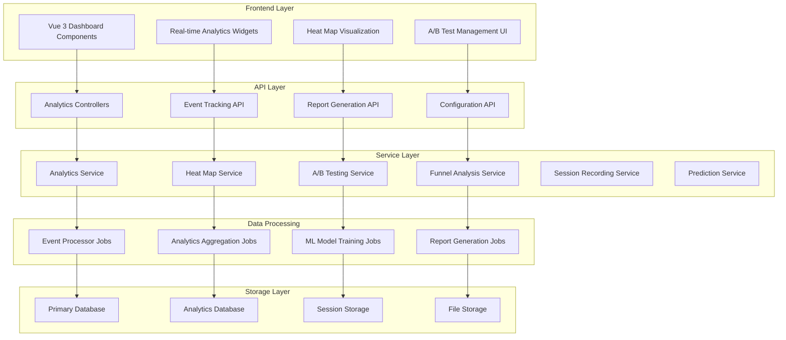

# Advanced Analytics System Design

## Overview

The Advanced Analytics System is a comprehensive user behavior analysis platform that provides heat mapping, A/B testing, conversion funnel analysis, session recordings, and predictive analytics capabilities. Building upon the existing 98% complete analytics foundation in the Alumate platform, this system extends the current capabilities with advanced user behavior tracking, conversion optimization, and predictive career analytics.

The system is designed to integrate seamlessly with the existing Laravel 12 multi-tenant architecture while providing real-time insights and privacy-compliant data collection. It leverages the platform's existing analytics infrastructure including the 15+ chart types, real-time performance monitoring, and predictive analytics with 75% job placement accuracy.

The system will be built as a modular enhancement to the existing alumni tracking platform, extending the current analytics service layer, queue system, and WebSocket/Pusher real-time capabilities. It will provide both API endpoints for programmatic access and Vue 3 components for interactive dashboards, building upon the existing comprehensive reporting system.

## Architecture

### High-Level Architecture



### Data Flow Architecture

The system follows an event-driven architecture where user interactions are captured, processed asynchronously, and aggregated for analysis:

1. **Event Capture**: JavaScript tracking code captures user interactions
2. **Event Processing**: Laravel jobs process events asynchronously
3. **Data Aggregation**: Scheduled jobs aggregate data for reporting
4. **Real-time Updates**: Broadcasting provides live dashboard updates
5. **Machine Learning**: Background jobs train predictive models

### Multi-Tenant Considerations

The analytics system will respect the existing tenant isolation:
- All analytics data will be scoped to the current tenant
- Database tables will include tenant_id columns
- Service classes will automatically filter by tenant context
- API endpoints will enforce tenant-based access control

## Components and Interfaces

### Core Models

#### AnalyticsEvent Model
```php
class AnalyticsEvent extends Model
{
    protected $fillable = [
        'tenant_id',
        'session_id',
        'user_id',
        'event_type',
        'event_data',
        'page_url',
        'user_agent',
        'ip_address',
        'timestamp'
    ];

    protected $casts = [
        'event_data' => 'array',
        'timestamp' => 'datetime'
    ];
}
```

#### HeatMapData Model
```php
class HeatMapData extends Model
{
    protected $fillable = [
        'tenant_id',
        'page_url',
        'element_selector',
        'interaction_type',
        'x_coordinate',
        'y_coordinate',
        'viewport_width',
        'viewport_height',
        'device_type'
    ];
}
```

#### ABTest Model
```php
class ABTest extends Model
{
    protected $fillable = [
        'tenant_id',
        'name',
        'description',
        'status',
        'variants',
        'traffic_allocation',
        'conversion_goal',
        'start_date',
        'end_date',
        'statistical_significance'
    ];

    protected $casts = [
        'variants' => 'array',
        'traffic_allocation' => 'array',
        'start_date' => 'datetime',
        'end_date' => 'datetime'
    ];
}
```

#### ConversionFunnel Model
```php
class ConversionFunnel extends Model
{
    protected $fillable = [
        'tenant_id',
        'name',
        'steps',
        'conversion_window_hours'
    ];

    protected $casts = [
        'steps' => 'array'
    ];
}
```

#### SessionRecording Model
```php
class SessionRecording extends Model
{
    protected $fillable = [
        'tenant_id',
        'session_id',
        'user_id',
        'recording_data',
        'duration_seconds',
        'page_views',
        'interactions_count',
        'privacy_masked'
    ];

    protected $casts = [
        'recording_data' => 'array',
        'privacy_masked' => 'boolean'
    ];
}
```

#### CareerAnalytics Model
```php
class CareerAnalytics extends Model
{
    protected $fillable = [
        'tenant_id',
        'user_id',
        'career_stage',
        'skills_data',
        'prediction_score',
        'market_demand_score',
        'salary_benchmark',
        'career_path_recommendations',
        'skills_gap_analysis'
    ];

    protected $casts = [
        'skills_data' => 'array',
        'career_path_recommendations' => 'array',
        'skills_gap_analysis' => 'array'
    ];
}
```

#### LearningAnalytics Model
```php
class LearningAnalytics extends Model
{
    protected $fillable = [
        'tenant_id',
        'user_id',
        'course_id',
        'completion_rate',
        'engagement_score',
        'time_spent_minutes',
        'assessment_scores',
        'learning_path_progress',
        'certification_status'
    ];

    protected $casts = [
        'assessment_scores' => 'array',
        'learning_path_progress' => 'array'
    ];
}
```

#### GamificationAnalytics Model
```php
class GamificationAnalytics extends Model
{
    protected $fillable = [
        'tenant_id',
        'user_id',
        'achievement_id',
        'points_earned',
        'engagement_level',
        'social_sharing_count',
        'leaderboard_position',
        'completion_time_seconds'
    ];
}
```

### Service Classes

#### AnalyticsService
Primary service for coordinating analytics operations:
- Event tracking and validation
- Data aggregation coordination
- Report generation orchestration
- Integration with external platforms

#### HeatMapService
Specialized service for heat map functionality:
- Click and scroll tracking
- Heat map data aggregation
- Visualization data preparation
- Device and audience segmentation

#### ABTestingService
Manages A/B testing lifecycle:
- Test creation and configuration
- Traffic allocation and variant assignment
- Statistical significance calculation
- Winner determination and confidence intervals

#### FunnelAnalysisService
Handles conversion funnel analysis:
- Funnel step tracking
- Drop-off rate calculation
- Bottleneck identification
- Segmentation analysis

#### SessionRecordingService
Manages session recording functionality:
- Recording data capture and storage
- Privacy compliance and masking
- Playback data preparation
- Session analysis and insights

#### PredictionService
Provides predictive analytics capabilities building on existing 75% accurate job placement prediction:
- Conversion probability scoring for landing pages
- Career trajectory prediction enhancement
- Skills gap analysis and learning recommendations
- Market demand forecasting integration
- Machine learning model management
- Prediction accuracy tracking
- Model retraining coordination
- Economic impact prediction on career choices

#### CareerAnalyticsService
Specialized service for career-focused analytics:
- Career stage progression tracking
- Skills development analytics
- Salary benchmarking and trend analysis
- Career path recommendation optimization
- Professional development ROI measurement
- Industry trend integration

#### LearningAnalyticsService
Manages learning and development analytics:
- Course completion and engagement tracking
- Skills assessment analytics
- Learning path effectiveness measurement
- Certification verification analytics
- Professional development progress tracking
- Micro-learning engagement analysis

#### GamificationAnalyticsService
Handles gamification and engagement analytics:
- Achievement completion tracking
- Points and leaderboard analytics
- Social sharing and engagement metrics
- Gamification effectiveness measurement
- User motivation pattern analysis
- Community engagement optimization

### API Controllers

#### AnalyticsController
```php
class AnalyticsController extends Controller
{
    public function trackEvent(TrackEventRequest $request): JsonResponse
    public function getDashboardData(DashboardRequest $request): JsonResponse
    public function generateReport(ReportRequest $request): JsonResponse
    public function getInsights(InsightsRequest $request): JsonResponse
}
```

#### HeatMapController
```php
class HeatMapController extends Controller
{
    public function getHeatMapData(HeatMapRequest $request): JsonResponse
    public function getRecommendations(string $pageUrl): JsonResponse
}
```

#### ABTestController
```php
class ABTestController extends Controller
{
    public function index(): JsonResponse
    public function store(CreateABTestRequest $request): JsonResponse
    public function show(ABTest $test): JsonResponse
    public function update(UpdateABTestRequest $request, ABTest $test): JsonResponse
    public function getResults(ABTest $test): JsonResponse
}
```

### Frontend Components

#### AnalyticsDashboard.vue
Main dashboard component providing:
- Real-time metrics display
- Customizable widget layout
- Time range filtering
- Alert notifications

#### HeatMapVisualization.vue
Interactive heat map component:
- Overlay heat map data on page screenshots
- Device type filtering
- Interaction type toggles
- Recommendation display

#### ABTestManager.vue
A/B test management interface:
- Test creation and configuration
- Results visualization
- Statistical significance indicators
- Winner declaration controls

#### FunnelAnalyzer.vue
Conversion funnel analysis component:
- Step-by-step funnel visualization
- Drop-off rate highlighting
- Segmentation controls
- Optimization suggestions

#### SessionPlayer.vue
Session recording playback component:
- Video-like playback controls
- Speed adjustment
- Event timeline
- Annotation capabilities

## Data Models

### Event Tracking Schema

The system uses a flexible event schema that can accommodate various interaction types:

```json
{
  "event_type": "page_view|click|scroll|form_submit|custom",
  "timestamp": "2025-01-23T10:30:00Z",
  "session_id": "uuid",
  "user_id": "optional_uuid",
  "page_url": "/landing-page",
  "event_data": {
    "element_selector": ".cta-button",
    "element_text": "Sign Up Now",
    "x_coordinate": 150,
    "y_coordinate": 300,
    "viewport_width": 1920,
    "viewport_height": 1080,
    "scroll_depth": 75,
    "form_fields": ["email", "name"],
    "custom_properties": {}
  },
  "user_agent": "Mozilla/5.0...",
  "ip_address": "192.168.1.1",
  "device_type": "desktop|mobile|tablet",
  "traffic_source": "organic|paid|direct|referral"
}
```

### Heat Map Data Structure

Heat map data is stored with precise coordinate information and contextual metadata:

```json
{
  "page_url": "/landing-page",
  "interactions": [
    {
      "type": "click|hover|scroll",
      "x": 150,
      "y": 300,
      "element_selector": ".cta-button",
      "timestamp": "2025-01-23T10:30:00Z",
      "viewport_dimensions": {
        "width": 1920,
        "height": 1080
      },
      "device_type": "desktop",
      "user_segment": "returning_visitor"
    }
  ]
}
```

### A/B Test Configuration

A/B tests are configured with flexible variant definitions and conversion tracking:

```json
{
  "name": "Landing Page CTA Test",
  "variants": [
    {
      "id": "control",
      "name": "Original Button",
      "traffic_percentage": 50,
      "changes": []
    },
    {
      "id": "variant_a",
      "name": "Green Button",
      "traffic_percentage": 50,
      "changes": [
        {
          "selector": ".cta-button",
          "property": "background-color",
          "value": "#28a745"
        }
      ]
    }
  ],
  "conversion_goal": {
    "type": "event",
    "event_name": "form_submit",
    "page_url": "/thank-you"
  },
  "statistical_settings": {
    "confidence_level": 95,
    "minimum_sample_size": 1000,
    "minimum_effect_size": 0.05
  }
}
```

## Error Handling

### Client-Side Error Handling

The JavaScript tracking code implements robust error handling:
- Network failure retry logic with exponential backoff
- Local storage fallback for offline scenarios
- Graceful degradation when tracking fails
- Error reporting to monitoring systems

### Server-Side Error Handling

Laravel services implement comprehensive error handling:
- Database transaction rollbacks for data consistency
- Queue job retry mechanisms with dead letter queues
- Validation error responses with detailed messages
- Logging integration for debugging and monitoring

### Privacy and Compliance Errors

Special handling for privacy-related scenarios:
- Consent withdrawal processing
- Data deletion request handling
- Geographic restriction compliance
- Age verification failures

## Testing Strategy

### Unit Testing

Each service class will have comprehensive unit tests covering:
- Event processing logic
- Statistical calculations
- Data aggregation algorithms
- Privacy compliance functions

Example test structure:
```php
describe('AnalyticsService', function () {
    it('processes page view events correctly', function () {
        // Test event processing logic
    });
    
    it('respects tenant isolation', function () {
        // Test multi-tenant data separation
    });
    
    it('handles invalid event data gracefully', function () {
        // Test error handling
    });
});
```

### Feature Testing

API endpoints will be tested with realistic scenarios:
- Event tracking with various payload types
- Dashboard data retrieval with filtering
- A/B test lifecycle management
- Heat map data aggregation

### Integration Testing

End-to-end testing will cover:
- JavaScript tracking to database storage
- Real-time dashboard updates
- External platform integrations
- Privacy compliance workflows

### Performance Testing

Load testing will validate:
- High-volume event ingestion
- Real-time dashboard responsiveness
- Large dataset query performance
- Concurrent user handling

## Privacy and Compliance

### GDPR Compliance

The system implements comprehensive GDPR compliance:
- Explicit consent collection and management
- Data minimization principles
- Right to access and portability
- Right to erasure (right to be forgotten)
- Data processing lawfulness documentation

### CCPA Compliance

California Consumer Privacy Act compliance includes:
- Consumer rights disclosure
- Opt-out mechanisms for data sale
- Data category and purpose transparency
- Third-party data sharing controls

### Technical Privacy Measures

- IP address anonymization and hashing
- Personal data pseudonymization
- Automatic data retention policies
- Secure data transmission (HTTPS/TLS)
- Database encryption at rest

### Consent Management

The system integrates with consent management platforms:
- Dynamic consent collection based on jurisdiction
- Granular consent categories (analytics, marketing, etc.)
- Consent withdrawal processing
- Audit trail for compliance reporting

## Performance Considerations

### Event Processing Optimization

- Asynchronous event processing using Laravel queues
- Batch processing for high-volume scenarios
- Database indexing strategy for time-series data
- Data partitioning for large datasets

### Real-Time Dashboard Performance

- Redis caching for frequently accessed metrics
- WebSocket connections for live updates
- Efficient database queries with proper indexing
- Client-side data caching and pagination

### Storage Optimization

- Data compression for session recordings
- Automated data archiving policies
- Efficient file storage for heat map screenshots
- Database query optimization and monitoring

### Scalability Architecture

- Horizontal scaling support for queue workers
- Database read replica configuration
- CDN integration for static assets
- Load balancing for high-traffic scenarios

## Integration Points

### External Analytics Platforms

The system provides seamless integration with major analytics platforms:

#### Google Analytics Integration
- Event forwarding with consistent naming
- Custom dimension mapping
- Goal and conversion synchronization
- Audience segment sharing

#### Adobe Analytics Integration
- eVar and prop mapping
- Processing rule compatibility
- Data feed synchronization
- Segment builder integration

### Existing Platform Integration

Building upon the platform's existing integrations:

#### CRM Integration Enhancement
Extending the existing multi-platform CRM connectivity (HubSpot, Salesforce, Frappe, Zoho):
- Enhanced lead scoring with behavioral analytics
- Advanced conversion tracking integration
- Behavioral trigger automation
- Customer journey mapping with analytics data
- Attribution data sharing with CRM systems

#### AI/ML System Integration
Leveraging existing AI/ML infrastructure:
- Integration with current job placement prediction models (75% accuracy)
- Enhancement of existing skills-based matching algorithms
- Career path prediction data integration
- Alumni recommendation engine data sharing

#### Real-Time System Integration
Building on existing WebSocket/Pusher infrastructure:
- Real-time analytics dashboard updates
- Live conversion tracking notifications
- A/B test result broadcasting
- Heat map data streaming

### Email Marketing Platforms

Behavioral data sharing for personalization:
- Engagement scoring
- Segmentation criteria
- Trigger-based campaigns
- A/B test result integration

### Learning Management Integration

Supporting the roadmap's Phase 2 learning management system:
- Skills assessment analytics integration
- Learning progress tracking
- Professional development analytics
- Certification completion tracking

## Security Considerations

### Data Protection

- End-to-end encryption for sensitive data
- Role-based access control for analytics data
- API rate limiting and authentication
- Audit logging for data access

### Privacy by Design

- Minimal data collection principles
- Automatic data anonymization
- Configurable retention periods
- Transparent data usage policies

### Infrastructure Security

- Secure API endpoints with authentication
- Database access controls and monitoring
- Regular security audits and updates
- Incident response procedures

## Roadmap Alignment and Future Enhancements

### Phase 1 Integration (Q4 2025)
The Advanced Analytics System aligns with the platform's immediate enhancement roadmap:

#### Enhanced Mobile Experience
- Mobile-optimized analytics dashboards
- Touch-friendly heat map interactions
- Mobile conversion funnel analysis
- PWA analytics tracking enhancements

#### Advanced Gamification Analytics
- Achievement completion tracking
- Engagement pattern analysis for gamification optimization
- Leaderboard performance analytics
- Social sharing conversion tracking

### Phase 2 Strategic Enhancements (Q1 2026)

#### Learning Management Analytics
Supporting the comprehensive learning management system:
- Skills assessment completion analytics
- Learning path effectiveness tracking
- Certification verification analytics
- Professional development ROI measurement

#### Digital Portfolio Analytics
Analytics for the portfolio and showcase platform:
- Portfolio view and engagement tracking
- Project showcase performance metrics
- Professional video introduction analytics
- Achievement verification tracking

### Phase 3 Advanced Features (Q2-Q3 2026)

#### Enhanced AI Career Intelligence
Building upon existing 75% accurate job placement prediction:
- Salary benchmarking analytics integration
- Career path prediction enhancement
- Skills gap analysis with learning recommendations
- Industry trend analysis and career pivoting insights
- Personalized career coaching effectiveness tracking

#### Blockchain Credential Analytics
Supporting blockchain credential verification:
- Credential verification tracking
- Achievement authenticity analytics
- Decentralized identity usage patterns
- Smart contract interaction analytics

### Phase 4 Innovation Features (Q4 2026)

#### Predictive Career Analytics
Advanced ML models for career trajectory prediction:
- Market demand forecasting analytics
- Economic impact prediction tracking
- Real-time job market data integration
- Career pivot success rate analysis

#### Virtual Reality Networking Analytics
Analytics for VR-enabled experiences:
- VR career fair engagement tracking
- Virtual networking effectiveness metrics
- 3D campus reunion participation analytics
- VR interview practice performance tracking

### Technical Roadmap Integration

#### Performance Optimization
- Analytics query optimization strategies
- Real-time dashboard performance enhancements
- CDN integration for analytics assets
- Load balancing for high-traffic analytics scenarios

#### Security Enhancements
- Advanced authentication for analytics access
- End-to-end encryption for sensitive analytics data
- GDPR, CCPA, and SOC 2 compliance for analytics
- Real-time threat detection for analytics endpoints

#### Scalability Improvements
- Microservices architecture for analytics components
- Event-driven analytics data processing
- Enhanced real-time capabilities for analytics
- API gateway integration for analytics endpoints

This design provides a comprehensive foundation for implementing the Advanced Analytics System while maintaining compatibility with the existing Laravel architecture and ensuring privacy compliance. The modular approach allows for incremental development and testing of individual components, with clear alignment to the platform's strategic roadmap through 2026.