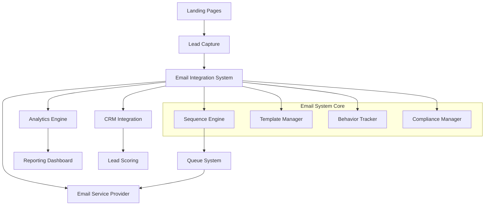

# Email Integration System Design

## Overview

The Email Integration System provides automated email marketing and lead nurturing capabilities for the Alumni Tracking System. It enables personalized, behavior-triggered email campaigns that guide leads through conversion funnels while maintaining compliance and providing comprehensive analytics.

The system integrates seamlessly with existing CRM functionality and landing page analytics to create a complete marketing automation platform. It supports multi-tenant architecture with audience-specific templates and automated workflows.

## Architecture

### High-Level Architecture



### System Components

1. **Email Sequence Engine**: Manages automated email workflows and timing
2. **Template Management System**: Handles audience-specific email templates and branding
3. **Behavior Tracking Service**: Monitors user interactions and triggers appropriate responses
4. **Compliance Manager**: Ensures GDPR/CAN-SPAM compliance and manages preferences
5. **Analytics Engine**: Tracks performance metrics and provides optimization insights
6. **CRM Integration Layer**: Synchronizes email activity with existing CRM systems

## Components and Interfaces

### Core Models

#### EmailSequence Model
```php
class EmailSequence extends Model
{
    protected $fillable = [
        'name',
        'description',
        'audience_type', // individual, institutional, employer
        'trigger_type', // form_submission, page_visit, behavior
        'is_active',
        'tenant_id'
    ];

    public function emails(): HasMany
    {
        return $this->hasMany(SequenceEmail::class);
    }

    public function enrollments(): HasMany
    {
        return $this->hasMany(SequenceEnrollment::class);
    }
}
```

#### SequenceEmail Model
```php
class SequenceEmail extends Model
{
    protected $fillable = [
        'sequence_id',
        'template_id',
        'subject_line',
        'delay_hours',
        'send_order',
        'trigger_conditions'
    ];

    protected $casts = [
        'trigger_conditions' => 'array'
    ];
}
```

#### EmailTemplate Model
```php
class EmailTemplate extends Model
{
    protected $fillable = [
        'name',
        'audience_type',
        'subject_template',
        'html_content',
        'text_content',
        'variables',
        'tenant_id'
    ];

    protected $casts = [
        'variables' => 'array'
    ];
}
```

#### SequenceEnrollment Model
```php
class SequenceEnrollment extends Model
{
    protected $fillable = [
        'sequence_id',
        'lead_id',
        'current_step',
        'status', // active, completed, paused, unsubscribed
        'enrolled_at',
        'completed_at'
    ];

    protected $casts = [
        'enrolled_at' => 'datetime',
        'completed_at' => 'datetime'
    ];
}
```

### Service Classes

#### EmailSequenceService
Handles sequence creation, enrollment, and progression logic.

```php
class EmailSequenceService
{
    public function enrollLead(Lead $lead, EmailSequence $sequence): SequenceEnrollment
    public function processNextEmail(SequenceEnrollment $enrollment): void
    public function pauseEnrollment(SequenceEnrollment $enrollment): void
    public function completeEnrollment(SequenceEnrollment $enrollment): void
}
```

#### BehaviorTrackingService
Monitors user actions and triggers appropriate email responses.

```php
class BehaviorTrackingService
{
    public function trackPageVisit(Lead $lead, string $page): void
    public function trackFormAbandonment(Lead $lead, string $formId): void
    public function trackResourceDownload(Lead $lead, string $resourceId): void
    public function evaluateTriggers(Lead $lead): array
}
```

#### EmailTemplateService
Manages template creation, personalization, and rendering.

```php
class EmailTemplateService
{
    public function renderTemplate(EmailTemplate $template, Lead $lead): string
    public function personalizeContent(string $content, Lead $lead): string
    public function validateTemplate(EmailTemplate $template): array
}
```

### API Endpoints

#### Sequence Management
- `GET /api/email-sequences` - List sequences
- `POST /api/email-sequences` - Create sequence
- `PUT /api/email-sequences/{id}` - Update sequence
- `DELETE /api/email-sequences/{id}` - Delete sequence

#### Template Management
- `GET /api/email-templates` - List templates
- `POST /api/email-templates` - Create template
- `PUT /api/email-templates/{id}` - Update template

#### Analytics
- `GET /api/email-analytics/performance` - Campaign performance metrics
- `GET /api/email-analytics/funnel` - Email-to-conversion funnel data

## Data Models

### Database Schema

#### email_sequences
```sql
CREATE TABLE email_sequences (
    id BIGINT PRIMARY KEY,
    tenant_id BIGINT NOT NULL,
    name VARCHAR(255) NOT NULL,
    description TEXT,
    audience_type ENUM('individual', 'institutional', 'employer'),
    trigger_type ENUM('form_submission', 'page_visit', 'behavior', 'manual'),
    trigger_conditions JSON,
    is_active BOOLEAN DEFAULT true,
    created_at TIMESTAMP,
    updated_at TIMESTAMP,
    INDEX idx_tenant_audience (tenant_id, audience_type),
    INDEX idx_active (is_active)
);
```

#### sequence_emails
```sql
CREATE TABLE sequence_emails (
    id BIGINT PRIMARY KEY,
    sequence_id BIGINT NOT NULL,
    template_id BIGINT NOT NULL,
    subject_line VARCHAR(255),
    delay_hours INT DEFAULT 0,
    send_order INT NOT NULL,
    trigger_conditions JSON,
    created_at TIMESTAMP,
    updated_at TIMESTAMP,
    FOREIGN KEY (sequence_id) REFERENCES email_sequences(id) ON DELETE CASCADE,
    INDEX idx_sequence_order (sequence_id, send_order)
);
```

#### email_templates
```sql
CREATE TABLE email_templates (
    id BIGINT PRIMARY KEY,
    tenant_id BIGINT NOT NULL,
    name VARCHAR(255) NOT NULL,
    audience_type ENUM('individual', 'institutional', 'employer'),
    subject_template VARCHAR(255),
    html_content LONGTEXT,
    text_content LONGTEXT,
    variables JSON,
    is_active BOOLEAN DEFAULT true,
    created_at TIMESTAMP,
    updated_at TIMESTAMP,
    INDEX idx_tenant_audience (tenant_id, audience_type)
);
```

#### sequence_enrollments
```sql
CREATE TABLE sequence_enrollments (
    id BIGINT PRIMARY KEY,
    sequence_id BIGINT NOT NULL,
    lead_id BIGINT NOT NULL,
    current_step INT DEFAULT 0,
    status ENUM('active', 'completed', 'paused', 'unsubscribed') DEFAULT 'active',
    enrolled_at TIMESTAMP,
    completed_at TIMESTAMP NULL,
    created_at TIMESTAMP,
    updated_at TIMESTAMP,
    FOREIGN KEY (sequence_id) REFERENCES email_sequences(id),
    FOREIGN KEY (lead_id) REFERENCES leads(id),
    UNIQUE KEY unique_enrollment (sequence_id, lead_id),
    INDEX idx_status (status),
    INDEX idx_next_send (status, current_step)
);
```

#### email_sends
```sql
CREATE TABLE email_sends (
    id BIGINT PRIMARY KEY,
    enrollment_id BIGINT NOT NULL,
    sequence_email_id BIGINT NOT NULL,
    lead_id BIGINT NOT NULL,
    subject VARCHAR(255),
    status ENUM('queued', 'sent', 'delivered', 'bounced', 'failed'),
    sent_at TIMESTAMP NULL,
    delivered_at TIMESTAMP NULL,
    opened_at TIMESTAMP NULL,
    clicked_at TIMESTAMP NULL,
    unsubscribed_at TIMESTAMP NULL,
    created_at TIMESTAMP,
    updated_at TIMESTAMP,
    FOREIGN KEY (enrollment_id) REFERENCES sequence_enrollments(id),
    INDEX idx_lead_status (lead_id, status),
    INDEX idx_performance (sent_at, opened_at, clicked_at)
);
```

### Relationships

- EmailSequence hasMany SequenceEmails
- EmailSequence hasMany SequenceEnrollments
- SequenceEmail belongsTo EmailTemplate
- SequenceEnrollment belongsTo Lead
- SequenceEnrollment hasMany EmailSends
- Lead hasMany SequenceEnrollments

## Error Handling

### Email Delivery Failures
- **Bounce Handling**: Automatically pause enrollments for hard bounces
- **Retry Logic**: Implement exponential backoff for temporary failures
- **Fallback Templates**: Use plain text versions when HTML fails
- **Provider Failover**: Switch to backup email service if primary fails

### Data Validation
- **Template Validation**: Ensure required variables are present
- **Sequence Logic**: Validate email order and timing constraints
- **Compliance Checks**: Verify unsubscribe links and required headers

### System Resilience
- **Queue Monitoring**: Alert on queue backup or processing delays
- **Rate Limiting**: Respect email provider sending limits
- **Circuit Breaker**: Temporarily disable sequences with high failure rates

## Testing Strategy

### Unit Tests
- EmailSequenceService methods for enrollment and progression
- BehaviorTrackingService trigger evaluation logic
- EmailTemplateService personalization and rendering
- Compliance validation methods

### Integration Tests
- End-to-end sequence enrollment and email sending
- CRM synchronization workflows
- Analytics data collection and reporting
- Multi-tenant data isolation

### Feature Tests
- API endpoints for sequence and template management
- Webhook handling for email provider callbacks
- User preference and unsubscribe workflows
- Performance analytics calculations

### Performance Tests
- High-volume email queue processing
- Template rendering with large datasets
- Analytics query performance with historical data
- Concurrent enrollment processing

## Implementation Considerations

### Email Service Provider Integration
**Decision**: Use Laravel's Mail system with configurable drivers (Mailgun, SendGrid, SES)
**Rationale**: Provides flexibility and allows easy switching between providers while maintaining consistent interface

### Queue System Design
**Decision**: Use Redis-backed queues with job batching for email sends
**Rationale**: Ensures reliable delivery, enables rate limiting, and provides better monitoring capabilities

### Template Engine
**Decision**: Use Blade templating with custom variable injection
**Rationale**: Leverages existing Laravel infrastructure while providing secure variable handling

### Behavior Tracking
**Decision**: Event-driven architecture using Laravel Events and Listeners
**Rationale**: Decouples tracking from core application logic and enables easy extension

### Compliance Management
**Decision**: Built-in preference center with granular subscription controls
**Rationale**: Ensures GDPR compliance while providing users control over communication preferences

### Analytics Storage
**Decision**: Separate analytics tables optimized for time-series queries
**Rationale**: Improves performance for reporting while maintaining transactional data integrity

### Multi-tenant Isolation
**Decision**: Tenant-scoped models with database-level isolation
**Rationale**: Ensures complete data separation while maintaining performance and simplifying queries