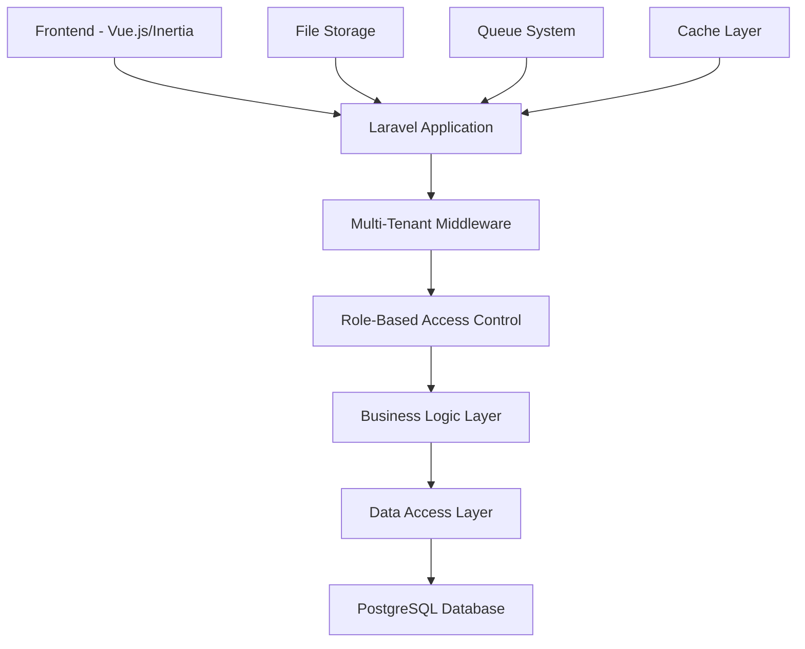

# Graduate Tracking System - Design Document

## Overview

The Graduate Tracking System is a multi-tenant Laravel application with Vue.js frontend that connects TVET institutions, graduates, and employers. The system uses domain-based tenant identification and role-based access control to provide tailored experiences for different user types.

## Architecture

### High-Level Architecture



### Technology Stack

- **Backend:** Laravel 12 with PHP 8.3+
- **Frontend:** Vue.js 3 with Inertia.js
- **Database:** PostgreSQL with multi-tenant architecture
- **Authentication:** Laravel Breeze with Spatie Permissions
- **Multi-tenancy:** Stancl Tenancy package
- **UI Framework:** Tailwind CSS with custom components
- **Build Tool:** Vite for asset compilation

## Components and Interfaces

### 1. Multi-Tenant Architecture

#### Tenant Resolution
- Domain-based tenant identification (e.g., institution1.polytrack.ga)
- Automatic database switching based on tenant context
- Shared central database for tenant management
- Isolated tenant databases for institution data

#### Database Structure
```
Central Database:
- tenants (institution information)
- domains (tenant domain mapping)
- central_users (super admins)

Tenant Databases:
- users (institution-specific users)
- graduates (graduate profiles)
- courses (institution courses)
- jobs (job postings)
- applications (job applications)
```

### 2. User Management System

#### User Roles and Permissions
```php
Roles:
- super-admin: System-wide access
- institution-admin: Institution management
- employer: Job posting and graduate search
- graduate: Profile management and job applications

Permissions:
- manage-institutions
- manage-users
- manage-graduates
- manage-courses
- post-jobs
- view-applications
- approve-employers
```

#### Authentication Flow
1. User accesses domain (e.g., institution1.polytrack.ga)
2. Tenant middleware identifies institution
3. User authenticates against tenant-specific user table
4. Role-based middleware applies appropriate permissions
5. User redirected to role-specific dashboard

### 3. Graduate Management

#### Graduate Profile Structure
```php
Graduate Model:
- personal_information (name, email, phone, address)
- academic_records (course, graduation_date, gpa, institution)
- employment_status (current_job, company, salary_range)
- skills_and_certifications
- profile_completion_status
- privacy_settings
```

#### Profile Management Features
- Bulk import via Excel with validation
- Profile completion tracking
- Employment status updates
- Academic record management
- Privacy controls for profile visibility

### 4. Job Management System

#### Job Posting Workflow
1. Employer creates account and submits verification
2. Super Admin reviews and approves employer
3. Approved employer can post jobs
4. System matches jobs with relevant graduates
5. Graduates receive notifications and can apply
6. Employers review applications and make decisions

#### Application Tracking
```php
Application States:
- pending: Initial application submitted
- reviewed: Employer has viewed application
- shortlisted: Candidate moved to next stage
- interviewed: Interview completed
- hired: Position offered and accepted
- rejected: Application declined
```

### 5. Dashboard Components

#### Super Admin Dashboard
- Institution management interface
- System-wide analytics and reporting
- User management across all tenants
- Employer verification queue
- System health monitoring

#### Institution Admin Dashboard
- Graduate management (CRUD operations)
- Course management
- Bulk import/export tools
- Institution-specific analytics
- Tutor and staff management

#### Employer Dashboard
- Job posting interface
- Application management
- Graduate search and filtering
- Company profile management
- Hiring analytics

#### Graduate Dashboard
- Profile completion interface
- Job browsing and search
- Application tracking
- Classmate connections
- Career progress tracking

## Data Models

### Core Models

#### Tenant Model
```php
class Tenant extends BaseTenant
{
    protected $fillable = [
        'id', 'name', 'address', 'contact_information', 
        'plan', 'status', 'settings'
    ];
    
    public function domains() { return $this->hasMany(Domain::class); }
    public function users() { return $this->hasMany(User::class); }
}
```

#### User Model
```php
class User extends Authenticatable
{
    use HasRoles, HasPermissions;
    
    protected $fillable = [
        'name', 'email', 'password', 'user_type',
        'institution_id', 'profile_data', 'last_login_at'
    ];
    
    public function institution() { return $this->belongsTo(Institution::class); }
    public function graduate() { return $this->hasOne(Graduate::class); }
    public function employer() { return $this->hasOne(Employer::class); }
}
```

#### Graduate Model
```php
class Graduate extends Model
{
    protected $fillable = [
        'user_id', 'student_id', 'course_id', 'graduation_date',
        'academic_records', 'employment_status', 'skills',
        'profile_completion', 'privacy_settings'
    ];
    
    protected $casts = [
        'academic_records' => 'array',
        'employment_status' => 'array',
        'skills' => 'array',
        'privacy_settings' => 'array'
    ];
    
    public function user() { return $this->belongsTo(User::class); }
    public function course() { return $this->belongsTo(Course::class); }
    public function applications() { return $this->hasMany(JobApplication::class); }
}
```

#### Job Model
```php
class Job extends Model
{
    protected $fillable = [
        'employer_id', 'title', 'description', 'requirements',
        'location', 'salary_range', 'course_id', 'status',
        'application_deadline', 'external_link'
    ];
    
    public function employer() { return $this->belongsTo(Employer::class); }
    public function course() { return $this->belongsTo(Course::class); }
    public function applications() { return $this->hasMany(JobApplication::class); }
}
```

### Relationship Mapping
```
Institution (1) -> (Many) Users
Institution (1) -> (Many) Courses
Institution (1) -> (Many) Graduates
User (1) -> (1) Graduate
User (1) -> (1) Employer
Course (1) -> (Many) Graduates
Course (1) -> (Many) Jobs
Job (1) -> (Many) JobApplications
Graduate (1) -> (Many) JobApplications
Employer (1) -> (Many) Jobs
```

## Error Handling

### Validation Strategy
- Form request validation for all user inputs
- Database constraint validation
- Business logic validation in service classes
- Frontend validation with Vue.js and Vee-Validate

### Error Response Format
```php
{
    "message": "Validation failed",
    "errors": {
        "field_name": ["Error message 1", "Error message 2"]
    },
    "status": 422
}
```

### Exception Handling
- Custom exception classes for business logic errors
- Global exception handler for consistent error responses
- Logging of all errors with context information
- User-friendly error messages in frontend

## Testing Strategy

### Backend Testing
- Unit tests for models and services
- Feature tests for API endpoints
- Integration tests for multi-tenant functionality
- Database tests with tenant isolation

### Frontend Testing
- Component unit tests with Vue Test Utils
- Integration tests for user workflows
- E2E tests with Cypress for critical paths
- Accessibility testing for compliance

### Test Data Management
- Factory classes for model generation
- Seeders for consistent test environments
- Tenant-specific test databases
- Mock external services and APIs

## Security Considerations

### Authentication & Authorization
- Multi-factor authentication for admin users
- Role-based access control with granular permissions
- Session management with secure cookies
- Password policies and complexity requirements

### Data Protection
- Encryption of sensitive data at rest
- HTTPS enforcement for all communications
- Input sanitization and XSS protection
- SQL injection prevention with Eloquent ORM

### Multi-Tenant Security
- Tenant data isolation verification
- Cross-tenant access prevention
- Audit logging for all data access
- Regular security assessments

## Performance Optimization

### Database Optimization
- Proper indexing for frequently queried fields
- Query optimization with eager loading
- Database connection pooling
- Read replica support for analytics

### Caching Strategy
- Redis caching for frequently accessed data
- Query result caching
- Session caching
- Static asset caching with CDN

### Frontend Performance
- Code splitting and lazy loading
- Asset optimization and compression
- Progressive Web App features
- Offline capability for core features

## Deployment Architecture

### Infrastructure
- Load balancer for high availability
- Application servers with auto-scaling
- Database cluster with failover
- File storage with backup and replication

### CI/CD Pipeline
- Automated testing on pull requests
- Staging environment for pre-production testing
- Blue-green deployment for zero downtime
- Database migration automation

### Monitoring and Logging
- Application performance monitoring
- Error tracking and alerting
- User activity logging
- System health dashboards