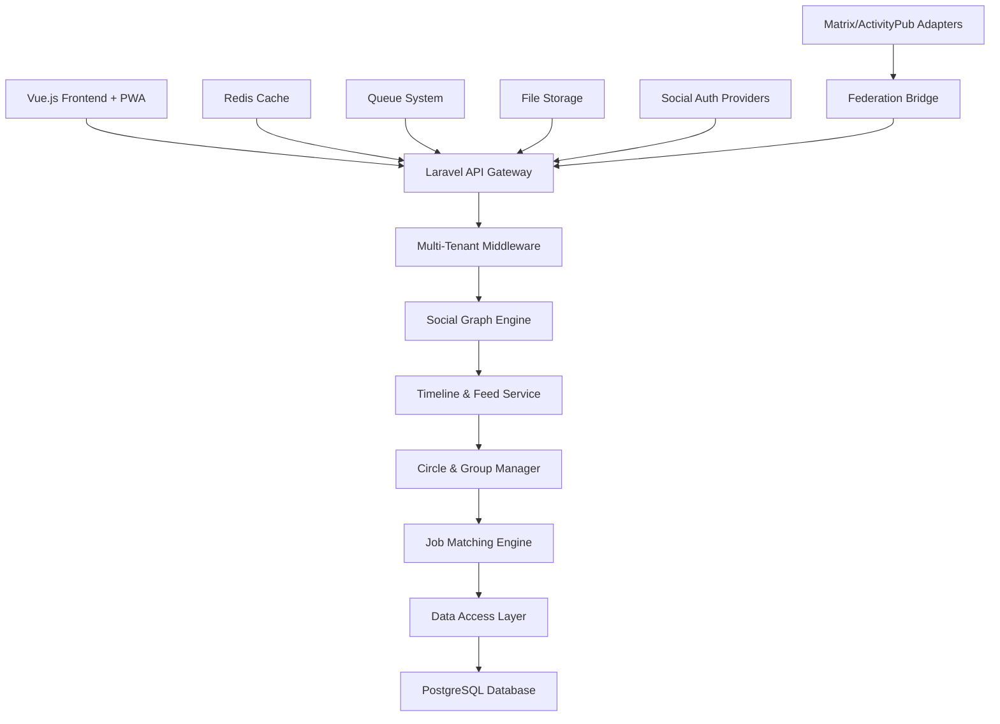

# Modern Alumni Platform - Design Document

## Overview

The Modern Alumni Platform transforms the existing basic tracking system into a vibrant social network and comprehensive alumni ecosystem. Built on Laravel with Vue.js, it features a sophisticated social timeline, organic circle formation, structured groups, intelligent job matching through graph relations, and future-ready architecture for Matrix and ActivityPub federation.

## Architecture

### High-Level Architecture



### Technology Stack

- **Backend:** Laravel 12 with PHP 8.3+
- **Frontend:** Vue.js 3 with Inertia.js + PWA capabilities
- **Database:** PostgreSQL with advanced indexing for social graphs
- **Cache:** Redis for timeline caching and real-time features
- **Queue:** Laravel Queues with Redis for background processing
- **Search:** Elasticsearch for advanced search and discovery
- **Real-time:** Laravel Broadcasting with Pusher/WebSockets
- **Social Auth:** Laravel Socialite for OAuth integration
- **Federation:** Custom adapters for Matrix/ActivityPub compatibility

## Components and Interfaces

### 1. Social Timeline & Posts System

#### Post Data Model
```php
class Post extends Model
{
    protected $fillable = [
        'user_id', 'content', 'media_urls', 'post_type', 
        'visibility', 'circle_ids', 'group_ids', 'metadata'
    ];
    
    protected $casts = [
        'media_urls' => 'array',
        'circle_ids' => 'array',
        'group_ids' => 'array',
        'metadata' => 'array'
    ];
    
    // Matrix/ActivityPub compatibility
    public function toMatrixEvent() { /* Convert to Matrix event format */ }
    public function toActivityPubObject() { /* Convert to ActivityPub object */ }
}
```

#### Timeline Generation Algorithm
1. **Circle-based content:** Automatically include posts from all user's circles
2. **Group-based content:** Include posts from joined groups
3. **Engagement scoring:** Rank posts by relevance and interaction
4. **Real-time updates:** Use WebSockets for live timeline updates
5. **Caching strategy:** Redis-based timeline caching with TTL

#### Post Interaction System
- **Reactions:** Like, love, celebrate, support, insightful (LinkedIn-style)
- **Comments:** Threaded comments with mentions and notifications
- **Sharing:** Reshare with optional commentary
- **Bookmarking:** Save posts for later reference

### 2. Circles System (Automatic Community Formation)

#### Circle Formation Logic
```php
class CircleManager
{
    public function generateCirclesForUser(User $user)
    {
        $circles = [];
        
        // School + Graduation Year circles
        foreach ($user->educations as $education) {
            $circles[] = $this->findOrCreateCircle([
                'type' => 'school_year',
                'school_id' => $education->school_id,
                'graduation_year' => $education->graduation_year
            ]);
        }
        
        // Multi-school overlap circles
        $schoolCombinations = $this->getSchoolCombinations($user->educations);
        foreach ($schoolCombinations as $combination) {
            $circles[] = $this->findOrCreateCircle([
                'type' => 'multi_school',
                'school_ids' => $combination
            ]);
        }
        
        return $circles;
    }
}
```

#### Circle Data Model
```php
class Circle extends Model
{
    protected $fillable = [
        'name', 'type', 'criteria', 'member_count', 'auto_generated'
    ];
    
    protected $casts = [
        'criteria' => 'array'
    ];
    
    public function members()
    {
        return $this->belongsToMany(User::class, 'circle_memberships');
    }
    
    public function posts()
    {
        return $this->hasMany(Post::class, 'circle_ids', 'id');
    }
}
```

### 3. Groups System (Structured Communities)

#### Group Types and Management
- **School Groups:** Automatic membership for institution alumni
- **Custom Groups:** User-created with invitation system
- **Interest Groups:** Topic-based communities
- **Professional Groups:** Industry or career-focused

#### Group Data Model
```php
class Group extends Model
{
    protected $fillable = [
        'name', 'description', 'type', 'privacy', 'institution_id',
        'creator_id', 'settings', 'member_count'
    ];
    
    protected $casts = [
        'settings' => 'array'
    ];
    
    public function members()
    {
        return $this->belongsToMany(User::class, 'group_memberships')
                    ->withPivot('role', 'joined_at', 'status');
    }
    
    public function posts()
    {
        return $this->hasMany(Post::class, 'group_id');
    }
}
```

#### Group Membership Logic
```php
class GroupMembershipManager
{
    public function handleInvitation(Group $group, User $user, User $inviter)
    {
        if ($group->type === 'school' && $this->userBelongsToSchool($user, $group->institution_id)) {
            // Auto-join for school groups
            return $this->addMember($group, $user, 'auto_joined');
        }
        
        // Send invitation for custom groups
        return $this->sendInvitation($group, $user, $inviter);
    }
}
```

### 4. Social Profile Integration & Authentication

#### Social Profile Linking
```php
class SocialProfile extends Model
{
    protected $fillable = [
        'user_id', 'provider', 'provider_id', 'profile_data',
        'access_token', 'refresh_token', 'is_primary'
    ];
    
    protected $casts = [
        'profile_data' => 'array'
    ];
    
    // Supported providers: linkedin, github, twitter, facebook, google
}
```

#### OAuth Authentication Flow
1. **Registration:** Users can sign up with any supported social provider
2. **Linking:** Existing users can link additional social profiles
3. **Login:** Users can authenticate with any linked profile
4. **Sync:** Optional profile data synchronization from social platforms

### 5. Intelligent Job Matching & Graph Relations

#### Graph-Based Job Matching Algorithm
```php
class JobMatchingEngine
{
    public function getMatchedJobs(User $user)
    {
        $jobs = Job::active()->get();
        $scoredJobs = [];
        
        foreach ($jobs as $job) {
            $score = $this->calculateMatchScore($user, $job);
            $scoredJobs[] = [
                'job' => $job,
                'score' => $score,
                'reasons' => $this->getMatchReasons($user, $job)
            ];
        }
        
        return collect($scoredJobs)->sortByDesc('score');
    }
    
    private function calculateMatchScore(User $user, Job $job)
    {
        $score = 0;
        
        // Direct connections at company
        $score += $this->getConnectionScore($user, $job->company);
        
        // Skills match
        $score += $this->getSkillsScore($user, $job);
        
        // Education relevance
        $score += $this->getEducationScore($user, $job);
        
        // Circle overlap with employees
        $score += $this->getCircleScore($user, $job);
        
        return $score;
    }
}
```

#### Job Dashboard Features
- **Personalized feed:** Jobs ranked by graph-based relevance
- **Connection insights:** Show mutual connections at companies
- **Application assistance:** Request introductions through network
- **Company insights:** Alumni working at companies with open roles

### 6. Advanced Search & Discovery

#### Elasticsearch Integration
```php
class AlumniSearchService
{
    public function search($query, $filters = [])
    {
        $params = [
            'index' => 'alumni',
            'body' => [
                'query' => [
                    'bool' => [
                        'must' => [
                            'multi_match' => [
                                'query' => $query,
                                'fields' => ['name^3', 'bio^2', 'skills', 'company', 'title']
                            ]
                        ],
                        'filter' => $this->buildFilters($filters)
                    ]
                ],
                'sort' => $this->buildSort($filters),
                'highlight' => [
                    'fields' => ['name' => new \stdClass(), 'bio' => new \stdClass()]
                ]
            ]
        ];
        
        return $this->client->search($params);
    }
}
```

#### Search Features
- **Natural language queries:** AI-powered search understanding
- **Faceted search:** Filter by multiple criteria simultaneously
- **Saved searches:** Store and alert on search criteria
- **Graph-based suggestions:** Recommend connections based on network analysis

## Data Models

### Core Social Models

#### Enhanced User Model
```php
class User extends Authenticatable
{
    use HasRoles, HasPermissions, HasSocialProfiles;
    
    protected $fillable = [
        'name', 'email', 'username', 'bio', 'avatar_url',
        'location', 'website', 'privacy_settings', 'notification_preferences'
    ];
    
    protected $casts = [
        'privacy_settings' => 'array',
        'notification_preferences' => 'array'
    ];
    
    // Relationships
    public function posts() { return $this->hasMany(Post::class); }
    public function circles() { return $this->belongsToMany(Circle::class, 'circle_memberships'); }
    public function groups() { return $this->belongsToMany(Group::class, 'group_memberships'); }
    public function socialProfiles() { return $this->hasMany(SocialProfile::class); }
    public function connections() { return $this->belongsToMany(User::class, 'connections', 'user_id', 'connected_user_id'); }
    
    // Matrix compatibility
    public function getMatrixId() { return "@{$this->username}:{$this->tenant->domain}"; }
}
```

#### Post Engagement Model
```php
class PostEngagement extends Model
{
    protected $fillable = [
        'post_id', 'user_id', 'type', 'metadata'
    ];
    
    protected $casts = [
        'metadata' => 'array'
    ];
    
    // Types: like, love, celebrate, support, insightful, comment, share, bookmark
}
```

#### Connection Model
```php
class Connection extends Model
{
    protected $fillable = [
        'user_id', 'connected_user_id', 'status', 'message', 'connected_at'
    ];
    
    // Status: pending, accepted, blocked
    
    public function user() { return $this->belongsTo(User::class); }
    public function connectedUser() { return $this->belongsTo(User::class, 'connected_user_id'); }
}
```

### Database Schema Optimizations

#### Indexing Strategy
```sql
-- Timeline performance
CREATE INDEX idx_posts_timeline ON posts (created_at DESC, user_id);
CREATE INDEX idx_posts_circles ON posts USING GIN (circle_ids);
CREATE INDEX idx_posts_groups ON posts USING GIN (group_ids);

-- Social graph performance
CREATE INDEX idx_connections_user ON connections (user_id, status);
CREATE INDEX idx_circle_memberships ON circle_memberships (user_id, circle_id);
CREATE INDEX idx_group_memberships ON group_memberships (user_id, group_id);

-- Search performance
CREATE INDEX idx_users_search ON users USING GIN (to_tsvector('english', name || ' ' || bio));
CREATE INDEX idx_posts_search ON posts USING GIN (to_tsvector('english', content));
```

## Federation & Future Compatibility

### Matrix Protocol Compatibility

#### Event Mapping
```php
class MatrixEventMapper
{
    public function postToMatrixEvent(Post $post)
    {
        return [
            'type' => 'm.room.message',
            'content' => [
                'msgtype' => 'm.text',
                'body' => $post->content,
                'formatted_body' => $this->formatContent($post->content),
                'format' => 'org.matrix.custom.html',
                // Custom alumni platform fields
                'alumni.post_id' => $post->id,
                'alumni.circles' => $post->circle_ids,
                'alumni.groups' => $post->group_ids
            ],
            'sender' => $post->user->getMatrixId(),
            'origin_server_ts' => $post->created_at->timestamp * 1000
        ];
    }
}
```

#### Room Structure
- **Circle Rooms:** Each circle becomes a Matrix room
- **Group Rooms:** Each group becomes a Matrix room
- **Direct Messages:** 1:1 conversations as Matrix rooms
- **Federation:** Cross-server communication for multi-institution networks

### ActivityPub Compatibility

#### Object Mapping
```php
class ActivityPubMapper
{
    public function postToActivityPubObject(Post $post)
    {
        return [
            '@context' => 'https://www.w3.org/ns/activitystreams',
            'type' => 'Note',
            'id' => route('posts.show', $post),
            'attributedTo' => route('users.show', $post->user),
            'content' => $post->content,
            'published' => $post->created_at->toISOString(),
            'to' => $this->getAudience($post),
            // Custom alumni platform extensions
            'alumni:circles' => $post->circle_ids,
            'alumni:groups' => $post->group_ids
        ];
    }
}
```

## Performance & Scalability

### Timeline Generation Performance
- **Pre-computed timelines:** Background jobs generate timelines for active users
- **Real-time updates:** WebSocket updates for new posts
- **Pagination:** Cursor-based pagination for infinite scroll
- **Caching:** Redis caching with intelligent invalidation

### Social Graph Optimization
- **Graph database considerations:** Potential Neo4j integration for complex graph queries
- **Denormalization:** Strategic denormalization for frequently accessed relationships
- **Batch processing:** Background jobs for circle/group membership updates

### Search Performance
- **Elasticsearch cluster:** Distributed search for large datasets
- **Index optimization:** Separate indices for different content types
- **Real-time indexing:** Queue-based document updates

## Security & Privacy

### Privacy Controls
- **Granular visibility:** Posts can be shared with specific circles/groups
- **Profile privacy:** Control who can see profile information
- **Connection privacy:** Control who can send connection requests
- **Search privacy:** Opt-out of search indexing

### Data Protection
- **GDPR compliance:** Data export, deletion, and consent management
- **Encryption:** Sensitive data encryption at rest
- **Audit logging:** Comprehensive activity logging
- **Rate limiting:** API rate limiting and abuse prevention

## Mobile & Progressive Web App

### PWA Features
- **Offline support:** Cache critical data for offline access
- **Push notifications:** Real-time notifications on mobile devices
- **App-like experience:** Native app feel with web technologies
- **Background sync:** Queue actions when offline, sync when online

### Mobile Optimization
- **Responsive design:** Optimized layouts for all screen sizes
- **Touch interactions:** Gesture-based navigation and interactions
- **Performance:** Optimized bundle sizes and lazy loading
- **Native features:** Camera access for photo uploads, location services

## Analytics & Insights

### Engagement Analytics
- **User activity:** Track post creation, interactions, and time spent
- **Content performance:** Analyze which posts generate most engagement
- **Network growth:** Monitor connection and community growth
- **Feature usage:** Track which features are most popular

### Alumni Insights
- **Career progression:** Track alumni career advancement
- **Geographic distribution:** Map alumni locations and movements
- **Industry trends:** Analyze alumni career paths and industry preferences
- **Engagement patterns:** Understand how alumni interact with the platform

This design creates a modern, engaging alumni platform that people will actually want to use daily, while maintaining the institutional value and preparing for future federation capabilities.