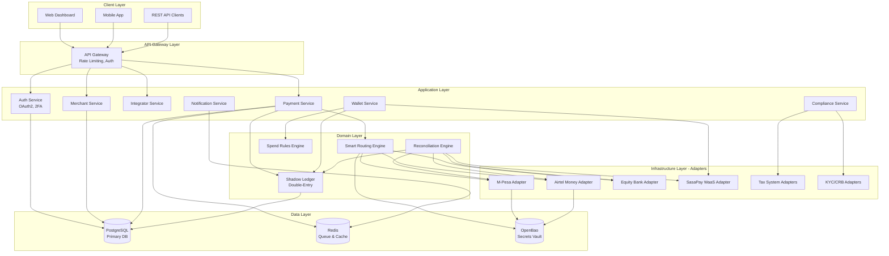

# Design Document: PayRails.Core Platform

## Overview

PayRails.Core is a unified African financial middleware aggregation platform built using Go (Golang) with a Hexagonal Architecture pattern. The system serves as a "Financial Operating System" that aggregates multiple payment gateways, provides wallet services, ensures compliance, and offers comprehensive financial management tools.

The platform implements a B2B2B model with three user tiers: Super Admins (platform operators), Integrators (resellers/developers), and Merchants (end clients). The core architecture emphasizes modularity through the Ports & Adapters pattern, enabling easy addition of new payment gateways, tax systems, and third-party services.

Key architectural decisions:
- **Language**: Go for concurrency, type safety, and performance
- **Database**: PostgreSQL for ACID compliance and relational integrity
- **Queue**: Redis for job queues, rate limiting, and IPN buffering
- **Secrets**: Dual-mode secrets management (PostgreSQL encrypted → OpenBao migration path)
- **WaaS Provider**: SasaPay as the underlying licensed entity for wallet services

## Architecture

### High-Level System Architecture



### Hexagonal Architecture Pattern

The system follows the Ports & Adapters (Hexagonal) architecture:

**Core Domain (Business Logic)**
- Payment processing logic
- Ledger management
- Reconciliation algorithms
- Spend rules evaluation
- Routing decisions

**Ports (Interfaces)**
- `PaymentProvider` interface for all gateways
- `TaxSystem` interface for fiscal integrations
- `VerificationProvider` interface for KYC/CRB
- `SecretsBackend` interface for credential storage
- `NotificationChannel` interface for alerts

**Adapters (Implementations)**
- Gateway adapters: M-Pesa, Airtel, Equity, SasaPay
- Tax adapters: eTIMS (Kenya), RRA (Rwanda), TRA (Tanzania), OBR (Burundi), FIRS (Nigeria)
- Verification adapters: SmileID, Metropol CRB, Equity Jenga API
- Secrets adapters: PostgreSQL encrypted storage, OpenBao Vault
- Notification adapters: Email (SMTP), SMS, WebSocket, Webhook

## Components and Interfaces

### 1. Authentication Service

**Responsibilities:**
- OAuth2 token generation and validation
- 2FA verification
- Scope-based authorization
- Session management

**Key Interfaces:**

```go
type AuthService interface {
    Authenticate(ctx context.Context, credentials Credentials) (*TokenPair, error)
    ValidateToken(ctx context.Context, token string) (*Claims, error)
    RefreshToken(ctx context.Context, refreshToken string) (*TokenPair, error)
    Verify2FA(ctx context.Context, userID string, code string) error
    RevokeToken(ctx context.Context, token string) error
}

type Credentials struct {
    ClientID     string
    ClientSecret string
    GrantType    string
    Scope        []string
}

type TokenPair struct {
    AccessToken  string
    RefreshToken string
    ExpiresIn    int64
    Scopes       []string
}

type Claims struct {
    UserID    string
    Role      UserRole
    Scopes    []string
    ExpiresAt time.Time
}
```

### 2. Payment Provider Interface

**Core abstraction for all payment gateways:**

```go
type PaymentProvider interface {
    // Initiate a payment collection
    InitiateCollection(ctx context.Context, req CollectionRequest) (*CollectionResponse, error)
    
    // Initiate a payout/disbursement
    InitiatePayout(ctx context.Context, req PayoutRequest) (*PayoutResponse, error)
    
    // Query transaction status
    QueryTransaction(ctx context.Context, providerTxID string) (*TransactionStatus, error)
    
    // Handle incoming webhook/IPN
    ProcessWebhook(ctx context.Context, payload []byte) (*WebhookEvent, error)
    
    // Get current balance from provider
    GetBalance(ctx context.Context) (*Balance, error)
    
    // Validate credentials
    ValidateCredentials(ctx context.Context, creds ProviderCredentials) error
}

type CollectionRequest struct {
    Amount          decimal.Decimal
    Currency        string
    CustomerPhone   string
    Reference       string
    Description     string
    CallbackURL     string
    AppConfigID     string  // Links to specific paybill/till configuration
}

type CollectionResponse struct {
    ProviderTxID    string
    Status          TransactionStatus
    CheckoutURL     string  // For STK Push
    Message         string
}

type PayoutRequest struct {
    Amount          decimal.Decimal
    Currency        string
    RecipientPhone  string
    RecipientBank   string
    AccountNumber   string
    Reference       string
    Description     string
}

type TransactionStatus struct {
    ProviderTxID    string
    InternalTxID    string
    Status          string  // pending, completed, failed, reversed
    Amount          decimal.Decimal
    Fees            decimal.Decimal
    CompletedAt     *time.Time
    FailureReason   string
}
```

### 3. Shadow Ledger Service

**Double-entry bookkeeping system:**

```go
type LedgerService interface {
    // Record a transaction with double-entry
    RecordTransaction(ctx context.Context, tx Transaction) error
    
    // Get account balance
    GetBalance(ctx context.Context, accountID string) (decimal.Decimal, error)
    
    // Get transaction history
    GetTransactions(ctx context.Context, filter TransactionFilter) ([]Transaction, error)
    
    // Reconcile with external provider
    Reconcile(ctx context.Context, providerID string, providerBalance decimal.Decimal) (*ReconciliationReport, error)
}

type Transaction struct {
    ID              string
    Timestamp       time.Time
    Description     string
    Entries         []LedgerEntry
    ProviderTxID    string
    MerchantID      string
    IntegratorID    string
    Metadata        map[string]interface{}
}

type LedgerEntry struct {
    AccountID       string
    AccountType     AccountType  // asset, liability, revenue, expense
    DebitAmount     decimal.Decimal
    CreditAmount    decimal.Decimal
}

type AccountType string

const (
    AccountAsset      AccountType = "asset"
    AccountLiability  AccountType = "liability"
    AccountRevenue    AccountType = "revenue"
    AccountExpense    AccountType = "expense"
)

// Example transaction structure for M-Pesa collection:
// Debit: Merchant Wallet (Asset) - Full amount
// Credit: Gateway Fees (Expense) - Gateway fee
// Credit: Platform Revenue (Revenue) - Platform fee
// Credit: Integrator Revenue (Liability) - Integrator share
```

### 4. Reconciliation Engine

**Background service for matching transactions:**

```go
type ReconciliationEngine interface {
    // Poll provider for transactions
    PollProvider(ctx context.Context, providerID string, since time.Time) error
    
    // Match internal transactions with provider transactions
    MatchTransactions(ctx context.Context, providerID string) (*MatchReport, error)
    
    // Handle unmatched transactions
    ResolveUnmatched(ctx context.Context, txID string, resolution Resolution) error
    
    // Get reconciliation status
    GetStatus(ctx context.Context, providerID string) (*ReconciliationStatus, error)
}

type MatchReport struct {
    Matched         int
    Unmatched       int
    Discrepancies   []Discrepancy
    SystemBalance   decimal.Decimal
    ProviderBalance decimal.Decimal
}

type Discrepancy struct {
    InternalTxID    string
    ProviderTxID    string
    Type            DiscrepancyType  // missing_internal, missing_provider, amount_mismatch
    ExpectedAmount  decimal.Decimal
    ActualAmount    decimal.Decimal
}
```

### 5. Smart Routing Engine

**Intelligent gateway selection and failover:**

```go
type RoutingEngine interface {
    // Select best gateway for a payment
    SelectGateway(ctx context.Context, req RoutingRequest) (*Gateway, error)
    
    // Execute failover to backup gateway
    Failover(ctx context.Context, failedGateway string, req RoutingRequest) (*Gateway, error)
    
    // Update routing rules
    UpdateRules(ctx context.Context, rules []RoutingRule) error
    
    // Get gateway health metrics
    GetGatewayHealth(ctx context.Context, gatewayID string) (*HealthMetrics, error)
}

type RoutingRequest struct {
    Amount          decimal.Decimal
    Currency        string
    PaymentMethod   string
    MerchantID      string
    Priority        RoutingPriority  // cost, speed, reliability
}

type RoutingRule struct {
    Priority        int
    Conditions      []Condition
    GatewayID       string
    FallbackGateway string
}

type Condition struct {
    Field           string  // amount, time, merchant_id
    Operator        string  // gt, lt, eq, in
    Value           interface{}
}

type HealthMetrics struct {
    GatewayID       string
    SuccessRate     float64
    AvgLatency      time.Duration
    LastFailure     *time.Time
    IsAvailable     bool
}
```

### 6. Spend Rules Engine

**Configurable spending controls:**

```go
type SpendRulesEngine interface {
    // Evaluate if a transaction is allowed
    EvaluateTransaction(ctx context.Context, tx ProposedTransaction) (*EvaluationResult, error)
    
    // Create or update spend rule
    UpsertRule(ctx context.Context, rule SpendRule) error
    
    // Get rules for a wallet
    GetRules(ctx context.Context, walletID string) ([]SpendRule, error)
    
    // Check daily spending limit
    CheckDailyLimit(ctx context.Context, walletID string, amount decimal.Decimal) error
}

type SpendRule struct {
    ID              string
    WalletID        string
    RuleType        RuleType  // daily_limit, transaction_limit, approval_threshold, category_restriction
    Threshold       decimal.Decimal
    RequiresApproval bool
    ApproverRoles   []string
    Active          bool
}

type EvaluationResult struct {
    Allowed         bool
    RequiresApproval bool
    ViolatedRules   []string
    Reason          string
}

type ProposedTransaction struct {
    WalletID        string
    Amount          decimal.Decimal
    Category        string
    InitiatorID     string
}
```

### 7. Wallet Service (WaaS)

**Virtual wallet management backed by SasaPay:**

```go
type WalletService interface {
    // Create a new wallet
    CreateWallet(ctx context.Context, req CreateWalletRequest) (*Wallet, error)
    
    // Get wallet balance
    GetBalance(ctx context.Context, walletID string) (decimal.Decimal, error)
    
    // Transfer between wallets
    Transfer(ctx context.Context, req TransferRequest) (*Transfer, error)
    
    // Request withdrawal to external gateway
    RequestWithdrawal(ctx context.Context, req WithdrawalRequest) (*WithdrawalRequest, error)
    
    // Get wallet transaction history
    GetTransactions(ctx context.Context, walletID string, filter TransactionFilter) ([]WalletTransaction, error)
}

type Wallet struct {
    ID              string
    MerchantID      string
    Type            WalletType  // master, department
    ParentWalletID  *string
    Balance         decimal.Decimal
    Currency        string
    SasaPayWalletID string
    Status          WalletStatus
    CreatedAt       time.Time
}

type TransferRequest struct {
    FromWalletID    string
    ToWalletID      string
    Amount          decimal.Decimal
    Description     string
    RequesterID     string
}

type WithdrawalRequest struct {
    WalletID        string
    Amount          decimal.Decimal
    Gateway         string
    Destination     string  // Phone number or account number
    RequesterID     string
    ApproverID      *string
    Status          WithdrawalStatus
}
```

### 8. Tax System Interface

**Multi-market tax integration:**

```go
type TaxSystem interface {
    // Submit transaction for fiscal receipt
    SubmitTransaction(ctx context.Context, tx TaxableTransaction) (*FiscalReceipt, error)
    
    // Query receipt status
    QueryReceipt(ctx context.Context, receiptID string) (*FiscalReceipt, error)
    
    // Validate tax credentials
    ValidateCredentials(ctx context.Context, creds TaxCredentials) error
    
    // Get supported countries
    GetSupportedCountries() []string
}

type TaxableTransaction struct {
    TransactionID   string
    Amount          decimal.Decimal
    Currency        string
    TaxAmount       decimal.Decimal
    CustomerInfo    CustomerInfo
    Items           []LineItem
    Timestamp       time.Time
}

type FiscalReceipt struct {
    ReceiptID       string
    ReceiptNumber   string
    QRCode          string
    VerificationURL string
    IssuedAt        time.Time
    TaxSystem       string  // etims, rra, tra, obr, firs
}
```

### 9. Verification Provider Interface

**KYC and CRB services:**

```go
type VerificationProvider interface {
    // Verify customer identity (KYC)
    VerifyIdentity(ctx context.Context, req IdentityVerificationRequest) (*VerificationResult, error)
    
    // Check credit bureau report (CRB)
    CheckCreditReport(ctx context.Context, req CreditCheckRequest) (*CreditReport, error)
    
    // Verify business registration (KYB)
    VerifyBusiness(ctx context.Context, req BusinessVerificationRequest) (*BusinessVerificationResult, error)
}

type IdentityVerificationRequest struct {
    FirstName       string
    LastName        string
    IDNumber        string
    IDType          string  // national_id, passport, drivers_license
    DateOfBirth     time.Time
    Country         string
}

type VerificationResult struct {
    Verified        bool
    ConfidenceScore float64
    MatchedFields   []string
    ProviderRef     string
    Timestamp       time.Time
}

type CreditCheckRequest struct {
    IDNumber        string
    PhoneNumber     string
    Consent         bool
}

type CreditReport struct {
    CreditScore     int
    RiskRating      string
    ActiveLoans     int
    TotalDebt       decimal.Decimal
    PaymentHistory  []PaymentRecord
    ProviderRef     string
}
```

### 10. Secrets Backend Interface

**Abstraction for credential storage:**

```go
type SecretsBackend interface {
    // Store a secret
    StoreSecret(ctx context.Context, key string, value []byte) error
    
    // Retrieve a secret
    GetSecret(ctx context.Context, key string) ([]byte, error)
    
    // Delete a secret
    DeleteSecret(ctx context.Context, key string) error
    
    // Rotate a secret
    RotateSecret(ctx context.Context, key string, newValue []byte) error
    
    // List secret keys (without values)
    ListSecrets(ctx context.Context, prefix string) ([]string, error)
}

// PostgreSQL implementation
type PostgreSQLSecretsBackend struct {
    db *sql.DB
    encryptionKey []byte
}

// OpenBao implementation
type OpenBaoSecretsBackend struct {
    client *vault.Client
    mountPath string
}
```

## Data Models

### Core Database Schema

```sql
-- Users and Authentication
CREATE TABLE users (
    id UUID PRIMARY KEY DEFAULT gen_random_uuid(),
    email VARCHAR(255) UNIQUE NOT NULL,
    password_hash VARCHAR(255) NOT NULL,
    role VARCHAR(50) NOT NULL, -- super_admin, integrator, merchant_user
    integrator_id UUID REFERENCES integrators(id),
    merchant_id UUID REFERENCES merchants(id),
    two_fa_enabled BOOLEAN DEFAULT false,
    two_fa_secret VARCHAR(255),
    created_at TIMESTAMP DEFAULT CURRENT_TIMESTAMP,
    updated_at TIMESTAMP DEFAULT CURRENT_TIMESTAMP
);

-- Integrators (Resellers/Developers)
CREATE TABLE integrators (
    id UUID PRIMARY KEY DEFAULT gen_random_uuid(),
    name VARCHAR(255) NOT NULL,
    email VARCHAR(255) UNIQUE NOT NULL,
    revenue_share_percentage DECIMAL(5,2) NOT NULL, -- e.g., 20.00 for 20%
    platform_fee_markup DECIMAL(5,2) DEFAULT 0.00,
    status VARCHAR(50) DEFAULT 'active', -- active, suspended
    created_at TIMESTAMP DEFAULT CURRENT_TIMESTAMP,
    updated_at TIMESTAMP DEFAULT CURRENT_TIMESTAMP
);

-- Merchants (End Clients)
CREATE TABLE merchants (
    id UUID PRIMARY KEY DEFAULT gen_random_uuid(),
    integrator_id UUID REFERENCES integrators(id) NOT NULL,
    name VARCHAR(255) NOT NULL,
    email VARCHAR(255) NOT NULL,
    phone VARCHAR(50),
    country VARCHAR(2) NOT NULL, -- ISO country code
    business_registration VARCHAR(255),
    kyb_status VARCHAR(50) DEFAULT 'pending', -- pending, approved, rejected
    kyb_documents JSONB,
    status VARCHAR(50) DEFAULT 'sandbox', -- sandbox, active, frozen
    monthly_platform_fee DECIMAL(10,2) DEFAULT 0.00,
    created_at TIMESTAMP DEFAULT CURRENT_TIMESTAMP,
    updated_at TIMESTAMP DEFAULT CURRENT_TIMESTAMP
);

-- API Credentials
CREATE TABLE api_credentials (
    id UUID PRIMARY KEY DEFAULT gen_random_uuid(),
    merchant_id UUID REFERENCES merchants(id) NOT NULL,
    client_id VARCHAR(255) UNIQUE NOT NULL,
    client_secret_hash VARCHAR(255) NOT NULL,
    scopes TEXT[] NOT NULL,
    environment VARCHAR(50) NOT NULL, -- sandbox, live
    is_active BOOLEAN DEFAULT true,
    last_used_at TIMESTAMP,
    created_at TIMESTAMP DEFAULT CURRENT_TIMESTAMP,
    expires_at TIMESTAMP
);

-- App Configurations (Multiple paybills/tills per merchant)
CREATE TABLE app_configurations (
    id UUID PRIMARY KEY DEFAULT gen_random_uuid(),
    merchant_id UUID REFERENCES merchants(id) NOT NULL,
    app_name VARCHAR(255) NOT NULL,
    gateway_type VARCHAR(50) NOT NULL, -- mpesa, airtel, equity, sasapay
    credentials_key VARCHAR(255) NOT NULL, -- Key to retrieve from secrets backend
    configuration JSONB NOT NULL, -- Gateway-specific params (paybill, till, shortcode)
    is_active BOOLEAN DEFAULT true,
    created_at TIMESTAMP DEFAULT CURRENT_TIMESTAMP,
    updated_at TIMESTAMP DEFAULT CURRENT_TIMESTAMP,
    UNIQUE(merchant_id, app_name)
);

-- Wallets (WaaS)
CREATE TABLE wallets (
    id UUID PRIMARY KEY DEFAULT gen_random_uuid(),
    merchant_id UUID REFERENCES merchants(id) NOT NULL,
    parent_wallet_id UUID REFERENCES wallets(id),
    wallet_type VARCHAR(50) NOT NULL, -- master, department
    name VARCHAR(255) NOT NULL,
    currency VARCHAR(3) DEFAULT 'KES',
    sasapay_wallet_id VARCHAR(255) UNIQUE,
    status VARCHAR(50) DEFAULT 'active', -- active, frozen
    created_at TIMESTAMP DEFAULT CURRENT_TIMESTAMP,
    updated_at TIMESTAMP DEFAULT CURRENT_TIMESTAMP
);

-- Shadow Ledger - Accounts
CREATE TABLE accounts (
    id UUID PRIMARY KEY DEFAULT gen_random_uuid(),
    account_type VARCHAR(50) NOT NULL, -- asset, liability, revenue, expense
    account_name VARCHAR(255) NOT NULL,
    merchant_id UUID REFERENCES merchants(id),
    integrator_id UUID REFERENCES integrators(id),
    wallet_id UUID REFERENCES wallets(id),
    currency VARCHAR(3) DEFAULT 'KES',
    created_at TIMESTAMP DEFAULT CURRENT_TIMESTAMP
);

-- Shadow Ledger - Transactions
CREATE TABLE transactions (
    id UUID PRIMARY KEY DEFAULT gen_random_uuid(),
    transaction_type VARCHAR(50) NOT NULL, -- collection, payout, transfer, fee
    provider_tx_id VARCHAR(255),
    merchant_id UUID REFERENCES merchants(id) NOT NULL,
    integrator_id UUID REFERENCES integrators(id),
    app_config_id UUID REFERENCES app_configurations(id),
    amount DECIMAL(15,2) NOT NULL,
    currency VARCHAR(3) DEFAULT 'KES',
    gateway_fee DECIMAL(15,2) DEFAULT 0.00,
    platform_fee DECIMAL(15,2) DEFAULT 0.00,
    integrator_fee DECIMAL(15,2) DEFAULT 0.00,
    status VARCHAR(50) NOT NULL, -- pending, completed, failed, reversed
    description TEXT,
    customer_reference VARCHAR(255),
    metadata JSONB,
    created_at TIMESTAMP DEFAULT CURRENT_TIMESTAMP,
    completed_at TIMESTAMP,
    INDEX idx_merchant_created (merchant_id, created_at),
    INDEX idx_provider_tx (provider_tx_id),
    INDEX idx_status (status)
);

-- Shadow Ledger - Entries (Double-Entry)
CREATE TABLE ledger_entries (
    id UUID PRIMARY KEY DEFAULT gen_random_uuid(),
    transaction_id UUID REFERENCES transactions(id) NOT NULL,
    account_id UUID REFERENCES accounts(id) NOT NULL,
    debit_amount DECIMAL(15,2) DEFAULT 0.00,
    credit_amount DECIMAL(15,2) DEFAULT 0.00,
    balance_after DECIMAL(15,2) NOT NULL,
    created_at TIMESTAMP DEFAULT CURRENT_TIMESTAMP,
    INDEX idx_account_created (account_id, created_at)
);

-- Gateway Sync Logs (Reconciliation)
CREATE TABLE gateway_sync_logs (
    id UUID PRIMARY KEY DEFAULT gen_random_uuid(),
    gateway_type VARCHAR(50) NOT NULL,
    app_config_id UUID REFERENCES app_configurations(id),
    sync_start_time TIMESTAMP NOT NULL,
    sync_end_time TIMESTAMP,
    transactions_fetched INT DEFAULT 0,
    transactions_matched INT DEFAULT 0,
    transactions_unmatched INT DEFAULT 0,
    system_balance DECIMAL(15,2),
    provider_balance DECIMAL(15,2),
    discrepancies JSONB,
    status VARCHAR(50) NOT NULL, -- running, completed, failed
    error_message TEXT,
    created_at TIMESTAMP DEFAULT CURRENT_TIMESTAMP
);

-- Spend Rules
CREATE TABLE spend_rules (
    id UUID PRIMARY KEY DEFAULT gen_random_uuid(),
    wallet_id UUID REFERENCES wallets(id) NOT NULL,
    rule_type VARCHAR(50) NOT NULL, -- daily_limit, transaction_limit, approval_threshold
    threshold_amount DECIMAL(15,2),
    requires_approval BOOLEAN DEFAULT false,
    approver_roles TEXT[],
    is_active BOOLEAN DEFAULT true,
    created_at TIMESTAMP DEFAULT CURRENT_TIMESTAMP,
    updated_at TIMESTAMP DEFAULT CURRENT_TIMESTAMP
);

-- Payment Requests (Maker-Checker)
CREATE TABLE payment_requests (
    id UUID PRIMARY KEY DEFAULT gen_random_uuid(),
    wallet_id UUID REFERENCES wallets(id) NOT NULL,
    requester_id UUID REFERENCES users(id) NOT NULL,
    approver_id UUID REFERENCES users(id),
    request_type VARCHAR(50) NOT NULL, -- withdrawal, transfer, payout
    amount DECIMAL(15,2) NOT NULL,
    destination VARCHAR(255) NOT NULL,
    gateway VARCHAR(50),
    description TEXT,
    status VARCHAR(50) DEFAULT 'pending', -- pending, approved, rejected, completed
    rejection_reason TEXT,
    created_at TIMESTAMP DEFAULT CURRENT_TIMESTAMP,
    approved_at TIMESTAMP,
    completed_at TIMESTAMP
);

-- Fiscal Receipts (Tax Integration)
CREATE TABLE fiscal_receipts (
    id UUID PRIMARY KEY DEFAULT gen_random_uuid(),
    transaction_id UUID REFERENCES transactions(id) NOT NULL,
    tax_system VARCHAR(50) NOT NULL, -- etims, rra, tra, obr, firs
    receipt_number VARCHAR(255) UNIQUE NOT NULL,
    receipt_id VARCHAR(255) NOT NULL,
    qr_code TEXT,
    verification_url TEXT,
    issued_at TIMESTAMP NOT NULL,
    created_at TIMESTAMP DEFAULT CURRENT_TIMESTAMP
);

-- KYC/CRB Verifications
CREATE TABLE verifications (
    id UUID PRIMARY KEY DEFAULT gen_random_uuid(),
    merchant_id UUID REFERENCES merchants(id),
    customer_id VARCHAR(255),
    verification_type VARCHAR(50) NOT NULL, -- kyc, crb, kyb
    provider VARCHAR(50) NOT NULL, -- smileid, metropol, jenga
    request_data JSONB NOT NULL,
    result_data JSONB,
    status VARCHAR(50) NOT NULL, -- pending, completed, failed
    verified BOOLEAN,
    confidence_score DECIMAL(5,2),
    provider_reference VARCHAR(255),
    created_at TIMESTAMP DEFAULT CURRENT_TIMESTAMP,
    completed_at TIMESTAMP
);

-- Routing Rules
CREATE TABLE routing_rules (
    id UUID PRIMARY KEY DEFAULT gen_random_uuid(),
    priority INT NOT NULL,
    conditions JSONB NOT NULL,
    gateway_id VARCHAR(50) NOT NULL,
    fallback_gateway_id VARCHAR(50),
    is_active BOOLEAN DEFAULT true,
    created_at TIMESTAMP DEFAULT CURRENT_TIMESTAMP,
    updated_at TIMESTAMP DEFAULT CURRENT_TIMESTAMP
);

-- Webhook Logs
CREATE TABLE webhook_logs (
    id UUID PRIMARY KEY DEFAULT gen_random_uuid(),
    merchant_id UUID REFERENCES merchants(id) NOT NULL,
    transaction_id UUID REFERENCES transactions(id),
    webhook_url TEXT NOT NULL,
    payload JSONB NOT NULL,
    response_status INT,
    response_body TEXT,
    attempt_number INT DEFAULT 1,
    status VARCHAR(50) NOT NULL, -- pending, sent, failed, dlq
    created_at TIMESTAMP DEFAULT CURRENT_TIMESTAMP,
    sent_at TIMESTAMP,
    INDEX idx_status_created (status, created_at)
);

-- Audit Logs
CREATE TABLE audit_logs (
    id UUID PRIMARY KEY DEFAULT gen_random_uuid(),
    user_id UUID REFERENCES users(id),
    action VARCHAR(100) NOT NULL,
    entity_type VARCHAR(50) NOT NULL,
    entity_id UUID,
    changes JSONB,
    ip_address INET,
    user_agent TEXT,
    created_at TIMESTAMP DEFAULT CURRENT_TIMESTAMP,
    INDEX idx_entity (entity_type, entity_id),
    INDEX idx_user_created (user_id, created_at)
);

-- Notifications
CREATE TABLE notifications (
    id UUID PRIMARY KEY DEFAULT gen_random_uuid(),
    user_id UUID REFERENCES users(id) NOT NULL,
    notification_type VARCHAR(50) NOT NULL,
    title VARCHAR(255) NOT NULL,
    message TEXT NOT NULL,
    channels TEXT[] NOT NULL, -- email, sms, in_app
    status VARCHAR(50) DEFAULT 'pending', -- pending, sent, failed
    read_at TIMESTAMP,
    created_at TIMESTAMP DEFAULT CURRENT_TIMESTAMP,
    sent_at TIMESTAMP
);

-- Integration Partners
CREATE TABLE integration_partners (
    id UUID PRIMARY KEY DEFAULT gen_random_uuid(),
    partner_type VARCHAR(50) NOT NULL, -- tax, kyc, crb, gateway
    partner_name VARCHAR(255) NOT NULL,
    country_codes TEXT[], -- Supported countries
    credentials_key VARCHAR(255) NOT NULL,
    api_endpoint TEXT NOT NULL,
    is_active BOOLEAN DEFAULT true,
    health_status VARCHAR(50) DEFAULT 'unknown', -- healthy, degraded, down
    last_health_check TIMESTAMP,
    created_at TIMESTAMP DEFAULT CURRENT_TIMESTAMP,
    updated_at TIMESTAMP DEFAULT CURRENT_TIMESTAMP
);
```

### Redis Data Structures

```
# Rate Limiting
rate_limit:{client_id}:{endpoint} -> Counter with TTL

# Job Queues
queue:webhooks -> List of webhook delivery jobs
queue:reconciliation -> List of reconciliation jobs
queue:tax_receipts -> List of fiscal receipt generation jobs
queue:notifications -> List of notification delivery jobs

# Dead Letter Queue
dlq:webhooks -> List of failed webhook jobs
dlq:tax_receipts -> List of failed tax receipt jobs

# Caching
cache:balance:{wallet_id} -> Cached wallet balance (TTL: 60s)
cache:gateway_health:{gateway_id} -> Gateway health metrics (TTL: 300s)
cache:routing_rules -> Cached routing rules (TTL: 600s)

# Session Management
session:{token} -> User session data (TTL: token expiry)

# 2FA Codes
2fa:{user_id} -> Temporary 2FA code (TTL: 300s)
```

## Correctness Properties

*A property is a characteristic or behavior that should hold true across all valid executions of a system—essentially, a formal statement about what the system should do. Properties serve as the bridge between human-readable specifications and machine-verifiable correctness guarantees.*

