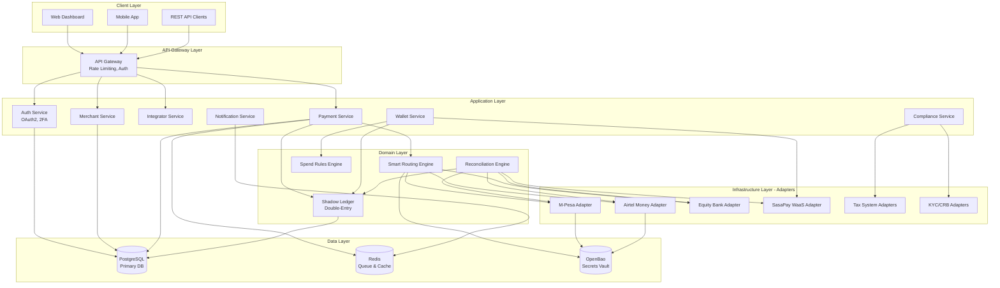

# Design Document: PayRails.Core Platform

## Overview

PayRails.Core is a unified African financial middleware aggregation platform built using Go (Golang) with a Hexagonal Architecture pattern. The system serves as a "Financial Operating System" that aggregates multiple payment gateways, provides wallet services, ensures compliance, and offers comprehensive financial management tools.

The platform implements a B2B2B model with three user tiers: Super Admins (platform operators), Integrators (resellers/developers), and Merchants (end clients). The core architecture emphasizes modularity through the Ports & Adapters pattern, enabling easy addition of new payment gateways, tax systems, and third-party services.

Key architectural decisions:
- **Language**: Go for concurrency, type safety, and performance
- **Database**: PostgreSQL for ACID compliance and relational integrity
- **Queue**: Redis for job queues, rate limiting, and IPN buffering
- **Secrets**: Dual-mode secrets management (PostgreSQL encrypted → OpenBao migration path)
- **WaaS Provider**: SasaPay as the underlying licensed entity for wallet services

## Architecture

### High-Level System Architecture



### Hexagonal Architecture Pattern

The system follows the Ports & Adapters (Hexagonal) architecture:

**Core Domain (Business Logic)**
- Payment processing logic
- Ledger management
- Reconciliation algorithms
- Spend rules evaluation
- Routing decisions

**Ports (Interfaces)**
- `PaymentProvider` interface for all gateways
- `TaxSystem` interface for fiscal integrations
- `VerificationProvider` interface for KYC/CRB
- `SecretsBackend` interface for credential storage
- `NotificationChannel` interface for alerts

**Adapters (Implementations)**
- Gateway adapters: M-Pesa, Airtel, Equity, SasaPay
- Tax adapters: eTIMS (Kenya), RRA (Rwanda), TRA (Tanzania), OBR (Burundi), FIRS (Nigeria)
- Verification adapters: SmileID, Metropol CRB, Equity Jenga API
- Secrets adapters: PostgreSQL encrypted storage, OpenBao Vault
- Notification adapters: Email (SMTP), SMS, WebSocket, Webhook

## Components and Interfaces

### 1. Authentication Service

**Responsibilities:**
- OAuth2 token generation and validation
- 2FA verification
- Scope-based authorization
- Session management

**Key Interfaces:**

```go
type AuthService interface {
    Authenticate(ctx context.Context, credentials Credentials) (*TokenPair, error)
    ValidateToken(ctx context.Context, token string) (*Claims, error)
    RefreshToken(ctx context.Context, refreshToken string) (*TokenPair, error)
    Verify2FA(ctx context.Context, userID string, code string) error
    RevokeToken(ctx context.Context, token string) error
}

type Credentials struct {
    ClientID     string
    ClientSecret string
    GrantType    string
    Scope        []string
}

type TokenPair struct {
    AccessToken  string
    RefreshToken string
    ExpiresIn    int64
    Scopes       []string
}

type Claims struct {
    UserID    string
    Role      UserRole
    Scopes    []string
    ExpiresAt time.Time
}
```

### 2. Payment Provider Interface

**Core abstraction for all payment gateways:**

```go
type PaymentProvider interface {
    // Initiate a payment collection
    InitiateCollection(ctx context.Context, req CollectionRequest) (*CollectionResponse, error)
    
    // Initiate a payout/disbursement
    InitiatePayout(ctx context.Context, req PayoutRequest) (*PayoutResponse, error)
    
    // Query transaction status
    QueryTransaction(ctx context.Context, providerTxID string) (*TransactionStatus, error)
    
    // Handle incoming webhook/IPN
    ProcessWebhook(ctx context.Context, payload []byte) (*WebhookEvent, error)
    
    // Get current balance from provider
    GetBalance(ctx context.Context) (*Balance, error)
    
    // Validate credentials
    ValidateCredentials(ctx context.Context, creds ProviderCredentials) error
}

type CollectionRequest struct {
    Amount          decimal.Decimal
    Currency        string
    CustomerPhone   string
    Reference       string
    Description     string
    CallbackURL     string
    AppConfigID     string  // Links to specific paybill/till configuration
}

type CollectionResponse struct {
    ProviderTxID    string
    Status          TransactionStatus
    CheckoutURL     string  // For STK Push
    Message         string
}

type PayoutRequest struct {
    Amount          decimal.Decimal
    Currency        string
    RecipientPhone  string
    RecipientBank   string
    AccountNumber   string
    Reference       string
    Description     string
}

type TransactionStatus struct {
    ProviderTxID    string
    InternalTxID    string
    Status          string  // pending, completed, failed, reversed
    Amount          decimal.Decimal
    Fees            decimal.Decimal
    CompletedAt     *time.Time
    FailureReason   string
}
```

### 3. Shadow Ledger Service

**Double-entry bookkeeping system:**

```go
type LedgerService interface {
    // Record a transaction with double-entry
    RecordTransaction(ctx context.Context, tx Transaction) error
    
    // Get account balance
    GetBalance(ctx context.Context, accountID string) (decimal.Decimal, error)
    
    // Get transaction history
    GetTransactions(ctx context.Context, filter TransactionFilter) ([]Transaction, error)
    
    // Reconcile with external provider
    Reconcile(ctx context.Context, providerID string, providerBalance decimal.Decimal) (*ReconciliationReport, error)
}

type Transaction struct {
    ID              string
    Timestamp       time.Time
    Description     string
    Entries         []LedgerEntry
    ProviderTxID    string
    MerchantID      string
    IntegratorID    string
    Metadata        map[string]interface{}
}

type LedgerEntry struct {
    AccountID       string
    AccountType     AccountType  // asset, liability, revenue, expense
    DebitAmount     decimal.Decimal
    CreditAmount    decimal.Decimal
}

type AccountType string

const (
    AccountAsset      AccountType = "asset"
    AccountLiability  AccountType = "liability"
    AccountRevenue    AccountType = "revenue"
    AccountExpense    AccountType = "expense"
)

// Example transaction structure for M-Pesa collection:
// Debit: Merchant Wallet (Asset) - Full amount
// Credit: Gateway Fees (Expense) - Gateway fee
// Credit: Platform Revenue (Revenue) - Platform fee
// Credit: Integrator Revenue (Liability) - Integrator share
```

### 4. Reconciliation Engine

**Background service for matching transactions:**

```go
type ReconciliationEngine interface {
    // Poll provider for transactions
    PollProvider(ctx context.Context, providerID string, since time.Time) error
    
    // Match internal transactions with provider transactions
    MatchTransactions(ctx context.Context, providerID string) (*MatchReport, error)
    
    // Handle unmatched transactions
    ResolveUnmatched(ctx context.Context, txID string, resolution Resolution) error
    
    // Get reconciliation status
    GetStatus(ctx context.Context, providerID string) (*ReconciliationStatus, error)
}

type MatchReport struct {
    Matched         int
    Unmatched       int
    Discrepancies   []Discrepancy
    SystemBalance   decimal.Decimal
    ProviderBalance decimal.Decimal
}

type Discrepancy struct {
    InternalTxID    string
    ProviderTxID    string
    Type            DiscrepancyType  // missing_internal, missing_provider, amount_mismatch
    ExpectedAmount  decimal.Decimal
    ActualAmount    decimal.Decimal
}
```

### 5. Smart Routing Engine

**Intelligent gateway selection and failover:**

```go
type RoutingEngine interface {
    // Select best gateway for a payment
    SelectGateway(ctx context.Context, req RoutingRequest) (*Gateway, error)
    
    // Execute failover to backup gateway
    Failover(ctx context.Context, failedGateway string, req RoutingRequest) (*Gateway, error)
    
    // Update routing rules
    UpdateRules(ctx context.Context, rules []RoutingRule) error
    
    // Get gateway health metrics
    GetGatewayHealth(ctx context.Context, gatewayID string) (*HealthMetrics, error)
}

type RoutingRequest struct {
    Amount          decimal.Decimal
    Currency        string
    PaymentMethod   string
    MerchantID      string
    Priority        RoutingPriority  // cost, speed, reliability
}

type RoutingRule struct {
    Priority        int
    Conditions      []Condition
    GatewayID       string
    FallbackGateway string
}

type Condition struct {
    Field           string  // amount, time, merchant_id
    Operator        string  // gt, lt, eq, in
    Value           interface{}
}

type HealthMetrics struct {
    GatewayID       string
    SuccessRate     float64
    AvgLatency      time.Duration
    LastFailure     *time.Time
    IsAvailable     bool
}
```

### 6. Spend Rules Engine

**Configurable spending controls:**

```go
type SpendRulesEngine interface {
    // Evaluate if a transaction is allowed
    EvaluateTransaction(ctx context.Context, tx ProposedTransaction) (*EvaluationResult, error)
    
    // Create or update spend rule
    UpsertRule(ctx context.Context, rule SpendRule) error
    
    // Get rules for a wallet
    GetRules(ctx context.Context, walletID string) ([]SpendRule, error)
    
    // Check daily spending limit
    CheckDailyLimit(ctx context.Context, walletID string, amount decimal.Decimal) error
}

type SpendRule struct {
    ID              string
    WalletID        string
    RuleType        RuleType  // daily_limit, transaction_limit, approval_threshold, category_restriction
    Threshold       decimal.Decimal
    RequiresApproval bool
    ApproverRoles   []string
    Active          bool
}

type EvaluationResult struct {
    Allowed         bool
    RequiresApproval bool
    ViolatedRules   []string
    Reason          string
}

type ProposedTransaction struct {
    WalletID        string
    Amount          decimal.Decimal
    Category        string
    InitiatorID     string
}
```

### 7. Wallet Service (WaaS)

**Virtual wallet management backed by SasaPay:**

```go
type WalletService interface {
    // Create a new wallet
    CreateWallet(ctx context.Context, req CreateWalletRequest) (*Wallet, error)
    
    // Get wallet balance
    GetBalance(ctx context.Context, walletID string) (decimal.Decimal, error)
    
    // Transfer between wallets
    Transfer(ctx context.Context, req TransferRequest) (*Transfer, error)
    
    // Request withdrawal to external gateway
    RequestWithdrawal(ctx context.Context, req WithdrawalRequest) (*WithdrawalRequest, error)
    
    // Get wallet transaction history
    GetTransactions(ctx context.Context, walletID string, filter TransactionFilter) ([]WalletTransaction, error)
}

type Wallet struct {
    ID              string
    MerchantID      string
    Type            WalletType  // master, department
    ParentWalletID  *string
    Balance         decimal.Decimal
    Currency        string
    SasaPayWalletID string
    Status          WalletStatus
    CreatedAt       time.Time
}

type TransferRequest struct {
    FromWalletID    string
    ToWalletID      string
    Amount          decimal.Decimal
    Description     string
    RequesterID     string
}

type WithdrawalRequest struct {
    WalletID        string
    Amount          decimal.Decimal
    Gateway         string
    Destination     string  // Phone number or account number
    RequesterID     string
    ApproverID      *string
    Status          WithdrawalStatus
}
```

### 8. Tax System Interface

**Multi-market tax integration:**

```go
type TaxSystem interface {
    // Submit transaction for fiscal receipt
    SubmitTransaction(ctx context.Context, tx TaxableTransaction) (*FiscalReceipt, error)
    
    // Query receipt status
    QueryReceipt(ctx context.Context, receiptID string) (*FiscalReceipt, error)
    
    // Validate tax credentials
    ValidateCredentials(ctx context.Context, creds TaxCredentials) error
    
    // Get supported countries
    GetSupportedCountries() []string
}

type TaxableTransaction struct {
    TransactionID   string
    Amount          decimal.Decimal
    Currency        string
    TaxAmount       decimal.Decimal
    CustomerInfo    CustomerInfo
    Items           []LineItem
    Timestamp       time.Time
}

type FiscalReceipt struct {
    ReceiptID       string
    ReceiptNumber   string
    QRCode          string
    VerificationURL string
    IssuedAt        time.Time
    TaxSystem       string  // etims, rra, tra, obr, firs
}
```

### 9. Verification Provider Interface

**KYC and CRB services:**

```go
type VerificationProvider interface {
    // Verify customer identity (KYC)
    VerifyIdentity(ctx context.Context, req IdentityVerificationRequest) (*VerificationResult, error)
    
    // Check credit bureau report (CRB)
    CheckCreditReport(ctx context.Context, req CreditCheckRequest) (*CreditReport, error)
    
    // Verify business registration (KYB)
    VerifyBusiness(ctx context.Context, req BusinessVerificationRequest) (*BusinessVerificationResult, error)
}

type IdentityVerificationRequest struct {
    FirstName       string
    LastName        string
    IDNumber        string
    IDType          string  // national_id, passport, drivers_license
    DateOfBirth     time.Time
    Country         string
}

type VerificationResult struct {
    Verified        bool
    ConfidenceScore float64
    MatchedFields   []string
    ProviderRef     string
    Timestamp       time.Time
}

type CreditCheckRequest struct {
    IDNumber        string
    PhoneNumber     string
    Consent         bool
}

type CreditReport struct {
    CreditScore     int
    RiskRating      string
    ActiveLoans     int
    TotalDebt       decimal.Decimal
    PaymentHistory  []PaymentRecord
    ProviderRef     string
}
```

### 10. Secrets Backend Interface

**Abstraction for credential storage:**

```go
type SecretsBackend interface {
    // Store a secret
    StoreSecret(ctx context.Context, key string, value []byte) error
    
    // Retrieve a secret
    GetSecret(ctx context.Context, key string) ([]byte, error)
    
    // Delete a secret
    DeleteSecret(ctx context.Context, key string) error
    
    // Rotate a secret
    RotateSecret(ctx context.Context, key string, newValue []byte) error
    
    // List secret keys (without values)
    ListSecrets(ctx context.Context, prefix string) ([]string, error)
}

// PostgreSQL implementation
type PostgreSQLSecretsBackend struct {
    db *sql.DB
    encryptionKey []byte
}

// OpenBao implementation
type OpenBaoSecretsBackend struct {
    client *vault.Client
    mountPath string
}
```

## Data Models

### Core Database Schema

```sql
-- Users and Authentication
CREATE TABLE users (
    id UUID PRIMARY KEY DEFAULT gen_random_uuid(),
    email VARCHAR(255) UNIQUE NOT NULL,
    password_hash VARCHAR(255) NOT NULL,
    role VARCHAR(50) NOT NULL, -- super_admin, integrator, merchant_user
    integrator_id UUID REFERENCES integrators(id),
    merchant_id UUID REFERENCES merchants(id),
    two_fa_enabled BOOLEAN DEFAULT false,
    two_fa_secret VARCHAR(255),
    created_at TIMESTAMP DEFAULT CURRENT_TIMESTAMP,
    updated_at TIMESTAMP DEFAULT CURRENT_TIMESTAMP
);

-- Integrators (Resellers/Developers)
CREATE TABLE integrators (
    id UUID PRIMARY KEY DEFAULT gen_random_uuid(),
    name VARCHAR(255) NOT NULL,
    email VARCHAR(255) UNIQUE NOT NULL,
    revenue_share_percentage DECIMAL(5,2) NOT NULL, -- e.g., 20.00 for 20%
    platform_fee_markup DECIMAL(5,2) DEFAULT 0.00,
    status VARCHAR(50) DEFAULT 'active', -- active, suspended
    created_at TIMESTAMP DEFAULT CURRENT_TIMESTAMP,
    updated_at TIMESTAMP DEFAULT CURRENT_TIMESTAMP
);

-- Merchants (End Clients)
CREATE TABLE merchants (
    id UUID PRIMARY KEY DEFAULT gen_random_uuid(),
    integrator_id UUID REFERENCES integrators(id) NOT NULL,
    name VARCHAR(255) NOT NULL,
    email VARCHAR(255) NOT NULL,
    phone VARCHAR(50),
    country VARCHAR(2) NOT NULL, -- ISO country code
    business_registration VARCHAR(255),
    kyb_status VARCHAR(50) DEFAULT 'pending', -- pending, approved, rejected
    kyb_documents JSONB,
    status VARCHAR(50) DEFAULT 'sandbox', -- sandbox, active, frozen
    monthly_platform_fee DECIMAL(10,2) DEFAULT 0.00,
    created_at TIMESTAMP DEFAULT CURRENT_TIMESTAMP,
    updated_at TIMESTAMP DEFAULT CURRENT_TIMESTAMP
);

-- API Credentials
CREATE TABLE api_credentials (
    id UUID PRIMARY KEY DEFAULT gen_random_uuid(),
    merchant_id UUID REFERENCES merchants(id) NOT NULL,
    client_id VARCHAR(255) UNIQUE NOT NULL,
    client_secret_hash VARCHAR(255) NOT NULL,
    scopes TEXT[] NOT NULL,
    environment VARCHAR(50) NOT NULL, -- sandbox, live
    is_active BOOLEAN DEFAULT true,
    last_used_at TIMESTAMP,
    created_at TIMESTAMP DEFAULT CURRENT_TIMESTAMP,
    expires_at TIMESTAMP
);

-- App Configurations (Multiple paybills/tills per merchant)
CREATE TABLE app_configurations (
    id UUID PRIMARY KEY DEFAULT gen_random_uuid(),
    merchant_id UUID REFERENCES merchants(id) NOT NULL,
    app_name VARCHAR(255) NOT NULL,
    gateway_type VARCHAR(50) NOT NULL, -- mpesa, airtel, equity, sasapay
    credentials_key VARCHAR(255) NOT NULL, -- Key to retrieve from secrets backend
    configuration JSONB NOT NULL, -- Gateway-specific params (paybill, till, shortcode)
    is_active BOOLEAN DEFAULT true,
    created_at TIMESTAMP DEFAULT CURRENT_TIMESTAMP,
    updated_at TIMESTAMP DEFAULT CURRENT_TIMESTAMP,
    UNIQUE(merchant_id, app_name)
);

-- Wallets (WaaS)
CREATE TABLE wallets (
    id UUID PRIMARY KEY DEFAULT gen_random_uuid(),
    merchant_id UUID REFERENCES merchants(id) NOT NULL,
    parent_wallet_id UUID REFERENCES wallets(id),
    wallet_type VARCHAR(50) NOT NULL, -- master, department
    name VARCHAR(255) NOT NULL,
    currency VARCHAR(3) DEFAULT 'KES',
    sasapay_wallet_id VARCHAR(255) UNIQUE,
    status VARCHAR(50) DEFAULT 'active', -- active, frozen
    created_at TIMESTAMP DEFAULT CURRENT_TIMESTAMP,
    updated_at TIMESTAMP DEFAULT CURRENT_TIMESTAMP
);

-- Shadow Ledger - Accounts
CREATE TABLE accounts (
    id UUID PRIMARY KEY DEFAULT gen_random_uuid(),
    account_type VARCHAR(50) NOT NULL, -- asset, liability, revenue, expense
    account_name VARCHAR(255) NOT NULL,
    merchant_id UUID REFERENCES merchants(id),
    integrator_id UUID REFERENCES integrators(id),
    wallet_id UUID REFERENCES wallets(id),
    currency VARCHAR(3) DEFAULT 'KES',
    created_at TIMESTAMP DEFAULT CURRENT_TIMESTAMP
);

-- Shadow Ledger - Transactions
CREATE TABLE transactions (
    id UUID PRIMARY KEY DEFAULT gen_random_uuid(),
    transaction_type VARCHAR(50) NOT NULL, -- collection, payout, transfer, fee
    provider_tx_id VARCHAR(255),
    merchant_id UUID REFERENCES merchants(id) NOT NULL,
    integrator_id UUID REFERENCES integrators(id),
    app_config_id UUID REFERENCES app_configurations(id),
    amount DECIMAL(15,2) NOT NULL,
    currency VARCHAR(3) DEFAULT 'KES',
    gateway_fee DECIMAL(15,2) DEFAULT 0.00,
    platform_fee DECIMAL(15,2) DEFAULT 0.00,
    integrator_fee DECIMAL(15,2) DEFAULT 0.00,
    status VARCHAR(50) NOT NULL, -- pending, completed, failed, reversed
    description TEXT,
    customer_reference VARCHAR(255),
    metadata JSONB,
    created_at TIMESTAMP DEFAULT CURRENT_TIMESTAMP,
    completed_at TIMESTAMP,
    INDEX idx_merchant_created (merchant_id, created_at),
    INDEX idx_provider_tx (provider_tx_id),
    INDEX idx_status (status)
);

-- Shadow Ledger - Entries (Double-Entry)
CREATE TABLE ledger_entries (
    id UUID PRIMARY KEY DEFAULT gen_random_uuid(),
    transaction_id UUID REFERENCES transactions(id) NOT NULL,
    account_id UUID REFERENCES accounts(id) NOT NULL,
    debit_amount DECIMAL(15,2) DEFAULT 0.00,
    credit_amount DECIMAL(15,2) DEFAULT 0.00,
    balance_after DECIMAL(15,2) NOT NULL,
    created_at TIMESTAMP DEFAULT CURRENT_TIMESTAMP,
    INDEX idx_account_created (account_id, created_at)
);

-- Gateway Sync Logs (Reconciliation)
CREATE TABLE gateway_sync_logs (
    id UUID PRIMARY KEY DEFAULT gen_random_uuid(),
    gateway_type VARCHAR(50) NOT NULL,
    app_config_id UUID REFERENCES app_configurations(id),
    sync_start_time TIMESTAMP NOT NULL,
    sync_end_time TIMESTAMP,
    transactions_fetched INT DEFAULT 0,
    transactions_matched INT DEFAULT 0,
    transactions_unmatched INT DEFAULT 0,
    system_balance DECIMAL(15,2),
    provider_balance DECIMAL(15,2),
    discrepancies JSONB,
    status VARCHAR(50) NOT NULL, -- running, completed, failed
    error_message TEXT,
    created_at TIMESTAMP DEFAULT CURRENT_TIMESTAMP
);

-- Spend Rules
CREATE TABLE spend_rules (
    id UUID PRIMARY KEY DEFAULT gen_random_uuid(),
    wallet_id UUID REFERENCES wallets(id) NOT NULL,
    rule_type VARCHAR(50) NOT NULL, -- daily_limit, transaction_limit, approval_threshold
    threshold_amount DECIMAL(15,2),
    requires_approval BOOLEAN DEFAULT false,
    approver_roles TEXT[],
    is_active BOOLEAN DEFAULT true,
    created_at TIMESTAMP DEFAULT CURRENT_TIMESTAMP,
    updated_at TIMESTAMP DEFAULT CURRENT_TIMESTAMP
);

-- Payment Requests (Maker-Checker)
CREATE TABLE payment_requests (
    id UUID PRIMARY KEY DEFAULT gen_random_uuid(),
    wallet_id UUID REFERENCES wallets(id) NOT NULL,
    requester_id UUID REFERENCES users(id) NOT NULL,
    approver_id UUID REFERENCES users(id),
    request_type VARCHAR(50) NOT NULL, -- withdrawal, transfer, payout
    amount DECIMAL(15,2) NOT NULL,
    destination VARCHAR(255) NOT NULL,
    gateway VARCHAR(50),
    description TEXT,
    status VARCHAR(50) DEFAULT 'pending', -- pending, approved, rejected, completed
    rejection_reason TEXT,
    created_at TIMESTAMP DEFAULT CURRENT_TIMESTAMP,
    approved_at TIMESTAMP,
    completed_at TIMESTAMP
);

-- Fiscal Receipts (Tax Integration)
CREATE TABLE fiscal_receipts (
    id UUID PRIMARY KEY DEFAULT gen_random_uuid(),
    transaction_id UUID REFERENCES transactions(id) NOT NULL,
    tax_system VARCHAR(50) NOT NULL, -- etims, rra, tra, obr, firs
    receipt_number VARCHAR(255) UNIQUE NOT NULL,
    receipt_id VARCHAR(255) NOT NULL,
    qr_code TEXT,
    verification_url TEXT,
    issued_at TIMESTAMP NOT NULL,
    created_at TIMESTAMP DEFAULT CURRENT_TIMESTAMP
);

-- KYC/CRB Verifications
CREATE TABLE verifications (
    id UUID PRIMARY KEY DEFAULT gen_random_uuid(),
    merchant_id UUID REFERENCES merchants(id),
    customer_id VARCHAR(255),
    verification_type VARCHAR(50) NOT NULL, -- kyc, crb, kyb
    provider VARCHAR(50) NOT NULL, -- smileid, metropol, jenga
    request_data JSONB NOT NULL,
    result_data JSONB,
    status VARCHAR(50) NOT NULL, -- pending, completed, failed
    verified BOOLEAN,
    confidence_score DECIMAL(5,2),
    provider_reference VARCHAR(255),
    created_at TIMESTAMP DEFAULT CURRENT_TIMESTAMP,
    completed_at TIMESTAMP
);

-- Routing Rules
CREATE TABLE routing_rules (
    id UUID PRIMARY KEY DEFAULT gen_random_uuid(),
    priority INT NOT NULL,
    conditions JSONB NOT NULL,
    gateway_id VARCHAR(50) NOT NULL,
    fallback_gateway_id VARCHAR(50),
    is_active BOOLEAN DEFAULT true,
    created_at TIMESTAMP DEFAULT CURRENT_TIMESTAMP,
    updated_at TIMESTAMP DEFAULT CURRENT_TIMESTAMP
);

-- Webhook Logs
CREATE TABLE webhook_logs (
    id UUID PRIMARY KEY DEFAULT gen_random_uuid(),
    merchant_id UUID REFERENCES merchants(id) NOT NULL,
    transaction_id UUID REFERENCES transactions(id),
    webhook_url TEXT NOT NULL,
    payload JSONB NOT NULL,
    response_status INT,
    response_body TEXT,
    attempt_number INT DEFAULT 1,
    status VARCHAR(50) NOT NULL, -- pending, sent, failed, dlq
    created_at TIMESTAMP DEFAULT CURRENT_TIMESTAMP,
    sent_at TIMESTAMP,
    INDEX idx_status_created (status, created_at)
);

-- Audit Logs
CREATE TABLE audit_logs (
    id UUID PRIMARY KEY DEFAULT gen_random_uuid(),
    user_id UUID REFERENCES users(id),
    action VARCHAR(100) NOT NULL,
    entity_type VARCHAR(50) NOT NULL,
    entity_id UUID,
    changes JSONB,
    ip_address INET,
    user_agent TEXT,
    created_at TIMESTAMP DEFAULT CURRENT_TIMESTAMP,
    INDEX idx_entity (entity_type, entity_id),
    INDEX idx_user_created (user_id, created_at)
);

-- Notifications
CREATE TABLE notifications (
    id UUID PRIMARY KEY DEFAULT gen_random_uuid(),
    user_id UUID REFERENCES users(id) NOT NULL,
    notification_type VARCHAR(50) NOT NULL,
    title VARCHAR(255) NOT NULL,
    message TEXT NOT NULL,
    channels TEXT[] NOT NULL, -- email, sms, in_app
    status VARCHAR(50) DEFAULT 'pending', -- pending, sent, failed
    read_at TIMESTAMP,
    created_at TIMESTAMP DEFAULT CURRENT_TIMESTAMP,
    sent_at TIMESTAMP
);

-- Integration Partners
CREATE TABLE integration_partners (
    id UUID PRIMARY KEY DEFAULT gen_random_uuid(),
    partner_type VARCHAR(50) NOT NULL, -- tax, kyc, crb, gateway
    partner_name VARCHAR(255) NOT NULL,
    country_codes TEXT[], -- Supported countries
    credentials_key VARCHAR(255) NOT NULL,
    api_endpoint TEXT NOT NULL,
    is_active BOOLEAN DEFAULT true,
    health_status VARCHAR(50) DEFAULT 'unknown', -- healthy, degraded, down
    last_health_check TIMESTAMP,
    created_at TIMESTAMP DEFAULT CURRENT_TIMESTAMP,
    updated_at TIMESTAMP DEFAULT CURRENT_TIMESTAMP
);
```

### Redis Data Structures

```
# Rate Limiting
rate_limit:{client_id}:{endpoint} -> Counter with TTL

# Job Queues
queue:webhooks -> List of webhook delivery jobs
queue:reconciliation -> List of reconciliation jobs
queue:tax_receipts -> List of fiscal receipt generation jobs
queue:notifications -> List of notification delivery jobs

# Dead Letter Queue
dlq:webhooks -> List of failed webhook jobs
dlq:tax_receipts -> List of failed tax receipt jobs

# Caching
cache:balance:{wallet_id} -> Cached wallet balance (TTL: 60s)
cache:gateway_health:{gateway_id} -> Gateway health metrics (TTL: 300s)
cache:routing_rules -> Cached routing rules (TTL: 600s)

# Session Management
session:{token} -> User session data (TTL: token expiry)

# 2FA Codes
2fa:{user_id} -> Temporary 2FA code (TTL: 300s)
```

## Correctness Properties

*A property is a characteristic or behavior that should hold true across all valid executions of a system—essentially, a formal statement about what the system should do. Properties serve as the bridge between human-readable specifications and machine-verifiable correctness guarantees.*


### Property 1: Authentication Credentials Validation

*For any* authentication attempt with valid credentials, the system should successfully authenticate and issue tokens; *for any* authentication attempt with invalid credentials, the system should reject the attempt.

**Validates: Requirements 1.1**

### Property 2: Token Scope Assignment

*For any* authenticated user, the issued access token should contain exactly the OAuth2 scopes corresponding to that user's role and permissions.

**Validates: Requirements 1.2**

### Property 3: 2FA Enforcement for Sensitive Scopes

*For any* user action requiring the payment:approve scope, the system should enforce 2FA verification before allowing the action to proceed.

**Validates: Requirements 1.3**

### Property 4: Scope-Based Authorization

*For any* resource access attempt, the system should validate that the requesting user's token contains the required OAuth2 scope before granting access.

**Validates: Requirements 1.4**

### Property 5: Account Lockout After Failed Attempts

*For any* user account, after exactly 3 consecutive failed authentication attempts, the system should temporarily lock the account and send administrator notifications.

**Validates: Requirements 1.7**

### Property 6: Unique Identifier Generation

*For any* newly created merchant or app configuration, the system should generate a unique identifier that does not collide with any existing identifier in the system.

**Validates: Requirements 2.1, 32.1**

### Property 7: Automatic Resource Provisioning

*For any* newly created merchant, the system should automatically provision a corresponding SasaPay-backed wallet; *for any* wallet query, a corresponding SasaPay wallet should exist.

**Validates: Requirements 2.2, 6.1**

### Property 8: Secrets Backend Storage

*For any* gateway credential or sensitive configuration, the system should store it in the configured secrets backend (OpenBao or encrypted PostgreSQL) and never in plaintext in the primary database.

**Validates: Requirements 2.4, 15.1, 15.7, 36.1**

### Property 9: Gateway Routing Correctness

*For any* payment initiation, the system should route the payment through the Gateway_Adapter that matches the configured gateway type for that merchant's app configuration.

**Validates: Requirements 3.1**

### Property 10: Ledger Recording Completeness

*For any* financial transaction (payment, transfer, withdrawal, or fee), the Shadow_Ledger should create corresponding ledger entries that link to the transaction.

**Validates: Requirements 3.3, 6.5, 35.5**

### Property 11: Fee Calculation Accuracy

*For any* processed payment, the system should calculate and record gateway_fee, platform_fee, and integrator_fee such that the sum of all fees does not exceed the transaction amount.

**Validates: Requirements 3.7**

### Property 12: Double-Entry Ledger Integrity

*For any* transaction recorded in the Shadow_Ledger, the sum of all debit amounts should equal the sum of all credit amounts (double-entry property), and all ledger operations should maintain ACID compliance under concurrent access.

**Validates: Requirements 4.1, 4.6**

### Property 13: Reconciliation Balance Comparison

*For any* reconciliation run, the system should compare the internal Shadow_Ledger balance against the Payment_Provider API balance for the same account and time period.

**Validates: Requirements 4.2**

### Property 14: Discrepancy Alert Generation

*For any* detected discrepancy between system balance and provider balance, the system should create an alert record visible to Super_Admin users.

**Validates: Requirements 4.3**

### Property 15: Multi-Channel Transaction Visibility

*For any* merchant with multiple configured payment channels, the income dashboard should display transactions from all channels without omission.

**Validates: Requirements 5.1**

### Property 16: Unidentified Payment Categorization

*For any* incoming payment that lacks a valid customer reference or cannot be matched to an expected transaction, the system should place it in the unidentified payments bin.

**Validates: Requirements 5.4**

### Property 17: Spend Limit Enforcement

*For any* wallet transaction attempt, if the transaction amount would cause the wallet to exceed any configured spending limit (daily, transaction, or category), the Spend_Rules_Engine should reject the transaction.

**Validates: Requirements 6.3, 20.3**

### Property 18: Maker-Checker Workflow Initiation

*For any* payment initiation by a user with payment:create scope, the system should create a pending payment request that requires approval before execution.

**Validates: Requirements 7.1**

### Property 19: Self-Approval Prevention

*For any* payment approval attempt, if the approver user ID matches the requester user ID, the system should reject the approval.

**Validates: Requirements 7.6**

### Property 20: Tax System Submission Completeness

*For any* completed payment transaction, the system should send fiscal data to the merchant's configured Tax_System (if enabled).

**Validates: Requirements 8.1, 31.3**

### Property 21: Fiscal Receipt Association

*For any* Tax_System response containing a fiscal receipt, the system should store the receipt and associate it with the originating transaction record.

**Validates: Requirements 8.2**

### Property 22: Dashboard Metrics Accuracy

*For any* Super_Admin dashboard view, the displayed gross transaction volume should equal the sum of all completed transaction amounts for the specified time period.

**Validates: Requirements 9.1**

### Property 23: Revenue Component Calculation

*For any* revenue metrics display, the sum of COGS (gateway fees), integrator payouts, and net platform revenue should equal the total platform fees collected.

**Validates: Requirements 9.2**

### Property 24: Integrator Revenue Tracking

*For any* integrator, the displayed total revenue share should equal the sum of all integrator_fee amounts from transactions associated with that integrator's merchants.

**Validates: Requirements 10.1**

### Property 25: Refund Revenue Adjustment

*For any* transaction refund, the system should create offsetting ledger entries that reverse the original gateway_fee, platform_fee, and integrator_fee allocations.

**Validates: Requirements 10.6**

### Property 26: API Key Uniqueness

*For any* generated API key pair (Client ID and Client Secret), both the Client ID and the hashed Client Secret should be unique across all API credentials in the system.

**Validates: Requirements 11.1**

### Property 27: Immediate Credential Revocation

*For any* API key revocation or merchant freeze action, all subsequent API requests using those credentials should be rejected immediately without delay.

**Validates: Requirements 11.6, 14.1**

### Property 28: Webhook Logging Completeness

*For any* webhook sent to a merchant endpoint, the system should create a webhook log entry containing the request payload, response status, and timestamp.

**Validates: Requirements 12.1**

### Property 29: Webhook Retry Logic

*For any* failed webhook delivery, the system should retry the delivery with exponential backoff for exactly 5 attempts before moving it to the dead letter queue.

**Validates: Requirements 12.3**

### Property 30: KYB Approval Access Control

*For any* merchant without KYB approval status, the system should restrict API access to sandbox mode only and reject any live API requests.

**Validates: Requirements 13.7, 26.7**

### Property 31: KYB Approval Activation

*For any* KYB approval action by a Super_Admin, the system should immediately update the merchant's status to enable live API access.

**Validates: Requirements 13.4**

### Property 32: Payment Link Expiry Enforcement

*For any* payment link with an expiry timestamp in the past, the system should reject payment attempts and return an expiry error message.

**Validates: Requirements 16.5**

### Property 33: Batch Processing Completeness

*For any* validated batch file with N rows, the system should create exactly N individual payment requests.

**Validates: Requirements 17.2**

### Property 34: Batch Error Isolation

*For any* batch payment processing, if one payment fails, the system should continue processing the remaining payments in the batch without stopping.

**Validates: Requirements 17.6**

### Property 35: ERP Sync Completeness

*For any* completed transaction when ERP integration is enabled, the system should create a sync record and attempt to send the transaction to the connected ERP system.

**Validates: Requirements 18.2**

### Property 36: Routing Rule Application

*For any* payment initiation, the system should select the gateway by evaluating routing rules in priority order and choosing the first rule whose conditions match the payment parameters.

**Validates: Requirements 19.2**

### Property 37: Automatic Failover Execution

*For any* gateway failure during payment processing, the Failover_Logic should automatically route the payment to the next available gateway according to the configured fallback chain.

**Validates: Requirements 19.3**

### Property 38: Spend Rules Evaluation Completeness

*For any* wallet transaction initiation, the Spend_Rules_Engine should evaluate all active spend rules associated with that wallet before allowing or rejecting the transaction.

**Validates: Requirements 20.2**

### Property 39: Receipt Encryption

*For any* uploaded receipt file, the system should store it with encryption applied before persisting to storage.

**Validates: Requirements 21.2**

### Property 40: Immediate Balance Updates

*For any* completed transaction affecting a wallet, the wallet balance should be updated immediately and reflect the transaction within the same database transaction.

**Validates: Requirements 22.1**

### Property 41: Concurrent Transaction Safety

*For any* set of concurrent transactions affecting the same wallet, the Shadow_Ledger should maintain balance consistency using database transaction isolation, ensuring no lost updates or race conditions.

**Validates: Requirements 22.3**

### Property 42: Audit Log Completeness

*For any* financial transaction or administrative action, the system should create an immutable audit log entry that cannot be modified or deleted.

**Validates: Requirements 23.1, 23.7, 38.3**

### Property 43: Audit Log Retention

*For any* audit log entry, the system should retain it for a minimum of 7 years from the creation date.

**Validates: Requirements 23.6**

### Property 44: Rate Limit Enforcement

*For any* API request, the system should check the client's rate limit counter; if the limit is exceeded, the system should reject the request with HTTP 429 status.

**Validates: Requirements 24.1, 24.2**

### Property 45: Payment Notification Delivery

*For any* completed payment transaction, the system should create and attempt to deliver a notification to the merchant through their configured notification channels.

**Validates: Requirements 25.1**

### Property 46: Sandbox Environment Isolation

*For any* API request in sandbox mode, the system should route all gateway operations to test endpoints and never affect live gateway balances or create real transactions.

**Validates: Requirements 26.1**

### Property 47: Search Performance Bounds

*For any* transaction search query, the system should return results within 2 seconds regardless of query complexity or result set size.

**Validates: Requirements 27.6**

### Property 48: Multi-Currency Data Preservation

*For any* payment received in a foreign currency, the system should record both the original currency/amount and the converted base currency/amount in the transaction record.

**Validates: Requirements 28.1, 28.6**

### Property 49: Performance Alert Generation

*For any* system metric (latency, error rate, queue depth) that exceeds configured thresholds, the system should generate and send an alert to Super_Admin users.

**Validates: Requirements 29.1**

### Property 50: Export Data Completeness

*For any* transaction export request, the generated file should include all relevant transaction fields (date, amount, gateway, fees, status, fiscal receipt numbers) without omission.

**Validates: Requirements 30.2**

### Property 51: Tax System Adapter Configuration

*For any* Tax_System enablement by an Integrator, the system should configure and activate the appropriate tax adapter for the merchant's country.

**Validates: Requirements 31.2**

### Property 52: App Configuration Payment Attribution

*For any* incoming payment, the system should correctly identify and attribute the payment to the source app configuration based on the gateway credentials used.

**Validates: Requirements 32.3**

### Property 53: Platform Fee Revenue Share Calculation

*For any* monthly platform fee billing, the system should calculate the Integrator's revenue share as a percentage of the fee and record the split in the Shadow_Ledger.

**Validates: Requirements 33.1, 33.7**

### Property 54: STK Push Gateway Routing

*For any* STK Push initiation by a merchant, the system should send the request to the gateway configured in the merchant's active M-Pesa app configuration.

**Validates: Requirements 34.1**

### Property 55: Automated Reconciliation Matching

*For any* automated reconciliation run, the system should match payments by comparing provider transaction IDs, reference numbers, and amounts against internal transaction records.

**Validates: Requirements 34.6**

### Property 56: Withdrawal Balance Validation

*For any* withdrawal request, the system should validate that the wallet balance is greater than or equal to the withdrawal amount before creating the request.

**Validates: Requirements 35.1**

### Property 57: Secrets Backend Abstraction

*For any* credential retrieval operation, the system should successfully retrieve credentials regardless of whether the secrets backend is PostgreSQL or OpenBao, using a common interface.

**Validates: Requirements 36.4**

### Property 58: KYC Verification Routing

*For any* KYC verification request, the system should route the request to the merchant's configured verification provider (SmileID, Metropol, or Jenga API).

**Validates: Requirements 37.1**

### Property 59: KYC Transaction Enforcement

*For any* transaction that requires KYC verification, the system should check the customer's verification status and reject the transaction if verification is incomplete.

**Validates: Requirements 37.4**

### Property 60: CRB Request Routing

*For any* CRB check request, the system should send the query to the merchant's configured CRB provider with proper credentials and endpoint configuration.

**Validates: Requirements 38.1**

### Property 61: Partner API Configuration Usage

*For any* third-party partner API call, the system should retrieve and use the credentials and endpoint URL from the partner's configuration record.

**Validates: Requirements 39.3**

### Property 62: Graceful Partner Disabling

*For any* partner disabling action, the system should reject new API requests to that partner while allowing in-flight requests to complete normally.

**Validates: Requirements 39.7**

## Error Handling

### Error Categories

The system defines the following error categories with specific handling strategies:

**1. Gateway Errors**
- Connection timeouts
- Invalid credentials
- Insufficient balance
- Gateway maintenance

**Handling Strategy:**
- Implement circuit breaker pattern
- Automatic failover to backup gateway
- Exponential backoff for retries
- Log all gateway errors with full context

**2. Validation Errors**
- Invalid input data
- Missing required fields
- Business rule violations
- Spend limit exceeded

**Handling Strategy:**
- Return clear error messages to client
- Include field-level validation details
- Log validation failures for analytics
- Do not retry (client must fix input)

**3. Reconciliation Errors**
- Balance mismatch
- Missing transactions
- Duplicate transactions
- Amount discrepancies

**Handling Strategy:**
- Create alert for Super_Admin review
- Queue for manual reconciliation
- Log full discrepancy details
- Do not auto-resolve without approval

**4. Integration Errors**
- Tax system unavailable
- KYC provider timeout
- ERP sync failure
- Webhook delivery failure

**Handling Strategy:**
- Queue for retry with exponential backoff
- Move to DLQ after max retries
- Send notification to affected parties
- Maintain idempotency for retries

**5. System Errors**
- Database connection failure
- Redis unavailable
- OpenBao unreachable
- Out of memory

**Handling Strategy:**
- Return HTTP 503 Service Unavailable
- Trigger immediate alerts
- Implement graceful degradation
- Log full stack traces

### Error Response Format

All API errors follow a consistent JSON structure:

```json
{
  "error": {
    "code": "INSUFFICIENT_BALANCE",
    "message": "Wallet balance insufficient for withdrawal",
    "details": {
      "wallet_id": "uuid",
      "requested_amount": "1000.00",
      "available_balance": "500.00"
    },
    "timestamp": "2024-01-15T10:30:00Z",
    "request_id": "req_abc123"
  }
}
```

### Idempotency

All state-changing operations implement idempotency using:
- Idempotency keys in request headers
- Deduplication windows (24 hours)
- Idempotent transaction IDs
- Safe retry mechanisms

### Circuit Breaker Pattern

Gateway adapters implement circuit breaker with:
- Failure threshold: 5 consecutive failures
- Timeout: 30 seconds
- Half-open retry: After 60 seconds
- Success threshold to close: 2 consecutive successes

## Testing Strategy

### Dual Testing Approach

The PayRails.Core platform requires comprehensive testing using both unit tests and property-based tests:

**Unit Tests:**
- Specific examples demonstrating correct behavior
- Edge cases (empty inputs, boundary values, null handling)
- Error conditions and exception handling
- Integration points between components
- Mock external dependencies (gateways, tax systems, KYC providers)

**Property-Based Tests:**
- Universal properties that hold for all inputs
- Comprehensive input coverage through randomization
- Minimum 100 iterations per property test
- Each property test references its design document property
- Focus on invariants, round-trip properties, and business rules

### Property-Based Testing Configuration

**Framework:** Use a Go property-based testing library (e.g., gopter, rapid, or go-fuzz)

**Test Configuration:**
```go
// Example property test structure
func TestProperty_DoubleEntryLedgerIntegrity(t *testing.T) {
    // Feature: payrails-core-platform, Property 12: Double-Entry Ledger Integrity
    properties := gopter.NewProperties(nil)
    
    properties.Property("debits equal credits for all transactions", 
        prop.ForAll(
            func(tx Transaction) bool {
                entries := ledger.RecordTransaction(ctx, tx)
                totalDebits := sumDebits(entries)
                totalCredits := sumCredits(entries)
                return totalDebits.Equal(totalCredits)
            },
            genTransaction(),
        ),
    )
    
    properties.TestingRun(t, gopter.ConsoleReporter(false))
}
```

**Minimum Iterations:** 100 per property test (configurable up to 1000 for critical properties)

**Tag Format:** Each property test must include a comment:
```go
// Feature: payrails-core-platform, Property 12: Double-Entry Ledger Integrity
```

### Test Organization

```
tests/
├── unit/
│   ├── auth/
│   │   ├── oauth2_test.go
│   │   └── 2fa_test.go
│   ├── ledger/
│   │   ├── double_entry_test.go
│   │   └── balance_test.go
│   ├── routing/
│   │   ├── gateway_selection_test.go
│   │   └── failover_test.go
│   └── spend_rules/
│       └── evaluation_test.go
├── property/
│   ├── ledger_properties_test.go
│   ├── auth_properties_test.go
│   ├── routing_properties_test.go
│   ├── wallet_properties_test.go
│   └── reconciliation_properties_test.go
├── integration/
│   ├── payment_flow_test.go
│   ├── wallet_transfer_test.go
│   ├── kyb_workflow_test.go
│   └── reconciliation_test.go
└── e2e/
    ├── merchant_onboarding_test.go
    ├── payment_collection_test.go
    └── withdrawal_flow_test.go
```

### Critical Test Scenarios

**1. Ledger Integrity Tests**
- Property: Debits equal credits for all transactions
- Property: Balance calculations are consistent
- Property: Concurrent transactions maintain consistency
- Unit: Specific transaction types (payment, transfer, fee)

**2. Authentication & Authorization Tests**
- Property: Valid credentials always authenticate
- Property: Invalid credentials always fail
- Property: Tokens contain correct scopes for roles
- Unit: 2FA verification, token expiry, scope validation

**3. Gateway Integration Tests**
- Property: Payments route to correct gateway
- Property: Failover activates on gateway failure
- Unit: M-Pesa adapter, Airtel adapter, Equity adapter
- Integration: End-to-end payment flow with real test gateways

**4. Reconciliation Tests**
- Property: All provider transactions match internal records
- Property: Discrepancies generate alerts
- Unit: Transaction matching logic, balance comparison
- Integration: Full reconciliation cycle with mock provider data

**5. Spend Rules Tests**
- Property: Transactions exceeding limits are rejected
- Property: All rules are evaluated for each transaction
- Unit: Daily limit calculation, approval threshold logic
- Integration: Maker-checker workflow with rule violations

**6. Multi-Currency Tests**
- Property: Original currency data is preserved
- Property: Conversions record both amounts
- Unit: Exchange rate application, currency validation

**7. Security Tests**
- Property: Credentials never stored in plaintext
- Property: Frozen merchants cannot make API calls
- Property: Self-approval is always rejected
- Unit: Encryption, access control, audit logging

### Test Data Generation

Use factories and generators for consistent test data:

```go
// Example generators for property tests
func genTransaction() gopter.Gen {
    return gopter.CombineGens(
        gen.UUID(),
        gen.Decimal(0, 1000000),
        gen.OneConstOf("KES", "USD", "UGX", "TZS"),
        gen.OneConstOf("collection", "payout", "transfer"),
    ).Map(func(vals []interface{}) Transaction {
        return Transaction{
            ID:       vals[0].(string),
            Amount:   vals[1].(decimal.Decimal),
            Currency: vals[2].(string),
            Type:     vals[3].(string),
        }
    })
}

func genWallet() gopter.Gen {
    return gopter.CombineGens(
        gen.UUID(),
        gen.Decimal(0, 100000),
        gen.OneConstOf("master", "department"),
    ).Map(func(vals []interface{}) Wallet {
        return Wallet{
            ID:      vals[0].(string),
            Balance: vals[1].(decimal.Decimal),
            Type:    vals[2].(string),
        }
    })
}
```

### Performance Testing

**Load Testing:**
- Simulate 1000 concurrent payment requests
- Test gateway failover under load
- Measure reconciliation performance with 100k transactions
- Test webhook delivery with high volume

**Stress Testing:**
- Push system beyond normal capacity
- Identify breaking points
- Test recovery mechanisms
- Validate circuit breakers

**Benchmarks:**
- API endpoint response times (target: <200ms p95)
- Database query performance (target: <100ms p95)
- Ledger transaction recording (target: <50ms)
- Balance calculation (target: <10ms)

### Continuous Integration

All tests must pass before merging:
1. Unit tests (fast, run on every commit)
2. Property tests (run on every commit, 100 iterations)
3. Integration tests (run on PR, use test databases)
4. E2E tests (run on PR, use sandbox gateways)
5. Performance tests (run nightly, track trends)

### Test Coverage Goals

- Overall code coverage: 80% minimum
- Critical paths (ledger, auth, payments): 95% minimum
- Property test coverage: All 62 properties implemented
- Integration test coverage: All major user flows

### Mocking Strategy

**Mock External Dependencies:**
- Payment gateway APIs (M-Pesa, Airtel, Equity, SasaPay)
- Tax systems (eTIMS, RRA, TRA, OBR, FIRS)
- KYC/CRB providers (SmileID, Metropol, Jenga)
- Email/SMS services
- OpenBao (use in-memory secrets for tests)

**Do Not Mock:**
- PostgreSQL (use test database)
- Redis (use test instance)
- Internal services (test real implementations)
- Ledger logic (critical to test actual code)

### Test Environment Setup

```bash
# Start test dependencies
docker-compose -f docker-compose.test.yml up -d

# Run all tests
go test ./... -v -cover

# Run property tests with more iterations
go test ./tests/property/... -v -iterations=1000

# Run specific property test
go test -run TestProperty_DoubleEntryLedgerIntegrity -v

# Generate coverage report
go test ./... -coverprofile=coverage.out
go tool cover -html=coverage.out
```

## Implementation Notes

### Phase 1: Foundation (Weeks 1-6)

**Core Infrastructure:**
- Set up Go monorepo with hexagonal architecture
- Implement PostgreSQL schema and migrations
- Set up Redis for queues and caching
- Implement OAuth2 authentication service
- Create base interfaces (PaymentProvider, TaxSystem, etc.)

**Gateway Adapters:**
- M-Pesa Daraja API adapter (C2B, STK Push)
- Basic webhook normalization engine
- Shadow Ledger with double-entry bookkeeping

**Integrator Portal:**
- Merchant creation and management
- App configuration (paybill/till setup)
- API key generation
- Sandbox/live environment toggle

**Merchant Dashboard:**
- Income consolidation view (read-only)
- Transaction list with filtering
- Basic analytics (by channel)

### Phase 2: Compliance & Integration (Weeks 7-10)

**Tax Integration:**
- Multi-market tax system adapters (eTIMS, RRA, TRA, OBR, FIRS)
- Fiscal receipt generation and storage
- Tax submission queue with retry logic

**Additional Gateways:**
- Equity Bank Jenga API adapter
- Airtel Money adapter
- Gateway health monitoring

**ERP Connectors:**
- ERPNext OAuth integration
- QuickBooks OAuth integration
- Transaction sync queue

**Developer Tools:**
- Webhook replay functionality
- API traffic inspector
- Request/response logging

### Phase 3: WaaS & Advanced Features (Weeks 11-16)

**Wallet-as-a-Service:**
- SasaPay WaaS integration
- Wallet hierarchy (master + department wallets)
- Internal wallet transfers
- Real-time balance tracking

**Spend Management:**
- Spend Rules Engine implementation
- Maker-Checker workflow
- Approval notifications
- Receipt upload and attachment

**Payouts:**
- B2C payout adapters
- B2B payout adapters
- Withdrawal request management
- Batch payment processing

**Admin Features:**
- Super Admin dashboard with revenue metrics
- Liquidity monitoring
- Reconciliation alerts
- System health monitoring
- KYB approval workflow

### Technology Stack Details

**Backend:**
- Go 1.21+
- PostgreSQL 15+
- Redis 7+
- OpenBao (Vault fork)

**Libraries:**
- `github.com/gin-gonic/gin` - HTTP framework
- `github.com/jmoiron/sqlx` - Database toolkit
- `github.com/go-redis/redis/v9` - Redis client
- `github.com/shopspring/decimal` - Decimal arithmetic
- `github.com/golang-jwt/jwt/v5` - JWT handling
- `gopter` or `rapid` - Property-based testing

**Infrastructure:**
- Docker for containerization
- Kubernetes for orchestration
- Prometheus for metrics
- Grafana for dashboards
- ELK stack for logging

### Security Considerations

**Data Encryption:**
- TLS 1.3 for all API communication
- AES-256 for data at rest
- Secrets stored in OpenBao with encryption
- PII encrypted in database

**Access Control:**
- OAuth2 with JWT tokens
- Role-based access control (RBAC)
- Scope-based permissions
- 2FA for sensitive operations

**Compliance:**
- PCI DSS considerations (no card data storage)
- GDPR compliance for EU customers
- KYC/AML requirements
- Audit trail for all financial operations

**Rate Limiting:**
- Per-client rate limits
- Per-endpoint rate limits
- DDoS protection
- Circuit breakers for external services

### Monitoring & Observability

**Metrics:**
- Transaction volume and value
- Gateway success rates and latency
- API response times
- Queue depths
- Error rates by type
- Reconciliation status

**Alerts:**
- Gateway failures
- Reconciliation discrepancies
- High error rates
- Performance degradation
- Security events
- Balance mismatches

**Logging:**
- Structured logging (JSON)
- Request/response logging
- Audit logs for financial operations
- Error logs with stack traces
- Performance logs

### Scalability Considerations

**Horizontal Scaling:**
- Stateless API servers
- Load balancing across instances
- Database read replicas
- Redis clustering

**Performance Optimization:**
- Database indexing strategy
- Query optimization
- Caching strategy
- Async processing for heavy operations

**Data Partitioning:**
- Partition transactions by date
- Separate hot and cold data
- Archive old audit logs
- Optimize for time-series queries
