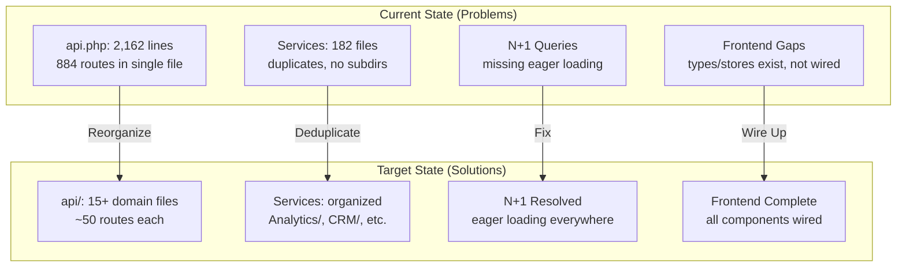

# Design Document: Alumate Platform Hardening & Optimization

## Overview

This design document addresses structural and organizational issues in the Alumate platform identified during the comprehensive viability assessment. The platform has 52 feature areas, 1,018 routes, 257 models, 182 services, and 225 Inertia pages — all of which need to work correctly and perform well.

The approach is **non-breaking refactoring** — reorganizing code without changing external behavior. All route URLs, API responses, and user-facing features remain identical.

Key design decisions:
- **Route files**: Split by domain, preserve all named routes and middleware
- **Service consolidation**: Merge duplicates, preserve all public APIs
- **N+1 fixes**: Add eager loading at the service level, not controller level
- **Frontend completion**: Wire up existing types/stores/services to actual components
- **Performance**: Layer caching at the service level, lazy loading at the component level

## Architecture

### High-Level Refactoring Strategy



### Route Reorganization Design

**Current State:**
```
routes/
├── api.php          ← 2,162 lines, 884 routes
├── web.php          ← 351 lines, 134 routes
├── auth.php
├── tenant.php
├── console.php
├── settings.php
├── testing.php
├── channels.php
└── user-flows.php
```

**Target State:**
```
routes/
├── api/
│   ├── auth.php              ← Authentication & user profile
│   ├── posts.php             ← Social timeline (posts, comments, likes)
│   ├── alumni.php            ← Alumni directory, map, recommendations
│   ├── career.php            ← Career timeline, job matching, applications
│   ├── events.php            ← Events, reunions, check-ins
│   ├── mentorship.php        ← Mentor profiles, requests, sessions
│   ├── skills.php            ← Skills, endorsements, learning resources
│   ├── search.php            ← Advanced search, saved searches
│   ├── notifications.php     ← Notifications, preferences
│   ├── messaging.php         ← Conversations, messages
│   ├── fundraising.php       ← Campaigns, donations, receipts
│   ├── scholarships.php      ← Scholarships, applications
│   ├── forums.php            ← Forums, topics, posts
│   ├── video.php             ← Video calls, recordings
│   ├── email.php             ← Email campaigns, sequences, analytics
│   ├── analytics.php         ← Analytics, insights, custom events
│   ├── components.php        ← Component library, themes, instances
│   ├── templates.php         ← Template management, variants, A/B tests
│   ├── landing-pages.php     ← Landing pages, submissions, analytics
│   ├── brand.php             ← Brand logos, colors, fonts, guidelines
│   ├── admin.php             ← Super admin, institution admin routes
│   ├── crm.php               ← CRM integrations, webhooks, sync
│   ├── subscriptions.php     ← Plans, billing, invoices
│   ├── security.php          ← Security events, audit logs
│   ├── privacy.php           ← Consent, GDPR, data export/deletion
│   ├── system.php            ← Backups, exports, migrations, health
│   └── webhooks.php          ← Webhook delivery, retry, events
├── api.php                   ← Main file: imports + includes only (<100 lines)
├── web.php                   ← Unchanged
├── auth.php                  ← Unchanged
└── ...                       ← Other files unchanged
```

**api.php (Target):**
```php
<?php

use Illuminate\Support\Facades\Route;

// Health checks
Route::get('/ping', fn() => response()->json(['status' => 'ok', 'timestamp' => now()->toISOString()]));
Route::get('/health', fn() => response()->json(['status' => 'ok', 'services' => ['database' => 'ok', 'cache' => 'ok', 'storage' => 'ok']]));

// Domain route files
foreach (glob(__DIR__ . '/api/*.php') as $routeFile) {
    require $routeFile;
}
```

### Service Deduplication Design

**Identified Duplicates:**

| Duplicate Pair | Primary | To Merge | Action |
|---------------|---------|----------|--------|
| `ABTestingService.php` + `AbTestService.php` | `AbTestService.php` | `ABTestingService.php` | Merge into `AbTestService`, delete `ABTestingService` |
| `AnalyticsService.php` + `Analytics/*` services | `AnalyticsService.php` | Directory services | Keep directory structure, ensure AnalyticsService is facade |
| `EmailMarketingService.php` + `EmailDeliveryService.php` + `EmailSendingService.php` | `EmailService.php` (new) | All three | Create unified EmailService with sub-methods |
| `ComponentService.php` + `ComponentRenderService.php` | `ComponentService.php` | `ComponentRenderService` | Merge render logic into ComponentService |
| `TemplateService.php` + `TemplateCacheService.php` | `TemplateService.php` | `TemplateCacheService` | Keep TemplateCacheService as dependency (already done) |

**Target Service Organization:**
```
app/Services/
├── BaseService.php
├── TenantContextService.php
├── Analytics/
│   ├── AnalyticsService.php
│   ├── CohortAnalysisService.php
│   ├── AttributionService.php
│   ├── CustomEventService.php
│   └── ...
├── CRM/
│   ├── CrmIntegrationService.php
│   ├── HubSpotService.php
│   ├── SalesforceService.php
│   └── ...
├── Email/
│   ├── EmailService.php              ← Unified (replaces 3 services)
│   ├── EmailTemplateService.php
│   └── EmailAnalyticsService.php
├── Integrations/
│   ├── GoogleCalendarService.php
│   ├── MatomoService.php
│   └── ...
├── ComponentService.php              ← Unified (includes render logic)
├── TemplateService.php
├── LandingPageService.php            ← Newly implemented
├── BrandCustomizerService.php
├── AbTestService.php                 ← Unified (replaces ABTestingService)
└── ...
```

### N+1 Query Resolution Design

**Pattern: Service-Level Eager Loading**

```php
// BEFORE (N+1):
public function getRecommendations(int $userId): Collection
{
    $alumni = Alumni::where('institution_id', $tenantId)->get();
    foreach ($alumni as $alumni) {
        $alumni->circles;      // N queries
        $alumni->groups;       // N queries
        $alumni->location;     // N queries
    }
}

// AFTER (Eager Loaded):
public function getRecommendations(int $userId): Collection
{
    return Alumni::with(['circles', 'groups', 'location'])
        ->where('institution_id', $tenantId)
        ->get();
}
```

**Affected Services:**

| Service | Relationships to Eager Load | Estimated Query Reduction |
|---------|---------------------------|--------------------------|
| `AlumniRecommendationService` | circles, groups, location | 3N → 3 queries |
| `AlumniMapService` | location, institution | 2N → 2 queries |
| `CareerTimelineService` | milestones, experiences | 2N → 2 queries |
| `JobController` (analytics) | applications, matches, skills | 4N → 4 queries |
| `EventsController` (analytics) | attendees, feedback, highlights | 3N → 3 queries |
| `PostController` (timeline) | user, engagements, comments | 3N → 3 queries |

### Frontend Foundation Design

**Architecture:**
```
resources/js/
├── Types/
│   ├── templates.ts          ← ✅ Created
│   ├── brand.ts              ← ✅ Created
│   ├── landing-pages.ts      ← ✅ Created
│   ├── analytics.ts          ← ✅ Extended
│   └── index.ts              ← ✅ Updated exports
├── Stores/
│   ├── template.ts           ← ✅ Created
│   ├── landingPage.ts        ← ✅ Created
│   ├── brand.ts              ← ✅ Created
│   └── analytics.ts          ← ✅ Created
├── services/
│   ├── template-api.ts       ← ✅ Created
│   ├── brand-api.ts          ← ✅ Created
│   └── analytics-api.ts      ← ✅ Created
├── Components/
│   └── TemplateSystem/
│       ├── TemplateLibrary/  ← ✅ Created (4 components)
│       ├── BrandManager/     ← ✅ Created (5 components)
│       ├── AnalyticsDashboard/ ← ✅ Created
│       ├── ABTesting/        ← ✅ Created
│       ├── TemplateEditor/   ← Structure created
│       ├── TemplateCustomizer/ ← Structure created
│       ├── LandingPageBuilder/ ← Structure created
│       └── Shared/           ← Structure created
└── Pages/
    ├── TemplateSystem/       ← ✅ Library.vue created
    ├── Brand/                ← ✅ Manager.vue created
    ├── LandingPages/         ← ✅ Index.vue created
    └── ABTests/              ← ✅ Manager.vue created
```

**Remaining Frontend Work:**
1. Wire up all components to actual backend API routes
2. Add GrapeJS integration for template editor
3. Add responsive preview component
4. Add loading/error/empty states to all components
5. Add route definitions in web.php for new pages

### Performance Optimization Design

**Caching Strategy:**
```
Layer 1: HTTP Cache (Vite) — Static assets
Layer 2: Component Cache (Vue) — defineAsyncComponent for heavy components
Layer 3: Service Cache (Redis) — Template structures, brand configs, analytics
Layer 4: Query Cache (Eloquent) — Model-level caching with tags
Layer 5: Database Cache (PostgreSQL) — Materialized views for analytics
```

**Vite Code Splitting:**
```typescript
// vite.config.ts additions
manualChunks: {
    'vendor': ['vue', 'pinia', '@inertiajs/vue3'],
    'ui': ['reka-ui', 'lucide-vue-next'],
    'charts': ['chart.js'],
    'maps': ['leaflet'],
    'editor': ['grapesjs'],
    'template-system': ['@/Components/TemplateSystem/**'],
    'brand-manager': ['@/Components/TemplateSystem/BrandManager/**'],
    'analytics': ['@/Components/TemplateSystem/AnalyticsDashboard/**'],
}
```

### Security Hardening Design

**alert() → Toast Migration:**
```typescript
// BEFORE:
alert('Template created successfully!');

// AFTER:
import { toast } from '@/Composables/useToast';
toast.success('Template created successfully!');
```

**Null Safety Pattern:**
```typescript
// BEFORE:
const rate = stats.total / stats.count * 100; // May crash if stats.count is 0

// AFTER:
const rate = stats.count > 0 ? (stats.total / stats.count) * 100 : 0;
```
