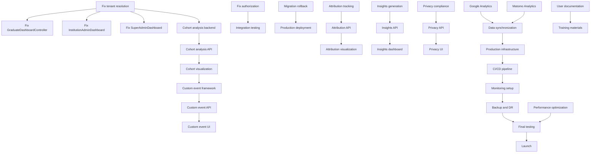

# Project Completion Roadmap

## Executive Summary

This roadmap consolidates all remaining work from 9 specification documents and the Production Readiness Assessment to bring the Alumni Tracking System to 100% production readiness.

**Current Status:**
- **Overall Completion:** ~75% (down from claimed 92%)
- **Production Ready:** NO
- **Critical Issues:** 8 P0 items blocking production
- **Estimated Time to Production:** 6-8 weeks

**Spec Completion Breakdown:**
| Spec | Status | Completion |
|------|--------|------------|
| Email Integration System | ✅ Complete | 100% |
| Calendar Integration Completion | ✅ Complete | 100% |
| Template Creation System | ✅ Complete | 100% |
| Frontend Homepage Enhancement | ✅ Complete | ~100% |
| Vue.js Page Builder System | ✅ Complete | ~95% |
| Component Library System | ⚠️ Near Complete | 93% |
| Modern Alumni Platform | ⚠️ Near Complete | 98% |
| Graduate Tracking System | ⚠️ Near Complete | 95% |
| Advanced Analytics System | 🔄 In Progress | 65% |

---

## Phase 1: Critical Security & Core Functionality (Weeks 1-3)

**Goal:** Resolve all P0 blockers preventing production deployment

### Week 1: Security & Authorization (P0)

- [ ] 1. Fix tenant resolution in AnalyticsController
  - **Location:** `app/Http/Controllers/AnalyticsController.php:L1074`
  - **Issue:** TODO comment for proper tenant resolution
  - **Risk:** Cross-tenant data access vulnerability
  - **Implementation:** Use TenantContextService for proper resolution
  - **Testing:** Verify tenant isolation in analytics queries
  - _Requirements: Security, Multi-tenancy_

- [ ] 2. Implement role-based authorization for cohort comparison
  - **Location:** `app/Http/Requests/CompareCohortsRequest.php:L22, L148`
  - **Issue:** Missing RBAC checks and tenant-based cohort access validation
  - **Risk:** Unauthorized access to analytics features
  - **Implementation:** 
    - Add Spatie permission checks
    - Implement tenant-scoped authorization policies
    - Add middleware validation
  - **Testing:** Authorization tests for all user roles
  - _Requirements: Security, Authorization_

- [ ] 3. Fix GraduateDashboardController tenant access
  - **Location:** `app/Http/Controllers/GraduateDashboardController.php:L102, L129, L200, L293`
  - **Issue:** Multiple TODOs for tenant-specific graduate access
  - **Risk:** Graduate users cannot access tenant-scoped data
  - **Implementation:**
    - Add tenant scope to Graduate model queries
    - Implement middleware validation for tenant context
    - Test cross-tenant access prevention
  - **Testing:** Feature tests for graduate dashboard access
  - _Requirements: Graduate Tracking, Multi-tenancy_

- [ ] 4. Implement migration rollback logic
  - **Location:** `app/Console/Commands/MigrateToSchemaTenancy.php:L446`
  - **Issue:** TODO comment for rollback implementation
  - **Risk:** No disaster recovery from failed migrations
  - **Implementation:**
    - Create full rollback procedure
    - Test rollback on staging environment
    - Document rollback runbook
  - **Testing:** Integration tests for rollback scenarios
  - _Requirements: Infrastructure, Disaster Recovery_

### Week 2: Dashboard Functionality (P0)

- [ ] 5. Fix InstitutionAdminDashboardController zero values
  - **Location:** `app/Http/Controllers/InstitutionAdminDashboardController.php:L127-131`
  - **Issue:** Hardcoded zeros for graduate counts, job counts, application counts
  - **Risk:** Admin dashboard non-functional
  - **Implementation:**
    - Implement tenant-scoped graduate counting queries
    - Create institution-job relationship or tenant-scoped queries
    - Add application tracking per institution
  - **Testing:** Dashboard data accuracy tests
  - _Requirements: Graduate Tracking, Dashboards_

- [ ] 6. Fix SuperAdminDashboardController cross-tenant aggregation
  - **Location:** `app/Http/Controllers/SuperAdminDashboardController.php:L95, L438`
  - **Issue:** TODO for cross-tenant graduate counting and data aggregation
  - **Risk:** Platform-wide analytics unavailable
  - **Implementation:**
    - Create secure cross-tenant aggregation service
    - Add caching for aggregated metrics
    - Ensure tenant data isolation
  - **Testing:** Cross-tenant data aggregation tests
  - _Requirements: Analytics, Multi-tenancy_

### Week 3: Testing Infrastructure (P0)

- [ ] 7. Add PostgreSQL testing to CI pipeline
  - **Location:** `phpunit.xml`, `.github/workflows/ci.yml`
  - **Issue:** Unit tests use SQLite, production uses PostgreSQL
  - **Risk:** PostgreSQL-specific bugs not caught in testing
  - **Implementation:**
    - Add PostgreSQL service to unit test job
    - Create separate test suite for PostgreSQL-specific features
    - Test tenant schema creation/deletion
  - **Testing:** Full test suite on PostgreSQL
  - _Requirements: Testing, Infrastructure_

- [ ] 8. Generate and validate test reports
  - **Location:** `tests/reports/`
  - **Issue:** Empty or incomplete test reports
  - **Risk:** Cannot verify test suite health
  - **Implementation:**
    - Run full test suite and capture results
    - Set up test reporting in CI pipeline
    - Establish minimum coverage thresholds (80%)
  - **Testing:** Test reporting validation
  - _Requirements: Testing, Quality Assurance_

---

## Phase 2: Advanced Analytics Completion (Weeks 4-6)

**Goal:** Complete remaining Advanced Analytics System features (35% remaining)

### Week 4: Cohort Analysis & Attribution Modeling

- [ ] 9. Implement cohort analysis backend
  - **Tasks from:** `advanced-analytics-system/tasks.md` Task 8.1
  - **Implementation:**
    - Build cohort grouping and tracking algorithms
    - Implement retention, engagement, conversion calculations
    - Add cohort comparison and trend analysis
    - Create automated insight generation
  - **Testing:** Unit tests for cohort analysis logic
  - _Requirements: 6.1, 6.2, 6.3, 6.4_

- [ ] 10. Build cohort analysis API
  - **Tasks from:** `advanced-analytics-system/tasks.md` Task 8.2
  - **Implementation:**
    - Create cohort data retrieval endpoints
    - Implement cohort configuration API
    - Add trend analysis and comparison endpoints
  - **Testing:** Feature tests for cohort API
  - _Requirements: 6.1, 6.2, 6.3, 6.4_

- [ ] 11. Develop cohort visualization component
  - **Tasks from:** `advanced-analytics-system/tasks.md` Task 8.3
  - **Implementation:**
    - Create cohort analysis visualization with trend charts
    - Implement cohort comparison interface
    - Add performance highlighting
  - **Testing:** Component tests for cohort visualization
  - _Requirements: 6.2, 6.3_

- [ ] 12. Implement attribution tracking system
  - **Tasks from:** `advanced-analytics-system/tasks.md` Task 9.1
  - **Implementation:**
    - Create multi-touch customer journey tracking
    - Implement first-click, last-click, multi-touch models
    - Add channel contribution analysis
    - Create budget allocation recommendations
  - **Testing:** Unit tests for attribution modeling
  - _Requirements: 7.1, 7.2, 7.3, 7.4_

- [ ] 13. Build attribution analysis API
  - **Tasks from:** `advanced-analytics-system/tasks.md` Task 9.2
  - **Implementation:**
    - Create attribution data retrieval endpoints
    - Implement channel performance analysis API
    - Add budget allocation recommendation generation
  - **Testing:** Feature tests for attribution API
  - _Requirements: 7.1, 7.2, 7.3, 7.4_

- [ ] 14. Develop attribution visualization component
  - **Tasks from:** `advanced-analytics-system/tasks.md` Task 9.3
  - **Implementation:**
    - Create attribution model comparison interface
    - Implement channel contribution visualization
    - Add budget allocation recommendation display
  - **Testing:** Component tests for attribution visualization
  - _Requirements: 7.2, 7.3_

### Week 5: Custom Events & External Integrations

- [ ] 15. Implement custom event tracking framework
  - **Tasks from:** `advanced-analytics-system/tasks.md` Task 11.1
  - **Implementation:**
    - Create flexible custom event definition system
    - Implement event context capture and user property tracking
    - Add custom event validation and processing
    - Create event-based funnel analysis
  - **Testing:** Unit tests for custom event tracking
  - _Requirements: 9.1, 9.2, 9.3, 9.4_

- [ ] 16. Build custom event API
  - **Tasks from:** `advanced-analytics-system/tasks.md` Task 11.2
  - **Implementation:**
    - Create custom event definition endpoints
    - Implement event tracking and analysis API
    - Add behavior flow analysis
  - **Testing:** Feature tests for custom event API
  - _Requirements: 9.1, 9.2, 9.3, 9.4_

- [ ] 17. Develop custom event management UI
  - **Tasks from:** `advanced-analytics-system/tasks.md` Task 11.3
  - **Implementation:**
    - Create custom event configuration interface
    - Implement event tracking visualization
    - Add behavior flow display
  - **Testing:** Component tests for custom event management
  - _Requirements: 9.2, 9.3_

- [ ] 18. Build Google Analytics integration
  - **Tasks from:** `advanced-analytics-system/tasks.md` Task 12.1
  - **Implementation:**
    - Create Google Analytics API integration service
    - Implement event forwarding with consistent naming
    - Add custom dimension mapping
    - Create audience segment sharing
  - **Testing:** Integration tests for Google Analytics
  - _Requirements: 10.1, 10.2, 10.3, 10.4_

- [ ] 19. Create Matomo Analytics integration
  - **Tasks from:** `advanced-analytics-system/tasks.md` Task 12.2
  - **Implementation:**
    - Build Matomo Analytics API integration
    - Implement custom dimensions and goals mapping
    - Add data synchronization
  - **Testing:** Integration tests for Matomo
  - _Requirements: 10.1, 10.2, 10.3, 10.4_

- [ ] 20. Implement data synchronization system
  - **Tasks from:** `advanced-analytics-system/tasks.md` Task 12.3
  - **Implementation:**
    - Create unified data view combining internal and external analytics
    - Implement data discrepancy detection
    - Add synchronization monitoring
  - **Testing:** Tests for data synchronization
  - _Requirements: 10.2, 10.3, 10.4_

### Week 6: Automated Insights & Privacy Compliance

- [ ] 21. Create automated insights generation system
  - **Tasks from:** `advanced-analytics-system/tasks.md` Task 13.1
  - **Implementation:**
    - Build trend and anomaly detection algorithms
    - Implement actionable recommendation generation
    - Add recommendation effectiveness tracking
    - Create ML system for recommendation improvement
  - **Testing:** Unit tests for insight generation
  - _Requirements: 11.1, 11.2, 11.3, 11.4_

- [ ] 22. Build insights API
  - **Tasks from:** `advanced-analytics-system/tasks.md` Task 13.2
  - **Implementation:**
    - Create automated insights retrieval endpoints
    - Implement recommendation tracking API
    - Add insight configuration options
  - **Testing:** Feature tests for insights API
  - _Requirements: 11.1, 11.2, 11.3, 11.4_

- [ ] 23. Develop insights dashboard component
  - **Tasks from:** `advanced-analytics-system/tasks.md` Task 13.3
  - **Implementation:**
    - Create automated insights display with recommendation cards
    - Implement recommendation implementation tracking
    - Add insight effectiveness visualization
  - **Testing:** Component tests for insights dashboard
  - _Requirements: 11.2, 11.3_

- [ ] 24. Implement privacy compliance system
  - **Tasks from:** `advanced-analytics-system/tasks.md` Task 14.1
  - **Implementation:**
    - Build GDPR and CCPA compliant consent collection
    - Implement granular consent categories
    - Add consent withdrawal processing and data deletion
    - Create audit trail for compliance reporting
  - **Testing:** Unit tests for consent management
  - _Requirements: 12.1, 12.2, 12.3, 12.4_

- [ ] 25. Build privacy controls API
  - **Tasks from:** `advanced-analytics-system/tasks.md` Task 14.2
  - **Implementation:**
    - Create consent management endpoints
    - Implement data deletion and anonymization API
    - Add compliance reporting endpoints
  - **Testing:** Feature tests for privacy API
  - _Requirements: 12.1, 12.2, 12.3, 12.4_

- [ ] 26. Develop privacy management UI
  - **Tasks from:** `advanced-analytics-system/tasks.md` Task 14.3
  - **Implementation:**
    - Create consent management interface
    - Implement privacy preference controls
    - Add compliance dashboard for administrators
  - **Testing:** Component tests for privacy management
  - _Requirements: 12.1, 12.2, 12.3_

---

## Phase 3: Learning Analytics & Testing (Weeks 7-8)

### Week 7: Learning Analytics System

- [ ] 27. Create learning analytics service
  - **Tasks from:** `advanced-analytics-system/tasks.md` Task 16.1
  - **Implementation:**
    - Build LearningAnalyticsService for course completion tracking
    - Implement engagement scoring and progress analytics
    - Add certification verification tracking
    - Create learning path effectiveness measurement
  - **Testing:** Unit tests for learning analytics
  - _Requirements: Roadmap Phase 2 learning management integration_

- [ ] 28. Build learning analytics API
  - **Tasks from:** `advanced-analytics-system/tasks.md` Task 16.2
  - **Implementation:**
    - Create learning progress tracking endpoints
    - Implement course effectiveness analysis API
    - Add certification tracking endpoints
  - **Testing:** Feature tests for learning analytics API
  - _Requirements: Roadmap Phase 2 learning management integration_

- [ ] 29. Develop learning analytics dashboard
  - **Tasks from:** `advanced-analytics-system/tasks.md` Task 16.3
  - **Implementation:**
    - Create learning progress visualization components
    - Implement course effectiveness displays
    - Add certification tracking interface
  - **Testing:** Component tests for learning dashboard
  - _Requirements: Roadmap Phase 2 learning management integration_

### Week 8: Comprehensive Testing Suite

- [ ] 30. Write unit tests for all analytics services
  - **Tasks from:** `advanced-analytics-system/tasks.md` Task 19.1
  - **Implementation:**
    - Create comprehensive unit tests for all analytics services
    - Test edge cases and error scenarios
    - Add performance benchmarking
    - Achieve minimum 80% test coverage
  - **Testing:** Full unit test suite
  - _Requirements: All requirements validation_

- [ ] 31. Build integration tests
  - **Tasks from:** `advanced-analytics-system/tasks.md` Task 19.2
  - **Implementation:**
    - Create end-to-end tests for analytics workflows
    - Test API integrations with external platforms
    - Add real-time functionality tests
    - Test multi-tenant data isolation
  - **Testing:** Full integration test suite
  - _Requirements: All requirements validation_

- [ ] 32. Implement performance tests
  - **Tasks from:** `advanced-analytics-system/tasks.md` Task 19.3
  - **Implementation:**
    - Create load tests for high-volume event processing
    - Implement stress tests for real-time dashboard
    - Add scalability tests for concurrent users
    - Create performance regression tests
  - **Testing:** Performance test suite execution
  - _Requirements: Performance and scalability_

---

## Phase 4: Production Infrastructure & Deployment (Weeks 9-10)

### Week 9: Production Environment Setup

- [ ] 33. Configure production server infrastructure
  - **Tasks from:** `graduate-tracking-system/tasks.md` Task 21, `modern-alumni-platform/tasks.md` Task 1
  - **Implementation:**
    - Set up load balancing (Nginx/ALB)
    - Configure database clustering (PostgreSQL primary-replica)
    - Set up CDN for static assets (CloudFlare/CloudFront)
    - Configure SSL certificates and security headers
  - **Testing:** Infrastructure validation tests
  - _Requirements: System reliability and performance_

- [ ] 34. Implement CI/CD pipeline
  - **Implementation:**
    - Set up automated deployments with rollback
    - Configure blue-green deployment strategy
    - Add automated database migrations
    - Implement deployment verification tests
  - **Testing:** CI/CD pipeline tests
  - _Requirements: Production deployment readiness_

- [ ] 35. Set up monitoring and alerting
  - **Tasks from:** `graduate-tracking-system/tasks.md` Task 21, `modern-alumni-platform/tasks.md` Task 2
  - **Implementation:**
    - Configure application performance monitoring (APM)
    - Set up uptime monitoring and health checks
    - Implement log aggregation and error tracking
    - Create automated alerting for critical issues
  - **Testing:** Monitoring system validation
  - _Requirements: Production monitoring and reliability_

- [ ] 36. Configure backup and disaster recovery
  - **Implementation:**
    - Set up automated database backups
    - Create backup verification procedures
    - Implement disaster recovery runbooks
    - Test backup restoration process
  - **Testing:** Disaster recovery drills
  - _Requirements: Data protection and recovery_

### Week 10: Final Integration & Deployment

- [ ] 37. Integrate analytics with existing platform systems
  - **Tasks from:** `advanced-analytics-system/tasks.md` Task 20.1
  - **Implementation:**
    - Connect analytics with CRM integrations
    - Integrate with AI/ML prediction models
    - Connect with WebSocket/Pusher infrastructure
    - Integrate with user management and tenant systems
  - **Testing:** Integration tests for platform connectivity
  - _Requirements: All requirements integration_

- [ ] 38. Create deployment configuration
  - **Tasks from:** `advanced-analytics-system/tasks.md` Task 20.2
  - **Implementation:**
    - Set up production environment configuration
    - Create database migration deployment scripts
    - Configure queue workers for analytics processing
    - Set up monitoring and alerting
  - **Testing:** Deployment configuration validation
  - _Requirements: Production deployment_

- [ ] 39. Conduct final testing and validation
  - **Tasks from:** `advanced-analytics-system/tasks.md` Task 20.3
  - **Implementation:**
    - Perform comprehensive system testing
    - Validate privacy compliance and data protection
    - Test performance under production-like conditions
    - Verify integration with external platforms
    - Conduct user acceptance testing
  - **Testing:** Full system validation
  - _Requirements: All requirements final validation_

---

## Phase 5: Documentation & Training (Weeks 11-12)

### Week 11: Documentation Creation

- [ ] 40. Create comprehensive user documentation
  - **Tasks from:** `graduate-tracking-system/tasks.md` Task 22, `modern-alumni-platform/tasks.md` Task 3
  - **Implementation:**
    - Write user guides for all roles (alumni, institutions, employers, admins)
    - Create API documentation with examples and SDKs
    - Develop troubleshooting guides and FAQ
    - Build in-app help system
  - **Testing:** Documentation review and validation
  - _Requirements: User adoption and system maintenance_

- [ ] 41. Create system administration guides
  - **Implementation:**
    - Write deployment and configuration guides
    - Create monitoring and maintenance runbooks
    - Document security procedures and incident response
    - Build disaster recovery documentation
  - **Testing:** Documentation accuracy verification
  - _Requirements: System maintenance_

- [ ] 42. Develop video tutorials and training materials
  - **Implementation:**
    - Create video tutorials for key features
    - Build onboarding sequences for different user types
    - Develop administrator training materials
    - Create feature demonstration videos
  - **Testing:** Training material review
  - _Requirements: User adoption and training_

### Week 12: Final Polish & Launch Preparation

- [ ] 43. Optimize performance for production
  - **Tasks from:** `component-library-system/tasks.md` Task 54
  - **Implementation:**
    - Implement production-level caching strategies
    - Optimize database queries and add indexes
    - Configure CDN integration for assets
    - Set up performance monitoring
  - **Testing:** Performance benchmarking
  - _Requirements: 7.2, 7.3, 9.1, 9.2, 10.4_

- [ ] 44. Implement remaining notification TODOs
  - **Location:** Multiple files (SkillsController, UserFlowController, SpeakerBureauController)
  - **Implementation:**
    - Send notification to endorser (SkillsController:L125)
    - Send notification to referrer (UserFlowController:L361)
    - Send notification to connector (UserFlowController:L422)
    - Send notification to speaker (SpeakerBureauController:L204)
  - **Testing:** Notification delivery tests
  - _Requirements: User engagement_

- [ ] 45. Complete consent purge job external integrations
  - **Location:** `app/Jobs/ConsentPurgeJob.php:L85`
  - **Implementation:**
    - Implement Google Analytics opt-out API
    - Implement Matomo user deletion API
    - Add audit logging for purge operations
  - **Testing:** GDPR compliance tests
  - _Requirements: GDPR compliance_

- [ ] 46. Create BrandGuidelineReview model
  - **Location:** `app/Models/BrandGuidelines.php`
  - **Implementation:**
    - Create BrandGuidelineReview migration
    - Create BrandGuidelineReview model
    - Implement approval workflow
    - Add logging for review activities
  - **Testing:** Brand guideline workflow tests
  - _Requirements: Feature completion_

- [ ] 47. Fix StudentController placeholder values
  - **Location:** `app/Http/Controllers/StudentController.php`
  - **Implementation:**
    - Calculate actual mutual connections
    - Calculate actual response rate from historical data
    - Check connection status from Connection model
  - **Testing:** Student profile data accuracy tests
  - _Requirements: Data accuracy_

---

## Phase 6: Quality Assurance & Launch (Week 13)

### Week 13: Final QA and Launch

- [ ] 48. Conduct comprehensive integration testing
  - **Implementation:**
    - Test complete workflows across all features
    - Validate multi-tenant isolation
    - Perform load testing with realistic scenarios
    - Test GrapeJS integration with complex layouts
  - **Testing:** Full integration test suite
  - _Requirements: All requirements - final system integration_

- [ ] 49. Perform security testing
  - **Implementation:**
    - Conduct penetration testing
    - Test authentication and authorization
    - Validate input sanitization
    - Test CSRF and XSS protection
  - **Testing:** Security test suite
  - _Requirements: Security validation_

- [ ] 50. Execute user acceptance testing
  - **Implementation:**
    - Create UAT scenarios for all user roles
    - Conduct UAT with stakeholders
    - Collect and address feedback
    - Verify all requirements met
  - **Testing:** UAT completion sign-off
  - _Requirements: Stakeholder approval_

- [ ] 51. Prepare launch checklist and execute
  - **Implementation:**
    - Create migration plan for data migration
    - Document rollback procedures
    - Prepare launch checklist
    - Execute launch plan
  - **Testing:** Launch readiness verification
  - _Requirements: Successful launch_

---

## Task Dependencies

---

## Success Criteria

### Phase 1 Success Criteria
- [ ] All P0 security issues resolved
- [ ] All dashboard controllers returning accurate data
- [ ] CI pipeline testing on PostgreSQL
- [ ] Test coverage reports generated with >80% coverage

### Phase 2 Success Criteria
- [ ] Cohort analysis fully functional with visualization
- [ ] Attribution modeling working with all models
- [ ] Custom event tracking implemented
- [ ] External analytics integrations (Google Analytics, Matomo) working

### Phase 3 Success Criteria
- [ ] Automated insights generating recommendations
- [ ] Privacy compliance system GDPR/CCPA compliant
- [ ] Learning analytics tracking course progress
- [ ] All analytics services have >80% test coverage

### Phase 4 Success Criteria
- [ ] Production infrastructure deployed and tested
- [ ] CI/CD pipeline operational with automated deployments
- [ ] Monitoring and alerting active
- [ ] Backup and disaster recovery tested

### Phase 5 Success Criteria
- [ ] Complete documentation for all user types
- [ ] Video tutorials created for key features
- [ ] All TODO comments resolved
- [ ] Performance optimized for production load

### Phase 6 Success Criteria
- [ ] All integration tests passing
- [ ] Security tests completed with no critical vulnerabilities
- [ ] User acceptance testing signed off
- [ ] Platform successfully launched to production

---

## Risk Assessment

| Risk | Probability | Impact | Mitigation |
|------|-------------|--------|------------|
| Cross-tenant data leak | High | Critical | Fix all tenant isolation TODOs before any production data |
| Analytics performance issues | Medium | High | Implement caching and query optimization early |
| Integration test failures | Medium | Medium | Start integration testing in Week 2, not at end |
| External API rate limits | Medium | Medium | Implement rate limiting and backoff strategies |
| GDPR compliance gaps | Medium | Critical | Complete privacy compliance before any EU users |
| Database migration failures | Low | Critical | Test rollback procedures thoroughly |
| CDN configuration issues | Low | Medium | Test CDN with staging environment first |

---

## Resource Requirements

### Development Resources
- **Backend Developers:** 2-3 (Laravel/PHP expertise)
- **Frontend Developers:** 1-2 (Vue 3/TypeScript)
- **DevOps Engineer:** 1 (Infrastructure/CI/CD)
- **QA Engineer:** 1 (Testing automation)

### Infrastructure Requirements
- **Staging Environment:** PostgreSQL, Redis, Queue workers
- **Production Environment:** Load balancers, Database cluster, CDN
- **Monitoring:** APM tool (New Relic/Datadog), Error tracking (Sentry)
- **Testing:** CI/CD pipeline with PostgreSQL testing

### External Services
- **Google Analytics:** API credentials and testing account
- **Matomo Analytics:** Instance setup and API access
- **CDN Provider:** CloudFlare or AWS CloudFront
- **Email Service:** Production email provider (SendGrid/Mailgun)

---

## Progress Tracking

### Weekly Status Updates
Each week should include:
1. Tasks completed vs planned
2. Blockers and dependencies
3. Test coverage metrics
4. Performance benchmarks
5. Security scan results

### Milestone Reviews
- **End of Phase 1:** Security audit and dashboard functionality review
- **End of Phase 2:** Analytics feature completeness review
- **End of Phase 3:** Testing coverage and quality review
- **End of Phase 4:** Infrastructure readiness review
- **End of Phase 5:** Documentation completeness review
- **End of Phase 6:** Launch readiness sign-off

---

**Document Version:** 1.0  
**Created:** January 29, 2026  
**Last Updated:** January 29, 2026  
**Next Review:** End of Phase 1
