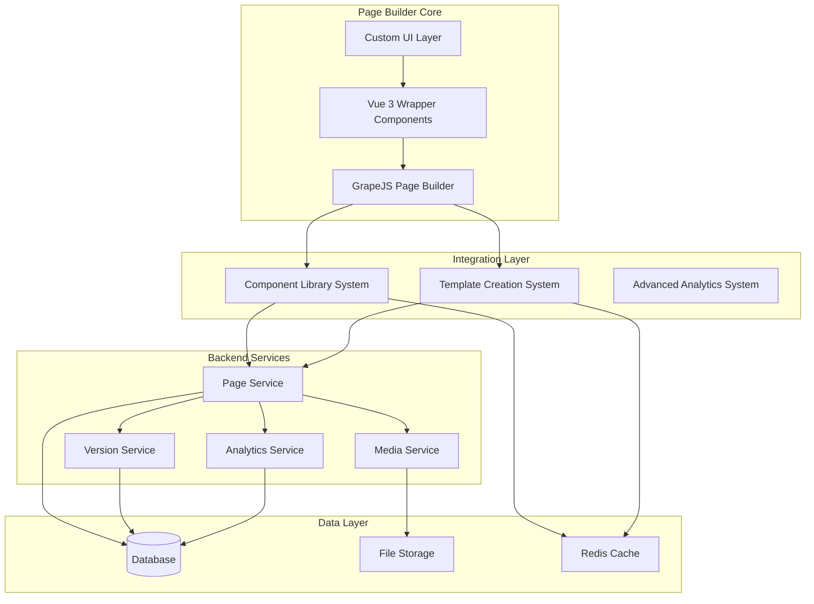

# Vue.js Page Builder System Design

## Overview

The Vue.js Page Builder System is a comprehensive drag-and-drop interface built on GrapeJS that enables marketing administrators to create, customize, and manage landing pages without technical expertise. The system deeply integrates with the existing Component Library System and Template Creation System to provide a unified page building experience with advanced features like real-time editing, responsive design tools, A/B testing, and analytics integration.

## Architecture

### High-Level Architecture



### Technology Stack

- **Page Builder Core**: GrapeJS v0.21+ with custom Vue 3 integration
- **Frontend Framework**: Vue 3 with TypeScript and Composition API
- **UI Framework**: Tailwind CSS with custom GrapeJS theme integration
- **State Management**: Pinia for Vue state + GrapeJS internal state management
- **Backend Integration**: Laravel API with Inertia.js for seamless data flow
- **Real-time Updates**: Laravel Echo with WebSocket support for collaboration
- **Storage**: Laravel Eloquent models with JSON field support for GrapeJS configurations
- **Component Integration**: Direct integration with existing Component Library System
- **Template Integration**: Seamless loading from Template Creation System

## Components and Interfaces

### GrapeJS Integration Architecture

#### 1. GrapeJS Vue Wrapper Component
```typescript
// Main Vue component that wraps GrapeJS
interface GrapeJSPageBuilder {
  // GrapeJS instance management
  editor: grapesjs.Editor
  config: GrapeJSConfig
  
  // Integration with existing systems
  componentLibrary: ComponentLibraryService
  templateSystem: TemplateCreationService
  
  // Vue-specific state
  isLoading: boolean
  selectedComponent: Component | null
  deviceMode: 'desktop' | 'tablet' | 'mobile'
}

interface GrapeJSConfig {
  container: string
  height: string
  width: string
  storageManager: StorageManagerConfig
  blockManager: BlockManagerConfig
  styleManager: StyleManagerConfig
  deviceManager: DeviceManagerConfig
  panels: PanelsConfig
  canvas: CanvasConfig
}
```

#### 2. Component Library Integration
```typescript
// Integration with existing Component Library System
interface ComponentLibraryBridge {
  // Convert Component Library components to GrapeJS blocks
  convertToGrapeJSBlocks(components: Component[]): GrapeJSBlock[]
  
  // Load components from existing system
  loadComponentCategories(): Promise<ComponentCategory[]>
  
  // Register components with GrapeJS Block Manager
  registerBlocks(editor: grapesjs.Editor, components: Component[]): void
  
  // Handle component updates from library
  syncComponentUpdates(editor: grapesjs.Editor): void
}

interface GrapeJSBlock {
  id: string
  label: string
  category: string
  content: string | ComponentDefinition
  media: string
  attributes: {
    class: string
    'data-component-id': string
  }
}
```

#### 3. Template System Integration
```typescript
// Integration with existing Template Creation System
interface TemplateSystemBridge {
  // Load templates into GrapeJS
  loadTemplate(templateId: string): Promise<GrapeJSTemplate>
  
  // Convert GrapeJS pages to templates
  saveAsTemplate(
    editor: grapesjs.Editor, 
    metadata: TemplateMetadata
  ): Promise<Template>
  
  // Apply template to current page
  applyTemplate(editor: grapesjs.Editor, template: Template): void
  
  // Template preview generation
  generatePreview(template: Template): Promise<string>
}

interface GrapeJSTemplate {
  html: string
  css: string
  components: ComponentDefinition[]
  styles: StyleDefinition[]
  metadata: TemplateMetadata
}
```

#### 4. Custom GrapeJS Components
```typescript
// Custom components that extend GrapeJS functionality
interface CustomGrapeJSComponents {
  // Alumni-specific components
  AlumniHeroComponent: GrapeJSComponentDefinition
  AlumniFormComponent: GrapeJSComponentDefinition
  AlumniTestimonialComponent: GrapeJSComponentDefinition
  AlumniStatsComponent: GrapeJSComponentDefinition
  
  // Integration components
  CRMFormComponent: GrapeJSComponentDefinition
  AnalyticsTrackingComponent: GrapeJSComponentDefinition
  ABTestVariantComponent: GrapeJSComponentDefinition
}

interface GrapeJSComponentDefinition {
  model: ComponentModel
  view: ComponentView
  isComponent: (el: HTMLElement) => boolean
  extend?: string
  extendFn?: string[]
}
```

### GrapeJS Configuration and Setup

#### 1. Core GrapeJS Configuration
```typescript
// Comprehensive GrapeJS setup optimized for alumni platform
const grapeJSConfig: GrapeJSConfig = {
  // Container and basic setup
  container: '#grapesjs-editor',
  height: '100vh',
  width: 'auto',
  
  // Storage configuration for Laravel backend
  storageManager: {
    type: 'remote',
    stepsBeforeSave: 3,
    options: {
      remote: {
        urlLoad: '/api/pages/{id}/grapejs-data',
        urlStore: '/api/pages/{id}/grapejs-data',
        headers: {
          'X-CSRF-TOKEN': document.querySelector('meta[name="csrf-token"]')?.getAttribute('content'),
          'Accept': 'application/json',
          'Content-Type': 'application/json'
        }
      }
    }
  },
  
  // Block Manager for Component Library integration
  blockManager: {
    appendTo: '#blocks-container',
    blocks: [] // Populated dynamically from Component Library
  },
  
  // Style Manager with Tailwind CSS integration
  styleManager: {
    appendTo: '#styles-container',
    sectors: [
      {
        name: 'Layout',
        properties: [
          'display', 'position', 'top', 'right', 'left', 'bottom',
          'width', 'height', 'max-width', 'min-height', 'margin', 'padding'
        ]
      },
      {
        name: 'Typography',
        properties: [
          'font-family', 'font-size', 'font-weight', 'letter-spacing',
          'color', 'line-height', 'text-align', 'text-decoration', 'text-transform'
        ]
      },
      {
        name: 'Background',
        properties: [
          'background-color', 'background-image', 'background-repeat',
          'background-position', 'background-attachment', 'background-size'
        ]
      },
      {
        name: 'Border',
        properties: [
          'border-width', 'border-style', 'border-color', 'border-radius'
        ]
      }
    ]
  },
  
  // Device Manager for responsive design
  deviceManager: {
    devices: [
      { name: 'Desktop', width: '1200px' },
      { name: 'Tablet', width: '768px', widthMedia: '992px' },
      { name: 'Mobile', width: '375px', widthMedia: '768px' }
    ]
  },
  
  // Panels configuration
  panels: {
    defaults: [
      {
        id: 'layers',
        el: '.panel__right',
        resizable: {
          maxDim: 350,
          minDim: 200,
          tc: 0, cr: 1, bc: 0, cl: 0
        }
      },
      {
        id: 'styles',
        el: '.panel__right',
        resizable: {
          maxDim: 350,
          minDim: 200,
          tc: 0, cr: 1, bc: 0, cl: 0
        }
      }
    ]
  },
  
  // Canvas configuration
  canvas: {
    styles: [
      // Include Tailwind CSS for accurate preview
      '/build/assets/app.css'
    ],
    scripts: [
      // Include any required JavaScript for components
      '/build/assets/app.js'
    ]
  },
  
  // Plugin configuration
  plugins: [
    'gjs-blocks-basic',
    'grapesjs-plugin-forms',
    'grapesjs-component-countdown',
    'grapesjs-plugin-export',
    'grapesjs-tabs',
    'grapesjs-custom-code',
    'grapesjs-touch',
    'grapesjs-parser-postcss',
    'grapesjs-tooltip',
    'grapesjs-tui-image-editor',
    'grapesjs-typed',
    'grapesjs-style-bg'
  ],
  
  // Plugin options
  pluginsOpts: {
    'gjs-blocks-basic': { flexGrid: true },
    'grapesjs-plugin-forms': {
      blocks: ['form', 'input', 'textarea', 'select', 'button', 'label', 'checkbox', 'radio']
    },
    'grapesjs-plugin-export': {
      addExportBtn: true,
      btnLabel: 'Export',
      filenamePfx: 'alumni-page',
      filename: (editor: grapesjs.Editor) => `page-${Date.now()}`,
      root: {
        css: {
          'style.css': (editor: grapesjs.Editor) => editor.getCss()
        },
        'index.html': (editor: grapesjs.Editor) => `
          <!DOCTYPE html>
          <html>
            <head>
              <meta charset="utf-8">
              <title>Alumni Page</title>
              <meta name="viewport" content="width=device-width, initial-scale=1">
              <link rel="stylesheet" href="style.css">
            </head>
            <body>${editor.getHtml()}</body>
          </html>
        `
      }
    }
  }
}
```

#### 2. Component Library Bridge Implementation
```typescript
// Bridge between Component Library System and GrapeJS
class ComponentLibraryBridge {
  private editor: grapesjs.Editor
  private componentService: ComponentService
  
  constructor(editor: grapesjs.Editor) {
    this.editor = editor
    this.componentService = new ComponentService()
  }
  
  async initializeComponents() {
    // Load all components from Component Library System
    const components = await this.componentService.getComponents()
    
    // Group by category for better organization
    const categorizedComponents = this.groupByCategory(components)
    
    // Register each category as GrapeJS blocks
    Object.entries(categorizedComponents).forEach(([category, components]) => {
      this.registerComponentCategory(category, components)
    })
  }
  
  private registerComponentCategory(category: string, components: Component[]) {
    const blocks = components.map(component => this.convertToGrapeJSBlock(component))
    
    // Add category to block manager
    this.editor.BlockManager.add(category, blocks)
  }
  
  private convertToGrapeJSBlock(component: Component): GrapeJSBlock {
    return {
      id: `component-${component.id}`,
      label: component.name,
      category: component.category,
      media: component.metadata.preview_image || this.getDefaultIcon(component.category),
      content: {
        type: 'component-wrapper',
        components: component.config.template,
        attributes: {
          'data-component-id': component.id,
          'data-component-type': component.type,
          class: `alumni-component ${component.category.toLowerCase()}-component`
        },
        traits: this.convertConfigToTraits(component.config)
      }
    }
  }
  
  private convertConfigToTraits(config: ComponentConfig): GrapeJSTrait[] {
    return Object.entries(config.customizable_properties || {}).map(([key, property]) => ({
      type: this.getTraitType(property.type),
      name: key,
      label: property.label,
      default: property.default,
      options: property.options || []
    }))
  }
}
```

#### 3. Template System Bridge Implementation
```typescript
// Bridge between Template Creation System and GrapeJS
class TemplateSystemBridge {
  private editor: grapesjs.Editor
  private templateService: TemplateService
  
  constructor(editor: grapesjs.Editor) {
    this.editor = editor
    this.templateService = new TemplateService()
  }
  
  async loadTemplate(templateId: string) {
    const template = await this.templateService.getTemplate(templateId)
    
    // Convert Template Creation System format to GrapeJS
    const grapeJSData = this.convertTemplateToGrapeJS(template)
    
    // Load into editor
    this.editor.setComponents(grapeJSData.components)
    this.editor.setStyle(grapeJSData.styles)
    
    // Apply template-specific configurations
    this.applyTemplateConfiguration(template)
  }
  
  private convertTemplateToGrapeJS(template: Template): GrapeJSData {
    const components = template.structure.sections.map(section => 
      this.convertSectionToComponent(section)
    )
    
    const styles = this.convertConfigToStyles(template.default_config)
    
    return { components, styles }
  }
  
  private convertSectionToComponent(section: TemplateSection): GrapeJSComponent {
    return {
      type: section.type,
      components: section.config.content || '',
      attributes: {
        class: this.generateTailwindClasses(section.config),
        'data-section-type': section.type
      },
      traits: this.convertSectionConfigToTraits(section.config)
    }
  }
  
  async saveAsTemplate(metadata: TemplateMetadata): Promise<Template> {
    const grapeJSData = {
      html: this.editor.getHtml(),
      css: this.editor.getCss(),
      components: this.editor.getComponents(),
      styles: this.editor.getStyles()
    }
    
    // Convert back to Template Creation System format
    const templateData = this.convertGrapeJSToTemplate(grapeJSData, metadata)
    
    return await this.templateService.createTemplate(templateData)
  }
}
```

### Vue 3 Integration Layer

#### 1. Page Builder Container
```vue
<template>
  <div class="page-builder-container">
    <!-- GrapeJS Editor Container -->
    <div ref="grapesjsContainer" class="grapesjs-editor"></div>
    
    <!-- Custom Vue UI Overlays -->
    <ComponentLibraryPanel 
      v-if="showComponentPanel"
      :components="componentLibrary.components"
      @component-selected="addComponentToEditor"
    />
    
    <TemplateLibraryPanel
      v-if="showTemplatePanel"
      :templates="templateSystem.templates"
      @template-selected="loadTemplateIntoEditor"
    />
    
    <CollaborationPanel
      v-if="collaborationEnabled"
      :active-users="collaborators"
      :changes="realtimeChanges"
    />
  </div>
</template>

<script setup lang="ts">
import { ref, onMounted, onUnmounted } from 'vue'
import grapesjs from 'grapesjs'
import { useComponentLibrary } from '@/composables/useComponentLibrary'
import { useTemplateSystem } from '@/composables/useTemplateSystem'
import { useCollaboration } from '@/composables/useCollaboration'

const grapesjsContainer = ref<HTMLElement>()
const editor = ref<grapesjs.Editor>()

const { componentLibrary, loadComponents } = useComponentLibrary()
const { templateSystem, loadTemplates } = useTemplateSystem()
const { collaborators, realtimeChanges, initCollaboration } = useCollaboration()
</script>
```

#### 2. Component Library Panel Integration
```typescript
// Vue composable for Component Library integration
export function useComponentLibrary() {
  const componentService = new ComponentService()
  const components = ref<Component[]>([])
  
  const loadComponents = async () => {
    const libraryComponents = await componentService.getComponents()
    components.value = libraryComponents
    return convertToGrapeJSBlocks(libraryComponents)
  }
  
  const convertToGrapeJSBlocks = (components: Component[]): GrapeJSBlock[] => {
    return components.map(component => ({
      id: component.id,
      label: component.name,
      category: component.category,
      content: component.config.template,
      media: component.metadata.preview_image,
      attributes: {
        class: `component-${component.type}`,
        'data-component-id': component.id
      }
    }))
  }
  
  return { components, loadComponents, convertToGrapeJSBlocks }
}
```

#### 3. Template System Integration
```typescript
// Vue composable for Template System integration
export function useTemplateSystem() {
  const templateService = new TemplateService()
  const templates = ref<Template[]>([])
  
  const loadTemplateIntoEditor = async (
    editor: grapesjs.Editor, 
    templateId: string
  ) => {
    const template = await templateService.getTemplate(templateId)
    const grapeJSTemplate = convertTemplateToGrapeJS(template)
    
    // Load template into GrapeJS
    editor.setComponents(grapeJSTemplate.html)
    editor.setStyle(grapeJSTemplate.css)
    
    // Apply template-specific configurations
    applyTemplateConfiguration(editor, template)
  }
  
  const convertTemplateToGrapeJS = (template: Template): GrapeJSTemplate => {
    // Convert Template Creation System format to GrapeJS format
    return {
      html: generateHTMLFromTemplate(template),
      css: generateCSSFromTemplate(template),
      components: template.structure.sections,
      styles: template.default_config.styles,
      metadata: template.metadata
    }
  }
  
  return { templates, loadTemplateIntoEditor, convertTemplateToGrapeJS }
}
```

## Data Models

### Page Model
```php
// Laravel Model
class Page extends Model
{
    protected $fillable = [
        'title',
        'slug',
        'description',
        'meta_title',
        'meta_description',
        'status',
        'template_id',
        'configuration',
        'styles',
        'published_at',
        'tenant_id'
    ];

    protected $casts = [
        'configuration' => 'array',
        'styles' => 'array',
        'published_at' => 'datetime'
    ];
}
```

### Page Version Model
```php
class PageVersion extends Model
{
    protected $fillable = [
        'page_id',
        'version_number',
        'configuration',
        'styles',
        'created_by',
        'change_summary'
    ];

    protected $casts = [
        'configuration' => 'array',
        'styles' => 'array'
    ];
}
```

### A/B Test Model
```php
class AbTest extends Model
{
    protected $fillable = [
        'page_id',
        'name',
        'description',
        'variants',
        'traffic_split',
        'success_metric',
        'status',
        'started_at',
        'ended_at'
    ];

    protected $casts = [
        'variants' => 'array',
        'traffic_split' => 'array',
        'started_at' => 'datetime',
        'ended_at' => 'datetime'
    ];
}
```

## Error Handling

### Frontend Error Handling
```typescript
class PageBuilderErrorHandler {
  // Component rendering errors
  handleComponentError(error: Error, component: PageComponent): void
  
  // Drag and drop errors
  handleDragDropError(error: DragDropError): void
  
  // Save/load errors
  handlePersistenceError(error: PersistenceError): void
  
  // Validation errors
  handleValidationError(errors: ValidationError[]): void
}
```

### Error Recovery Strategies
- **Auto-save**: Implement periodic auto-save to prevent data loss
- **Component Isolation**: Isolate component errors to prevent full page crashes
- **Graceful Degradation**: Provide fallback rendering for failed components
- **User Feedback**: Clear error messages with suggested actions

## Testing Strategy

### Unit Testing
- Component rendering and behavior
- Drag and drop functionality
- Style application and responsive behavior
- Data persistence and retrieval
- Integration with external systems

### Integration Testing
- End-to-end page building workflows
- Template loading and customization
- Form builder integration
- Analytics and A/B testing integration
- Multi-language support

### Performance Testing
- Large page rendering performance
- Real-time collaboration under load
- Asset optimization and loading
- Memory usage with complex pages

## Key Design Decisions

### 1. GrapeJS as Core Engine (Time-to-Market Priority)
**Decision**: Use GrapeJS as the primary page building engine with comprehensive Vue 3 integration wrapper.

**Rationale**: 
- **Rapid Development**: GrapeJS provides 80% of page builder functionality out-of-the-box
- **Proven Stability**: Mature, battle-tested drag-and-drop engine with extensive plugin ecosystem
- **Reduced Risk**: Eliminates need to build complex drag-and-drop from scratch
- **Focus on Value**: Allows team to focus on alumni-specific features and integrations
- **Extensibility**: Rich plugin architecture for custom components and functionality
- **Community Support**: Large community, extensive documentation, and plugin ecosystem

### 2. Deep Integration with Existing Systems
**Decision**: Create seamless bridges between GrapeJS and existing Component Library + Template Creation systems.

**Rationale**:
- **Leverage Existing Investment**: Maximizes value from already-built component and template systems
- **Consistency**: Maintains design system compliance across all page building workflows
- **Efficiency**: Users can leverage existing templates and components without rebuilding
- **Data Integrity**: Single source of truth for components and templates
- **Scalability**: New components automatically available in page builder

### 3. Component Library System Integration Strategy
**Decision**: Convert existing Component Library components to GrapeJS blocks with bidirectional sync.

**Implementation**:
```typescript
// Automatic conversion of Component Library to GrapeJS blocks
const componentLibraryBridge = {
  // Hero components from Component Library become GrapeJS blocks
  convertHeroComponents: (heroComponents: HeroComponent[]) => {
    return heroComponents.map(hero => ({
      id: `hero-${hero.id}`,
      label: hero.name,
      category: 'Hero Sections',
      content: hero.config.template, // Vue template from Component Library
      media: hero.metadata.preview_image,
      attributes: { 'data-component-type': 'hero' }
    }))
  },
  
  // Form components with CRM integration preserved
  convertFormComponents: (formComponents: FormComponent[]) => {
    return formComponents.map(form => ({
      id: `form-${form.id}`,
      label: form.name,
      category: 'Forms',
      content: `<div data-form-id="${form.id}">${form.config.template}</div>`,
      media: form.metadata.preview_image,
      // Preserve CRM integration configuration
      traits: form.config.crm_integration
    }))
  }
}
```

### 4. Template Creation System Integration Strategy
**Decision**: Enable direct loading of Template Creation System templates into GrapeJS with full fidelity.

**Implementation**:
```typescript
// Template loading preserves all Template Creation System features
const templateSystemBridge = {
  loadTemplate: async (templateId: string) => {
    const template = await templateService.getTemplate(templateId)
    
    // Convert Template Creation System structure to GrapeJS
    const grapeJSData = {
      html: generateHTMLFromSections(template.structure.sections),
      css: generateCSSFromConfig(template.default_config),
      // Preserve analytics configuration
      analytics: template.default_config.analytics,
      // Preserve CRM integration
      crmIntegration: template.default_config.integrations.crm
    }
    
    return grapeJSData
  }
}
```

### 5. Performance and Scalability Strategy
**Decision**: Implement aggressive caching and lazy loading with GrapeJS optimization.

**Rationale**:
- **Component Caching**: Cache converted GrapeJS blocks from Component Library
- **Template Caching**: Cache converted templates with Redis
- **Lazy Block Loading**: Load component blocks on-demand as user browses categories
- **Asset Optimization**: Leverage existing media optimization from Component Library
- **Memory Management**: Implement GrapeJS memory cleanup for large pages

### 6. Real-time Collaboration Architecture
**Decision**: Layer Laravel Echo collaboration on top of GrapeJS with operational transformation.

**Implementation**:
```typescript
// Real-time collaboration with conflict resolution
const collaborationLayer = {
  // Broadcast GrapeJS changes via Laravel Echo
  broadcastChange: (change: GrapeJSChange) => {
    Echo.private(`page.${pageId}`)
      .whisper('page-change', {
        userId: currentUser.id,
        change: change,
        timestamp: Date.now()
      })
  },
  
  // Apply remote changes with conflict resolution
  applyRemoteChange: (editor: grapesjs.Editor, change: GrapeJSChange) => {
    // Operational transformation to resolve conflicts
    const transformedChange = operationalTransform(change, localChanges)
    editor.runCommand('apply-remote-change', transformedChange)
  }
}
```

### 7. Alumni-Specific Customizations
**Decision**: Create alumni-focused GrapeJS plugins and components.

**Custom Components**:
- **Alumni Success Stories**: Dynamic testimonial components with filtering
- **Career Analytics**: Real-time statistics components
- **Event Integration**: Calendar and event promotion components
- **Networking Tools**: Alumni directory and connection components
- **Donation Forms**: Specialized fundraising components with payment integration

### 8. Mobile-First Responsive Design
**Decision**: Implement GrapeJS device manager with Tailwind CSS responsive utilities.

**Rationale**:
- **Mobile Priority**: Alumni often access content on mobile devices
- **Tailwind Integration**: Leverage existing Tailwind responsive system
- **Device Preview**: Real-time preview across device breakpoints
- **Touch Optimization**: Mobile-optimized editing interface

### 9. SEO and Analytics Integration
**Decision**: Embed SEO tools and analytics tracking directly in GrapeJS interface.

**Features**:
- **SEO Panel**: Custom GrapeJS panel for meta tags, structured data
- **Analytics Tracking**: Automatic event tracking setup for all interactive elements
- **Performance Monitoring**: Real-time page speed insights within editor
- **A/B Testing**: Built-in variant creation and testing tools

### 10. Data Storage and Version Control
**Decision**: Store GrapeJS data in Laravel models with comprehensive version control.

**Schema**:
```php
// Enhanced Page model for GrapeJS integration
class Page extends Model {
    protected $casts = [
        'grapejs_data' => 'array',      // Full GrapeJS editor data
        'component_instances' => 'array', // Component Library references
        'template_metadata' => 'array',   // Template Creation System data
        'analytics_config' => 'array',   // Analytics tracking configuration
        'seo_config' => 'array'          // SEO metadata and settings
    ];
}
```

This comprehensive GrapeJS-centered approach delivers maximum value with minimal development time while preserving all existing system investments and providing a best-in-class page building experience.