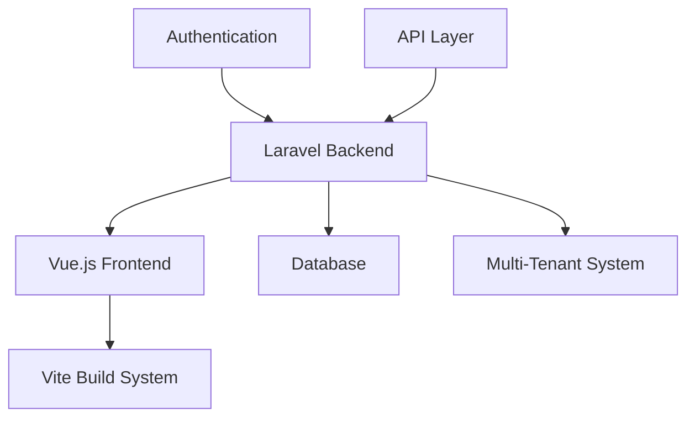
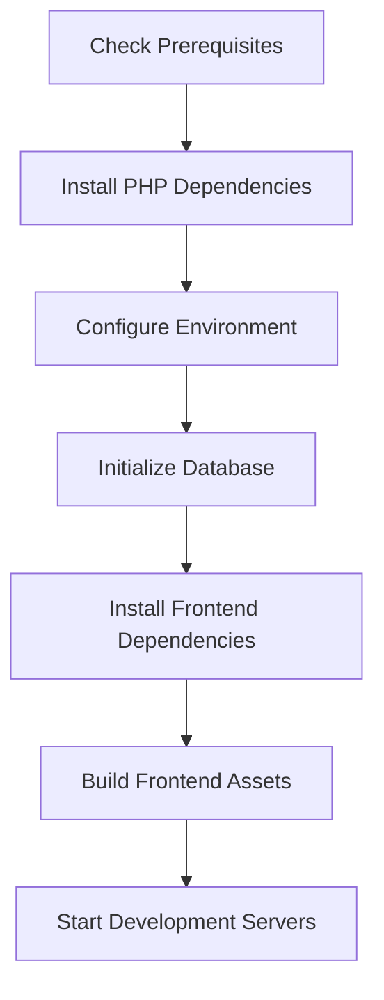

# Application Build and Fix Plan

## Overview

This document outlines the steps required to build and fix the Alumni Platform application to achieve a running state without build errors. The application should be able to display the main page and login pages.

## Current Status Analysis

Based on the codebase inspection, the following issues have been identified:

1. Missing vendor directory (PHP dependencies not installed)
2. No .env file configured
3. Database not initialized with proper schema and seed data (PostgreSQL is the default database and there's already a running PostgreSQL instance)
4. Frontend assets not built

## Architecture

The application follows a modern web application architecture:



### Technology Stack
- **Backend**: Laravel 12.x with PHP 8.3.23
- **Frontend**: Vue.js 3 with TypeScript
- **Database**: PostgreSQL (default)
- **Multi-tenant**: Stancl Tenancy package
- **Build Tools**: Vite for frontend asset compilation
- **Authentication**: Laravel Breeze with Spatie Permissions

### PHP Configuration
- **PHP Path**: `D:\DevCenter\xampp\php-8.3.23\php.exe`
- **PHP Command Helper**: Use `.\artisan.ps1` for all Laravel Artisan commands
- **Development Server**: Laravel runs on port 8080, Vite on port 5100

### Key Components
1. **Frontend**: Vue.js 3 + TypeScript + Inertia.js
2. **Backend**: Laravel 12.x with multi-tenant architecture
3. **Database**: PostgreSQL with tenant-specific schemas (already running)
4. **Authentication**: Role-Based Access Control (RBAC)
5. **Build System**: Vite with pnpm package manager

## Build and Fix Process

### 1. Environment Setup Flow



### 2. Step-by-Step Implementation

#### Step 1: Install PHP Dependencies

First, we need to install the PHP dependencies using Composer. The project uses a specific PHP installation at `D:\DevCenter\xampp\php-8.3.23\php.exe`:

```bash
# Using the local composer.phar with the specific PHP path
D:\DevCenter\xampp\php-8.3.23\php.exe composer.phar install
```

If composer.phar is not available:
```bash
# Download composer using the specific PHP path
D:\DevCenter\xampp\php-8.3.23\php.exe -r "copy('https://getcomposer.org/installer', 'composer-setup.php');"
D:\DevCenter\xampp\php-8.3.23\php.exe composer-setup.php
D:\DevCenter\xampp\php-8.3.23\php.exe -r "unlink('composer-setup.php');"
```

#### Step 2: Configure Environment

Create a .env file from the example:
```bash
cp .env.example .env
```

Generate application key using the project's PHP helper script:
```bash
.\artisan.ps1 key:generate
```

#### Step 3: Initialize Database

Since PostgreSQL is already running and is the default database, configure the database connection in the .env file:
```bash
# Update .env with PostgreSQL settings
DB_CONNECTION=pgsql
DB_HOST=127.0.0.1
DB_PORT=5432
DB_DATABASE=alumate
DB_USERNAME=your_username
DB_PASSWORD=your_password
```

Then create the database schema using the project's PHP helper script:
```bash
# Run migrations
.\artisan.ps1 migrate

# For multi-tenant setup
.\artisan.ps1 tenants:migrate
```

Seed the database with initial data:
```bash
.\artisan.ps1 db:seed
```

#### Step 4: Install Frontend Dependencies

Install Node.js dependencies:
```bash
# Using pnpm (as specified in package.json)
pnpm install
```

#### Step 5: Build Frontend Assets

Build the frontend assets:
```bash
# Development build
pnpm run dev

# Or production build
pnpm run build
```

#### Step 6: Start Development Servers

Start both the Laravel backend and Vite frontend development servers:
```bash
# Using the provided batch script (recommended)
.\start-dev.bat

# Or using the PowerShell script
.\start-dev-final.ps1

# Or manually with the specific PHP path
D:\DevCenter\xampp\php-8.3.23\php.exe artisan serve --port=8080
pnpm run dev

# Or using the project's PHP helper script
.\artisan.ps1 serve --port=8080
pnpm run dev
```

## Data Models & Database Schema

### Core Models
- **User**: Base user model with RBAC
- **Tenant**: Institution/organization tenant
- **Domain**: Domain mapping for tenants
- **Role/Permission**: Spatie permissions package models

### Domain-Specific Models
- **Graduate**: Alumni/graduate profiles
- **Employer**: Company profiles and job postings
- **Job**: Job listings and applications
- **Course**: Academic programs
- **Institution**: Educational institutions

### Multi-Tenant Implementation
- Each tenant has isolated data in separate PostgreSQL schemas
- Tenant resolution is done via domain-based routing
- Cross-tenant data access is prevented through middleware

## Business Logic Layer

### Authentication & Authorization
- Role-Based Access Control (RBAC) using Spatie Permissions
- Multi-tenant aware authentication
- Social login integration (Google, LinkedIn, Facebook)

### User Management
- Profile management with privacy controls
- Account verification and multi-factor authentication
- Bulk import/export functionality

### Job Management
- AI-powered job matching algorithms
- Application tracking system
- Employer verification process

### Analytics & Reporting
- Employment analytics and tracking
- Course performance analysis
- Predictive analytics modeling

## Middleware & Interceptors

### Security Middleware
- Tenant isolation enforcement
- Role-based access control
- Cross-site request forgery (CSRF) protection
- Cross-site scripting (XSS) prevention

### Request Handling
- Multi-tenant domain resolution
- API rate limiting
- Request validation and sanitization

## API Endpoints Reference

### Authentication
- `POST /login` - User login
- `POST /register` - User registration
- `POST /logout` - User logout

### Dashboard
- `GET /dashboard` - User dashboard
- `GET /{role}/dashboard` - Role-specific dashboards

### User Management
- `GET /users` - List users
- `POST /users` - Create user
- `GET /users/{id}` - Get user details
- `PUT /users/{id}` - Update user
- `DELETE /users/{id}` - Delete user

### Job Management
- `GET /jobs` - List jobs
- `POST /jobs` - Create job
- `GET /jobs/{id}` - Get job details
- `PUT /jobs/{id}` - Update job
- `DELETE /jobs/{id}` - Delete job

## Testing Strategy

### Unit Testing
- Model validation tests
- Service class functionality tests
- Helper function tests

### Feature Testing
- API endpoint tests
- Authentication flow tests
- Multi-tenant isolation tests

### Integration Testing
- Database migration tests
- Third-party API integration tests
- Queue job processing tests

### PHP-Specific Testing
- Use `.\artisan.ps1 test` for running the test suite
- Use `.\artisan.ps1 pest` for Pest PHP tests
- Ensure PHP memory limits are sufficient for testing (modify phpunit.xml if needed)

## Deployment Considerations

### Production Build
1. Optimize Laravel configuration using the project's PHP helper script:
   ```bash
   .\artisan.ps1 config:cache
   .\artisan.ps1 route:cache
   .\artisan.ps1 view:cache
   ```

2. Build frontend assets:
   ```bash
   pnpm run build
   ```

3. Run database migrations:
   ```bash
   .\artisan.ps1 migrate --force
   .\artisan.ps1 tenants:migrate --force
   ```

### Environment Configuration
- Set `APP_ENV=production`
- Set `APP_DEBUG=false`
- Configure proper database connection
- Set up caching mechanisms (Redis)
- Configure queue workers for background jobs

## Troubleshooting Common Issues

### Blank Screen Issues
1. Ensure Vite development server is running on port 5100
2. Check browser console for JavaScript errors
3. Verify Laravel server is running on port 8080
4. Confirm frontend assets are properly built
5. Check that the specific PHP path `D:\DevCenter\xampp\php-8.3.23\php.exe` exists and is accessible

### Database Connection Issues
1. Verify database configuration in .env file
2. Ensure database server is running
3. Check database credentials and permissions
4. Confirm database migrations have been run
5. Verify PostgreSQL version is 13+ as required

### Authentication Issues
1. Verify user accounts exist in database
2. Check role and permission assignments
3. Confirm email verification status
4. Validate password reset functionality

### Multi-Tenant Issues
1. Verify tenant domains are properly configured
2. Check tenant database schemas exist
3. Confirm tenant-specific data isolation
4. Validate cross-tenant access prevention

### PHP-Specific Issues
1. Ensure `D:\DevCenter\xampp\php-8.3.23\php.exe` exists and is properly configured
2. Check that the artisan.ps1 script has the correct PHP path
3. Verify PHP extensions required by Laravel are installed
4. Check PHP memory limits for testing (may need to be increased in phpunit.xml)
5. Ensure Composer dependencies are installed with the correct PHP version

## Success Criteria

The application will be considered successfully built and fixed when:

1. ✅ Development servers start without errors
2. ✅ Main application page loads at http://127.0.0.1:8080
3. ✅ Login page is accessible at http://127.0.0.1:8080/login
4. ✅ All test accounts can log in successfully:
   - Super Admin: admin@system.com / password
   - Institution Admin: admin@tech-institute.edu / password
   - Employer: techcorp@company.com / password
   - Graduate: john.smith@student.edu / password
5. ✅ No build errors in frontend or backend
6. ✅ Database is properly initialized with seed data
7. ✅ Multi-tenant functionality works correctly