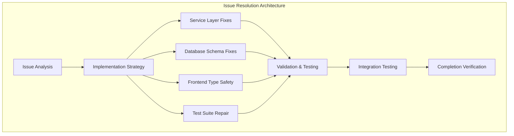
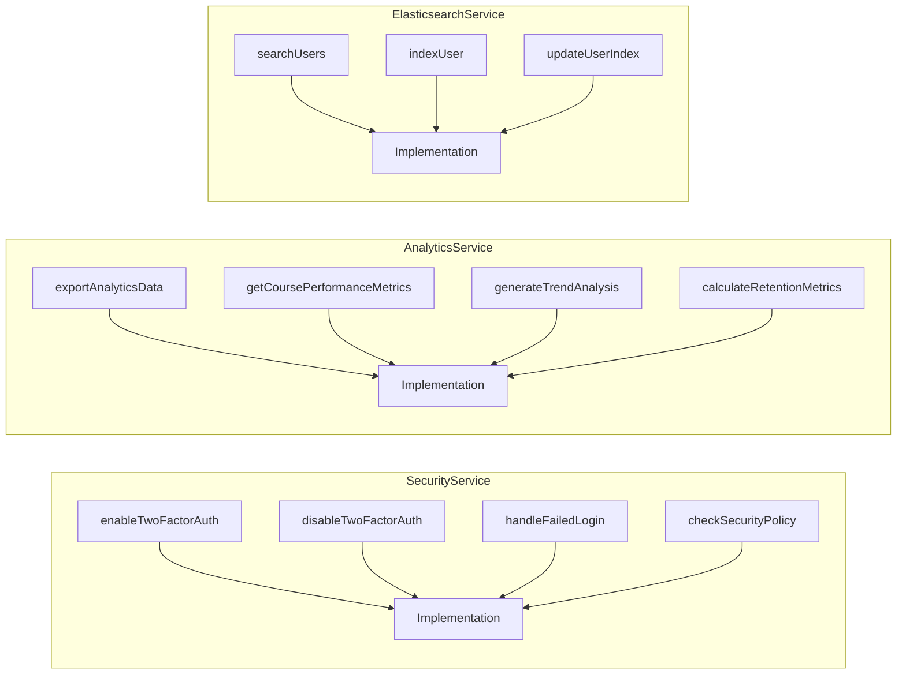
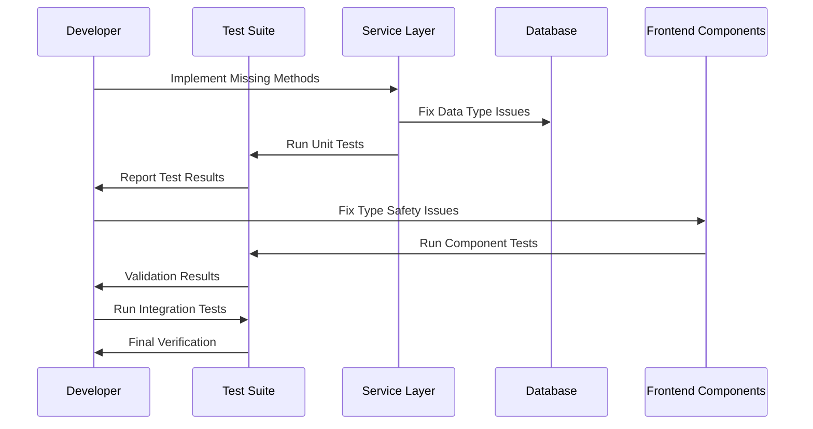

# Issue Tracker & Resolver Design Document

## Overview

This document provides a comprehensive design and implementation strategy to systematically resolve the 163+ critical issues identified in the alumate platform codebase. The approach follows a phased methodology with iterative testing and validation to ensure each issue is properly addressed without introducing regressions.

## Technology Stack & Dependencies

### Core Technologies
- **Backend**: Laravel 12.x, PHP 8.3+, PostgreSQL
- **Frontend**: Vue.js 3, TypeScript 5.x, Inertia.js 2.x
- **Testing**: Pest PHP 3.x, Vitest, PHPUnit
- **Additional**: Redis, Elasticsearch, Tailwind CSS

### Project Architecture Context


## Component Architecture

### Issue Categories & Resolution Components

#### 1. Service Layer Component Issues
**Missing Service Methods Resolution**



**SecurityService Missing Methods**
- Method: `enableTwoFactorAuth(User $user, array $options = [])`
  - Purpose: Enable 2FA for user accounts
  - Dependencies: User model, authentication system
  - Return: `array` with status and backup codes

- Method: `disableTwoFactorAuth(User $user)`
  - Purpose: Disable 2FA for user accounts
  - Dependencies: User model
  - Return: `bool` success status

- Method: `handleFailedLogin(string $email, Request $request)`
  - Purpose: Track and handle failed login attempts
  - Dependencies: Request validation, rate limiting
  - Return: `void` with side effects (logging, blocking)

- Method: `checkSecurityPolicy(User $user, string $action)`
  - Purpose: Validate user actions against security policies
  - Dependencies: Policy engine, user roles
  - Return: `bool` authorization result

**AnalyticsService Missing Methods**
- Method: `exportAnalyticsData(array $filters, string $format = 'csv')`
  - Purpose: Export analytics data in various formats
  - Dependencies: Data aggregation, file generation
  - Return: `string` file path or download response

- Method: `getCoursePerformanceMetrics(int $courseId, array $dateRange)`
  - Purpose: Calculate course-specific performance metrics
  - Dependencies: Course model, enrollment data
  - Return: `array` with metrics and calculations

- Method: `generateTrendAnalysis(string $metric, array $timeframe)`
  - Purpose: Generate trend analysis for specified metrics
  - Dependencies: Time series data, statistical calculations
  - Return: `array` with trend data and projections

**ElasticsearchService Missing Methods**
- Method: `searchUsers(array $criteria, array $options = [])`
  - Purpose: Search users with advanced filtering
  - Dependencies: Elasticsearch client, index management
  - Return: `Collection` of user results

#### 2. Database Schema Component Issues
**Array to String Conversion Fixes**

Database factory issues stem from PostgreSQL's strict type handling. The resolution involves:

- **Model Factory Updates**: Ensure array fields use proper JSON encoding
- **Migration Reviews**: Verify column types match data expectations
- **Seeder Corrections**: Fix array data insertion in seeders

**Transaction State Recovery**
- Implement proper transaction rollback handling
- Add transaction state monitoring
- Create database connection recovery mechanisms

#### 3. Frontend Type Safety Component
**TypeScript Configuration Enhancement**

Missing Vue TSX support and strict type checking requires:
- Update `tsconfig.json` with proper Vue TSX types
- Implement strict null checks
- Add comprehensive interface definitions
- Remove `any` type usage

**Component Interface Definitions**
```typescript
// Missing interfaces to be implemented
interface AlumniProfile {
  id: number;
  linkedinUrl?: string;
  careerProgression?: CareerProgression;
}

interface CareerProgression {
  before?: SalaryData;
  after?: SalaryData;
}

interface SalaryData {
  salary?: number;
  currency: string;
}
```

#### 4. Testing Component Integration
**Test Suite Repair Strategy**

Comprehensive test fixing approach:
- Unit test repairs for service method implementations
- Integration test updates for API endpoints
- Frontend component test enhancements
- End-to-end test scenario completion

## Data Flow Between Components

### Issue Resolution Data Flow


## Routing & Navigation

### Issue Resolution Workflow Routes

The resolution process follows a structured workflow:

1. **Phase 1: Critical Infrastructure** (Week 1-2)
   - Database schema fixes
   - Core service method implementations
   - TypeScript configuration updates

2. **Phase 2: Service Implementation** (Week 3-4)
   - Complete missing service methods
   - API endpoint implementations
   - Event system repairs

3. **Phase 3: Frontend & Type Safety** (Week 5-6)
   - Component interface definitions
   - Null safety implementations
   - Error handling enhancements

4. **Phase 4: Testing & Validation** (Week 7-8)
   - Test suite repairs
   - Integration testing
   - Performance optimization

## State Management

### Issue Tracking State Management

Progress tracking using a centralized state management approach:

```typescript
interface IssueResolutionState {
  totalIssues: number;
  resolvedIssues: number;
  inProgressIssues: number;
  categories: {
    database: IssueCategory;
    services: IssueCategory;
    frontend: IssueCategory;
    testing: IssueCategory;
  };
}

interface IssueCategory {
  total: number;
  resolved: number;
  critical: number;
  highPriority: number;
}
```

## API Integration Layer

### Testing API Integration

Enhanced API testing strategy includes:
- Missing endpoint implementations
- Error response handling
- Authentication flow validation
- Rate limiting verification

## Testing Strategy

### Comprehensive Testing Approach

#### Unit Testing Strategy
**Service Method Testing**
- Test all newly implemented service methods
- Mock external dependencies
- Validate return types and error handling
- Ensure 100% code coverage for new implementations

**Database Testing**
- Test model factories with corrected data types
- Validate migration rollbacks
- Test transaction handling
- Verify data integrity constraints

#### Integration Testing Strategy
**API Endpoint Testing**
- Test complete request/response cycles
- Validate authentication and authorization
- Test error scenarios and edge cases
- Verify API documentation compliance

**Frontend Integration Testing**
- Test component prop validation
- Verify type safety implementations
- Test user interaction workflows
- Validate accessibility compliance

#### End-to-End Testing Strategy
**Complete User Journey Testing**
- Test critical user flows
- Validate cross-browser compatibility
- Test performance under load
- Verify mobile responsiveness

### Testing Implementation Details

#### Phase 1 Testing: Infrastructure Fixes
```php
// Example: SecurityService test implementation
class SecurityServiceTest extends TestCase
{
    public function test_enable_two_factor_auth()
    {
        $user = User::factory()->create();
        $result = $this->securityService->enableTwoFactorAuth($user);
        
        $this->assertTrue($result['success']);
        $this->assertNotEmpty($result['backup_codes']);
        $this->assertTrue($user->fresh()->two_factor_enabled);
    }
    
    public function test_handle_failed_login()
    {
        $request = $this->createRequest(['email' => 'test@example.com']);
        
        $this->securityService->handleFailedLogin('test@example.com', $request);
        
        $this->assertDatabaseHas('failed_login_attempts', [
            'email' => 'test@example.com',
            'ip_address' => $request->ip()
        ]);
    }
}
```

#### Phase 2 Testing: Service Implementation
```php
// Example: AnalyticsService test implementation
class AnalyticsServiceTest extends TestCase
{
    public function test_export_analytics_data()
    {
        $filters = ['date_range' => '2024-01-01,2024-12-31'];
        $filePath = $this->analyticsService->exportAnalyticsData($filters, 'csv');
        
        $this->assertFileExists($filePath);
        $this->assertStringContainsString('.csv', $filePath);
    }
    
    public function test_generate_trend_analysis()
    {
        $result = $this->analyticsService->generateTrendAnalysis(
            'user_engagement',
            ['start' => '2024-01-01', 'end' => '2024-12-31']
        );
        
        $this->assertArrayHasKey('trend_data', $result);
        $this->assertArrayHasKey('projections', $result);
    }
}
```

#### Phase 3 Testing: Frontend Type Safety
```typescript
// Example: Component type safety tests
describe('AlumniProfile Component', () => {
  it('handles optional properties safely', () => {
    const profile: AlumniProfile = {
      id: 1,
      linkedinUrl: undefined,
      careerProgression: {
        before: { salary: undefined, currency: 'USD' }
      }
    };
    
    const wrapper = mount(AlumniProfileComponent, {
      props: { profile }
    });
    
    expect(wrapper.find('.linkedin-url').exists()).toBe(false);
    expect(wrapper.find('.salary-info').text()).toBe('Currency: USD');
  });
});
```

## Implementation Tracking

### Issue Resolution Checklist

#### Phase 1: Critical Infrastructure (✅ = Completed, 🔄 = In Progress, ❌ = Not Started)

**Database Schema Issues**
- ❌ Fix array to string conversion in User model factory
- ❌ Resolve transaction state errors in PostgreSQL
- ❌ Update Course model factory data types
- ❌ Fix Alumni directory test data insertion
- ❌ Resolve Performance test database issues

**SecurityService Implementation**
- ❌ Implement `enableTwoFactorAuth()` method
- ❌ Implement `disableTwoFactorAuth()` method
- ❌ Implement `handleFailedLogin()` method
- ❌ Implement `checkSecurityPolicy()` method
- ❌ Add comprehensive unit tests

**TypeScript Configuration**
- ❌ Fix Vue TSX type definition imports
- ❌ Enable strict null checks
- ❌ Update tsconfig.json configuration
- ❌ Resolve build pipeline type errors

#### Phase 2: Service Implementation (❌ = Not Started)

**AnalyticsService Implementation**
- ❌ Implement `exportAnalyticsData()` method
- ❌ Implement `getCoursePerformanceMetrics()` method
- ❌ Implement `generateTrendAnalysis()` method
- ❌ Implement `calculateRetentionMetrics()` method
- ❌ Add comprehensive unit tests

**ElasticsearchService Implementation**
- ❌ Implement `searchUsers()` method
- ❌ Implement `indexUser()` method
- ❌ Implement `updateUserIndex()` method
- ❌ Fix search functionality integration
- ❌ Add comprehensive unit tests

**SearchService Enhancement**
- ❌ Review and implement missing search methods
- ❌ Fix search result formatting
- ❌ Enhance search performance
- ❌ Add search analytics tracking

#### Phase 3: Frontend & Type Safety (❌ = Not Started)

**Interface Definitions**
- ❌ Create comprehensive TypeScript interfaces
- ❌ Implement AlumniProfile interface
- ❌ Implement CareerProgression interface
- ❌ Add API response type definitions
- ❌ Update component prop types

**Null Safety Implementation**
- ❌ Add optional chaining where needed
- ❌ Implement proper null checks
- ❌ Fix undefined property access
- ❌ Add default value handling
- ❌ Update error boundaries

**Component Enhancement**
- ❌ Fix component prop validations
- ❌ Enhance error handling
- ❌ Improve performance optimization
- ❌ Add accessibility improvements

#### Phase 4: Testing & Validation (❌ = Not Started)

**Unit Test Repairs**
- ❌ Fix SecurityServiceTest failures
- ❌ Fix AnalyticsServiceTest failures
- ❌ Fix ElasticsearchServiceTest failures
- ❌ Fix database factory test failures
- ❌ Fix frontend component test failures

**Integration Test Completion**
- ❌ API endpoint integration tests
- ❌ Database integration tests
- ❌ Frontend-backend integration tests
- ❌ Authentication flow tests
- ❌ Search functionality tests

**End-to-End Test Enhancement**
- ❌ User journey completion tests
- ❌ Performance under load tests
- ❌ Cross-browser compatibility tests
- ❌ Mobile responsiveness tests
- ❌ Accessibility compliance tests

### Progress Metrics

**Overall Progress: 0/163+ Issues Resolved (0%)**

**Category Breakdown:**
- Database Issues: 0/25+ resolved (0%)
- Service Method Issues: 0/15+ resolved (0%)
- Authentication & Security: 0/8+ resolved (0%)
- Search Functionality: 0/12+ resolved (0%)
- Analytics System: 0/18+ resolved (0%)
- Type Safety: 0/40+ resolved (0%)
- Frontend Components: 0/30+ resolved (0%)
- Configuration Issues: 0/10+ resolved (0%)
- Testing Issues: 0/5+ resolved (0%)

**Quality Metrics Targets:**
- Test Coverage: Target 90%+ (Currently ~70%)
- Type Safety: 100% TypeScript strict mode compliance
- Code Quality: Zero critical static analysis issues
- Performance: All database queries < 100ms

### Next Steps

1. **Immediate Actions (Week 1)**
   - Begin Phase 1 critical infrastructure fixes
   - Set up continuous integration for issue tracking
   - Establish daily progress monitoring
   - Create automated testing pipeline

2. **Short-term Goals (Week 2-4)**
   - Complete Phase 1 and Phase 2 implementations
   - Achieve 50% overall issue resolution
   - Establish comprehensive test coverage
   - Implement monitoring and alerting

3. **Long-term Objectives (Week 5-8)**
   - Complete all phases of issue resolution
   - Achieve 100% issue resolution
   - Implement quality assurance processes
   - Document lessons learned and best practices

### Implementation Notes

Each issue resolution will follow this iterative process:
1. **Analysis**: Understand the root cause and dependencies
2. **Implementation**: Develop the fix with proper testing
3. **Validation**: Verify the fix doesn't introduce regressions
4. **Integration**: Ensure compatibility with existing systems
5. **Documentation**: Update relevant documentation
6. **Monitoring**: Track the fix in production environment

This approach ensures systematic resolution of all identified issues while maintaining code quality and system stability throughout the process.