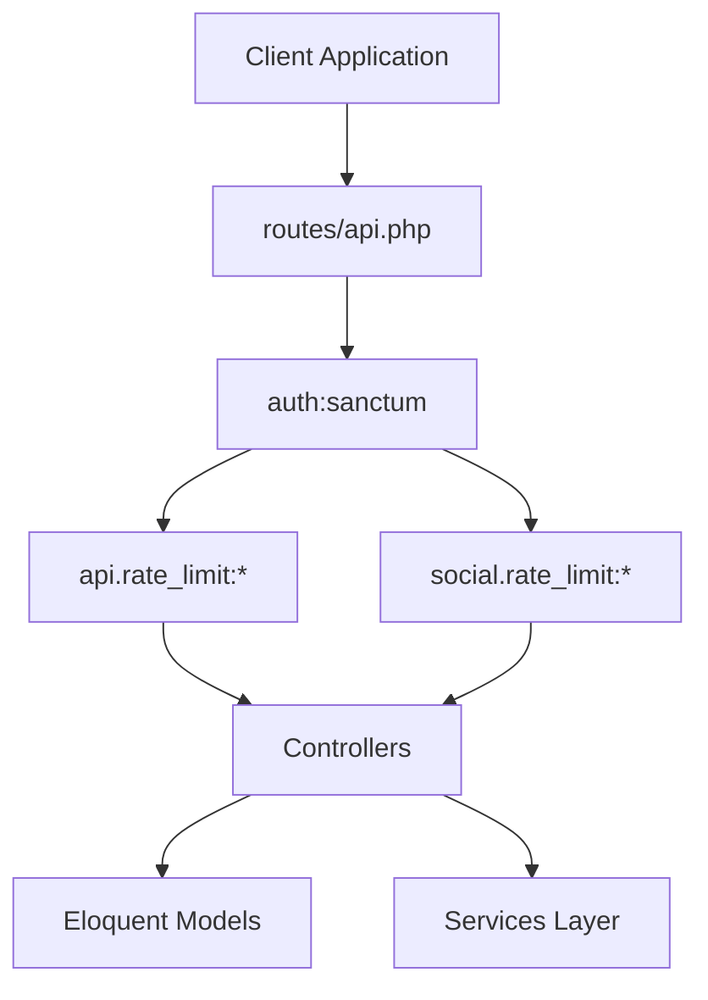
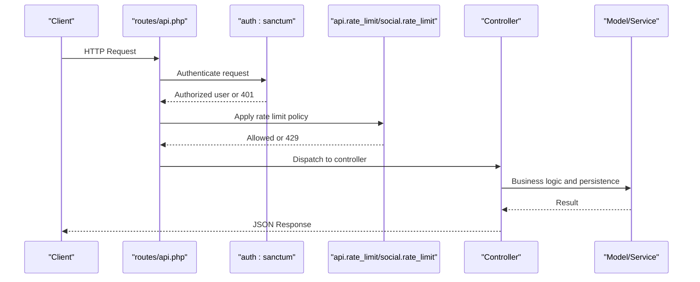
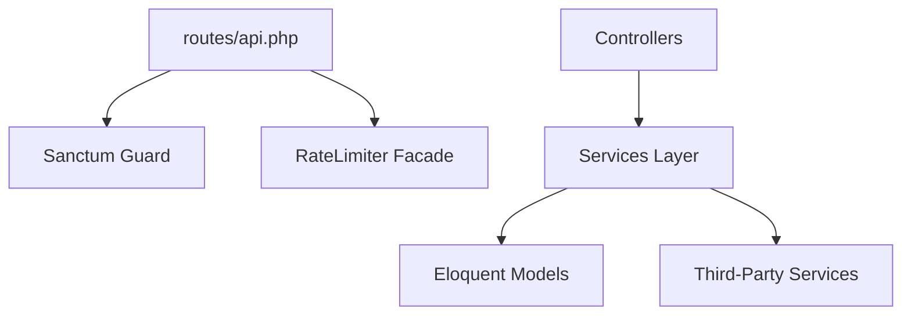

# API Documentation

<cite>
**Referenced Files in This Document**
- [routes/api.php](file://routes/api.php)
- [ApiRateLimitMiddleware.php](file://app\Http\Middleware\ApiRateLimitMiddleware.php)
- [SocialRateLimiting.php](file://app\Http\Middleware\SocialRateLimiting.php)
- [auth.php](file://config\auth.php)
- [services.php](file://config\services.php)
- [UserFlowController.php](file://app\Http\Controllers\Api\UserFlowController.php)
</cite>

## Table of Contents
1. [Introduction](#introduction)
2. [Project Structure](#project-structure)
3. [Core Components](#core-components)
4. [Architecture Overview](#architecture-overview)
5. [Detailed Component Analysis](#detailed-component-analysis)
6. [Dependency Analysis](#dependency-analysis)
7. [Performance Considerations](#performance-considerations)
8. [Troubleshooting Guide](#troubleshooting-guide)
9. [Conclusion](#conclusion)
10. [Appendices](#appendices)

## Introduction
This document provides a comprehensive API reference for the Alumate RESTful API. It covers authentication, rate limiting, endpoint categories, request/response patterns, and integration guidelines. The API is primarily accessed under the /api base path and grouped by functional domains such as user management, alumni directory, job management, analytics, and template systems. Authentication is handled via Laravel Sanctum, and rate limiting is enforced through dedicated middleware tailored for general API usage and social interactions.

## Project Structure
The API surface is defined in the routes file and organized by domain groups. Middleware controls authentication and rate limiting for different endpoint families. Configuration files define authentication defaults and third-party service integrations used by the platform.

**Diagram sources**
- [routes/api.php:1-1610](file://routes/api.php#L1-L1610)
- [ApiRateLimitMiddleware.php:1-125](file://app\Http\Middleware\ApiRateLimitMiddleware.php#L1-L125)
- [SocialRateLimiting.php:1-270](file://app\Http\Middleware\SocialRateLimiting.php#L1-L270)

**Section sources**
- [routes/api.php:1-1610](file://routes/api.php#L1-L1610)

## Core Components
- Authentication
  - Guard: Sanctum session-based authentication for API access.
  - Endpoint: GET /api/user returns the authenticated user profile.
- Rate Limiting
  - General API rate limiting via api.rate_limit middleware with configurable limits per limiter type.
  - Social interaction rate limiting via social.rate_limit middleware with action-specific limits and windows.
- Error Handling
  - Standardized JSON error responses with rate limit exceeded scenarios returning HTTP 429 and appropriate headers.

**Section sources**
- [routes/api.php:26-28](file://routes/api.php#L26-L28)
- [ApiRateLimitMiddleware.php:17-34](file://app\Http\Middleware\ApiRateLimitMiddleware.php#L17-L34)
- [SocialRateLimiting.php:16-41](file://app\Http\Middleware\SocialRateLimiting.php#L16-L41)

## Architecture Overview
The API follows a layered architecture:
- Routing layer defines endpoint groups and applies middleware.
- Middleware layer enforces authentication and rate limiting.
- Controller layer orchestrates business logic and interacts with services/models.
- Services and models encapsulate domain logic and persistence.

**Diagram sources**
- [routes/api.php:1-1610](file://routes/api.php#L1-L1610)
- [ApiRateLimitMiddleware.php:17-34](file://app\Http\Middleware\ApiRateLimitMiddleware.php#L17-L34)
- [SocialRateLimiting.php:16-41](file://app\Http\Middleware\SocialRateLimiting.php#L16-L41)

## Detailed Component Analysis

### Authentication and Authorization
- Authentication Guard
  - Uses Sanctum session-based guard for API endpoints.
  - Configuration resides in the auth configuration file.
- Protected Endpoints
  - Many routes are wrapped with auth:sanctum middleware.
  - Some endpoints are public (e.g., ping, CRM webhooks).
- Roles and Permissions
  - Certain administrative endpoints require role-based authorization (e.g., admin or super_admin).

Practical notes:
- Use the /api/user endpoint to verify authentication and retrieve the current user profile.
- For endpoints requiring elevated privileges, ensure the authenticated user has the required roles.

**Section sources**
- [auth.php:38-43](file://config\auth.php#L38-L43)
- [routes/api.php:26-28](file://routes/api.php#L26-L28)
- [routes/api.php:883-894](file://routes/api.php#L883-L894)
- [routes/api.php:929-939](file://routes/api.php#L929-L939)

### Rate Limiting Policies
- General API Rate Limiting
  - Middleware supports named limiters (e.g., api, search, upload, webhook).
  - Limits and decay windows are defined per limiter type.
  - Responses include X-RateLimit-* headers and Retry-After header on exceed.
- Social Interaction Rate Limiting
  - Action-specific limiters (e.g., post_interaction, connection_request).
  - Different decay windows per action.
  - Adaptive rate limiting considers user trust score derived from account age, verification, profile completeness, connection count, and recent violations.

Common limiter types:
- api: General API calls
- search: Search queries
- upload: Media uploads
- webhook: Webhook deliveries

Example usage in routes:
- api.rate_limit:api
- api.rate_limit:search
- api.rate_limit:upload
- api.rate_limit:webhook
- social.rate_limit:post_interaction

**Section sources**
- [ApiRateLimitMiddleware.php:53-76](file://app\Http\Middleware\ApiRateLimitMiddleware.php#L53-L76)
- [ApiRateLimitMiddleware.php:89-98](file://app\Http\Middleware\ApiRateLimitMiddleware.php#L89-L98)
- [ApiRateLimitMiddleware.php:103-123](file://app\Http\Middleware\ApiRateLimitMiddleware.php#L103-L123)
- [SocialRateLimiting.php:66-81](file://app\Http\Middleware\SocialRateLimiting.php#L66-L81)
- [SocialRateLimiting.php:86-101](file://app\Http\Middleware\SocialRateLimiting.php#L86-L101)
- [SocialRateLimiting.php:142-160](file://app\Http\Middleware\SocialRateLimiting.php#L142-L160)
- [routes/api.php:30-33](file://routes/api.php#L30-L33)

### Endpoint Groups and Reference

Note: The following groups enumerate major endpoint families. For precise HTTP methods, URL patterns, and request/response details, refer to the route definitions.

- Ping and Health
  - GET /api/ping
- CRM Webhooks (Public)
  - POST /api/webhooks/crm/hubspot
  - POST /api/webhooks/crm/salesforce
  - POST /api/webhooks/crm/pipedrive
  - POST /api/webhooks/crm/{provider}
- Statistics
  - GET /api/statistics/health
  - GET /api/statistics/platform-metrics
  - POST /api/statistics/batch
  - GET /api/statistics/{id}
  - DELETE /api/statistics/cache (admin)
- Push Notifications (PWA)
  - GET /api/push/vapid-key (auth)
  - POST /api/push/subscribe (auth)
  - POST /api/push/unsubscribe (auth)
- Posts
  - apiResource: /api/posts (auth)
  - POST /api/posts/drafts (auth)
  - GET /api/posts/drafts (auth)
  - GET /api/posts/scheduled (auth)
  - POST /api/posts/media (auth)
- Timeline
  - GET /api/timeline (auth)
  - GET /api/timeline/refresh (auth)
  - GET /api/timeline/load-more (auth)
  - GET /api/timeline/circles (auth)
  - GET /api/timeline/groups (auth)
- Post Engagement
  - POST /api/posts/{post}/like (auth)
  - POST /api/posts/{post}/comment (auth)
  - POST /api/posts/{post}/share (auth)
  - POST /api/posts/{post}/reaction (auth)
  - GET /api/posts/{post}/stats (auth)
- Notifications
  - GET /api/notifications (auth)
  - POST /api/notifications/{notification}/read (auth)
  - POST /api/notifications/mark-all-read (auth)
  - GET /api/notifications/unread-count (auth)
  - GET /api/notifications/preferences (auth)
  - PUT /api/notifications/preferences (auth)
  - GET /api/notifications/stats (auth)
  - DELETE /api/notifications/{notification} (auth)
  - POST /api/notifications/test (auth)
- Alumni Directory
  - GET /api/alumni (auth)
  - GET /api/alumni/filters (auth)
  - GET /api/alumni/search (auth)
  - GET /api/alumni/{userId} (auth)
  - POST /api/alumni/{userId}/connect (auth)
- Alumni Map
  - POST /api/alumni/map-data (auth)
  - POST /api/alumni/map-clusters (auth)
  - GET /api/alumni/map-stats (auth)
  - POST /api/alumni/nearby (auth)
  - POST /api/user/location-privacy (auth)
  - POST /api/user/location (auth)
  - GET /api/geocode/reverse (auth)
- Recommendations
  - GET /api/recommendations (auth)
  - POST /api/recommendations/{userId}/dismiss (auth)
  - POST /api/recommendations/{userId}/feedback (auth)
  - POST /api/recommendations/refresh (auth)
- Advanced Search
  - POST /api/search (auth)
  - GET /api/search/suggestions (auth)
  - POST /api/saved-searches (auth)
  - GET /api/saved-searches (auth)
  - PUT /api/saved-searches/{savedSearch} (auth)
  - DELETE /api/saved-searches/{savedSearch} (auth)
  - POST /api/saved-searches/{savedSearch}/run (auth)
  - GET /api/search/analytics (auth)
- Career Timeline
  - GET /api/users/{userId}/career (auth)
  - POST /api/career (auth)
  - PUT /api/career/{id} (auth)
  - DELETE /api/career/{id} (auth)
  - POST /api/milestones (auth)
  - PUT /api/milestones/{id} (auth)
  - DELETE /api/milestones/{id} (auth)
  - GET /api/career/suggestions (auth)
  - GET /api/career/options (auth)
- Mentorship
  - POST /api/mentorships/become-mentor (auth)
  - GET /api/mentorships/profile (auth)
  - PUT /api/mentorships/profile (auth)
  - GET /api/mentorships/analytics (auth)
  - GET /api/mentorships/find-mentors (auth)
  - POST /api/mentorships/request (auth)
  - POST /api/mentorships/requests/{requestId}/accept (auth)
  - POST /api/mentorships/requests/{requestId}/decline (auth)
  - GET /api/mentorships (auth)
  - POST /api/mentorships/sessions (auth)
  - GET /api/mentorships/sessions/upcoming (auth)
  - POST /api/mentorships/sessions/{sessionId}/complete (auth)
- Job Matching
  - GET /api/jobs/recommendations (auth)
  - GET /api/jobs/{jobId} (auth)
  - GET /api/jobs/{jobId}/connections (auth)
  - POST /api/jobs/{jobId}/apply (auth)
  - GET /api/applications (auth)
  - POST /api/jobs/{jobId}/request-introduction (auth)
- Skills Development
  - GET /api/users/{userId}/skills (auth)
  - POST /api/users/skills (auth)
  - POST /api/skills/endorse (auth)
  - GET /api/skills/search (auth)
  - GET /api/skills/suggestions (auth)
  - GET /api/skills/{skillId}/progression (auth)
  - GET /api/skills/{skillId}/recommendations (auth)
  - GET /api/skills/gap-analysis (auth)
  - GET /api/learning-resources (auth)
  - POST /api/learning-resources (auth)
  - POST /api/learning-resources/{resource}/rate (auth)
- Events
  - apiResource: /api/events (auth)
  - POST /api/events/{event}/register (auth)
  - DELETE /api/events/{event}/register (auth)
  - POST /api/events/{event}/checkin (auth)
  - GET /api/events/{event}/attendees (auth)
  - GET /api/events/{event}/analytics (auth)
  - GET /api/events-upcoming (auth)
  - GET /api/events-recommended (auth)
  - POST /api/events/{event}/feedback (auth)
  - GET /api/events/{event}/feedback-analytics (auth)
  - POST /api/events/{event}/highlights (auth)
  - GET /api/events/{event}/highlights (auth)
  - POST /api/highlights/{highlight}/interact (auth)
  - POST /api/highlights/{highlight}/toggle-feature (auth)
  - POST /api/events/{event}/connections (auth)
  - GET /api/events/{event}/connections (auth)
  - POST /api/events/{event}/generate-recommendations (auth)
  - GET /api/events/{event}/recommendations (auth)
  - POST /api/recommendations/{recommendation}/act (auth)
  - POST /api/recommendations/{recommendation}/viewed (auth)
  - GET /api/events/{event}/follow-up-activities (auth)
  - GET /api/events/{event}/follow-up-analytics (auth)
- Reunion
  - GET /api/reunions (auth)
  - POST /api/reunions (auth)
  - GET /api/reunions/milestones (auth)
  - GET /api/reunions/graduation-year/{year} (auth)
  - GET /api/reunions/{event} (auth)
  - PUT /api/reunions/{event} (auth)
  - GET /api/reunions/{event}/statistics (auth)
  - GET /api/reunions/{event}/photos (auth)
  - POST /api/reunions/{event}/photos (auth)
  - POST /api/reunion-photos/{photo}/like (auth)
  - DELETE /api/reunion-photos/{photo}/like (auth)
  - POST /api/reunion-photos/{photo}/comments (auth)
  - GET /api/reunions/{event}/memories (auth)
  - POST /api/reunions/{event}/memories (auth)
  - POST /api/reunion-memories/{memory}/like (auth)
  - DELETE /api/reunion-memories/{memory}/like (auth)
  - POST /api/reunion-memories/{memory}/comments (auth)
  - GET /api/reunions/{event}/committee (auth)
  - POST /api/reunions/{event}/committee (auth)
  - DELETE /api/reunions/{event}/committee (auth)
- Fundraising Campaigns
  - apiResource: /api/fundraising-campaigns (auth)
  - GET /api/fundraising-campaigns/{campaign}/analytics (auth)
  - GET /api/fundraising-campaigns/{campaign}/share (auth)
  - GET /api/fundraising-analytics/dashboard (auth)
  - GET /api/fundraising-analytics/giving-patterns (auth)
  - GET /api/fundraising-analytics/campaigns/{campaign}/performance (auth)
  - GET /api/fundraising-analytics/donor-analytics (auth)
  - GET /api/fundraising-analytics/predictive-analytics (auth)
  - GET /api/fundraising-analytics/roi-metrics (auth)
  - GET /api/fundraising-analytics/donor-engagement (auth)
  - GET /api/fundraising-analytics/trends (auth)
  - POST /api/fundraising-analytics/export (auth)
- Campaign Donations
  - apiResource: /api/campaign-donations (auth)
  - GET /api/campaigns/{campaign}/donations (auth)
  - GET /api/user/donations (auth)
  - POST /api/campaign-donations/{donation}/refund (auth)
- Recurring Donations
  - apiResource: /api/recurring-donations (auth)
  - POST /api/recurring-donations/{recurringDonation}/cancel (auth)
  - POST /api/recurring-donations/{recurringDonation}/pause (auth)
  - POST /api/recurring-donations/{recurringDonation}/resume (auth)
  - GET /api/user/recurring-donations (auth)
  - GET /api/admin/recurring-donations/due (auth)
- Tax Receipts
  - apiResource: /api/tax-receipts (auth)
  - POST /api/tax-receipts/generate (auth)
  - GET /api/tax-receipts/{taxReceipt}/download (auth)
  - POST /api/tax-receipts/{taxReceipt}/resend (auth)
  - GET /api/user/tax-receipts (auth)
  - POST /api/admin/tax-receipts/generate-year (auth)
- Peer Fundraisers
  - apiResource: /api/peer-fundraisers (auth)
  - GET /api/campaigns/{campaign}/peer-fundraisers (auth)
  - GET /api/user/peer-fundraisers (auth)
  - GET /api/peer-fundraisers/{peerFundraiser}/share (auth)
- Scholarships
  - apiResource: /api/scholarships (auth)
  - GET /api/scholarships/{scholarship}/impact-report (auth)
  - GET /api/user/donor-updates (auth)
  - apiResource: /api/scholarships.applications (auth)
  - POST /api/scholarships/{scholarship}/applications/{application}/review (auth)
  - POST /api/scholarships/{scholarship}/applications/{application}/award (auth)
  - apiResource: /api/scholarships.recipients (auth)
  - GET /api/scholarship-recipients/success-stories (auth)
- Donor CRM
  - apiResource: /api/donor-profiles (auth)
  - GET /api/donor-profiles/dashboard (auth)
  - GET /api/donor-profiles/contacts-needing-attention (auth)
  - POST /api/donor-profiles/bulk-update (auth)
  - apiResource: /api/donor-interactions (auth)
  - GET /api/donor-interactions/follow-up-reminders (auth)
  - apiResource: /api/donor-stewardship-plans (auth)
  - POST /api/donor-stewardship-plans/{donorStewardshipPlan}/milestone-complete (auth)
  - GET /api/donor-stewardship-plans/upcoming-asks (auth)
  - apiResource: /api/major-gift-prospects (auth)
  - POST /api/major-gift-prospects/{majorGiftProspect}/next-stage (auth)
  - POST /api/major-gift-prospects/{majorGiftProspect}/close-won (auth)
  - POST /api/major-gift-prospects/{majorGiftProspect}/close-lost (auth)
  - GET /api/major-gift-prospects/pipeline (auth)
  - GET /api/major-gift-prospects/closing-soon (auth)
- Success Stories
  - GET /api/success-stories (auth)
  - GET /api/success-stories/featured (auth)
  - GET /api/success-stories/recommended (auth)
  - GET /api/success-stories/demographics (auth)
  - GET /api/success-stories/{successStory} (auth)
  - POST /api/success-stories/{successStory}/share (auth)
  - POST /api/success-stories/{successStory}/like (auth)
  - POST /api/success-stories (auth)
  - PUT /api/success-stories/{successStory} (auth)
  - DELETE /api/success-stories/{successStory} (auth)
  - GET /api/admin/success-stories/analytics (auth)
  - POST /api/admin/success-stories/{successStory}/toggle-feature (auth)
- Achievements
  - GET /api/achievements (auth)
  - GET /api/achievements/{achievement} (auth)
  - GET /api/achievements/leaderboard (auth)
  - GET /api/user/achievements (auth)
  - GET /api/users/{user}/achievements (auth)
  - POST /api/achievements/check (auth)
  - POST /api/user-achievements/{userAchievement}/toggle-featured (auth)
  - GET /api/achievement-celebrations (auth)
  - POST /api/achievement-celebrations (auth)
  - POST /api/achievement-celebrations/{celebration}/congratulations (auth)
  - DELETE /api/achievement-celebrations/{celebration}/congratulations (auth)
  - GET /api/achievement-celebrations/{celebration}/congratulations (auth)
- Student Profile
  - GET /api/student/profile (auth)
  - POST /api/student/profile (auth)
  - PUT /api/student/profile (auth)
  - GET /api/student/profile/completion (auth)
  - GET /api/student/profile/statistics (auth)
  - GET /api/student/courses (auth)
- Testimonials
  - apiResource: /api/testimonials (auth)
  - GET /api/testimonials-rotation (auth)
  - POST /api/testimonials/{testimonial}/approve (auth)
  - POST /api/testimonials/{testimonial}/reject (auth)
- Component Library
  - apiResource: /api/components (auth)
  - POST /api/components/{component}/duplicate (auth)
  - POST /api/components/{component}/activate (auth)
  - POST /api/components/{component}/deactivate (auth)
  - GET /api/components/{component}/preview (auth)
  - GET /api/components/{component}/usage (auth)
  - GET /api/components/{component}/versions (auth)
  - POST /api/components/{component}/versions (auth)
  - GET /api/components/search (auth)
  - GET /api/components/categories/{category} (auth)
  - GET /api/components/types/{type} (auth)
  - GET /api/components/{component}/instances (auth)
  - POST /api/components/{component}/instances (auth)
  - GET /api/components/instances/{instance} (auth)
  - PUT /api/components/instances/{instance} (auth)
  - DELETE /api/components/instances/{instance} (auth)
  - POST /api/components/instances/{instance}/move (auth)
  - POST /api/components/instances/{instance}/duplicate (auth)
  - GET /api/components/{component}/analytics (auth)
  - POST /api/components/{component}/track-view (auth)
  - POST /api/components/{component}/track-click (auth)
  - POST /api/components/{component}/track-conversion (auth)
  - POST /api/components/bulk-activate (auth)
  - POST /api/components/bulk-deactivate (auth)
  - POST /api/components/bulk-delete (auth)
  - POST /api/components/import (auth)
  - GET /api/components/{component}/export (auth)
  - POST /api/components/bulk-export (auth)
- Component Themes
  - apiResource: /api/component-themes (auth)
  - GET /api/component-themes/grapejs (auth)
  - POST /api/component-themes/{theme}/duplicate (auth)
  - POST /api/component-themes/{theme}/apply (auth)
  - GET /api/component-themes/{theme}/preview (auth)
  - GET /api/component-themes/{theme}/usage (auth)
  - GET /api/component-themes/{theme}/cached (auth)
  - DELETE /api/component-themes/{theme}/cache (auth)
  - POST /api/component-themes/import (auth)
  - GET /api/component-themes/{theme}/export (auth)
  - POST /api/component-themes/validate (auth)
  - POST /api/component-themes/bulk (auth)
  - POST /api/component-themes/testimonials/{testimonial}/approve (auth)
  - POST /api/component-themes/testimonials/{testimonial}/reject (auth)
  - POST /api/component-themes/testimonials/{testimonial}/archive (auth)
  - POST /api/component-themes/testimonials/{testimonial}/featured (auth)
  - POST /api/component-themes/testimonials/{testimonial}/track-click (auth)
  - GET /api/component-themes/testimonials-analytics (auth)
  - GET /api/component-themes/testimonials-filter-options (auth)
  - GET /api/component-themes/testimonials-export (auth)
  - POST /api/component-themes/testimonials-import (auth)
- Student-Alumni Story Discovery
  - GET /api/student/alumni-stories (auth)
  - GET /api/student/alumni-stories/recommended (auth)
  - GET /api/student/alumni-stories/career-path (auth)
  - GET /api/student/alumni-stories/same-course (auth)
  - GET /api/student/alumni-stories/recent-graduates (auth)
  - GET /api/student/alumni-stories/career-insights (auth)
  - POST /api/student/alumni-stories/{story}/connect (auth)
  - GET /api/student/connections (auth)
- Student Mentorship
  - GET /api/student/mentors (auth)
  - GET /api/student/mentors/recommended (auth)
  - GET /api/student/mentors/same-course (auth)
  - GET /api/student/mentors/career-specific (auth)
  - POST /api/student/mentorship/request (auth)
- Developer API
  - POST /api/developer/api-keys (auth)
  - GET /api/developer/api-keys (auth)
  - DELETE /api/developer/api-keys/{keyId} (auth)
  - GET /api/developer/webhook-events (auth)
  - POST /api/developer/webhooks/{webhookId}/test (auth)
  - GET /api/developer/documentation (auth)
  - POST /api/developer/postman-collection (auth)
  - POST /api/developer/sdk-generator (auth)
- Speaker Bureau
  - GET /api/speakers (auth)
  - GET /api/speakers/featured (auth)
  - GET /api/speakers/by-topic (auth)
  - GET /api/speakers/{speaker} (auth)
  - POST /api/speakers/profile (auth)
  - POST /api/speakers/{speaker}/book (auth)
  - POST /api/speakers/{speaker}/request-booking (auth)
  - GET /api/speaker/bookings (auth)
  - GET /api/my-bookings (auth)
  - POST /api/bookings/{booking}/respond (auth)
  - POST /api/bookings/{booking}/complete (auth)
- Webhooks
  - apiResource: /api/webhooks (auth)
  - POST /api/webhooks/{webhook}/test (auth)
  - GET /api/webhooks/{webhook}/deliveries (auth)
  - POST /api/webhooks/{webhook}/deliveries/{delivery}/retry (auth)
  - GET /api/webhooks/{webhook}/statistics (auth)
  - GET /api/webhooks/events (auth)
  - POST /api/webhooks/validate-url (auth)
  - POST /api/webhooks/{webhook}/pause (auth)
  - POST /api/webhooks/{webhook}/resume (auth)
- Student Career Guidance
  - GET /api/student/career/recommendations (auth)
  - GET /api/student/career/paths (auth)
  - GET /api/student/career/industry-insights (auth)
  - GET /api/student/career/salary-insights (auth)
  - GET /api/student/career/skill-gap-analysis (auth)
  - GET /api/student/career/job-market-trends (auth)
- Email Marketing
  - apiResource: /api/email-campaigns (auth)
  - POST /api/email-campaigns/{campaign}/send (auth)
  - POST /api/email-campaigns/{campaign}/schedule (auth)
  - POST /api/email-campaigns/{campaign}/ab-test (auth)
  - POST /api/email-campaigns/{campaign}/preview (auth)
  - GET /api/email-campaigns/{campaign}/recipients (auth)
  - GET /api/email-templates (auth)
  - GET /api/email-automation-rules (auth)
  - POST /api/email-automation-rules (auth)
  - GET /api/email-campaigns/analytics (auth)
- Career Outcome Analytics
  - GET /api/career-analytics (auth)
  - GET /api/career-analytics/overview (auth)
  - GET /api/career-analytics/program-effectiveness (auth)
  - POST /api/career-analytics/program-effectiveness/generate (auth)
  - GET /api/career-analytics/salary-analysis (auth)
  - GET /api/career-analytics/industry-placement (auth)
  - POST /api/career-analytics/industry-placement/generate (auth)
  - GET /api/career-analytics/demographic-outcomes (auth)
  - GET /api/career-analytics/career-path-analysis (auth)
  - GET /api/career-analytics/trend-analysis (auth)
  - POST /api/career-analytics/generate-snapshot (auth)
  - GET /api/career-analytics/snapshots (auth)
  - GET /api/career-analytics/filter-options (auth)
  - POST /api/career-analytics/export (auth)
- Discussion Forums
  - apiResource: /api/forums (auth)
  - apiResource: /api/forums.topics (auth)
  - POST /api/forums/{forum}/topics/{topic}/subscribe (auth)
  - apiResource: /api/topics.posts (auth)
  - POST /api/posts/{post}/like (auth)
  - POST /api/posts/{post}/solution (auth)
  - GET /api/forums/search (auth)
  - GET /api/forums/tags (auth)
  - GET /api/forums/tags/{tag}/topics (auth)
  - POST /api/forums/moderate/{type}/{id} (auth)
  - GET /api/forums/moderation/pending (auth)
  - GET /api/forums/analytics (auth)
- Video Calling Integration
  - apiResource: /api/video-calls (auth)
  - POST /api/video-calls/{call}/join (auth)
  - POST /api/video-calls/{call}/leave (auth)
  - POST /api/video-calls/{call}/end (auth)
  - GET /api/video-calls/upcoming (auth)
  - GET /api/video-calls/active (auth)
  - GET /api/coffee-chat/suggestions (auth)
  - POST /api/coffee-chat/request (auth)
  - POST /api/coffee-chat/{coffeeChatRequest}/respond (auth)
  - GET /api/coffee-chat/my-requests (auth)
  - GET /api/coffee-chat/received-requests (auth)
  - GET /api/coffee-chat/ai-matches (auth)
- Onboarding
  - GET /api/onboarding/state (auth)
  - POST /api/onboarding/state (auth)
  - GET /api/onboarding/new-features (auth)
  - GET /api/onboarding/profile-completion (auth)
  - GET /api/onboarding/whats-new (auth)
  - POST /api/onboarding/events (auth)
  - POST /api/user/interests (auth)
  - GET /api/onboarding/help/{elementId} (auth)
  - GET /api/training/guides (auth)
  - GET /api/training/tutorials (auth)
  - GET /api/training/onboarding-sequence (auth)
  - GET /api/training/faqs (auth)
  - GET /api/training/progress (auth)
  - POST /api/training/mark-step-completed (auth)
  - GET /api/training/search (auth)
  - POST /api/training/faq-helpful (auth)
  - POST /api/training/feedback (auth)
- Messaging System
  - GET /api/conversations (auth)
  - GET /api/conversations/{conversationId} (auth)
  - POST /api/conversations/direct (auth)
  - POST /api/conversations/group (auth)
  - POST /api/conversations/circle (auth)
  - POST /api/conversations/{conversationId}/participants (auth)
  - DELETE /api/conversations/{conversationId}/participants/{userId} (auth)
  - POST /api/conversations/{conversationId}/leave (auth)
  - POST /api/conversations/{conversationId}/archive (auth)
  - POST /api/conversations/{conversationId}/mute (auth)
  - POST /api/conversations/{conversationId}/pin (auth)
  - POST /api/messages (auth)
  - POST /api/messages/{messageId}/read (auth)
  - POST /api/conversations/{conversationId}/read (auth)
  - POST /api/messages/typing (auth)
  - GET /api/messages/search (auth)
  - PUT /api/messages/{messageId} (auth)
  - DELETE /api/messages/{messageId} (auth)
  - GET /api/messages/unread-count (auth)
- Alumni Map (Alternative Set)
  - POST /api/alumni/map (auth)
  - POST /api/alumni/map/clusters (auth)
  - GET /api/alumni/nearby (auth)
  - GET /api/alumni/map/heatmap (auth)
  - GET /api/alumni/search (auth)
  - GET /api/regions/{region}/stats (auth)
  - GET /api/regions/{region}/groups (auth)
  - GET /api/alumni/filter-options (auth)
  - POST /api/alumni/location (auth)
- Analytics Tracking (Client-side)
  - POST /api/analytics/track (auth)
  - POST /api/analytics/track-template-usage (auth)
  - GET /api/analytics/pixel/{landingPageId} (auth)
- Analytics (Server-side)
  - POST /api/analytics/events (auth)
  - POST /api/analytics/conversion (auth)
  - POST /api/analytics/error (auth)
  - POST /api/analytics/metrics (auth)
  - POST /api/analytics/reports/{reportType} (auth)
  - POST /api/analytics/export (auth)
  - POST /api/analytics/conversion-report (auth)
- A/B Testing
  - GET /api/ab-tests/active (auth)
  - POST /api/ab-tests/assignments (auth)
  - POST /api/ab-tests/conversions (auth)
  - GET /api/ab-tests/{testId}/results (auth)
  - GET /api/ab-tests/{testId}/statistics (auth)
  - GET /api/ab-tests/ (auth)
  - POST /api/ab-tests/ (auth)
  - PATCH /api/ab-tests/{testId} (auth)
  - DELETE /api/ab-tests/{testId} (auth)
- Performance Monitoring
  - POST /api/performance/metrics (auth)
  - POST /api/performance/sessions (auth)
  - GET /api/performance/analytics (auth)
  - GET /api/performance/real-time (auth)
  - GET /api/performance/core-web-vitals (auth)
  - GET /api/performance/recommendations (auth)
  - GET /api/performance/page (auth)
- Dashboard Widgets
  - GET /api/dashboard/social-activity (auth)
  - GET /api/dashboard/alumni-suggestions (auth)
  - GET /api/dashboard/job-recommendations (auth)
  - GET /api/dashboard/upcoming-events (auth)
- Connections
  - POST /api/connections/request (auth)
  - POST /api/connections/{connection}/accept (auth)
  - POST /api/connections/{connection}/decline (auth)
  - GET /api/connections (auth)
  - GET /api/connections/requests (auth)
- Jobs
  - POST /api/jobs/{job}/save (auth)
  - DELETE /api/jobs/{job}/save (auth)
  - GET /api/jobs/{job} (auth)
- Event RSVP
  - POST /api/events/{event}/rsvp (auth)
  - DELETE /api/events/{event}/rsvp (auth)
- Analytics (Admin)
  - GET /api/analytics/dashboard (auth)
  - GET /api/analytics/engagement-metrics (auth)
  - GET /api/analytics/alumni-activity (auth)
  - GET /api/analytics/community-health (auth)
  - GET /api/analytics/platform-usage (auth)
  - GET /api/analytics/summary (auth)
  - POST /api/analytics/custom-report (auth)
  - GET /api/analytics/export (auth)
  - GET /api/analytics/available-metrics (auth)
  - GET /api/analytics/email/performance (auth)
  - GET /api/analytics/email/funnel (auth)
  - GET /api/analytics/email/engagement (auth)
  - GET /api/analytics/email/ab-test (auth)
  - GET /api/analytics/email/realtime (auth)
  - GET /api/analytics/email/report/{period} (auth)
  - POST /api/analytics/email/track (auth)
  - GET /api/analytics/email/dashboard (auth)
- Calendar Integration
  - GET /api/calendar/connections (auth)
  - POST /api/calendar/connect (auth)
  - POST /api/calendar/connections/{connection}/disconnect (auth)
  - POST /api/calendar/connections/{connection}/sync (auth)
  - GET /api/calendar/sync-status (auth)
  - GET /api/calendar/availability (auth)
  - POST /api/calendar/find-slots (auth)
  - POST /api/calendar/events (auth)
  - POST /api/calendar/events/{event}/invites (auth)
  - POST /api/calendar/schedule-mentorship (auth)
- Performance Monitoring (Admin)
  - GET /api/admin/performance/metrics (auth)
  - GET /api/admin/performance/budget-details (auth)
  - POST /api/admin/performance/clear-caches (auth)
  - POST /api/admin/performance/optimize-social-graph (auth)
  - POST /api/admin/performance/optimize-timeline (auth)
  - POST /api/admin/performance/optimize-cdn (auth)
  - POST /api/admin/performance/setup-alerts (auth)
  - POST /api/admin/performance/execute-optimization (auth)
- User Testing and Feedback
  - POST /api/feedback (auth)
  - GET /api/feedback (auth)
  - GET /api/ab-tests/{testName}/variant (auth)
  - POST /api/ab-tests/conversion (auth)
- Admin A/B Testing
  - apiResource: /api/admin/ab-tests (auth)
  - GET /api/admin/ab-tests-analytics (auth)
- Forms
  - POST /api/forms/submit (auth)
  - POST /api/forms/autosave (auth)
  - POST /api/forms/notifications (auth)
  - POST /api/forms/individual-signup (auth)
  - POST /api/forms/institution-demo-request (auth)
  - POST /api/forms/contact (auth)
  - POST /api/forms/newsletter-signup (auth)
  - POST /api/forms/event-registration (auth)
- Component Library Bridge (GrapeJS)
  - GET /api/components/bridge/initialize (auth)
  - GET /api/components/bridge/categories (auth)
  - GET /api/components/bridge/search (auth)
  - POST /api/components/bridge/track-usage (auth)
  - POST /api/components/bridge/track-rating (auth)
  - GET /api/components/bridge/usage-stats/{componentId} (auth)
  - GET /api/components/bridge/most-used (auth)
  - GET /api/components/bridge/recently-used (auth)
  - GET /api/components/bridge/trending (auth)
  - GET /api/components/bridge/analytics (auth)
  - GET /api/components/bridge/documentation/{componentId} (auth)
  - GET /api/components/bridge/tooltip/{componentId} (auth)
  - GET /api/components/bridge/validate/{componentId} (auth)
  - GET /api/components/bridge/grapeJS-data/{componentId} (auth)
- Component Version Control and Export
  - GET /api/components/{component}/versions (auth)
  - POST /api/components/{component}/versions (auth)
  - GET /api/components/{component}/versions/{version} (auth)
  - POST /api/components/{component}/versions/{version}/restore (auth)
  - POST /api/components/{component}/versions/compare (auth)
  - POST /api/components/{component}/export (auth)
  - POST /api/components/import (auth)
  - POST /api/components/create-template (auth)
  - GET /api/components/{component}/performance/analyze (auth)
  - GET /api/components/{component}/performance/trends (auth)
  - POST /api/components/{component}/performance/compare (auth)
  - POST /api/components/{component}/backup (auth)
  - GET /api/components/{component}/backups (auth)
  - POST /api/components/restore-backup (auth)
  - POST /api/components/{component}/migrate (auth)
  - GET /api/components/{component}/grapejs-block (auth)
  - GET /api/components/{component}/grapejs-traits/validate (auth)
  - GET /api/components/{component}/grapejs-compatibility (auth)
  - POST /api/components/serialize-to-grapejs (auth)
  - POST /api/components/deserialize-from-grapejs (auth)
  - POST /api/components/grapejs-performance-test (auth)
  - POST /api/components/{component}/grapejs-performance-test (auth)
  - POST /api/components/{component}/grapejs-compatibility/drag-drop (auth)
  - POST /api/components/{component}/grapejs-compatibility/responsive (auth)
  - POST /api/components/{component}/grapejs-compatibility/style-manager (auth)
  - POST /api/components/{component}/grapejs-compatibility/backward (auth)
  - POST /api/components/grapejs-stability-test (auth)
  - POST /api/components/{component}/grapejs-integrity-test (auth)
  - POST /api/components/grapejs-regression-test (auth)
  - POST /api/components/grapejs-blocks/batch (auth)
- Brand Customizer
  - GET /api/brand-customizer/data (auth)
  - POST /api/brand-customizer/logos (auth)
  - POST /api/brand-customizer/logos/{logo}/set-primary (auth)
  - POST /api/brand-customizer/logos/{logo}/optimize (auth)
  - DELETE /api/brand-customizer/logos/{logo} (auth)
  - POST /api/brand-customizer/colors (auth)
  - PUT /api/brand-customizer/colors/{color} (auth)
  - DELETE /api/brand-customizer/colors/{color} (auth)
  - POST /api/brand-customizer/fonts/upload (auth)
  - POST /api/brand-customizer/fonts (auth)
  - PUT /api/brand-customizer/fonts/{font} (auth)
  - POST /api/brand-customizer/fonts/{font}/set-primary (auth)
  - DELETE /api/brand-customizer/fonts/{font} (auth)
  - POST /api/brand-customizer/templates (auth)
  - PUT /api/brand-customizer/templates/{template} (auth)
  - POST /api/brand-customizer/templates/{template}/apply (auth)
  - POST /api/brand-customizer/templates/{template}/duplicate (auth)
  - POST /api/brand-customizer/consistency-check (auth)
  - POST /api/brand-customizer/auto-fix/{issue} (auth)
  - PUT /api/brand-customizer/guidelines (auth)
  - POST /api/brand-customizer/export (auth)
- Monitoring
  - GET /api/monitoring/dashboard (auth)
  - GET /api/monitoring/realtime (auth)
  - GET /api/monitoring/metrics/{type} (auth)
  - GET /api/monitoring/alerts (auth)
  - GET /api/monitoring/reports (auth)
  - POST /api/monitoring/cycle (auth)
  - GET /api/monitoring/settings (auth)
- Error Tracking Integration (Public)
  - POST /api/errors/track (auth)
- Webhooks (Monitoring)
  - POST /api/webhooks/monitoring/datadog/metrics (auth)
  - POST /api/webhooks/monitoring/newrelic/alerts (auth)
  - POST /api/webhooks/monitoring/slack/app-rate-limited (auth)
  - POST /api/webhooks/monitoring/sentry/issues (auth)
- Webhooks (Performance)
  - POST /api/webhooks/performance/web-vitals (auth)
  - POST /api/webhooks/performance/user-interactions (auth)
  - POST /api/webhooks/performance/page-loads (auth)
- Automated Testing Pipeline Integration
  - POST /api/testing/execute/unit (auth)
  - POST /api/testing/execute/feature (auth)
  - POST /api/testing/execute/e2e (auth)
  - GET /api/testing/results/unit (auth)
  - GET /api/testing/results/feature (auth)
  - GET /api/testing/results/e2e (auth)
  - GET /api/testing/coverage (auth)
- Security Monitoring Integration
  - POST /api/security/audit/initiate (auth)
  - GET /api/security/alerts (auth)
  - GET /api/security/compliance (auth)
  - GET /api/security/threats (auth)
- Deployment and Release Monitoring
  - POST /api/deployment/status/update (auth)
  - GET /api/deployment/history (auth)
  - POST /api/deployment/rollback/{deploymentId} (auth)
- Templates
  - GET /api/templates/ (auth)
  - POST /api/templates/ (auth)
  - GET /api/templates/search (auth)
  - GET /api/templates/popular (auth)
  - GET /api/templates/recent (auth)
  - GET /api/templates/premium (auth)
  - GET /api/templates/by-audience (auth)
  - GET /api/templates/categories (auth)
  - GET /api/templates/preview-options (auth)
  - GET /api/templates/{template} (auth)
  - PUT /api/templates/{template} (auth)
  - DELETE /api/templates/{template} (auth)
  - POST /api/templates/{template}/duplicate (auth)
  - GET /api/templates/{template}/preview (auth)
  - POST /api/templates/{template}/activate (auth)
  - POST /api/templates/{template}/deactivate (auth)
  - GET /api/templates/{template}/stats (auth)
  - POST /api/templates/{template}/preview/ (auth)
  - GET /api/templates/{template}/preview/responsive (auth)
  - POST /api/templates/{template}/preview/apply-brand (auth)
  - GET /api/templates/{template}/preview/assets (auth)
  - POST /api/templates/{template}/preview/clear-cache (auth)
- Landing Pages
  - GET /api/landing-pages/ (auth)
  - POST /api/landing-pages/ (auth)
  - GET /api/landing-pages/drafts (auth)
  - GET /api/landing-pages/published (auth)
  - POST /api/landing-pages/create-from-template (auth)
  - POST /api/landing-pages/bulk (auth)
  - GET /api/landing-pages/status/{status} (auth)
  - GET /api/landing-pages/{landingPage} (auth)
  - PUT /api/landing-pages/{landingPage} (auth)
  - DELETE /api/landing-pages/{landingPage} (auth)
  - POST /api/landing-pages/{landingPage}/duplicate (auth)
  - POST /api/landing-pages/{landingPage}/publish (auth)
  - POST /api/landing-pages/{landingPage}/unpublish (auth)
  - POST /api/landing-pages/{landingPage}/archive (auth)
  - GET /api/landing-pages/{landingPage}/analytics (auth)
- Brand Configurations
  - GET /api/brand-configs/ (auth)
  - POST /api/brand-configs/ (auth)
  - GET /api/brand-configs/search (auth)
  - POST /api/brand-configs/import (auth)
  - GET /api/brand-configs/{brandConfig} (auth)
  - PUT /api/brand-configs/{brandConfig} (auth)
  - DELETE /api/brand-configs/{brandConfig} (auth)
  - POST /api/brand-configs/upload-logo (auth)
  - POST /api/brand-configs/upload-favicon (auth)
  - POST /api/brand-configs/upload-asset (auth)
  - POST /api/brand-configs/apply-to-template/{templateId} (auth)
  - POST /api/brand-configs/preview (auth)
  - POST /api/brand-configs/export (auth)
- Component Analytics (Client-side)
  - POST /api/components/analytics/view (auth)
  - POST /api/components/analytics/click (auth)
  - POST /api/components/analytics/conversion (auth)
  - POST /api/components/analytics/form-submit (auth)
- Email Sequences
  - GET /api/email-sequences/ (auth)
  - POST /api/email-sequences/ (auth)
  - GET /api/email-sequences/{sequence} (auth)
  - PUT /api/email-sequences/{sequence} (auth)
  - DELETE /api/email-sequences/{sequence} (auth)
  - POST /api/email-sequences/{sequence}/duplicate (auth)
  - POST /api/email-sequences/{sequence}/toggle-active (auth)
  - GET /api/email-sequences/{sequence}/emails (auth)

**Section sources**
- [routes/api.php:1-1610](file://routes/api.php#L1-L1610)

### Authentication Mechanisms
- Sanctum Session-Based Authentication
  - All authenticated endpoints require a valid Sanctum session token.
  - Retrieve the current user via GET /api/user.
- API Keys (Developer API)
  - Generate, list, and revoke API keys via developer endpoints.
- Third-Party Integrations
  - Service configurations include Postmark, SES, Resend, Slack, Sentry, and monitoring integrations.

**Section sources**
- [routes/api.php:26-28](file://routes/api.php#L26-L28)
- [routes/api.php:588-602](file://routes/api.php#L588-L602)
- [services.php:17-52](file://config\services.php#L17-L52)

### Rate Limiting Strategies
- General API Rate Limiting
  - Middleware supports multiple limiters with distinct max attempts and decay windows.
  - Responses include standardized headers and JSON error payload on exceed.
- Social Interaction Rate Limiting
  - Action-specific limits and windows for activities like likes, comments, connections, and messaging.
  - Adaptive limits adjust based on user trust score derived from account characteristics and behavior.

**Section sources**
- [ApiRateLimitMiddleware.php:53-76](file://app\Http\Middleware\ApiRateLimitMiddleware.php#L53-L76)
- [ApiRateLimitMiddleware.php:89-98](file://app\Http\Middleware\ApiRateLimitMiddleware.php#L89-L98)
- [ApiRateLimitMiddleware.php:103-123](file://app\Http\Middleware\ApiRateLimitMiddleware.php#L103-L123)
- [SocialRateLimiting.php:66-81](file://app\Http\Middleware\SocialRateLimiting.php#L66-L81)
- [SocialRateLimiting.php:86-101](file://app\Http\Middleware\SocialRateLimiting.php#L86-L101)
- [SocialRateLimiting.php:142-160](file://app\Http\Middleware\SocialRateLimiting.php#L142-L160)

### Error Handling and Response Formats
- Standardized JSON error responses for rate limit exceeded scenarios.
- HTTP 429 responses include:
  - JSON body with error code and retry details.
  - Headers: X-RateLimit-Limit, X-RateLimit-Remaining, Retry-After, X-RateLimit-Reset.
- Additional error endpoints:
  - Public error tracking endpoint for client-side errors.
  - Monitoring webhooks for external systems.

**Section sources**
- [ApiRateLimitMiddleware.php:103-123](file://app\Http\Middleware\ApiRateLimitMiddleware.php#L103-L123)
- [routes/api.php:1094-1116](file://routes/api.php#L1094-L1116)
- [routes/api.php:1118-1145](file://routes/api.php#L1118-L1145)

### API Versioning and Security Considerations
- Versioning
  - No explicit API versioning scheme observed in the routes file; versioning is not enforced at the routing level.
- Security
  - Sanctum authentication for protected endpoints.
  - Role-based access control for administrative endpoints.
  - Rate limiting for abuse prevention.
  - Error sanitization to avoid information disclosure.

**Section sources**
- [routes/api.php:883-894](file://routes/api.php#L883-L894)
- [routes/api.php:929-939](file://routes/api.php#L929-L939)
- [tests\Security\SocialGraphSecurityTest.php:130-251](file://tests\Security\SocialGraphSecurityTest.php#L130-L251)

### Practical Integration Patterns
- Authentication
  - Obtain a Sanctum session token and include it in requests to authenticated endpoints.
  - Use GET /api/user to verify token validity and fetch user profile.
- Rate Limiting
  - Observe X-RateLimit-* headers and Retry-After to manage client-side retries.
  - For social actions, anticipate stricter limits and slower windows.
- Error Handling
  - Implement exponential backoff on 429 responses.
  - Log rate limit errors and monitor Retry-After values.
- Webhooks
  - Use developer endpoints to manage webhooks and test deliveries.
  - Integrate monitoring webhooks for external observability platforms.

**Section sources**
- [routes/api.php:26-28](file://routes/api.php#L26-L28)
- [ApiRateLimitMiddleware.php:89-98](file://app\Http\Middleware\ApiRateLimitMiddleware.php#L89-L98)
- [routes/api.php:619-637](file://routes/api.php#L619-L637)
- [routes/api.php:1118-1145](file://routes/api.php#L1118-L1145)

### Common Use Cases
- User Management
  - Fetch user profile: GET /api/user
  - Manage connections: POST /api/connections/request, POST /api/connections/{connection}/accept
- Alumni Directory
  - Search and connect: GET /api/alumni/search, POST /api/alumni/{userId}/connect
- Job Management
  - Get recommendations: GET /api/jobs/recommendations
  - Apply for jobs: POST /api/jobs/{jobId}/apply
- Analytics
  - Track events: POST /api/analytics/events
  - View dashboards: GET /api/analytics/dashboard (admin)
- Templates and Landing Pages
  - Manage templates: GET /api/templates/, POST /api/templates/{template}/activate
  - Manage landing pages: GET /api/landing-pages/, POST /api/landing-pages/{landingPage}/publish

**Section sources**
- [routes/api.php:26-28](file://routes/api.php#L26-L28)
- [routes/api.php:861-868](file://routes/api.php#L861-L868)
- [routes/api.php:218-231](file://routes/api.php#L218-L231)
- [routes/api.php:883-906](file://routes/api.php#L883-L906)
- [routes/api.php:1411-1444](file://routes/api.php#L1411-L1444)
- [routes/api.php:1446-1467](file://routes/api.php#L1446-L1467)

### API Testing Approaches and Debugging Tools
- Automated Testing Integration
  - Execute unit, feature, and E2E tests via /api/testing endpoints.
- Monitoring and Observability
  - Integrate monitoring webhooks for Datadog, New Relic, Slack, and Sentry.
  - Use performance webhooks to collect Core Web Vitals and user interactions.
- Debugging
  - Use error tracking endpoint to report client-side errors.
  - Review rate limit headers and Retry-After to diagnose throttling.

**Section sources**
- [routes/api.php:1217-1285](file://routes/api.php#L1217-L1285)
- [routes/api.php:1118-1145](file://routes/api.php#L1118-L1145)
- [routes/api.php:1094-1116](file://routes/api.php#L1094-L1116)

### Performance Optimization Tips
- Respect Rate Limits
  - Implement client-side rate limiting aligned with server headers.
  - Batch operations where possible to reduce request frequency.
- Efficient Queries
  - Leverage pagination and filters for large collections (e.g., alumni, posts).
- Caching
  - Cache non-sensitive data where feasible to reduce server load.
- Monitoring
  - Use performance webhooks to track and optimize Core Web Vitals.

[No sources needed since this section provides general guidance]

## Dependency Analysis
The API depends on:
- Laravel Sanctum for authentication.
- Rate limiter facilities for enforcing limits.
- Service configurations for third-party integrations.

**Diagram sources**
- [routes/api.php:1-1610](file://routes/api.php#L1-L1610)
- [ApiRateLimitMiddleware.php:17-34](file://app\Http\Middleware\ApiRateLimitMiddleware.php#L17-L34)
- [services.php:17-52](file://config\services.php#L17-L52)

**Section sources**
- [routes/api.php:1-1610](file://routes/api.php#L1-L1610)
- [ApiRateLimitMiddleware.php:17-34](file://app\Http\Middleware\ApiRateLimitMiddleware.php#L17-L34)
- [services.php:17-52](file://config\services.php#L17-L52)

## Performance Considerations
- Implement client-side caching for read-heavy endpoints.
- Use pagination and filtering to minimize payload sizes.
- Batch requests where the API supports it.
- Monitor rate limit headers and adjust client behavior accordingly.

[No sources needed since this section provides general guidance]

## Troubleshooting Guide
- Authentication Failures
  - Ensure a valid Sanctum session token is included in requests.
  - Verify the token against GET /api/user.
- Rate Limit Exceeded (HTTP 429)
  - Respect Retry-After and X-RateLimit-* headers.
  - Reduce request frequency or implement exponential backoff.
- Error Reporting
  - Use the public error tracking endpoint to log client-side errors.
- Security and Access
  - Administrative endpoints require appropriate roles.
  - Validate permissions for sensitive operations.

**Section sources**
- [routes/api.php:26-28](file://routes/api.php#L26-L28)
- [ApiRateLimitMiddleware.php:103-123](file://app\Http\Middleware\ApiRateLimitMiddleware.php#L103-L123)
- [routes/api.php:1094-1116](file://routes/api.php#L1094-L1116)
- [routes/api.php:883-894](file://routes/api.php#L883-L894)

## Conclusion
The Alumate API provides a comprehensive set of endpoints covering user management, alumni services, job matching, analytics, and template systems. Authentication is handled via Sanctum, and robust rate limiting protects the platform from abuse. By following the documented patterns and guidelines, clients can integrate effectively and build reliable, performant applications.

[No sources needed since this section summarizes without analyzing specific files]

## Appendices

### Endpoint Categories and Coverage
- User and Identity: Authentication, connections, profiles
- Alumni Services: Directory, map, recommendations
- Job and Career: Matching, applications, mentorship
- Content and Engagement: Posts, timelines, notifications
- Analytics and Insights: Engagement, career outcomes, performance
- Templates and Branding: Templates, landing pages, brand configs
- Operations and Monitoring: Webhooks, testing, security, deployment

[No sources needed since this section provides general guidance]