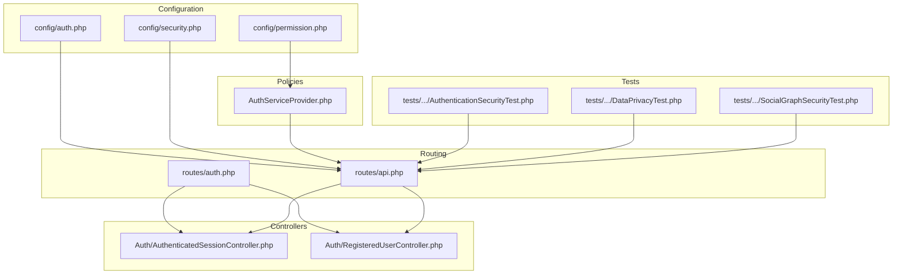
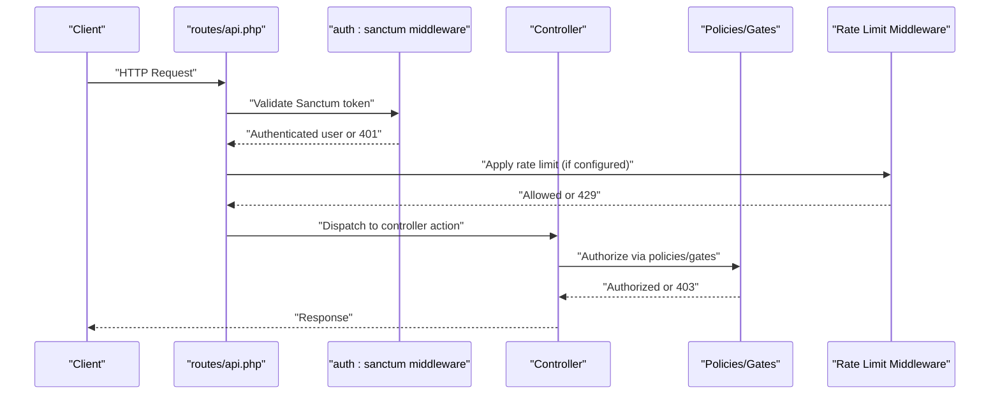
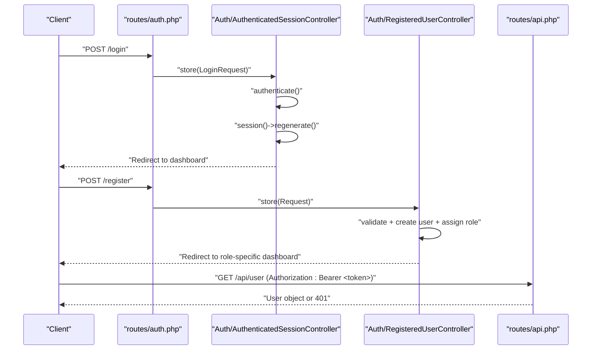
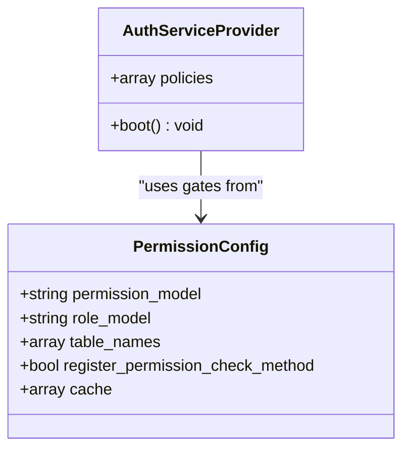
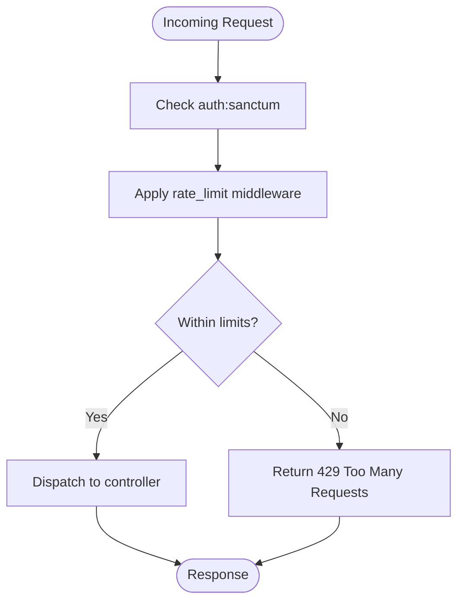
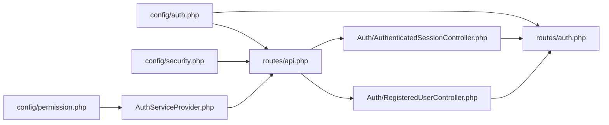

# Authentication & Authorization

<cite>
**Referenced Files in This Document**
- [auth.php](file://config/auth.php)
- [permission.php](file://config/permission.php)
- [security.php](file://config/security.php)
- [AuthServiceProvider.php](file://app/Providers/AuthServiceProvider.php)
- [api.php](file://routes/api.php)
- [auth.php](file://routes/auth.php)
- [AuthenticatedSessionController.php](file://app/Http/Controllers/Auth/AuthenticatedSessionController.php)
- [RegisteredUserController.php](file://app/Http/Controllers/Auth/RegisteredUserController.php)
- [AuthenticationSecurityTest.php](file://tests\Security\AuthenticationSecurityTest.php)
- [SocialGraphSecurityTest.php](file://tests\Security\SocialGraphSecurityTest.php)
- [DataPrivacyTest.php](file://tests\Security\DataPrivacyTest.php)
</cite>

## Table of Contents
1. [Introduction](#introduction)
2. [Project Structure](#project-structure)
3. [Core Components](#core-components)
4. [Architecture Overview](#architecture-overview)
5. [Detailed Component Analysis](#detailed-component-analysis)
6. [Dependency Analysis](#dependency-analysis)
7. [Performance Considerations](#performance-considerations)
8. [Troubleshooting Guide](#troubleshooting-guide)
9. [Conclusion](#conclusion)
10. [Appendices](#appendices)

## Introduction
This document explains the authentication and authorization mechanisms powering the Alumate API. It focuses on Sanctum token-based authentication, API key management, rate limiting strategies, middleware protection, and security controls. It also covers authorization policies, role-based access control (RBAC), tenant isolation, and practical guidance for integrating securely with the platform.

## Project Structure
The authentication and authorization system spans configuration, routing, controllers, policies, and tests:
- Configuration: authentication defaults, guards/providers, password resets, and security settings
- Routing: API routes grouped under Sanctum and rate-limiting middleware
- Controllers: session lifecycle and user registration flows
- Policies: authorization mapping for domain models
- Tests: security validations for authentication, authorization, and privacy

**Diagram sources**
- [auth.php:1-116](file://config/auth.php#L1-L116)
- [permission.php:1-203](file://config/permission.php#L1-L203)
- [security.php:1-76](file://config/security.php#L1-L76)
- [api.php:1-800](file://routes/api.php#L1-L800)
- [auth.php:1-62](file://routes/auth.php#L1-L62)
- [AuthenticatedSessionController.php:1-52](file://app/Http/Controllers/Auth/AuthenticatedSessionController.php#L1-L52)
- [RegisteredUserController.php:1-80](file://app/Http/Controllers/Auth/RegisteredUserController.php#L1-L80)
- [AuthServiceProvider.php:1-26](file://app/Providers/AuthServiceProvider.php#L1-L26)
- [AuthenticationSecurityTest.php:129-204](file://tests\Security\AuthenticationSecurityTest.php#L129-L204)
- [DataPrivacyTest.php:203-318](file://tests\Security\DataPrivacyTest.php#L203-L318)
- [SocialGraphSecurityTest.php:213-251](file://tests\Security\SocialGraphSecurityTest.php#L213-L251)

**Section sources**
- [auth.php:1-116](file://config/auth.php#L1-L116)
- [permission.php:1-203](file://config/permission.php#L1-L203)
- [security.php:1-76](file://config/security.php#L1-L76)
- [api.php:1-800](file://routes/api.php#L1-L800)
- [auth.php:1-62](file://routes/auth.php#L1-L62)
- [AuthenticatedSessionController.php:1-52](file://app/Http/Controllers/Auth/AuthenticatedSessionController.php#L1-L52)
- [RegisteredUserController.php:1-80](file://app/Http/Controllers/Auth/RegisteredUserController.php#L1-L80)
- [AuthServiceProvider.php:1-26](file://app/Providers/AuthServiceProvider.php#L1-L26)
- [AuthenticationSecurityTest.php:129-204](file://tests\Security\AuthenticationSecurityTest.php#L129-L204)
- [DataPrivacyTest.php:203-318](file://tests\Security\DataPrivacyTest.php#L203-L318)
- [SocialGraphSecurityTest.php:213-251](file://tests\Security\SocialGraphSecurityTest.php#L213-L251)

## Core Components
- Sanctum token-based authentication: routes gated by auth:sanctum middleware and user retrieval via request->user()
- RBAC and authorization: policies mapped in AuthServiceProvider and gates enabled by Spatie Permission configuration
- Rate limiting: per-route middleware for API, uploads, search, webhooks, and social actions
- Security controls: login attempts, lockout, session timeout, two-factor requirements, and monitoring toggles
- API key management: developer endpoints for generation, listing, and revocation

Practical usage highlights:
- Retrieve authenticated user: GET /api/user with Authorization header
- Rate-limited endpoints: use appropriate rate_limit keys per route group
- API keys: POST /api/developer/api-keys, GET /api/developer/api-keys, DELETE /api/developer/api-keys/{keyId}

**Section sources**
- [api.php:26-28](file://routes/api.php#L26-L28)
- [api.php:89-100](file://routes/api.php#L89-L100)
- [api.php:588-602](file://routes/api.php#L588-L602)
- [permission.php:1-203](file://config/permission.php#L1-L203)
- [AuthServiceProvider.php:1-26](file://app/Providers/AuthServiceProvider.php#L1-L26)
- [security.php:1-76](file://config/security.php#L1-L76)

## Architecture Overview
The API enforces authentication and authorization through middleware and controller flows. Sanctum tokens are validated per-request, while RBAC checks are enforced via policies and gates. Rate limiting is applied selectively to protect sensitive or resource-intensive endpoints.

**Diagram sources**
- [api.php:1-800](file://routes/api.php#L1-L800)
- [AuthenticatedSessionController.php:1-52](file://app/Http/Controllers/Auth/AuthenticatedSessionController.php#L1-L52)
- [RegisteredUserController.php:1-80](file://app/Http/Controllers/Auth/RegisteredUserController.php#L1-L80)
- [AuthServiceProvider.php:1-26](file://app/Providers/AuthServiceProvider.php#L1-L26)
- [permission.php:1-203](file://config/permission.php#L1-L203)

## Detailed Component Analysis

### Sanctum Token-Based Authentication
- Authentication guard: session-based web guard for browser flows; Sanctum tokens for API
- User retrieval: routes exposing /api/user return $request->user() after auth:sanctum
- Session lifecycle: login/logout handled by AuthenticatedSessionController; sessions regenerate on successful login
- Registration: RegisteredUserController validates inputs, assigns roles, emits Registered event, and logs in the user

**Diagram sources**
- [auth.php:1-62](file://routes/auth.php#L1-L62)
- [AuthenticatedSessionController.php:1-52](file://app/Http/Controllers/Auth/AuthenticatedSessionController.php#L1-L52)
- [RegisteredUserController.php:1-80](file://app/Http/Controllers/Auth/RegisteredUserController.php#L1-L80)
- [api.php:26-28](file://routes/api.php#L26-L28)

**Section sources**
- [auth.php:1-116](file://config/auth.php#L1-L116)
- [auth.php:1-62](file://routes/auth.php#L1-L62)
- [AuthenticatedSessionController.php:1-52](file://app/Http/Controllers/Auth/AuthenticatedSessionController.php#L1-L52)
- [RegisteredUserController.php:1-80](file://app/Http/Controllers/Auth/RegisteredUserController.php#L1-L80)
- [api.php:26-28](file://routes/api.php#L26-L28)

### Authorization Policies and RBAC
- Policies: AuthServiceProvider maps model-to-policy classes; use gates and abilities for fine-grained checks
- Gates and permissions: Spatie Permission configuration supports role and permission models, caches, and optional wildcard permissions
- Practical enforcement: routes like statistics admin endpoints apply can: directives alongside auth:sanctum

**Diagram sources**
- [AuthServiceProvider.php:1-26](file://app/Providers/AuthServiceProvider.php#L1-L26)
- [permission.php:1-203](file://config/permission.php#L1-L203)

**Section sources**
- [AuthServiceProvider.php:1-26](file://app/Providers/AuthServiceProvider.php#L1-L26)
- [permission.php:1-203](file://config/permission.php#L1-L203)
- [api.php:60-62](file://routes/api.php#L60-L62)

### Rate Limiting Strategies
- Per-route groups: api.rate_limit:api, api.rate_limit:upload, api.rate_limit:search, api.rate_limit:webhook, social.rate_limit:post_interaction
- Security limits: unauthenticated and authenticated global rate limits configured centrally
- Enforcement: middleware applies throttling per IP or token depending on guard

**Diagram sources**
- [api.php:30-33](file://routes/api.php#L30-L33)
- [api.php:89-100](file://routes/api.php#L89-L100)
- [api.php:171-180](file://routes/api.php#L171-L180)
- [api.php:620-637](file://routes/api.php#L620-L637)
- [security.php:17-18](file://config/security.php#L17-L18)

**Section sources**
- [api.php:30-33](file://routes/api.php#L30-L33)
- [api.php:89-100](file://routes/api.php#L89-L100)
- [api.php:171-180](file://routes/api.php#L171-L180)
- [api.php:620-637](file://routes/api.php#L620-L637)
- [security.php:17-18](file://config/security.php#L17-L18)

### API Key Management
- Generate: POST /api/developer/api-keys
- List: GET /api/developer/api-keys
- Revoke: DELETE /api/developer/api-keys/{keyId}
- These endpoints are protected by auth:sanctum and intended for developers managing integrations

**Section sources**
- [api.php:588-602](file://routes/api.php#L588-L602)

### Middleware Protection and Security Controls
- Login security: max attempts and lockout duration
- Session security: timeout and suspicious session tracking
- Two-factor authentication: required for specific roles and recovery codes count
- Monitoring: log data access, malicious request detection, and critical event alerts

**Section sources**
- [security.php:1-76](file://config/security.php#L1-L76)

### Authentication Flow for Different User Roles
- Graduate and institution-admin registration flows assign roles during onboarding
- Role-aware redirects after login steer users to role-specific dashboards
- Sensitive operations may require email verification and/or 2FA depending on configuration

**Section sources**
- [RegisteredUserController.php:1-80](file://app/Http/Controllers/Auth/RegisteredUserController.php#L1-L80)
- [AuthenticationSecurityTest.php:129-204](file://tests\Security\AuthenticationSecurityTest.php#L129-L204)

### Token Usage Patterns and Headers
- Use Authorization: Bearer <token> for Sanctum-protected endpoints
- Example endpoints: GET /api/user, POST /api/login, POST /api/logout
- API keys are managed via developer endpoints; integrate them according to your client’s token strategy

**Section sources**
- [api.php:26-28](file://routes/api.php#L26-L28)
- [auth.php:1-62](file://routes/auth.php#L1-L62)
- [api.php:588-602](file://routes/api.php#L588-L602)

### Session Management
- Sessions regenerate after login
- Logout invalidates session and CSRF token
- Tests demonstrate concurrent session behavior and session revocation

**Section sources**
- [AuthenticatedSessionController.php:1-52](file://app/Http/Controllers/Auth/AuthenticatedSessionController.php#L1-L52)
- [AuthenticationSecurityTest.php:147-174](file://tests\Security\AuthenticationSecurityTest.php#L147-L174)

### Authorization Policies and Tenant Isolation
- Policies enforce who can access or modify resources
- Tests confirm tenant isolation and prevention of privilege escalation

**Section sources**
- [AuthServiceProvider.php:1-26](file://app/Providers/AuthServiceProvider.php#L1-L26)
- [AuthenticationSecurityTest.php:177-204](file://tests\Security\AuthenticationSecurityTest.php#L177-L204)

### Webhook Authentication and CORS
- CRM webhook routes accept provider-specific endpoints without Sanctum
- General webhook endpoints under /api/webhooks are protected by auth:sanctum and rate limiting
- CORS configuration is not present in the analyzed files; ensure appropriate headers are set at the reverse proxy or framework level

**Section sources**
- [api.php:44-50](file://routes/api.php#L44-L50)
- [api.php:620-637](file://routes/api.php#L620-L637)

## Dependency Analysis
The following diagram maps key dependencies among configuration, routing, controllers, and policies:

**Diagram sources**
- [auth.php:1-116](file://config/auth.php#L1-L116)
- [permission.php:1-203](file://config/permission.php#L1-L203)
- [security.php:1-76](file://config/security.php#L1-L76)
- [api.php:1-800](file://routes/api.php#L1-L800)
- [auth.php:1-62](file://routes/auth.php#L1-L62)
- [AuthenticatedSessionController.php:1-52](file://app/Http/Controllers/Auth/AuthenticatedSessionController.php#L1-L52)
- [RegisteredUserController.php:1-80](file://app/Http/Controllers/Auth/RegisteredUserController.php#L1-L80)
- [AuthServiceProvider.php:1-26](file://app/Providers/AuthServiceProvider.php#L1-L26)

**Section sources**
- [auth.php:1-116](file://config/auth.php#L1-L116)
- [permission.php:1-203](file://config/permission.php#L1-L203)
- [security.php:1-76](file://config/security.php#L1-L76)
- [api.php:1-800](file://routes/api.php#L1-L800)
- [auth.php:1-62](file://routes/auth.php#L1-L62)
- [AuthenticatedSessionController.php:1-52](file://app/Http/Controllers/Auth/AuthenticatedSessionController.php#L1-L52)
- [RegisteredUserController.php:1-80](file://app/Http/Controllers/Auth/RegisteredUserController.php#L1-L80)
- [AuthServiceProvider.php:1-26](file://app/Providers/AuthServiceProvider.php#L1-L26)

## Performance Considerations
- Prefer Sanctum personal access tokens for long-lived API clients; rotate tokens regularly
- Use selective rate limiting to avoid over-protection on read-heavy endpoints
- Cache permission checks where feasible; Spatie Permission provides built-in caching
- Monitor health thresholds for database, cache, and storage to prevent cascading failures

## Troubleshooting Guide
Common issues and resolutions:
- 401 Unauthorized on /api/user: ensure Authorization header includes a valid Sanctum token
- 403 Forbidden on protected endpoints: verify user roles and permissions; check policy mappings
- 429 Too Many Requests: reduce request frequency or adjust rate_limit middleware configuration
- Email verification requirement: trigger verification prompt before sensitive operations
- Concurrent session conflicts: revoke other sessions and re-authenticate
- Privacy and integrity: ensure sensitive fields are omitted from responses and checksums detect tampering

**Section sources**
- [AuthenticationSecurityTest.php:129-204](file://tests\Security\AuthenticationSecurityTest.php#L129-L204)
- [DataPrivacyTest.php:203-318](file://tests\Security\DataPrivacyTest.php#L203-L318)
- [SocialGraphSecurityTest.php:213-251](file://tests\Security\SocialGraphSecurityTest.php#L213-L251)

## Conclusion
Alumate’s authentication and authorization stack combines Sanctum tokens, RBAC via Spatie Permission, and robust middleware protections. By leveraging the documented patterns—Sanctum headers, rate-limiting groups, API key management, and tenant-aware policies—you can build secure integrations and maintain strong access controls across the platform.

## Appendices
- Security best practices:
  - Enforce HTTPS and secure cookies
  - Rotate tokens and invalidate compromised sessions
  - Sanitize API responses and avoid information leakage
  - Apply least privilege and principle of need-to-know
  - Monitor and alert on suspicious activities