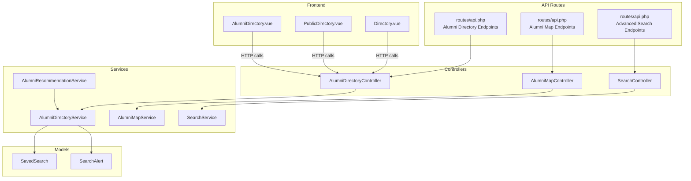
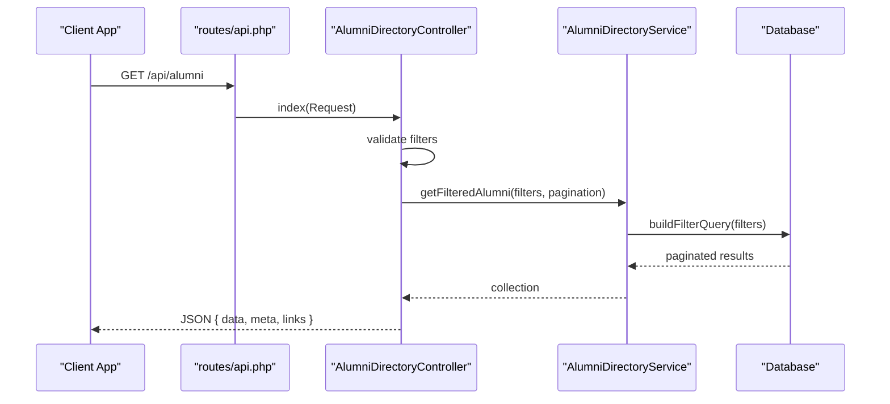
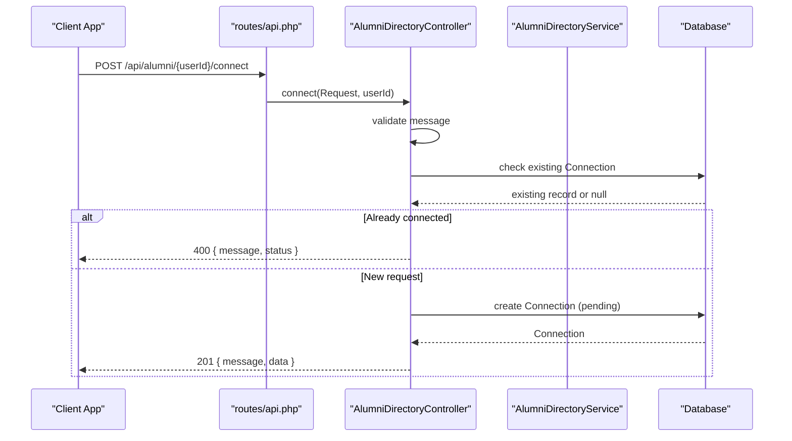
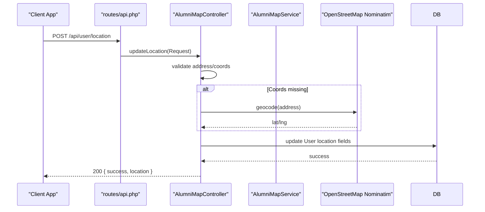
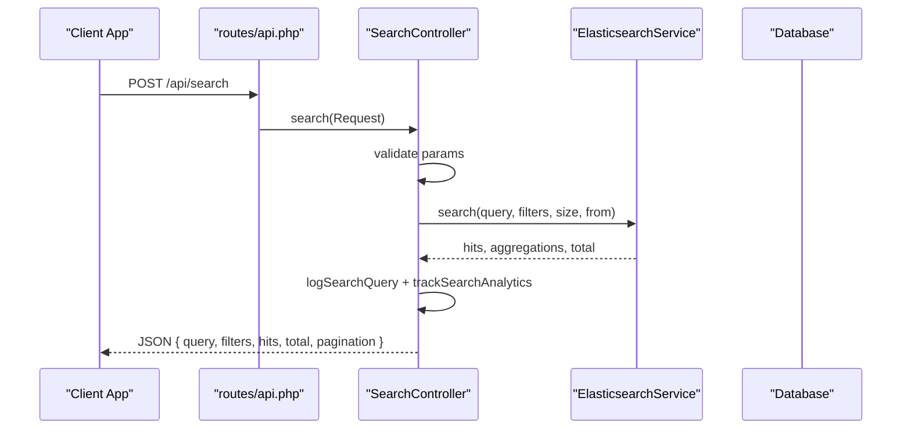
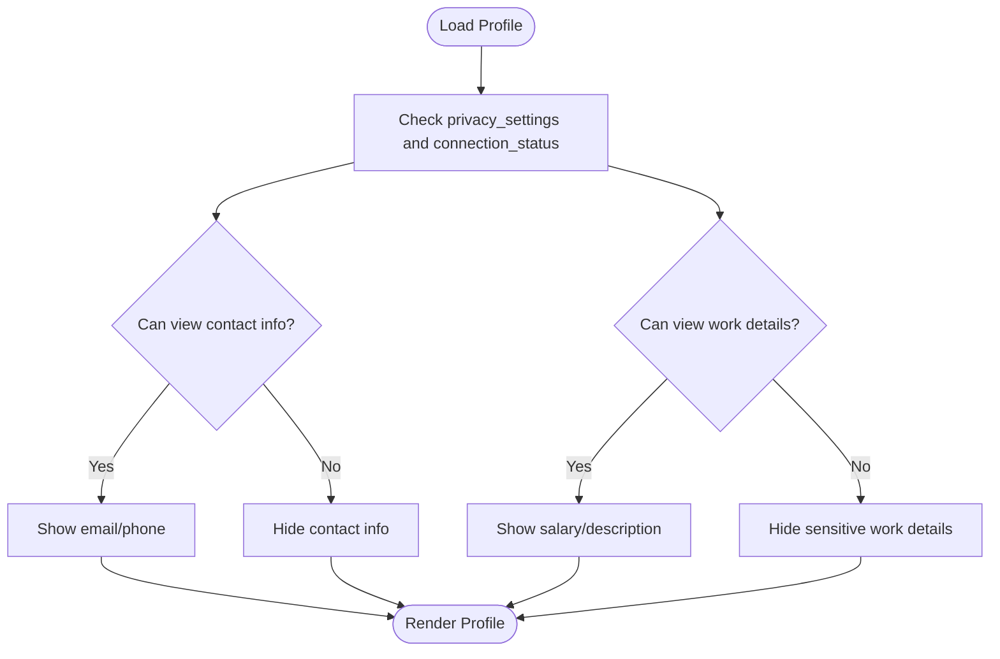
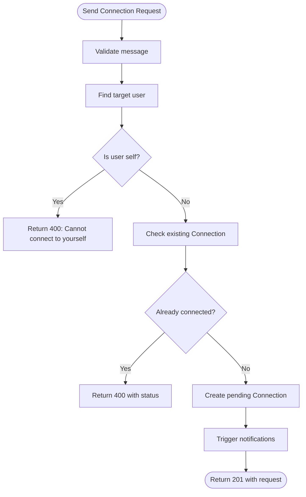
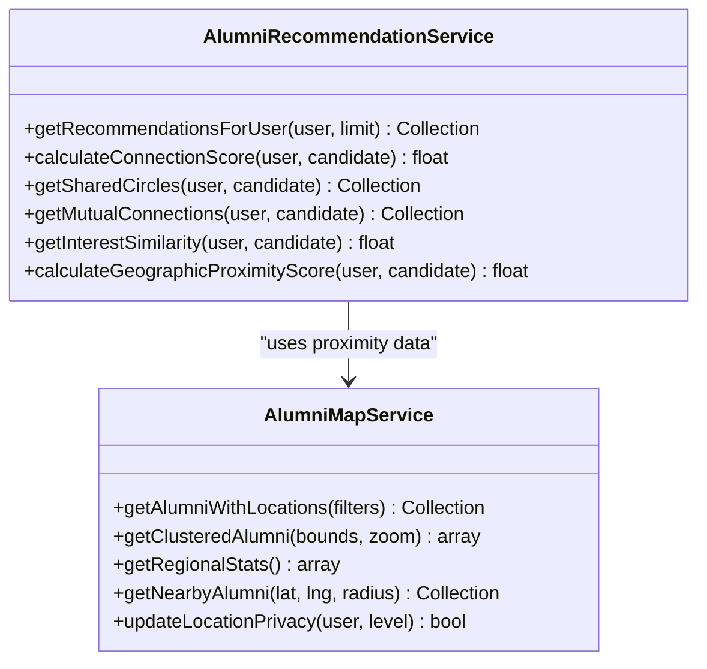
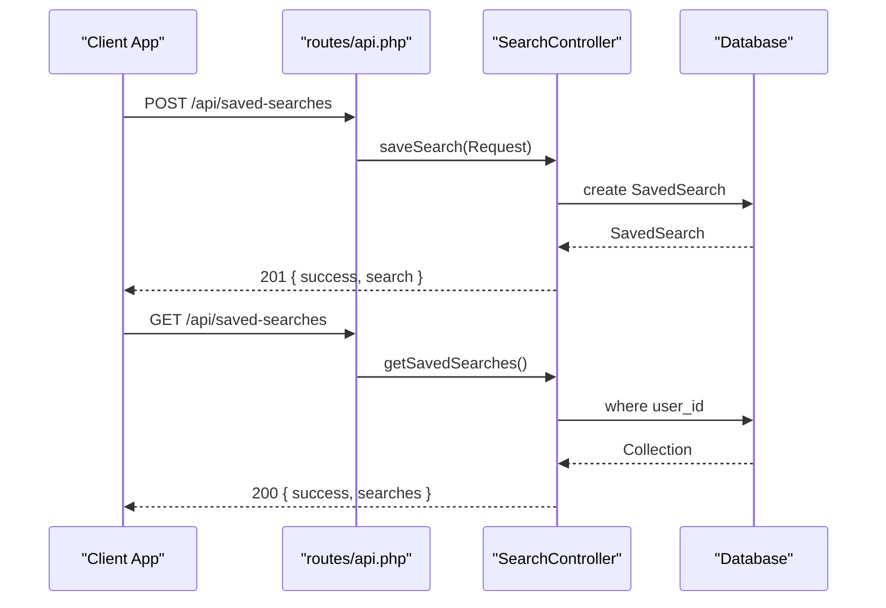
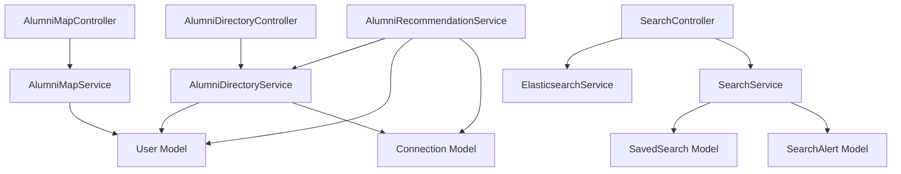

# Alumni Directory

<cite>
**Referenced Files in This Document**
- [routes/api.php](file://routes/api.php)
- [AlumniDirectoryController.php](file://app/Http/Controllers/Api/AlumniDirectoryController.php)
- [AlumniDirectoryService.php](file://app/Services/AlumniDirectoryService.php)
- [AlumniMapController.php](file://app/Http/Controllers/Api/AlumniMapController.php)
- [AlumniMapService.php](file://app/Services/AlumniMapService.php)
- [AlumniRecommendationService.php](file://app/Services/AlumniRecommendationService.php)
- [SearchController.php](file://app/Http/Controllers/Api/SearchController.php)
- [SearchService.php](file://app/Services/SearchService.php)
- [SavedSearch.php](file://app/Models/SavedSearch.php)
- [SearchAlert.php](file://app/Models/SearchAlert.php)
- [AlumniDirectory.vue](file://resources/js/Pages/AlumniDirectory.vue)
- [PublicDirectory.vue](file://resources/js/Pages/Alumni/PublicDirectory.vue)
- [Directory.vue](file://resources/js/Pages/Alumni/Directory.vue)
</cite>

## Table of Contents
1. [Introduction](#introduction)
2. [Project Structure](#project-structure)
3. [Core Components](#core-components)
4. [Architecture Overview](#architecture-overview)
5. [Detailed Component Analysis](#detailed-component-analysis)
6. [Dependency Analysis](#dependency-analysis)
7. [Performance Considerations](#performance-considerations)
8. [Troubleshooting Guide](#troubleshooting-guide)
9. [Conclusion](#conclusion)
10. [Appendices](#appendices)

## Introduction
This document provides comprehensive API documentation for the alumni directory functionality. It covers advanced search endpoints, filtering by graduation year, location, career field, and institution; privacy controls and visibility settings; connection request management; alumni map integration with geolocation services and proximity-based recommendations; directory analytics, search suggestions, and saved searches; and practical examples for constructing search queries, pagination, and combining filters. It also addresses location privacy controls, data protection compliance, and directory contribution guidelines.

## Project Structure
The alumni directory system is implemented as a Laravel backend with dedicated controllers and services, and Vue.js frontend pages for directory discovery and filtering.

**Diagram sources**
- [routes/api.php:142-180](file://routes/api.php#L142-L180)
- [AlumniDirectoryController.php:1-292](file://app/Http/Controllers/Api/AlumniDirectoryController.php#L1-L292)
- [AlumniMapController.php:1-430](file://app/Http/Controllers/Api/AlumniMapController.php#L1-L430)
- [SearchController.php:1-478](file://app/Http/Controllers/Api/SearchController.php#L1-L478)
- [AlumniDirectoryService.php:1-464](file://app/Services/AlumniDirectoryService.php#L1-L464)
- [AlumniMapService.php:1-236](file://app/Services/AlumniMapService.php#L1-L236)
- [AlumniRecommendationService.php:1-433](file://app/Services/AlumniRecommendationService.php#L1-L433)
- [SavedSearch.php:1-46](file://app/Models/SavedSearch.php#L1-L46)
- [SearchAlert.php:1-44](file://app/Models/SearchAlert.php#L1-L44)
- [AlumniDirectory.vue:1-464](file://resources/js/Pages/AlumniDirectory.vue#L1-L464)
- [PublicDirectory.vue:1-272](file://resources/js/Pages/Alumni/PublicDirectory.vue#L1-L272)
- [Directory.vue:1-28](file://resources/js/Pages/Alumni/Directory.vue#L1-L28)

**Section sources**
- [routes/api.php:142-180](file://routes/api.php#L142-L180)
- [AlumniDirectoryController.php:1-292](file://app/Http/Controllers/Api/AlumniDirectoryController.php#L1-L292)
- [AlumniMapController.php:1-430](file://app/Http/Controllers/Api/AlumniMapController.php#L1-L430)
- [SearchController.php:1-478](file://app/Http/Controllers/Api/SearchController.php#L1-L478)

## Core Components
- Alumni Directory API: Provides paginated alumni listings, filters, search suggestions, and connection requests.
- Alumni Map API: Provides map data, clustering, regional statistics, nearby alumni, geocoding, and location privacy controls.
- Advanced Search API: Provides Elasticsearch-backed search across multiple content types, suggestions, saved searches, and analytics.
- Recommendation Engine: Computes personalized recommendations based on shared circles, mutual connections, interests, and proximity.
- Frontend Pages: Vue components for directory discovery, filtering, and search.

**Section sources**
- [AlumniDirectoryController.php:25-184](file://app/Http/Controllers/Api/AlumniDirectoryController.php#L25-L184)
- [AlumniMapController.php:23-205](file://app/Http/Controllers/Api/AlumniMapController.php#L23-L205)
- [SearchController.php:27-381](file://app/Http/Controllers/Api/SearchController.php#L27-L381)
- [AlumniRecommendationService.php:29-57](file://app/Services/AlumniRecommendationService.php#L29-L57)

## Architecture Overview
The system follows a layered architecture:
- HTTP Layer: Routes define endpoints; controllers handle request validation and orchestration.
- Service Layer: Business logic encapsulated in services (directory, map, recommendations, search).
- Persistence Layer: Eloquent models and database queries; Elasticsearch integration for advanced search.
- Presentation Layer: Vue.js pages consume APIs via HTTP calls.

**Diagram sources**
- [routes/api.php:142-149](file://routes/api.php#L142-L149)
- [AlumniDirectoryController.php:25-74](file://app/Http/Controllers/Api/AlumniDirectoryController.php#L25-L74)
- [AlumniDirectoryService.php:17-25](file://app/Services/AlumniDirectoryService.php#L17-L25)

**Section sources**
- [routes/api.php:142-149](file://routes/api.php#L142-L149)
- [AlumniDirectoryController.php:25-74](file://app/Http/Controllers/Api/AlumniDirectoryController.php#L25-L74)
- [AlumniDirectoryService.php:17-25](file://app/Services/AlumniDirectoryService.php#L17-L25)

## Detailed Component Analysis

### Alumni Directory API
Endpoints:
- GET /api/alumni: Paginated alumni directory with advanced filters and sorting.
- GET /api/alumni/filters: Available filter options with counts.
- GET /api/alumni/search: Autocomplete suggestions by query type.
- GET /api/alumni/{userId}: Detailed profile with privacy controls and computed attributes.
- POST /api/alumni/{userId}/connect: Send connection request with optional message.

Key features:
- Advanced filtering: graduation year range, location, industries, company, skills, current role, institutions, circles, groups.
- Sorting: name, graduation year, location, created_at.
- Pagination: per_page, page with meta and links.
- Privacy-aware profiles: contact info and work details visibility controlled by settings and connection status.
- Connection management: duplicate detection, existing connection status, and request creation.

**Diagram sources**
- [routes/api.php:148-148](file://routes/api.php#L148-L148)
- [AlumniDirectoryController.php:132-184](file://app/Http/Controllers/Api/AlumniDirectoryController.php#L132-L184)

**Section sources**
- [routes/api.php:142-149](file://routes/api.php#L142-L149)
- [AlumniDirectoryController.php:25-184](file://app/Http/Controllers/Api/AlumniDirectoryController.php#L25-L184)
- [AlumniDirectoryService.php:177-205](file://app/Services/AlumniDirectoryService.php#L177-L205)

### Alumni Map API
Endpoints:
- POST /api/alumni/map-data: Alumni with coordinates for map visualization.
- POST /api/alumni/map-clusters: Clustered alumni data for performance.
- GET /api/alumni/map-stats: Regional statistics (country, region, industry).
- POST /api/alumni/nearby: Nearby alumni within a radius.
- POST /api/user/location-privacy: Update location privacy level.
- POST /api/user/location: Update user location (address or coordinates).
- GET /api/geocode/reverse: Reverse geocode coordinates to address.

Capabilities:
- Privacy-aware data retrieval: excludes private locations.
- Clustering: adaptive cluster size based on zoom level.
- Proximity calculations: Haversine-based distance computation.
- Geocoding: OpenStreetMap Nominatim integration for forward and reverse geocoding.

**Diagram sources**
- [routes/api.php:157-159](file://routes/api.php#L157-L159)
- [AlumniMapController.php:252-310](file://app/Http/Controllers/Api/AlumniMapController.php#L252-L310)
- [AlumniMapService.php:214-234](file://app/Services/AlumniMapService.php#L214-L234)

**Section sources**
- [routes/api.php:151-160](file://routes/api.php#L151-L160)
- [AlumniMapController.php:23-352](file://app/Http/Controllers/Api/AlumniMapController.php#L23-L352)
- [AlumniMapService.php:14-235](file://app/Services/AlumniMapService.php#L14-L235)

### Advanced Search API
Endpoints:
- POST /api/search: Elasticsearch-backed search with filters, sorting, and pagination.
- GET /api/search/suggestions: Suggestions for query refinement.
- POST /api/saved-searches: Save a search with optional email alerts.
- GET /api/saved-searches: Retrieve user's saved searches.
- PUT /api/saved-searches/{savedSearch}: Update saved search.
- DELETE /api/saved-searches/{savedSearch}: Delete saved search.
- POST /api/saved-searches/{savedSearch}/run: Execute a saved search.
- GET /api/search/analytics: Search analytics for the user.

Features:
- Multi-type search: users, posts, jobs, events.
- Faceted filters: location, graduation year, industry, skills, date range.
- Sorting: relevance, date, name, engagement.
- Saved searches: persistence with alert configuration.
- Analytics: logging and trending insights.

**Diagram sources**
- [routes/api.php:170-180](file://routes/api.php#L170-L180)
- [SearchController.php:27-96](file://app/Http/Controllers/Api/SearchController.php#L27-L96)

**Section sources**
- [routes/api.php:170-180](file://routes/api.php#L170-L180)
- [SearchController.php:27-381](file://app/Http/Controllers/Api/SearchController.php#L27-L381)
- [SearchService.php:13-446](file://app/Services/SearchService.php#L13-L446)

### Privacy Controls and Visibility Settings
- Directory Profiles: Contact info and work details hidden based on privacy settings and connection status.
- Map Privacy: Locations excluded when privacy is set to private; configurable per-user.
- Recommendation Privacy: Users can opt out of recommendations via privacy settings.

**Diagram sources**
- [AlumniDirectoryService.php:275-333](file://app/Services/AlumniDirectoryService.php#L275-L333)

**Section sources**
- [AlumniDirectoryService.php:275-333](file://app/Services/AlumniDirectoryService.php#L275-L333)
- [AlumniMapService.php:19-49](file://app/Services/AlumniMapService.php#L19-L49)

### Connection Request Management
- Duplicate detection prevents multiple identical requests.
- Existing connections return current status.
- Requests are stored with optional message and status tracking.

**Diagram sources**
- [AlumniDirectoryController.php:132-184](file://app/Http/Controllers/Api/AlumniDirectoryController.php#L132-L184)

**Section sources**
- [AlumniDirectoryController.php:132-184](file://app/Http/Controllers/Api/AlumniDirectoryController.php#L132-L184)

### Alumni Map Integration and Proximity-Based Recommendations
- Map Data: Retrieves alumni with valid coordinates, applying privacy filters.
- Clustering: Groups nearby users into clusters based on zoom level.
- Proximity: Calculates distances using Haversine formula; returns nearby users within a radius.
- Recommendations: Uses shared circles, mutual connections, interest similarity, and geographic proximity to compute scores.

**Diagram sources**
- [AlumniMapService.php:14-235](file://app/Services/AlumniMapService.php#L14-L235)
- [AlumniRecommendationService.php:29-433](file://app/Services/AlumniRecommendationService.php#L29-L433)

**Section sources**
- [AlumniMapService.php:14-235](file://app/Services/AlumniMapService.php#L14-L235)
- [AlumniRecommendationService.php:29-433](file://app/Services/AlumniRecommendationService.php#L29-L433)

### Directory Analytics, Search Suggestions, and Saved Searches
- Directory Analytics: Provides total searches, popular queries, trends, and popular filters.
- Search Suggestions: Elasticsearch-driven suggestions with fallback to database.
- Saved Searches: Persist filters and queries; optional email alerts with frequency settings.

**Diagram sources**
- [routes/api.php:174-179](file://routes/api.php#L174-L179)
- [SearchController.php:147-215](file://app/Http/Controllers/Api/SearchController.php#L147-L215)
- [SavedSearch.php:14-28](file://app/Models/SavedSearch.php#L14-L28)

**Section sources**
- [SearchController.php:147-215](file://app/Http/Controllers/Api/SearchController.php#L147-L215)
- [SavedSearch.php:14-28](file://app/Models/SavedSearch.php#L14-L28)
- [SearchAlert.php:13-26](file://app/Models/SearchAlert.php#L13-L26)

### Examples: Search Query Construction, Pagination, and Filtering Combinations
- Basic search with filters:
  - GET /api/alumni?search=john&location=San%20Francisco&industries[]=technology&company=InnovateCorp&skills[]=leadership
- Range filters:
  - GET /api/alumni?graduation_year_from=2010&graduation_year_to=2020&institutions[]=1&institutions[]=5
- Sorting and pagination:
  - GET /api/alumni?sort_by=graduation_year&sort_order=desc&page=2&per_page=25
- Map clustering:
  - POST /api/alumni/map-clusters with bounds and zoom level
- Saved search execution:
  - POST /api/saved-searches/{id}/run to re-run a previously saved search

**Section sources**
- [AlumniDirectoryController.php:27-48](file://app/Http/Controllers/Api/AlumniDirectoryController.php#L27-L48)
- [AlumniMapController.php:82-91](file://app/Http/Controllers/Api/AlumniMapController.php#L82-L91)
- [SearchController.php:29-56](file://app/Http/Controllers/Api/SearchController.php#L29-L56)

### Location Privacy Controls and Data Protection Compliance
- Location Privacy Levels: public, alumni_only, private; enforced in map queries and profile rendering.
- Data Minimization: Only coordinates and location metadata are used for proximity; sensitive fields are hidden behind privacy gates.
- Compliance Considerations:
  - Obtain explicit consent for location updates.
  - Allow users to revoke location visibility at any time.
  - Implement data retention policies for location history.
  - Ensure secure transport (HTTPS) and rate limiting for geocoding endpoints.

**Section sources**
- [AlumniMapController.php:210-247](file://app/Http/Controllers/Api/AlumniMapController.php#L210-L247)
- [AlumniMapService.php:19-49](file://app/Services/AlumniMapService.php#L19-L49)
- [AlumniDirectoryService.php:275-333](file://app/Services/AlumniDirectoryService.php#L275-L333)

### Directory Contribution Guidelines
- Profile completeness: Encourage users to maintain accurate education, work, and location data.
- Privacy-first defaults: Set conservative privacy settings; allow users to expand visibility.
- Community standards: Enforce respectful communication and appropriate content in profiles and interactions.
- Feedback mechanisms: Provide channels for reporting privacy concerns or inappropriate behavior.

[No sources needed since this section provides general guidance]

## Dependency Analysis

**Diagram sources**
- [AlumniDirectoryController.php:15-20](file://app/Http/Controllers/Api/AlumniDirectoryController.php#L15-L20)
- [AlumniDirectoryService.php:5-12](file://app/Services/AlumniDirectoryService.php#L5-L12)
- [AlumniMapController.php:16-18](file://app/Http/Controllers/Api/AlumniMapController.php#L16-L18)
- [AlumniMapService.php:5-9](file://app/Services/AlumniMapService.php#L5-L9)
- [SearchController.php:17-22](file://app/Http/Controllers/Api/SearchController.php#L17-L22)
- [SearchService.php:5-11](file://app/Services/SearchService.php#L5-L11)
- [AlumniRecommendationService.php:5-11](file://app/Services/AlumniRecommendationService.php#L5-L11)
- [SavedSearch.php:7-8](file://app/Models/SavedSearch.php#L7-L8)
- [SearchAlert.php:7-8](file://app/Models/SearchAlert.php#L7-L8)

**Section sources**
- [AlumniDirectoryController.php:15-20](file://app/Http/Controllers/Api/AlumniDirectoryController.php#L15-L20)
- [AlumniMapController.php:16-18](file://app/Http/Controllers/Api/AlumniMapController.php#L16-L18)
- [SearchController.php:17-22](file://app/Http/Controllers/Api/SearchController.php#L17-L22)
- [AlumniRecommendationService.php:5-11](file://app/Services/AlumniRecommendationService.php#L5-L11)

## Performance Considerations
- Use pagination (per_page, page) to limit result sets.
- Prefer faceted filters to reduce query complexity.
- Leverage clustering for map endpoints to minimize payload size.
- Cache recommendation results with TTL to avoid repeated computations.
- Apply rate limits on search and geocoding endpoints to prevent abuse.

[No sources needed since this section provides general guidance]

## Troubleshooting Guide
Common issues and resolutions:
- Search temporarily unavailable: The system falls back to basic database queries and logs errors for diagnostics.
- Invalid parameters: Validation errors return structured details to help clients adjust requests.
- Geocoding failures: Coordinate updates fall back to address-only updates; verify external service availability and rate limits.
- Privacy restrictions: If location or profile data appears hidden, verify user privacy settings and connection status.

**Section sources**
- [SearchController.php:83-95](file://app/Http/Controllers/Api/SearchController.php#L83-L95)
- [AlumniMapController.php:298-309](file://app/Http/Controllers/Api/AlumniMapController.php#L298-L309)

## Conclusion
The alumni directory system offers robust, privacy-conscious functionality for discovering and connecting with alumni. It combines advanced filtering, map-based discovery, proximity recommendations, and saved searches powered by Elasticsearch. The architecture cleanly separates concerns across controllers, services, and models, enabling scalability and maintainability while respecting user privacy and data protection.

[No sources needed since this section summarizes without analyzing specific files]

## Appendices

### API Reference Summary

- Alumni Directory
  - GET /api/alumni: Filters, pagination, sorting
  - GET /api/alumni/filters: Filter options with counts
  - GET /api/alumni/search: Suggestions by type
  - GET /api/alumni/{userId}: Profile with privacy controls
  - POST /api/alumni/{userId}/connect: Send connection request

- Alumni Map
  - POST /api/alumni/map-data: Alumni with coordinates
  - POST /api/alumni/map-clusters: Clustered data
  - GET /api/alumni/map-stats: Regional stats
  - POST /api/alumni/nearby: Nearby users
  - POST /api/user/location-privacy: Update privacy
  - POST /api/user/location: Update location
  - GET /api/geocode/reverse: Reverse geocode

- Advanced Search
  - POST /api/search: Elasticsearch search
  - GET /api/search/suggestions: Suggestions
  - POST /api/saved-searches: Save search
  - GET /api/saved-searches: List saved searches
  - PUT /api/saved-searches/{id}: Update saved search
  - DELETE /api/saved-searches/{id}: Delete saved search
  - POST /api/saved-searches/{id}/run: Execute saved search
  - GET /api/search/analytics: User analytics

**Section sources**
- [routes/api.php:142-180](file://routes/api.php#L142-L180)
- [AlumniDirectoryController.php:25-184](file://app/Http/Controllers/Api/AlumniDirectoryController.php#L25-L184)
- [AlumniMapController.php:23-352](file://app/Http/Controllers/Api/AlumniMapController.php#L23-L352)
- [SearchController.php:27-381](file://app/Http/Controllers/Api/SearchController.php#L27-L381)