# Analytics & Tracking

<cite>
**Referenced Files in This Document**
- [analytics.php](file://config/analytics.php)
- [AnalyticsService.php](file://app/Services/AnalyticsService.php)
- [BehaviorTrackingService.php](file://app/Services/BehaviorTrackingService.php)
- [ABTestingService.php](file://app/Services/ABTestingService.php)
- [AnalyticsEvent.php](file://app/Models/AnalyticsEvent.php)
- [BehaviorEvent.php](file://app/Models/BehaviorEvent.php)
- [AnalyticsSnapshot.php](file://app/Models/AnalyticsSnapshot.php)
- [AnalyticsController.php](file://app/Http/Controllers/Api/AnalyticsController.php)
- [AnalyticsTrackingController.php](file://app/Http/Controllers/Api/AnalyticsTrackingController.php)
- [ReportBuilderService.php](file://app/Services/ReportBuilderService.php)
- [CareerOutcomeAnalyticsService.php](file://app/Services/CareerOutcomeAnalyticsService.php)
</cite>

## Table of Contents
1. [Introduction](#introduction)
2. [Project Structure](#project-structure)
3. [Core Components](#core-components)
4. [Architecture Overview](#architecture-overview)
5. [Detailed Component Analysis](#detailed-component-analysis)
6. [Dependency Analysis](#dependency-analysis)
7. [Performance Considerations](#performance-considerations)
8. [Troubleshooting Guide](#troubleshooting-guide)
9. [Conclusion](#conclusion)
10. [Appendices](#appendices)

## Introduction
This document provides comprehensive API documentation for the analytics and behavioral tracking systems. It covers event tracking, conversion measurement, user behavior analytics, custom metric definition, dashboard creation, and report generation. It also details A/B testing integration, experiment tracking, performance monitoring, real-time analytics, data export capabilities, and integration with external analytics platforms. Privacy and data lifecycle management are addressed with anonymization and retention controls.

## Project Structure
The analytics system is organized around:
- Configuration-driven behavior (caching, snapshots, KPIs, predictions, exports, security, integrations)
- Services that encapsulate analytics logic, reporting, and behavioral tracking
- Models that persist events, behavior logs, and snapshots
- API controllers that expose endpoints for dashboards, exports, and tracking
- Specialized services for career outcome analytics and report building

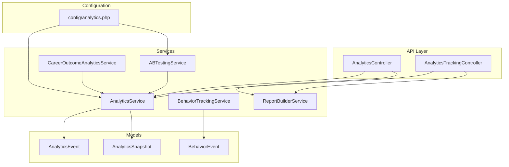

**Diagram sources**
- [analytics.php:1-242](file://config/analytics.php#L1-L242)
- [AnalyticsController.php:1-669](file://app/Http/Controllers/Api/AnalyticsController.php#L1-L669)
- [AnalyticsTrackingController.php:1-487](file://app/Http/Controllers/Api/AnalyticsTrackingController.php#L1-L487)
- [AnalyticsService.php:1-1210](file://app/Services/AnalyticsService.php#L1-L1210)
- [BehaviorTrackingService.php:1-624](file://app/Services/BehaviorTrackingService.php#L1-L624)
- [ABTestingService.php:1-561](file://app/Services/ABTestingService.php#L1-L561)
- [ReportBuilderService.php:1-736](file://app/Services/ReportBuilderService.php#L1-L736)
- [CareerOutcomeAnalyticsService.php:1-511](file://app/Services/CareerOutcomeAnalyticsService.php#L1-L511)
- [AnalyticsEvent.php:1-115](file://app/Models/AnalyticsEvent.php#L1-L115)
- [BehaviorEvent.php:1-214](file://app/Models/BehaviorEvent.php#L1-L214)
- [AnalyticsSnapshot.php:1-82](file://app/Models/AnalyticsSnapshot.php#L1-L82)

**Section sources**
- [analytics.php:1-242](file://config/analytics.php#L1-L242)
- [AnalyticsController.php:1-669](file://app/Http/Controllers/Api/AnalyticsController.php#L1-L669)
- [AnalyticsTrackingController.php:1-487](file://app/Http/Controllers/Api/AnalyticsTrackingController.php#L1-L487)
- [AnalyticsService.php:1-1210](file://app/Services/AnalyticsService.php#L1-L1210)
- [BehaviorTrackingService.php:1-624](file://app/Services/BehaviorTrackingService.php#L1-L624)
- [ABTestingService.php:1-561](file://app/Services/ABTestingService.php#L1-L561)
- [ReportBuilderService.php:1-736](file://app/Services/ReportBuilderService.php#L1-L736)
- [CareerOutcomeAnalyticsService.php:1-511](file://app/Services/CareerOutcomeAnalyticsService.php#L1-L511)
- [AnalyticsEvent.php:1-115](file://app/Models/AnalyticsEvent.php#L1-L115)
- [BehaviorEvent.php:1-214](file://app/Models/BehaviorEvent.php#L1-L214)
- [AnalyticsSnapshot.php:1-82](file://app/Models/AnalyticsSnapshot.php#L1-L82)

## Core Components
- AnalyticsService: Provides engagement metrics, community health, platform usage, custom reports, exports, and graduate outcome analytics. Implements caching, date-range filtering, and export formats.
- BehaviorTrackingService: Tracks user behavior events, updates lead scores, evaluates sequence triggers, and supports bulk processing and cleanup.
- ABTestingService: Manages A/B test variants, tracks assignments and conversions, computes conversion rates and statistical significance, and provides test results.
- AnalyticsEvent and BehaviorEvent: Eloquent models for persisted analytics and behavior events with scoping helpers and validation.
- AnalyticsSnapshot: Stores time-series analytics snapshots with typed data and convenience methods for retrieval.
- AnalyticsController and AnalyticsTrackingController: API endpoints for dashboards, exports, email analytics, and landing page/template tracking.
- ReportBuilderService: Builds custom reports across domains (employment, courses, jobs, outcomes, employers) with multiple output formats.
- CareerOutcomeAnalyticsService: Generates career outcome analytics including program effectiveness, salary analysis, industry placement, and trends.

**Section sources**
- [AnalyticsService.php:1-1210](file://app/Services/AnalyticsService.php#L1-L1210)
- [BehaviorTrackingService.php:1-624](file://app/Services/BehaviorTrackingService.php#L1-L624)
- [ABTestingService.php:1-561](file://app/Services/ABTestingService.php#L1-L561)
- [AnalyticsEvent.php:1-115](file://app/Models/AnalyticsEvent.php#L1-L115)
- [BehaviorEvent.php:1-214](file://app/Models/BehaviorEvent.php#L1-L214)
- [AnalyticsSnapshot.php:1-82](file://app/Models/AnalyticsSnapshot.php#L1-L82)
- [AnalyticsController.php:1-669](file://app/Http/Controllers/Api/AnalyticsController.php#L1-L669)
- [AnalyticsTrackingController.php:1-487](file://app/Http/Controllers/Api/AnalyticsTrackingController.php#L1-L487)
- [ReportBuilderService.php:1-736](file://app/Services/ReportBuilderService.php#L1-L736)
- [CareerOutcomeAnalyticsService.php:1-511](file://app/Services/CareerOutcomeAnalyticsService.php#L1-L511)

## Architecture Overview
The system follows a layered architecture:
- Configuration layer defines caching, snapshots, KPIs, predictions, export limits, performance tuning, security, and integrations.
- API controllers orchestrate requests and delegate to services.
- Services encapsulate domain logic for analytics computation, behavioral tracking, and reporting.
- Models persist events and snapshots with typed casts and scopes.
- Reports and dashboards consume services and return aggregated data.

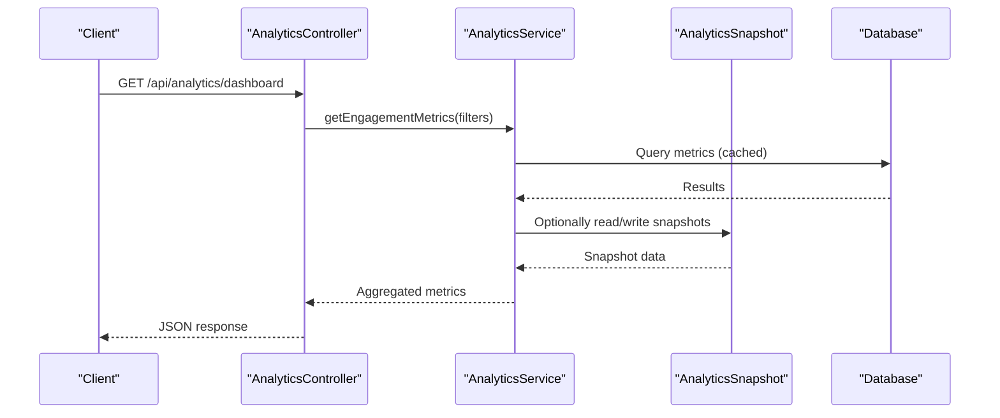

**Diagram sources**
- [AnalyticsController.php:120-144](file://app/Http/Controllers/Api/AnalyticsController.php#L120-L144)
- [AnalyticsService.php:27-44](file://app/Services/AnalyticsService.php#L27-L44)
- [AnalyticsSnapshot.php:48-70](file://app/Models/AnalyticsSnapshot.php#L48-L70)

## Detailed Component Analysis

### AnalyticsService
- Responsibilities:
  - Compute engagement metrics, community health, platform usage, and graduate outcomes.
  - Build custom reports and export data in CSV/JSON/XLSX.
  - Manage caching and date-range filtering.
  - Generate snapshots for graduate outcomes.
- Key methods:
  - getEngagementMetrics, getAlumniActivity, getCommunityHealth, getPlatformUsage
  - generateCustomReport, exportData
  - getGraduateOutcomeMetrics, getCourseRoiMetrics, getEmployerEngagementMetrics
  - getCommunityHealthMetrics, getPlatformBenchmarks, getMarketTrends
  - getSystemGrowthMetrics, exportAnalyticsData
- Data sources:
  - Users, posts, engagements, connections, groups, circles, employers, jobs, graduates, tenants.

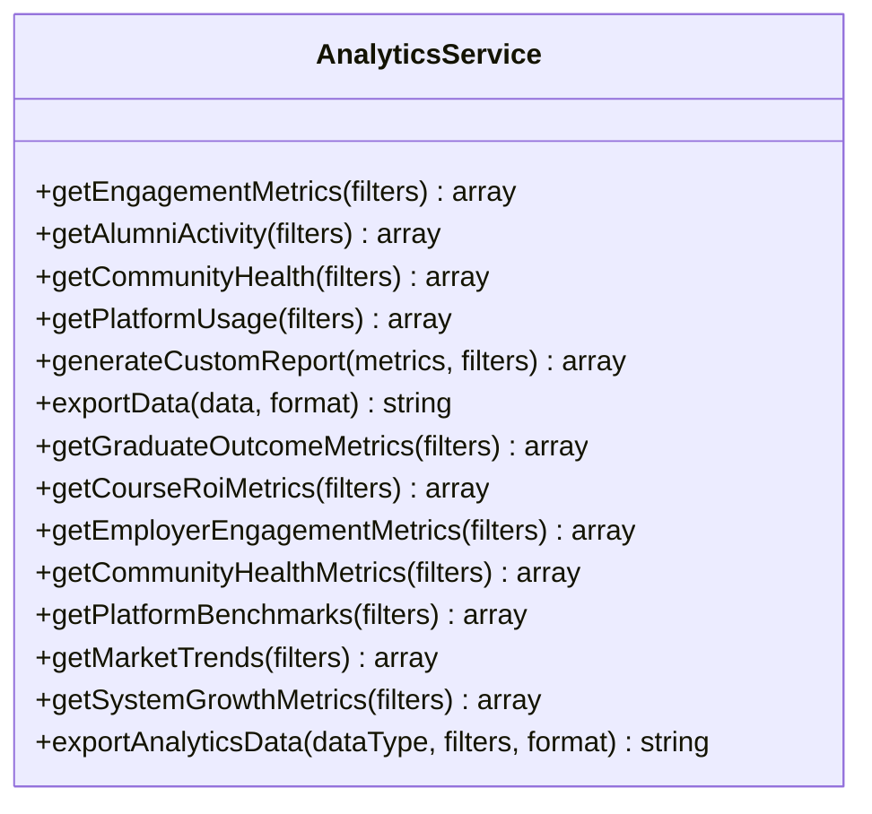

**Diagram sources**
- [AnalyticsService.php:27-800](file://app/Services/AnalyticsService.php#L27-L800)

**Section sources**
- [AnalyticsService.php:27-800](file://app/Services/AnalyticsService.php#L27-L800)

### BehaviorTrackingService
- Responsibilities:
  - Track behavior events (page visits, form interactions, content engagement, email engagement).
  - Update lead scores and evaluate sequence triggers.
  - Provide analytics for tenant and lead-level insights.
  - Bulk processing and cleanup of old events.
- Key methods:
  - trackBehavior, trackPageVisit, trackFormInteraction, trackContentEngagement, trackEmailEngagement, trackCustomEvent
  - evaluateSequenceTriggers, updateLeadScore
  - getLeadBehaviorHistory, getLeadEngagementMetrics, getBehaviorAnalytics
  - processBulkEvents, cleanupOldEvents

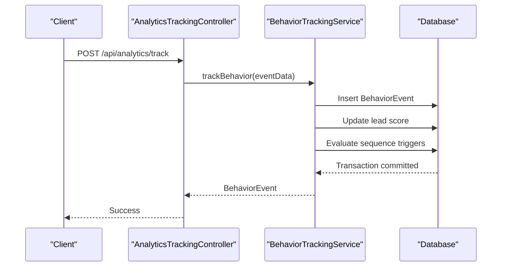

**Diagram sources**
- [AnalyticsTrackingController.php:30-70](file://app/Http/Controllers/Api/AnalyticsTrackingController.php#L30-L70)
- [BehaviorTrackingService.php:38-81](file://app/Services/BehaviorTrackingService.php#L38-L81)

**Section sources**
- [BehaviorTrackingService.php:38-468](file://app/Services/BehaviorTrackingService.php#L38-L468)

### ABTestingService
- Responsibilities:
  - Assign variants consistently based on user ID and weights.
  - Track variant assignments and conversions.
  - Compute conversion rates and statistical significance.
  - Provide test results and winner determination.
- Key methods:
  - getVariant, trackConversion, getTestResults, createTest, updateTestStatus
  - getActiveTests, getTest

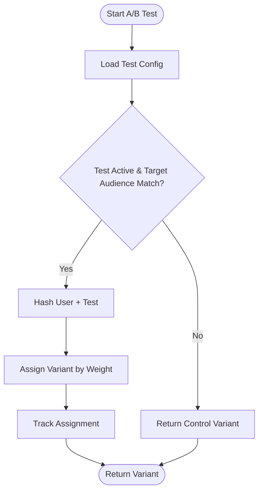

**Diagram sources**
- [ABTestingService.php:14-51](file://app/Services/ABTestingService.php#L14-L51)
- [ABTestingService.php:334-387](file://app/Services/ABTestingService.php#L334-L387)

**Section sources**
- [ABTestingService.php:14-153](file://app/Services/ABTestingService.php#L14-L153)
- [ABTestingService.php:334-560](file://app/Services/ABTestingService.php#L334-L560)

### AnalyticsEvent and BehaviorEvent Models
- AnalyticsEvent: Typed properties for event metadata, consent, and retention; scoping helpers; anonymization support.
- BehaviorEvent: Typed arrays for event_data and metadata; scopes for tenant/user/date ranges; event type validation and categorization.

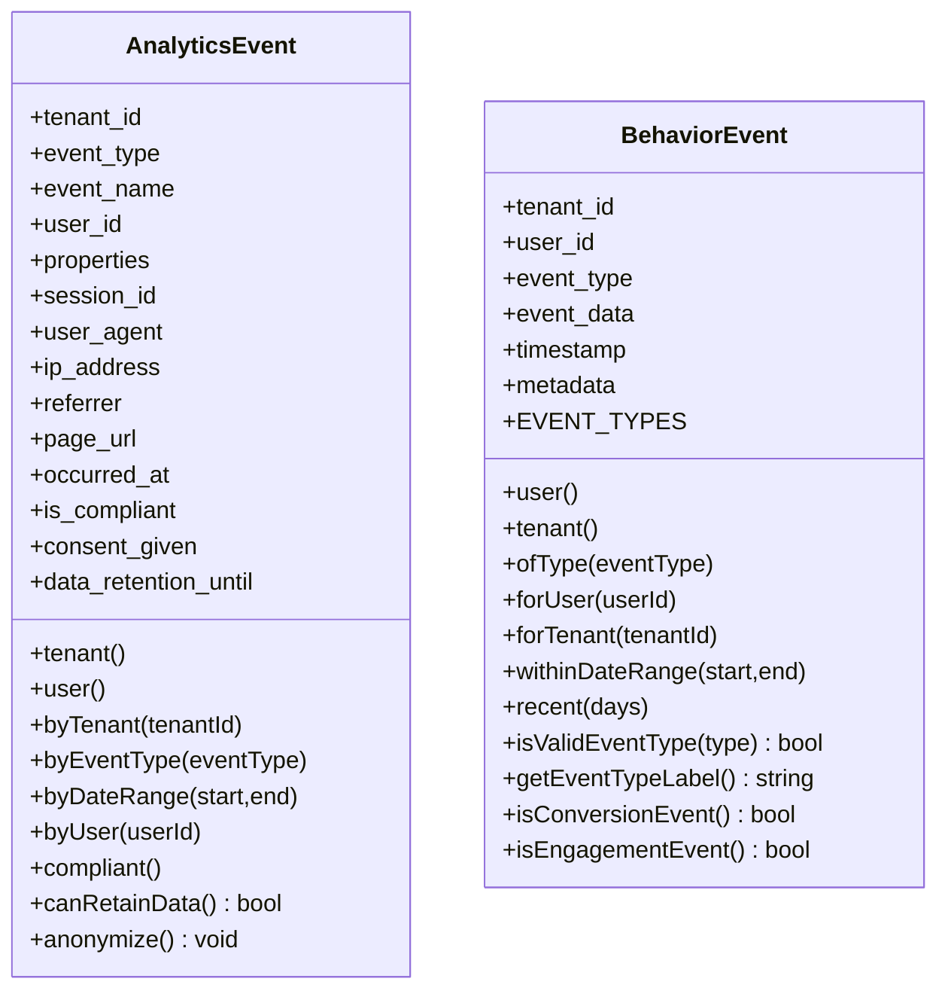

**Diagram sources**
- [AnalyticsEvent.php:13-114](file://app/Models/AnalyticsEvent.php#L13-L114)
- [BehaviorEvent.php:38-214](file://app/Models/BehaviorEvent.php#L38-L214)

**Section sources**
- [AnalyticsEvent.php:13-114](file://app/Models/AnalyticsEvent.php#L13-L114)
- [BehaviorEvent.php:38-214](file://app/Models/BehaviorEvent.php#L38-L214)

### AnalyticsSnapshot
- Purpose: Persist time-series analytics snapshots (daily/weekly/monthly) with typed data and metadata.
- Methods: Scopes by type/date range, helpers to fetch latest/trend data, and metric accessors.

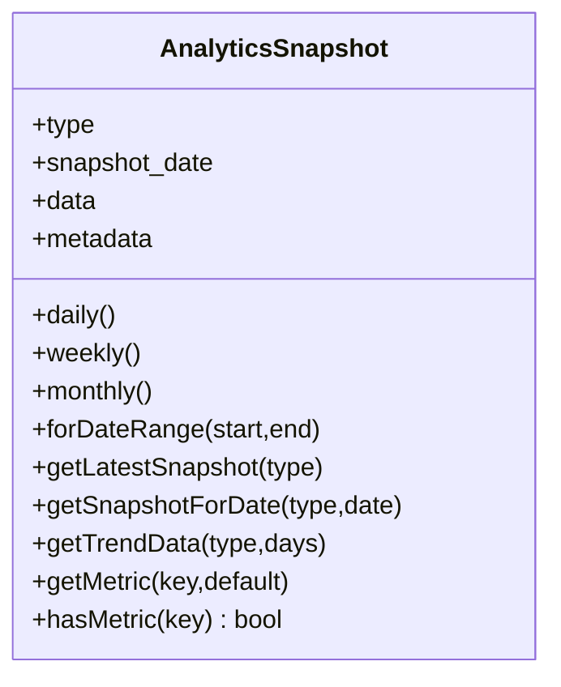

**Diagram sources**
- [AnalyticsSnapshot.php:13-81](file://app/Models/AnalyticsSnapshot.php#L13-L81)

**Section sources**
- [AnalyticsSnapshot.php:13-81](file://app/Models/AnalyticsSnapshot.php#L13-L81)

### AnalyticsController (Dashboards, Reports, Exports)
- Endpoints:
  - Engagement, alumni activity, community health, platform usage dashboards
  - Custom report generation and export
  - Available metrics enumeration
  - Analytics summary with trends and alerts
  - Email analytics: performance, funnel, engagement report, A/B test results, real-time analytics, automated reports
  - Export endpoints for various data types and formats
- Validation and filters: start/end dates, institution, graduation year, location, program.

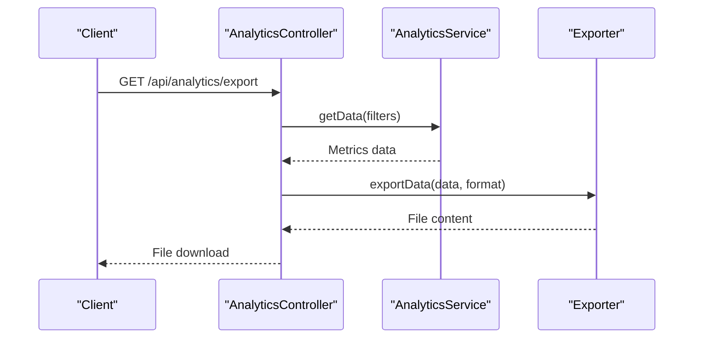

**Diagram sources**
- [AnalyticsController.php:182-223](file://app/Http/Controllers/Api/AnalyticsController.php#L182-L223)
- [AnalyticsService.php:121-133](file://app/Services/AnalyticsService.php#L121-L133)

**Section sources**
- [AnalyticsController.php:24-144](file://app/Http/Controllers/Api/AnalyticsController.php#L24-L144)
- [AnalyticsController.php:182-223](file://app/Http/Controllers/Api/AnalyticsController.php#L182-L223)
- [AnalyticsController.php:426-597](file://app/Http/Controllers/Api/AnalyticsController.php#L426-L597)

### AnalyticsTrackingController (Landing Pages, Templates, Pixel)
- Endpoints:
  - Track page views/conversions for landing pages
  - Track template usage events
  - Pixel endpoint for page view tracking
  - Tracking code generation and SEO meta tags
  - Analytics dashboard and reports for templates
  - Comparative analysis and earnings report placeholders
- Integrations: TrackingCodeService and TemplateAnalyticsService.

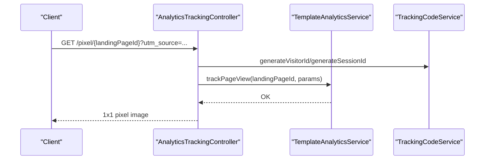

**Diagram sources**
- [AnalyticsTrackingController.php:133-181](file://app/Http/Controllers/Api/AnalyticsTrackingController.php#L133-L181)

**Section sources**
- [AnalyticsTrackingController.php:30-70](file://app/Http/Controllers/Api/AnalyticsTrackingController.php#L30-L70)
- [AnalyticsTrackingController.php:133-181](file://app/Http/Controllers/Api/AnalyticsTrackingController.php#L133-L181)
- [AnalyticsTrackingController.php:190-214](file://app/Http/Controllers/Api/AnalyticsTrackingController.php#L190-L214)
- [AnalyticsTrackingController.php:265-289](file://app/Http/Controllers/Api/AnalyticsTrackingController.php#L265-L289)
- [AnalyticsTrackingController.php:367-388](file://app/Http/Controllers/Api/AnalyticsTrackingController.php#L367-L388)

### ReportBuilderService
- Responsibilities:
  - Execute custom reports across domains (employment, course performance, job market, outcomes, employer analytics, institution overview).
  - Validate filters, generate preview data, and produce CSV/Excel/PDF/JSON outputs.
  - Manage report execution lifecycle and storage.
- Supported report types: employment, course_performance, job_market, graduate_outcomes, employer_analytics, institution_overview, custom_query.

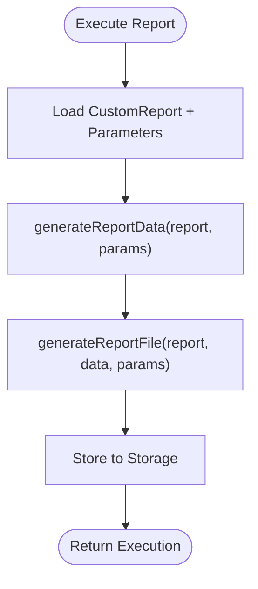

**Diagram sources**
- [ReportBuilderService.php:16-38](file://app/Services/ReportBuilderService.php#L16-L38)
- [ReportBuilderService.php:56-73](file://app/Services/ReportBuilderService.php#L56-L73)

**Section sources**
- [ReportBuilderService.php:16-38](file://app/Services/ReportBuilderService.php#L16-L38)
- [ReportBuilderService.php:40-54](file://app/Services/ReportBuilderService.php#L40-L54)
- [ReportBuilderService.php:56-73](file://app/Services/ReportBuilderService.php#L56-L73)

### CareerOutcomeAnalyticsService
- Responsibilities:
  - Generate comprehensive career outcome analytics including overview metrics, program effectiveness, salary analysis, industry placement, demographic outcomes, career paths, and trends.
  - Support snapshot generation for periods and filters.
- Filters: graduation year, program, industry, years since graduation, date ranges.

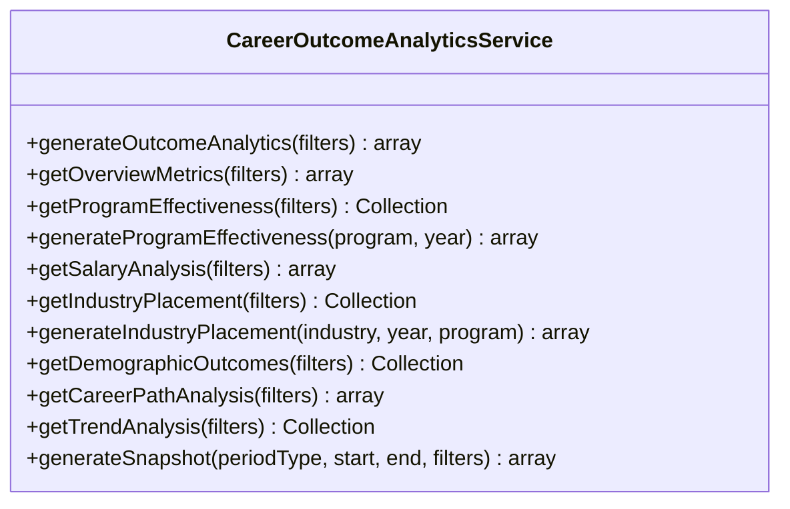

**Diagram sources**
- [CareerOutcomeAnalyticsService.php:20-31](file://app/Services/CareerOutcomeAnalyticsService.php#L20-L31)

**Section sources**
- [CareerOutcomeAnalyticsService.php:20-31](file://app/Services/CareerOutcomeAnalyticsService.php#L20-L31)
- [CareerOutcomeAnalyticsService.php:302-339](file://app/Services/CareerOutcomeAnalyticsService.php#L302-L339)

## Dependency Analysis
- Configuration-driven behavior:
  - config/analytics.php governs caching, snapshots, KPIs, predictions, reports, charts, exports, performance, security, integrations, dashboard defaults, and logging.
- Service-to-service dependencies:
  - AnalyticsController depends on AnalyticsService and EmailAnalyticsService.
  - AnalyticsTrackingController depends on TemplateAnalyticsService and TrackingCodeService.
  - AnalyticsService integrates with models for metrics computation.
  - BehaviorTrackingService depends on BehaviorEvent and related models.
  - ABTestingService relies on AnalyticsService for results aggregation.
  - ReportBuilderService orchestrates multiple domain queries and storage.
  - CareerOutcomeAnalyticsService aggregates specialized models and timelines.

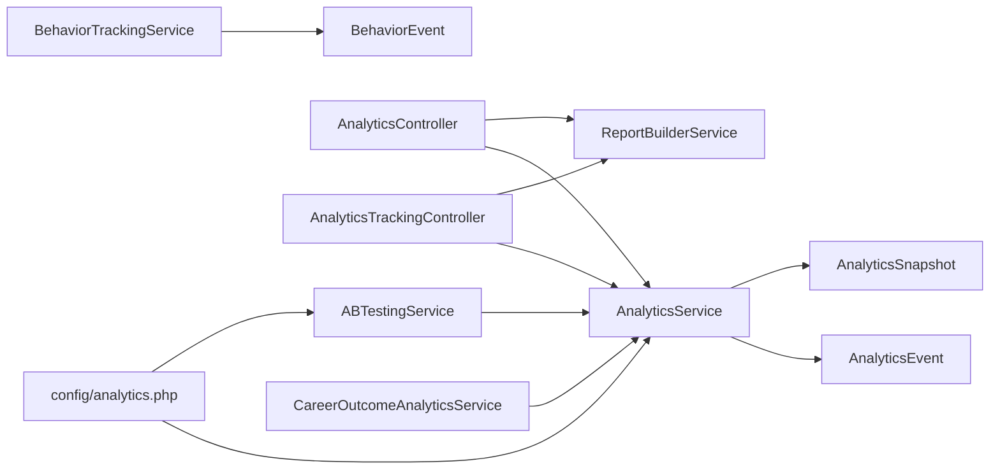

**Diagram sources**
- [analytics.php:22-241](file://config/analytics.php#L22-L241)
- [AnalyticsController.php:14-19](file://app/Http/Controllers/Api/AnalyticsController.php#L14-L19)
- [AnalyticsTrackingController.php:19-22](file://app/Http/Controllers/Api/AnalyticsTrackingController.php#L19-L22)
- [AnalyticsService.php:5-21](file://app/Services/AnalyticsService.php#L5-L21)
- [BehaviorTrackingService.php:5-14](file://app/Services/BehaviorTrackingService.php#L5-L14)
- [ABTestingService.php:5-8](file://app/Services/ABTestingService.php#L5-L8)
- [ReportBuilderService.php:5-12](file://app/Services/ReportBuilderService.php#L5-L12)
- [CareerOutcomeAnalyticsService.php:5-11](file://app/Services/CareerOutcomeAnalyticsService.php#L5-L11)

**Section sources**
- [analytics.php:22-241](file://config/analytics.php#L22-L241)
- [AnalyticsController.php:14-19](file://app/Http/Controllers/Api/AnalyticsController.php#L14-L19)
- [AnalyticsTrackingController.php:19-22](file://app/Http/Controllers/Api/AnalyticsTrackingController.php#L19-L22)
- [AnalyticsService.php:5-21](file://app/Services/AnalyticsService.php#L5-L21)
- [BehaviorTrackingService.php:5-14](file://app/Services/BehaviorTrackingService.php#L5-L14)
- [ABTestingService.php:5-8](file://app/Services/ABTestingService.php#L5-L8)
- [ReportBuilderService.php:5-12](file://app/Services/ReportBuilderService.php#L5-L12)
- [CareerOutcomeAnalyticsService.php:5-11](file://app/Services/CareerOutcomeAnalyticsService.php#L5-L11)

## Performance Considerations
- Caching: AnalyticsService leverages cache keys for engagement metrics and graduate outcomes to reduce query load.
- Chunking and batching: Export and report generation use chunk sizes and batch processing to manage memory and throughput.
- Parallel processing: Optional parallel processing flag in configuration.
- Query timeouts and memory limits: Controlled via configuration to prevent resource exhaustion.
- Indexing and scopes: Models provide scopes for efficient filtering and tenant isolation.

[No sources needed since this section provides general guidance]

## Troubleshooting Guide
- Validation failures:
  - BehaviorTrackingService validates event data and throws validation exceptions; review event_type, lead_id, IP, and timestamps.
- Transaction rollbacks:
  - Behavior event tracking wraps inserts in transactions; failures are logged with event data for debugging.
- A/B test anomalies:
  - Missing or inactive tests fall back to control variant; warnings are logged with user and audience context.
- Export errors:
  - Unsupported formats raise invalid argument exceptions; verify format and data shape.
- Data retention and compliance:
  - AnalyticsEvent supports anonymization and retention checks; ensure retention_until is set appropriately.

**Section sources**
- [BehaviorTrackingService.php:476-489](file://app/Services/BehaviorTrackingService.php#L476-L489)
- [BehaviorTrackingService.php:72-80](file://app/Services/BehaviorTrackingService.php#L72-L80)
- [ABTestingService.php:18-41](file://app/Services/ABTestingService.php#L18-L41)
- [ABTestingService.php:80-90](file://app/Services/ABTestingService.php#L80-L90)
- [AnalyticsService.php:130-133](file://app/Services/AnalyticsService.php#L130-133)
- [AnalyticsEvent.php:106-113](file://app/Models/AnalyticsEvent.php#L106-L113)

## Conclusion
The analytics and behavioral tracking system offers a robust, configurable foundation for measuring user engagement, tracking behavior, conducting A/B experiments, generating custom reports, and maintaining privacy-compliant data handling. The modular design enables scalable dashboards, real-time insights, and extensible integrations.

[No sources needed since this section summarizes without analyzing specific files]

## Appendices

### API Endpoints Overview
- AnalyticsController
  - GET /api/analytics/engagement-metrics
  - GET /api/analytics/alumni-activity
  - GET /api/analytics/community-health
  - GET /api/analytics/platform-usage
  - GET /api/analytics/dashboard
  - POST /api/analytics/custom-report
  - POST /api/analytics/export
  - GET /api/analytics/metrics
  - GET /api/analytics/summary
  - GET /api/analytics/email/performance
  - GET /api/analytics/email/funnel
  - POST /api/analytics/email/report
  - GET /api/analytics/email/ab-results
  - GET /api/analytics/email/realtime
  - POST /api/analytics/email/automated-report
  - POST /api/analytics/email/track-event
  - GET /api/analytics/email/dashboard
- AnalyticsTrackingController
  - POST /api/analytics/track
  - POST /api/analytics/template/usage
  - GET /api/analytics/pixel/{landingPageId}
  - GET /api/analytics/landing-page/{landingPageId}/analytics
  - GET /api/analytics/earnings-report
  - GET /api/analytics/tracking-code/{landingPageId}
  - GET /api/analytics/tracking-pixel/{landingPageId}
  - GET /api/analytics/seo-meta-tags/{landingPageId}
  - GET /api/analytics/analytics-dashboard
  - POST /api/analytics/template/report/{templateId}
  - POST /api/analytics/comparative-analysis
  - GET /api/analytics/template/analytics/{templateId}

**Section sources**
- [AnalyticsController.php:24-144](file://app/Http/Controllers/Api/AnalyticsController.php#L24-L144)
- [AnalyticsController.php:426-667](file://app/Http/Controllers/Api/AnalyticsController.php#L426-L667)
- [AnalyticsTrackingController.php:30-487](file://app/Http/Controllers/Api/AnalyticsTrackingController.php#L30-L487)

### Configuration Reference
- Cache: enable/disable, TTL, prefix
- Snapshots: enable/disable, retention days, auto-generate daily/weekly/monthly
- KPIs: auto-calculate, schedule, thresholds
- Predictions: enable/disable, auto-retrain, schedule, training data threshold, horizon
- Reports: max records, timeout, expiration, storage disk, allowed formats, scheduled processing
- Charts: default colors, max data points, animation duration
- Exports: max file size, cleanup days, batch size
- Performance: query timeout, memory limit, chunk size, parallel processing
- Security: anonymization, audit access, rate limiting
- Integrations: Slack, email, webhooks
- Dashboard: default timeframe, refresh interval, widget configuration
- Logging: enable, level, channel, query logging, performance logging

**Section sources**
- [analytics.php:22-241](file://config/analytics.php#L22-L241)

### Data Privacy and Lifecycle Management
- Consent and compliance:
  - AnalyticsEvent includes consent flags and compliance checks.
- Retention:
  - data_retention_until determines whether data can be retained; anonymize() clears sensitive fields.
- Anonymization:
  - BehaviorEvent and AnalyticsEvent support anonymization to meet privacy requirements.

**Section sources**
- [AnalyticsEvent.php:98-113](file://app/Models/AnalyticsEvent.php#L98-L113)
- [BehaviorEvent.php:196-213](file://app/Models/BehaviorEvent.php#L196-L213)