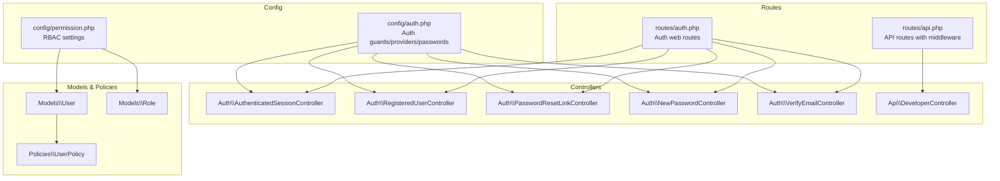
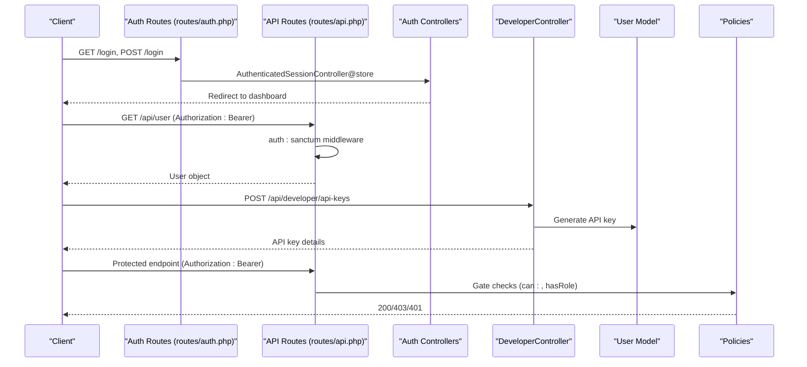
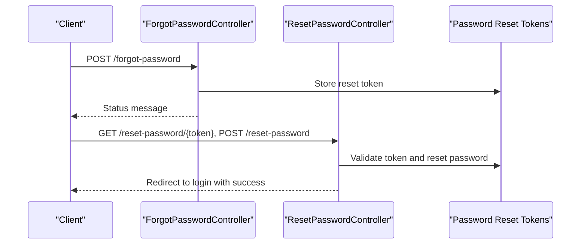
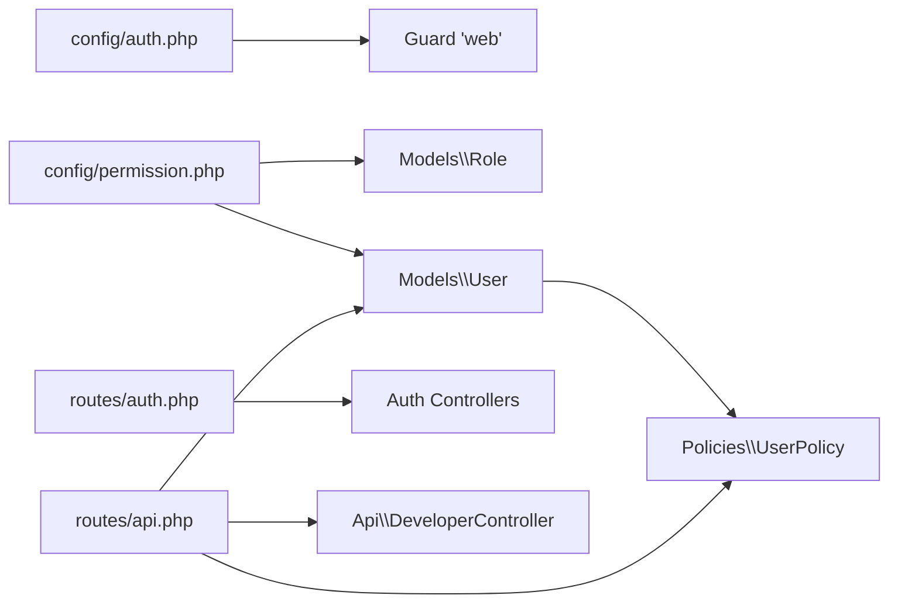

# Authentication & Authorization

<cite>
**Referenced Files in This Document**
- [routes/api.php](file://routes/api.php)
- [routes/auth.php](file://routes/auth.php)
- [config/auth.php](file://config/auth.php)
- [config/permission.php](file://config/permission.php)
- [app/Models/User.php](file://app/Models/User.php)
- [app/Models/Role.php](file://app/Models/Role.php)
- [app/Policies/UserPolicy.php](file://app/Policies/UserPolicy.php)
- [app/Http/Controllers/Auth/AuthenticatedSessionController.php](file://app/Http/Controllers/Auth/AuthenticatedSessionController.php)
- [app/Http/Controllers/Auth/RegisteredUserController.php](file://app/Http/Controllers/Auth/RegisteredUserController.php)
- [app/Http/Controllers/Auth/PasswordResetLinkController.php](file://app/Http/Controllers/Auth/PasswordResetLinkController.php)
- [app/Http/Controllers/Auth/NewPasswordController.php](file://app/Http/Controllers/Auth/NewPasswordController.php)
- [app/Http/Controllers/Auth/VerifyEmailController.php](file://app/Http/Controllers/Auth/VerifyEmailController.php)
- [app/Http/Controllers/Api/DeveloperController.php](file://app/Http/Controllers/Api/DeveloperController.php)
</cite>

## Table of Contents
1. [Introduction](#introduction)
2. [Project Structure](#project-structure)
3. [Core Components](#core-components)
4. [Architecture Overview](#architecture-overview)
5. [Detailed Component Analysis](#detailed-component-analysis)
6. [Dependency Analysis](#dependency-analysis)
7. [Performance Considerations](#performance-considerations)
8. [Troubleshooting Guide](#troubleshooting-guide)
9. [Conclusion](#conclusion)

## Introduction
This document provides comprehensive API documentation for authentication and authorization in the platform. It covers:
- JWT token-based authentication and Sanctum middleware integration
- Role-based access control (RBAC) using Spatie Permissions
- Login/logout endpoints and password reset flows
- Email verification and two-factor authentication support
- Permission-based access control including user roles (admin, institution admin, employer, graduate), resource-level permissions, and policy enforcement
- API key generation and management
- Webhook authentication for CRM integrations
- Rate limiting mechanisms
- Practical examples of authentication flows, token refresh patterns, and secure API usage
- Error handling for authentication failures, expired tokens, and insufficient permissions

## Project Structure
Authentication and authorization are implemented across routes, controllers, configuration, models, policies, and middleware. The API routes are grouped with middleware for Sanctum authentication and custom rate limiters. RBAC is configured via Spatie Permission settings and enforced through policies and gates.

**Diagram sources**
- [routes/auth.php:1-62](file://routes/auth.php#L1-L62)
- [routes/api.php:1-800](file://routes/api.php#L1-L800)
- [config/auth.php:1-116](file://config/auth.php#L1-L116)
- [config/permission.php:1-203](file://config/permission.php#L1-L203)
- [app/Http/Controllers/Auth/AuthenticatedSessionController.php:1-52](file://app/Http/Controllers/Auth/AuthenticatedSessionController.php#L1-L52)
- [app/Http/Controllers/Auth/RegisteredUserController.php:1-80](file://app/Http/Controllers/Auth/RegisteredUserController.php#L1-L80)
- [app/Http/Controllers/Auth/PasswordResetLinkController.php:1-42](file://app/Http/Controllers/Auth/PasswordResetLinkController.php#L1-L42)
- [app/Http/Controllers/Auth/NewPasswordController.php:1-70](file://app/Http/Controllers/Auth/NewPasswordController.php#L1-L70)
- [app/Http/Controllers/Auth/VerifyEmailController.php:1-30](file://app/Http/Controllers/Auth/VerifyEmailController.php#L1-L30)
- [app/Http/Controllers/Api/DeveloperController.php:1-454](file://app/Http/Controllers/Api/DeveloperController.php#L1-L454)
- [app/Models/User.php:1-818](file://app/Models/User.php#L1-L818)
- [app/Models/Role.php:1-22](file://app/Models/Role.php#L1-L22)
- [app/Policies/UserPolicy.php:1-185](file://app/Policies/UserPolicy.php#L1-L185)

**Section sources**
- [routes/auth.php:1-62](file://routes/auth.php#L1-L62)
- [routes/api.php:1-800](file://routes/api.php#L1-L800)
- [config/auth.php:1-116](file://config/auth.php#L1-L116)
- [config/permission.php:1-203](file://config/permission.php#L1-L203)

## Core Components
- Authentication routes: Registration, login, logout, password reset, email verification, and password confirmation.
- Sanctum-protected API routes: Grouped under auth:sanctum middleware for bearer token authentication.
- RBAC configuration: Spatie Permission models, tables, and cache settings.
- User model: Role assignment, permissions retrieval, and helper methods for user types and dashboard routing.
- Policies: Resource-level authorization rules for users and other entities.
- Developer API: API key generation, management, webhook events, and SDK generation utilities.

**Section sources**
- [routes/auth.php:13-61](file://routes/auth.php#L13-L61)
- [routes/api.php:26-28](file://routes/api.php#L26-L28)
- [config/permission.php:5-203](file://config/permission.php#L5-L203)
- [app/Models/User.php:13-818](file://app/Models/User.php#L13-L818)
- [app/Policies/UserPolicy.php:1-185](file://app/Policies/UserPolicy.php#L1-L185)
- [app/Http/Controllers/Api/DeveloperController.php:18-85](file://app/Http/Controllers/Api/DeveloperController.php#L18-L85)

## Architecture Overview
The authentication and authorization architecture integrates web-based authentication with Sanctum-secured API endpoints. RBAC is enforced via Spatie Permission’s gates and policies. Rate limiting is applied per-route group. CRM webhooks are publicly accessible without authentication.

**Diagram sources**
- [routes/auth.php:24-27](file://routes/auth.php#L24-L27)
- [routes/api.php:26-28](file://routes/api.php#L26-L28)
- [app/Http/Controllers/Api/DeveloperController.php:18-55](file://app/Http/Controllers/Api/DeveloperController.php#L18-L55)
- [app/Models/User.php:516-524](file://app/Models/User.php#L516-L524)
- [app/Policies/UserPolicy.php:12-38](file://app/Policies/UserPolicy.php#L12-L38)

## Detailed Component Analysis

### Authentication Endpoints (Web)
- Registration
  - Endpoint: GET/POST /register
  - Behavior: Validates input, creates user, assigns role (graduate/institution), emits registered event, logs in user, redirects to role-specific dashboard.
  - Roles: graduate → graduate.dashboard; institution → institution-admin.dashboard.
- Login
  - Endpoint: GET/POST /login
  - Behavior: Authenticates credentials, regenerates session, redirects to intended dashboard.
- Logout
  - Endpoint: POST /logout
  - Behavior: Logs out current guard, invalidates session, regenerates CSRF token, redirects to home.
- Forgot Password
  - Endpoint: GET/POST /forgot-password
  - Behavior: Sends password reset link if account exists.
- Reset Password
  - Endpoint: GET/POST /reset-password/{token}
  - Behavior: Validates token and new password, resets password, redirects to login with success status.
- Email Verification
  - Endpoint: GET /verify-email/{id}/{hash} (signed, throttled)
  - Behavior: Marks email as verified, fires verified event, redirects to dashboard with verified flag.
- Resend Verification
  - Endpoint: POST /email/verification-notification (throttled)
  - Behavior: Resends verification email.
- Password Confirmation
  - Endpoint: GET/POST /confirm-password
  - Behavior: Confirms user password for sensitive actions.

**Section sources**
- [routes/auth.php:13-61](file://routes/auth.php#L13-L61)
- [app/Http/Controllers/Auth/RegisteredUserController.php:31-78](file://app/Http/Controllers/Auth/RegisteredUserController.php#L31-L78)
- [app/Http/Controllers/Auth/AuthenticatedSessionController.php:30-50](file://app/Http/Controllers/Auth/AuthenticatedSessionController.php#L30-L50)
- [app/Http/Controllers/Auth/PasswordResetLinkController.php:29-40](file://app/Http/Controllers/Auth/PasswordResetLinkController.php#L29-L40)
- [app/Http/Controllers/Auth/NewPasswordController.php:35-68](file://app/Http/Controllers/Auth/NewPasswordController.php#L35-L68)
- [app/Http/Controllers/Auth/VerifyEmailController.php:15-28](file://app/Http/Controllers/Auth/VerifyEmailController.php#L15-L28)

### Sanctum-Protected API Endpoints
- Base user info
  - GET /api/user (auth:sanctum)
- CRM Webhooks (no auth)
  - POST /api/webhooks/crm/{provider} (hubspot, salesforce, pipedrive, generic)
- Developer API
  - POST /api/developer/api-keys (auth:sanctum)
  - GET /api/developer/api-keys (auth:sanctum)
  - DELETE /api/developer/api-keys/{keyId} (auth:sanctum)
  - GET /api/developer/webhook-events (auth:sanctum)
  - POST /api/developer/webhooks/{webhookId}/test (auth:sanctum)
  - GET /api/developer/documentation (auth:sanctum)
  - POST /api/developer/postman-collection (auth:sanctum)
  - POST /api/developer/sdk-generator (auth:sanctum)
- Additional API groups use auth:sanctum and custom rate limiters (e.g., api.rate_limit:api, api.rate_limit:upload, api.rate_limit:search, api.rate_limit:webhook, social.rate_limit:post_interaction).

**Section sources**
- [routes/api.php:26-28](file://routes/api.php#L26-L28)
- [routes/api.php:44-50](file://routes/api.php#L44-L50)
- [routes/api.php:588-602](file://routes/api.php#L588-L602)
- [routes/api.php:90-95](file://routes/api.php#L90-L95)
- [routes/api.php:98-100](file://routes/api.php#L98-L100)
- [routes/api.php:171-180](file://routes/api.php#L171-L180)
- [routes/api.php:619-637](file://routes/api.php#L619-L637)
- [routes/api.php:31-33](file://routes/api.php#L31-L33)

### JWT Token-Based Authentication and Sanctum Integration
- Sanctum guard: Session-based web guard is configured; API authentication relies on bearer tokens issued to users.
- Token issuance: The User model exposes methods to generate and revoke personal access tokens.
- Token usage: Clients include Authorization: Bearer YOUR_TOKEN in API requests.
- Token revocation: Users can revoke all tokens via model methods.

**Section sources**
- [config/auth.php:38-43](file://config/auth.php#L38-L43)
- [app/Models/User.php:516-524](file://app/Models/User.php#L516-L524)
- [routes/api.php:26-28](file://routes/api.php#L26-L28)

### Role-Based Access Control (RBAC)
- Models and tables: Permission and Role models and pivot tables are configured.
- Gates and policies: Policies enforce resource-level authorization; gates check permissions and roles.
- Roles and permissions: Users can be assigned roles and permissions; helpers determine user type and dashboard route.
- Example policy: UserPolicy defines who can view, update, delete, suspend, and manage roles for users.

**Section sources**
- [config/permission.php:5-203](file://config/permission.php#L5-L203)
- [app/Models/Role.php:9-22](file://app/Models/Role.php#L9-L22)
- [app/Models/User.php:13-818](file://app/Models/User.php#L13-L818)
- [app/Policies/UserPolicy.php:12-183](file://app/Policies/UserPolicy.php#L12-L183)

### Password Reset Flow

**Diagram sources**
- [routes/auth.php:29-39](file://routes/auth.php#L29-L39)
- [app/Http/Controllers/Auth/PasswordResetLinkController.php:29-40](file://app/Http/Controllers/Auth/PasswordResetLinkController.php#L29-L40)
- [app/Http/Controllers/Auth/NewPasswordController.php:35-68](file://app/Http/Controllers/Auth/NewPasswordController.php#L35-L68)

**Section sources**
- [routes/auth.php:29-39](file://routes/auth.php#L29-L39)
- [app/Http/Controllers/Auth/PasswordResetLinkController.php:29-40](file://app/Http/Controllers/Auth/PasswordResetLinkController.php#L29-L40)
- [app/Http/Controllers/Auth/NewPasswordController.php:35-68](file://app/Http/Controllers/Auth/NewPasswordController.php#L35-L68)

### Email Verification
- Endpoint: GET /verify-email/{id}/{hash} (signed, throttled)
- Endpoint: POST /email/verification-notification (throttled)
- Behavior: Verifies email and resends notifications with rate limits.

**Section sources**
- [routes/auth.php:43-52](file://routes/auth.php#L43-L52)
- [app/Http/Controllers/Auth/VerifyEmailController.php:15-28](file://app/Http/Controllers/Auth/VerifyEmailController.php#L15-L28)

### Two-Factor Authentication Support
- User model includes two-factor fields and helper methods; endpoints for two-factor flows are not present in the analyzed routes/controllers. Implement two-factor endpoints by adding controllers and routes to manage TOTP enrollment, verification, and recovery codes.

**Section sources**
- [app/Models/User.php:47-87](file://app/Models/User.php#L47-L87)

### API Key Generation and Management
- Generate API key: POST /api/developer/api-keys (requires name and optional permissions)
- List API keys: GET /api/developer/api-keys
- Revoke API key: DELETE /api/developer/api-keys/{keyId}
- Webhook events: GET /api/developer/webhook-events
- Test webhook: POST /api/developer/webhooks/{webhookId}/test
- Documentation and tooling: GET /api/developer/documentation, POST /api/developer/postman-collection, POST /api/developer/sdk-generator

**Section sources**
- [routes/api.php:588-602](file://routes/api.php#L588-L602)
- [app/Http/Controllers/Api/DeveloperController.php:18-85](file://app/Http/Controllers/Api/DeveloperController.php#L18-L85)
- [app/Http/Controllers/Api/DeveloperController.php:89-194](file://app/Http/Controllers/Api/DeveloperController.php#L89-L194)
- [app/Http/Controllers/Api/DeveloperController.php:199-337](file://app/Http/Controllers/Api/DeveloperController.php#L199-L337)

### Webhook Authentication for CRM Integrations
- CRM webhooks: POST /api/webhooks/crm/{provider} (no auth required)
- Webhook management: POST /api/webhooks/{webhook}/test, GET /api/webhooks/{webhook}/deliveries, retry, statistics, events, validate-url, pause/resume
- Rate limiting: api.rate_limit:webhook applied to webhook endpoints

**Section sources**
- [routes/api.php:44-50](file://routes/api.php#L44-L50)
- [routes/api.php:619-637](file://routes/api.php#L619-L637)

### Rate Limiting Mechanisms
- Social actions: POST /api/test/social-action with middleware 'social.rate_limit:post_interaction'
- API groups: 'api.rate_limit:api', 'api.rate_limit:upload', 'api.rate_limit:search', 'api.rate_limit:webhook'
- Throttling: Email verification notification endpoint uses throttle:6,1

**Section sources**
- [routes/api.php:30-33](file://routes/api.php#L30-L33)
- [routes/api.php:90-95](file://routes/api.php#L90-L95)
- [routes/api.php:98-100](file://routes/api.php#L98-L100)
- [routes/api.php:171-180](file://routes/api.php#L171-L180)
- [routes/api.php:619-637](file://routes/api.php#L619-L637)
- [routes/auth.php:51-52](file://routes/auth.php#L51-L52)

### Practical Examples and Secure Usage
- Login flow: Submit credentials to /login; on success, client receives session cookie. For API, use bearer tokens issued via user tokens.
- Token refresh pattern: There is no dedicated token refresh endpoint. Clients should regenerate tokens after expiration or implement token rotation on the server.
- Secure API usage: Always include Authorization: Bearer YOUR_TOKEN for protected endpoints; rotate API keys regularly; apply rate limits; restrict webhook URLs and validate signatures externally.

[No sources needed since this section provides general guidance]

## Dependency Analysis

**Diagram sources**
- [config/auth.php:38-43](file://config/auth.php#L38-L43)
- [config/permission.php:5-203](file://config/permission.php#L5-L203)
- [app/Models/User.php:13-818](file://app/Models/User.php#L13-L818)
- [app/Models/Role.php:9-22](file://app/Models/Role.php#L9-L22)
- [app/Policies/UserPolicy.php:12-183](file://app/Policies/UserPolicy.php#L12-L183)
- [routes/auth.php:13-61](file://routes/auth.php#L13-L61)
- [routes/api.php:588-602](file://routes/api.php#L588-L602)

**Section sources**
- [config/auth.php:38-43](file://config/auth.php#L38-L43)
- [config/permission.php:5-203](file://config/permission.php#L5-L203)
- [app/Models/User.php:13-818](file://app/Models/User.php#L13-L818)
- [app/Policies/UserPolicy.php:12-183](file://app/Policies/UserPolicy.php#L12-L183)
- [routes/auth.php:13-61](file://routes/auth.php#L13-L61)
- [routes/api.php:588-602](file://routes/api.php#L588-L602)

## Performance Considerations
- Sanctum token lookup: Ensure database performance for token storage; consider indexing tokens and users.
- RBAC cache: Spatie Permission caches permissions; ensure cache invalidation on role/permission changes.
- Rate limiting: Tune thresholds per endpoint to balance protection and throughput.
- Webhook delivery: Offload webhook sending to queues to avoid blocking API responses.

[No sources needed since this section provides general guidance]

## Troubleshooting Guide
- Authentication failures
  - Incorrect credentials: Login fails; ensure proper validation and error messaging.
  - Session vs token: Web login sets session cookies; API requires bearer tokens.
- Expired tokens
  - No refresh endpoint: Clients should re-authenticate or regenerate tokens.
- Insufficient permissions
  - Policy denies access: Verify user roles and permissions; ensure gates and policies align with configuration.
- Rate limiting exceeded
  - Throttle errors: Reduce request frequency or adjust rate limits for the endpoint.
- Email verification
  - Signed link expired: Resend verification email; verify signed URL constraints.

**Section sources**
- [app/Http/Controllers/Auth/AuthenticatedSessionController.php:30-50](file://app/Http/Controllers/Auth/AuthenticatedSessionController.php#L30-L50)
- [app/Http/Controllers/Auth/VerifyEmailController.php:15-28](file://app/Http/Controllers/Auth/VerifyEmailController.php#L15-L28)
- [routes/auth.php:47-52](file://routes/auth.php#L47-L52)
- [routes/api.php:30-33](file://routes/api.php#L30-L33)

## Conclusion
The platform implements robust authentication and authorization using Laravel’s built-in authentication, Sanctum for API tokens, and Spatie Permission for RBAC. Web endpoints cover registration, login, logout, password reset, and email verification. API endpoints are protected with Sanctum and rate-limited where appropriate. Developers can manage API keys and webhooks through dedicated endpoints. Policies and gates enforce resource-level permissions, while configuration supports scalable role and permission management.