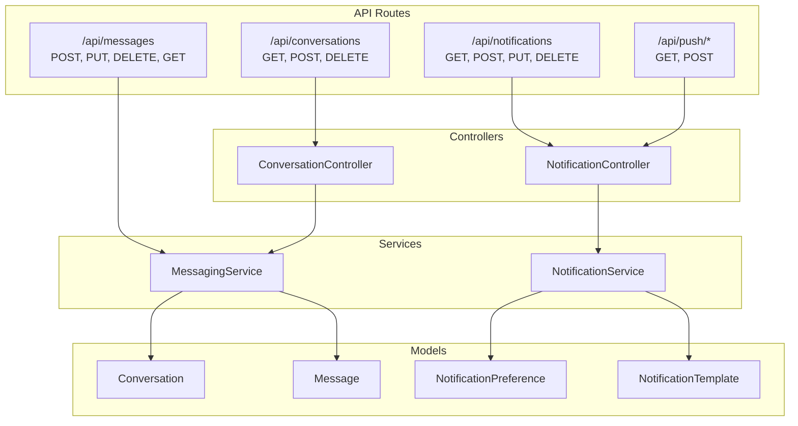
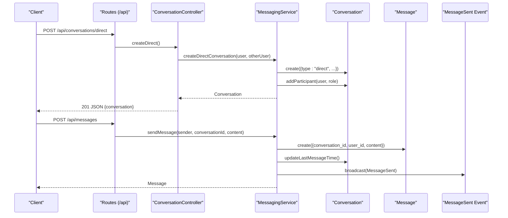
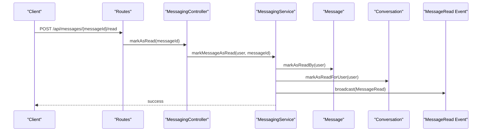
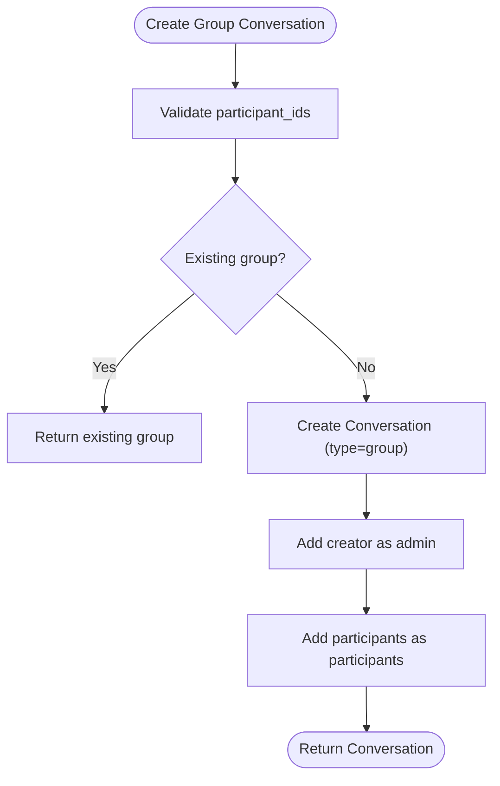
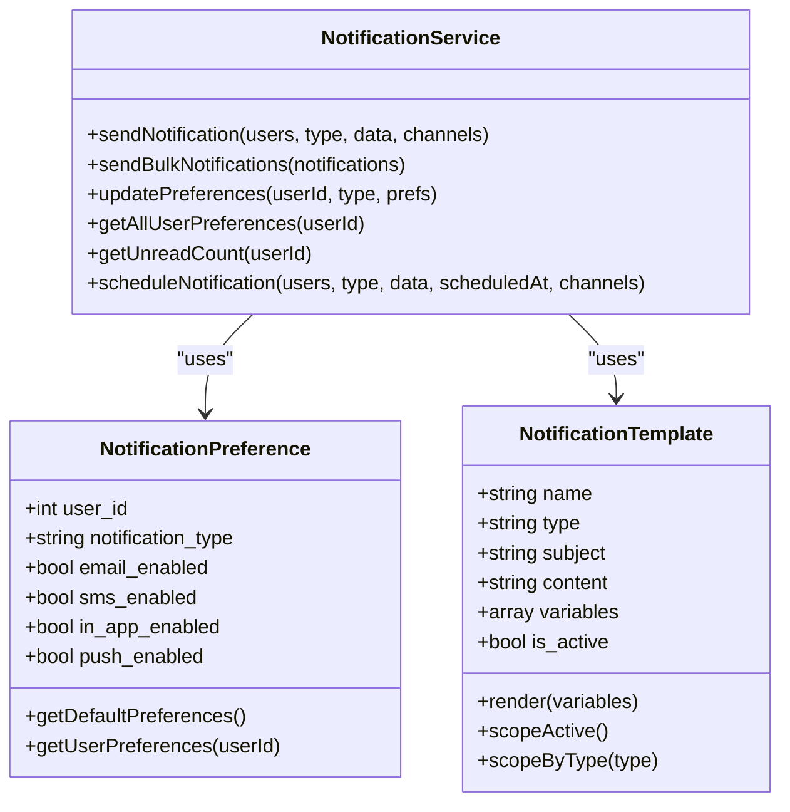
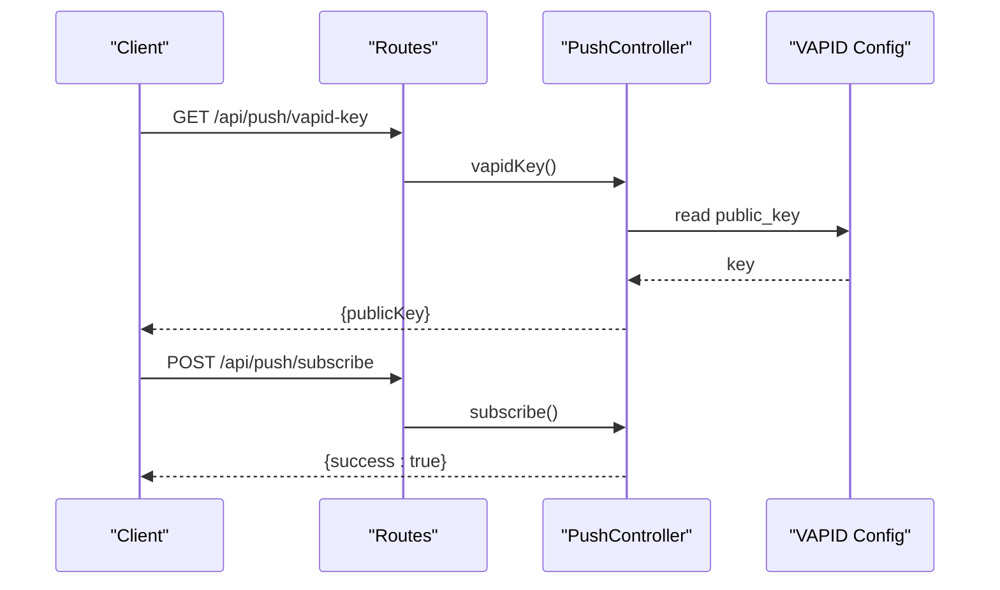
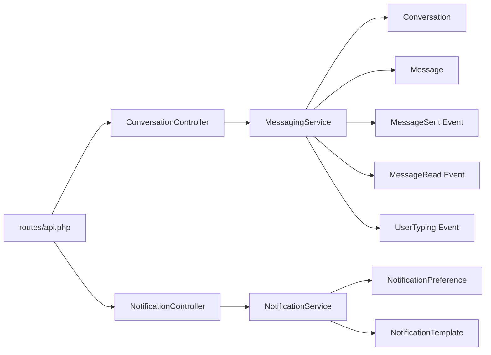

# Communications & Notifications

<cite>
**Referenced Files in This Document**
- [routes/api.php](file://routes/api.php)
- [app/Http/Controllers/Api/ConversationController.php](file://app/Http/Controllers/Api/ConversationController.php)
- [app/Http/Controllers/Api/NotificationController.php](file://app/Http/Controllers/Api/NotificationController.php)
- [app/Services/MessagingService.php](file://app/Services/MessagingService.php)
- [app/Services/NotificationService.php](file://app/Services/NotificationService.php)
- [app/Models/Conversation.php](file://app/Models/Conversation.php)
- [app/Models/Message.php](file://app/Models/Message.php)
- [app/Models/NotificationPreference.php](file://app/Models/NotificationPreference.php)
- [app/Models/NotificationTemplate.php](file://app/Models/NotificationTemplate.php)
- [app/Events/MessageSent.php](file://app/Events/MessageSent.php)
- [app/Events/MessageRead.php](file://app/Events/MessageRead.php)
- [app/Events/UserTyping.php](file://app/Events/UserTyping.php)
- [public/sw.js](file://public/sw.js)
- [public/manifest.json](file://public/manifest.json)
</cite>

## Table of Contents
1. [Introduction](#introduction)
2. [Project Structure](#project-structure)
3. [Core Components](#core-components)
4. [Architecture Overview](#architecture-overview)
5. [Detailed Component Analysis](#detailed-component-analysis)
6. [Dependency Analysis](#dependency-analysis)
7. [Performance Considerations](#performance-considerations)
8. [Troubleshooting Guide](#troubleshooting-guide)
9. [Conclusion](#conclusion)

## Introduction
This document provides comprehensive API documentation for the messaging and notification systems. It covers real-time messaging endpoints, conversation management, group chat functionality, notification preferences and channels (email, SMS, in-app, push), notification templates, PWA push notification setup and subscription management, delivery tracking, message search, typing indicators, read receipts, conversation threading, attachment handling, message editing/deletion, notification batching, priority handling, and user preference synchronization across devices.

## Project Structure
The messaging and notifications are primarily implemented through dedicated controllers, services, models, and event broadcasting. API routes are grouped under the Sanctum-protected `/api` namespace, with separate groups for push notifications and messaging.

**Diagram sources**
- [routes/api.php:757-783](file://routes/api.php#L757-L783)
- [app/Http/Controllers/Api/ConversationController.php:11-340](file://app/Http/Controllers/Api/ConversationController.php#L11-L340)
- [app/Http/Controllers/Api/NotificationController.php:20-389](file://app/Http/Controllers/Api/NotificationController.php#L20-L389)
- [app/Services/MessagingService.php:15-462](file://app/Services/MessagingService.php#L15-L462)
- [app/Services/NotificationService.php:21-386](file://app/Services/NotificationService.php#L21-L386)
- [app/Models/Conversation.php:11-223](file://app/Models/Conversation.php#L11-L223)
- [app/Models/Message.php:11-294](file://app/Models/Message.php#L11-L294)
- [app/Models/NotificationPreference.php:9-139](file://app/Models/NotificationPreference.php#L9-L139)
- [app/Models/NotificationTemplate.php:9-101](file://app/Models/NotificationTemplate.php#L9-L101)

**Section sources**
- [routes/api.php:757-783](file://routes/api.php#L757-L783)

## Core Components
- ConversationController: Manages conversation lifecycle (create, list, add/remove participants, archive, mute, pin) and exposes endpoints for retrieving conversations and messages.
- NotificationController: Manages notification sending, preferences, templates, stats, and scheduling.
- MessagingService: Implements core messaging logic including conversation creation, message sending, read receipts, typing indicators, search, editing/deleting messages, and participant management.
- NotificationService: Implements notification dispatch across channels (email, SMS, in-app, push), preference resolution, caching, and logging.
- Models: Conversation, Message, NotificationPreference, NotificationTemplate define domain entities and relationships.
- Events: MessageSent, MessageRead, UserTyping enable real-time broadcasting.

**Section sources**
- [app/Http/Controllers/Api/ConversationController.php:11-340](file://app/Http/Controllers/Api/ConversationController.php#L11-L340)
- [app/Http/Controllers/Api/NotificationController.php:20-389](file://app/Http/Controllers/Api/NotificationController.php#L20-L389)
- [app/Services/MessagingService.php:15-462](file://app/Services/MessagingService.php#L15-L462)
- [app/Services/NotificationService.php:21-386](file://app/Services/NotificationService.php#L21-L386)
- [app/Models/Conversation.php:11-223](file://app/Models/Conversation.php#L11-L223)
- [app/Models/Message.php:11-294](file://app/Models/Message.php#L11-L294)
- [app/Models/NotificationPreference.php:9-139](file://app/Models/NotificationPreference.php#L9-L139)
- [app/Models/NotificationTemplate.php:9-101](file://app/Models/NotificationTemplate.php#L9-L101)
- [app/Events/MessageSent.php](file://app/Events/MessageSent.php)
- [app/Events/MessageRead.php](file://app/Events/MessageRead.php)
- [app/Events/UserTyping.php](file://app/Events/UserTyping.php)

## Architecture Overview
The system follows a layered architecture:
- API Layer: Routes define endpoints for conversations, messages, and notifications.
- Controller Layer: Thin controllers validate inputs and delegate to services.
- Service Layer: Encapsulates business logic for messaging and notifications.
- Model Layer: Eloquent models represent domain entities and relationships.
- Event Broadcasting: Events trigger real-time updates for clients.

**Diagram sources**
- [routes/api.php:757-783](file://routes/api.php#L757-L783)
- [app/Http/Controllers/Api/ConversationController.php:92-119](file://app/Http/Controllers/Api/ConversationController.php#L92-L119)
- [app/Services/MessagingService.php:20-40](file://app/Services/MessagingService.php#L20-L40)
- [app/Services/MessagingService.php:100-127](file://app/Services/MessagingService.php#L100-L127)
- [app/Events/MessageSent.php](file://app/Events/MessageSent.php)

**Section sources**
- [routes/api.php:757-783](file://routes/api.php#L757-L783)
- [app/Services/MessagingService.php:15-462](file://app/Services/MessagingService.php#L15-L462)

## Detailed Component Analysis

### Real-Time Messaging Endpoints
- Send message
  - Endpoint: POST /api/messages
  - Body: conversation_id, content, type, attachments, reply_to_id
  - Behavior: Validates participant, creates message, updates conversation timestamps, broadcasts MessageSent
- Mark message as read
  - Endpoint: POST /api/messages/{messageId}/read
  - Behavior: Validates participant, marks read via MessageRead event
- Mark conversation as read
  - Endpoint: POST /api/conversations/{conversationId}/read
  - Behavior: Marks all unread messages as read and updates participant last_read_at
- Typing indicator
  - Endpoint: POST /api/messages/typing
  - Body: conversation_id, is_typing (boolean)
  - Behavior: Broadcasts UserTyping event
- Search messages
  - Endpoint: GET /api/messages/search?q=...&conversation_id=...
  - Behavior: Full-text search within user’s conversations
- Edit message
  - Endpoint: PUT /api/messages/{messageId}
  - Body: content
  - Behavior: Enforces ownership and time window; updates edited_at
- Delete message
  - Endpoint: DELETE /api/messages/{messageId}
  - Behavior: Soft delete; admins/moderators can delete others’ messages

**Diagram sources**
- [routes/api.php:774-782](file://routes/api.php#L774-L782)
- [app/Services/MessagingService.php:132-153](file://app/Services/MessagingService.php#L132-L153)
- [app/Events/MessageRead.php](file://app/Events/MessageRead.php)

**Section sources**
- [routes/api.php:774-782](file://routes/api.php#L774-L782)
- [app/Services/MessagingService.php:100-127](file://app/Services/MessagingService.php#L100-L127)
- [app/Services/MessagingService.php:132-153](file://app/Services/MessagingService.php#L132-L153)
- [app/Services/MessagingService.php:234-249](file://app/Services/MessagingService.php#L234-L249)
- [app/Services/MessagingService.php:443-460](file://app/Services/MessagingService.php#L443-L460)

### Conversation Management
- List conversations
  - Endpoint: GET /api/conversations
  - Query: per_page
  - Returns paginated conversations with participants and latest message
- Get conversation messages
  - Endpoint: GET /api/conversations/{conversationId}
  - Query: per_page
  - Returns paginated messages with user, replies, and read receipts
- Create direct conversation
  - Endpoint: POST /api/conversations/direct
  - Body: user_id
  - Ensures existing conversation reuse or creates new
- Create group conversation
  - Endpoint: POST /api/conversations/group
  - Body: participant_ids[], title, description
- Create circle conversation
  - Endpoint: POST /api/conversations/circle
  - Body: circle_id, title
- Manage participants
  - Add: POST /api/conversations/{conversationId}/participants (user_id, role)
  - Remove: DELETE /api/conversations/{conversationId}/participants/{userId}
  - Leave: POST /api/conversations/{conversationId}/leave
- Conversation settings
  - Archive: POST /api/conversations/{conversationId}/archive
  - Mute: POST /api/conversations/{conversationId}/mute
  - Pin: POST /api/conversations/{conversationId}/pin

**Diagram sources**
- [app/Http/Controllers/Api/ConversationController.php:124-158](file://app/Http/Controllers/Api/ConversationController.php#L124-L158)
- [app/Services/MessagingService.php:45-70](file://app/Services/MessagingService.php#L45-L70)

**Section sources**
- [app/Http/Controllers/Api/ConversationController.php:23-87](file://app/Http/Controllers/Api/ConversationController.php#L23-L87)
- [app/Http/Controllers/Api/ConversationController.php:124-194](file://app/Http/Controllers/Api/ConversationController.php#L124-L194)
- [app/Services/MessagingService.php:45-70](file://app/Services/MessagingService.php#L45-L70)

### Notification Preferences, Channels, and Templates
- Send notification
  - Endpoint: POST /api/notifications
  - Body: users[], type, data, channels[]
  - Behavior: Sends to resolved channels based on preferences
- Send bulk notifications
  - Endpoint: POST /api/notifications/bulk
  - Body: notifications[*].user, .type, .data, .channels
- Get user notifications
  - Endpoint: GET /api/notifications
  - Query: per_page, page, read, type
- Mark notification as read
  - Endpoint: POST /api/notifications/{notification}/read
- Mark all as read
  - Endpoint: POST /api/notifications/mark-all-read
- Get preferences
  - Endpoint: GET /api/notifications/preferences
- Update preferences
  - Endpoint: PUT /api/notifications/preferences
  - Body: type, email_enabled, sms_enabled, in_app_enabled, push_enabled
- Get templates
  - Endpoint: GET /api/notifications/templates
  - Query: type, active_only
- Get stats
  - Endpoint: GET /api/notifications/stats
- Schedule notification
  - Endpoint: POST /api/notifications/schedule
  - Body: users[], type, data, channels[], scheduled_at

**Diagram sources**
- [app/Models/NotificationPreference.php:9-139](file://app/Models/NotificationPreference.php#L9-L139)
- [app/Models/NotificationTemplate.php:9-101](file://app/Models/NotificationTemplate.php#L9-L101)
- [app/Services/NotificationService.php:21-386](file://app/Services/NotificationService.php#L21-L386)

**Section sources**
- [app/Http/Controllers/Api/NotificationController.php:32-107](file://app/Http/Controllers/Api/NotificationController.php#L32-L107)
- [app/Http/Controllers/Api/NotificationController.php:115-160](file://app/Http/Controllers/Api/NotificationController.php#L115-L160)
- [app/Http/Controllers/Api/NotificationController.php:168-196](file://app/Http/Controllers/Api/NotificationController.php#L168-L196)
- [app/Http/Controllers/Api/NotificationController.php:219-255](file://app/Http/Controllers/Api/NotificationController.php#L219-L255)
- [app/Http/Controllers/Api/NotificationController.php:263-292](file://app/Http/Controllers/Api/NotificationController.php#L263-L292)
- [app/Http/Controllers/Api/NotificationController.php:299-318](file://app/Http/Controllers/Api/NotificationController.php#L299-L318)
- [app/Http/Controllers/Api/NotificationController.php:350-387](file://app/Http/Controllers/Api/NotificationController.php#L350-L387)
- [app/Services/NotificationService.php:34-94](file://app/Services/NotificationService.php#L34-L94)
- [app/Services/NotificationService.php:312-330](file://app/Services/NotificationService.php#L312-L330)
- [app/Services/NotificationService.php:349-353](file://app/Services/NotificationService.php#L349-L353)

### PWA Push Notification Setup and Subscription Management
- VAPID public key
  - Endpoint: GET /api/push/vapid-key
  - Returns: publicKey
- Subscribe
  - Endpoint: POST /api/push/subscribe
  - Behavior: Placeholder for saving subscription
- Unsubscribe
  - Endpoint: POST /api/push/unsubscribe
  - Behavior: Placeholder for removing subscription

**Diagram sources**
- [routes/api.php:68-87](file://routes/api.php#L68-L87)

**Section sources**
- [routes/api.php:68-87](file://routes/api.php#L68-L87)

### Delivery Tracking and Logging
- NotificationService logs attempts to NotificationLog with channel, status, and error_message.
- Preference and template retrieval are cached with TTL to reduce database load.

**Section sources**
- [app/Services/NotificationService.php:269-279](file://app/Services/NotificationService.php#L269-L279)
- [app/Services/NotificationService.php:201-218](file://app/Services/NotificationService.php#L201-L218)
- [app/Services/NotificationService.php:254-264](file://app/Services/NotificationService.php#L254-L264)

### Message Search, Typing Indicators, and Read Receipts
- Search: GET /api/messages/search supports optional conversation_id and pagination.
- Typing: POST /api/messages/typing broadcasts UserTyping.
- Read receipts: MessageRead event is broadcast when a message is marked as read.

**Section sources**
- [app/Services/MessagingService.php:189-200](file://app/Services/MessagingService.php#L189-L200)
- [app/Services/MessagingService.php:132-153](file://app/Services/MessagingService.php#L132-L153)
- [app/Events/UserTyping.php](file://app/Events/UserTyping.php)
- [app/Events/MessageRead.php](file://app/Events/MessageRead.php)

### Conversation Threading, Attachments, Editing, and Deletion
- Threading: Messages support reply_to_id for hierarchical replies; top-level vs replies scopes.
- Attachments: Message.attachments is an array; helpers check presence and count.
- Editing: PUT /api/messages/{messageId} enforces ownership and time window.
- Deletion: DELETE /api/messages/{messageId} soft deletes; admins/mods can delete others’ messages.

**Section sources**
- [app/Models/Message.php:66-77](file://app/Models/Message.php#L66-L77)
- [app/Models/Message.php:147-158](file://app/Models/Message.php#L147-L158)
- [app/Services/MessagingService.php:443-460](file://app/Services/MessagingService.php#L443-L460)
- [app/Services/MessagingService.php:422-438](file://app/Services/MessagingService.php#L422-L438)

### Notification Batching, Priority Handling, and Preference Synchronization
- Batching: POST /api/notifications/bulk sends multiple notifications in one call.
- Priority: Channel selection respects user preferences; channels array overrides preferences when provided.
- Synchronization: Preferences are cached per user/type; clearing cache invalidates cached entries.

**Section sources**
- [app/Http/Controllers/Api/NotificationController.php:76-107](file://app/Http/Controllers/Api/NotificationController.php#L76-L107)
- [app/Services/NotificationService.php:71-94](file://app/Services/NotificationService.php#L71-L94)
- [app/Services/NotificationService.php:374-384](file://app/Services/NotificationService.php#L374-L384)

## Dependency Analysis

**Diagram sources**
- [routes/api.php:757-783](file://routes/api.php#L757-L783)
- [app/Http/Controllers/Api/ConversationController.php:11-340](file://app/Http/Controllers/Api/ConversationController.php#L11-L340)
- [app/Http/Controllers/Api/NotificationController.php:20-389](file://app/Http/Controllers/Api/NotificationController.php#L20-L389)
- [app/Services/MessagingService.php:15-462](file://app/Services/MessagingService.php#L15-L462)
- [app/Services/NotificationService.php:21-386](file://app/Services/NotificationService.php#L21-L386)
- [app/Models/Conversation.php:11-223](file://app/Models/Conversation.php#L11-L223)
- [app/Models/Message.php:11-294](file://app/Models/Message.php#L11-L294)
- [app/Models/NotificationPreference.php:9-139](file://app/Models/NotificationPreference.php#L9-L139)
- [app/Models/NotificationTemplate.php:9-101](file://app/Models/NotificationTemplate.php#L9-L101)
- [app/Events/MessageSent.php](file://app/Events/MessageSent.php)
- [app/Events/MessageRead.php](file://app/Events/MessageRead.php)
- [app/Events/UserTyping.php](file://app/Events/UserTyping.php)

**Section sources**
- [routes/api.php:757-783](file://routes/api.php#L757-L783)
- [app/Services/MessagingService.php:15-462](file://app/Services/MessagingService.php#L15-L462)
- [app/Services/NotificationService.php:21-386](file://app/Services/NotificationService.php#L21-L386)

## Performance Considerations
- Pagination: All list endpoints accept per_page/page parameters to limit payload sizes.
- Caching: Notification preferences and templates are cached with TTL to reduce DB queries.
- Batch operations: Bulk notification endpoints minimize round-trips.
- Indexing: Ensure database indexes on frequently queried fields (user_id, conversation_id, created_at, tenant_id) for optimal query performance.

## Troubleshooting Guide
- Authentication failures: Ensure requests are made with Sanctum-protected auth header.
- Validation errors: Check request bodies against documented schemas; server returns structured validation errors.
- Permission denied: Some operations require conversation participation or admin/moderator roles.
- Channel delivery failures: NotificationService logs failures with error messages; inspect logs for details.

**Section sources**
- [app/Http/Controllers/Api/ConversationController.php:40-51](file://app/Http/Controllers/Api/ConversationController.php#L40-L51)
- [app/Http/Controllers/Api/NotificationController.php:43-48](file://app/Http/Controllers/Api/NotificationController.php#L43-L48)
- [app/Services/MessagingService.php:104-107](file://app/Services/MessagingService.php#L104-L107)
- [app/Services/NotificationService.php:113-122](file://app/Services/NotificationService.php#L113-L122)

## Conclusion
The messaging and notification systems provide a robust, extensible foundation for real-time communication and multi-channel notifications. The architecture cleanly separates concerns across controllers, services, and models, while leveraging events for real-time updates. The APIs support advanced features such as conversation threading, group chats, typing indicators, read receipts, and comprehensive notification preferences and templates, with room for further enhancements like persistent push subscriptions and advanced scheduling.