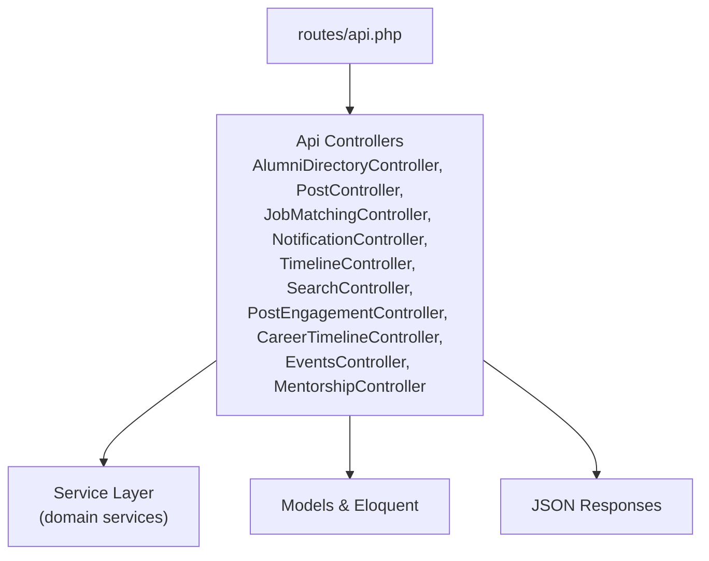
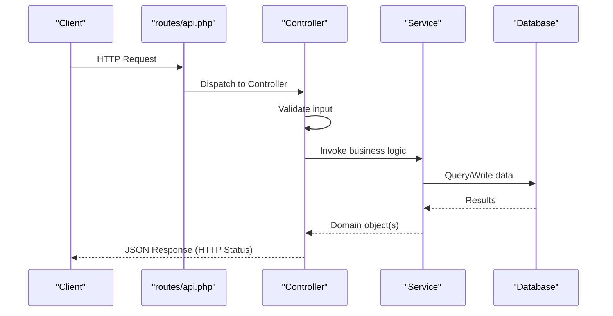
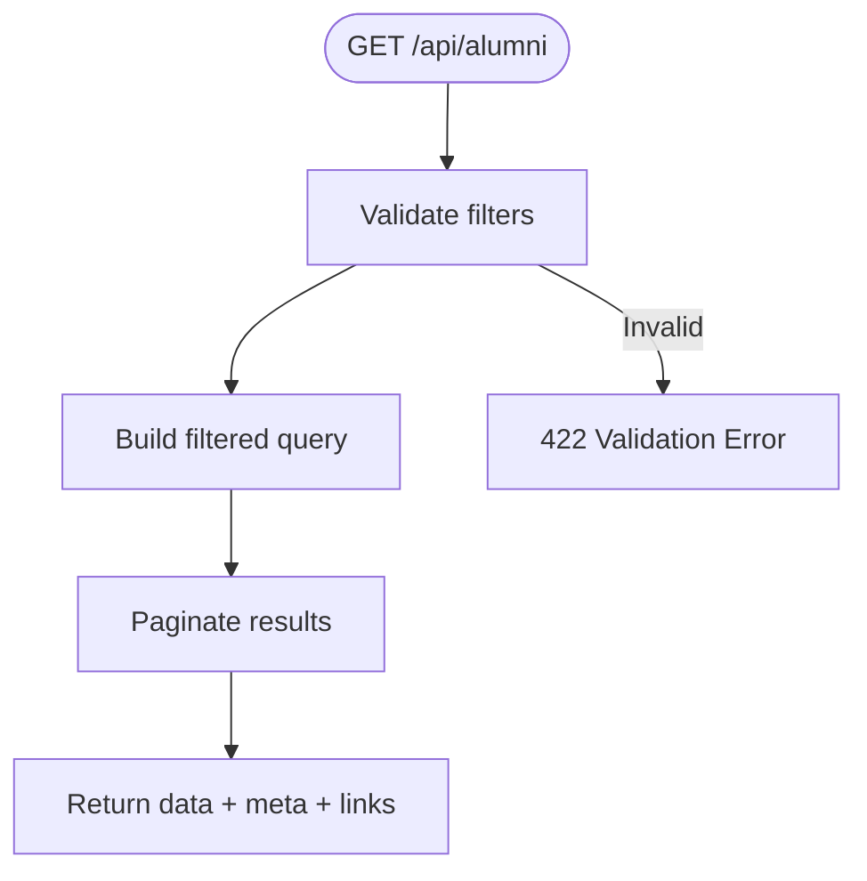
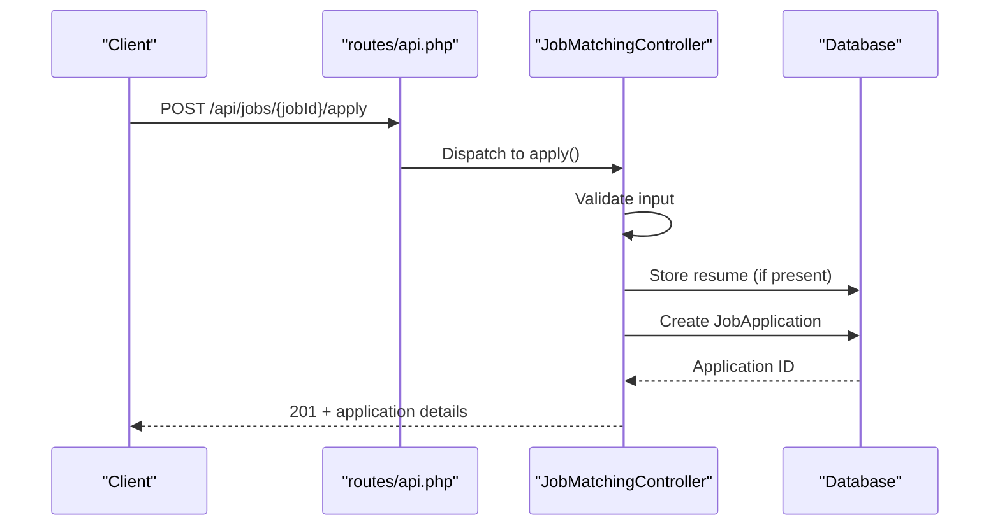
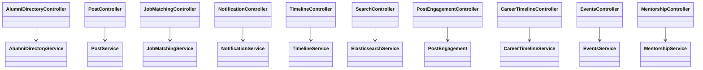

# Core API Endpoints

<cite>
**Referenced Files in This Document**
- [routes/api.php](file://routes/api.php)
- [AlumniDirectoryController.php](file://app/Http/Controllers/Api/AlumniDirectoryController.php)
- [PostController.php](file://app/Http/controllers/Api/PostController.php)
- [JobMatchingController.php](file://app/Http/Controllers/Api/JobMatchingController.php)
- [NotificationController.php](file://app/Http/Controllers/Api/NotificationController.php)
- [TimelineController.php](file://app/Http/Controllers/Api/TimelineController.php)
- [SearchController.php](file://app/Http/Controllers/Api/SearchController.php)
- [PostEngagementController.php](file://app/Http/Controllers/Api/PostEngagementController.php)
- [CareerTimelineController.php](file://app/Http/Controllers/Api/CareerTimelineController.php)
- [EventsController.php](file://app/Http/Controllers/Api/EventsController.php)
- [MentorshipController.php](file://app/Http/Controllers/Api/MentorshipController.php)
- [Controller.php](file://app/Http/Controllers/Controller.php)
</cite>

## Table of Contents
1. [Introduction](#introduction)
2. [Project Structure](#project-structure)
3. [Core Components](#core-components)
4. [Architecture Overview](#architecture-overview)
5. [Detailed Component Analysis](#detailed-component-analysis)
6. [Dependency Analysis](#dependency-analysis)
7. [Performance Considerations](#performance-considerations)
8. [Troubleshooting Guide](#troubleshooting-guide)
9. [Conclusion](#conclusion)

## Introduction
This document describes Alumate’s core API endpoints grouped by functional domains. It covers RESTful endpoint specifications, request/response schemas, status codes, parameter validation, error handling, and response formatting. It also explains pagination, filtering, sorting, rate limiting, and integration patterns. The API follows Laravel conventions and uses middleware for authentication and rate limiting.

## Project Structure
The API is primarily defined in the routes file and implemented via controller classes under the Api namespace. Controllers delegate to service classes for domain logic and return JSON responses. Authentication is enforced via Sanctum middleware on most endpoints.

**Diagram sources**
- [routes/api.php:1-800](file://routes/api.php#L1-L800)
- [AlumniDirectoryController.php:1-292](file://app/Http/Controllers/Api/AlumniDirectoryController.php#L1-L292)
- [PostController.php:1-287](file://app/Http/Controllers/Api/PostController.php#L1-L287)
- [JobMatchingController.php:1-415](file://app/Http/Controllers/Api/JobMatchingController.php#L1-L415)
- [NotificationController.php:1-389](file://app/Http/Controllers/Api/NotificationController.php#L1-L389)
- [TimelineController.php:1-236](file://app/Http/Controllers/Api/TimelineController.php#L1-L236)
- [SearchController.php:1-478](file://app/Http/Controllers/Api/SearchController.php#L1-L478)
- [PostEngagementController.php:1-325](file://app/Http/Controllers/Api/PostEngagementController.php#L1-L325)
- [CareerTimelineController.php:1-232](file://app/Http/Controllers/Api/CareerTimelineController.php#L1-L232)
- [EventsController.php:1-385](file://app/Http/Controllers/Api/EventsController.php#L1-L385)
- [MentorshipController.php:1-338](file://app/Http/Controllers/Api/MentorshipController.php#L1-L338)

**Section sources**
- [routes/api.php:1-800](file://routes/api.php#L1-L800)

## Core Components
- Authentication and Authorization: Most endpoints require Sanctum authentication. Controllers use a base Controller that delegates authorization checks.
- Rate Limiting: Endpoints are grouped by rate limit keys (e.g., api, upload, search, webhook, social.rate_limit).
- Pagination: Many endpoints support per_page/page or cursor-based pagination.
- Validation: Requests are validated using Laravel validators; invalid inputs return structured errors.
- Error Handling: Controllers return standardized JSON with success flags and messages; HTTP status codes reflect outcomes.

**Section sources**
- [Controller.php:1-14](file://app/Http/Controllers/Controller.php#L1-L14)
- [routes/api.php:90-100](file://routes/api.php#L90-L100)
- [routes/api.php:171-180](file://routes/api.php#L171-L180)
- [routes/api.php:620-630](file://routes/api.php#L620-L630)
- [routes/api.php:30-34](file://routes/api.php#L30-L34)

## Architecture Overview
The API follows a layered architecture:
- Routes define endpoint URLs and middleware.
- Controllers handle HTTP concerns, validation, and orchestration.
- Services encapsulate business logic.
- Models and Eloquent manage persistence.
- Responses are JSON-formatted with consistent structure.

**Diagram sources**
- [routes/api.php:1-800](file://routes/api.php#L1-L800)
- [AlumniDirectoryController.php:25-74](file://app/Http/Controllers/Api/AlumniDirectoryController.php#L25-L74)
- [PostController.php:23-67](file://app/Http/Controllers/Api/PostController.php#L23-L67)
- [JobMatchingController.php:26-96](file://app/Http/Controllers/Api/JobMatchingController.php#L26-L96)
- [NotificationController.php:115-160](file://app/Http/Controllers/Api/NotificationController.php#L115-L160)
- [TimelineController.php:21-55](file://app/Http/Controllers/Api/TimelineController.php#L21-L55)
- [SearchController.php:27-96](file://app/Http/Controllers/Api/SearchController.php#L27-L96)
- [PostEngagementController.php:19-68](file://app/Http/Controllers/Api/PostEngagementController.php#L19-L68)
- [CareerTimelineController.php:23-34](file://app/Http/Controllers/Api/CareerTimelineController.php#L23-L34)
- [EventsController.php:18-41](file://app/Http/Controllers/Api/EventsController.php#L18-L41)
- [MentorshipController.php:20-56](file://app/Http/Controllers/Api/MentorshipController.php#L20-L56)

## Detailed Component Analysis

### User Management
- Endpoint: GET /api/user
  - Method: GET
  - Auth: Required (Sanctum)
  - Response: Returns the authenticated user object
  - Status Codes: 200, 401
  - Notes: Lightweight endpoint for client-side user hydration

- Endpoint: GET /api/homepage-navigation
  - Method: GET
  - Auth: Not required
  - Response: Array of navigation items
  - Status Codes: 200

- Endpoint: GET /api/ping
  - Method: GET
  - Auth: Not required
  - Response: Health check payload with timestamp
  - Status Codes: 200

- Endpoint: GET /api/user/achievements
  - Method: GET
  - Auth: Required (Sanctum)
  - Query Params: None
  - Response: Paginated list of user achievements
  - Status Codes: 200, 401

- Endpoint: GET /api/users/{userId}/achievements
  - Method: GET
  - Auth: Required (Sanctum)
  - Path Params: userId
  - Response: Paginated list of achievements for a user
  - Status Codes: 200, 401, 404

- Endpoint: GET /api/users/{userId}/career
  - Method: GET
  - Auth: Required (Sanctum)
  - Path Params: userId
  - Response: Career timeline for the user
  - Status Codes: 200, 403, 404

- Endpoint: GET /api/student/profile
  - Method: GET
  - Auth: Required (Sanctum)
  - Response: Student profile details
  - Status Codes: 200, 404

- Endpoint: POST /api/student/profile
  - Method: POST
  - Auth: Required (Sanctum)
  - Body: Student profile fields
  - Response: Created profile
  - Status Codes: 201, 422, 500

- Endpoint: PUT /api/student/profile
  - Method: PUT
  - Auth: Required (Sanctum)
  - Body: Student profile fields
  - Response: Updated profile
  - Status Codes: 200, 422, 500

- Endpoint: GET /api/student/profile/completion
  - Method: GET
  - Auth: Required (Sanctum)
  - Response: Completion metrics
  - Status Codes: 200

- Endpoint: GET /api/student/profile/statistics
  - Method: GET
  - Auth: Required (Sanctum)
  - Response: Statistics for student profile
  - Status Codes: 200

- Endpoint: GET /api/student/courses
  - Method: GET
  - Auth: Required (Sanctum)
  - Response: Courses enrolled
  - Status Codes: 200

- Endpoint: GET /api/users/{userId}/skills
  - Method: GET
  - Auth: Required (Sanctum)
  - Path Params: userId
  - Response: User skills
  - Status Codes: 200, 403, 404

- Endpoint: POST /api/users/skills
  - Method: POST
  - Auth: Required (Sanctum)
  - Body: Skill fields
  - Response: Created skill
  - Status Codes: 201, 422, 500

- Endpoint: POST /api/skills/endorse
  - Method: POST
  - Auth: Required (Sanctum)
  - Body: Endorsement fields
  - Response: Acknowledgement
  - Status Codes: 200, 422, 500

- Endpoint: GET /api/skills/search
  - Method: GET
  - Auth: Required (Sanctum)
  - Query Params: q (term)
  - Response: Matching skills
  - Status Codes: 200, 422

- Endpoint: GET /api/skills/suggestions
  - Method: GET
  - Auth: Required (Sanctum)
  - Response: Suggested skills
  - Status Codes: 200

- Endpoint: GET /api/skills/{skillId}/progression
  - Method: GET
  - Auth: Required (Sanctum)
  - Path Params: skillId
  - Response: Skill progression insights
  - Status Codes: 200, 404

- Endpoint: GET /api/skills/{skillId}/recommendations
  - Method: GET
  - Auth: Required (Sanctum)
  - Path Params: skillId
  - Response: Learning recommendations
  - Status Codes: 200, 404

- Endpoint: GET /api/skills/gap-analysis
  - Method: GET
  - Auth: Required (Sanctum)
  - Response: Skills gap analysis
  - Status Codes: 200

- Endpoint: GET /api/learning-resources
  - Method: GET
  - Auth: Required (Sanctum)
  - Response: Learning resources
  - Status Codes: 200

- Endpoint: POST /api/learning-resources
  - Method: POST
  - Auth: Required (Sanctum)
  - Body: Resource fields
  - Response: Created resource
  - Status Codes: 201, 422, 500

- Endpoint: POST /api/learning-resources/{resource}/rate
  - Method: POST
  - Auth: Required (Sanctum)
  - Path Params: resource
  - Body: Rating fields
  - Response: Acknowledgement
  - Status Codes: 200, 422, 500

**Section sources**
- [routes/api.php:26-28](file://routes/api.php#L26-L28)
- [routes/api.php:66](file://routes/api.php#L66)
- [routes/api.php:36-42](file://routes/api.php#L36-L42)
- [routes/api.php:44-50](file://routes/api.php#L44-L50)
- [routes/api.php:459-467](file://routes/api.php#L459-L467)
- [routes/api.php:234-251](file://routes/api.php#L234-L251)

### Alumni Directory
- Endpoint: GET /api/alumni
  - Method: GET
  - Auth: Required (Sanctum)
  - Query Params:
    - search (string)
    - graduation_year_from (integer)
    - graduation_year_to (integer)
    - location (string)
    - industries[] (array)
    - company (string)
    - skills[] (array)
    - current_role (string)
    - institutions[] (array)
    - circles[] (array)
    - groups[] (array)
    - sort_by (enum: name, graduation_year, location, created_at)
    - sort_order (enum: asc, desc)
    - per_page (integer 1–100)
    - page (integer ≥ 1)
  - Response: Paginated list with meta and links
  - Status Codes: 200, 422

- Endpoint: GET /api/alumni/filters
  - Method: GET
  - Auth: Required (Sanctum)
  - Response: Available filter options
  - Status Codes: 200

- Endpoint: GET /api/alumni/search
  - Method: GET
  - Auth: Required (Sanctum)
  - Query Params:
    - query (required, string 2–255)
    - type (enum: name, company, location, skill)
    - limit (integer 1–20)
  - Response: Suggestions
  - Status Codes: 200, 422

- Endpoint: GET /api/alumni/{userId}
  - Method: GET
  - Auth: Required (Sanctum)
  - Path Params: userId
  - Response: Profile details
  - Status Codes: 200, 404

- Endpoint: POST /api/alumni/{userId}/connect
  - Method: POST
  - Auth: Required (Sanctum)
  - Path Params: userId
  - Body: message (string ≤ 500)
  - Response: Connection request
  - Status Codes: 201, 400, 404

**Diagram sources**
- [AlumniDirectoryController.php:25-74](file://app/Http/Controllers/Api/AlumniDirectoryController.php#L25-L74)

**Section sources**
- [routes/api.php:143-149](file://routes/api.php#L143-L149)
- [AlumniDirectoryController.php:25-74](file://app/Http/Controllers/Api/AlumniDirectoryController.php#L25-L74)
- [AlumniDirectoryController.php:110-127](file://app/Http/Controllers/Api/AlumniDirectoryController.php#L110-L127)
- [AlumniDirectoryController.php:132-184](file://app/Http/Controllers/Api/AlumniDirectoryController.php#L132-L184)

### Job Matching
- Endpoint: GET /api/jobs/recommendations
  - Method: GET
  - Auth: Required (Sanctum)
  - Query Params:
    - per_page (integer)
    - min_score (integer)
    - location (string)
    - remote_only (boolean)
  - Response: Paginated recommendations with match scores
  - Status Codes: 200

- Endpoint: GET /api/jobs/{jobId}
  - Method: GET
  - Auth: Required (Sanctum)
  - Path Params: jobId
  - Response: Detailed job with match analysis and mutual connections
  - Status Codes: 200, 404

- Endpoint: GET /api/jobs/{jobId}/connections
  - Method: GET
  - Auth: Required (Sanctum)
  - Path Params: jobId
  - Response: Mutual connections
  - Status Codes: 200

- Endpoint: POST /api/jobs/{jobId}/apply
  - Method: POST
  - Auth: Required (Sanctum)
  - Path Params: jobId
  - Body:
    - cover_letter (required, string ≤ 2000)
    - resume (file: pdf, doc, docx ≤ 5MB)
    - introduction_contact_id (optional, exists:users)
  - Response: Application details
  - Status Codes: 201, 400, 422, 500

- Endpoint: GET /api/applications
  - Method: GET
  - Auth: Required (Sanctum)
  - Query Params:
    - status (optional)
    - per_page (integer)
  - Response: Paginated applications
  - Status Codes: 200

- Endpoint: POST /api/jobs/{jobId}/request-introduction
  - Method: POST
  - Auth: Required (Sanctum)
  - Path Params: jobId
  - Body:
    - contact_id (required, exists:users)
    - message (required, string ≤ 500)
  - Response: Acknowledgement
  - Status Codes: 200, 400, 422

**Diagram sources**
- [routes/api.php:218-232](file://routes/api.php#L218-L232)
- [JobMatchingController.php:190-278](file://app/Http/Controllers/Api/JobMatchingController.php#L190-L278)

**Section sources**
- [routes/api.php:218-232](file://routes/api.php#L218-L232)
- [JobMatchingController.php:26-96](file://app/Http/Controllers/Api/JobMatchingController.php#L26-L96)
- [JobMatchingController.php:101-184](file://app/Http/Controllers/Api/JobMatchingController.php#L101-L184)
- [JobMatchingController.php:189-278](file://app/Http/Controllers/Api/JobMatchingController.php#L189-L278)
- [JobMatchingController.php:338-413](file://app/Http/Controllers/Api/JobMatchingController.php#L338-L413)

### Notifications
- Endpoint: GET /api/notifications
  - Method: GET
  - Auth: Required (Sanctum)
  - Query Params:
    - per_page (integer 1–100)
    - page (integer ≥ 1)
    - read (boolean)
    - type (string)
  - Response: Paginated notifications + unread_count
  - Status Codes: 200, 422

- Endpoint: POST /api/notifications/{notification}/read
  - Method: POST
  - Auth: Required (Sanctum)
  - Path Params: notification
  - Response: Acknowledgement
  - Status Codes: 200, 404

- Endpoint: POST /api/notifications/mark-all-read
  - Method: POST
  - Auth: Required (Sanctum)
  - Response: Acknowledgement
  - Status Codes: 200

- Endpoint: GET /api/notifications/unread-count
  - Method: GET
  - Auth: Required (Sanctum)
  - Response: Unread count
  - Status Codes: 200

- Endpoint: GET /api/notifications/preferences
  - Method: GET
  - Auth: Required (Sanctum)
  - Response: Preferences
  - Status Codes: 200

- Endpoint: PUT /api/notifications/preferences
  - Method: PUT
  - Auth: Required (Sanctum)
  - Body: type + channel booleans
  - Response: Preference
  - Status Codes: 200, 422, 500

- Endpoint: GET /api/notifications/stats
  - Method: GET
  - Auth: Required (Sanctum)
  - Response: Stats (totals, today, week)
  - Status Codes: 200

- Endpoint: DELETE /api/notifications/{notification}
  - Method: DELETE
  - Auth: Required (Sanctum)
  - Path Params: notification
  - Response: Acknowledgement
  - Status Codes: 200, 404

- Endpoint: POST /api/notifications/test
  - Method: POST
  - Auth: Required (Sanctum)
  - Response: Acknowledgement
  - Status Codes: 200

**Section sources**
- [routes/api.php:129-140](file://routes/api.php#L129-L140)
- [NotificationController.php:115-160](file://app/Http/Controllers/Api/NotificationController.php#L115-L160)
- [NotificationController.php:168-181](file://app/Http/Controllers/Api/NotificationController.php#L168-L181)
- [NotificationController.php:188-196](file://app/Http/Controllers/Api/NotificationController.php#L188-L196)
- [NotificationController.php:203-211](file://app/Http/Controllers/Api/NotificationController.php#L203-L211)
- [NotificationController.php:219-255](file://app/Http/Controllers/Api/NotificationController.php#L219-L255)
- [NotificationController.php:299-318](file://app/Http/Controllers/Api/NotificationController.php#L299-L318)
- [NotificationController.php:326-342](file://app/Http/Controllers/Api/NotificationController.php#L326-L342)
- [NotificationController.php:344-387](file://app/Http/Controllers/Api/NotificationController.php#L344-L387)

### Posts
- Endpoint: POST /api/posts
  - Method: POST
  - Auth: Required (Sanctum)
  - Body: Post fields + optional media_files[]
  - Response: Created post
  - Status Codes: 201, 422, 500

- Endpoint: GET /api/posts/{post}
  - Method: GET
  - Auth: Required (Sanctum)
  - Path Params: post
  - Response: Post with user and engagements
  - Status Codes: 200, 403, 500

- Endpoint: PUT /api/posts/{post}
  - Method: PUT
  - Auth: Required (Sanctum)
  - Path Params: post
  - Body: Post fields + optional media_files[]
  - Response: Updated post
  - Status Codes: 200, 403, 422, 500

- Endpoint: DELETE /api/posts/{post}
  - Method: DELETE
  - Auth: Required (Sanctum)
  - Path Params: post
  - Response: Acknowledgement
  - Status Codes: 200, 403, 500

- Endpoint: POST /api/posts/media
  - Method: POST
  - Auth: Required (Sanctum)
  - Body: files[] (≤10, each ≤100MB)
  - Response: Uploaded media
  - Status Codes: 200, 422, 500

- Endpoint: POST /api/posts/drafts
  - Method: POST
  - Auth: Required (Sanctum)
  - Body: Draft fields
  - Response: Draft
  - Status Codes: 200, 500

- Endpoint: GET /api/posts/drafts
  - Method: GET
  - Auth: Required (Sanctum)
  - Response: Drafts
  - Status Codes: 200, 500

- Endpoint: GET /api/posts/scheduled
  - Method: GET
  - Auth: Required (Sanctum)
  - Response: Scheduled posts
  - Status Codes: 200, 500

**Section sources**
- [routes/api.php:89-95](file://routes/api.php#L89-L95)
- [PostController.php:23-67](file://app/Http/Controllers/Api/PostController.php#L23-L67)
- [PostController.php:69-95](file://app/Http/Controllers/Api/PostController.php#L69-L95)
- [PostController.php:97-161](file://app/Http/Controllers/Api/PostController.php#L97-L161)
- [PostController.php:163-194](file://app/Http/Controllers/Api/PostController.php#L163-L194)
- [PostController.php:196-234](file://app/Http/Controllers/Api/PostController.php#L196-L234)
- [PostController.php:236-256](file://app/Http/Controllers/Api/PostController.php#L236-L256)

### Timeline
- Endpoint: GET /api/timeline
  - Method: GET
  - Auth: Required (Sanctum)
  - Query Params:
    - limit (integer 1–50)
    - cursor (string)
  - Response: Timeline items
  - Status Codes: 200, 422, 500

- Endpoint: GET /api/timeline/refresh
  - Method: GET
  - Auth: Required (Sanctum)
  - Query Params:
    - limit (integer 1–50)
  - Response: Fresh timeline
  - Status Codes: 200, 422, 500

- Endpoint: GET /api/timeline/load-more
  - Method: GET
  - Auth: Required (Sanctum)
  - Query Params:
    - cursor (required)
    - limit (integer 1–50)
  - Response: More items
  - Status Codes: 200, 422, 500

- Endpoint: GET /api/timeline/circles
  - Method: GET
  - Auth: Required (Sanctum)
  - Query Params:
    - limit (integer 1–50)
    - cursor (string)
  - Response: Circle posts with next_cursor and has_more
  - Status Codes: 200, 422, 500

- Endpoint: GET /api/timeline/groups
  - Method: GET
  - Auth: Required (Sanctum)
  - Query Params:
    - limit (integer 1–50)
    - cursor (string)
  - Response: Group posts with next_cursor and has_more
  - Status Codes: 200, 422, 500

**Section sources**
- [routes/api.php:103-109](file://routes/api.php#L103-L109)
- [TimelineController.php:21-55](file://app/Http/Controllers/Api/TimelineController.php#L21-L55)
- [TimelineController.php:60-95](file://app/Http/Controllers/Api/TimelineController.php#L60-L95)
- [TimelineController.php:101-134](file://app/Http/Controllers/Api/TimelineController.php#L101-L134)
- [TimelineController.php:140-179](file://app/Http/Controllers/Api/TimelineController.php#L140-L179)
- [TimelineController.php:184-222](file://app/Http/Controllers/Api/TimelineController.php#L184-L222)

### Engagement Features
- Endpoint: POST /api/posts/{post}/like
  - Method: POST
  - Auth: Required (Sanctum)
  - Path Params: post
  - Response: Action result
  - Status Codes: 200, 500

- Endpoint: POST /api/posts/{post}/comment
  - Method: POST
  - Auth: Required (Sanctum)
  - Path Params: post
  - Body: content (required, ≤1000), parent_id (optional)
  - Response: Comment
  - Status Codes: 200, 422, 500

- Endpoint: POST /api/posts/{post}/share
  - Method: POST
  - Auth: Required (Sanctum)
  - Path Params: post
  - Body:
    - message (string ≤ 500)
    - visibility (enum)
    - circle_ids[] (optional)
  - Response: Share
  - Status Codes: 200, 400, 422, 500

- Endpoint: POST /api/posts/{post}/reaction
  - Method: POST
  - Auth: Required (Sanctum)
  - Path Params: post
  - Body: type (required, enum)
  - Response: Reaction
  - Status Codes: 200, 422, 500

- Endpoint: GET /api/posts/{post}/stats
  - Method: GET
  - Auth: Required (Sanctum)
  - Path Params: post
  - Response: Stats + reaction breakdown
  - Status Codes: 200, 500

**Section sources**
- [routes/api.php:112-127](file://routes/api.php#L112-L127)
- [PostEngagementController.php:19-68](file://app/Http/Controllers/Api/PostEngagementController.php#L19-L68)
- [PostEngagementController.php:73-134](file://app/Http/Controllers/Api/PostEngagementController.php#L73-L134)
- [PostEngagementController.php:139-220](file://app/Http/Controllers/Api/PostEngagementController.php#L139-L220)
- [PostEngagementController.php:225-279](file://app/Http/Controllers/Api/PostEngagementController.php#L225-L279)
- [PostEngagementController.php:284-323](file://app/Http/Controllers/Api/PostEngagementController.php#L284-L323)

### Search
- Endpoint: POST /api/search
  - Method: POST
  - Auth: Required (Sanctum)
  - Body:
    - query (required, ≤255)
    - filters (object)
      - types[] (enum: user, post, job, event)
      - location (string ≤100)
      - graduation_year (integer)
      - industry[] (array)
      - skills[] (array)
      - date_range (object)
        - from (date)
        - to (date after from)
    - size (integer 1–100)
    - from (integer ≥ 0)
  - Response: Hits + aggregations + pagination
  - Status Codes: 200, 400, 500

- Endpoint: GET /api/search/suggestions
  - Method: GET
  - Auth: Required (Sanctum)
  - Query Params:
    - q (required, 2–100)
    - size (integer 1–10)
  - Response: Suggestions
  - Status Codes: 200, 400

- Endpoint: POST /api/saved-searches
  - Method: POST
  - Auth: Required (Sanctum)
  - Body:
    - name (required, ≤255)
    - query (required, ≤255)
    - filters (array)
    - email_alerts (boolean)
    - alert_frequency (enum: immediate, daily, weekly)
  - Response: Saved search
  - Status Codes: 201, 400, 500

- Endpoint: GET /api/saved-searches
  - Method: GET
  - Auth: Required (Sanctum)
  - Response: Saved searches
  - Status Codes: 200, 500

- Endpoint: PUT /api/saved-searches/{savedSearch}
  - Method: PUT
  - Auth: Required (Sanctum)
  - Path Params: savedSearch
  - Body: Same as create
  - Response: Updated saved search
  - Status Codes: 200, 400, 403, 500

- Endpoint: DELETE /api/saved-searches/{savedSearch}
  - Method: DELETE
  - Auth: Required (Sanctum)
  - Path Params: savedSearch
  - Response: Acknowledgement
  - Status Codes: 200, 403, 500

- Endpoint: POST /api/saved-searches/{savedSearch}/run
  - Method: POST
  - Auth: Required (Sanctum)
  - Path Params: savedSearch
  - Response: Search + results
  - Status Codes: 200, 403, 500

- Endpoint: GET /api/search/analytics
  - Method: GET
  - Auth: Required (Sanctum)
  - Response: Analytics
  - Status Codes: 200, 500

**Section sources**
- [routes/api.php:171-180](file://routes/api.php#L171-L180)
- [SearchController.php:27-96](file://app/Http/Controllers/Api/SearchController.php#L27-L96)
- [SearchController.php:101-142](file://app/Http/Controllers/Api/SearchController.php#L101-L142)
- [SearchController.php:147-189](file://app/Http/Controllers/Api/SearchController.php#L147-L189)
- [SearchController.php:194-215](file://app/Http/Controllers/Api/SearchController.php#L194-L215)
- [SearchController.php:220-263](file://app/Http/Controllers/Api/SearchController.php#L220-L263)
- [SearchController.php:268-293](file://app/Http/Controllers/Api/SearchController.php#L268-L293)
- [SearchController.php:298-336](file://app/Http/Controllers/Api/SearchController.php#L298-L336)
- [SearchController.php:341-381](file://app/Http/Controllers/Api/SearchController.php#L341-L381)

### Career Timeline
- Endpoint: GET /api/users/{userId}/career
  - Method: GET
  - Auth: Required (Sanctum)
  - Path Params: userId
  - Response: Timeline entries
  - Status Codes: 200, 404

- Endpoint: POST /api/career
  - Method: POST
  - Auth: Required (Sanctum)
  - Body: Career entry fields
  - Response: Created entry
  - Status Codes: 201, 422, 500

- Endpoint: PUT /api/career/{id}
  - Method: PUT
  - Auth: Required (Sanctum)
  - Path Params: id
  - Body: Career entry fields
  - Response: Updated entry
  - Status Codes: 200, 422, 500

- Endpoint: DELETE /api/career/{id}
  - Method: DELETE
  - Auth: Required (Sanctum)
  - Path Params: id
  - Response: Acknowledgement
  - Status Codes: 200, 404

- Endpoint: POST /api/milestones
  - Method: POST
  - Auth: Required (Sanctum)
  - Body: Milestone fields
  - Response: Created milestone
  - Status Codes: 201, 422, 500

- Endpoint: PUT /api/milestones/{id}
  - Method: PUT
  - Auth: Required (Sanctum)
  - Path Params: id
  - Body: Milestone fields
  - Response: Updated milestone
  - Status Codes: 200, 422, 500

- Endpoint: DELETE /api/milestones/{id}
  - Method: DELETE
  - Auth: Required (Sanctum)
  - Path Params: id
  - Response: Acknowledgement
  - Status Codes: 200, 404

- Endpoint: GET /api/career/suggestions
  - Method: GET
  - Auth: Required (Sanctum)
  - Response: Suggestions
  - Status Codes: 200

- Endpoint: GET /api/career/options
  - Method: GET
  - Auth: Required (Sanctum)
  - Response: Types and visibility options
  - Status Codes: 200

**Section sources**
- [routes/api.php:182-193](file://routes/api.php#L182-L193)
- [CareerTimelineController.php:23-34](file://app/Http/Controllers/Api/CareerTimelineController.php#L23-L34)
- [CareerTimelineController.php:39-123](file://app/Http/Controllers/Api/CareerTimelineController.php#L39-L123)
- [CareerTimelineController.php:128-196](file://app/Http/Controllers/Api/CareerTimelineController.php#L128-L196)
- [CareerTimelineController.php:201-209](file://app/Http/Controllers/Api/CareerTimelineController.php#L201-L209)
- [CareerTimelineController.php:214-230](file://app/Http/Controllers/Api/CareerTimelineController.php#L214-L230)

### Events
- Endpoint: GET /api/events
  - Method: GET
  - Auth: Required (Sanctum)
  - Query Params: Filters and pagination
  - Response: Paginated events
  - Status Codes: 200

- Endpoint: GET /api/events/{event}
  - Method: GET
  - Auth: Required (Sanctum)
  - Path Params: event
  - Response: Event + user_data
  - Status Codes: 200, 403

- Endpoint: POST /api/events
  - Method: POST
  - Auth: Required (Sanctum)
  - Body: Event fields
  - Response: Created event
  - Status Codes: 201, 422, 500

- Endpoint: PUT /api/events/{event}
  - Method: PUT
  - Auth: Required (Sanctum)
  - Path Params: event
  - Body: Event fields
  - Response: Updated event
  - Status Codes: 200, 403, 422, 500

- Endpoint: DELETE /api/events/{event}
  - Method: DELETE
  - Auth: Required (Sanctum)
  - Path Params: event
  - Response: Acknowledgement
  - Status Codes: 200, 403, 500

- Endpoint: POST /api/events/{event}/register
  - Method: POST
  - Auth: Required (Sanctum)
  - Path Params: event
  - Body: Registration fields
  - Response: Registration
  - Status Codes: 200, 400, 422

- Endpoint: DELETE /api/events/{event}/register
  - Method: DELETE
  - Auth: Required (Sanctum)
  - Path Params: event
  - Body: Reason
  - Response: Acknowledgement
  - Status Codes: 200, 400, 422

- Endpoint: POST /api/events/{event}/checkin
  - Method: POST
  - Auth: Required (Sanctum)
  - Path Params: event
  - Body: Check-in fields
  - Response: Check-in
  - Status Codes: 200, 400, 422

- Endpoint: GET /api/events/{event}/attendees
  - Method: GET
  - Auth: Required (Sanctum)
  - Path Params: event
  - Query Params: status
  - Response: Attendees
  - Status Codes: 200, 403

- Endpoint: GET /api/events/{event}/analytics
  - Method: GET
  - Auth: Required (Sanctum)
  - Path Params: event
  - Response: Analytics
  - Status Codes: 200, 403

- Endpoint: GET /api/events-upcoming
  - Method: GET
  - Auth: Required (Sanctum)
  - Query Params: limit
  - Response: Upcoming events
  - Status Codes: 200

- Endpoint: GET /api/events-recommended
  - Method: GET
  - Auth: Required (Sanctum)
  - Query Params: limit
  - Response: Recommended events
  - Status Codes: 200

**Section sources**
- [routes/api.php:254-285](file://routes/api.php#L254-L285)
- [EventsController.php:18-41](file://app/Http/Controllers/Api/EventsController.php#L18-L41)
- [EventsController.php:43-66](file://app/Http/Controllers/Api/EventsController.php#L43-L66)
- [EventsController.php:68-122](file://app/Http/Controllers/Api/EventsController.php#L68-L122)
- [EventsController.php:124-185](file://app/Http/Controllers/Api/EventsController.php#L124-L185)
- [EventsController.php:187-209](file://app/Http/Controllers/Api/EventsController.php#L187-L209)
- [EventsController.php:211-253](file://app/Http/Controllers/Api/EventsController.php#L211-L253)
- [EventsController.php:255-286](file://app/Http/Controllers/Api/EventsController.php#L255-L286)
- [EventsController.php:288-322](file://app/Http/Controllers/Api/EventsController.php#L288-L322)
- [EventsController.php:324-340](file://app/Http/Controllers/Api/EventsController.php#L324-L340)
- [EventsController.php:342-357](file://app/Http/Controllers/Api/EventsController.php#L342-L357)
- [EventsController.php:359-370](file://app/Http/Controllers/Api/EventsController.php#L359-L370)
- [EventsController.php:372-383](file://app/Http/Controllers/Api/EventsController.php#L372-L383)

### Mentorship
- Endpoint: POST /api/mentorships/become-mentor
  - Method: POST
  - Auth: Required (Sanctum)
  - Body: Mentor profile fields
  - Response: Profile
  - Status Codes: 201, 400, 422

- Endpoint: GET /api/mentorships/profile
  - Method: GET
  - Auth: Required (Sanctum)
  - Response: Profile
  - Status Codes: 200, 404

- Endpoint: PUT /api/mentorships/profile
  - Method: PUT
  - Auth: Required (Sanctum)
  - Body: Mentor profile fields
  - Response: Profile
  - Status Codes: 200, 404, 422

- Endpoint: GET /api/mentorships/analytics
  - Method: GET
  - Auth: Required (Sanctum)
  - Response: Analytics
  - Status Codes: 200

- Endpoint: GET /api/mentorships/find-mentors
  - Method: GET
  - Auth: Required (Sanctum)
  - Query Params: expertise_areas[], availability, limit
  - Response: Mentors
  - Status Codes: 200, 422

- Endpoint: POST /api/mentorships/request
  - Method: POST
  - Auth: Required (Sanctum)
  - Body: mentor_id, message, goals, duration_months
  - Response: Request
  - Status Codes: 201, 400, 422

- Endpoint: POST /api/mentorships/requests/{requestId}/accept
  - Method: POST
  - Auth: Required (Sanctum)
  - Path Params: requestId
  - Response: Accepted request
  - Status Codes: 200, 400, 403

- Endpoint: POST /api/mentorships/requests/{requestId}/decline
  - Method: POST
  - Auth: Required (Sanctum)
  - Path Params: requestId
  - Response: Declined
  - Status Codes: 200, 400, 403

- Endpoint: GET /api/mentorships
  - Method: GET
  - Auth: Required (Sanctum)
  - Response: As mentor and as mentee lists
  - Status Codes: 200

- Endpoint: POST /api/mentorships/sessions
  - Method: POST
  - Auth: Required (Sanctum)
  - Body: mentorship_id, scheduled_at, duration, notes
  - Response: Session
  - Status Codes: 201, 400, 403, 422

- Endpoint: GET /api/mentorships/sessions/upcoming
  - Method: GET
  - Auth: Required (Sanctum)
  - Response: Sessions
  - Status Codes: 200

- Endpoint: POST /api/mentorships/sessions/{sessionId}/complete
  - Method: POST
  - Auth: Required (Sanctum)
  - Path Params: sessionId
  - Body: notes, rating, feedback
  - Response: Completed session
  - Status Codes: 200, 400, 403

**Section sources**
- [routes/api.php:196-217](file://routes/api.php#L196-L217)
- [MentorshipController.php:20-56](file://app/Http/Controllers/Api/MentorshipController.php#L20-L56)
- [MentorshipController.php:284-299](file://app/Http/Controllers/Api/MentorshipController.php#L284-L299)
- [MentorshipController.php:301-336](file://app/Http/Controllers/Api/MentorshipController.php#L301-L336)
- [MentorshipController.php:58-78](file://app/Http/Controllers/Api/MentorshipController.php#L58-L78)
- [MentorshipController.php:80-106](file://app/Http/Controllers/Api/MentorshipController.php#L80-L106)
- [MentorshipController.php:108-162](file://app/Http/Controllers/Api/MentorshipController.php#L108-L162)
- [MentorshipController.php:200-218](file://app/Http/Controllers/Api/MentorshipController.php#L200-L218)
- [MentorshipController.php:164-198](file://app/Http/Controllers/Api/MentorshipController.php#L164-L198)
- [MentorshipController.php:220-227](file://app/Http/Controllers/Api/MentorshipController.php#L220-L227)
- [MentorshipController.php:229-273](file://app/Http/Controllers/Api/MentorshipController.php#L229-L273)

### Additional Domains (Examples)
- Webhooks (no auth):
  - POST /api/webhooks/crm/hubspot
  - POST /api/webhooks/crm/salesforce
  - POST /api/webhooks/crm/pipedrive
  - POST /api/webhooks/crm/{provider}

- Statistics:
  - GET /api/statistics/health
  - GET /api/statistics/platform-metrics
  - POST /api/statistics/batch
  - GET /api/statistics/{id}
  - DELETE /api/statistics/cache (admin)

- Push Notifications:
  - GET /api/push/vapid-key
  - POST /api/push/subscribe
  - POST /api/push/unsubscribe

- Media Upload:
  - POST /api/posts/media (strict rate limit)

- Test Endpoint:
  - POST /api/test/social-action (rate-limited social action)

**Section sources**
- [routes/api.php:44-50](file://routes/api.php#L44-L50)
- [routes/api.php:52-63](file://routes/api.php#L52-L63)
- [routes/api.php:69-87](file://routes/api.php#L69-L87)
- [routes/api.php:98-100](file://routes/api.php#L98-L100)
- [routes/api.php:30-34](file://routes/api.php#L30-L34)

## Dependency Analysis
- Controllers depend on service classes for business logic and on Eloquent models for persistence.
- Routes define middleware grouping for rate limiting and authentication.
- Controllers return JSON responses with consistent structure across endpoints.

**Diagram sources**
- [AlumniDirectoryController.php:15-20](file://app/Http/Controllers/Api/AlumniDirectoryController.php#L15-L20)
- [PostController.php:15-21](file://app/Http/Controllers/Api/PostController.php#L15-L21)
- [JobMatchingController.php:18-21](file://app/Http/Controllers/Api/JobMatchingController.php#L18-L21)
- [NotificationController.php:22-24](file://app/Http/Controllers/Api/NotificationController.php#L22-L24)
- [TimelineController.php:14-16](file://app/Http/Controllers/Api/TimelineController.php#L14-L16)
- [SearchController.php:17-22](file://app/Http/Controllers/Api/SearchController.php#L17-L22)
- [PostEngagementController.php:14](file://app/Http/Controllers/Api/PostEngagementController.php#L14)
- [CareerTimelineController.php:16-18](file://app/Http/Controllers/Api/CareerTimelineController.php#L16-L18)
- [EventsController.php:14-16](file://app/Http/Controllers/Api/EventsController.php#L14-L16)
- [MentorshipController.php:16-18](file://app/Http/Controllers/Api/MentorshipController.php#L16-L18)

**Section sources**
- [routes/api.php:1-800](file://routes/api.php#L1-L800)

## Performance Considerations
- Rate Limiting:
  - api: General API endpoints
  - upload: Media upload endpoints
  - search: Search endpoints
  - webhook: Webhook endpoints
  - social.rate_limit: Social actions (e.g., test endpoint)
- Pagination:
  - Cursor-based pagination for timelines
  - Page/size for listings
- Validation:
  - Strict input validation reduces downstream errors
- Caching:
  - Timeline refresh clears cache before regeneration
- Asynchronous processing:
  - Notifications and webhooks are designed for async delivery

[No sources needed since this section provides general guidance]

## Troubleshooting Guide
- Authentication failures:
  - Ensure Sanctum token is included in requests requiring auth
- Validation errors:
  - Inspect the errors field in responses for missing or invalid parameters
- Rate limiting:
  - Reduce request frequency or adjust client-side retry logic
- Internal errors:
  - Check server logs for stack traces; responses include generic messages in production

**Section sources**
- [PostController.php:54-66](file://app/Http/Controllers/Api/PostController.php#L54-L66)
- [PostController.php:89-94](file://app/Http/Controllers/Api/PostController.php#L89-L94)
- [NotificationController.php:62-67](file://app/Http/Controllers/Api/NotificationController.php#L62-L67)
- [TimelineController.php:41-54](file://app/Http/Controllers/Api/TimelineController.php#L41-L54)
- [SearchController.php:83-95](file://app/Http/Controllers/Api/SearchController.php#L83-L95)

## Conclusion
Alumate’s API provides comprehensive functionality across user management, alumni directory, job matching, notifications, posts, timeline, and engagement features. It emphasizes strong validation, consistent JSON responses, pagination, and rate limiting. The modular controller-service architecture supports maintainability and testability. Clients should adhere to documented parameters, handle pagination, and respect rate limits for reliable operation.