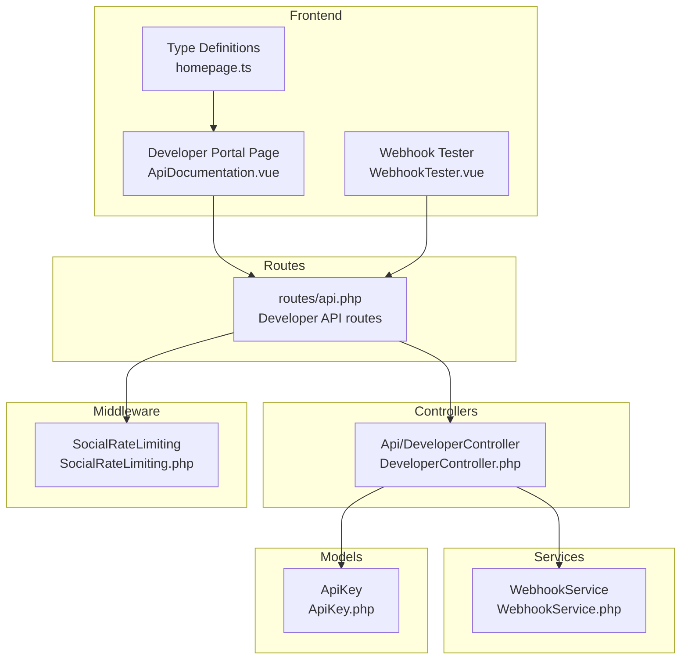
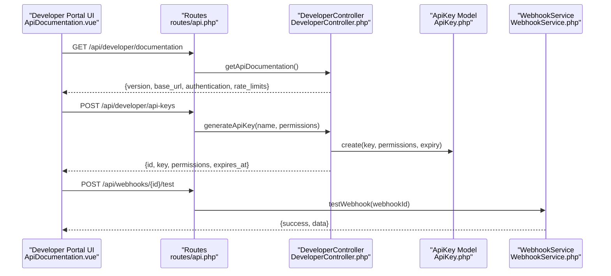
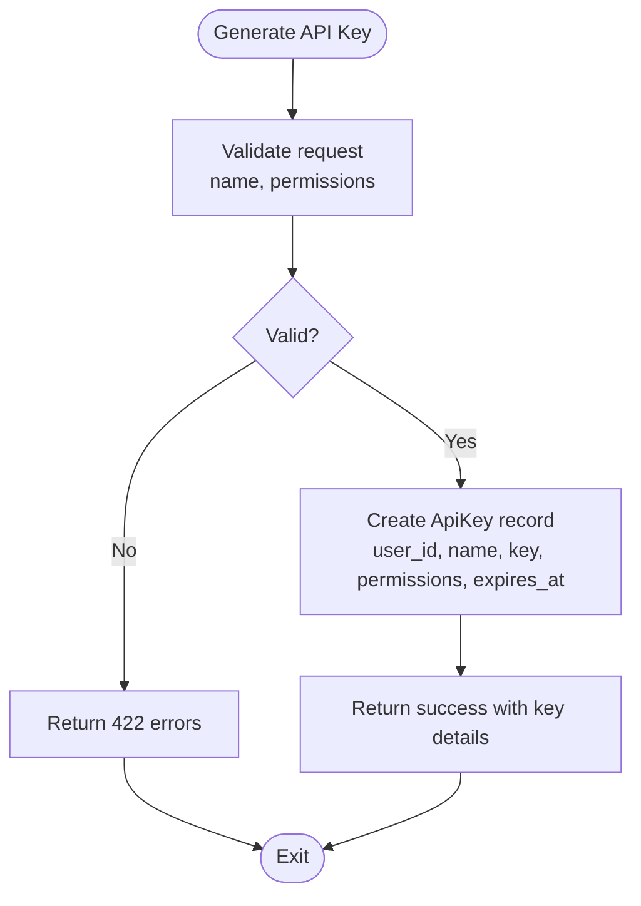
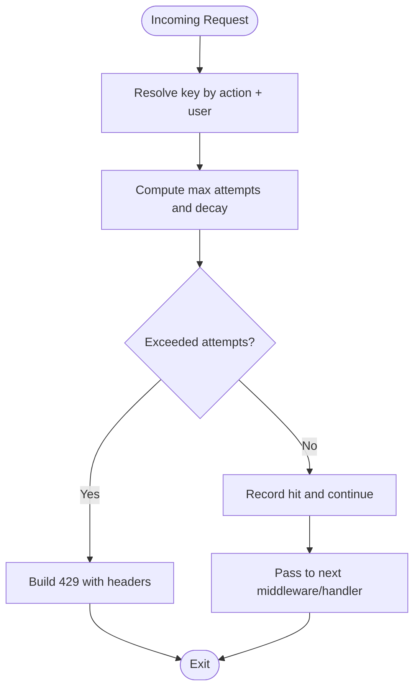
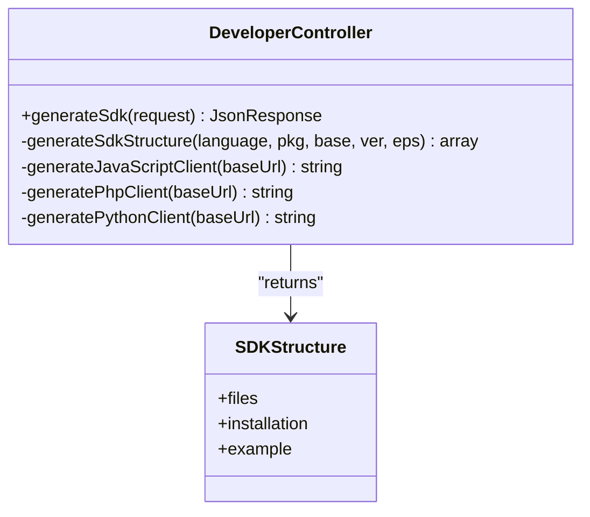
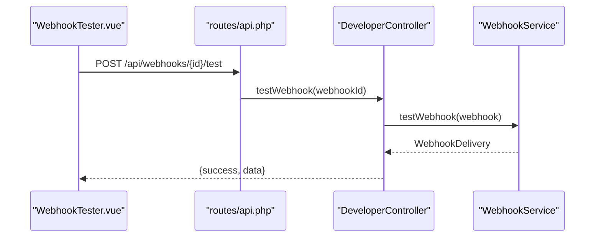
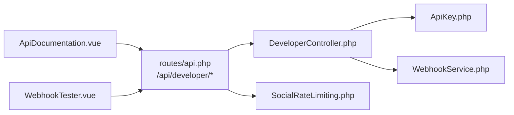

# Developer Tools & SDKs

<cite>
**Referenced Files in This Document**
- [routes/api.php](file://routes/api.php)
- [app/Http/Controllers/Api/DeveloperController.php](file://app/Http/Controllers/Api/DeveloperController.php)
- [app/Http/Middleware/SocialRateLimiting.php](file://app/Http/Middleware/SocialRateLimiting.php)
- [app/Services/WebhookService.php](file://app/Services/WebhookService.php)
- [app/Models/ApiKey.php](file://app/Models/ApiKey.php)
- [resources/js/Pages/Developer/ApiDocumentation.vue](file://resources/js/Pages/Developer/ApiDocumentation.vue)
- [resources/js/components/Developer/WebhookTester.vue](file://resources/js/components/Developer/WebhookTester.vue)
- [resources/js/types/homepage.ts](file://resources/js/types/homepage.ts)
- [resources/js/Types/homepage.ts](file://resources/js/Types/homepage.ts)
</cite>

## Table of Contents
1. [Introduction](#introduction)
2. [Project Structure](#project-structure)
3. [Core Components](#core-components)
4. [Architecture Overview](#architecture-overview)
5. [Detailed Component Analysis](#detailed-component-analysis)
6. [Dependency Analysis](#dependency-analysis)
7. [Performance Considerations](#performance-considerations)
8. [Troubleshooting Guide](#troubleshooting-guide)
9. [Conclusion](#conclusion)
10. [Appendices](#appendices)

## Introduction
This document provides comprehensive developer-facing tools and SDK generation guidance for the Alumni Platform. It covers API key management, rate limiting configuration, usage monitoring, SDK generation across multiple languages, Postman collection creation, API documentation export, webhook testing utilities, sandbox environments, integration debugging tools, developer onboarding workflows, API versioning and deprecation policies, authentication best practices, and integration troubleshooting. It also outlines developer portal access, support ticketing, and community resources.

## Project Structure
The developer tools and SDK generation surface is primarily exposed via the developer API routes under the authenticated developer namespace. The frontend developer portal integrates with these endpoints to provide interactive tools for API key management, rate limit visualization, webhook testing, SDK generation, and documentation export.

**Diagram sources**
- [routes/api.php:587-602](file://routes/api.php#L587-L602)
- [app/Http/Controllers/Api/DeveloperController.php:1-454](file://app/Http/Controllers/Api/DeveloperController.php#L1-L454)
- [app/Http/Middleware/SocialRateLimiting.php:1-270](file://app/Http/Middleware/SocialRateLimiting.php#L1-L270)
- [app/Services/WebhookService.php:1-517](file://app/Services/WebhookService.php#L1-L517)
- [app/Models/ApiKey.php:1-52](file://app/Models/ApiKey.php#L1-L52)
- [resources/js/Pages/Developer/ApiDocumentation.vue:104-706](file://resources/js/Pages/Developer/ApiDocumentation.vue#L104-L706)
- [resources/js/components/Developer/WebhookTester.vue:1-352](file://resources/js/components/Developer/WebhookTester.vue#L1-L352)
- [resources/js/types/homepage.ts:937-1014](file://resources/js/types/homepage.ts#L937-L1014)
- [resources/js/Types/homepage.ts:937-1014](file://resources/js/Types/homepage.ts#L937-L1014)

**Section sources**
- [routes/api.php:587-602](file://routes/api.php#L587-L602)
- [resources/js/Pages/Developer/ApiDocumentation.vue:104-706](file://resources/js/Pages/Developer/ApiDocumentation.vue#L104-L706)

## Core Components
- Developer API endpoints: Provides API key management, webhook events listing, webhook testing, API documentation retrieval, Postman collection generation, and SDK generation.
- Rate limiting middleware: Implements adaptive social rate limiting with configurable windows and headers.
- Webhook service: Manages webhook lifecycle, signatures, retries, and statistics.
- API key model: Stores user API keys, permissions, expiration, and usage tracking.
- Frontend developer portal: Interactive UI for API key management, rate limit display, webhook tester, SDK generator, and integration examples.

**Section sources**
- [app/Http/Controllers/Api/DeveloperController.php:18-85](file://app/Http/Controllers/Api/DeveloperController.php#L18-L85)
- [app/Http/Middleware/SocialRateLimiting.php:66-101](file://app/Http/Middleware/SocialRateLimiting.php#L66-L101)
- [app/Services/WebhookService.php:49-133](file://app/Services/WebhookService.php#L49-L133)
- [app/Models/ApiKey.php:13-50](file://app/Models/ApiKey.php#L13-L50)
- [resources/js/Pages/Developer/ApiDocumentation.vue:104-181](file://resources/js/Pages/Developer/ApiDocumentation.vue#L104-L181)

## Architecture Overview
The developer tools integrate frontend components with Laravel backend controllers and services. The developer portal pages call developer API endpoints to manage keys, test webhooks, generate SDKs, and export documentation. Rate limiting middleware enforces usage caps, while the webhook service ensures reliable delivery with retries and signatures.

**Diagram sources**
- [routes/api.php:587-602](file://routes/api.php#L587-L602)
- [app/Http/Controllers/Api/DeveloperController.php:199-237](file://app/Http/Controllers/Api/DeveloperController.php#L199-L237)
- [app/Http/Controllers/Api/DeveloperController.php:18-55](file://app/Http/Controllers/Api/DeveloperController.php#L18-L55)
- [app/Services/WebhookService.php:138-152](file://app/Services/WebhookService.php#L138-L152)
- [app/Models/ApiKey.php:32-50](file://app/Models/ApiKey.php#L32-L50)

## Detailed Component Analysis

### API Key Management
- Generate API keys: Creates a new key with a random token, optional permissions, and one-year expiration.
- List API keys: Returns user-owned keys with metadata for management.
- Revoke API keys: Deletes a key by ID.

**Diagram sources**
- [app/Http/Controllers/Api/DeveloperController.php:20-55](file://app/Http/Controllers/Api/DeveloperController.php#L20-L55)
- [app/Models/ApiKey.php:13-30](file://app/Models/ApiKey.php#L13-L30)

**Section sources**
- [app/Http/Controllers/Api/DeveloperController.php:18-85](file://app/Http/Controllers/Api/DeveloperController.php#L18-L85)
- [app/Models/ApiKey.php:13-50](file://app/Models/ApiKey.php#L13-L50)
- [resources/js/Pages/Developer/ApiDocumentation.vue:104-181](file://resources/js/Pages/Developer/ApiDocumentation.vue#L104-L181)

### Rate Limiting Configuration
- Middleware defines per-action limits and decay windows.
- Adds X-RateLimit-* and Retry-After headers to responses.
- Adapts limits based on user trust score.

**Diagram sources**
- [app/Http/Middleware/SocialRateLimiting.php:16-41](file://app/Http/Middleware/SocialRateLimiting.php#L16-L41)
- [app/Http/Middleware/SocialRateLimiting.php:106-137](file://app/Http/Middleware/SocialRateLimiting.php#L106-L137)

**Section sources**
- [app/Http/Middleware/SocialRateLimiting.php:66-101](file://app/Http/Middleware/SocialRateLimiting.php#L66-L101)
- [app/Http/Middleware/SocialRateLimiting.php:122-137](file://app/Http/Middleware/SocialRateLimiting.php#L122-L137)
- [routes/api.php:30-33](file://routes/api.php#L30-L33)

### Usage Monitoring
- Rate limit headers: X-RateLimit-Limit, X-RateLimit-Remaining, Retry-After, X-RateLimit-Reset.
- API documentation endpoint exposes general and category-specific limits.

**Section sources**
- [app/Http/Middleware/SocialRateLimiting.php:122-137](file://app/Http/Middleware/SocialRateLimiting.php#L122-L137)
- [app/Http/Controllers/Api/DeveloperController.php:200-237](file://app/Http/Controllers/Api/DeveloperController.php#L200-L237)

### SDK Generation
- Supported languages: JavaScript, PHP, Python.
- Generates package/composer/PyPI metadata, client code, and README.
- Includes installation and usage examples per language.

**Diagram sources**
- [app/Http/Controllers/Api/DeveloperController.php:304-381](file://app/Http/Controllers/Api/DeveloperController.php#L304-L381)
- [app/Http/Controllers/Api/DeveloperController.php:396-447](file://app/Http/Controllers/Api/DeveloperController.php#L396-L447)

**Section sources**
- [app/Http/Controllers/Api/DeveloperController.php:304-381](file://app/Http/Controllers/Api/DeveloperController.php#L304-L381)
- [resources/js/Pages/Developer/ApiDocumentation.vue:375-381](file://resources/js/Pages/Developer/ApiDocumentation.vue#L375-L381)

### Postman Collection Creation
- Validates input (name, description, base URL, options).
- Builds a Postman v2.1 collection with optional bearer auth and environment variables.

**Section sources**
- [app/Http/Controllers/Api/DeveloperController.php:242-299](file://app/Http/Controllers/Api/DeveloperController.php#L242-L299)

### API Documentation Export
- Returns structured documentation metadata (version, base URL, authentication, rate limits, pagination).
- Frontend renders documentation and allows copying examples.

**Section sources**
- [app/Http/Controllers/Api/DeveloperController.php:199-237](file://app/Http/Controllers/Api/DeveloperController.php#L199-L237)
- [resources/js/Pages/Developer/ApiDocumentation.vue:557-567](file://resources/js/Pages/Developer/ApiDocumentation.vue#L557-L567)

### Webhook Testing Utilities
- Frontend webhook tester supports sending test payloads, toggling retries and response validation, and signature verification examples.
- Backend developer controller provides test endpoint; service manages delivery, retries, and statistics.

**Diagram sources**
- [resources/js/components/Developer/WebhookTester.vue:192-199](file://resources/js/components/Developer/WebhookTester.vue#L192-L199)
- [routes/api.php:596](file://routes/api.php#L596)
- [app/Http/Controllers/Api/DeveloperController.php:169-194](file://app/Http/Controllers/Api/DeveloperController.php#L169-L194)
- [app/Services/WebhookService.php:138-152](file://app/Services/WebhookService.php#L138-L152)

**Section sources**
- [resources/js/components/Developer/WebhookTester.vue:167-199](file://resources/js/components/Developer/WebhookTester.vue#L167-L199)
- [app/Http/Controllers/Api/DeveloperController.php:169-194](file://app/Http/Controllers/Api/DeveloperController.php#L169-L194)
- [app/Services/WebhookService.php:157-232](file://app/Services/WebhookService.php#L157-L232)

### Sandbox Environments and Integration Debugging
- Ping endpoint for health checks.
- Developer portal provides interactive tools for testing and debugging integrations.
- Webhook URL validation and retry scheduling with exponential backoff.

**Section sources**
- [routes/api.php:35-42](file://routes/api.php#L35-L42)
- [app/Services/WebhookService.php:289-313](file://app/Services/WebhookService.php#L289-L313)
- [app/Services/WebhookService.php:452-466](file://app/Services/WebhookService.php#L452-L466)

### Developer Onboarding and Training
- Onboarding endpoints track state, new features, and contextual help.
- Training endpoints expose guides, tutorials, FAQs, and progress tracking.

**Section sources**
- [routes/api.php:732-755](file://routes/api.php#L732-L755)

### API Versioning and Deprecation Policies
- Documentation endpoint includes a version field for tracking.
- Frontend type definitions include version and rate limits for clients.

**Section sources**
- [app/Http/Controllers/Api/DeveloperController.php:204-205](file://app/Http/Controllers/Api/DeveloperController.php#L204-L205)
- [resources/js/types/homepage.ts:937-947](file://resources/js/types/homepage.ts#L937-L947)
- [resources/js/Types/homepage.ts:937-947](file://resources/js/Types/homepage.ts#L937-L947)

### Authentication Best Practices
- Bearer token authentication is documented and used across developer endpoints.
- Frontend examples demonstrate token usage in headers.

**Section sources**
- [app/Http/Controllers/Api/DeveloperController.php:206-209](file://app/Http/Controllers/Api/DeveloperController.php#L206-L209)
- [resources/js/Pages/Developer/ApiDocumentation.vue:592-610](file://resources/js/Pages/Developer/ApiDocumentation.vue#L592-L610)

### Integration Troubleshooting
- Webhook tester validates URL reachability and provides signature verification examples.
- Webhook service logs delivery outcomes and schedules retries.

**Section sources**
- [resources/js/components/Developer/WebhookTester.vue:308-331](file://resources/js/components/Developer/WebhookTester.vue#L308-L331)
- [app/Services/WebhookService.php:189-232](file://app/Services/WebhookService.php#L189-L232)

## Dependency Analysis
The developer portal depends on developer API endpoints, which in turn depend on the API key model and webhook service. Rate limiting middleware is applied to specific routes to enforce usage caps.

**Diagram sources**
- [routes/api.php:587-602](file://routes/api.php#L587-L602)
- [app/Http/Controllers/Api/DeveloperController.php:1-454](file://app/Http/Controllers/Api/DeveloperController.php#L1-L454)
- [app/Models/ApiKey.php:1-52](file://app/Models/ApiKey.php#L1-L52)
- [app/Services/WebhookService.php:1-517](file://app/Services/WebhookService.php#L1-L517)
- [app/Http/Middleware/SocialRateLimiting.php:1-270](file://app/Http/Middleware/SocialRateLimiting.php#L1-L270)
- [resources/js/Pages/Developer/ApiDocumentation.vue:104-706](file://resources/js/Pages/Developer/ApiDocumentation.vue#L104-L706)
- [resources/js/components/Developer/WebhookTester.vue:1-352](file://resources/js/components/Developer/WebhookTester.vue#L1-L352)

**Section sources**
- [routes/api.php:587-602](file://routes/api.php#L587-L602)
- [app/Http/Controllers/Api/DeveloperController.php:1-454](file://app/Http/Controllers/Api/DeveloperController.php#L1-L454)

## Performance Considerations
- Use rate limiting headers to inform clients about remaining quota and reset timing.
- Prefer exponential backoff for webhook retries to reduce server load.
- Cache frequently accessed documentation and SDK metadata to minimize repeated generation.

## Troubleshooting Guide
- API key generation failures: Validate input fields and permissions; check for 422 responses with error details.
- Rate limit exceeded: Inspect X-RateLimit-* headers; adjust client-side throttling; review adaptive trust score impact.
- Webhook delivery failures: Review delivery logs, response codes, and retry counts; verify signature verification and URL reachability.
- SDK generation issues: Confirm language selection and endpoint filters; ensure proper package metadata.

**Section sources**
- [app/Http/Controllers/Api/DeveloperController.php:20-55](file://app/Http/Controllers/Api/DeveloperController.php#L20-L55)
- [app/Http/Middleware/SocialRateLimiting.php:106-137](file://app/Http/Middleware/SocialRateLimiting.php#L106-L137)
- [app/Services/WebhookService.php:189-232](file://app/Services/WebhookService.php#L189-L232)

## Conclusion
The Alumni Platform provides a robust set of developer tools centered around API key management, rate limiting, webhook testing, and SDK generation. The developer portal offers an integrated experience for documentation, testing, and integration debugging, backed by middleware and services that ensure reliability and performance.

## Appendices
- Developer portal access: Navigate to the developer documentation page for interactive tools.
- Support ticketing: Use training and onboarding endpoints to gather context and submit feedback.
- Community resources: Explore training guides, FAQs, and tutorials for community-driven support.