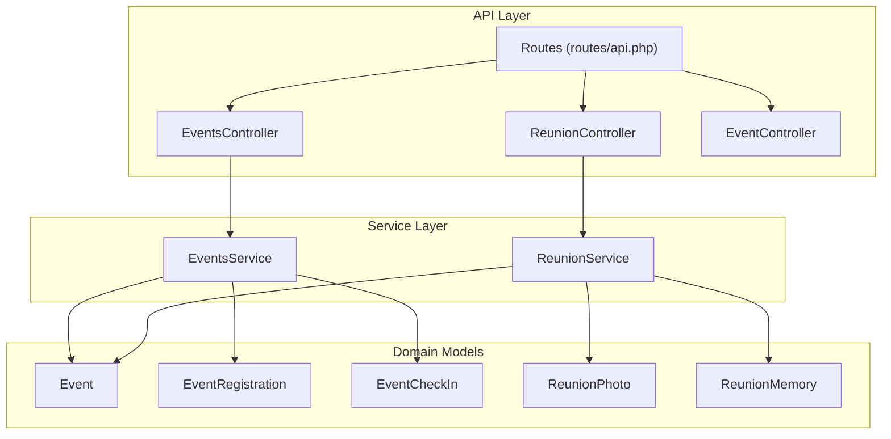
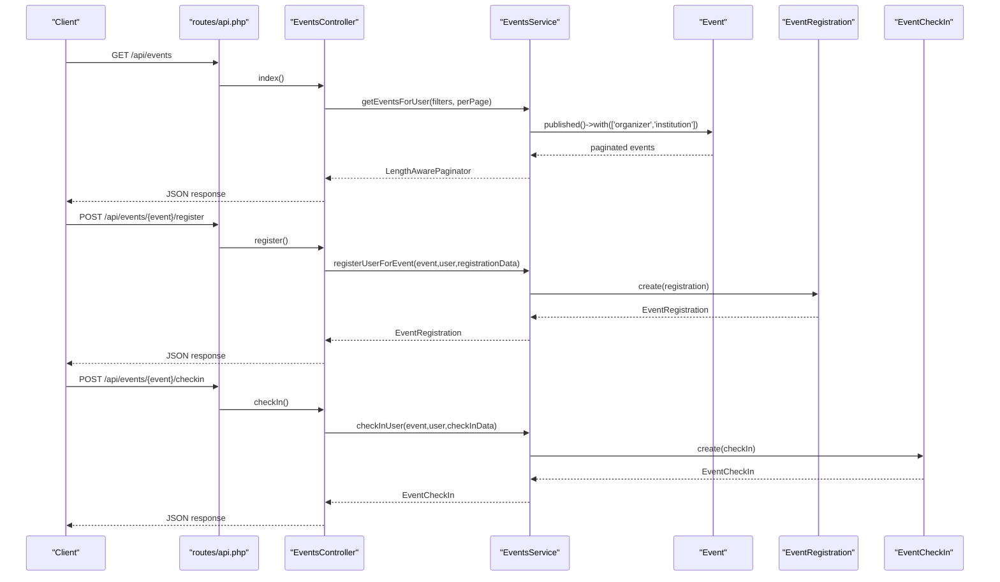
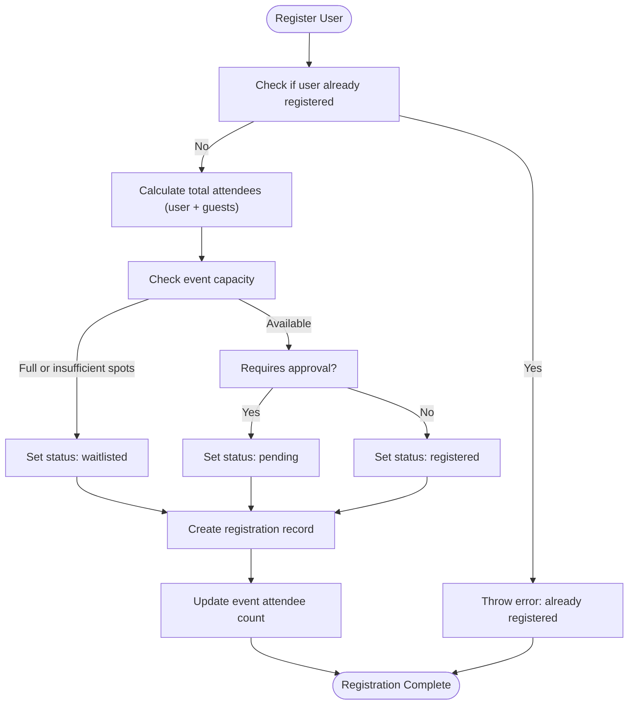
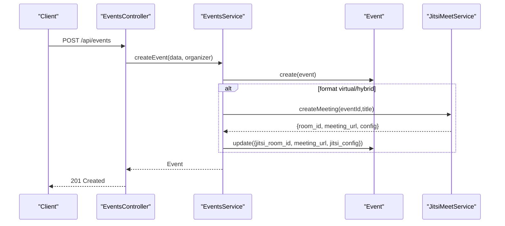
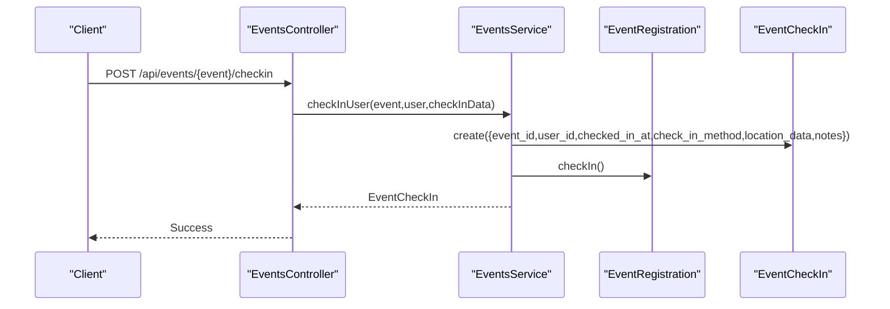
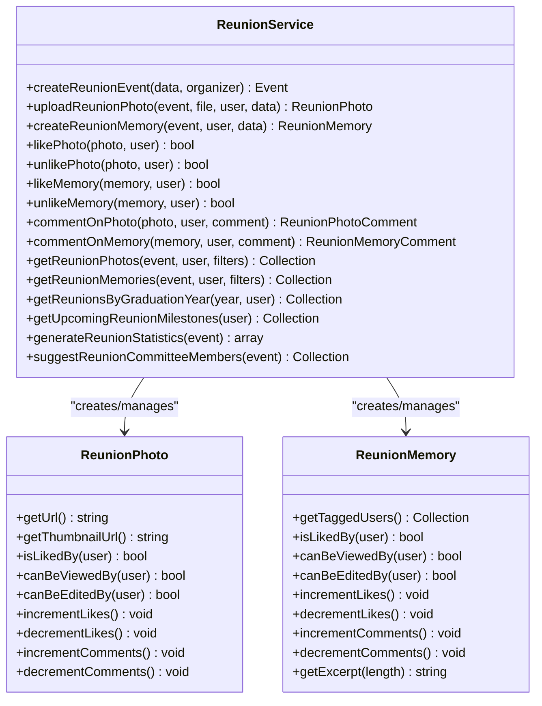
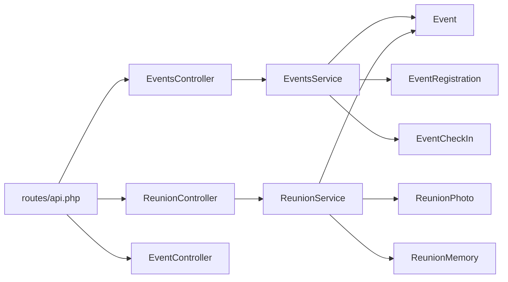

# Events & Reunions

<cite>
**Referenced Files in This Document**
- [EventsController.php](file://app/Http/Controllers/API/EventsController.php)
- [ReunionController.php](file://app/Http/Controllers/API/ReunionController.php)
- [EventController.php](file://app/Http/Controllers/API/EventController.php)
- [EventsService.php](file://app/Services/EventsService.php)
- [ReunionService.php](file://app/Services/ReunionService.php)
- [Event.php](file://app/Models/Event.php)
- [EventRegistration.php](file://app/Models/EventRegistration.php)
- [EventCheckIn.php](file://app/Models/EventCheckIn.php)
- [ReunionPhoto.php](file://app/Models/ReunionPhoto.php)
- [ReunionMemory.php](file://app/Models/ReunionMemory.php)
- [api.php](file://routes/api.php)
</cite>

## Table of Contents
1. [Introduction](#introduction)
2. [Project Structure](#project-structure)
3. [Core Components](#core-components)
4. [Architecture Overview](#architecture-overview)
5. [Detailed Component Analysis](#detailed-component-analysis)
6. [Dependency Analysis](#dependency-analysis)
7. [Performance Considerations](#performance-considerations)
8. [Troubleshooting Guide](#troubleshooting-guide)
9. [Conclusion](#conclusion)

## Introduction
This document provides comprehensive API documentation for event management and reunion coordination. It covers event creation, registration, attendance tracking, virtual event integration, check-in management, and attendee analytics. It also documents reunion planning features including milestone tracking, photo sharing, and memory management. Additional topics include event recommendations, networking opportunities, follow-up activities, examples of event scheduling, capacity management, participant communication, event categorization, location-based discovery, and recurring event handling.

## Project Structure
The event and reunion system is implemented using Laravel controllers, services, and models. API routes are defined under the routes/api.php file and mapped to controller actions. The EventsService and ReunionService encapsulate business logic, while Eloquent models represent domain entities.

**Diagram sources**
- [api.php](file://routes/api.php)
- [EventsController.php](file://app/Http/Controllers/API/EventsController.php)
- [ReunionController.php](file://app/Http/Controllers/API/ReunionController.php)
- [EventController.php](file://app/Http/Controllers/API/EventController.php)
- [EventsService.php](file://app/Services/EventsService.php)
- [ReunionService.php](file://app/Services/ReunionService.php)
- [Event.php](file://app/Models/Event.php)
- [EventRegistration.php](file://app/Models/EventRegistration.php)
- [EventCheckIn.php](file://app/Models/EventCheckIn.php)
- [ReunionPhoto.php](file://app/Models/ReunionPhoto.php)
- [ReunionMemory.php](file://app/Models/ReunionMemory.php)

**Section sources**
- [api.php](file://routes/api.php)
- [EventsController.php](file://app/Http/Controllers/API/EventsController.php)
- [ReunionController.php](file://app/Http/Controllers/API/ReunionController.php)
- [EventController.php](file://app/Http/Controllers/API/EventController.php)
- [EventsService.php](file://app/Services/EventsService.php)
- [ReunionService.php](file://app/Services/ReunionService.php)
- [Event.php](file://app/Models/Event.php)
- [EventRegistration.php](file://app/Models/EventRegistration.php)
- [EventCheckIn.php](file://app/Models/EventCheckIn.php)
- [ReunionPhoto.php](file://app/Models/ReunionPhoto.php)
- [ReunionMemory.php](file://app/Models/ReunionMemory.php)

## Core Components
- EventsController: Handles event lifecycle operations (list, create, update, delete), registration, cancellation, check-in, attendee listing, analytics, upcoming/recommended events.
- ReunionController: Manages reunion-specific operations (list, create, update), photo sharing, memory wall, likes/comments, milestones, statistics, and committee management.
- EventController: Provides legacy RSVP functionality for events.
- EventsService: Implements event business logic including visibility-aware queries, capacity checks, waitlist promotion, virtual meeting setup, analytics computation, and recommendation engine.
- ReunionService: Implements reunion-specific features including photo upload with metadata, memory creation, likes/comments, photo/memory retrieval with visibility scoping, milestone calculation, statistics generation, and committee member suggestion.
- Event model: Defines attributes, scopes, visibility rules, capacity helpers, virtual meeting helpers, and reunion-specific helpers.
- EventRegistration model: Tracks registration status, guest counts, cancellation, and check-in transitions.
- EventCheckIn model: Stores check-in records with method, location, and notes.
- ReunionPhoto model: Manages photo metadata, visibility scoping, likes/comments counters, and file URL helpers.
- ReunionMemory model: Manages memory content, visibility scoping, likes/comments counters, and excerpt generation.

**Section sources**
- [EventsController.php](file://app/Http/Controllers/API/EventsController.php)
- [ReunionController.php](file://app/Http/Controllers/API/ReunionController.php)
- [EventController.php](file://app/Http/Controllers/API/EventController.php)
- [EventsService.php](file://app/Services/EventsService.php)
- [ReunionService.php](file://app/Services/ReunionService.php)
- [Event.php](file://app/Models/Event.php)
- [EventRegistration.php](file://app/Models/EventRegistration.php)
- [EventCheckIn.php](file://app/Models/EventCheckIn.php)
- [ReunionPhoto.php](file://app/Models/ReunionPhoto.php)
- [ReunionMemory.php](file://app/Models/ReunionMemory.php)

## Architecture Overview
The system follows a layered architecture:
- API layer: Routes define endpoints; controllers handle HTTP requests and responses.
- Service layer: Encapsulates business logic and orchestrates model interactions.
- Domain models: Represent entities and enforce domain rules via scopes and helpers.
- Virtual meeting integration: EventsService integrates with Jitsi Meet via JitsiMeetService for virtual meetings.

**Diagram sources**
- [api.php](file://routes/api.php)
- [EventsController.php](file://app/Http/Controllers/API/EventsController.php)
- [EventsService.php](file://app/Services/EventsService.php)
- [Event.php](file://app/Models/Event.php)
- [EventRegistration.php](file://app/Models/EventRegistration.php)
- [EventCheckIn.php](file://app/Models/EventCheckIn.php)

## Detailed Component Analysis

### Event Management API
- Endpoint: GET /api/events
  - Purpose: List events visible to the authenticated user with pagination and filters.
  - Filters: type, format, date_range, location, radius, tags, search.
  - Response: Paginated list of events with meta information.
  - Permissions: Visibility rules enforced per event.
- Endpoint: GET /api/events/{event}
  - Purpose: Retrieve event details with user-specific data (registration status, check-in status, edit permissions).
  - Permissions: Requires permission to view event.
- Endpoint: POST /api/events
  - Purpose: Create a new event.
  - Validation: Title, description, type, format, dates, timezone, venue/virtual details, capacity, approval requirements, pricing, visibility, guests, networking, check-in, tags, media URLs.
  - Virtual meeting: Automatically sets up Jitsi meeting if format is virtual/hybrid.
  - Organizer auto-registration: Optional auto-registration of organizer.
- Endpoint: PUT /api/events/{event}
  - Purpose: Update event details with validation rules similar to creation.
  - Permissions: Requires permission to edit event.
- Endpoint: DELETE /api/events/{event}
  - Purpose: Delete event.
  - Permissions: Requires permission to edit event.
- Endpoint: POST /api/events/{event}/register
  - Purpose: Register authenticated user for an event.
  - Validation: guests_count, guest_details, special_requirements, additional_data.
  - Capacity: Places user on waitlist if capacity is full; otherwise pending or registered depending on approval requirement.
- Endpoint: DELETE /api/events/{event}/register
  - Purpose: Cancel registration with optional reason.
  - Constraints: Cancellation allowed only if event is future and status is registered/waitlisted.
  - Promotion: Promotes next waitlisted user if applicable.
- Endpoint: POST /api/events/{event}/checkin
  - Purpose: Check-in user with method, location, and notes.
  - Constraints: User must be registered and event must enable check-in.
- Endpoint: GET /api/events/{event}/attendees
  - Purpose: List attendees filtered by status (all, registered, waitlisted, attended, cancelled).
  - Permissions: Requires permission to view event attendees.
- Endpoint: GET /api/events/{event}/analytics
  - Purpose: Retrieve event analytics including counts, check-in rate, capacity utilization, and registration timeline.
  - Permissions: Requires permission to view event analytics.
- Endpoint: GET /api/events-upcoming
  - Purpose: List upcoming events for the authenticated user.
- Endpoint: GET /api/events-recommended
  - Purpose: List recommended events based on institution, location, and network.

**Diagram sources**
- [EventsService.php](file://app/Services/EventsService.php)
- [EventRegistration.php](file://app/Models/EventRegistration.php)

**Section sources**
- [EventsController.php](file://app/Http/Controllers/API/EventsController.php)
- [EventsService.php](file://app/Services/EventsService.php)
- [Event.php](file://app/Models/Event.php)
- [EventRegistration.php](file://app/Models/EventRegistration.php)
- [EventCheckIn.php](file://app/Models/EventCheckIn.php)
- [api.php](file://routes/api.php)

### Virtual Event Integration
- Automatic Jitsi Meeting Setup: When event format is virtual or hybrid, a Jitsi room is created and meeting details are stored on the event.
- Meeting Credentials: Provides platform, URL, password, and instructions; supports Jitsi embed URL generation with configurable parameters.
- Meeting URL Validation and Extraction: Validates and extracts meeting details from URLs.

**Diagram sources**
- [EventsService.php](file://app/Services/EventsService.php)
- [Event.php](file://app/Models/Event.php)

**Section sources**
- [EventsService.php](file://app/Services/EventsService.php)
- [Event.php](file://app/Models/Event.php)

### Check-In Management
- Check-in Types: Manual, QR code scan, NFC tap, location-based.
- Check-in Record: Captures timestamp, method, location data, and notes.
- Registration Transition: On successful check-in, registration status updates to attended.

**Diagram sources**
- [EventsController.php](file://app/Http/Controllers/API/EventsController.php)
- [EventsService.php](file://app/Services/EventsService.php)
- [EventCheckIn.php](file://app/Models/EventCheckIn.php)
- [EventRegistration.php](file://app/Models/EventRegistration.php)

**Section sources**
- [EventsController.php](file://app/Http/Controllers/API/EventsController.php)
- [EventsService.php](file://app/Services/EventsService.php)
- [EventCheckIn.php](file://app/Models/EventCheckIn.php)
- [EventRegistration.php](file://app/Models/EventRegistration.php)

### Attendee Analytics
- Metrics: Total registered, waitlisted, cancelled, attended, no-show, total guests, check-in rate, capacity utilization, registration timeline.
- Computation: Aggregates from registrations and check-ins; computes percentages and timelines.

**Section sources**
- [EventsService.php](file://app/Services/EventsService.php)
- [Event.php](file://app/Models/Event.php)

### Reunion Planning API
- Endpoint: GET /api/reunions
  - Purpose: List published reunions visible to the authenticated user, filterable by graduation year, milestone, and period (upcoming/past).
- Endpoint: GET /api/reunions/{event}
  - Purpose: Retrieve reunion details with featured photos and memories, plus statistics.
- Endpoint: POST /api/reunions
  - Purpose: Create a reunion event with graduation year, class identifier, theme, dates, venue, capacity, ticket price, and feature toggles for photo sharing and memory wall.
  - Defaults: Sets is_reunion=true, type=reunion, and default memory collection settings.
- Endpoint: PUT /api/reunions/{event}
  - Purpose: Update reunion details with validation rules.
- Endpoint: GET /api/reunions/{event}/statistics
  - Purpose: Retrieve reunion statistics including total photos, memories, registered, attended, attendance rate, and engagement score.
- Photo Sharing:
  - GET /api/reunions/{event}/photos: List approved, visible photos with optional filters (featured, uploaded_by).
  - POST /api/reunions/{event}/photos: Upload photo with metadata, visibility, tagging, and automatic thumbnail generation.
  - Like/Unlike: POST/DELETE /api/reunion-photos/{photo}/like
  - Comments: POST /api/reunion-photos/{photo}/comments
- Memory Wall:
  - GET /api/reunions/{event}/memories: List approved, visible memories with optional filters (featured, type, submitted_by).
  - POST /api/reunions/{event}/memories: Create memory with title, content, type, media URLs, tagging, and visibility.
  - Like/Unlike: POST/DELETE /api/reunion-memories/{memory}/like
  - Comments: POST /api/reunion-memories/{memory}/comments
- Milestones:
  - GET /api/reunions/milestones: List upcoming reunion milestones based on user’s graduation year.
  - GET /api/reunions/graduation-year/{year}: List reunions by graduation year with visibility rules.
- Committee Management:
  - GET /api/reunions/{event}/committee: List committee members with user details.
  - POST /api/reunions/{event}/committee: Add committee member with role.
  - DELETE /api/reunions/{event}/committee: Remove committee member.

**Diagram sources**
- [ReunionService.php](file://app/Services/ReunionService.php)
- [ReunionPhoto.php](file://app/Models/ReunionPhoto.php)
- [ReunionMemory.php](file://app/Models/ReunionMemory.php)

**Section sources**
- [ReunionController.php](file://app/Http/Controllers/API/ReunionController.php)
- [ReunionService.php](file://app/Services/ReunionService.php)
- [ReunionPhoto.php](file://app/Models/ReunionPhoto.php)
- [ReunionMemory.php](file://app/Models/ReunionMemory.php)
- [Event.php](file://app/Models/Event.php)
- [api.php](file://routes/api.php)

### Networking Opportunities and Follow-Up Activities
- Feedback Submission and Analytics: POST/GET endpoints for event feedback.
- Highlights: Creation, retrieval, interaction, and feature toggling.
- Connections: Creation and listing of networking connections made at events.
- Recommendations: Generation and acting upon recommendations.
- Follow-up Activities: Retrieval and analytics for follow-up activities.

**Section sources**
- [api.php](file://routes/api.php)

### Legacy RSVP
- Endpoint: POST /api/events/{event}/rsvp
  - Purpose: Update RSVP status (attending, maybe, not_attending) for an event.
- Endpoint: DELETE /api/events/{event}/rsvp
  - Purpose: Cancel RSVP.

**Section sources**
- [EventController.php](file://app/Http/Controllers/API/EventController.php)

## Dependency Analysis
- Controllers depend on Services for business logic.
- Services depend on Models for persistence and domain rules.
- Event model encapsulates visibility, capacity, virtual meeting, and reunion helpers.
- ReunionService depends on Event model and related photo/memory models.
- Routes define endpoint mappings and middleware.

**Diagram sources**
- [api.php](file://routes/api.php)
- [EventsController.php](file://app/Http/Controllers/API/EventsController.php)
- [ReunionController.php](file://app/Http/Controllers/API/ReunionController.php)
- [EventController.php](file://app/Http/Controllers/API/EventController.php)
- [EventsService.php](file://app/Services/EventsService.php)
- [ReunionService.php](file://app/Services/ReunionService.php)
- [Event.php](file://app/Models/Event.php)
- [EventRegistration.php](file://app/Models/EventRegistration.php)
- [EventCheckIn.php](file://app/Models/EventCheckIn.php)
- [ReunionPhoto.php](file://app/Models/ReunionPhoto.php)
- [ReunionMemory.php](file://app/Models/ReunionMemory.php)

**Section sources**
- [api.php](file://routes/api.php)
- [EventsController.php](file://app/Http/Controllers/API/EventsController.php)
- [ReunionController.php](file://app/Http/Controllers/API/ReunionController.php)
- [EventController.php](file://app/Http/Controllers/API/EventController.php)
- [EventsService.php](file://app/Services/EventsService.php)
- [ReunionService.php](file://app/Services/ReunionService.php)
- [Event.php](file://app/Models/Event.php)
- [EventRegistration.php](file://app/Models/EventRegistration.php)
- [EventCheckIn.php](file://app/Models/EventCheckIn.php)
- [ReunionPhoto.php](file://app/Models/ReunionPhoto.php)
- [ReunionMemory.php](file://app/Models/ReunionMemory.php)

## Performance Considerations
- Pagination: Controllers return paginated results to limit payload sizes.
- Visibility-aware queries: Services filter events based on visibility and user roles to avoid unnecessary data transfer.
- Location-based filtering: Uses spatial query helpers to efficiently filter nearby events.
- Batch operations: Consider bulk operations for analytics and updates where appropriate.
- Caching: Introduce caching for frequently accessed recommendations and statistics.

## Troubleshooting Guide
- Registration errors:
  - Already registered: Attempting to register twice throws an error.
  - Capacity exceeded: Users are placed on waitlist; ensure capacity management logic is respected.
  - Cancellation constraints: Cancellations are only allowed for future events and specific statuses.
- Check-in errors:
  - Not eligible: Users must be registered and event must enable check-in.
  - Duplicate check-ins: Ensure uniqueness constraints are enforced.
- Virtual meeting:
  - Missing Jitsi configuration: Verify meeting platform and credentials.
  - Embedding restrictions: Some platforms restrict embedding; check event settings.
- Reunion features:
  - Photo/Memory visibility: Ensure visibility rules align with event settings and user roles.
  - File uploads: Validate file types, sizes, and metadata extraction.

**Section sources**
- [EventsService.php](file://app/Services/EventsService.php)
- [EventRegistration.php](file://app/Models/EventRegistration.php)
- [EventCheckIn.php](file://app/Models/EventCheckIn.php)
- [ReunionService.php](file://app/Services/ReunionService.php)
- [ReunionPhoto.php](file://app/Models/ReunionPhoto.php)
- [ReunionMemory.php](file://app/Models/ReunionMemory.php)

## Conclusion
The Events & Reunions module provides a robust API for managing events and reunion activities. It supports comprehensive event lifecycle operations, virtual meeting integration, check-in management, analytics, and reunion-specific features such as photo sharing and memory walls. The layered architecture ensures maintainability and scalability, with clear separation between API, service, and domain concerns.