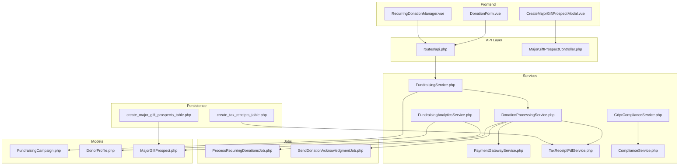
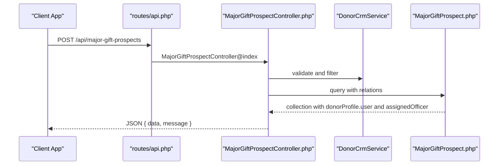
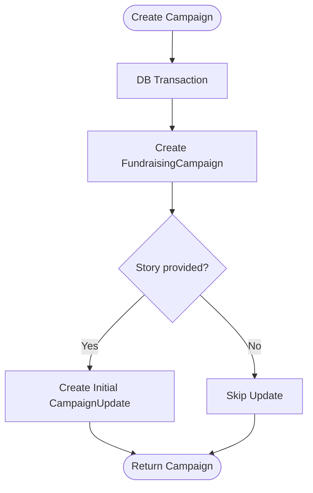
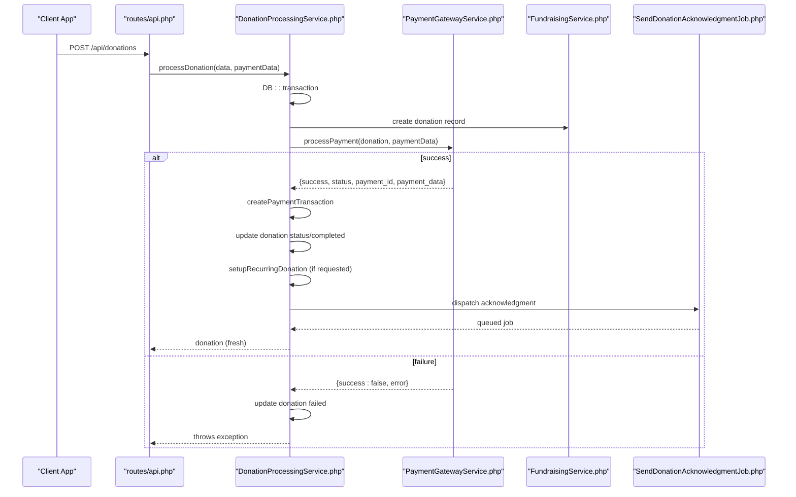
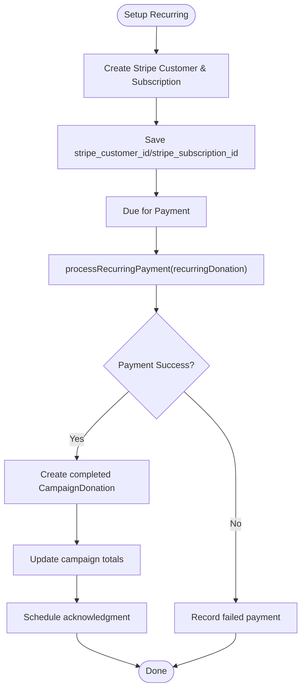
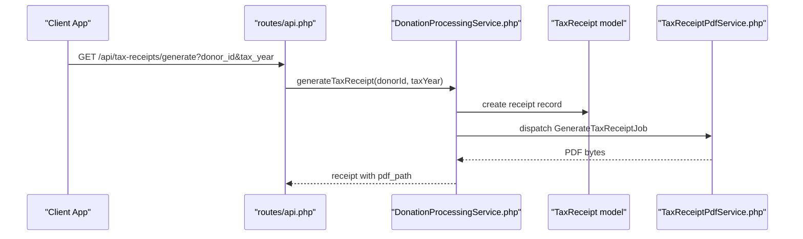
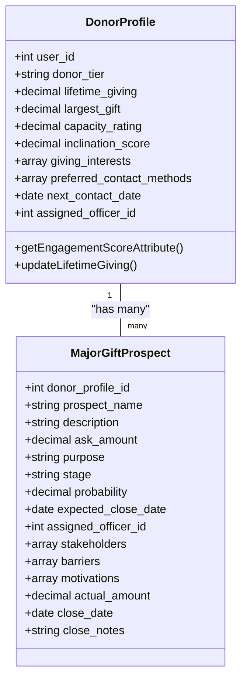
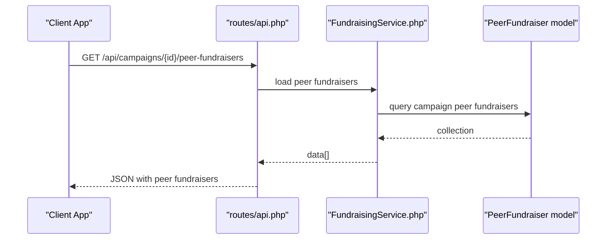
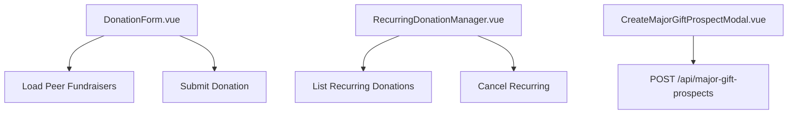
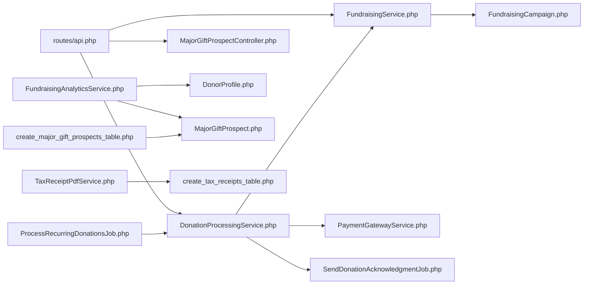

# Fundraising & Campaigns

<cite>
**Referenced Files in This Document**
- [FundraisingService.php](file://app/Services/FundraisingService.php)
- [DonationProcessingService.php](file://app/Services/DonationProcessingService.php)
- [PaymentGatewayService.php](file://app/Services/PaymentGatewayService.php)
- [FundraisingAnalyticsService.php](file://app/Services/FundraisingAnalyticsService.php)
- [TaxReceiptPdfService.php](file://app/Services/TaxReceiptPdfService.php)
- [GdprComplianceService.php](file://app/Services/GdprComplianceService.php)
- [ComplianceService.php](file://app/Services/ComplianceService.php)
- [DonationProcessingService.php](file://app/Jobs/DonationProcessingService.php)
- [ProcessRecurringDonationsJob.php](file://app/Jobs/ProcessRecurringDonationsJob.php)
- [SendDonationAcknowledgmentJob.php](file://app/Jobs/SendDonationAcknowledgmentJob.php)
- [FundraisingCampaign.php](file://app/Models/FundraisingCampaign.php)
- [DonorProfile.php](file://app/Models/DonorProfile.php)
- [MajorGiftProspect.php](file://app/Models/MajorGiftProspect.php)
- [MajorGiftProspectController.php](file://app/Http/Controllers/Api/MajorGiftProspectController.php)
- [2025_08_01_040001_create_tax_receipts_table.php](file://database/migrations/2025_08_01_040001_create_tax_receipts_table.php)
- [2025_08_01_092111_create_major_gift_prospects_table.php](file://database/migrations/2025_08_01_092111_create_major_gift_prospects_table.php)
- [DonationForm.vue](file://resources/js/components/Fundraising/DonationForm.vue)
- [RecurringDonationManager.vue](file://resources/js/components/Fundraising/RecurringDonationManager.vue)
- [CreateMajorGiftProspectModal.vue](file://resources/js/components/DonorCrm/CreateMajorGiftProspectModal.vue)
- [api.php](file://routes/api.php)
- [endpoints.md](file://docs/api/reference/endpoints.md)
</cite>

## Table of Contents
1. [Introduction](#introduction)
2. [Project Structure](#project-structure)
3. [Core Components](#core-components)
4. [Architecture Overview](#architecture-overview)
5. [Detailed Component Analysis](#detailed-component-analysis)
6. [Dependency Analysis](#dependency-analysis)
7. [Performance Considerations](#performance-considerations)
8. [Troubleshooting Guide](#troubleshooting-guide)
9. [Conclusion](#conclusion)
10. [Appendices](#appendices)

## Introduction
This document provides comprehensive API documentation for the Fundraising and Campaign Management system. It covers campaign lifecycle, donation processing, donor management, peer-to-peer fundraising, recurring donations, tax receipt generation, analytics, donor segmentation, stewardship planning, and compliance. It also outlines integration patterns for payment gateways, automation jobs, and reporting.

## Project Structure
The fundraising domain spans Laravel backend services, models, jobs, controllers, Vue components, and database migrations. Key areas include:
- Services orchestrating campaign creation, donations, recurring payments, analytics, receipts, and compliance
- Models representing campaigns, donors, prospects, and receipts
- Jobs automating recurring donations and acknowledgments
- Frontend components for donation forms and recurring management
- Routes exposing API endpoints for campaigns, donations, and major gift prospects

**Diagram sources**
- [DonationForm.vue](file://resources/js/components/Fundraising/DonationForm.vue)
- [RecurringDonationManager.vue](file://resources/js/components/Fundraising/RecurringDonationManager.vue)
- [CreateMajorGiftProspectModal.vue](file://resources/js/components/DonorCrm/CreateMajorGiftProspectModal.vue)
- [api.php](file://routes/api.php)
- [MajorGiftProspectController.php](file://app/Http/Controllers/Api/MajorGiftProspectController.php)
- [FundraisingService.php](file://app/Services/FundraisingService.php)
- [DonationProcessingService.php](file://app/Services/DonationProcessingService.php)
- [PaymentGatewayService.php](file://app/Services/PaymentGatewayService.php)
- [FundraisingAnalyticsService.php](file://app/Services/FundraisingAnalyticsService.php)
- [TaxReceiptPdfService.php](file://app/Services/TaxReceiptPdfService.php)
- [GdprComplianceService.php](file://app/Services/GdprComplianceService.php)
- [ComplianceService.php](file://app/Services/ComplianceService.php)
- [ProcessRecurringDonationsJob.php](file://app/Jobs/ProcessRecurringDonationsJob.php)
- [SendDonationAcknowledgmentJob.php](file://app/Jobs/SendDonationAcknowledgmentJob.php)
- [FundraisingCampaign.php](file://app/Models/FundraisingCampaign.php)
- [DonorProfile.php](file://app/Models/DonorProfile.php)
- [MajorGiftProspect.php](file://app/Models/MajorGiftProspect.php)
- [2025_08_01_040001_create_tax_receipts_table.php](file://database/migrations/2025_08_01_040001_create_tax_receipts_table.php)
- [2025_08_01_092111_create_major_gift_prospects_table.php](file://database/migrations/2025_08_01_092111_create_major_gift_prospects_table.php)

**Section sources**
- [FundraisingService.php:15-36](file://app/Services/FundraisingService.php#L15-L36)
- [DonationProcessingService.php:23-88](file://app/Services/DonationProcessingService.php#L23-L88)
- [PaymentGatewayService.php:12-34](file://app/Services/PaymentGatewayService.php#L12-L34)
- [FundraisingAnalyticsService.php:97-127](file://app/Services/FundraisingAnalyticsService.php#L97-L127)
- [TaxReceiptPdfService.php:10-25](file://app/Services/TaxReceiptPdfService.php#L10-L25)
- [GdprComplianceService.php:16-63](file://app/Services/GdprComplianceService.php#L16-L63)
- [ComplianceService.php:28-86](file://app/Services/ComplianceService.php#L28-L86)
- [ProcessRecurringDonationsJob.php:23-65](file://app/Jobs/ProcessRecurringDonationsJob.php#L23-L65)
- [SendDonationAcknowledgmentJob.php:23-65](file://app/Jobs/SendDonationAcknowledgmentJob.php#L23-L65)
- [FundraisingCampaign.php:15-49](file://app/Models/FundraisingCampaign.php#L15-L49)
- [DonorProfile.php:14-47](file://app/Models/DonorProfile.php#L14-L47)
- [MajorGiftProspect.php:13-45](file://app/Models/MajorGiftProspect.php#L13-L45)
- [2025_08_01_040001_create_tax_receipts_table.php:11-28](file://database/migrations/2025_08_01_040001_create_tax_receipts_table.php#L11-L28)
- [2025_08_01_092111_create_major_gift_prospects_table.php:14-35](file://database/migrations/2025_08_01_092111_create_major_gift_prospects_table.php#L14-L35)
- [DonationForm.vue:260-294](file://resources/js/components/Fundraising/DonationForm.vue#L260-L294)
- [RecurringDonationManager.vue:167-192](file://resources/js/components/Fundraising/RecurringDonationManager.vue#L167-L192)
- [CreateMajorGiftProspectModal.vue:276-292](file://resources/js/components/DonorCrm/CreateMajorGiftProspectModal.vue#L276-L292)
- [api.php:1-200](file://routes/api.php#L1-L200)
- [endpoints.md:459-501](file://docs/api/reference/endpoints.md#L459-L501)

## Core Components
- FundraisingService: Creates campaigns, updates, and manages totals; supports peer fundraising and analytics.
- DonationProcessingService: Orchestrates payment processing, recurring setup, acknowledgments, refunds, and tax receipt generation.
- PaymentGatewayService: Integrates with Stripe and PayPal for single and recurring payments, cancellations, and refunds.
- FundraisingAnalyticsService: Computes donor analytics, engagement scores, stewardship pipeline, and major gift identification.
- TaxReceiptPdfService: Generates tax receipt PDFs and prepares printable data.
- GdprComplianceService: Handles consent, access, erasure, portability, and retention cleanup.
- ComplianceService: Manages email preferences, double opt-in, unsubscribe links, and compliance reporting.
- Jobs: ProcessRecurringDonationsJob and SendDonationAcknowledgmentJob automate recurring billing and donor acknowledgments.
- Models: FundraisingCampaign, DonorProfile, MajorGiftProspect define domain entities and relationships.
- Migrations: TaxReceipts and MajorGiftProspects tables define persistence for receipts and stewardship.

**Section sources**
- [FundraisingService.php:15-105](file://app/Services/FundraisingService.php#L15-L105)
- [DonationProcessingService.php:23-197](file://app/Services/DonationProcessingService.php#L23-L197)
- [PaymentGatewayService.php:12-104](file://app/Services/PaymentGatewayService.php#L12-L104)
- [FundraisingAnalyticsService.php:97-469](file://app/Services/FundraisingAnalyticsService.php#L97-L469)
- [TaxReceiptPdfService.php:10-71](file://app/Services/TaxReceiptPdfService.php#L10-L71)
- [GdprComplianceService.php:16-195](file://app/Services/GdprComplianceService.php#L16-L195)
- [ComplianceService.php:28-86](file://app/Services/ComplianceService.php#L28-L86)
- [ProcessRecurringDonationsJob.php:23-65](file://app/Jobs/ProcessRecurringDonationsJob.php#L23-L65)
- [SendDonationAcknowledgmentJob.php:23-65](file://app/Jobs/SendDonationAcknowledgmentJob.php#L23-L65)
- [FundraisingCampaign.php:15-107](file://app/Models/FundraisingCampaign.php#L15-L107)
- [DonorProfile.php:14-131](file://app/Models/DonorProfile.php#L14-L131)
- [MajorGiftProspect.php:13-61](file://app/Models/MajorGiftProspect.php#L13-L61)
- [2025_08_01_040001_create_tax_receipts_table.php:11-33](file://database/migrations/2025_08_01_040001_create_tax_receipts_table.php#L11-L33)
- [2025_08_01_092111_create_major_gift_prospects_table.php:14-40](file://database/migrations/2025_08_01_092111_create_major_gift_prospects_table.php#L14-L40)

## Architecture Overview
The system follows a layered architecture:
- Presentation: Vue components for donation, recurring management, and major gift prospect creation
- API: Laravel routes and controllers expose endpoints for campaigns, donations, and prospects
- Services: Orchestrate business logic across payment processing, analytics, receipts, and compliance
- Persistence: Eloquent models backed by migrations for campaigns, donors, receipts, and prospects
- Automation: Queued jobs handle recurring donations and acknowledgments

**Diagram sources**
- [api.php:1-200](file://routes/api.php#L1-L200)
- [MajorGiftProspectController.php:20-31](file://app/Http/Controllers/Api/MajorGiftProspectController.php#L20-L31)
- [MajorGiftProspectController.php:92-103](file://app/Http/Controllers/Api/MajorGiftProspectController.php#L92-L103)
- [MajorGiftProspect.php:47-55](file://app/Models/MajorGiftProspect.php#L47-L55)

**Section sources**
- [MajorGiftProspectController.php:20-140](file://app/Http/Controllers/Api/MajorGiftProspectController.php#L20-L140)
- [MajorGiftProspect.php:13-61](file://app/Models/MajorGiftProspect.php#L13-L61)

## Detailed Component Analysis

### Campaign Creation and Management
- Create campaign with totals initialized and optional initial update
- Update campaign metadata and authoring
- Create campaign updates authored by users
- Compute analytics: totals, donor counts, averages, top fundraisers, and peer totals

**Diagram sources**
- [FundraisingService.php:15-36](file://app/Services/FundraisingService.php#L15-L36)
- [FundraisingService.php:45-52](file://app/Services/FundraisingService.php#L45-L52)

**Section sources**
- [FundraisingService.php:15-52](file://app/Services/FundraisingService.php#L15-L52)
- [FundraisingCampaign.php:15-49](file://app/Models/FundraisingCampaign.php#L15-L49)

### Donation Processing Workflow
- Process donation via service, persist record, and call payment gateway
- On success, create payment transactions, update status, set up recurring if requested, schedule acknowledgment
- On failure, mark donation failed and log error
- Refund and cancel recurring flows handled with gateway-specific logic

**Diagram sources**
- [DonationProcessingService.php:23-88](file://app/Services/DonationProcessingService.php#L23-L88)
- [PaymentGatewayService.php:12-34](file://app/Services/PaymentGatewayService.php#L12-L34)
- [FundraisingService.php:54-69](file://app/Services/FundraisingService.php#L54-L69)
- [SendDonationAcknowledgmentJob.php:23-65](file://app/Jobs/SendDonationAcknowledgmentJob.php#L23-L65)

**Section sources**
- [DonationProcessingService.php:23-197](file://app/Services/DonationProcessingService.php#L23-L197)
- [PaymentGatewayService.php:12-104](file://app/Services/PaymentGatewayService.php#L12-L104)
- [FundraisingService.php:54-69](file://app/Services/FundraisingService.php#L54-L69)

### Recurring Donation Handling
- Setup Stripe subscriptions for recurring donations
- Process recurring payments via gateway and create completed donations
- Record successful/failed payments and update totals
- Cancel subscriptions via gateway and mark canceled in system

**Diagram sources**
- [PaymentGatewayService.php:184-235](file://app/Services/PaymentGatewayService.php#L184-L235)
- [DonationProcessingService.php:90-150](file://app/Services/DonationProcessingService.php#L90-L150)
- [ProcessRecurringDonationsJob.php:23-65](file://app/Jobs/ProcessRecurringDonationsJob.php#L23-L65)

**Section sources**
- [PaymentGatewayService.php:184-295](file://app/Services/PaymentGatewayService.php#L184-L295)
- [DonationProcessingService.php:90-150](file://app/Services/DonationProcessingService.php#L90-L150)
- [ProcessRecurringDonationsJob.php:23-65](file://app/Jobs/ProcessRecurringDonationsJob.php#L23-L65)

### Tax Receipt Generation
- Aggregate completed donations for a donor within a tax year
- Create TaxReceipt record and queue PDF generation
- PDF service renders printable receipt with organization info and amount in words

**Diagram sources**
- [DonationProcessingService.php:222-264](file://app/Services/DonationProcessingService.php#L222-L264)
- [TaxReceiptPdfService.php:10-71](file://app/Services/TaxReceiptPdfService.php#L10-L71)
- [2025_08_01_040001_create_tax_receipts_table.php:11-28](file://database/migrations/2025_08_01_040001_create_tax_receipts_table.php#L11-L28)

**Section sources**
- [DonationProcessingService.php:222-264](file://app/Services/DonationProcessingService.php#L222-L264)
- [TaxReceiptPdfService.php:10-71](file://app/Services/TaxReceiptPdfService.php#L10-L71)
- [2025_08_01_040001_create_tax_receipts_table.php:11-33](file://database/migrations/2025_08_01_040001_create_tax_receipts_table.php#L11-L33)

### Donor Management and Stewardship
- DonorProfile tracks lifetime giving, largest gift, engagement score, stewardship dates, and assigned officer
- MajorGiftProspect captures ask amount, stage, probability, stakeholders, and close outcomes
- Analytics service computes stewardship pipeline and identifies major gift prospects based on capacity/inclination/engagement

**Diagram sources**
- [DonorProfile.php:14-131](file://app/Models/DonorProfile.php#L14-L131)
- [MajorGiftProspect.php:13-61](file://app/Models/MajorGiftProspect.php#L13-L61)

**Section sources**
- [DonorProfile.php:14-131](file://app/Models/DonorProfile.php#L14-L131)
- [MajorGiftProspect.php:13-61](file://app/Models/MajorGiftProspect.php#L13-L61)
- [FundraisingAnalyticsService.php:436-454](file://app/Services/FundraisingAnalyticsService.php#L436-L454)

### Peer-to-Peer Fundraising
- Campaigns can enable peer fundraising
- PeerFundraiser records raised amounts and donor counts
- Frontend loads peer fundraisers for a campaign and displays top fundraisers

**Diagram sources**
- [DonationForm.vue:300-308](file://resources/js/components/Fundraising/DonationForm.vue#L300-L308)
- [FundraisingService.php:71-84](file://app/Services/FundraisingService.php#L71-L84)

**Section sources**
- [DonationForm.vue:300-308](file://resources/js/components/Fundraising/DonationForm.vue#L300-L308)
- [FundraisingService.php:71-84](file://app/Services/FundraisingService.php#L71-L84)

### Frontend Donation and Recurring Management
- DonationForm.vue collects amount, frequency, donor info, peer fundraiser, and payment method; loads peer fundraisers
- RecurringDonationManager.vue lists recurring donations, shows next payment date, and supports cancellation
- CreateMajorGiftProspectModal.vue posts to create a major gift prospect

**Diagram sources**
- [DonationForm.vue:260-308](file://resources/js/components/Fundraising/DonationForm.vue#L260-L308)
- [RecurringDonationManager.vue:167-192](file://resources/js/components/Fundraising/RecurringDonationManager.vue#L167-L192)
- [CreateMajorGiftProspectModal.vue:276-292](file://resources/js/components/DonorCrm/CreateMajorGiftProspectModal.vue#L276-L292)

**Section sources**
- [DonationForm.vue:260-308](file://resources/js/components/Fundraising/DonationForm.vue#L260-L308)
- [RecurringDonationManager.vue:167-192](file://resources/js/components/Fundraising/RecurringDonationManager.vue#L167-L192)
- [CreateMajorGiftProspectModal.vue:276-292](file://resources/js/components/DonorCrm/CreateMajorGiftProspectModal.vue#L276-L292)

## Dependency Analysis
- Services depend on models and each other to coordinate workflows
- Jobs encapsulate long-running tasks and are triggered by scheduler or events
- Controllers delegate to services and return JSON responses
- Migrations define schema for receipts and prospects

**Diagram sources**
- [api.php:1-200](file://routes/api.php#L1-L200)
- [FundraisingService.php:15-105](file://app/Services/FundraisingService.php#L15-L105)
- [DonationProcessingService.php:18-21](file://app/Services/DonationProcessingService.php#L18-L21)
- [PaymentGatewayService.php:12-34](file://app/Services/PaymentGatewayService.php#L12-L34)
- [ProcessRecurringDonationsJob.php:23-65](file://app/Jobs/ProcessRecurringDonationsJob.php#L23-L65)
- [SendDonationAcknowledgmentJob.php:23-65](file://app/Jobs/SendDonationAcknowledgmentJob.php#L23-L65)
- [FundraisingAnalyticsService.php:97-127](file://app/Services/FundraisingAnalyticsService.php#L97-L127)
- [TaxReceiptPdfService.php:10-25](file://app/Services/TaxReceiptPdfService.php#L10-L25)
- [2025_08_01_040001_create_tax_receipts_table.php:11-28](file://database/migrations/2025_08_01_040001_create_tax_receipts_table.php#L11-L28)
- [2025_08_01_092111_create_major_gift_prospects_table.php:14-35](file://database/migrations/2025_08_01_092111_create_major_gift_prospects_table.php#L14-L35)

**Section sources**
- [api.php:1-200](file://routes/api.php#L1-L200)
- [FundraisingService.php:15-105](file://app/Services/FundraisingService.php#L15-L105)
- [DonationProcessingService.php:18-21](file://app/Services/DonationProcessingService.php#L18-L21)
- [PaymentGatewayService.php:12-34](file://app/Services/PaymentGatewayService.php#L12-L34)
- [ProcessRecurringDonationsJob.php:23-65](file://app/Jobs/ProcessRecurringDonationsJob.php#L23-L65)
- [SendDonationAcknowledgmentJob.php:23-65](file://app/Jobs/SendDonationAcknowledgmentJob.php#L23-L65)
- [FundraisingAnalyticsService.php:97-127](file://app/Services/FundraisingAnalyticsService.php#L97-L127)
- [TaxReceiptPdfService.php:10-25](file://app/Services/TaxReceiptPdfService.php#L10-L25)
- [2025_08_01_040001_create_tax_receipts_table.php:11-33](file://database/migrations/2025_08_01_040001_create_tax_receipts_table.php#L11-L33)
- [2025_08_01_092111_create_major_gift_prospects_table.php:14-40](file://database/migrations/2025_08_01_092111_create_major_gift_prospects_table.php#L14-L40)

## Performance Considerations
- Batch processing: Use queued jobs for recurring donations and acknowledgments to avoid synchronous delays.
- Indexing: Database migrations include indexes on frequently queried columns (e.g., tax receipts, major gift prospects).
- Aggregation: Analytics queries leverage grouped aggregations to compute totals and counts efficiently.
- Caching: Consider caching campaign analytics and donor summaries for read-heavy workloads.

[No sources needed since this section provides general guidance]

## Troubleshooting Guide
- Payment failures: Review DonationProcessingService failure handling and PaymentGatewayService error propagation.
- Recurring payment errors: Inspect ProcessRecurringDonationsJob logs and PaymentGatewayService exceptions.
- Tax receipt generation: Verify DonationProcessingService receipt creation and TaxReceiptPdfService rendering.
- GDPR requests: Use GdprComplianceService access, erasure, and portability handlers; ensure storage permissions.
- Email compliance: Utilize ComplianceService for unsubscribe links, double opt-in, and preference management.

**Section sources**
- [DonationProcessingService.php:71-86](file://app/Services/DonationProcessingService.php#L71-L86)
- [PaymentGatewayService.php:25-33](file://app/Services/PaymentGatewayService.php#L25-L33)
- [ProcessRecurringDonationsJob.php:51-57](file://app/Jobs/ProcessRecurringDonationsJob.php#L51-L57)
- [DonationProcessingService.php:222-264](file://app/Services/DonationProcessingService.php#L222-L264)
- [TaxReceiptPdfService.php:10-25](file://app/Services/TaxReceiptPdfService.php#L10-L25)
- [GdprComplianceService.php:68-131](file://app/Services/GdprComplianceService.php#L68-L131)
- [ComplianceService.php:41-86](file://app/Services/ComplianceService.php#L41-L86)

## Conclusion
The Fundraising and Campaign Management system integrates robust services for campaign lifecycle, donation processing, peer-to-peer fundraising, recurring donations, tax receipt generation, analytics, and compliance. The modular design with queued jobs and clear separation of concerns enables scalable automation and reliable donor experiences.

[No sources needed since this section summarizes without analyzing specific files]

## Appendices

### API Endpoints Overview
- Campaigns and donations endpoints are documented in the API reference.
- Example payload demonstrates campaign donation with recurring options.

**Section sources**
- [endpoints.md:459-501](file://docs/api/reference/endpoints.md#L459-L501)

### Data Models Overview
- TaxReceipts table defines receipt persistence with indexes for efficient querying.
- MajorGiftProspects table captures stewardship data with stage and probability tracking.

**Section sources**
- [2025_08_01_040001_create_tax_receipts_table.php:11-33](file://database/migrations/2025_08_01_040001_create_tax_receipts_table.php#L11-L33)
- [2025_08_01_092111_create_major_gift_prospects_table.php:14-40](file://database/migrations/2025_08_01_092111_create_major_gift_prospects_table.php#L14-L40)