# Job Matching System

<cite>
**Referenced Files in This Document**
- [Job.php](file://app/Models/Job.php)
- [JobApplication.php](file://app/Models/JobApplication.php)
- [JobGraduateMatch.php](file://app/Models/JobGraduateMatch.php)
- [JobMatchScore.php](file://app/Models/JobMatchScore.php)
- [JobMatchingService.php](file://app/Services/JobMatchingService.php)
- [MatchingService.php](file://app/Services/MatchingService.php)
- [JobController.php](file://app/Http/Controllers/JobController.php)
- [Api/JobController.php](file://app/Http/Controllers/Api/JobController.php)
- [task-08-job-posting-management-recap.md](file://docs/task-08-job-posting-management-recap.md)
- [task-11-search-matching-system-recap.md](file://docs/task-11-search-matching-system-recap.md)
- [task-07-employer-registration-verification-recap.md](file://docs/task-07-employer-registration-verification-recap.md)
- [JobMatchingIntegrationTest.php](file://tests/Feature/JobMatchingIntegrationTest.php)
- [GraduateTrackingModelsTest.php](file://tests/Unit/Models/GraduateTrackingModelsTest.php)
</cite>

## Table of Contents
1. [Introduction](#introduction)
2. [Project Structure](#project-structure)
3. [Core Components](#core-components)
4. [Architecture Overview](#architecture-overview)
5. [Detailed Component Analysis](#detailed-component-analysis)
6. [Dependency Analysis](#dependency-analysis)
7. [Performance Considerations](#performance-considerations)
8. [Troubleshooting Guide](#troubleshooting-guide)
9. [Conclusion](#conclusion)

## Introduction
This document provides comprehensive API documentation for the job matching and employment system. It covers job recommendation algorithms, application tracking, employer verification processes, job posting management, candidate search, matching score calculations, application workflows, interview scheduling, hiring pipeline management, analytics, placement statistics, and career outcome tracking. It also addresses job board integration, external job source synchronization, and matching algorithm transparency.

## Project Structure
The job matching system is built around Laravel Eloquent models, services, controllers, and supporting documentation. Key areas include:
- Job lifecycle and analytics
- Application state management
- Employer verification and approval workflows
- Candidate and job matching engines
- Recommendation systems and transparency

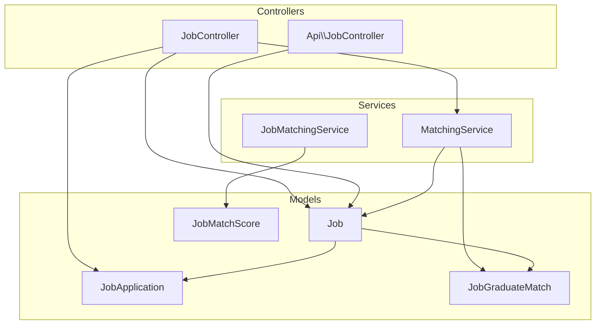

**Diagram sources**
- [Job.php:1-573](file://app/Models/Job.php#L1-L573)
- [JobApplication.php:1-162](file://app/Models/JobApplication.php#L1-L162)
- [JobGraduateMatch.php:1-191](file://app/Models/JobGraduateMatch.php#L1-L191)
- [JobMatchScore.php:1-146](file://app/Models/JobMatchScore.php#L1-L146)
- [MatchingService.php:1-493](file://app/Services/MatchingService.php#L1-L493)
- [JobMatchingService.php:1-362](file://app/Services/JobMatchingService.php#L1-L362)
- [JobController.php:1-780](file://app/Http/Controllers/JobController.php#L1-L780)
- [Api/JobController.php:1-68](file://app/Http/Controllers/Api/JobController.php#L1-L68)

**Section sources**
- [Job.php:1-573](file://app/Models/Job.php#L1-L573)
- [JobApplication.php:1-162](file://app/Models/JobApplication.php#L1-L162)
- [MatchingService.php:1-493](file://app/Services/MatchingService.php#L1-L493)
- [JobMatchingService.php:1-362](file://app/Services/JobMatchingService.php#L1-L362)
- [JobController.php:1-780](file://app/Http/Controllers/JobController.php#L1-L780)
- [Api/JobController.php:1-68](file://app/Http/Controllers/Api/JobController.php#L1-L68)

## Core Components
- Job model: encapsulates job lifecycle, approval, expiration, analytics, and recommendation dispatch.
- JobApplication model: manages application states, statuses, and metadata.
- MatchingService: computes course, skills, experience, and compatibility scores for job-graduate pairs.
- JobMatchingService: calculates user-job match scores with connections, skills, education, and circles.
- JobGraduateMatch: stores computed match data and state flags for tracking recommendations, views, and applications.
- JobMatchScore: stores user-job match scores and reasons for transparency.
- Controllers: expose job management, recommendations, analytics, and API endpoints for job saving.

**Section sources**
- [Job.php:1-573](file://app/Models/Job.php#L1-L573)
- [JobApplication.php:1-162](file://app/Models/JobApplication.php#L1-L162)
- [MatchingService.php:1-493](file://app/Services/MatchingService.php#L1-L493)
- [JobMatchingService.php:1-362](file://app/Services/JobMatchingService.php#L1-L362)
- [JobGraduateMatch.php:1-191](file://app/Models/JobGraduateMatch.php#L1-L191)
- [JobMatchScore.php:1-146](file://app/Models/JobMatchScore.php#L1-L146)
- [JobController.php:1-780](file://app/Http/Controllers/JobController.php#L1-L780)
- [Api/JobController.php:1-68](file://app/Http/Controllers/Api/JobController.php#L1-L68)

## Architecture Overview
The system integrates job posting, matching, and application workflows with employer verification and analytics. Employers post jobs, which may require approval depending on verification status. Approved jobs are matched against eligible graduates, and recommendations are tracked via JobGraduateMatch. Applications progress through defined statuses with associated analytics.

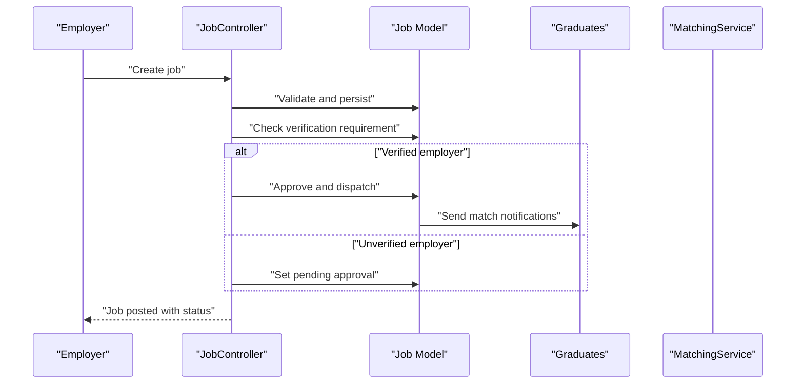

**Diagram sources**
- [JobController.php:94-149](file://app/Http/Controllers/JobController.php#L94-L149)
- [Job.php:218-234](file://app/Models/Job.php#L218-L234)
- [MatchingService.php:286-313](file://app/Services/MatchingService.php#L286-L313)

**Section sources**
- [JobController.php:94-149](file://app/Http/Controllers/JobController.php#L94-L149)
- [Job.php:218-234](file://app/Models/Job.php#L218-L234)
- [MatchingService.php:286-313](file://app/Services/MatchingService.php#L286-L313)

## Detailed Component Analysis

### Job Recommendation Algorithms
Two complementary recommendation engines operate:
- Course, skills, experience, and compatibility scoring for job-graduate pairs.
- User-job scoring considering connections, skills, education, and circles.

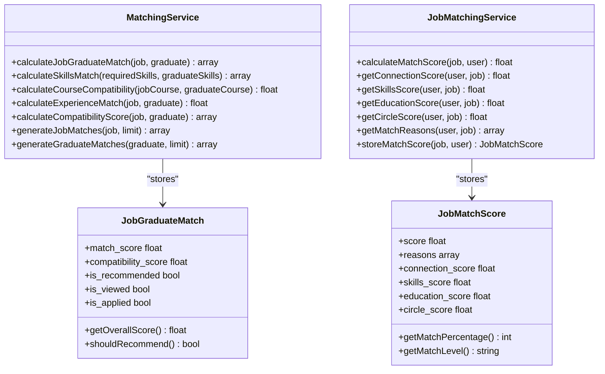

**Diagram sources**
- [MatchingService.php:14-68](file://app/Services/MatchingService.php#L14-L68)
- [JobMatchingService.php:26-41](file://app/Services/JobMatchingService.php#L26-L41)
- [JobGraduateMatch.php:12-81](file://app/Models/JobGraduateMatch.php#L12-L81)
- [JobMatchScore.php:13-65](file://app/Models/JobMatchScore.php#L13-L65)

**Section sources**
- [MatchingService.php:14-68](file://app/Services/MatchingService.php#L14-L68)
- [JobMatchingService.php:26-41](file://app/Services/JobMatchingService.php#L26-L41)
- [JobGraduateMatch.php:12-81](file://app/Models/JobGraduateMatch.php#L12-L81)
- [JobMatchScore.php:13-65](file://app/Models/JobMatchScore.php#L13-L65)

### Application Tracking and State Management
Application statuses follow a defined workflow with persistence and UI labels. The controller exposes analytics and bulk operations.

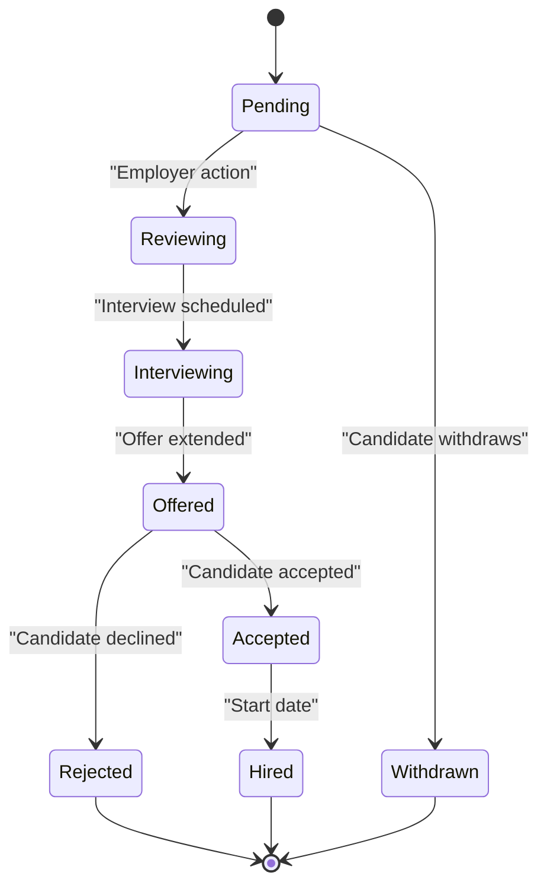

**Diagram sources**
- [JobApplication.php:39-53](file://app/Models/JobApplication.php#L39-L53)

**Section sources**
- [JobApplication.php:39-53](file://app/Models/JobApplication.php#L39-L53)
- [JobController.php:277-358](file://app/Http/Controllers/JobController.php#L277-L358)

### Employer Verification and Approval
Employer verification determines whether job postings require admin approval. The system supports multi-level verification and admin dashboards.

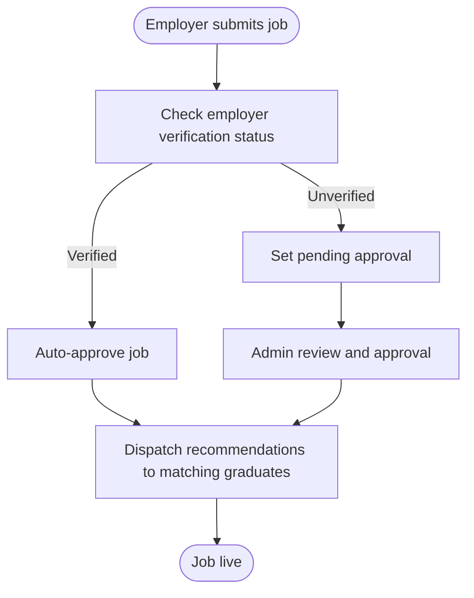

**Diagram sources**
- [JobController.php:129-142](file://app/Http/Controllers/JobController.php#L129-L142)
- [task-07-employer-registration-verification-recap.md:216-222](file://docs/task-07-employer-registration-verification-recap.md#L216-L222)

**Section sources**
- [JobController.php:129-142](file://app/Http/Controllers/JobController.php#L129-L142)
- [task-07-employer-registration-verification-recap.md:216-222](file://docs/task-07-employer-registration-verification-recap.md#L216-L222)

### Job Posting Management and Public Board
Employers can manage jobs, filter by status and dates, and access analytics. Public job board features include search, filters, and recommendations.

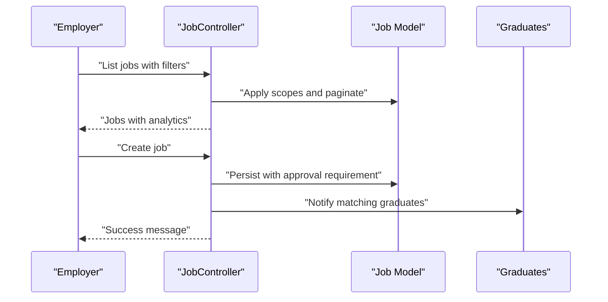

**Diagram sources**
- [JobController.php:13-83](file://app/Http/Controllers/JobController.php#L13-L83)
- [JobController.php:94-149](file://app/Http/Controllers/JobController.php#L94-L149)

**Section sources**
- [JobController.php:13-83](file://app/Http/Controllers/JobController.php#L13-L83)
- [JobController.php:94-149](file://app/Http/Controllers/JobController.php#L94-L149)
- [task-08-job-posting-management-recap.md:258-288](file://docs/task-08-job-posting-management-recap.md#L258-L288)

### Candidate Search and Matching Score Calculations
MatchingService computes composite scores and compatibility factors, while JobMatchingService provides user-centric reasons for recommendations.

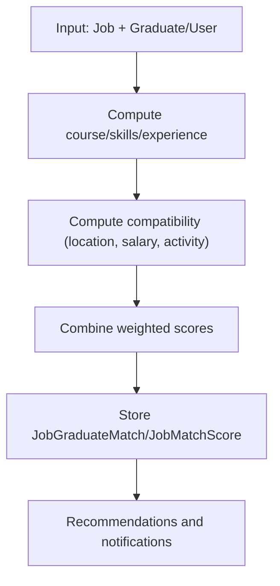

**Diagram sources**
- [MatchingService.php:14-68](file://app/Services/MatchingService.php#L14-L68)
- [JobMatchingService.php:26-41](file://app/Services/JobMatchingService.php#L26-L41)

**Section sources**
- [MatchingService.php:14-68](file://app/Services/MatchingService.php#L14-L68)
- [JobMatchingService.php:26-41](file://app/Services/JobMatchingService.php#L26-L41)

### Job Application Workflows and Interview Scheduling
Applications progress through defined states with analytics and employer tools for bulk operations and status updates.

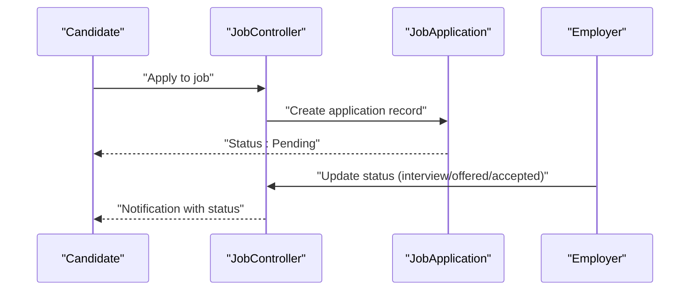

**Diagram sources**
- [JobApplication.php:39-53](file://app/Models/JobApplication.php#L39-L53)
- [JobController.php:650-681](file://app/Http/Controllers/JobController.php#L650-L681)

**Section sources**
- [JobApplication.php:39-53](file://app/Models/JobApplication.php#L39-L53)
- [JobController.php:650-681](file://app/Http/Controllers/JobController.php#L650-L681)

### Hiring Pipeline Management and Analytics
Controllers provide performance metrics, application trends, and optimization suggestions for job postings.

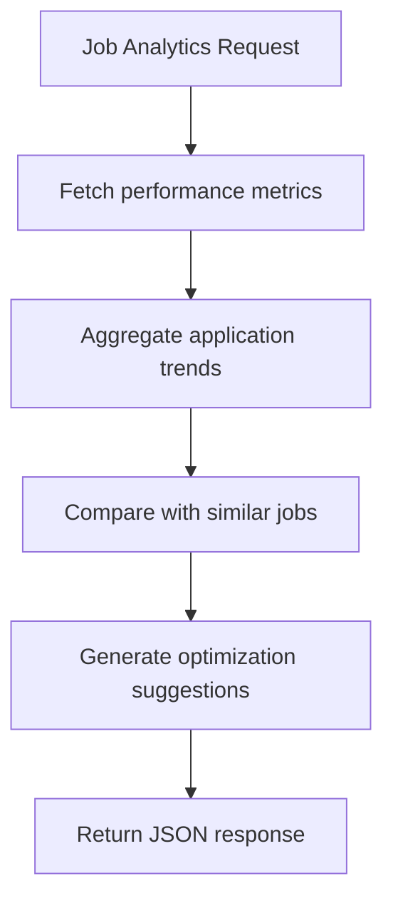

**Diagram sources**
- [JobController.php:277-358](file://app/Http/Controllers/JobController.php#L277-L358)
- [JobController.php:508-526](file://app/Http/Controllers/JobController.php#L508-L526)

**Section sources**
- [JobController.php:277-358](file://app/Http/Controllers/JobController.php#L277-L358)
- [JobController.php:508-526](file://app/Http/Controllers/JobController.php#L508-L526)

### Job Analytics, Placement Statistics, and Career Outcome Tracking
The system tracks engagement, conversion, and quality metrics for jobs and provides optimization recommendations.

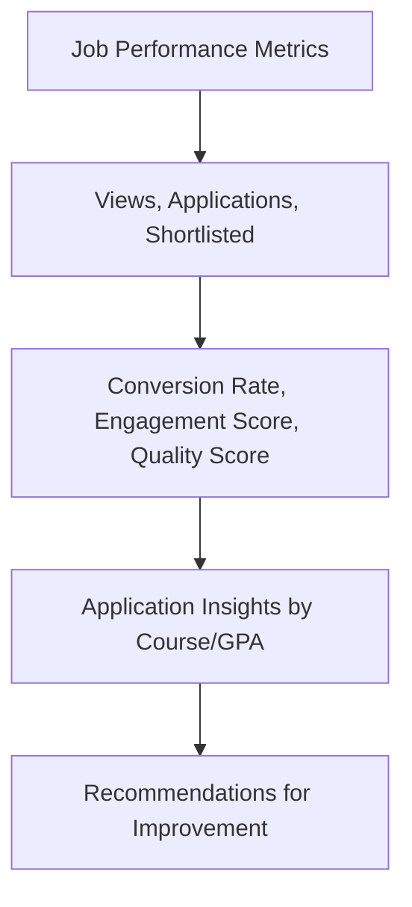

**Diagram sources**
- [Job.php:381-469](file://app/Models/Job.php#L381-L469)
- [Job.php:499-536](file://app/Models/Job.php#L499-L536)

**Section sources**
- [Job.php:381-469](file://app/Models/Job.php#L381-L469)
- [Job.php:499-536](file://app/Models/Job.php#L499-L536)

### Examples and Transparency
- Recommendation scoring: JobGraduateMatch stores match_score, compatibility_score, and factors for transparency.
- Application state management: JobApplication constants define statuses and helper methods for UI labeling.
- Employer-graduate communication: Recommendations and notifications are dispatched through the system.

**Section sources**
- [JobGraduateMatch.php:12-81](file://app/Models/JobGraduateMatch.php#L12-L81)
- [JobApplication.php:39-53](file://app/Models/JobApplication.php#L39-L53)
- [Job.php:315-337](file://app/Models/Job.php#L315-L337)

### Job Board Integration and External Synchronization
External job source synchronization and job board integration are supported through:
- Public job board with search and filters
- Saved searches and alerts
- Integration points for external sources (conceptual)

[No sources needed since this section provides general guidance]

## Dependency Analysis
The system exhibits clear separation of concerns:
- Controllers depend on models and services for orchestration.
- Services encapsulate matching logic and persistence.
- Models define relationships and computed attributes.

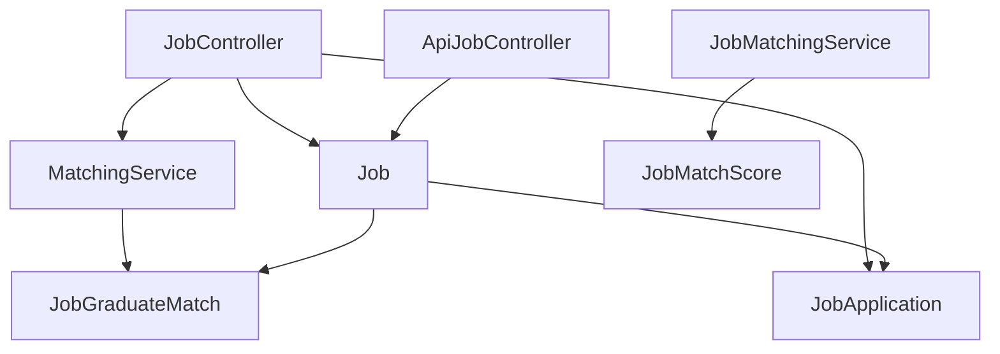

**Diagram sources**
- [JobController.php:1-780](file://app/Http/Controllers/JobController.php#L1-L780)
- [Api/JobController.php:1-68](file://app/Http/Controllers/Api/JobController.php#L1-L68)
- [MatchingService.php:1-493](file://app/Services/MatchingService.php#L1-L493)
- [JobMatchingService.php:1-362](file://app/Services/JobMatchingService.php#L1-L362)
- [Job.php:1-573](file://app/Models/Job.php#L1-L573)
- [JobGraduateMatch.php:1-191](file://app/Models/JobGraduateMatch.php#L1-L191)
- [JobMatchScore.php:1-146](file://app/Models/JobMatchScore.php#L1-L146)

**Section sources**
- [JobController.php:1-780](file://app/Http/Controllers/JobController.php#L1-L780)
- [Api/JobController.php:1-68](file://app/Http/Controllers/Api/JobController.php#L1-L68)
- [MatchingService.php:1-493](file://app/Services/MatchingService.php#L1-L493)
- [JobMatchingService.php:1-362](file://app/Services/JobMatchingService.php#L1-L362)
- [Job.php:1-573](file://app/Models/Job.php#L1-L573)
- [JobGraduateMatch.php:1-191](file://app/Models/JobGraduateMatch.php#L1-L191)
- [JobMatchScore.php:1-146](file://app/Models/JobMatchScore.php#L1-L146)

## Performance Considerations
- Batch processing and incremental updates for match calculations.
- Caching strategies for frequently accessed recommendations and statistics.
- Database optimization with proper indexing and pagination.
- Background processing for recommendation dispatch and analytics snapshots.

**Section sources**
- [task-11-search-matching-system-recap.md:389-405](file://docs/task-11-search-matching-system-recap.md#L389-L405)
- [MatchingService.php:361-372](file://app/Services/MatchingService.php#L361-L372)
- [MatchingService.php:425-439](file://app/Services/MatchingService.php#L425-L439)

## Troubleshooting Guide
Common issues and resolutions:
- Job not appearing in recommendations: verify employer verification status and approval workflow.
- Application status not updating: confirm controller actions and JobApplication scopes.
- Matching score discrepancies: review MatchingService and JobMatchingService calculations and stored factors.

**Section sources**
- [JobController.php:129-142](file://app/Http/Controllers/JobController.php#L129-L142)
- [JobApplication.php:145-160](file://app/Models/JobApplication.php#L145-L160)
- [MatchingService.php:14-68](file://app/Services/MatchingService.php#L14-L68)
- [JobMatchingService.php:26-41](file://app/Services/JobMatchingService.php#L26-L41)

## Conclusion
The job matching system provides robust job posting, recommendation, and application management with strong employer verification and analytics. The dual matching engines ensure comprehensive coverage of job-candidate compatibility, while transparent scoring and state management enable clear tracking and optimization.