# Mentorship & Skills

<cite>
**Referenced Files in This Document**
- [routes/api.php](file://routes/api.php)
- [routes/user-flows.php](file://routes/user-flows.php)
- [app/Http/Controllers/Api/MentorshipController.php](file://app/Http/Controllers/Api/MentorshipController.php)
- [app/Http/Controllers/Api/SkillsController.php](file://app/Http/Controllers/Api/SkillsController.php)
- [app/Services/MentorshipService.php](file://app/Services/MentorshipService.php)
- [app/Services/CalendarIntegrationService.php](file://app/Services/CalendarIntegrationService.php)
- [app/Services/StudentCareerGuidanceController.php](file://app/Services/StudentCareerGuidanceController.php)
- [app/Models/MentorProfile.php](file://app/Models/MentorProfile.php)
- [app/Models/MentorshipRequest.php](file://app/Models/MentorshipRequest.php)
- [app/Models/MentorshipSession.php](file://app/Models/MentorshipSession.php)
- [app/Models/Skill.php](file://app/Models/Skill.php)
- [app/Models/SkillEndorsement.php](file://app/Models/SkillEndorsement.php)
- [app/Models/LearningResource.php](file://app/Models/LearningResource.php)
- [app/Models/Course.php](file://app/Models/Course.php)
- [resources/js/Pages/Career/MentorshipHub.vue](file://resources/js/Pages/Career/MentorshipHub.vue)
- [resources/js/components/MentorshipDashboard.vue](file://resources/js/components/MentorshipDashboard.vue)
- [resources/js/components/SkillsProfile.vue](file://resources/js/components/SkillsProfile.vue)
- [resources/js/components/SkillEndorsement.vue](file://resources/js/components/SkillEndorsement.vue)
- [resources/js/components/SkillProgression.vue](file://resources/js/components/SkillProgression.vue)
</cite>

## Table of Contents
1. [Introduction](#introduction)
2. [Project Structure](#project-structure)
3. [Core Components](#core-components)
4. [Architecture Overview](#architecture-overview)
5. [Detailed Component Analysis](#detailed-component-analysis)
6. [Dependency Analysis](#dependency-analysis)
7. [Performance Considerations](#performance-considerations)
8. [Troubleshooting Guide](#troubleshooting-guide)
9. [Conclusion](#conclusion)
10. [Appendices](#appendices)

## Introduction
This document provides comprehensive API documentation for the mentorship and skills development systems. It covers mentor profile management, skill assessment and endorsement, learning pathway recommendations, mentorship request workflows, session scheduling, progress tracking, skills inventory, competency mapping, learning resource integration, course enrollment, and certification tracking. It also includes examples of mentor-mentee matching algorithms, skill gap analysis, professional development planning, skills-based networking, and competency-based career guidance.

## Project Structure
The mentorship and skills systems are implemented as Laravel API endpoints with dedicated controllers and services. Routes are grouped under middleware requiring Sanctum authentication. Frontend components integrate with these APIs to provide interactive dashboards for mentorship and skills.

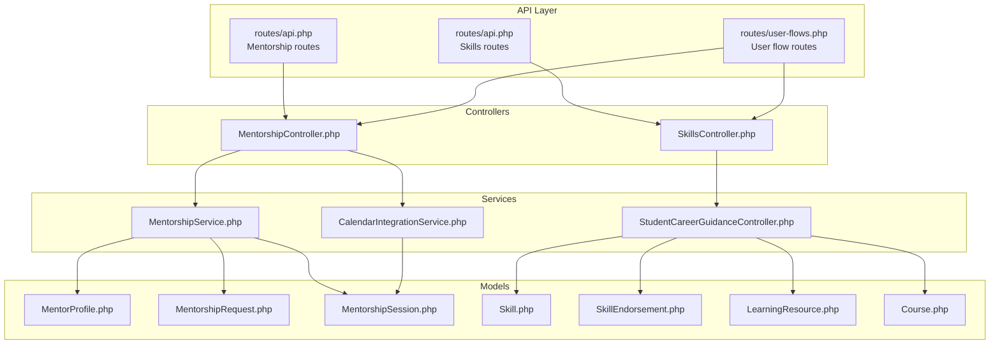

**Diagram sources**
- [routes/api.php:195-251](file://routes/api.php#L195-L251)
- [routes/user-flows.php:66-93](file://routes/user-flows.php#L66-L93)
- [app/Http/Controllers/Api/MentorshipController.php:14-338](file://app/Http/Controllers/Api/MentorshipController.php#L14-L338)
- [app/Http/Controllers/Api/SkillsController.php:13-246](file://app/Http/Controllers/Api/SkillsController.php#L13-L246)
- [app/Services/MentorshipService.php:15-308](file://app/Services/MentorshipService.php#L15-L308)
- [app/Services/CalendarIntegrationService.php:373-417](file://app/Services/CalendarIntegrationService.php#L373-L417)
- [app/Services/StudentCareerGuidanceController.php:497-522](file://app/Services/StudentCareerGuidanceController.php#L497-L522)
- [app/Models/MentorProfile.php](file://app/Models/MentorProfile.php)
- [app/Models/MentorshipRequest.php](file://app/Models/MentorshipRequest.php)
- [app/Models/MentorshipSession.php](file://app/Models/MentorshipSession.php)
- [app/Models/Skill.php](file://app/Models/Skill.php)
- [app/Models/SkillEndorsement.php](file://app/Models/SkillEndorsement.php)
- [app/Models/LearningResource.php](file://app/Models/LearningResource.php)
- [app/Models/Course.php](file://app/Models/Course.php)

**Section sources**
- [routes/api.php:195-251](file://routes/api.php#L195-L251)
- [routes/user-flows.php:66-93](file://routes/user-flows.php#L66-L93)

## Core Components
- MentorshipController: Handles mentor profile creation/update, mentor discovery, mentorship requests, session scheduling, completion, and analytics retrieval.
- SkillsController: Manages skills inventory, endorsements, assessments, recommendations, and learning resource integration.
- MentorshipService: Implements matching algorithms, availability checks, analytics computation, and session scheduling.
- CalendarIntegrationService: Integrates calendar events for scheduled mentorship sessions.
- StudentCareerGuidanceController: Provides career recommendations and skill gap analysis.
- Models: Represent domain entities including mentor profiles, requests, sessions, skills, endorsements, learning resources, and courses.

**Section sources**
- [app/Http/Controllers/Api/MentorshipController.php:14-338](file://app/Http/Controllers/Api/MentorshipController.php#L14-L338)
- [app/Http/Controllers/Api/SkillsController.php:13-246](file://app/Http/Controllers/Api/SkillsController.php#L13-L246)
- [app/Services/MentorshipService.php:15-308](file://app/Services/MentorshipService.php#L15-L308)
- [app/Services/CalendarIntegrationService.php:373-417](file://app/Services/CalendarIntegrationService.php#L373-L417)
- [app/Services/StudentCareerGuidanceController.php:497-522](file://app/Services/StudentCareerGuidanceController.php#L497-L522)

## Architecture Overview
The system follows a layered architecture:
- API routes define entry points for mentorship and skills operations.
- Controllers orchestrate requests, validate inputs, and delegate to services.
- Services encapsulate business logic for matching, scheduling, analytics, and recommendations.
- Models represent data structures and relationships.
- Frontend Vue components consume the API for user interactions.

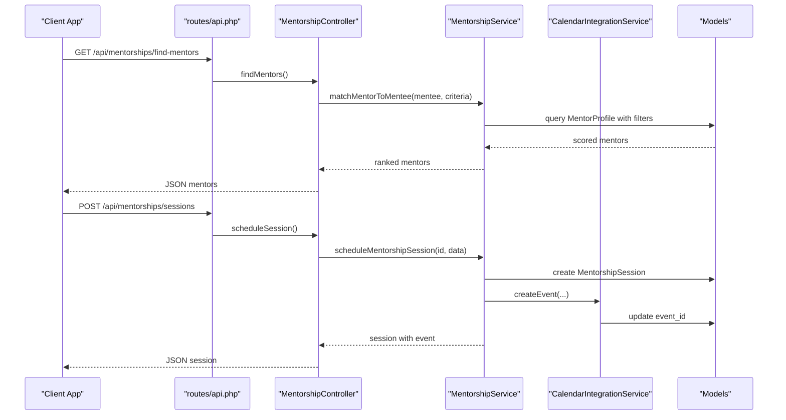

**Diagram sources**
- [routes/api.php:195-216](file://routes/api.php#L195-L216)
- [app/Http/Controllers/Api/MentorshipController.php:58-198](file://app/Http/Controllers/Api/MentorshipController.php#L58-L198)
- [app/Services/MentorshipService.php:17-306](file://app/Services/MentorshipService.php#L17-L306)
- [app/Services/CalendarIntegrationService.php:380-415](file://app/Services/CalendarIntegrationService.php#L380-L415)

## Detailed Component Analysis

### Mentorship System
- Mentor profile management: Become mentor, get profile, update profile, analytics.
- Mentor discovery and matching: Find mentors by expertise areas and availability.
- Mentorship requests: Send, accept, decline requests.
- Session management: Schedule, complete sessions, upcoming sessions.
- Analytics: Total mentorships, active, completed, sessions, completion rate, average rating, available slots.

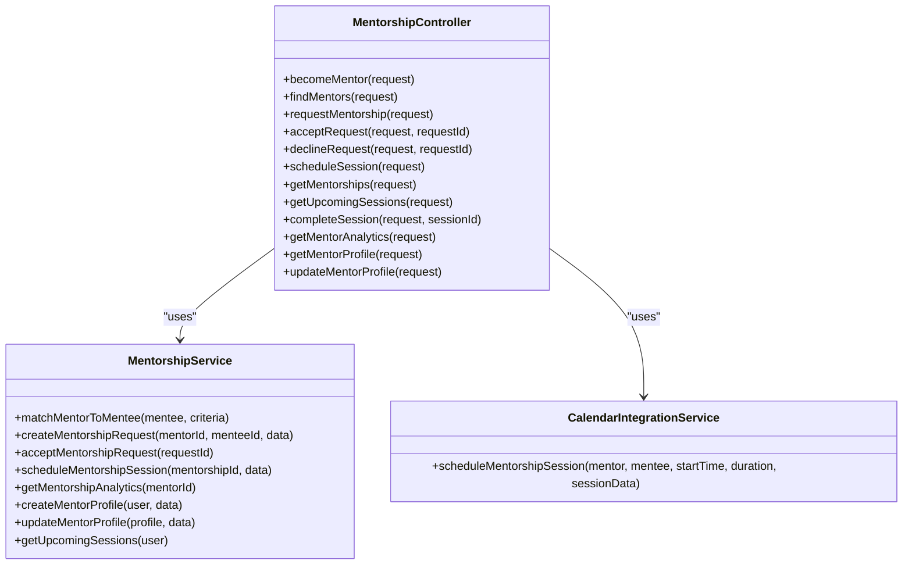

**Diagram sources**
- [app/Http/Controllers/Api/MentorshipController.php:14-338](file://app/Http/Controllers/Api/MentorshipController.php#L14-L338)
- [app/Services/MentorshipService.php:15-308](file://app/Services/MentorshipService.php#L15-L308)
- [app/Services/CalendarIntegrationService.php:373-417](file://app/Services/CalendarIntegrationService.php#L373-L417)

**Section sources**
- [routes/api.php:195-216](file://routes/api.php#L195-L216)
- [app/Http/Controllers/Api/MentorshipController.php:20-338](file://app/Http/Controllers/Api/MentorshipController.php#L20-L338)
- [app/Services/MentorshipService.php:17-306](file://app/Services/MentorshipService.php#L17-L306)
- [app/Services/CalendarIntegrationService.php:380-415](file://app/Services/CalendarIntegrationService.php#L380-L415)

### Skills Development System
- Skills inventory: Add, update, remove skills; endorse skills; get user skills.
- Endorsement system: Request endorsement, approve endorsement, manage endorsement requests.
- Competency mapping: Track proficiency levels, years of experience, endorsements.
- Learning resources: Search, rate, and recommend learning resources aligned to skills.
- Gap analysis: Compare current skills vs recommended skills for career paths.

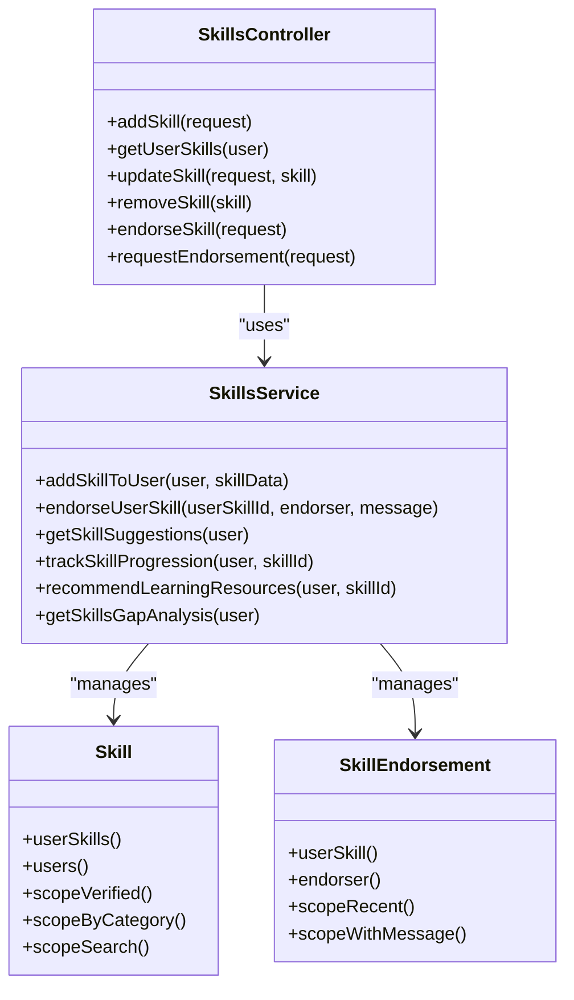

**Diagram sources**
- [app/Http/Controllers/Api/SkillsController.php:13-246](file://app/Http/Controllers/Api/SkillsController.php#L13-L246)
- [app/Services/StudentCareerGuidanceController.php:497-522](file://app/Services/StudentCareerGuidanceController.php#L497-L522)
- [app/Models/Skill.php:9-52](file://app/Models/Skill.php#L9-L52)
- [app/Models/SkillEndorsement.php:9-52](file://app/Models/SkillEndorsement.php#L9-L52)

**Section sources**
- [routes/api.php:233-251](file://routes/api.php#L233-L251)
- [app/Http/Controllers/Api/SkillsController.php:20-246](file://app/Http/Controllers/Api/SkillsController.php#L20-L246)
- [app/Services/StudentCareerGuidanceController.php:497-522](file://app/Services/StudentCareerGuidanceController.php#L497-L522)
- [app/Models/Skill.php:24-34](file://app/Models/Skill.php#L24-L34)
- [app/Models/SkillEndorsement.php:19-27](file://app/Models/SkillEndorsement.php#L19-L27)

### Learning Resource Integration
- LearningResource model supports skill association, ratings, popularity, and type-based filtering.
- SkillsService recommends resources based on proficiency level and skill alignment.

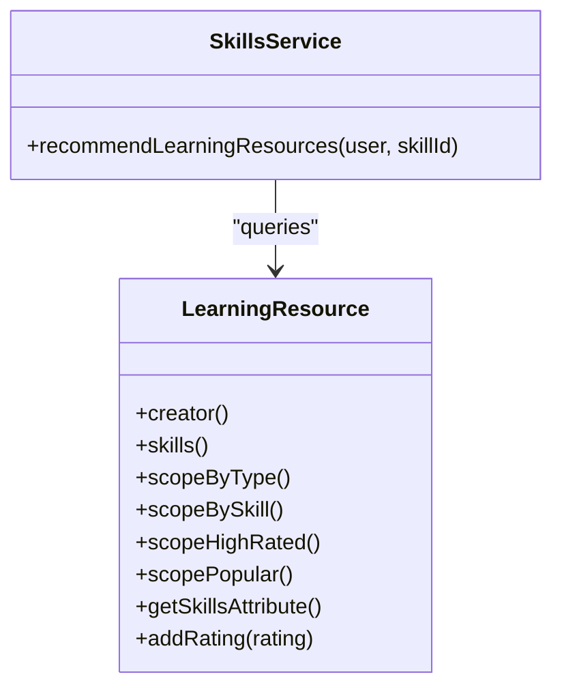

**Diagram sources**
- [app/Models/LearningResource.php:9-77](file://app/Models/LearningResource.php#L9-L77)
- [app/Services/StudentCareerGuidanceController.php:116-135](file://app/Services/StudentCareerGuidanceController.php#L116-L135)

**Section sources**
- [app/Models/LearningResource.php:30-76](file://app/Models/LearningResource.php#L30-L76)
- [app/Services/StudentCareerGuidanceController.php:116-135](file://app/Services/StudentCareerGuidanceController.php#L116-L135)

### Course Enrollment and Certification Tracking
- Course model encapsulates course metadata, statistics, employment outcomes, and skills mapping.
- Integration points enable course enrollment and tracking of completion and employment rates.

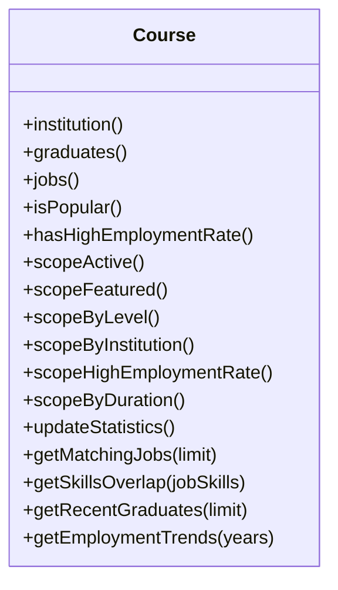

**Diagram sources**
- [app/Models/Course.php:9-200](file://app/Models/Course.php#L9-L200)

**Section sources**
- [app/Models/Course.php:54-198](file://app/Models/Course.php#L54-L198)

### Frontend Integration Examples
- Mentorship Hub dashboard displays active mentorships, pending requests, upcoming sessions, and provides actions to schedule sessions, accept/decline requests.
- Skills profile component shows skill cards, endorsements preview, and endorsement actions.
- Skill progression component loads progression data and recommendations for a selected skill.

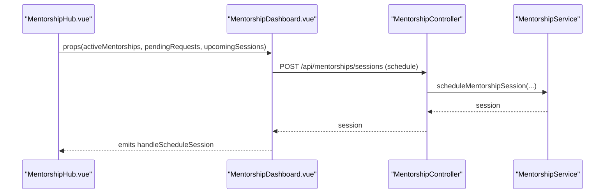

**Diagram sources**
- [resources/js/Pages/Career/MentorshipHub.vue:25-38](file://resources/js/Pages/Career/MentorshipHub.vue#L25-L38)
- [resources/js/components/MentorshipDashboard.vue:274-286](file://resources/js/components/MentorshipDashboard.vue#L274-L286)
- [routes/api.php:212-215](file://routes/api.php#L212-L215)
- [app/Http/Controllers/Api/MentorshipController.php:164-198](file://app/Http/Controllers/Api/MentorshipController.php#L164-L198)
- [app/Services/MentorshipService.php:209-229](file://app/Services/MentorshipService.php#L209-L229)

**Section sources**
- [resources/js/Pages/Career/MentorshipHub.vue:25-38](file://resources/js/Pages/Career/MentorshipHub.vue#L25-L38)
- [resources/js/components/MentorshipDashboard.vue:274-286](file://resources/js/components/MentorshipDashboard.vue#L274-L286)
- [resources/js/components/SkillsProfile.vue:46-103](file://resources/js/components/SkillsProfile.vue#L46-L103)
- [resources/js/components/SkillEndorsement.vue:79-112](file://resources/js/components/SkillEndorsement.vue#L79-L112)
- [resources/js/components/SkillProgression.vue:224-263](file://resources/js/components/SkillProgression.vue#L224-L263)

## Dependency Analysis
- Controllers depend on Services for business logic.
- Services depend on Models for persistence and queries.
- CalendarIntegrationService depends on MentorshipSession and external calendar providers.
- Frontend components depend on API endpoints defined in routes.

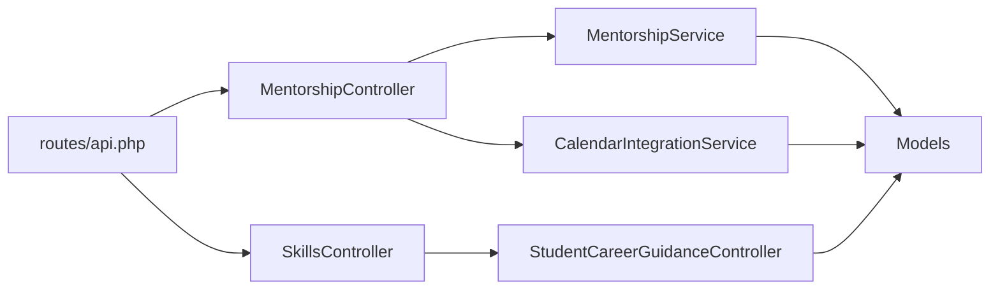

**Diagram sources**
- [routes/api.php:195-251](file://routes/api.php#L195-L251)
- [app/Http/Controllers/Api/MentorshipController.php:14-338](file://app/Http/Controllers/Api/MentorshipController.php#L14-L338)
- [app/Http/Controllers/Api/SkillsController.php:13-246](file://app/Http/Controllers/Api/SkillsController.php#L13-L246)
- [app/Services/MentorshipService.php:15-308](file://app/Services/MentorshipService.php#L15-L308)
- [app/Services/CalendarIntegrationService.php:373-417](file://app/Services/CalendarIntegrationService.php#L373-L417)
- [app/Services/StudentCareerGuidanceController.php:497-522](file://app/Services/StudentCareerGuidanceController.php#L497-L522)

**Section sources**
- [routes/api.php:195-251](file://routes/api.php#L195-L251)
- [app/Services/MentorshipService.php:17-306](file://app/Services/MentorshipService.php#L17-L306)

## Performance Considerations
- Use pagination for mentor lists and skill recommendations to limit payload sizes.
- Apply database indexing on frequently queried fields such as user_id, mentor availability, skill names, and timestamps.
- Cache recommendation results and analytics where appropriate to reduce repeated computations.
- Batch operations for bulk skill updates and endorsements to minimize database round trips.
- Optimize frontend data fetching with debounced search and lazy loading for large lists.

## Troubleshooting Guide
Common issues and resolutions:
- Authentication failures: Ensure requests include a valid Sanctum token.
- Validation errors: Verify request payloads conform to controller validation rules.
- Mentor availability conflicts: Check availability scoring and slot limits before scheduling sessions.
- Endorsement errors: Confirm connection status and endorsement request state before approving.
- Calendar integration failures: Validate calendar provider credentials and event creation parameters.

**Section sources**
- [app/Http/Controllers/Api/MentorshipController.php:20-106](file://app/Http/Controllers/Api/MentorshipController.php#L20-L106)
- [app/Http/Controllers/Api/SkillsController.php:61-131](file://app/Http/Controllers/Api/SkillsController.php#L61-L131)
- [app/Services/MentorshipService.php:189-207](file://app/Services/MentorshipService.php#L189-L207)

## Conclusion
The mentorship and skills systems provide a robust foundation for professional development, networking, and career guidance. The modular design with controllers, services, and models enables scalable enhancements while maintaining clear separation of concerns. The documented APIs and frontend integrations support comprehensive functionality from mentor discovery to skill mastery and career transitions.

## Appendices

### API Reference: Mentorship
- Become Mentor
  - Method: POST
  - Endpoint: /api/mentorships/become-mentor
  - Authenticated: Yes
  - Body: bio, expertise_areas[], availability, max_mentees
  - Response: MentorProfile with user relation
- Get Mentor Profile
  - Method: GET
  - Endpoint: /api/mentorships/profile
  - Response: MentorProfile
- Update Mentor Profile
  - Method: PUT
  - Endpoint: /api/mentorships/profile
  - Response: MentorProfile
- Find Mentors
  - Method: GET
  - Endpoint: /api/mentorships/find-mentors?expertise_areas[]=...&availability=...&limit=...
  - Response: Array of mentors with user education and career timelines
- Request Mentorship
  - Method: POST
  - Endpoint: /api/mentorships/request
  - Body: mentor_id, message, goals, duration_months
  - Response: MentorshipRequest with mentor and mentee relations
- Accept Request
  - Method: POST
  - Endpoint: /api/mentorships/requests/{requestId}/accept
  - Response: MentorshipRequest
- Decline Request
  - Method: POST
  - Endpoint: /api/mentorships/requests/{requestId}/decline
  - Response: Success message
- Schedule Session
  - Method: POST
  - Endpoint: /api/mentorships/sessions
  - Body: mentorship_id, scheduled_at, duration, notes
  - Response: MentorshipSession with mentorship relations
- Upcoming Sessions
  - Method: GET
  - Endpoint: /api/mentorships/sessions/upcoming
  - Response: Array of sessions
- Complete Session
  - Method: POST
  - Endpoint: /api/mentorships/sessions/{sessionId}/complete
  - Body: notes, rating, feedback
  - Response: MentorshipSession
- Mentor Analytics
  - Method: GET
  - Endpoint: /api/mentorships/analytics
  - Response: Analytics summary

**Section sources**
- [routes/api.php:195-216](file://routes/api.php#L195-L216)
- [app/Http/Controllers/Api/MentorshipController.php:20-338](file://app/Http/Controllers/Api/MentorshipController.php#L20-L338)

### API Reference: Skills
- Add Skill
  - Method: POST
  - Endpoint: /api/users/skills
  - Body: skill
  - Response: Success message and skill data
- Get User Skills
  - Method: GET
  - Endpoint: /api/users/{userId}/skills
  - Response: Array of skills with pivot data and endorsement counts
- Update Skill
  - Method: PUT
  - Endpoint: /api/skills/{skill}
  - Body: proficiency_level, years_of_experience
  - Response: Success message
- Remove Skill
  - Method: DELETE
  - Endpoint: /api/skills/{skill}
  - Response: Success message
- Endorse Skill
  - Method: POST
  - Endpoint: /api/skills/endorse
  - Body: endorsement_request_id, comment
  - Response: Success message
- Request Endorsement
  - Method: POST
  - Endpoint: /api/skills/request-endorsement
  - Body: skill_id, endorser_id, message
  - Response: Success message
- Get Skill Suggestions
  - Method: GET
  - Endpoint: /api/skills/suggestions
  - Response: Array of suggested skills
- Get Skill Progression
  - Method: GET
  - Endpoint: /api/skills/{skillId}/progression
  - Response: Progression metrics and endorsement history
- Get Learning Recommendations
  - Method: GET
  - Endpoint: /api/skills/{skillId}/recommendations
  - Response: Recommended learning resources
- Get Skills Gap Analysis
  - Method: GET
  - Endpoint: /api/skills/gap-analysis
  - Response: Current skills, recommended skills, gaps
- Get Learning Resources
  - Method: GET
  - Endpoint: /api/learning-resources
  - Response: Array of learning resources
- Create Learning Resource
  - Method: POST
  - Endpoint: /api/learning-resources
  - Response: Created resource
- Rate Learning Resource
  - Method: POST
  - Endpoint: /api/learning-resources/{resource}/rate
  - Response: Success message

**Section sources**
- [routes/api.php:233-251](file://routes/api.php#L233-L251)
- [app/Http/Controllers/Api/SkillsController.php:20-246](file://app/Http/Controllers/Api/SkillsController.php#L20-L246)

### Mentor-mentee Matching Algorithm
The matching algorithm computes a composite score based on:
- Industry/role alignment (40% weight)
- Career stage compatibility (30% weight)
- Geographic proximity (15% weight)
- Availability match (15% weight)

Scoring details:
- Industry alignment: Jaccard similarity of industries between mentor and mentee timelines.
- Career stage compatibility: Experience gap ideal range 5–15 years; scores decrease with wider gaps.
- Location score: Exact match = 1.0, same region ≈ 0.7, otherwise ≈ 0.3.
- Availability score: Ratio of remaining slots to max capacity, adjusted by availability level (high/medium/low).

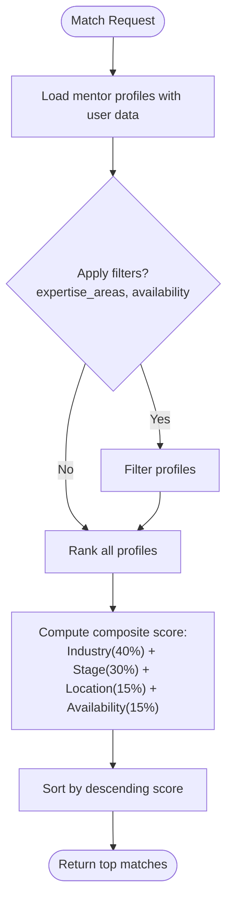

**Diagram sources**
- [app/Services/MentorshipService.php:17-50](file://app/Services/MentorshipService.php#L17-L50)
- [app/Services/MentorshipService.php:52-160](file://app/Services/MentorshipService.php#L52-L160)

**Section sources**
- [app/Services/MentorshipService.php:42-74](file://app/Services/MentorshipService.php#L42-L74)
- [app/Services/MentorshipService.php:76-118](file://app/Services/MentorshipService.php#L76-L118)
- [app/Services/MentorshipService.php:120-160](file://app/Services/MentorshipService.php#L120-L160)

### Skill Gap Analysis
The gap analysis compares:
- Current skills: Skills attached to the user with proficiency and experience.
- Recommended skills: Derived from career timelines, connections, and industry trends.
- Gaps: Skills present in recommended but absent in current skill set.

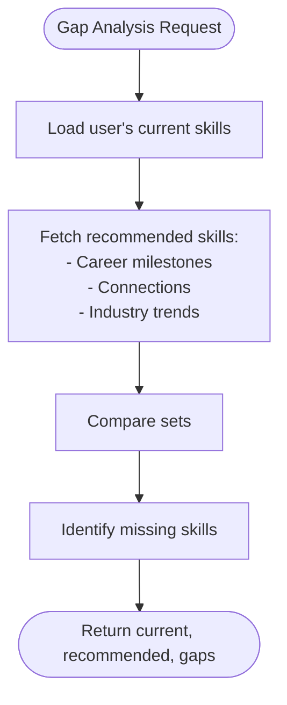

**Diagram sources**
- [app/Services/StudentCareerGuidanceController.php:137-155](file://app/Services/StudentCareerGuidanceController.php#L137-L155)

**Section sources**
- [app/Services/StudentCareerGuidanceController.php:137-155](file://app/Services/StudentCareerGuidanceController.php#L137-L155)

### Professional Development Planning
Recommendations are generated based on user goals, networking level, challenges, and industry insights. Example categories include networking strategy, salary negotiation, job search strategy, professional development, leadership development, and opportunity discovery.

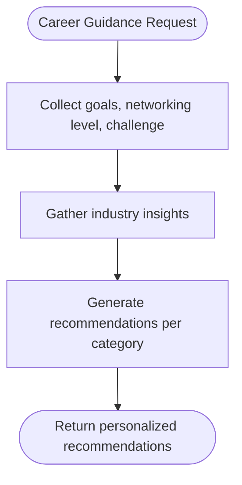

**Diagram sources**
- [app/Services/StudentCareerGuidanceController.php:345-406](file://app/Services/StudentCareerGuidanceController.php#L345-L406)

**Section sources**
- [app/Services/StudentCareerGuidanceController.php:345-406](file://app/Services/StudentCareerGuidanceController.php#L345-L406)