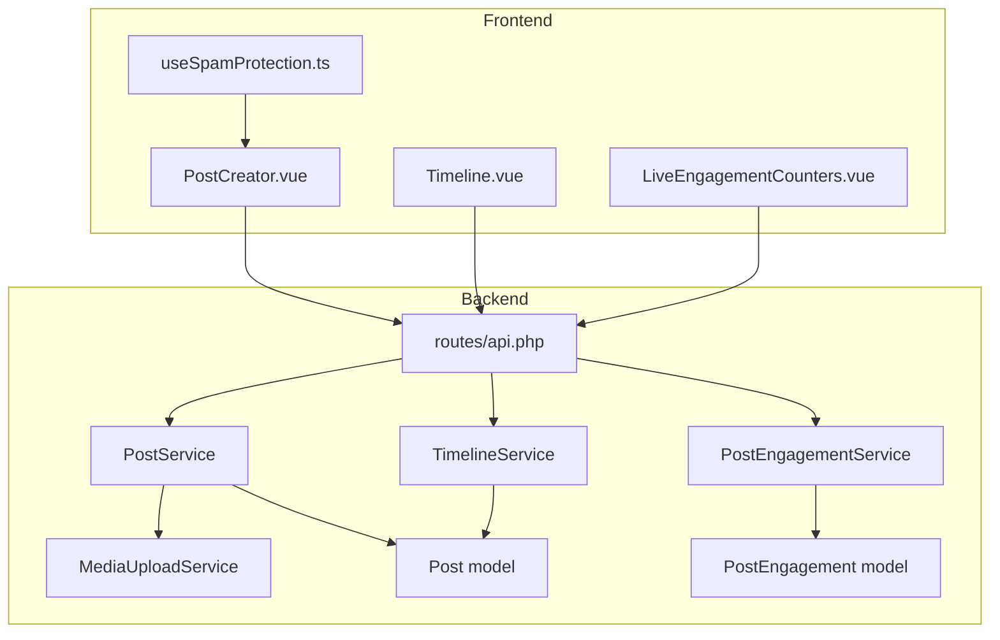
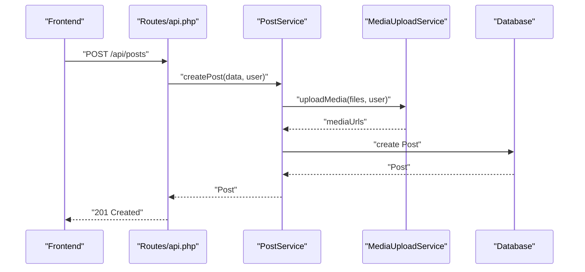
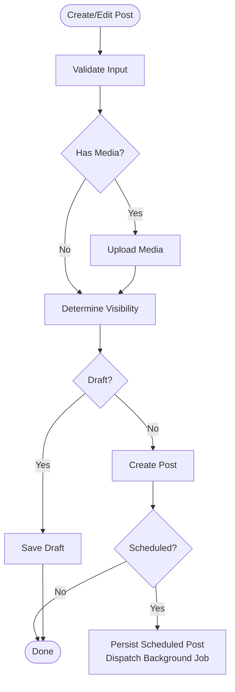
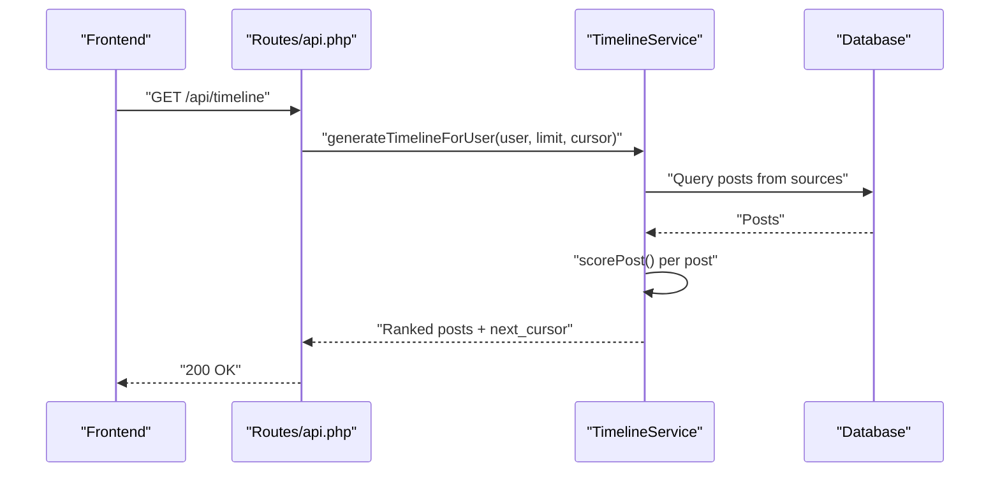
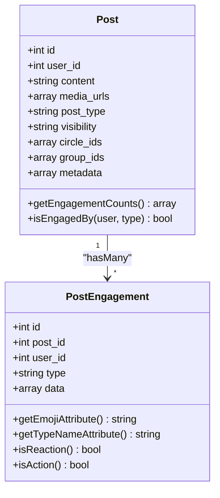
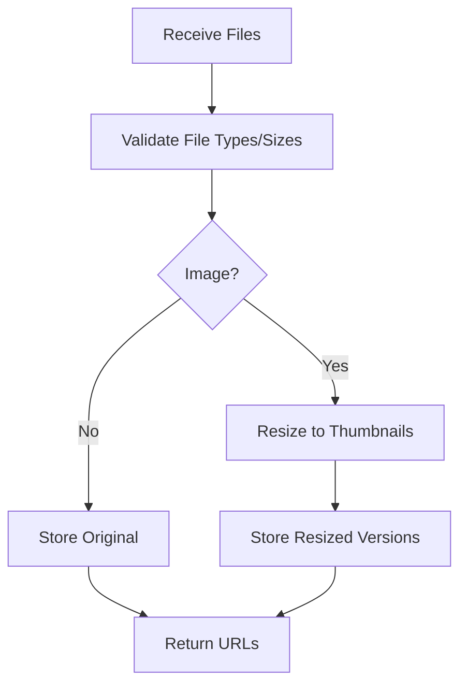
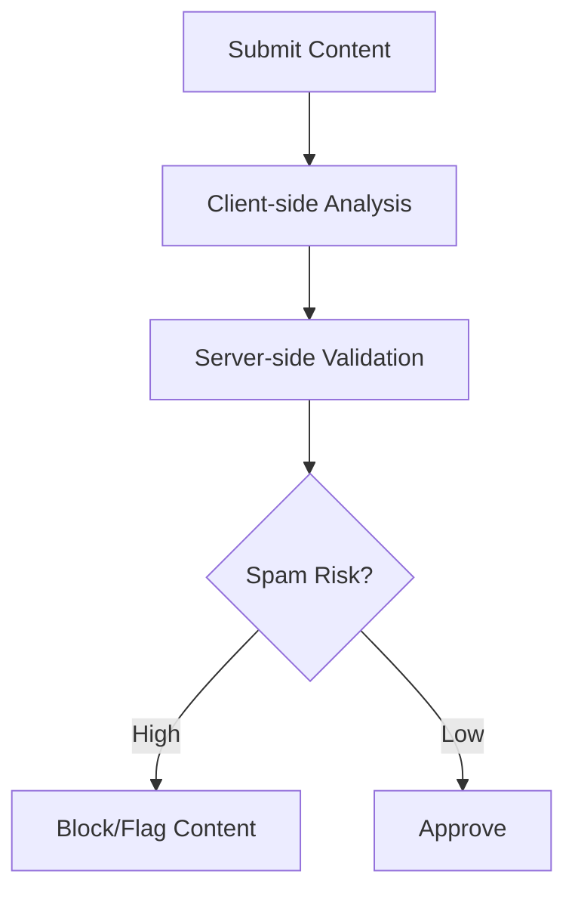
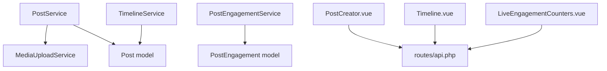

# Posts, Timeline & Engagement

<cite>
**Referenced Files in This Document**
- [PostService.php](file://app/Services/PostService.php)
- [TimelineService.php](file://app/Services/TimelineService.php)
- [PostEngagementService.php](file://app/Services/PostEngagementService.php)
- [MediaUploadService.php](file://app/Services/MediaUploadService.php)
- [Post.php](file://app/Models/Post.php)
- [PostEngagement.php](file://app/Models/PostEngagement.php)
- [api.php](file://routes/api.php)
- [ContentFilter.php](file://app/Rules/ContentFilter.php)
- [SpamProtection.php](file://app/Rules/SpamProtection.php)
- [useSpamProtection.ts](file://resources/js/composables/useSpamProtection.ts)
- [PostCreator.vue](file://resources/js/components/PostCreator.vue)
- [Timeline.vue](file://resources/js/Pages/Social/Timeline.vue)
- [LiveEngagementCounters.vue](file://resources/js/components/LiveEngagementCounters.vue)
- [AnalyticsService.php](file://app/Services/AnalyticsService.php)
- [PublishScheduledPostJob.php](file://app/Jobs/PublishScheduledPostJob.php)
- [TimelineControllerTest.php](file://tests/Feature/TimelineControllerTest.php)
- [TimelineServiceTest.php](file://tests/Unit/TimelineServiceTest.php)
- [PostEngagementServiceTest.php](file://tests/Unit/PostEngagementServiceTest.php)
- [TimelineServiceIntegrationTest.php](file://tests/Unit/TimelineServiceIntegrationTest.php)
</cite>

## Table of Contents
1. [Introduction](#introduction)
2. [Project Structure](#project-structure)
3. [Core Components](#core-components)
4. [Architecture Overview](#architecture-overview)
5. [Detailed Component Analysis](#detailed-component-analysis)
6. [Dependency Analysis](#dependency-analysis)
7. [Performance Considerations](#performance-considerations)
8. [Troubleshooting Guide](#troubleshooting-guide)
9. [Conclusion](#conclusion)

## Introduction
This document provides comprehensive API documentation for social content and engagement features. It covers post creation, editing, publishing, and scheduling workflows; timeline aggregation, personalization, and feed optimization; engagement metrics (likes, comments, shares, reactions); media upload handling; content moderation and spam prevention; analytics and engagement tracking; and content filtering and privacy controls.

## Project Structure
The social content system is implemented across Laravel backend services and Vue frontend components:
- Backend services encapsulate post lifecycle, timeline generation, engagement tracking, media handling, and analytics.
- Frontend components provide the post creation UI, timeline rendering, live engagement counters, and spam protection utilities.
- Routes define the REST endpoints for posts, timeline, and engagement.

**Diagram sources**
- [PostCreator.vue:286-616](file://resources/js/components/PostCreator.vue#L286-L616)
- [Timeline.vue:307-349](file://resources/js/Pages/Social/Timeline.vue#L307-L349)
- [LiveEngagementCounters.vue:287-332](file://resources/js/components/LiveEngagementCounters.vue#L287-L332)
- [useSpamProtection.ts:187-265](file://resources/js/composables/useSpamProtection.ts#L187-L265)
- [PostService.php:13-264](file://app/Services/PostService.php#L13-L264)
- [TimelineService.php:11-396](file://app/Services/TimelineService.php#L11-L396)
- [PostEngagementService.php:203-231](file://app/Services/PostEngagementService.php#L203-L231)
- [MediaUploadService.php:10-176](file://app/Services/MediaUploadService.php#L10-L176)
- [Post.php:11-226](file://app/Models/Post.php#L11-L226)
- [PostEngagement.php:9-139](file://app/Models/PostEngagement.php#L9-L139)
- [api.php:89-127](file://routes/api.php#L89-L127)

**Section sources**
- [api.php:89-127](file://routes/api.php#L89-L127)
- [PostService.php:13-264](file://app/Services/PostService.php#L13-L264)
- [TimelineService.php:11-396](file://app/Services/TimelineService.php#L11-L396)
- [PostEngagementService.php:203-231](file://app/Services/PostEngagementService.php#L203-L231)
- [MediaUploadService.php:10-176](file://app/Services/MediaUploadService.php#L10-L176)
- [Post.php:11-226](file://app/Models/Post.php#L11-L226)
- [PostEngagement.php:9-139](file://app/Models/PostEngagement.php#L9-L139)
- [PostCreator.vue:286-616](file://resources/js/components/PostCreator.vue#L286-L616)
- [Timeline.vue:307-349](file://resources/js/Pages/Social/Timeline.vue#L307-L349)
- [LiveEngagementCounters.vue:287-332](file://resources/js/components/LiveEngagementCounters.vue#L287-L332)
- [useSpamProtection.ts:187-265](file://resources/js/composables/useSpamProtection.ts#L187-L265)

## Core Components
- PostService: Handles post creation, updates, deletions, drafts, scheduling, and media uploads.
- TimelineService: Aggregates posts from multiple sources, scores and ranks them, and caches results.
- PostEngagementService: Manages likes, comments, shares, reactions, and user engagement state.
- MediaUploadService: Validates and stores media files, generates thumbnails, and cleans up.
- Post and PostEngagement models: Define persistence and relationships for posts and engagements.
- Frontend components: Provide UI for creating posts, viewing timelines, and displaying live engagement.
- Spam protection: Client-side and server-side rules to prevent spam and abusive content.

**Section sources**
- [PostService.php:13-264](file://app/Services/PostService.php#L13-L264)
- [TimelineService.php:11-396](file://app/Services/TimelineService.php#L11-L396)
- [PostEngagementService.php:203-231](file://app/Services/PostEngagementService.php#L203-L231)
- [MediaUploadService.php:10-176](file://app/Services/MediaUploadService.php#L10-L176)
- [Post.php:11-226](file://app/Models/Post.php#L11-L226)
- [PostEngagement.php:9-139](file://app/Models/PostEngagement.php#L9-L139)
- [ContentFilter.php:122-167](file://app/Rules/ContentFilter.php#L122-L167)
- [SpamProtection.php:8-305](file://app/Rules/SpamProtection.php#L8-L305)
- [useSpamProtection.ts:187-265](file://resources/js/composables/useSpamProtection.ts#L187-L265)

## Architecture Overview
The system follows a layered architecture:
- API layer defines endpoints for posts, timeline, and engagement.
- Service layer encapsulates business logic for posts, timelines, and engagement.
- Model layer persists data and enforces visibility and relationships.
- Frontend layer renders UI and integrates with backend APIs.

**Diagram sources**
- [api.php:89-95](file://routes/api.php#L89-L95)
- [PostService.php:22-62](file://app/Services/PostService.php#L22-L62)
- [MediaUploadService.php:30-49](file://app/Services/MediaUploadService.php#L30-L49)

**Section sources**
- [api.php:89-95](file://routes/api.php#L89-L95)
- [PostService.php:22-62](file://app/Services/PostService.php#L22-L62)
- [MediaUploadService.php:30-49](file://app/Services/MediaUploadService.php#L30-L49)

## Detailed Component Analysis

### Post Lifecycle and Scheduling
- Create/Edit/Delete: Validation, visibility determination, audience targeting, and media handling.
- Drafts: Save and retrieve drafts with optional scheduling.
- Scheduling: Persist scheduled posts and dispatch background job for publishing.

**Diagram sources**
- [PostService.php:22-183](file://app/Services/PostService.php#L22-L183)
- [PublishScheduledPostJob.php](file://app/Jobs/PublishScheduledPostJob.php)

**Section sources**
- [PostService.php:22-183](file://app/Services/PostService.php#L22-L183)
- [PublishScheduledPostJob.php](file://app/Jobs/PublishScheduledPostJob.php)

### Timeline Aggregation and Ranking
- Sources: Public, connections, circles, groups.
- Scoring factors: recency, engagement count, relevance to user, interaction history.
- Pagination: Cursor-based pagination with caching and cache invalidation.

**Diagram sources**
- [api.php:102-109](file://routes/api.php#L102-L109)
- [TimelineService.php:24-200](file://app/Services/TimelineService.php#L24-L200)

**Section sources**
- [TimelineService.php:24-200](file://app/Services/TimelineService.php#L24-L200)
- [TimelineControllerTest.php:225-247](file://tests/Feature/TimelineControllerTest.php#L225-L247)
- [TimelineServiceTest.php:86-128](file://tests/Unit/TimelineServiceTest.php#L86-L128)
- [TimelineServiceIntegrationTest.php:93-148](file://tests/Unit/TimelineServiceIntegrationTest.php#L93-L148)

### Engagement Metrics and Reactions
- Supported engagement types: like, love, celebrate, support, insightful, comment, share, bookmark.
- Stats aggregation and user engagement state retrieval.
- Real-time engagement counters with recent activity animations.

**Diagram sources**
- [Post.php:15-120](file://app/Models/Post.php#L15-L120)
- [PostEngagement.php:15-125](file://app/Models/PostEngagement.php#L15-L125)

**Section sources**
- [PostEngagementService.php:203-231](file://app/Services/PostEngagementService.php#L203-L231)
- [PostEngagementServiceTest.php:169-201](file://tests/Unit/PostEngagementServiceTest.php#L169-L201)
- [LiveEngagementCounters.vue:287-332](file://resources/js/components/LiveEngagementCounters.vue#L287-L332)

### Media Upload Handling
- Validation: file type, size, image dimensions.
- Storage: original and resized thumbnails (thumbnail, medium, large).
- Cleanup: delete media files when posts are removed.

**Diagram sources**
- [MediaUploadService.php:30-142](file://app/Services/MediaUploadService.php#L30-L142)

**Section sources**
- [MediaUploadService.php:30-142](file://app/Services/MediaUploadService.php#L30-L142)

### Content Moderation and Spam Prevention
- Client-side: analyze content for spam keywords, excessive links, punctuation, caps, repeated chars, gibberish; block suspicious user agents.
- Server-side: content filter rules and spam protection validation rule.

**Diagram sources**
- [useSpamProtection.ts:190-265](file://resources/js/composables/useSpamProtection.ts#L190-L265)
- [ContentFilter.php:122-167](file://app/Rules/ContentFilter.php#L122-L167)
- [SpamProtection.php:156-215](file://app/Rules/SpamProtection.php#L156-L215)

**Section sources**
- [useSpamProtection.ts:190-265](file://resources/js/composables/useSpamProtection.ts#L190-L265)
- [ContentFilter.php:122-167](file://app/Rules/ContentFilter.php#L122-L167)
- [SpamProtection.php:156-215](file://app/Rules/SpamProtection.php#L156-L215)

### Analytics and Engagement Tracking
- Engagement metrics: total users, active users, posts created, engagement rate, connections made, events attended, retention.
- Platform usage: page views, session duration, bounce rate, device/browser breakdown, peak usage times.
- Community health: network density, group participation, circle engagement, content quality score, satisfaction metrics.

**Section sources**
- [AnalyticsService.php:27-44](file://app/Services/AnalyticsService.php#L27-L44)
- [AnalyticsService.php:83-96](file://app/Services/AnalyticsService.php#L83-L96)
- [AnalyticsService.php:66-78](file://app/Services/AnalyticsService.php#L66-L78)

## Dependency Analysis

**Diagram sources**
- [PostService.php:15-20](file://app/Services/PostService.php#L15-L20)
- [TimelineService.php:5-11](file://app/Services/TimelineService.php#L5-L11)
- [PostEngagementService.php:218-231](file://app/Services/PostEngagementService.php#L218-L231)
- [Post.php:36-55](file://app/Models/Post.php#L36-L55)
- [PostEngagement.php:29-41](file://app/Models/PostEngagement.php#L29-L41)
- [api.php:89-127](file://routes/api.php#L89-L127)

**Section sources**
- [PostService.php:15-20](file://app/Services/PostService.php#L15-L20)
- [TimelineService.php:5-11](file://app/Services/TimelineService.php#L5-L11)
- [PostEngagementService.php:218-231](file://app/Services/PostEngagementService.php#L218-L231)
- [Post.php:36-55](file://app/Models/Post.php#L36-L55)
- [PostEngagement.php:29-41](file://app/Models/PostEngagement.php#L29-L41)
- [api.php:89-127](file://routes/api.php#L89-L127)

## Performance Considerations
- Caching: TimelineService caches results with TTL based on user activity to reduce database load.
- Cursor-based pagination: Efficient pagination avoiding OFFSET for large datasets.
- Asynchronous publishing: Scheduled posts are published via queued jobs to avoid blocking requests.
- Media optimization: Thumbnail generation reduces payload sizes for image-heavy feeds.

[No sources needed since this section provides general guidance]

## Troubleshooting Guide
- Post creation fails validation: Check content length, visibility, audience lists, and scheduled time.
- Timeline not updating: Verify cache invalidation triggers when new posts are published.
- Engagement stats incorrect: Confirm engagement counts aggregation and user engagement queries.
- Media upload errors: Validate file types, sizes, and image dimensions; ensure storage permissions.
- Spam flagged content: Review client-side and server-side spam detection configurations.

**Section sources**
- [PostService.php:185-204](file://app/Services/PostService.php#L185-L204)
- [TimelineService.php:149-159](file://app/Services/TimelineService.php#L149-L159)
- [PostEngagementService.php:203-231](file://app/Services/PostEngagementService.php#L203-L231)
- [MediaUploadService.php:51-87](file://app/Services/MediaUploadService.php#L51-L87)
- [useSpamProtection.ts:190-265](file://resources/js/composables/useSpamProtection.ts#L190-L265)

## Conclusion
The social content and engagement system provides a robust, scalable foundation for posts, timelines, and engagement. It balances performance with rich features, including scheduling, drafts, media handling, moderation, and analytics. The layered architecture and comprehensive testing ensure reliability and maintainability.