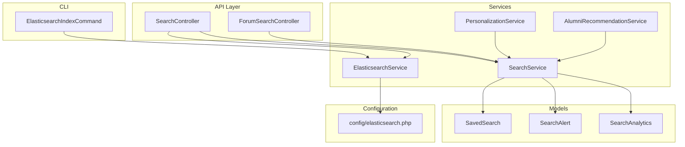
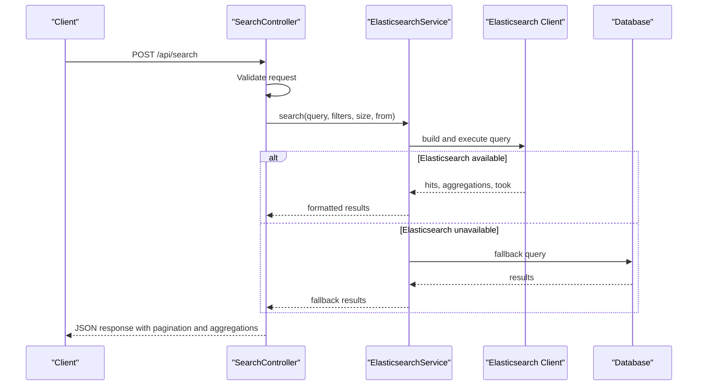
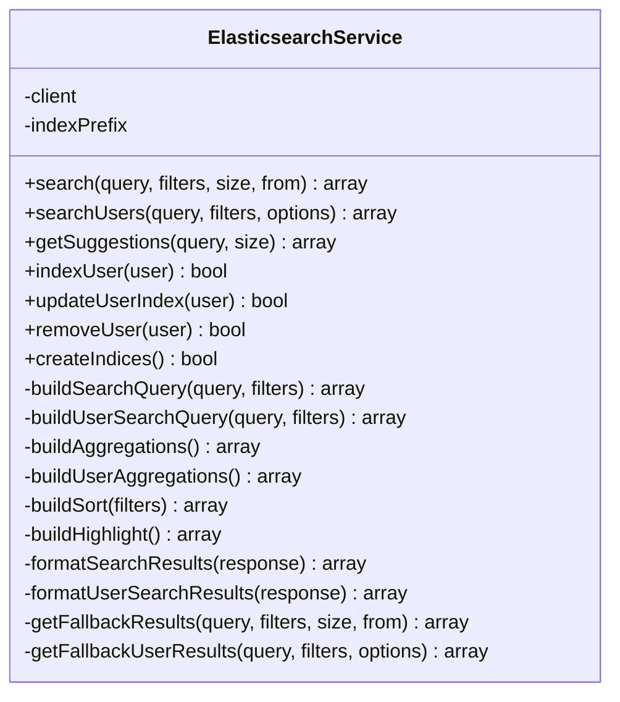
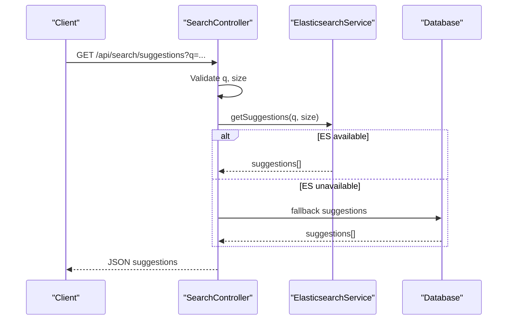
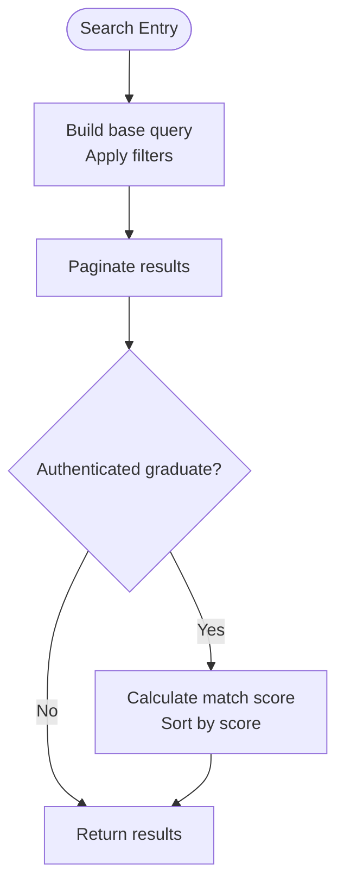
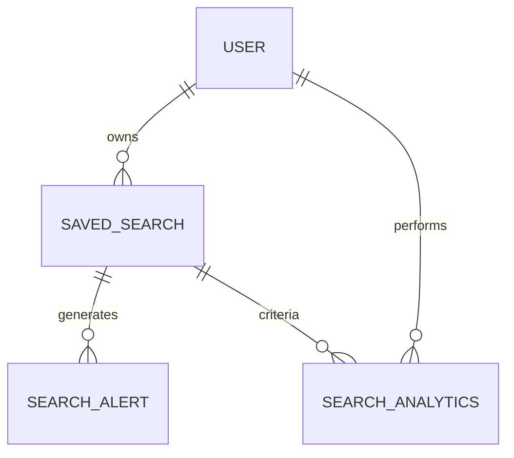
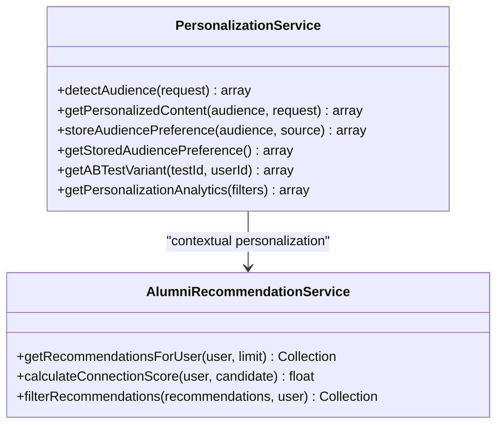
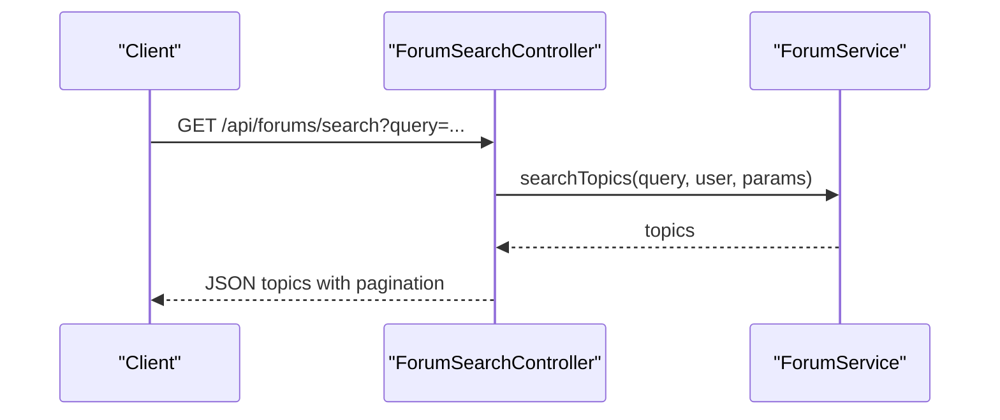
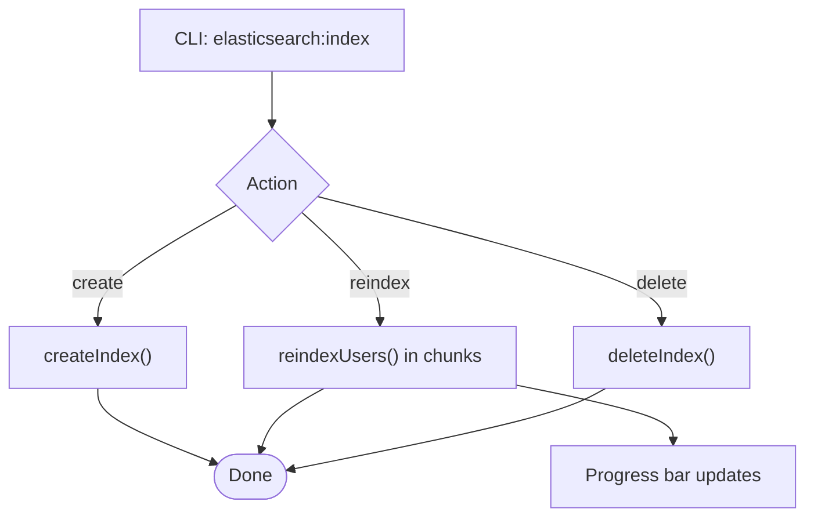
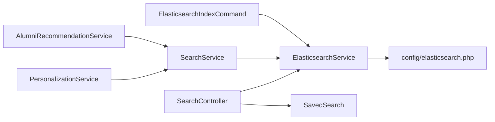

# Search & Discovery

<cite>
**Referenced Files in This Document**
- [SearchController.php](file://app/Http/Controllers/Api/SearchController.php)
- [ElasticsearchService.php](file://app/Services/ElasticsearchService.php)
- [SearchService.php](file://app/Services/SearchService.php)
- [elasticsearch.php](file://config/elasticsearch.php)
- [routes/api.php](file://routes/api.php)
- [ElasticsearchIndexCommand.php](file://app/Console/Commands/ElasticsearchIndexCommand.php)
- [ForumSearchController.php](file://app/Http/Controllers/Api/ForumSearchController.php)
- [SavedSearch.php](file://app/Models/SavedSearch.php)
- [SearchAlert.php](file://app/Models/SearchAlert.php)
- [SearchAnalytics.php](file://app/Models/SearchAnalytics.php)
- [PersonalizationService.php](file://app/Services/PersonalizationService.php)
- [AlumniRecommendationService.php](file://app/Services/AlumniRecommendationService.php)
- [Searchable.php](file://app/Traits/Searchable.php)
</cite>

## Table of Contents
1. [Introduction](#introduction)
2. [Project Structure](#project-structure)
3. [Core Components](#core-components)
4. [Architecture Overview](#architecture-overview)
5. [Detailed Component Analysis](#detailed-component-analysis)
6. [Dependency Analysis](#dependency-analysis)
7. [Performance Considerations](#performance-considerations)
8. [Troubleshooting Guide](#troubleshooting-guide)
9. [Conclusion](#conclusion)
10. [Appendices](#appendices)

## Introduction
This document provides comprehensive API documentation for the search and discovery systems. It covers Elasticsearch integration, full-text search capabilities, faceted search, advanced filtering, sorting, result ranking, saved searches, search analytics, query suggestions, personalization, recommendations, autocomplete, and search history management. The goal is to enable developers and integrators to effectively use and extend the platform’s search and discovery features.

## Project Structure
The search and discovery system spans several layers:
- API controllers expose endpoints for search, suggestions, saved searches, and analytics.
- Services encapsulate business logic for Elasticsearch queries, local search, recommendations, and personalization.
- Models represent persisted entities such as saved searches, search alerts, and analytics.
- Configuration defines Elasticsearch connectivity and behavior.
- Routes define the public API surface for search and discovery.

**Diagram sources**
- [SearchController.php:15-478](file://app/Http/Controllers/Api/SearchController.php#L15-L478)
- [ElasticsearchService.php:11-942](file://app/Services/ElasticsearchService.php#L11-L942)
- [SearchService.php:11-531](file://app/Services/SearchService.php#L11-L531)
- [PersonalizationService.php:9-451](file://app/Services/PersonalizationService.php#L9-L451)
- [AlumniRecommendationService.php:11-433](file://app/Services/AlumniRecommendationService.php#L11-L433)
- [SavedSearch.php:10-46](file://app/Models/SavedSearch.php#L10-L46)
- [SearchAlert.php:9-44](file://app/Models/SearchAlert.php#L9-L44)
- [SearchAnalytics.php:8-97](file://app/Models/SearchAnalytics.php#L8-L97)
- [elasticsearch.php:1-36](file://config/elasticsearch.php#L1-L36)
- [ElasticsearchIndexCommand.php:10-187](file://app/Console/Commands/ElasticsearchIndexCommand.php#L10-L187)

**Section sources**
- [routes/api.php:170-180](file://routes/api.php#L170-L180)
- [SearchController.php:15-478](file://app/Http/Controllers/Api/SearchController.php#L15-L478)
- [ElasticsearchService.php:11-942](file://app/Services/ElasticsearchService.php#L11-L942)
- [SearchService.php:11-531](file://app/Services/SearchService.php#L11-L531)
- [elasticsearch.php:1-36](file://config/elasticsearch.php#L1-L36)

## Core Components
- ElasticsearchService: Provides full-text search, faceted aggregation, highlighting, autocomplete suggestions, and index lifecycle management.
- SearchController: Exposes REST endpoints for search, suggestions, saved searches, analytics, and runs saved searches.
- SearchService: Implements job/graduate/course search, match scoring, recommendations, compatibility scoring, and search suggestions.
- SavedSearch/SearchAlert/SearchAnalytics: Persisted models for saved searches, alert subscriptions, and analytics.
- PersonalizationService: Audience detection, contextual personalization, caching, and analytics.
- AlumniRecommendationService: Connection-based recommendation engine with scoring and filtering.
- ElasticsearchIndexCommand: CLI tool to create, reindex, and manage indices.

**Section sources**
- [ElasticsearchService.php:11-942](file://app/Services/ElasticsearchService.php#L11-L942)
- [SearchController.php:15-478](file://app/Http/Controllers/Api/SearchController.php#L15-L478)
- [SearchService.php:11-531](file://app/Services/SearchService.php#L11-L531)
- [SavedSearch.php:10-46](file://app/Models/SavedSearch.php#L10-L46)
- [SearchAlert.php:9-44](file://app/Models/SearchAlert.php#L9-L44)
- [SearchAnalytics.php:8-97](file://app/Models/SearchAnalytics.php#L8-L97)
- [PersonalizationService.php:9-451](file://app/Services/PersonalizationService.php#L9-L451)
- [AlumniRecommendationService.php:11-433](file://app/Services/AlumniRecommendationService.php#L11-L433)
- [ElasticsearchIndexCommand.php:10-187](file://app/Console/Commands/ElasticsearchIndexCommand.php#L10-L187)

## Architecture Overview
The system integrates Laravel APIs with Elasticsearch for scalable, high-performance search. The SearchController validates and forwards requests to ElasticsearchService, which builds and executes queries, applies aggregations, and returns structured results. Fallbacks ensure resilience when Elasticsearch is unavailable. Saved searches and analytics persist user intent and usage metrics.

**Diagram sources**
- [SearchController.php:27-96](file://app/Http/Controllers/Api/SearchController.php#L27-L96)
- [ElasticsearchService.php:205-236](file://app/Services/ElasticsearchService.php#L205-L236)
- [elasticsearch.php:19-35](file://config/elasticsearch.php#L19-L35)

**Section sources**
- [routes/api.php:170-180](file://routes/api.php#L170-L180)
- [SearchController.php:27-96](file://app/Http/Controllers/Api/SearchController.php#L27-L96)
- [ElasticsearchService.php:205-236](file://app/Services/ElasticsearchService.php#L205-L236)

## Detailed Component Analysis

### ElasticsearchService
Responsibilities:
- Full-text search across multiple content types with weighted field matching.
- Faceted aggregations for locations, graduation years, industries, skills, schools.
- Sorting by relevance, date, name, engagement.
- Highlighting matched terms.
- Autocomplete suggestions via completion suggesters.
- Index management (create mappings for users, posts, jobs, events).
- Fallback to database queries when Elasticsearch is unavailable.

Key behaviors:
- Query building supports multi_match best_fields with fuzziness and field boosting.
- Filters applied via term/range/bool clauses; includes privacy-aware user filtering.
- Aggregations return buckets with counts for UI facets.
- Suggestions leverage completion suggesters for names and skills.

**Diagram sources**
- [ElasticsearchService.php:11-942](file://app/Services/ElasticsearchService.php#L11-L942)

**Section sources**
- [ElasticsearchService.php:38-236](file://app/Services/ElasticsearchService.php#L38-L236)
- [ElasticsearchService.php:277-310](file://app/Services/ElasticsearchService.php#L277-L310)
- [ElasticsearchService.php:557-590](file://app/Services/ElasticsearchService.php#L557-L590)
- [ElasticsearchService.php:592-611](file://app/Services/ElasticsearchService.php#L592-L611)
- [ElasticsearchService.php:621-637](file://app/Services/ElasticsearchService.php#L621-L637)
- [ElasticsearchService.php:656-679](file://app/Services/ElasticsearchService.php#L656-L679)

### SearchController
Responsibilities:
- Validates and normalizes search parameters.
- Executes Elasticsearch search and tracks analytics.
- Returns paginated results with aggregations and highlights.
- Provides suggestions endpoint backed by Elasticsearch or database fallback.
- Manages saved searches: create, list, update, delete, run.
- Exposes search analytics endpoint.

Endpoints:
- POST /api/search
- GET /api/search/suggestions
- POST /api/saved-searches
- GET /api/saved-searches
- PUT /api/saved-searches/{savedSearch}
- DELETE /api/saved-searches/{savedSearch}
- POST /api/saved-searches/{savedSearch}/run
- GET /api/search/analytics

**Diagram sources**
- [SearchController.php:101-142](file://app/Http/Controllers/Api/SearchController.php#L101-L142)
- [ElasticsearchService.php:163-200](file://app/Services/ElasticsearchService.php#L163-L200)

**Section sources**
- [routes/api.php:170-180](file://routes/api.php#L170-L180)
- [SearchController.php:27-96](file://app/Http/Controllers/Api/SearchController.php#L27-L96)
- [SearchController.php:101-142](file://app/Http/Controllers/Api/SearchController.php#L101-L142)
- [SearchController.php:147-336](file://app/Http/Controllers/Api/SearchController.php#L147-L336)
- [SearchController.php:341-381](file://app/Http/Controllers/Api/SearchController.php#L341-L381)

### SearchService
Responsibilities:
- Local search across jobs, graduates, courses with advanced filters and sorting.
- Match scoring for personalized relevance (jobs for graduates, graduates for jobs).
- Compatibility scoring incorporating preferences (location, salary, job type, work arrangement).
- Search suggestions across jobs, skills, and locations.
- Saved searches persistence and alert processing.

Key features:
- Filters support keywords, location, course_id, job_type, experience_level, salary range, skills, work arrangement, employer verification.
- Sorting supports multiple fields with configurable order.
- Recommendations combine course-based and skill-based matches with scoring and deduplication.

**Diagram sources**
- [SearchService.php:13-42](file://app/Services/SearchService.php#L13-L42)
- [SearchService.php:272-346](file://app/Services/SearchService.php#L272-L346)

**Section sources**
- [SearchService.php:13-83](file://app/Services/SearchService.php#L13-L83)
- [SearchService.php:85-159](file://app/Services/SearchService.php#L85-L159)
- [SearchService.php:161-201](file://app/Services/SearchService.php#L161-L201)
- [SearchService.php:203-270](file://app/Services/SearchService.php#L203-L270)
- [SearchService.php:272-446](file://app/Services/SearchService.php#L272-L446)
- [SearchService.php:448-491](file://app/Services/SearchService.php#L448-L491)

### Saved Searches, Alerts, and Analytics
SavedSearch persists user-defined search criteria and metadata for reuse and automation. SearchAlert manages scheduled notifications for saved searches. SearchAnalytics captures search behavior for insights.

**Diagram sources**
- [SavedSearch.php:10-46](file://app/Models/SavedSearch.php#L10-L46)
- [SearchAlert.php:9-44](file://app/Models/SearchAlert.php#L9-L44)
- [SearchAnalytics.php:8-97](file://app/Models/SearchAnalytics.php#L8-L97)

**Section sources**
- [SavedSearch.php:14-28](file://app/Models/SavedSearch.php#L14-L28)
- [SearchAlert.php:13-26](file://app/Models/SearchAlert.php#L13-L26)
- [SearchAnalytics.php:12-26](file://app/Models/SearchAnalytics.php#L12-L26)

### Personalization and Recommendations
PersonalizationService detects audience, builds context, caches results, and applies geographic/time/behavioral personalization. AlumniRecommendationService computes connection-based recommendations using shared circles, mutual connections, interest similarity, and geographic proximity.

**Diagram sources**
- [PersonalizationService.php:9-451](file://app/Services/PersonalizationService.php#L9-L451)
- [AlumniRecommendationService.php:11-433](file://app/Services/AlumniRecommendationService.php#L11-L433)

**Section sources**
- [PersonalizationService.php:21-133](file://app/Services/PersonalizationService.php#L21-L133)
- [PersonalizationService.php:138-174](file://app/Services/PersonalizationService.php#L138-L174)
- [AlumniRecommendationService.php:29-57](file://app/Services/AlumniRecommendationService.php#L29-L57)
- [AlumniRecommendationService.php:62-76](file://app/Services/AlumniRecommendationService.php#L62-L76)

### Forum Search
ForumSearchController provides topic search with tags, user scoping, and sorting. It delegates to a forum service for topic retrieval and formatting.

**Diagram sources**
- [ForumSearchController.php:21-74](file://app/Http/Controllers/Api/ForumSearchController.php#L21-L74)

**Section sources**
- [ForumSearchController.php:12-154](file://app/Http/Controllers/Api/ForumSearchController.php#L12-L154)

### Elasticsearch Index Management
ElasticsearchIndexCommand creates, reindexes, and deletes indices. It ensures index existence and indexes users in chunks with progress reporting.

**Diagram sources**
- [ElasticsearchIndexCommand.php:42-52](file://app/Console/Commands/ElasticsearchIndexCommand.php#L42-L52)
- [ElasticsearchIndexCommand.php:87-154](file://app/Console/Commands/ElasticsearchIndexCommand.php#L87-L154)

**Section sources**
- [ElasticsearchIndexCommand.php:17-52](file://app/Console/Commands/ElasticsearchIndexCommand.php#L17-L52)
- [ElasticsearchIndexCommand.php:57-82](file://app/Console/Commands/ElasticsearchIndexCommand.php#L57-L82)
- [ElasticsearchIndexCommand.php:87-154](file://app/Console/Commands/ElasticsearchIndexCommand.php#L87-L154)

## Dependency Analysis
- SearchController depends on ElasticsearchService and SavedSearch model.
- ElasticsearchService depends on Elasticsearch client and configuration.
- SearchService orchestrates domain-specific searches and recommendations.
- PersonalizationService coordinates with recommendation services.
- CLI tool depends on ElasticsearchService for index operations.

**Diagram sources**
- [SearchController.php:17-22](file://app/Http/Controllers/Api/SearchController.php#L17-L22)
- [ElasticsearchService.php:17-33](file://app/Services/ElasticsearchService.php#L17-L33)
- [SearchService.php:11-12](file://app/Services/SearchService.php#L11-L12)
- [PersonalizationService.php:11-16](file://app/Services/PersonalizationService.php#L11-L16)
- [AlumniRecommendationService.php:11-11](file://app/Services/AlumniRecommendationService.php#L11-L11)
- [ElasticsearchIndexCommand.php:28-36](file://app/Console/Commands/ElasticsearchIndexCommand.php#L28-L36)

**Section sources**
- [routes/api.php:170-180](file://routes/api.php#L170-L180)
- [SearchController.php:17-22](file://app/Http/Controllers/Api/SearchController.php#L17-L22)
- [ElasticsearchService.php:17-33](file://app/Services/ElasticsearchService.php#L17-L33)

## Performance Considerations
- Elasticsearch configuration limits page size and highlight sizes to control resource usage.
- Fallback database queries prevent downtime and degrade gracefully.
- Aggregations and sorting are optimized for common fields; consider sharding and replicas for scale.
- Use completion suggesters for fast autocomplete; maintain index mappings regularly.
- Cache personalized content and recommendations to reduce repeated computation.

[No sources needed since this section provides general guidance]

## Troubleshooting Guide
Common issues and resolutions:
- Elasticsearch unavailable: The system falls back to database queries. Verify connectivity and credentials in configuration.
- Invalid search parameters: Validation errors return structured details; ensure query length, filters, and pagination bounds are within allowed ranges.
- Index creation failures: Confirm Elasticsearch host and permissions; check logs for detailed errors.
- Slow search performance: Review aggregations, sort fields, and query complexity; consider tuning analyzer settings and mappings.

**Section sources**
- [SearchController.php:83-95](file://app/Http/Controllers/Api/SearchController.php#L83-L95)
- [SearchController.php:108-113](file://app/Http/Controllers/Api/SearchController.php#L108-L113)
- [ElasticsearchService.php:19-31](file://app/Services/ElasticsearchService.php#L19-L31)
- [ElasticsearchService.php:277-310](file://app/Services/ElasticsearchService.php#L277-L310)

## Conclusion
The search and discovery system combines robust Elasticsearch integration with local search capabilities, personalization, and recommendations. It offers flexible faceted search, intelligent suggestions, saved searches with alerts, and analytics to drive continuous improvement. The modular design enables extensibility and resilience through fallback mechanisms.

[No sources needed since this section summarizes without analyzing specific files]

## Appendices

### API Definitions

- Search
  - Method: POST
  - Path: /api/search
  - Authenticated: Yes
  - Rate limit: search
  - Request body:
    - query: string (required, max 255)
    - filters: object
      - types: array of strings in [user, post, job, event]
      - location: string (max 100)
      - graduation_year: integer (min 1900, max current year + 10)
      - industry: array
      - skills: array
      - date_range: object { from: date, to: date }
      - sort: in [relevance, date, name, engagement]
    - size: integer (min 1, max 100)
    - from: integer (min 0)
  - Response:
    - success: boolean
    - query: string
    - filters: object
    - hits: array
    - total: integer
    - aggregations: object
    - took: integer
    - pagination: { current_page, per_page, total, total_pages }

- Suggestions
  - Method: GET
  - Path: /api/search/suggestions
  - Authenticated: Yes
  - Rate limit: search
  - Query params:
    - q: string (required, min 2, max 100)
    - size: integer (optional, min 1, max 10)
  - Response:
    - success: boolean
    - query: string
    - suggestions: array

- Saved Searches
  - Create: POST /api/saved-searches
  - List: GET /api/saved-searches
  - Update: PUT /api/saved-searches/{savedSearch}
  - Delete: DELETE /api/saved-searches/{savedSearch}
  - Run: POST /api/saved-searches/{savedSearch}/run
  - Analytics: GET /api/search/analytics

**Section sources**
- [routes/api.php:170-180](file://routes/api.php#L170-L180)
- [SearchController.php:29-51](file://app/Http/Controllers/Api/SearchController.php#L29-L51)
- [SearchController.php:103-113](file://app/Http/Controllers/Api/SearchController.php#L103-L113)
- [SearchController.php:149-189](file://app/Http/Controllers/Api/SearchController.php#L149-L189)
- [SearchController.php:194-215](file://app/Http/Controllers/Api/SearchController.php#L194-L215)
- [SearchController.php:220-293](file://app/Http/Controllers/Api/SearchController.php#L220-L293)
- [SearchController.php:298-336](file://app/Http/Controllers/Api/SearchController.php#L298-L336)
- [SearchController.php:341-381](file://app/Http/Controllers/Api/SearchController.php#L341-L381)

### Search Query Syntax and Examples
- Full-text search: Provide a query string; Elasticsearch matches across boosted fields.
- Faceted filters:
  - location: term filter
  - graduation_year: single value or range
  - industry/skills: terms filters
  - date_range: range filter on created_at
- Sorting:
  - relevance (default)
  - date: created_at desc
  - name: alphabetical asc
  - engagement: engagement_count desc
- Pagination:
  - size: number of results per page (default 20, max 100)
  - from: offset for pagination

**Section sources**
- [SearchController.php:29-51](file://app/Http/Controllers/Api/SearchController.php#L29-L51)
- [ElasticsearchService.php:557-576](file://app/Services/ElasticsearchService.php#L557-L576)
- [elasticsearch.php:24-29](file://config/elasticsearch.php#L24-L29)

### Saved Searches and Alerts
- SavedSearch stores user-defined search criteria and metadata.
- SearchAlert triggers periodic notifications based on frequency settings.
- SearchAnalytics records search behavior for insights.

**Section sources**
- [SavedSearch.php:14-28](file://app/Models/SavedSearch.php#L14-L28)
- [SearchAlert.php:13-26](file://app/Models/SearchAlert.php#L13-L26)
- [SearchAnalytics.php:12-26](file://app/Models/SearchAnalytics.php#L12-L26)

### Personalization and Recommendations
- PersonalizationService detects audience and applies contextual personalization.
- AlumniRecommendationService computes recommendations using shared circles, mutual connections, interest similarity, and geographic proximity.

**Section sources**
- [PersonalizationService.php:21-133](file://app/Services/PersonalizationService.php#L21-L133)
- [AlumniRecommendationService.php:29-57](file://app/Services/AlumniRecommendationService.php#L29-L57)

### Elasticsearch Configuration
- Host, index prefix, shard/replica settings, default search sizes, highlight sizes, and suggestion sizes.

**Section sources**
- [elasticsearch.php:15-35](file://config/elasticsearch.php#L15-L35)