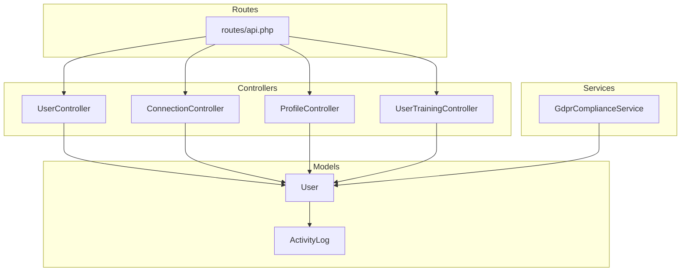
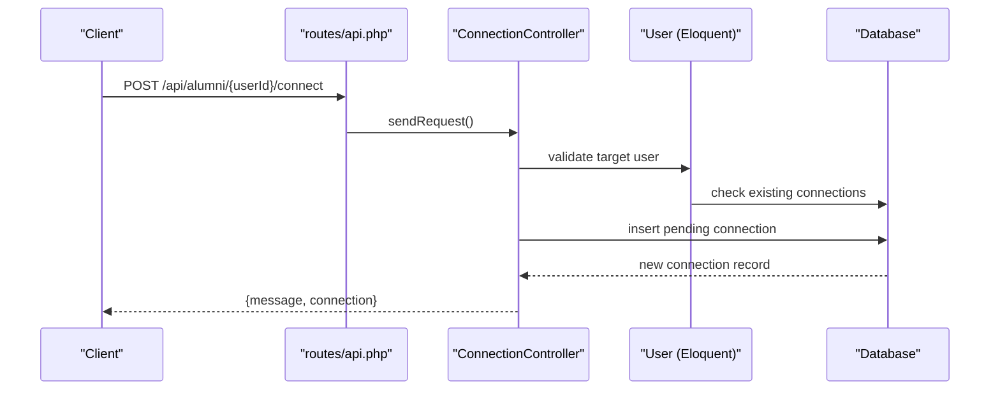
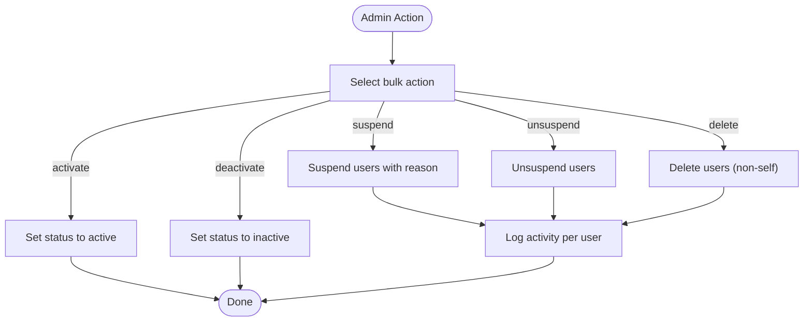
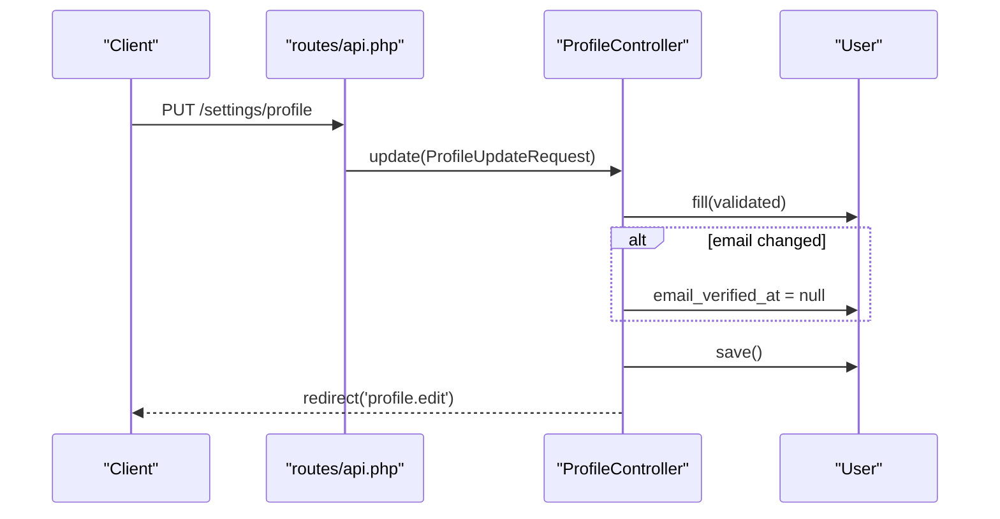
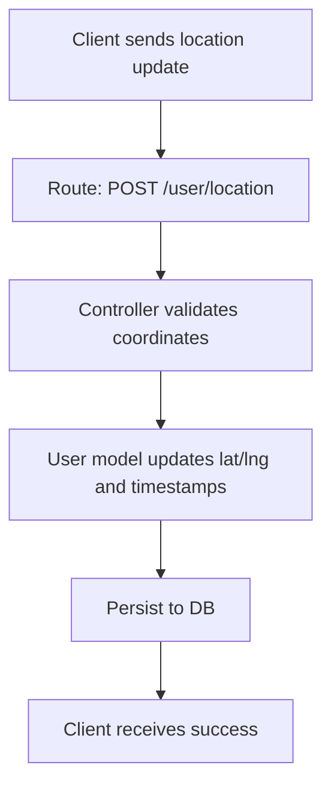
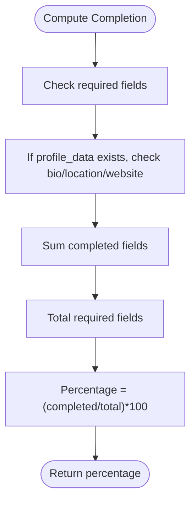
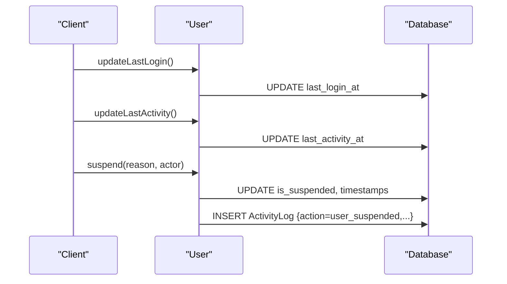
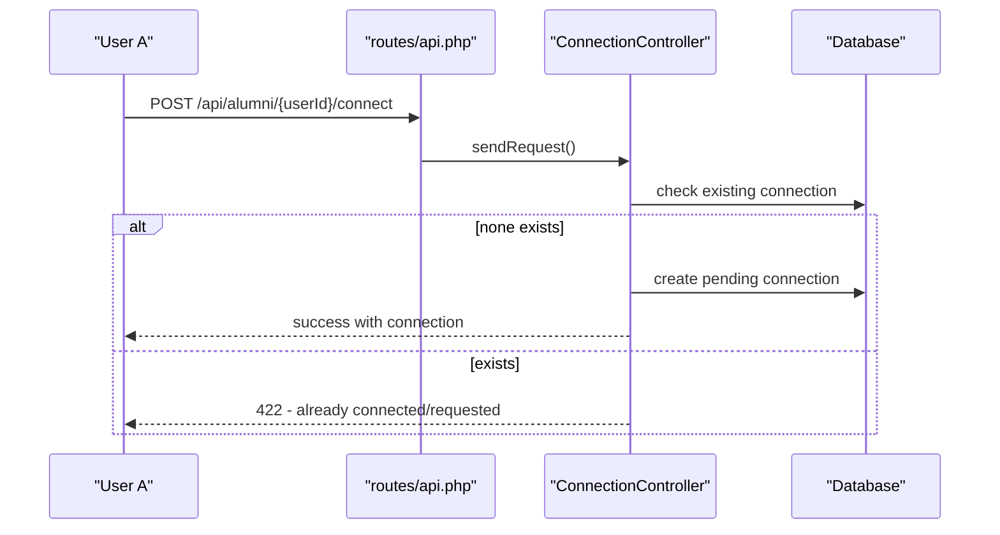
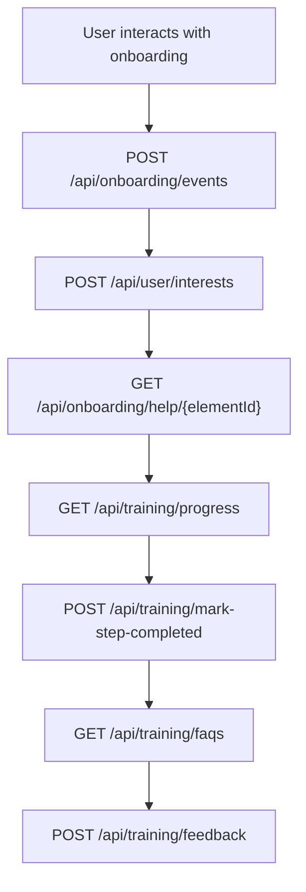
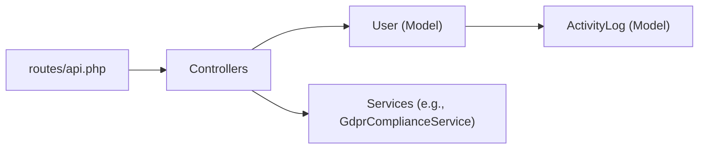

# User Management

<cite>
**Referenced Files in This Document**
- [routes/api.php](file://routes/api.php)
- [UserController.php](file://app/Http/Controllers/UserController.php)
- [ProfileController.php](file://app/Http/Controllers/Settings/ProfileController.php)
- [ConnectionController.php](file://app/Http/controllers/Api/ConnectionController.php)
- [User.php](file://app/Models/User.php)
- [GdprComplianceService.php](file://app/Services/GdprComplianceService.php)
- [ActivityLog.php](file://app/Models/ActivityLog.php)
- [UserTrainingController.php](file://app/Http/Controllers/UserTrainingController.php)
- [api-layer-plan.md](file://api-layer-plan.md)
</cite>

## Table of Contents
1. [Introduction](#introduction)
2. [Project Structure](#project-structure)
3. [Core Components](#core-components)
4. [Architecture Overview](#architecture-overview)
5. [Detailed Component Analysis](#detailed-component-analysis)
6. [Dependency Analysis](#dependency-analysis)
7. [Performance Considerations](#performance-considerations)
8. [Troubleshooting Guide](#troubleshooting-guide)
9. [Conclusion](#conclusion)
10. [Appendices](#appendices)

## Introduction
This document provides comprehensive API documentation for user management endpoints within the platform. It covers user profile CRUD operations, account settings management, user data synchronization, profile completion tracking, privacy settings, notification preferences, user activity logging, user search and discovery, connection management, social graph operations, onboarding state management, training progress tracking, contextual help systems, data validation patterns, profile enrichment, audit trail maintenance, user data export, GDPR compliance features, and account deactivation procedures. The documentation is designed for both technical and non-technical audiences and includes diagrams, sequence flows, and practical guidance.

## Project Structure
The user management APIs are primarily defined in the API routes file and implemented via controllers. Core user model features (profile completion, activity logging, privacy, and relationships) are encapsulated in the User model. Additional services support GDPR compliance and training-related flows.

**Diagram sources**
- [routes/api.php:1-800](file://routes/api.php#L1-L800)
- [UserController.php:1-442](file://app/Http/Controllers/UserController.php#L1-L442)
- [ConnectionController.php:1-139](file://app/Http/Controllers/Api/ConnectionController.php#L1-L139)
- [ProfileController.php:1-64](file://app/Http/Controllers/Settings/ProfileController.php#L1-L64)
- [User.php:1-818](file://app/Models/User.php#L1-L818)
- [ActivityLog.php](file://app/Models/ActivityLog.php)
- [GdprComplianceService.php](file://app/Services/GdprComplianceService.php)
- [UserTrainingController.php](file://app/Http/Controllers/UserTrainingController.php)

**Section sources**
- [routes/api.php:1-800](file://routes/api.php#L1-L800)

## Core Components
- User profile CRUD and administrative operations: Implemented via UserController with index, create, store, show, edit, update, destroy, suspend, unsuspend, bulkAction, and export endpoints.
- Account settings management: ProfileController handles profile editing and deletion with validation and email verification flow.
- Connection management and social graph: ConnectionController supports sending, accepting, declining, listing, and viewing pending connection requests.
- User activity logging and profile completion: User model exposes helpers for activity summaries, last login/update, and profile completion percentage.
- Onboarding and training: Routes under onboarding and training endpoints integrate with UserTrainingController for guides, tutorials, progress tracking, and contextual help.
- GDPR compliance: GdprComplianceService provides mechanisms for data subject rights and compliance workflows.

**Section sources**
- [UserController.php:22-442](file://app/Http/Controllers/UserController.php#L22-L442)
- [ProfileController.php:19-64](file://app/Http/Controllers/Settings/ProfileController.php#L19-L64)
- [ConnectionController.php:16-139](file://app/Http/Controllers/Api/ConnectionController.php#L16-L139)
- [User.php:491-514](file://app/Models/User.php#L491-L514)
- [routes/api.php:732-755](file://routes/api.php#L732-L755)
- [GdprComplianceService.php](file://app/Services/GdprComplianceService.php)

## Architecture Overview
The user management layer follows a layered architecture:
- API routes define endpoint contracts and middleware (authentication, rate limits).
- Controllers orchestrate requests, apply validation, and delegate to domain services or models.
- Models encapsulate business logic, relationships, and persistence.
- Services provide cross-cutting concerns like GDPR compliance and training progression.

**Diagram sources**
- [routes/api.php:147-149](file://routes/api.php#L147-L149)
- [ConnectionController.php:16-52](file://app/Http/Controllers/Api/ConnectionController.php#L16-L52)
- [User.php:221-237](file://app/Models/User.php#L221-L237)

## Detailed Component Analysis

### User Profile CRUD and Administration
- Index: Filters by search, role, status, institution; paginated; includes statistics and roles/institutions for filters.
- Create: Validates name, email uniqueness, phone, password confirmation, role, optional avatar, profile_data, preferences, timezone, language; assigns role; logs activity.
- Show: Loads roles, institution, recent activity logs; computes activity summary and profile completion percentage.
- Edit: Prepares roles and institution selection for authorized updates.
- Update: Validates and optionally updates password; handles avatar replacement; syncs roles; logs activity.
- Destroy: Prevents self-deletion; deletes avatar; logs activity; removes user.
- Suspend/Unsuspend: Enforces non-self action; records suspension reason and actor; logs activity.
- Bulk Actions: Supports suspend, unsuspend, delete, activate, deactivate across selected users with reason for suspension.
- Export: Streams CSV of filtered users with ID, name, email, phone, role, institution, status, suspension flag, last login, created at.

**Diagram sources**
- [UserController.php:300-346](file://app/Http/Controllers/UserController.php#L300-L346)

**Section sources**
- [UserController.php:22-442](file://app/Http/Controllers/UserController.php#L22-L442)

### Account Settings Management
- Edit profile page: Renders settings with email verification requirement indicator and status messages.
- Update profile: Validates and persists profile changes; marks email unverified when email changes; returns to profile edit page.
- Delete profile: Requires current password; logs out, deletes user, invalidates session, redirects home.

**Diagram sources**
- [routes/api.php:757-783](file://routes/api.php#L757-L783)
- [ProfileController.php:30-41](file://app/Http/Controllers/Settings/ProfileController.php#L30-L41)

**Section sources**
- [ProfileController.php:19-64](file://app/Http/Controllers/Settings/ProfileController.php#L19-L64)

### User Data Synchronization and Privacy Settings
- Location privacy and updates: Routes expose endpoints for updating location privacy and coordinates; model stores latitude/longitude and location privacy flags.
- Profile visibility and preferences: Model includes profile_visibility and preferences arrays for personalization and visibility controls.
- Last activity and login timestamps: Helpers update last_login_at and last_activity_at to support synchronization and presence indicators.

**Diagram sources**
- [routes/api.php:157-159](file://routes/api.php#L157-L159)
- [User.php:33-34](file://app/Models/User.php#L33-L34)
- [User.php:44-45](file://app/Models/User.php#L44-L45)

**Section sources**
- [routes/api.php:157-159](file://routes/api.php#L157-L159)
- [User.php:33-34](file://app/Models/User.php#L33-L34)
- [User.php:44-45](file://app/Models/User.php#L44-L45)

### Profile Completion Tracking
- Computation: Percentage based on required fields (name, email, phone) plus optional profile_data fields (bio, location, website). Returns integer percentage.

**Diagram sources**
- [User.php:491-514](file://app/Models/User.php#L491-L514)

**Section sources**
- [User.php:491-514](file://app/Models/User.php#L491-L514)

### Notification Preferences
- Retrieve preferences: GET /api/notifications/preferences
- Update preferences: PUT /api/notifications/preferences
- These endpoints are defined in the notifications route group and handled by the notification controller.

**Section sources**
- [routes/api.php:129-140](file://routes/api.php#L129-L140)

### User Activity Logging
- Activity summary: Aggregates total logins, last login, total activities, and most active day over a configurable window.
- Suspension/unsuspension events: Logged with metadata including reason and actor.
- Last login and activity timestamps: Updated via helper methods to maintain synchronization.

**Diagram sources**
- [User.php:417-444](file://app/Models/User.php#L417-L444)
- [User.php:537-557](file://app/Models/User.php#L537-L557)

**Section sources**
- [User.php:417-444](file://app/Models/User.php#L417-L444)
- [User.php:537-557](file://app/Models/User.php#L537-L557)
- [ActivityLog.php](file://app/Models/ActivityLog.php)

### User Search and Discovery
- Alumni directory search and filters: GET /api/alumni/search, GET /api/alumni/filters
- Individual profiles: GET /api/alumni/{userId}
- Connections: POST /api/alumni/{userId}/connect
- Map-based discovery: POST /api/alumni/map-data, POST /api/alumni/map-clusters, GET /api/alumni/map-stats, POST /api/alumni/nearby
- Location privacy and updates: POST /api/user/location-privacy, POST /api/user/location

**Section sources**
- [routes/api.php:142-160](file://routes/api.php#L142-L160)

### Connection Management and Social Graph Operations
- Send request: POST /api/alumni/{userId}/connect
- View connections: GET /api/alumni/{userId}/connect
- Pending requests: GET /api/notifications/requests
- Accept/decline: POST /api/connections/{connection}/accept, POST /api/connections/{connection}/decline

**Diagram sources**
- [routes/api.php:147-149](file://routes/api.php#L147-L149)
- [ConnectionController.php:16-52](file://app/Http/Controllers/Api/ConnectionController.php#L16-L52)

**Section sources**
- [ConnectionController.php:16-139](file://app/Http/Controllers/Api/ConnectionController.php#L16-L139)
- [routes/api.php:147-149](file://routes/api.php#L147-L149)

### Onboarding State Management and Training Progress
- Onboarding state: GET /api/onboarding/state, POST /api/onboarding/state
- New features and profile completion: GET /api/onboarding/new-features, GET /api/onboarding/profile-completion
- Onboarding events: POST /api/onboarding/events
- User interests: POST /api/user/interests
- Contextual help: GET /api/onboarding/help/{elementId}
- Training guides and tutorials: GET /api/training/guides, GET /api/training/tutorials
- Onboarding sequence: GET /api/training/onboarding-sequence
- FAQs and progress: GET /api/training/faqs, GET /api/training/progress
- Mark step completed: POST /api/training/mark-step-completed
- Search and feedback: GET /api/training/search, POST /api/training/faq-helpful, POST /api/training/feedback

**Diagram sources**
- [routes/api.php:732-755](file://routes/api.php#L732-L755)

**Section sources**
- [routes/api.php:732-755](file://routes/api.php#L732-L755)
- [UserTrainingController.php](file://app/Http/Controllers/UserTrainingController.php)

### User Data Validation Patterns
- Administrative user creation: Validates name, email uniqueness, phone, password confirmation, role, institution constraint for non-super-admins, optional avatar, profile_data, preferences, timezone, language.
- Profile update: Validates against a dedicated request class; email change resets verification.
- Connection request: Validates target user existence and optional message length.

**Section sources**
- [UserController.php:85-144](file://app/Http/Controllers/UserController.php#L85-L144)
- [ProfileController.php:30-41](file://app/Http/Controllers/Settings/ProfileController.php#L30-L41)
- [ConnectionController.php:18-21](file://app/Http/Controllers/Api/ConnectionController.php#L18-L21)

### Profile Enrichment and Audit Trail Maintenance
- Profile enrichment: Optional profile_data array allows storing additional fields (bio, location, website) contributing to profile completion.
- Audit trail: Activity logs capture user actions (login, suspend, unsuspend) with metadata; suspension reasons and actors recorded.

**Section sources**
- [User.php:68-71](file://app/Models/User.php#L68-L71)
- [User.php:406-433](file://app/Models/User.php#L406-L433)
- [ActivityLog.php](file://app/Models/ActivityLog.php)

### User Data Export
- Endpoint: GET /api/users/export streams CSV with ID, name, email, phone, role, institution, status, suspended flag, last login, created at.
- Filtering mirrors index: supports search, role, status, institution.

**Section sources**
- [UserController.php:348-416](file://app/Http/Controllers/UserController.php#L348-L416)

### GDPR Compliance Features
- Data subject rights: GdprComplianceService provides mechanisms for data access, rectification, erasure, and portability.
- Data export: Integrated with user export endpoint for CSV downloads.
- Consent and preferences: Notification preferences endpoint supports opt-in/opt-out mechanisms.

**Section sources**
- [GdprComplianceService.php](file://app/Services/GdprComplianceService.php)
- [routes/api.php:129-140](file://routes/api.php#L129-L140)
- [UserController.php:348-416](file://app/Http/Controllers/UserController.php#L348-L416)

### Account Deactivation Procedures
- Deactivation: Admin can set user status to inactive via bulk actions or direct update.
- Suspension: Non-self suspension with reason; logs activity with metadata.
- Self-deletion: Profile deletion requires current password; logs out and invalidates session.

**Section sources**
- [UserController.php:247-298](file://app/Http/Controllers/UserController.php#L247-L298)
- [ProfileController.php:46-62](file://app/Http/Controllers/Settings/ProfileController.php#L46-L62)

## Dependency Analysis
The user management layer exhibits clear separation of concerns:
- Routes depend on controllers for endpoint resolution.
- Controllers depend on the User model for business logic and persistence.
- Services (e.g., GdprComplianceService) encapsulate cross-cutting compliance concerns.
- Activity logging is maintained through model relationships.

**Diagram sources**
- [routes/api.php:1-800](file://routes/api.php#L1-L800)
- [User.php:154-167](file://app/Models/User.php#L154-L167)
- [GdprComplianceService.php](file://app/Services/GdprComplianceService.php)

**Section sources**
- [routes/api.php:1-800](file://routes/api.php#L1-L800)
- [User.php:154-167](file://app/Models/User.php#L154-L167)

## Performance Considerations
- Pagination: UserController index and similar endpoints paginate results to limit payload sizes.
- Filtering: Use of whereHas and conditional queries reduces unnecessary joins.
- Rate limiting: API routes include rate-limit middleware to prevent abuse.
- Streaming exports: CSV export streams data to avoid memory spikes.

[No sources needed since this section provides general guidance]

## Troubleshooting Guide
- Unauthorized access: Ensure authentication middleware is applied and permissions are checked (e.g., manage-users).
- Validation errors: Review request validation rules in controllers and request classes.
- Self-actions blocked: Controllers enforce non-self deletion and suspension to prevent accidental lockouts.
- Activity logs missing: Verify activity logging is enabled and that the User model’s activity methods are invoked.

**Section sources**
- [UserController.php:247-254](file://app/Http/Controllers/UserController.php#L247-L254)
- [ConnectionController.php:61-63](file://app/Http/Controllers/Api/ConnectionController.php#L61-L63)

## Conclusion
The user management system provides a robust, modular API layer supporting comprehensive user lifecycle operations, social graph management, onboarding and training workflows, privacy controls, and compliance features. The documented endpoints, validation patterns, and audit trails enable secure and scalable user administration while maintaining performance and usability.

## Appendices
- API layer planning: Reference the API layer plan for architectural guidelines and standards.

**Section sources**
- [api-layer-plan.md](file://api-layer-plan.md)