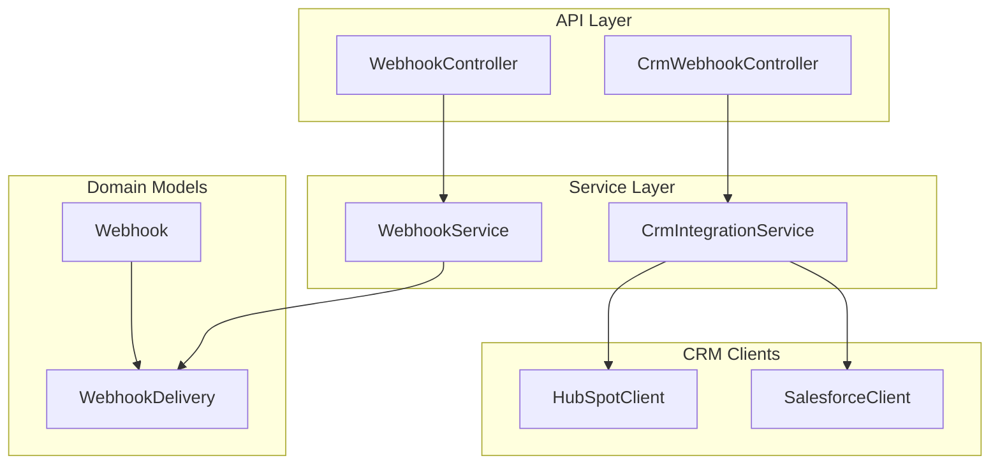
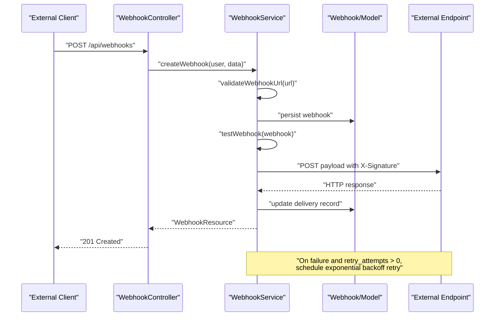
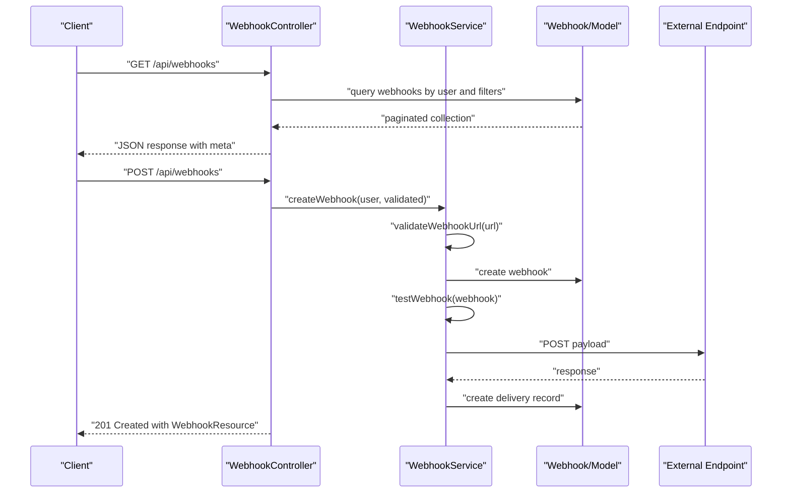
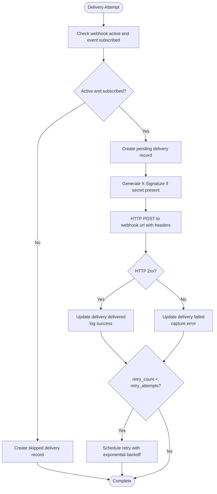
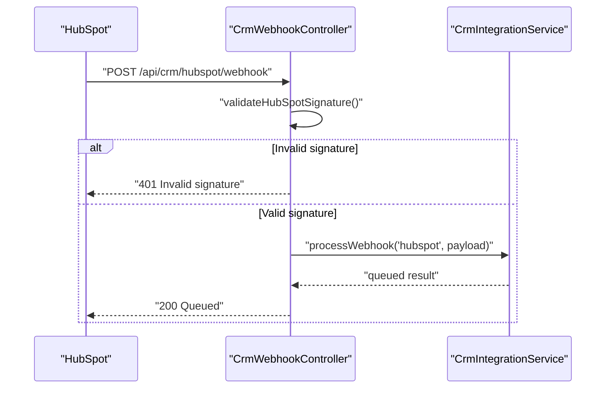
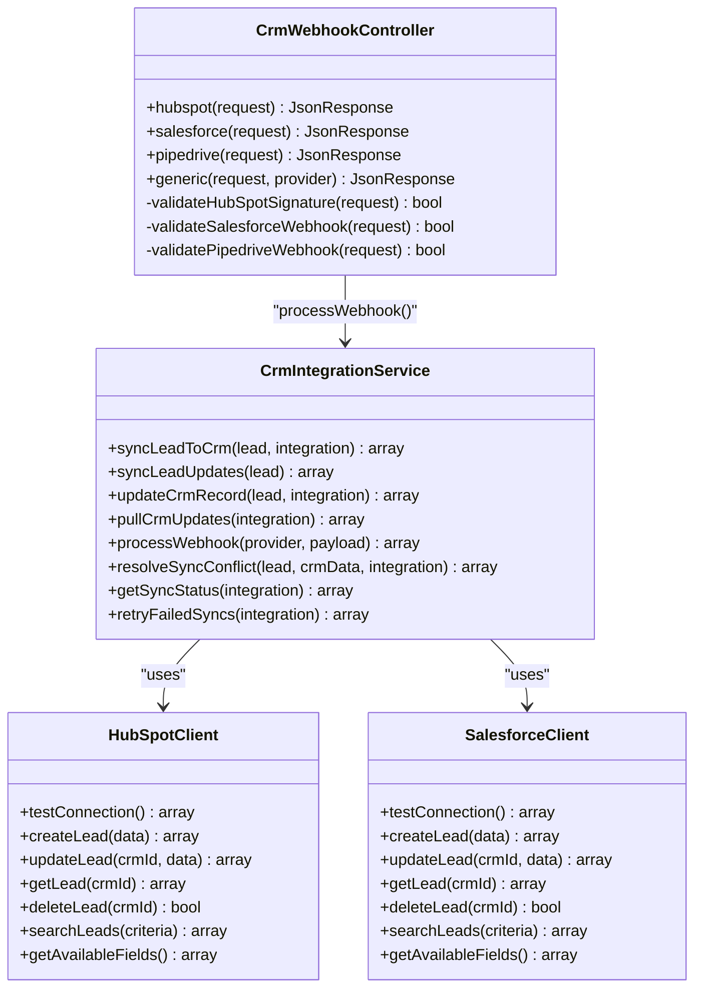
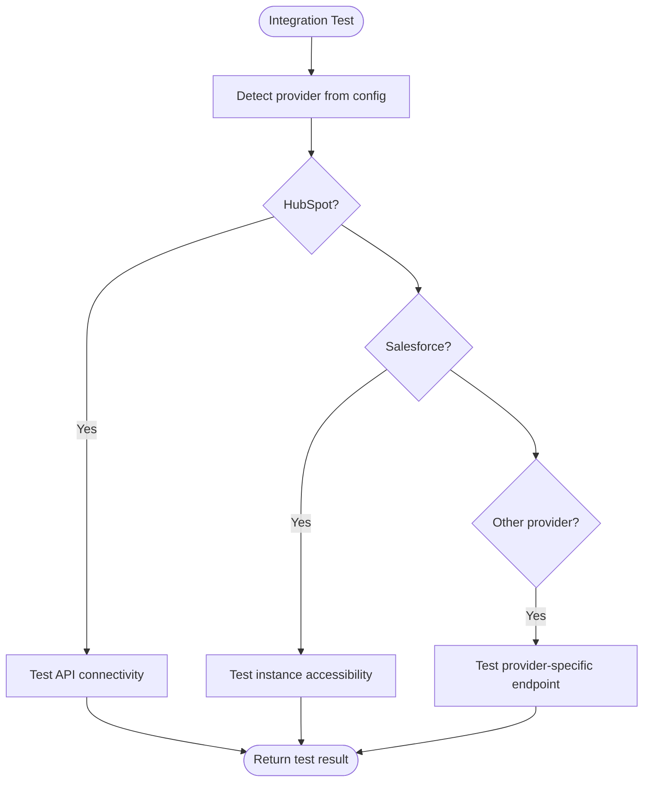
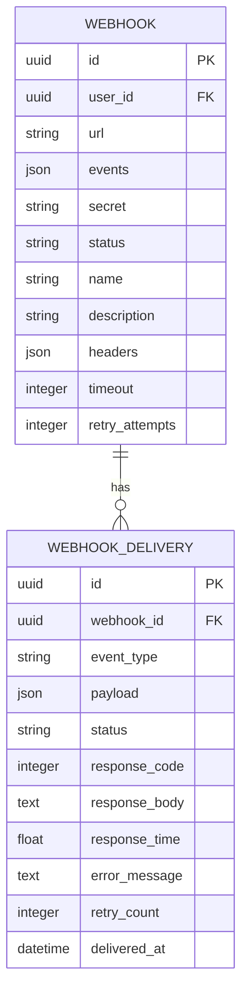
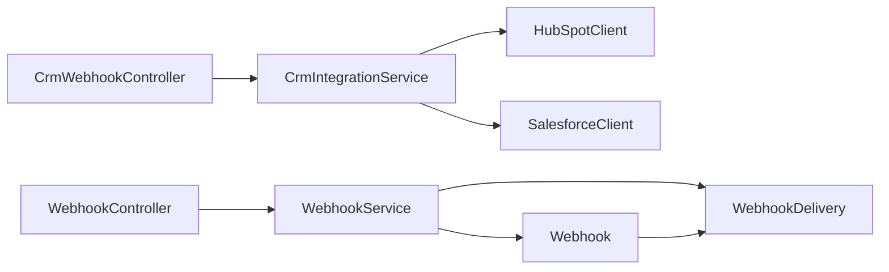

# Webhooks & Integrations

<cite>
**Referenced Files in This Document**
- [WebhookController.php](file://app/Http/Controllers/Api/WebhookController.php)
- [WebhookService.php](file://app/Services/WebhookService.php)
- [Webhook.php](file://app/Models/Webhook.php)
- [WebhookDelivery.php](file://app/Models/WebhookDelivery.php)
- [CrmWebhookController.php](file://app/Http/Controllers/Api/CrmWebhookController.php)
- [CrmIntegrationService.php](file://app/Services/CrmIntegrationService.php)
- [HubSpotClient.php](file://app/Services/CRM/HubSpotClient.php)
- [SalesforceClient.php](file://app/Services/CRM/SalesforceClient.php)
- [IntegrationTestingService.php](file://app/Services/IntegrationTestingService.php)
- [CRM_INTEGRATIONS.md](file://docs/CRM_INTEGRATIONS.md)
- [FormController.php](file://app/Http/Controllers/Api/FormController.php)
- [WebhookTest.php](file://tests/Feature/WebhookTest.php)
</cite>

## Table of Contents
1. [Introduction](#introduction)
2. [Project Structure](#project-structure)
3. [Core Components](#core-components)
4. [Architecture Overview](#architecture-overview)
5. [Detailed Component Analysis](#detailed-component-analysis)
6. [Dependency Analysis](#dependency-analysis)
7. [Performance Considerations](#performance-considerations)
8. [Troubleshooting Guide](#troubleshooting-guide)
9. [Conclusion](#conclusion)
10. [Appendices](#appendices)

## Introduction
This document provides comprehensive API documentation for webhook management and third-party integrations within the platform. It covers webhook lifecycle management (creation, delivery, retries), security and validation, CRM integration endpoints for HubSpot, Salesforce, and others, integration testing and debugging tools, webhook statistics, payload formats, event types, and operational best practices for scaling, rate limiting, and failure handling.

## Project Structure
The webhook and integration system spans controller APIs, service layer logic, domain models, CRM clients, and testing utilities. Key areas:
- API controllers for managing webhooks and processing CRM webhooks
- Service layer orchestrating delivery, retries, statistics, and CRM sync
- Eloquent models representing webhooks and delivery records
- CRM client implementations for HubSpot and Salesforce
- Integration testing utilities and documentation

**Diagram sources**
- [WebhookController.php:15-264](file://app/Http/Controllers/Api/WebhookController.php#L15-L264)
- [CrmWebhookController.php:11-242](file://app/Http/Controllers/Api/CrmWebhookController.php#L11-L242)
- [WebhookService.php:14-517](file://app/Services/WebhookService.php#L14-L517)
- [CrmIntegrationService.php:24-547](file://app/Services/CrmIntegrationService.php#L24-L547)
- [Webhook.php:9-60](file://app/Models/Webhook.php#L9-L60)
- [WebhookDelivery.php:8-54](file://app/Models/WebhookDelivery.php#L8-L54)
- [HubSpotClient.php:7-174](file://app/Services/CRM/HubSpotClient.php#L7-L174)
- [SalesforceClient.php:7-215](file://app/Services/CRM/SalesforceClient.php#L7-L215)

**Section sources**
- [WebhookController.php:15-264](file://app/Http/Controllers/Api/WebhookController.php#L15-L264)
- [WebhookService.php:14-517](file://app/Services/WebhookService.php#L14-L517)
- [Webhook.php:9-60](file://app/Models/Webhook.php#L9-L60)
- [WebhookDelivery.php:8-54](file://app/Models/WebhookDelivery.php#L8-L54)
- [CrmWebhookController.php:11-242](file://app/Http/Controllers/Api/CrmWebhookController.php#L11-L242)
- [CrmIntegrationService.php:24-547](file://app/Services/CrmIntegrationService.php#L24-L547)
- [HubSpotClient.php:7-174](file://app/Services/CRM/HubSpotClient.php#L7-L174)
- [SalesforceClient.php:7-215](file://app/Services/CRM/SalesforceClient.php#L7-L215)

## Core Components
- WebhookController: Provides endpoints for listing, creating, updating, deleting, testing, retrieving delivery history, retrying failed deliveries, viewing statistics, validating URLs, pausing/resuming deliveries, and fetching available events.
- WebhookService: Implements webhook creation, payload signing, delivery, retry scheduling, statistics computation, URL validation, and pause/resume operations.
- Webhook model: Stores webhook configuration (URL, events, secret, status, headers, timeouts, retry attempts) and relationships.
- WebhookDelivery model: Tracks individual delivery attempts with status, response metadata, timing, errors, and retry counts.
- CrmWebhookController: Accepts inbound webhooks from CRM providers (HubSpot, Salesforce, Pipedrive) with signature validation and queues processing via jobs.
- CrmIntegrationService: Orchestrates CRM synchronization, bidirectional updates, conflict resolution, sync status reporting, and retry logic.
- CRM Clients: Provider-specific HTTP clients for HubSpot and Salesforce with connection testing, lead CRUD, field mapping, and request helpers.

**Section sources**
- [WebhookController.php:24-262](file://app/Http/Controllers/Api/WebhookController.php#L24-L262)
- [WebhookService.php:49-401](file://app/Services/WebhookService.php#L49-L401)
- [Webhook.php:13-58](file://app/Models/Webhook.php#L13-L58)
- [WebhookDelivery.php:10-52](file://app/Models/WebhookDelivery.php#L10-L52)
- [CrmWebhookController.php:20-164](file://app/Http/Controllers/Api/CrmWebhookController.php#L20-L164)
- [CrmIntegrationService.php:29-252](file://app/Services/CrmIntegrationService.php#L29-L252)
- [HubSpotClient.php:18-172](file://app/Services/CRM/HubSpotClient.php#L18-L172)
- [SalesforceClient.php:21-213](file://app/Services/CRM/SalesforceClient.php#L21-L213)

## Architecture Overview
The webhook system separates concerns between API orchestration, business logic, persistence, and external provider integrations. Delivery follows a synchronous-like flow with asynchronous retry scheduling. CRM webhooks are validated and queued for background processing.

**Diagram sources**
- [WebhookController.php:53-64](file://app/Http/Controllers/Api/WebhookController.php#L53-L64)
- [WebhookService.php:49-232](file://app/Services/WebhookService.php#L49-L232)
- [Webhook.php:13-29](file://app/Models/Webhook.php#L13-L29)
- [WebhookDelivery.php:10-32](file://app/Models/WebhookDelivery.php#L10-L32)

**Section sources**
- [WebhookController.php:53-64](file://app/Http/Controllers/Api/WebhookController.php#L53-L64)
- [WebhookService.php:157-232](file://app/Services/WebhookService.php#L157-L232)

## Detailed Component Analysis

### Webhook Management API
Endpoints enable full lifecycle management:
- GET /api/webhooks: List webhooks with filtering by status/event and pagination
- POST /api/webhooks: Create webhook with URL, events, optional secret, headers, timeout, retry attempts
- GET /api/webhooks/{id}: View webhook details with recent deliveries
- PUT /api/webhooks/{id}: Update webhook configuration
- DELETE /api/webhooks/{id}: Delete webhook and associated deliveries
- POST /api/webhooks/{id}/test: Send a test payload
- GET /api/webhooks/{id}/deliveries: Retrieve delivery history with filtering and pagination
- POST /api/webhooks/{id}/deliveries/{deliveryId}/retry: Retry a failed delivery
- GET /api/webhooks/{id}/statistics: Compute success rate, response codes, event distribution, average response time
- GET /api/webhooks/events: List available webhook events
- POST /api/webhooks/validate-url: Validate URL reachability
- POST /api/webhooks/{id}/pause: Pause deliveries
- POST /api/webhooks/{id}/resume: Resume deliveries

**Diagram sources**
- [WebhookController.php:24-48](file://app/Http/Controllers/Api/WebhookController.php#L24-L48)
- [WebhookController.php:53-64](file://app/Http/Controllers/Api/WebhookController.php#L53-L64)
- [WebhookService.php:49-152](file://app/Services/WebhookService.php#L49-L152)

**Section sources**
- [WebhookController.php:24-262](file://app/Http/Controllers/Api/WebhookController.php#L24-L262)
- [WebhookService.php:49-152](file://app/Services/WebhookService.php#L49-L152)

### Delivery Tracking and Retry Mechanisms
- Delivery records capture event type, payload, status, response code/body/time, error messages, retry count, and timestamps.
- Signature header X-Signature is generated using HMAC-SHA256 over the JSON payload using the webhook secret.
- Retries use exponential backoff with configurable retry_attempts and per-delivery scheduling hooks.
- Statistics compute success rates, average response time, top response codes, and event distribution.

**Diagram sources**
- [WebhookService.php:157-285](file://app/Services/WebhookService.php#L157-L285)
- [WebhookService.php:406-466](file://app/Services/WebhookService.php#L406-L466)
- [WebhookDelivery.php:10-32](file://app/Models/WebhookDelivery.php#L10-L32)

**Section sources**
- [WebhookService.php:157-285](file://app/Services/WebhookService.php#L157-L285)
- [WebhookDelivery.php:10-52](file://app/Models/WebhookDelivery.php#L10-L52)

### Webhook Security, Signature Verification, and Payload Validation
- Outbound: X-Signature header is computed using HMAC-SHA256 over the JSON payload with the webhook secret.
- Inbound (CRM webhooks):
  - HubSpot: Validates X-HubSpot-Signature-v3 against timestamp window and shared secret.
  - Salesforce: Uses UA/IP checks and custom headers; allows in development without strict enforcement.
  - Pipedrive: Basic UA and payload presence checks; allows in development without strict enforcement.
- URL validation ensures reachability before activation.

**Diagram sources**
- [CrmWebhookController.php:20-52](file://app/Http/Controllers/Api/CrmWebhookController.php#L20-L52)
- [CrmWebhookController.php:169-195](file://app/Http/Controllers/Api/CrmWebhookController.php#L169-L195)
- [CrmIntegrationService.php:218-252](file://app/Services/CrmIntegrationService.php#L218-L252)

**Section sources**
- [WebhookService.php:406-411](file://app/Services/WebhookService.php#L406-L411)
- [CrmWebhookController.php:169-241](file://app/Http/Controllers/Api/CrmWebhookController.php#L169-L241)
- [CrmIntegrationService.php:541-546](file://app/Services/CrmIntegrationService.php#L541-L546)

### CRM Integration Endpoints and Patterns
- CRM webhook handlers accept provider-specific signatures and enqueue processing.
- CRM clients encapsulate provider-specific APIs (HubSpot, Salesforce) with field mapping and connection testing.
- Integration configuration supports provider selection, endpoint mapping, and field mappings per template.

**Diagram sources**
- [CrmWebhookController.php:11-242](file://app/Http/Controllers/Api/CrmWebhookController.php#L11-L242)
- [CrmIntegrationService.php:24-547](file://app/Services/CrmIntegrationService.php#L24-L547)
- [HubSpotClient.php:7-174](file://app/Services/CRM/HubSpotClient.php#L7-L174)
- [SalesforceClient.php:7-215](file://app/Services/CRM/SalesforceClient.php#L7-L215)

**Section sources**
- [CrmWebhookController.php:20-164](file://app/Http/Controllers/Api/CrmWebhookController.php#L20-L164)
- [CrmIntegrationService.php:218-252](file://app/Services/CrmIntegrationService.php#L218-L252)
- [HubSpotClient.php:18-172](file://app/Services/CRM/HubSpotClient.php#L18-L172)
- [SalesforceClient.php:21-213](file://app/Services/CRM/SalesforceClient.php#L21-L213)

### Integration Testing, Debugging Tools, and Statistics
- IntegrationTestingService validates CRM connectivity and provider-specific configurations.
- Webhook statistics endpoint aggregates success metrics, response codes, event distribution, and response times.
- Frontend developer tools support loading available events and testing webhooks.

**Diagram sources**
- [IntegrationTestingService.php:327-391](file://app/Services/IntegrationTestingService.php#L327-L391)
- [IntegrationTestingService.php:343-375](file://app/Services/IntegrationTestingService.php#L343-L375)
- [IntegrationTestingService.php:380-391](file://app/Services/IntegrationTestingService.php#L380-L391)

**Section sources**
- [IntegrationTestingService.php:327-391](file://app/Services/IntegrationTestingService.php#L327-L391)
- [WebhookController.php:189-202](file://app/Http/Controllers/Api/WebhookController.php#L189-L202)
- [WebhookService.php:318-366](file://app/Services/WebhookService.php#L318-L366)

### Payload Formats, Event Types, and Integration Patterns
- Available webhook events include user, post, connection, event, donation, mentorship, job application, achievement, and notification lifecycle events.
- Example payload structure includes id, event, timestamp, and data with provider-specific fields.
- CRM integration templates define provider, endpoint, field mappings, and tags for forms and workflows.

**Diagram sources**
- [Webhook.php:13-29](file://app/Models/Webhook.php#L13-L29)
- [WebhookDelivery.php:10-32](file://app/Models/WebhookDelivery.php#L10-L32)

**Section sources**
- [WebhookService.php:19-44](file://app/Services/WebhookService.php#L19-L44)
- [FormController.php:567-646](file://app/Http/Controllers/Api/FormController.php#L567-L646)

## Dependency Analysis
- Controllers depend on services for business logic and on models for persistence.
- WebhookService depends on HTTP client and logging for outbound delivery.
- CrmWebhookController delegates processing to CrmIntegrationService.
- CrmIntegrationService composes provider-specific clients and manages sync logs and queues.

**Diagram sources**
- [WebhookController.php:15-264](file://app/Http/Controllers/Api/WebhookController.php#L15-L264)
- [WebhookService.php:14-517](file://app/Services/WebhookService.php#L14-L517)
- [CrmWebhookController.php:11-242](file://app/Http/Controllers/Api/CrmWebhookController.php#L11-L242)
- [CrmIntegrationService.php:24-547](file://app/Services/CrmIntegrationService.php#L24-L547)
- [Webhook.php:9-60](file://app/Models/Webhook.php#L9-L60)
- [WebhookDelivery.php:8-54](file://app/Models/WebhookDelivery.php#L8-L54)
- [HubSpotClient.php:7-174](file://app/Services/CRM/HubSpotClient.php#L7-L174)
- [SalesforceClient.php:7-215](file://app/Services/CRM/SalesforceClient.php#L7-L215)

**Section sources**
- [WebhookController.php:15-264](file://app/Http/Controllers/Api/WebhookController.php#L15-L264)
- [WebhookService.php:14-517](file://app/Services/WebhookService.php#L14-L517)
- [CrmWebhookController.php:11-242](file://app/Http/Controllers/Api/CrmWebhookController.php#L11-L242)
- [CrmIntegrationService.php:24-547](file://app/Services/CrmIntegrationService.php#L24-L547)

## Performance Considerations
- Asynchronous retries: Implement delayed job dispatch for exponential backoff to avoid blocking requests.
- Timeout tuning: Configure per-webhook timeout to prevent long-blocking calls.
- Batch processing: For high-volume scenarios, batch deliveries and leverage queue workers.
- Rate limiting: Apply provider-specific rate limits and backoff strategies in clients.
- Monitoring: Track delivery latency, success rates, and retry counts to identify bottlenecks.

[No sources needed since this section provides general guidance]

## Troubleshooting Guide
Common issues and resolutions:
- Invalid webhook URL: Use the validation endpoint to confirm reachability and status codes.
- Signature mismatch: Verify shared secrets and timestamp windows for inbound webhooks.
- Delivery failures: Inspect delivery records for response codes, error messages, and retry counts.
- CRM sync errors: Review sync logs, reconcile conflicts, and retry failed operations.
- Testing failures: Use the test endpoint to send a controlled payload and inspect response.

**Section sources**
- [WebhookController.php:220-232](file://app/Http/Controllers/Api/WebhookController.php#L220-L232)
- [WebhookService.php:289-313](file://app/Services/WebhookService.php#L289-L313)
- [CrmWebhookController.php:30-34](file://app/Http/Controllers/Api/CrmWebhookController.php#L30-L34)
- [CrmIntegrationService.php:257-289](file://app/Services/CrmIntegrationService.php#L257-L289)

## Conclusion
The webhook and integration system provides robust lifecycle management, strong security with signature validation, comprehensive delivery tracking, and scalable retry mechanisms. CRM integrations are modular, testable, and extensible, supporting multiple providers with consistent patterns for synchronization and webhook processing.

[No sources needed since this section summarizes without analyzing specific files]

## Appendices

### API Reference: Webhook Management
- GET /api/webhooks: List with filters and pagination
- POST /api/webhooks: Create with URL, events, secret, headers, timeout, retry_attempts
- GET /api/webhooks/{id}: View details and recent deliveries
- PUT /api/webhooks/{id}: Update configuration
- DELETE /api/webhooks/{id}: Delete webhook and deliveries
- POST /api/webhooks/{id}/test: Send test payload
- GET /api/webhooks/{id}/deliveries: Delivery history with filters
- POST /api/webhooks/{id}/deliveries/{deliveryId}/retry: Retry failed delivery
- GET /api/webhooks/{id}/statistics: Aggregated stats
- GET /api/webhooks/events: Available event list
- POST /api/webhooks/validate-url: URL reachability check
- POST /api/webhooks/{id}/pause: Pause deliveries
- POST /api/webhooks/{id}/resume: Resume deliveries

**Section sources**
- [WebhookController.php:24-262](file://app/Http/Controllers/Api/WebhookController.php#L24-L262)

### CRM Integration Configuration Examples
- Supported providers and configuration keys are documented in CRM integration documentation.
- Templates define provider, endpoint, field mappings, and tags for form submissions.

**Section sources**
- [CRM_INTEGRATIONS.md:1-78](file://docs/CRM_INTEGRATIONS.md#L1-L78)
- [FormController.php:567-646](file://app/Http/Controllers/Api/FormController.php#L567-L646)

### Testing and Validation Utilities
- IntegrationTestingService provides provider-specific connectivity checks.
- Feature tests validate CRUD operations and authorization for webhooks.

**Section sources**
- [IntegrationTestingService.php:327-391](file://app/Services/IntegrationTestingService.php#L327-L391)
- [WebhookTest.php:53-100](file://tests/Feature/WebhookTest.php#L53-L100)