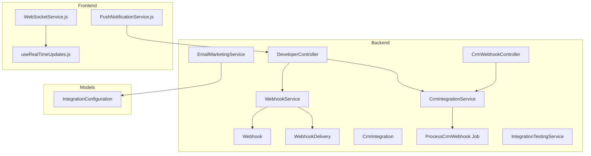
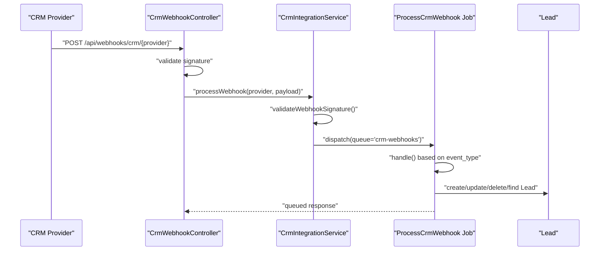
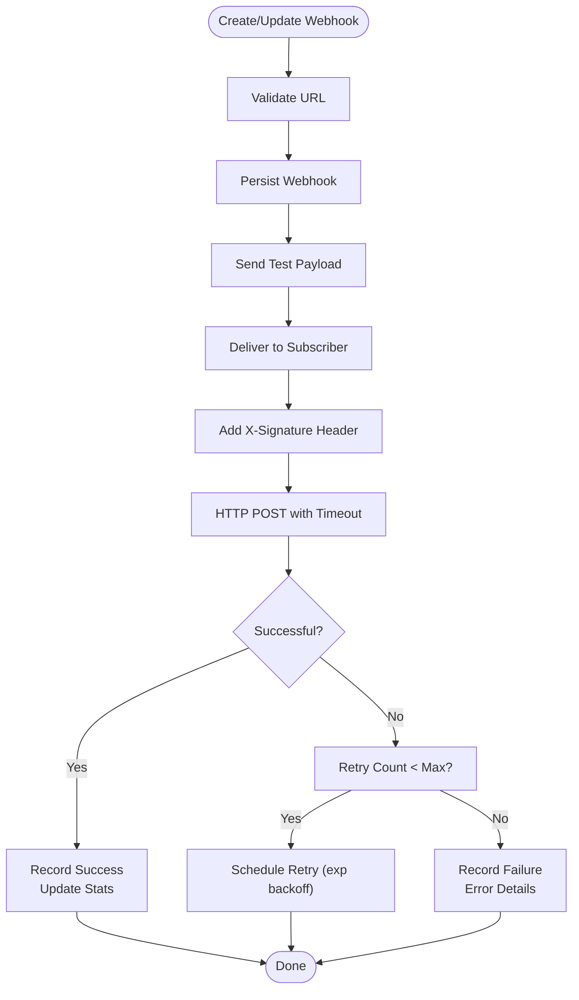
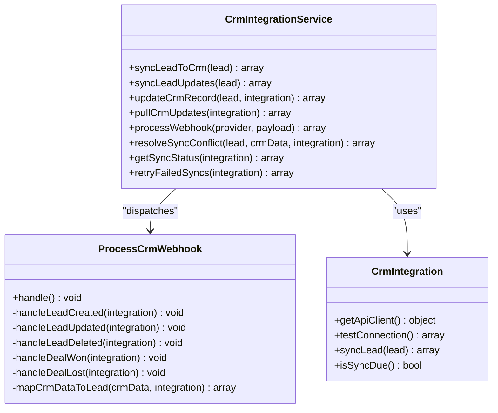
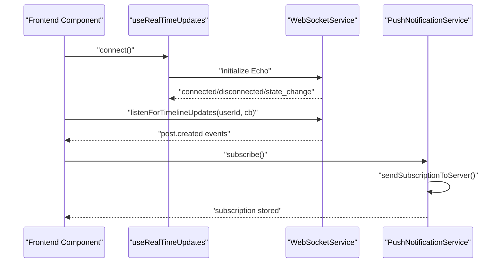
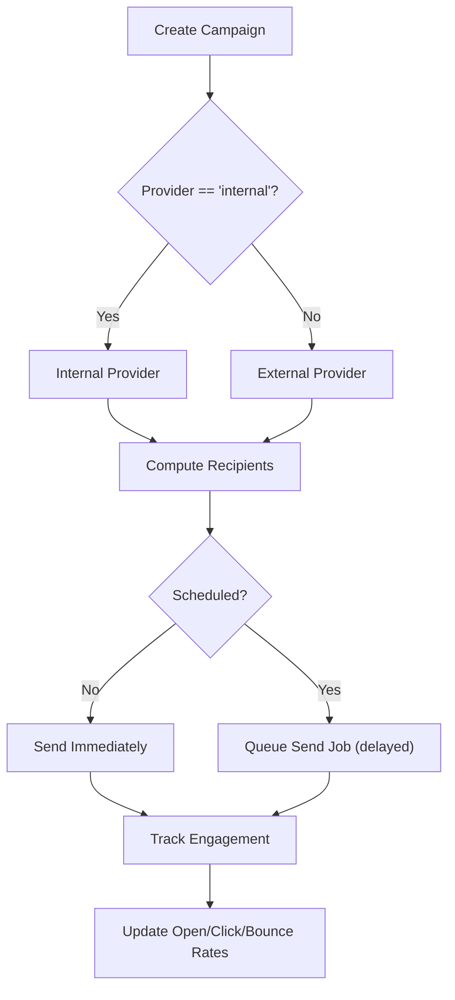
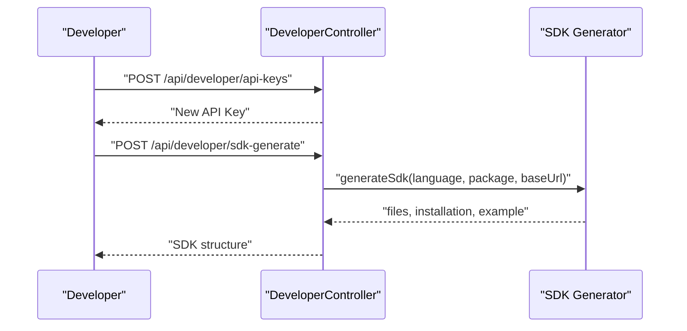
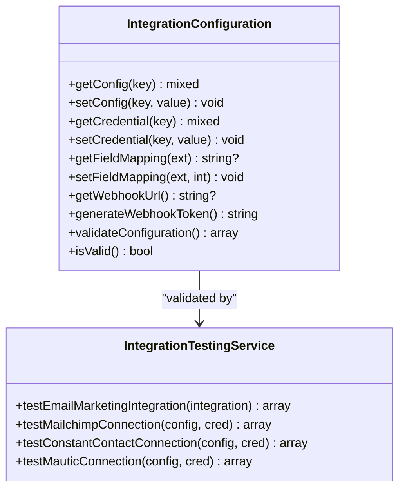
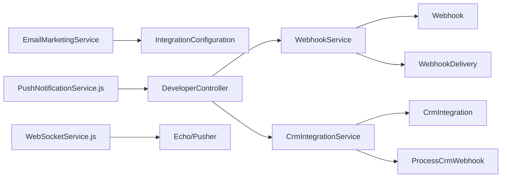

# Integration Patterns & Examples

<cite>
**Referenced Files in This Document**
- [WebhookService.php](file://app/Services/WebhookService.php)
- [Webhook.php](file://app/Models/Webhook.php)
- [WebhookDelivery.php](file://app/Models/WebhookDelivery.php)
- [CrmIntegrationService.php](file://app/Services/CrmIntegrationService.php)
- [CrmIntegration.php](file://app/Models/CrmIntegration.php)
- [ProcessCrmWebhook.php](file://app/Jobs/ProcessCrmWebhook.php)
- [CrmWebhookController.php](file://app/Http/Controllers/Api/CrmWebhookController.php)
- [EmailMarketingService.php](file://app/Services/EmailMarketingService.php)
- [IntegrationTestingService.php](file://app/Services/IntegrationTestingService.php)
- [DeveloperController.php](file://app/Http/Controllers/Api/DeveloperController.php)
- [WebSocketService.js](file://resources/js/services/WebSocketService.js)
- [useRealTimeUpdates.js](file://resources/js/composables/useRealTimeUpdates.js)
- [PushNotificationService.js](file://resources/js/services/PushNotificationService.js)
- [IntegrationConfiguration.php](file://app/Models/IntegrationConfiguration.php)
- [CRM_INTEGRATIONS.md](file://docs/CRM_INTEGRATIONS.md)
- [services.php](file://config/services.php)
</cite>

## Table of Contents
1. [Introduction](#introduction)
2. [Project Structure](#project-structure)
3. [Core Components](#core-components)
4. [Architecture Overview](#architecture-overview)
5. [Detailed Component Analysis](#detailed-component-analysis)
6. [Dependency Analysis](#dependency-analysis)
7. [Performance Considerations](#performance-considerations)
8. [Troubleshooting Guide](#troubleshooting-guide)
9. [Conclusion](#conclusion)
10. [Appendices](#appendices)

## Introduction
This document provides practical integration patterns and examples for the Alumate API, focusing on webhook processing, CRM synchronization, real-time communication, and developer tooling. It covers webhook validation, retry mechanisms, CRM webhook processing, event-driven architectures, SDK generation, and API testing strategies. The goal is to enable third-party integrations with reliable, scalable, and observable patterns.

## Project Structure
The integration capabilities span backend services, models, jobs, controllers, and frontend real-time clients:
- Backend: Webhook delivery engine, CRM integration orchestration, email marketing automation, SDK generation, and developer utilities.
- Frontend: WebSocket service for real-time updates, push notification management, and composables for reactive UI updates.
- Configuration: Integration configurations, provider credentials, and monitoring services.

**Diagram sources**
- [WebhookService.php:1-517](file://app/Services/WebhookService.php#L1-L517)
- [Webhook.php:1-60](file://app/Models/Webhook.php#L1-L60)
- [WebhookDelivery.php:1-54](file://app/Models/WebhookDelivery.php#L1-L54)
- [CrmIntegrationService.php:1-547](file://app/Services/CrmIntegrationService.php#L1-L547)
- [CrmIntegration.php:1-211](file://app/Models/CrmIntegration.php#L1-L211)
- [ProcessCrmWebhook.php:1-328](file://app/Jobs/ProcessCrmWebhook.php#L1-L328)
- [CrmWebhookController.php:1-89](file://app/Http/Controllers/Api/CrmWebhookController.php#L1-L89)
- [EmailMarketingService.php:1-444](file://app/Services/EmailMarketingService.php#L1-L444)
- [IntegrationTestingService.php:1-145](file://app/Services/IntegrationTestingService.php#L1-L145)
- [DeveloperController.php:1-454](file://app/Http/Controllers/Api/DeveloperController.php#L1-L454)
- [WebSocketService.js:1-427](file://resources/js/services/WebSocketService.js#L1-L427)
- [useRealTimeUpdates.js:1-41](file://resources/js/composables/useRealTimeUpdates.js#L1-L41)
- [PushNotificationService.js:159-201](file://resources/js/services/PushNotificationService.js#L159-L201)
- [IntegrationConfiguration.php:1-312](file://app/Models/IntegrationConfiguration.php#L1-L312)

**Section sources**
- [WebhookService.php:1-517](file://app/Services/WebhookService.php#L1-L517)
- [CrmIntegrationService.php:1-547](file://app/Services/CrmIntegrationService.php#L1-L547)
- [EmailMarketingService.php:1-444](file://app/Services/EmailMarketingService.php#L1-L444)
- [DeveloperController.php:1-454](file://app/Http/Controllers/Api/DeveloperController.php#L1-L454)
- [WebSocketService.js:1-427](file://resources/js/services/WebSocketService.js#L1-L427)
- [IntegrationConfiguration.php:1-312](file://app/Models/IntegrationConfiguration.php#L1-L312)

## Core Components
- Webhook delivery engine: Validates URLs, signs payloads, delivers to subscribers, tracks outcomes, and schedules retries.
- CRM integration service: Orchestrates bidirectional lead sync, webhook processing, conflict resolution, and retry logic.
- Real-time communication: WebSocket service with channels, presence, and reconnection; push notifications for browsers and mobile.
- Email marketing automation: Campaign creation, scheduling, personalization, and engagement tracking.
- Developer utilities: SDK generation, Postman collection export, API documentation, and API key management.

**Section sources**
- [WebhookService.php:1-517](file://app/Services/WebhookService.php#L1-L517)
- [CrmIntegrationService.php:1-547](file://app/Services/CrmIntegrationService.php#L1-L547)
- [WebSocketService.js:1-427](file://resources/js/services/WebSocketService.js#L1-L427)
- [EmailMarketingService.php:1-444](file://app/Services/EmailMarketingService.php#L1-L444)
- [DeveloperController.php:1-454](file://app/Http/Controllers/Api/DeveloperController.php#L1-L454)

## Architecture Overview
The integration architecture combines synchronous and asynchronous processing:
- Webhooks: Signed payloads validated by provider-specific logic, queued for processing, and retried with exponential backoff.
- CRM: Bidirectional synchronization with conflict resolution and retryable operations.
- Real-time: WebSocket channels for timeline, engagement, conversations, and notifications; push notifications for offline scenarios.
- Developer tooling: SDK scaffolding, Postman collections, and API documentation.

**Diagram sources**
- [CrmWebhookController.php:1-89](file://app/Http/Controllers/Api/CrmWebhookController.php#L1-L89)
- [CrmIntegrationService.php:218-252](file://app/Services/CrmIntegrationService.php#L218-L252)
- [ProcessCrmWebhook.php:33-98](file://app/Jobs/ProcessCrmWebhook.php#L33-L98)

**Section sources**
- [CrmWebhookController.php:1-89](file://app/Http/Controllers/Api/CrmWebhookController.php#L1-L89)
- [CrmIntegrationService.php:218-252](file://app/Services/CrmIntegrationService.php#L218-L252)
- [ProcessCrmWebhook.php:33-98](file://app/Jobs/ProcessCrmWebhook.php#L33-L98)

## Detailed Component Analysis

### Webhook Delivery Engine
The webhook delivery engine manages subscriber configuration, payload signing, delivery attempts, and retry scheduling:
- URL validation and reachability checks.
- HMAC-SHA256 signature header injection.
- Delivery outcome tracking with response codes and timings.
- Retry scheduling with exponential backoff and retry counters.
- Statistics aggregation for success rates, response codes, and event distribution.

**Diagram sources**
- [WebhookService.php:49-82](file://app/Services/WebhookService.php#L49-L82)
- [WebhookService.php:157-232](file://app/Services/WebhookService.php#L157-L232)
- [WebhookService.php:237-285](file://app/Services/WebhookService.php#L237-L285)
- [WebhookService.php:452-466](file://app/Services/WebhookService.php#L452-L466)

**Section sources**
- [WebhookService.php:1-517](file://app/Services/WebhookService.php#L1-L517)
- [Webhook.php:1-60](file://app/Models/Webhook.php#L1-L60)
- [WebhookDelivery.php:1-54](file://app/Models/WebhookDelivery.php#L1-L54)

### CRM Integration Orchestration
The CRM integration service coordinates lead synchronization and webhook processing:
- Active integration discovery per provider.
- Signature validation for incoming webhooks.
- Queued processing with retry policy and exponential backoff.
- Conflict resolution and sync status reporting.
- Pull updates from CRM with per-record error logging.

**Diagram sources**
- [CrmIntegrationService.php:29-117](file://app/Services/CrmIntegrationService.php#L29-L117)
- [CrmIntegrationService.php:169-213](file://app/Services/CrmIntegrationService.php#L169-L213)
- [CrmIntegrationService.php:218-252](file://app/Services/CrmIntegrationService.php#L218-L252)
- [ProcessCrmWebhook.php:33-98](file://app/Jobs/ProcessCrmWebhook.php#L33-L98)
- [CrmIntegration.php:34-54](file://app/Models/CrmIntegration.php#L34-L54)

**Section sources**
- [CrmIntegrationService.php:1-547](file://app/Services/CrmIntegrationService.php#L1-L547)
- [ProcessCrmWebhook.php:1-328](file://app/Jobs/ProcessCrmWebhook.php#L1-L328)
- [CrmIntegration.php:1-211](file://app/Models/CrmIntegration.php#L1-L211)

### Real-Time Integration Patterns
Real-time updates leverage WebSocket channels and push notifications:
- WebSocketService initializes Echo with Pusher, manages connection lifecycle, and exposes typed channels for timelines, engagement, conversations, and presence.
- useRealTimeUpdates composes connection state, reconnection attempts, and event listeners for Vue components.
- PushNotificationService handles subscription lifecycle, server-side registration, and batched push delivery with 410 cleanup.

**Diagram sources**
- [useRealTimeUpdates.js:1-41](file://resources/js/composables/useRealTimeUpdates.js#L1-L41)
- [WebSocketService.js:20-94](file://resources/js/services/WebSocketService.js#L20-L94)
- [WebSocketService.js:207-274](file://resources/js/services/WebSocketService.js#L207-L274)
- [PushNotificationService.js:189-201](file://resources/js/services/PushNotificationService.js#L189-L201)

**Section sources**
- [WebSocketService.js:1-427](file://resources/js/services/WebSocketService.js#L1-L427)
- [useRealTimeUpdates.js:1-41](file://resources/js/composables/useRealTimeUpdates.js#L1-L41)
- [PushNotificationService.js:159-201](file://resources/js/services/PushNotificationService.js#L159-L201)

### Email Marketing Automation
The email marketing service supports campaigns, automation rules, personalization, and engagement tracking:
- Campaign creation with provider routing (internal or external).
- Audience targeting via criteria (graduation years, schools, industries, locations).
- Personalization tokens and dynamic content insertion.
- Engagement tracking and metric updates.

**Diagram sources**
- [EmailMarketingService.php:23-99](file://app/Services/EmailMarketingService.php#L23-L99)
- [EmailMarketingService.php:122-164](file://app/Services/EmailMarketingService.php#L122-L164)
- [EmailMarketingService.php:211-257](file://app/Services/EmailMarketingService.php#L211-L257)

**Section sources**
- [EmailMarketingService.php:1-444](file://app/Services/EmailMarketingService.php#L1-L444)

### Developer Tooling and SDK Generation
DeveloperController provides utilities for API key management, webhook event enumeration, Postman collection generation, and SDK scaffolding:
- Generate API keys with permissions and expiry.
- Retrieve webhook events and test deliveries.
- Generate Postman collections with bearer auth and variables.
- Generate SDKs for JavaScript, PHP, Python, and C# with package manifests and examples.

**Diagram sources**
- [DeveloperController.php:18-55](file://app/Http/Controllers/Api/DeveloperController.php#L18-L55)
- [DeveloperController.php:304-337](file://app/Http/Controllers/Api/DeveloperController.php#L304-L337)
- [DeveloperController.php:342-381](file://app/Http/Controllers/Api/DeveloperController.php#L342-L381)

**Section sources**
- [DeveloperController.php:1-454](file://app/Http/Controllers/Api/DeveloperController.php#L1-L454)

### Integration Configuration and Testing
IntegrationConfiguration centralizes provider credentials, field mappings, webhook endpoints, and validation rules:
- Encrypted credential storage.
- Type-scoped validation (email marketing, calendar, SSO, CRM).
- Webhook URL generation and token management.
- IntegrationTestingService validates email marketing provider connections.

**Diagram sources**
- [IntegrationConfiguration.php:104-145](file://app/Models/IntegrationConfiguration.php#L104-L145)
- [IntegrationConfiguration.php:286-310](file://app/Models/IntegrationConfiguration.php#L286-L310)
- [IntegrationTestingService.php:121-133](file://app/Services/IntegrationTestingService.php#L121-L133)

**Section sources**
- [IntegrationConfiguration.php:1-312](file://app/Models/IntegrationConfiguration.php#L1-L312)
- [IntegrationTestingService.php:1-145](file://app/Services/IntegrationTestingService.php#L1-L145)

## Dependency Analysis
- WebhookService depends on Webhook and WebhookDelivery models and uses HTTP client for outbound deliveries.
- CrmIntegrationService orchestrates CRM clients via CrmIntegration and delegates webhook processing to ProcessCrmWebhook jobs.
- EmailMarketingService integrates with provider clients and queues send jobs.
- DeveloperController aggregates SDK generation and Postman collection creation.
- Frontend services depend on environment variables and Laravel Echo for real-time features.

**Diagram sources**
- [WebhookService.php:1-517](file://app/Services/WebhookService.php#L1-L517)
- [Webhook.php:1-60](file://app/Models/Webhook.php#L1-L60)
- [WebhookDelivery.php:1-54](file://app/Models/WebhookDelivery.php#L1-L54)
- [CrmIntegrationService.php:1-547](file://app/Services/CrmIntegrationService.php#L1-L547)
- [CrmIntegration.php:1-211](file://app/Models/CrmIntegration.php#L1-L211)
- [ProcessCrmWebhook.php:1-328](file://app/Jobs/ProcessCrmWebhook.php#L1-L328)
- [EmailMarketingService.php:1-444](file://app/Services/EmailMarketingService.php#L1-L444)
- [IntegrationConfiguration.php:1-312](file://app/Models/IntegrationConfiguration.php#L1-L312)
- [DeveloperController.php:1-454](file://app/Http/Controllers/Api/DeveloperController.php#L1-L454)
- [WebSocketService.js:1-427](file://resources/js/services/WebSocketService.js#L1-L427)
- [PushNotificationService.js:159-201](file://resources/js/services/PushNotificationService.js#L159-L201)

**Section sources**
- [WebhookService.php:1-517](file://app/Services/WebhookService.php#L1-L517)
- [CrmIntegrationService.php:1-547](file://app/Services/CrmIntegrationService.php#L1-L547)
- [EmailMarketingService.php:1-444](file://app/Services/EmailMarketingService.php#L1-L444)
- [DeveloperController.php:1-454](file://app/Http/Controllers/Api/DeveloperController.php#L1-L454)
- [WebSocketService.js:1-427](file://resources/js/services/WebSocketService.js#L1-L427)
- [IntegrationConfiguration.php:1-312](file://app/Models/IntegrationConfiguration.php#L1-L312)

## Performance Considerations
- Webhook delivery timeouts and retry backoff prevent resource contention and thundering herds.
- Queue-based CRM webhook processing decouples high-latency CRM APIs from request handling.
- Real-time channels scale horizontally with Echo/Pusher; ensure appropriate cluster and transport settings.
- Email campaigns are queued for delayed sending to smooth traffic spikes.
- Use provider rate limiting and exponential backoff; monitor API usage metrics.

[No sources needed since this section provides general guidance]

## Troubleshooting Guide
Common integration issues and remedies:
- Webhook signature validation failures: verify provider-specific signatures and secrets; check headers and timestamps.
- Delivery failures: inspect response codes, error messages, and retry counts; confirm subscriber URL reachability.
- CRM sync conflicts: prefer local data or reconcile based on timestamps; review field mappings.
- Real-time connectivity: monitor connection state changes, reconnection attempts, and channel join/leave events.
- Email marketing provider errors: validate credentials and list IDs; test provider connections before enabling.

**Section sources**
- [WebhookService.php:210-224](file://app/Services/WebhookService.php#L210-L224)
- [CrmIntegrationService.php:241-251](file://app/Services/CrmIntegrationService.php#L241-L251)
- [ProcessCrmWebhook.php:89-97](file://app/Jobs/ProcessCrmWebhook.php#L89-L97)
- [WebSocketService.js:67-94](file://resources/js/services/WebSocketService.js#L67-L94)
- [IntegrationTestingService.php:138-145](file://app/Services/IntegrationTestingService.php#L138-L145)

## Conclusion
Alumate’s integration patterns emphasize reliability, scalability, and observability. Webhooks are signed and retried with exponential backoff; CRM synchronization is bidirectional with conflict handling; real-time updates leverage WebSocket channels and push notifications; and developer tooling accelerates integration with SDKs and Postman collections. These patterns provide a robust foundation for third-party integrations across CRM, email marketing, calendars, and beyond.

[No sources needed since this section summarizes without analyzing specific files]

## Appendices

### CRM Integration Reference
- Supported providers, field mappings, and configuration examples are documented comprehensively.

**Section sources**
- [CRM_INTEGRATIONS.md:1-428](file://docs/CRM_INTEGRATIONS.md#L1-L428)
- [CrmIntegration.php:34-54](file://app/Models/CrmIntegration.php#L34-L54)

### Monitoring and Alerting
- Centralized monitoring configuration supports Slack, PagerDuty, DataDog, and NewRelic.

**Section sources**
- [services.php:46-52](file://config/services.php#L46-L52)