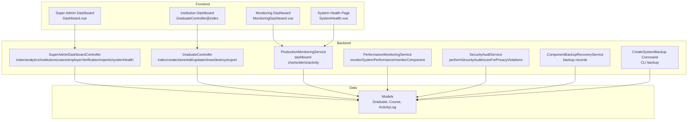
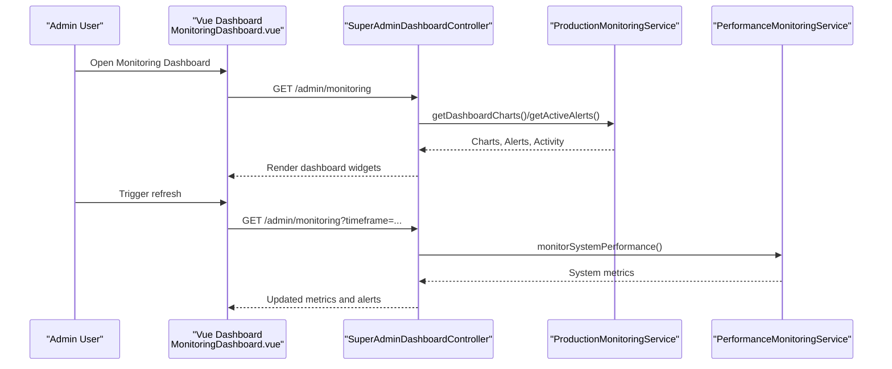
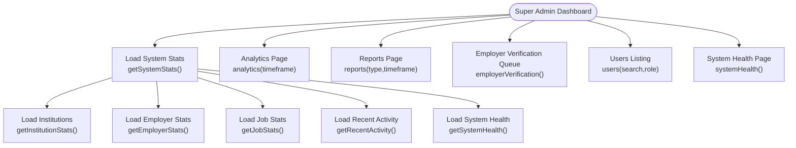
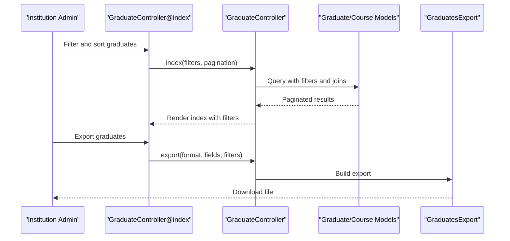
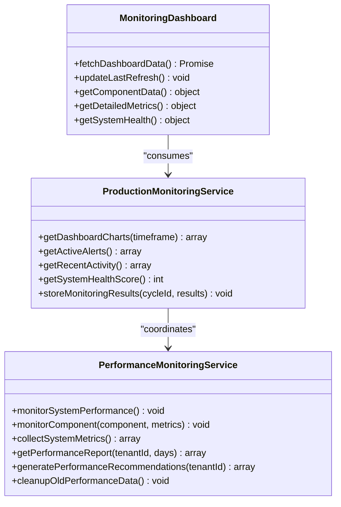
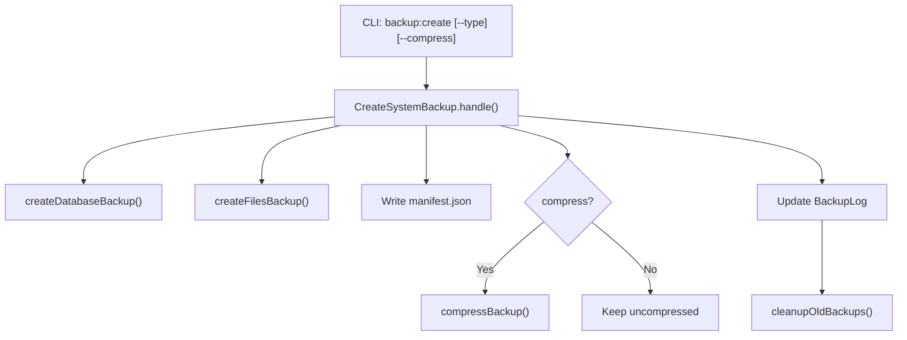
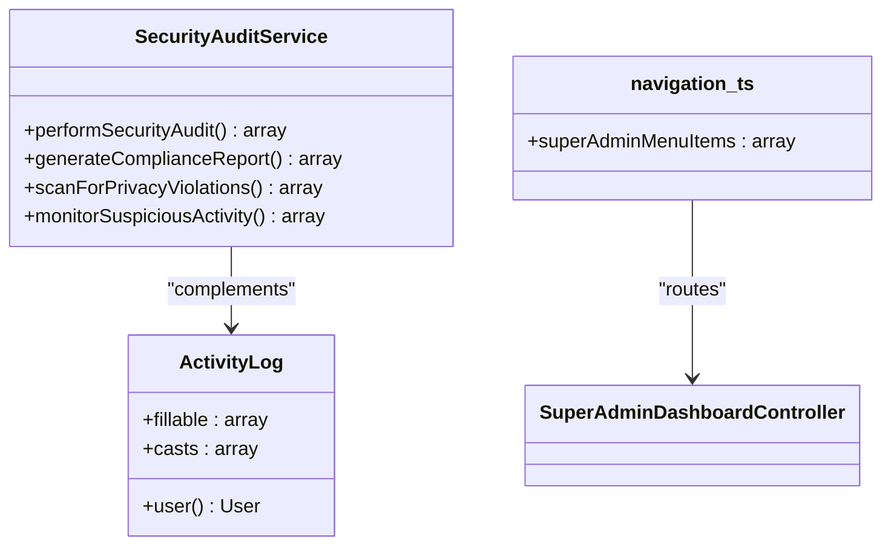
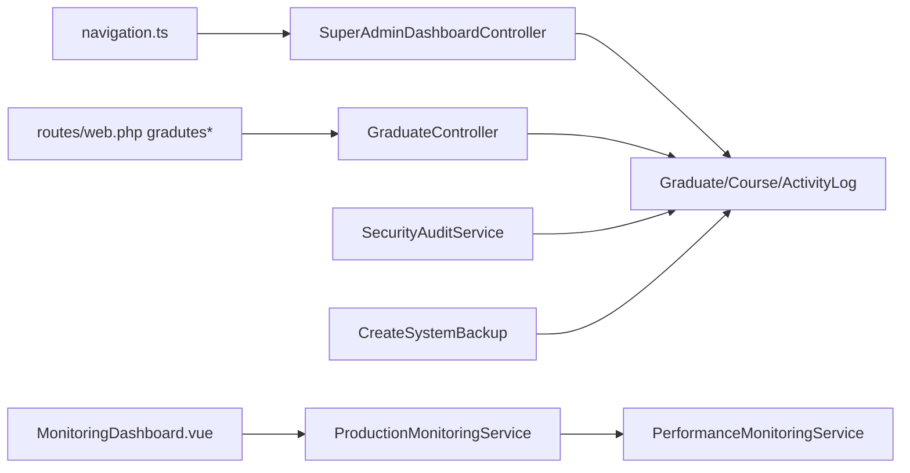

# Administrative Tools

<cite>
**Referenced Files in This Document**
- [SuperAdminDashboardController.php](file://app/Http/Controllers/SuperAdminDashboardController.php)
- [navigation.ts](file://resources/js/Lib/navigation.ts)
- [SuperAdminDashboardTest.php](file://tests/Feature/SuperAdminDashboardTest.php)
- [web.php](file://routes/web.php)
- [requirements.md](file://.kiro/specs/graduate-tracking-system/requirements.md)
- [tasks.md](file://.kiro/specs/graduate-tracking-system/tasks.md)
- [ProductionMonitoringService.php](file://app/Services/ProductionMonitoringService.php)
- [MonitoringDashboard.vue](file://resources/js/Pages/Admin/MonitoringDashboard.vue)
- [SystemHealth.vue](file://resources/js/Pages/SuperAdmin/SystemHealth.vue)
- [DetailedMetrics.vue](file://resources/js/components/monitoring/DetailedMetrics.vue)
- [Dashboard.vue](file://resources/js/Pages/SuperAdmin/Dashboard.vue)
- [Database.vue](file://resources/js/Pages/SuperAdmin/Database.vue)
- [ComponentBackupRecoveryService.php](file://app/Services/ComponentBackupRecoveryService.php)
- [SecurityAuditService.php](file://app/Services/SecurityAuditService.php)
- [CreateSystemBackup.php](file://app/Console/Commands/CreateSystemBackup.php)
- [InstitutionDetailsController.php](file://app/Http/Controllers/InstitutionDetailsController.php)
- [PerformanceMonitoringService.php](file://app/Services/PerformanceMonitoringService.php)
- [ActivityLog.php](file://app/Models/ActivityLog.php)
- [Graduate.php](file://app/Models/Graduate.php)
- [Course.php](file://app/Models/Course.php)
- [GraduateController.php](file://app/Http/Controllers/GraduateController.php)
</cite>

## Table of Contents
1. [Introduction](#introduction)
2. [Project Structure](#project-structure)
3. [Core Components](#core-components)
4. [Architecture Overview](#architecture-overview)
5. [Detailed Component Analysis](#detailed-component-analysis)
6. [Dependency Analysis](#dependency-analysis)
7. [Performance Considerations](#performance-considerations)
8. [Troubleshooting Guide](#troubleshooting-guide)
9. [Conclusion](#conclusion)
10. [Appendices](#appendices)

## Introduction
This document describes the administrative tools for Alumate’s platform, focusing on three pillars:
- Super admin dashboard: system-wide visibility, tenant and user administration, employer verification, and analytics.
- Institution admin panel: graduate and course administration, bulk data operations, and analytics reporting.
- System monitoring: performance tracking, health dashboards, and backup/recovery procedures.

It also documents administrative security measures, audit logging, access control, and practical workflows for day-to-day administration.

## Project Structure
Administrative functionality spans backend controllers, frontend dashboards, services, and models:
- Backend controllers expose administrative pages and APIs.
- Frontend dashboards render analytics, monitoring, and administrative forms.
- Services encapsulate monitoring, auditing, and backup logic.
- Models represent administrative entities and audit trails.

**Diagram sources**
- [Dashboard.vue:177-196](file://resources/js/Pages/SuperAdmin/Dashboard.vue#L177-L196)
- [GraduateController.php:17-150](file://app/Http/Controllers/GraduateController.php#L17-L150)
- [ProductionMonitoringService.php:552-589](file://app/Services/ProductionMonitoringService.php#L552-L589)
- [MonitoringDashboard.vue:24-117](file://resources/js/Pages/Admin/MonitoringDashboard.vue#L24-L117)
- [SystemHealth.vue:1-32](file://resources/js/Pages/SuperAdmin/SystemHealth.vue#L1-L32)
- [PerformanceMonitoringService.php:62-82](file://app/Services/PerformanceMonitoringService.php#L62-L82)
- [ActivityLog.php:1-31](file://app/Models/ActivityLog.php#L1-L31)
- [Graduate.php:1-243](file://app/Models/Graduate.php#L1-L243)
- [Course.php:1-200](file://app/Models/Course.php#L1-L200)
- [CreateSystemBackup.php:18-68](file://app/Console/Commands/CreateSystemBackup.php#L18-L68)

**Section sources**
- [SuperAdminDashboardController.php:30-53](file://app/Http/Controllers/SuperAdminDashboardController.php#L30-L53)
- [GraduateController.php:17-150](file://app/Http/Controllers/GraduateController.php#L17-L150)
- [ProductionMonitoringService.php:552-589](file://app/Services/ProductionMonitoringService.php#L552-L589)
- [MonitoringDashboard.vue:24-117](file://resources/js/Pages/Admin/MonitoringDashboard.vue#L24-L117)
- [SystemHealth.vue:1-32](file://resources/js/Pages/SuperAdmin/SystemHealth.vue#L1-L32)
- [PerformanceMonitoringService.php:62-82](file://app/Services/PerformanceMonitoringService.php#L62-L82)
- [ActivityLog.php:1-31](file://app/Models/ActivityLog.php#L1-L31)
- [Graduate.php:1-243](file://app/Models/Graduate.php#L1-L243)
- [Course.php:1-200](file://app/Models/Course.php#L1-L200)
- [CreateSystemBackup.php:18-68](file://app/Console/Commands/CreateSystemBackup.php#L18-L68)

## Core Components
- Super Admin Dashboard Controller: aggregates system stats, institutions, employer verification queue, analytics, reports, and system health.
- Institution Admin Dashboard: graduate listing, creation, editing, employment updates, exports, and filters.
- Monitoring Dashboards: real-time system overview, health scores, KPIs, charts, alerts summary, recent activity, and detailed metrics.
- Performance Monitoring Service: component and system performance checks, budgets, alerts, and recommendations.
- Production Monitoring Service: dashboard charts, active alerts, recent activity, and health scoring.
- Security Audit Service: comprehensive audits, compliance reports, privacy scans, and suspicious activity monitoring.
- Backup and Recovery: CLI backup command, backup records management, and database/file backup strategies.
- Activity Logging: centralized audit trail model for administrative and user actions.

**Section sources**
- [SuperAdminDashboardController.php:30-183](file://app/Http/Controllers/SuperAdminDashboardController.php#L30-L183)
- [GraduateController.php:17-389](file://app/Http/Controllers/GraduateController.php#L17-L389)
- [MonitoringDashboard.vue:24-117](file://resources/js/Pages/Admin/MonitoringDashboard.vue#L24-L117)
- [PerformanceMonitoringService.php:18-82](file://app/Services/PerformanceMonitoringService.php#L18-L82)
- [ProductionMonitoringService.php:552-589](file://app/Services/ProductionMonitoringService.php#L552-L589)
- [SecurityAuditService.php:12-72](file://app/Services/SecurityAuditService.php#L12-L72)
- [CreateSystemBackup.php:18-68](file://app/Console/Commands/CreateSystemBackup.php#L18-L68)
- [ActivityLog.php:1-31](file://app/Models/ActivityLog.php#L1-L31)

## Architecture Overview
Administrative dashboards are rendered via Inertia.js with Laravel controllers serving data. Monitoring and analytics are powered by dedicated services and cached metrics. Backup operations are executed via CLI commands with persistent records.

**Diagram sources**
- [MonitoringDashboard.vue:151-193](file://resources/js/Pages/Admin/MonitoringDashboard.vue#L151-L193)
- [SuperAdminDashboardController.php:55-82](file://app/Http/Controllers/SuperAdminDashboardController.php#L55-L82)
- [ProductionMonitoringService.php:552-589](file://app/Services/ProductionMonitoringService.php#L552-L589)
- [PerformanceMonitoringService.php:62-82](file://app/Services/PerformanceMonitoringService.php#L62-L82)

## Detailed Component Analysis

### Super Admin Dashboard
- Capabilities:
  - System-wide growth and institution stats.
  - Employer verification queue with pending/under review/verified/rejected counts.
  - Analytics across user growth, institution performance, employment trends, job market analysis, and system usage.
  - Exportable reports across multiple timeframes and formats.
  - System health overview (database, cache, queue, storage, performance, security, backups).
- Navigation menu items include Institutions, System Analytics, Content Management, Activity Monitoring, Database Management, Performance, Notifications, System Settings, Security Dashboard, and Manage Admins.

**Diagram sources**
- [SuperAdminDashboardController.php:30-183](file://app/Http/Controllers/SuperAdminDashboardController.php#L30-L183)

**Section sources**
- [SuperAdminDashboardController.php:30-183](file://app/Http/Controllers/SuperAdminDashboardController.php#L30-L183)
- [navigation.ts:55-67](file://resources/js/Lib/navigation.ts#L55-L67)
- [SuperAdminDashboardTest.php:24-45](file://tests/Feature/SuperAdminDashboardTest.php#L24-L45)

### Institution Admin Panel
- Graduate Management:
  - Index with advanced filters (employment status, graduation year(s), course(s), skills, GPA range, academic standing, job search status, profile completion).
  - Create, edit, show, delete, and update employment and privacy settings.
  - Bulk export in Excel/CSV/PDF with configurable fields and headers.
- Course Administration:
  - Course model supports statistics computation, matching jobs, skills overlap, recent graduates, and employment trends.
- Practical workflows:
  - Bulk import/export via Excel (import/export classes exist in the codebase).
  - Audit logs for graduate profile changes.

**Diagram sources**
- [GraduateController.php:17-150](file://app/Http/Controllers/GraduateController.php#L17-L150)
- [GraduateController.php:334-387](file://app/Http/Controllers/GraduateController.php#L334-L387)
- [Graduate.php:1-243](file://app/Models/Graduate.php#L1-L243)
- [Course.php:1-200](file://app/Models/Course.php#L1-L200)

**Section sources**
- [web.php:255-262](file://routes/web.php#L255-L262)
- [GraduateController.php:17-389](file://app/Http/Controllers/GraduateController.php#L17-L389)
- [Graduate.php:1-243](file://app/Models/Graduate.php#L1-L243)
- [Course.php:1-200](file://app/Models/Course.php#L1-L200)
- [requirements.md:34-70](file://.kiro/specs/graduate-tracking-system/requirements.md#L34-L70)
- [tasks.md:102-110](file://.kiro/specs/graduate-tracking-system/tasks.md#L102-L110)

### System Monitoring Tools
- Monitoring Dashboard:
  - Widgets for system overview, health score, KPIs, performance chart, alerts summary, component analytics, traffic trends, error rate chart, security incidents, and recent activity.
  - Auto-refresh and alert modal.
- Production Monitoring Service:
  - Dashboard charts, active alerts, recent activity, and health score calculation.
- Performance Monitoring Service:
  - Component and system performance checks, budgets, violations, alerts, recommendations, and cleanup.

**Diagram sources**
- [ProductionMonitoringService.php:552-589](file://app/Services/ProductionMonitoringService.php#L552-L589)
- [PerformanceMonitoringService.php:18-82](file://app/Services/PerformanceMonitoringService.php#L18-L82)
- [MonitoringDashboard.vue:119-229](file://resources/js/Pages/Admin/MonitoringDashboard.vue#L119-L229)

**Section sources**
- [MonitoringDashboard.vue:24-117](file://resources/js/Pages/Admin/MonitoringDashboard.vue#L24-L117)
- [MonitoringDashboard.vue:119-229](file://resources/js/Pages/Admin/MonitoringDashboard.vue#L119-L229)
- [ProductionMonitoringService.php:552-589](file://app/Services/ProductionMonitoringService.php#L552-L589)
- [PerformanceMonitoringService.php:62-82](file://app/Services/PerformanceMonitoringService.php#L62-L82)

### Backup and Recovery Procedures
- CLI Backup Command:
  - Creates database and files backups, generates manifest, optionally compresses, logs backup metadata, and cleans up old backups based on retention policy.
- Backup Records Management:
  - Stores backup metadata in local storage JSON for tracking.
- Database/File Backup Strategy:
  - Uses mysqldump/pg_dump for database and tar for files; supports selective directories and manifests.

**Diagram sources**
- [CreateSystemBackup.php:18-68](file://app/Console/Commands/CreateSystemBackup.php#L18-L68)
- [CreateSystemBackup.php:70-109](file://app/Console/Commands/CreateSystemBackup.php#L70-L109)
- [CreateSystemBackup.php:184-218](file://app/Console/Commands/CreateSystemBackup.php#L184-L218)
- [ComponentBackupRecoveryService.php:444-474](file://app/Services/ComponentBackupRecoveryService.php#L444-L474)

**Section sources**
- [CreateSystemBackup.php:18-272](file://app/Console/Commands/CreateSystemBackup.php#L18-L272)
- [ComponentBackupRecoveryService.php:444-474](file://app/Services/ComponentBackupRecoveryService.php#L444-L474)

### Administrative Security Measures, Audit Logging, and Access Control
- Security Audit Service:
  - Performs comprehensive audits, compliance reports, privacy scans, and suspicious activity monitoring.
- Activity Logging:
  - Centralized ActivityLog model captures user actions, IP, user agent, and related model context.
- Access Control:
  - Navigation items enforce permissions (e.g., “view institutions”, “manage super admins”).
  - Institution admin edits are authorized against the tenant context.

**Diagram sources**
- [SecurityAuditService.php:12-72](file://app/Services/SecurityAuditService.php#L12-L72)
- [ActivityLog.php:1-31](file://app/Models/ActivityLog.php#L1-L31)
- [navigation.ts:55-67](file://resources/js/Lib/navigation.ts#L55-L67)

**Section sources**
- [SecurityAuditService.php:12-347](file://app/Services/SecurityAuditService.php#L12-L347)
- [ActivityLog.php:1-31](file://app/Models/ActivityLog.php#L1-L31)
- [navigation.ts:55-67](file://resources/js/Lib/navigation.ts#L55-L67)
- [InstitutionDetailsController.php:10-29](file://app/Http/Controllers/InstitutionDetailsController.php#L10-L29)

### Practical Administrative Tasks and Workflows
- Super Admin:
  - Approve employer verification requests.
  - Export system reports (overview, institutions, employment, jobs) in Excel/PDF/CSV.
  - Monitor system health and performance, review alerts, and adjust performance budgets.
- Institution Admin:
  - Manage graduate profiles (create, update employment/privacy settings, export).
  - Filter and sort graduates by multiple criteria.
  - Maintain course catalog and review course-level analytics.
- Monitoring:
  - Refresh dashboards for real-time insights.
  - Drill into detailed metrics and system health components.
- Backup:
  - Trigger on-demand backups and verify backup status and retention.

**Section sources**
- [SuperAdminDashboardController.php:128-147](file://app/Http/Controllers/SuperAdminDashboardController.php#L128-L147)
- [SuperAdminDashboardController.php:185-205](file://app/Http/Controllers/SuperAdminDashboardController.php#L185-L205)
- [GraduateController.php:334-387](file://app/Http/Controllers/GraduateController.php#L334-L387)
- [MonitoringDashboard.vue:151-193](file://resources/js/Pages/Admin/MonitoringDashboard.vue#L151-L193)
- [SystemHealth.vue:219-265](file://resources/js/Pages/SuperAdmin/SystemHealth.vue#L219-L265)
- [CreateSystemBackup.php:18-68](file://app/Console/Commands/CreateSystemBackup.php#L18-L68)

## Dependency Analysis
Administrative components depend on:
- Controllers for rendering dashboards and handling administrative actions.
- Services for monitoring, auditing, and backup operations.
- Models for data persistence and audit trails.
- Routes for exposing administrative endpoints.

**Diagram sources**
- [navigation.ts:55-67](file://resources/js/Lib/navigation.ts#L55-L67)
- [web.php:255-262](file://routes/web.php#L255-L262)
- [SuperAdminDashboardController.php:30-53](file://app/Http/Controllers/SuperAdminDashboardController.php#L30-L53)
- [GraduateController.php:17-150](file://app/Http/Controllers/GraduateController.php#L17-L150)
- [ProductionMonitoringService.php:552-589](file://app/Services/ProductionMonitoringService.php#L552-L589)
- [PerformanceMonitoringService.php:62-82](file://app/Services/PerformanceMonitoringService.php#L62-L82)
- [SecurityAuditService.php:12-72](file://app/Services/SecurityAuditService.php#L12-L72)
- [CreateSystemBackup.php:18-68](file://app/Console/Commands/CreateSystemBackup.php#L18-L68)

**Section sources**
- [navigation.ts:55-67](file://resources/js/Lib/navigation.ts#L55-L67)
- [web.php:255-262](file://routes/web.php#L255-L262)
- [SuperAdminDashboardController.php:30-53](file://app/Http/Controllers/SuperAdminDashboardController.php#L30-L53)
- [GraduateController.php:17-150](file://app/Http/Controllers/GraduateController.php#L17-L150)
- [ProductionMonitoringService.php:552-589](file://app/Services/ProductionMonitoringService.php#L552-L589)
- [PerformanceMonitoringService.php:62-82](file://app/Services/PerformanceMonitoringService.php#L62-L82)
- [SecurityAuditService.php:12-72](file://app/Services/SecurityAuditService.php#L12-L72)
- [CreateSystemBackup.php:18-68](file://app/Console/Commands/CreateSystemBackup.php#L18-L68)

## Performance Considerations
- Use performance budgets to detect and alert on elevated component render times and memory usage.
- Store metrics in cache for trend analysis and limit stored data to prevent unbounded growth.
- Generate recommendations to optimize slow components and system-wide bottlenecks.
- Monitor system health continuously and surface critical issues promptly.

[No sources needed since this section provides general guidance]

## Troubleshooting Guide
- Monitoring Dashboard:
  - Use the alert modal to review active alerts and recent activity.
  - Inspect detailed metrics for response time, memory usage, error rate, and throughput.
- System Health:
  - Review backup status, last backup, next scheduled, and retention period.
  - Check database, cache, queue, and storage health indicators.
- Backup Failures:
  - Confirm database driver compatibility and credentials.
  - Verify file permissions and available disk space.
  - Inspect backup logs and cleanup old backups per retention policy.

**Section sources**
- [MonitoringDashboard.vue:119-229](file://resources/js/Pages/Admin/MonitoringDashboard.vue#L119-L229)
- [SystemHealth.vue:219-265](file://resources/js/Pages/SuperAdmin/SystemHealth.vue#L219-L265)
- [CreateSystemBackup.php:55-67](file://app/Console/Commands/CreateSystemBackup.php#L55-L67)

## Conclusion
Alumate’s administrative tools provide comprehensive capabilities for super admins and institution admins, supported by robust monitoring, security, and backup mechanisms. The modular architecture enables scalable administration while maintaining strong auditability and performance visibility.

[No sources needed since this section summarizes without analyzing specific files]

## Appendices
- Administrative navigation items and permissions are defined in the frontend navigation library.
- Administrative requirements and tasks are documented in the project’s specification files.

**Section sources**
- [navigation.ts:55-67](file://resources/js/Lib/navigation.ts#L55-L67)
- [requirements.md:25-74](file://.kiro/specs/graduate-tracking-system/requirements.md#L25-L74)
- [tasks.md:91-127](file://.kiro/specs/graduate-tracking-system/tasks.md#L91-L127)