# Institution Admin Panel

<cite>
**Referenced Files in This Document**
- [web.php](file://routes/web.php)
- [InstitutionAdminDashboardController.php](file://app\Http\Controllers\InstitutionAdminDashboardController.php)
- [Graduate.php](file://app\Models\Graduate.php)
- [GraduatesImport.php](file://app\Imports\GraduatesImport.php)
- [GraduatesExport.php](file://app\Exports\GraduatesExport.php)
- [Institution.php](file://app\Models\Institution.php)
- [AnalyticsController.php](file://app\Http\Controllers\InstitutionAdmin\AnalyticsController.php)
- [Analytics.vue](file://resources\js\Pages\InstitutionAdmin\Analytics.vue)
- [ANALYTICS_TODO.md](file://docs\development\ANALYTICS_TODO.md)
- [README.md](file://README.md)
- [task-04-graduate-profile-management-recap.md](file://docs\task-04-graduate-profile-management-recap.md)
- [task-06-course-management-enhancement-recap.md](file://docs\task-06-course-management-enhancement-recap.md)
- [index.ts](file://resources\js\types\index.ts)
- [index.ts](file://resources\js\Types\index.ts)
</cite>

## Table of Contents
1. [Introduction](#introduction)
2. [Project Structure](#project-structure)
3. [Core Components](#core-components)
4. [Architecture Overview](#architecture-overview)
5. [Detailed Component Analysis](#detailed-component-analysis)
6. [Dependency Analysis](#dependency-analysis)
7. [Performance Considerations](#performance-considerations)
8. [Troubleshooting Guide](#troubleshooting-guide)
9. [Conclusion](#conclusion)
10. [Appendices](#appendices)

## Introduction
The Institution Admin Panel provides a centralized interface for institutional-level administration and management. It enables administrators to oversee graduate lifecycle data, manage courses and curricula, coordinate staff, and consume analytics and reporting. The panel integrates import/export operations for bulk data management, offers dashboards for monitoring institutional metrics, and supports customization via branding and integration settings.

## Project Structure
The Institution Admin Panel is implemented as a Laravel application with Inertia.js for the frontend. Routes define the institutional admin area, controllers orchestrate data retrieval and rendering, Eloquent models represent domain entities, and dedicated import/export classes handle data synchronization. Analytics endpoints and frontend pages deliver insights and interactive dashboards.

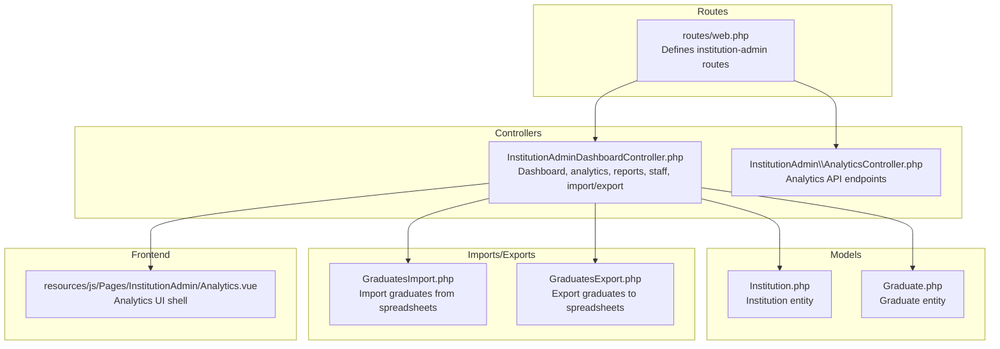

**Diagram sources**
- [web.php:229-253](file://routes/web.php#L229-L253)
- [InstitutionAdminDashboardController.php:18-656](file://app\Http\Controllers\InstitutionAdminDashboardController.php#L18-L656)
- [AnalyticsController.php:1-46](file://app\Http\Controllers\InstitutionAdmin\AnalyticsController.php#L1-L46)
- [Institution.php:10-77](file://app\Models\Institution.php#L10-L77)
- [Graduate.php:11-243](file://app\Models\Graduate.php#L11-L243)
- [GraduatesImport.php:16-402](file://app\Imports\GraduatesImport.php#L16-L402)
- [GraduatesExport.php:17-358](file://app\Exports\GraduatesExport.php#L17-L358)
- [Analytics.vue:1-23](file://resources\js\Pages\InstitutionAdmin\Analytics.vue#L1-L23)

**Section sources**
- [web.php:229-253](file://routes\web.php#L229-L253)

## Core Components
- Dashboard: Presents institutional overview, recent activities, employment statistics, and course performance.
- Analytics: Provides curated dashboards for graduate outcomes, course ROI, employer engagement, and community health.
- Reports: Generates CSV exports for employment, course performance, graduate outcomes, and job placement.
- Staff Management: Lists institution staff and roles with pagination and role selection.
- Import/Export Center: Tracks import history and statistics; integrates with graduate import/export classes.
- Graduate Management: Supports profile updates, bulk imports, and data synchronization via import/export classes.
- Course Administration: Manages curriculum, enrollment tracking, and academic analytics.
- Job Management: Enables employer connections, placement tracking, and career outcomes.
- Institutional Customization: Branding and integration settings for institutional customization.

**Section sources**
- [InstitutionAdminDashboardController.php:20-119](file://app\Http\Controllers\InstitutionAdminDashboardController.php#L20-L119)
- [InstitutionAdminDashboardController.php:44-63](file://app\Http\Controllers\InstitutionAdminDashboardController.php#L44-L63)
- [InstitutionAdminDashboardController.php:65-82](file://app\Http\Controllers\InstitutionAdminDashboardController.php#L65-L82)
- [InstitutionAdminDashboardController.php:84-100](file://app\Http\Controllers\InstitutionAdminDashboardController.php#L84-L100)
- [InstitutionAdminDashboardController.php:102-119](file://app\Http\Controllers\InstitutionAdminDashboardController.php#L102-L119)
- [GraduatesImport.php:16-402](file://app\Imports\GraduatesImport.php#L16-L402)
- [GraduatesExport.php:17-358](file://app\Exports\GraduatesExport.php#L17-L358)

## Architecture Overview
The system follows a layered architecture:
- Presentation Layer: Inertia.js pages render institutional dashboards and analytics.
- Controller Layer: Laravel controllers handle routing, orchestration, and data preparation.
- Service/Model Layer: Eloquent models encapsulate domain logic and persistence.
- Import/Export Layer: Dedicated classes manage spreadsheet ingestion and generation.
- Analytics Layer: API endpoints expose cached or computed analytics snapshots.

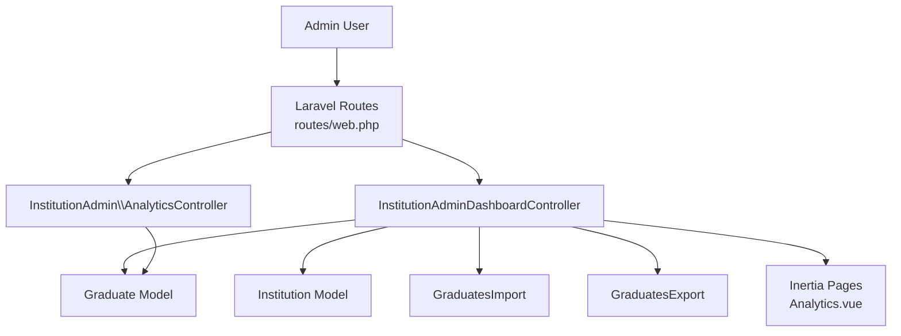

**Diagram sources**
- [web.php:229-253](file://routes\web.php#L229-L253)
- [InstitutionAdminDashboardController.php:18-656](file://app\Http\Controllers\InstitutionAdminDashboardController.php#L18-L656)
- [AnalyticsController.php:1-46](file://app\Http\Controllers\InstitutionAdmin\AnalyticsController.php#L1-L46)
- [Graduate.php:11-243](file://app\Models\Graduate.php#L11-L243)
- [Institution.php:10-77](file://app\Models\Institution.php#L10-L77)
- [GraduatesImport.php:16-402](file://app\Imports\GraduatesImport.php#L16-L402)
- [GraduatesExport.php:17-358](file://app\Exports\GraduatesExport.php#L17-L358)
- [Analytics.vue:1-23](file://resources\js\Pages\InstitutionAdmin\Analytics.vue#L1-L23)

## Detailed Component Analysis

### Dashboard
The dashboard aggregates institutional metrics and recent activities. It computes counts for total graduates, employed graduates, total courses, staff members, and displays recent graduate registrations and job applications.

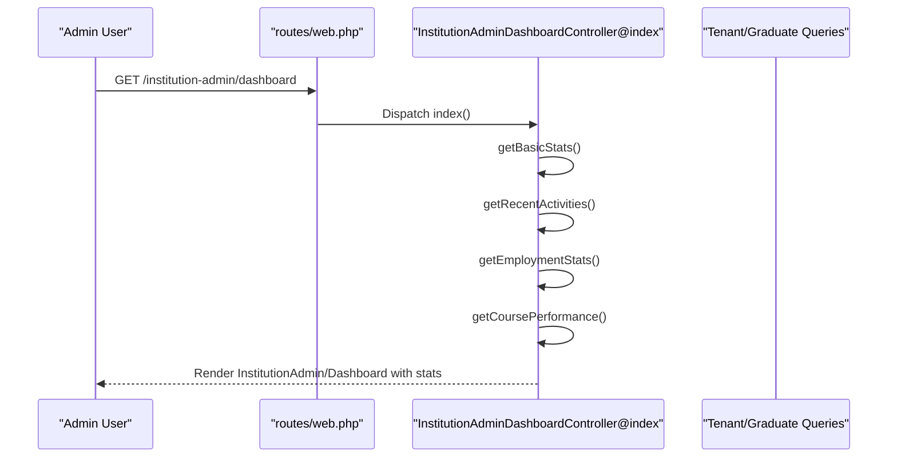

**Diagram sources**
- [web.php:230-231](file://routes\web.php#L230-L231)
- [InstitutionAdminDashboardController.php:20-42](file://app\Http\Controllers\InstitutionAdminDashboardController.php#L20-L42)

**Section sources**
- [InstitutionAdminDashboardController.php:20-42](file://app\Http\Controllers\InstitutionAdminDashboardController.php#L20-L42)
- [InstitutionAdminDashboardController.php:121-137](file://app\Http\Controllers\InstitutionAdminDashboardController.php#L121-L137)
- [InstitutionAdminDashboardController.php:139-197](file://app\Http\Controllers\InstitutionAdminDashboardController.php#L139-L197)
- [InstitutionAdminDashboardController.php:199-230](file://app\Http\Controllers\InstitutionAdminDashboardController.php#L199-L230)
- [InstitutionAdminDashboardController.php:232-253](file://app\Http\Controllers\InstitutionAdminDashboardController.php#L232-L253)

### Analytics
The analytics module exposes curated dashboards and API endpoints for graduate outcomes, course ROI, employer engagement, and community health. The frontend Analytics page provides navigation and links to specialized dashboards.

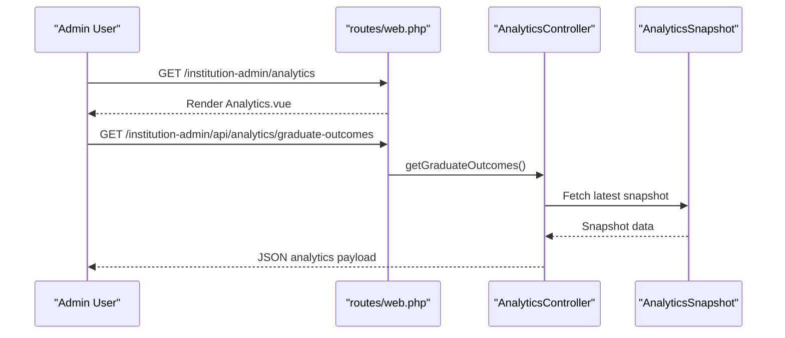

**Diagram sources**
- [web.php:247-253](file://routes\web.php#L247-L253)
- [AnalyticsController.php:15-30](file://app\Http\Controllers\InstitutionAdmin\AnalyticsController.php#L15-L30)
- [Analytics.vue:1-23](file://resources\js\Pages\InstitutionAdmin\Analytics.vue#L1-L23)

**Section sources**
- [web.php:247-253](file://routes\web.php#L247-L253)
- [AnalyticsController.php:15-46](file://app\Http\Controllers\InstitutionAdmin\AnalyticsController.php#L15-L46)
- [Analytics.vue:1-23](file://resources\js\Pages\InstitutionAdmin\Analytics.vue#L1-L23)
- [ANALYTICS_TODO.md:1-25](file://docs\development\ANALYTICS_TODO.md#L1-L25)

### Reports
The reports feature generates CSV exports for employment, course performance, graduate outcomes, and job placement. Users can select date ranges and download consolidated datasets.

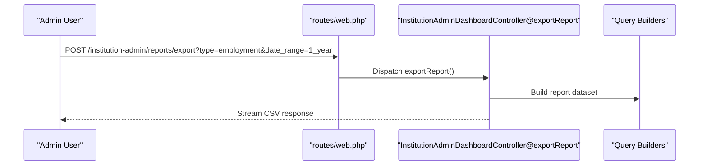

**Diagram sources**
- [web.php:236-236](file://routes\web.php#L236-L236)
- [InstitutionAdminDashboardController.php:514-585](file://app\Http\Controllers\InstitutionAdminDashboardController.php#L514-L585)

**Section sources**
- [InstitutionAdminDashboardController.php:65-82](file://app\Http\Controllers\InstitutionAdminDashboardController.php#L65-L82)
- [InstitutionAdminDashboardController.php:514-585](file://app\Http\Controllers\InstitutionAdminDashboardController.php#L514-L585)

### Staff Management
The staff management view lists institution staff and roles, with pagination and role selection for administrative actions.

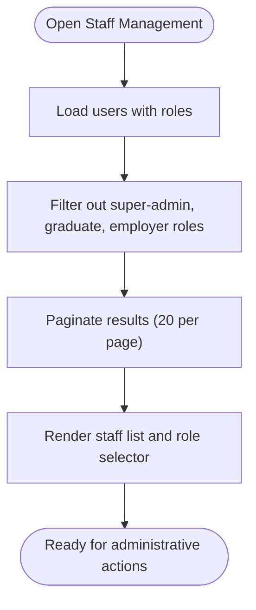

**Diagram sources**
- [InstitutionAdminDashboardController.php:84-100](file://app\Http\Controllers\InstitutionAdminDashboardController.php#L84-L100)

**Section sources**
- [InstitutionAdminDashboardController.php:84-100](file://app\Http\Controllers\InstitutionAdminDashboardController.php#L84-L100)

### Import/Export Center
The import/export center tracks import history and provides statistics for total, successful, failed, and pending imports. It integrates with import/export classes for bulk operations.

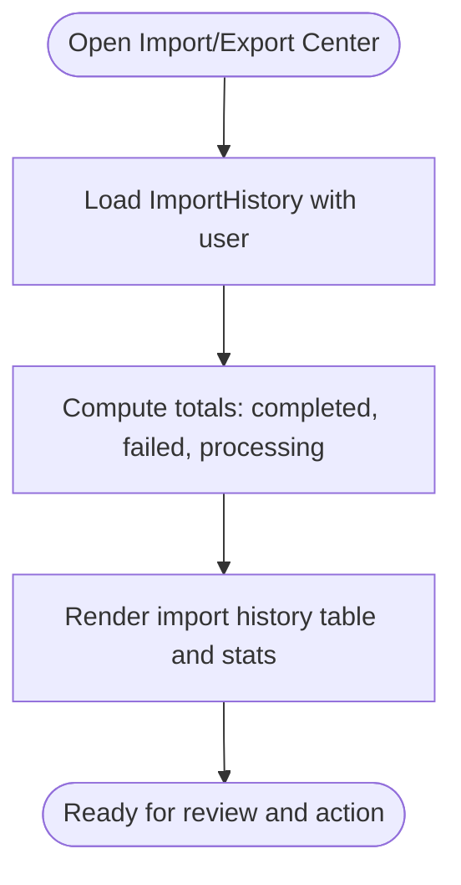

**Diagram sources**
- [InstitutionAdminDashboardController.php:102-119](file://app\Http\Controllers\InstitutionAdminDashboardController.php#L102-L119)

**Section sources**
- [InstitutionAdminDashboardController.php:102-119](file://app\Http\Controllers\InstitutionAdminDashboardController.php#L102-L119)

### Graduate Management
Graduate management encompasses profile updates, bulk operations, and data synchronization. The Graduate model supports profile completion calculations, employment status updates, and scoping helpers. The import/export classes enable robust ingestion and extraction of graduate data.

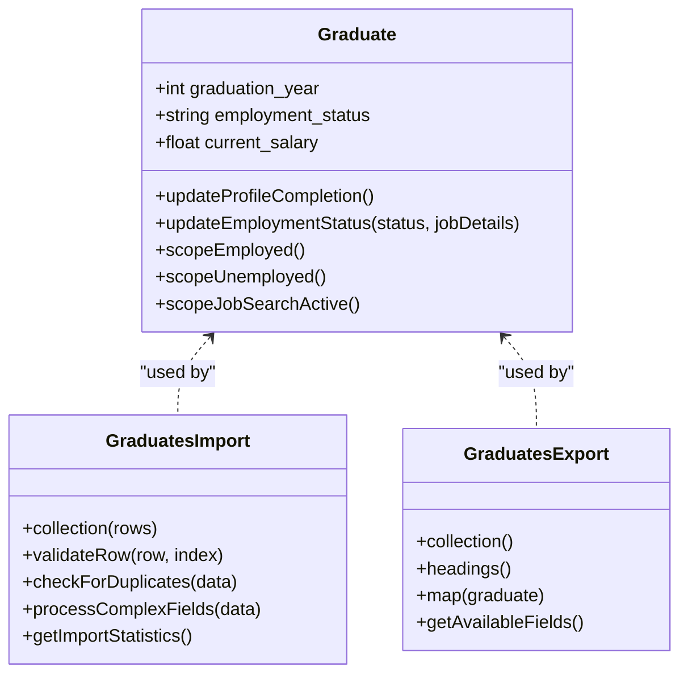

**Diagram sources**
- [Graduate.php:15-243](file://app\Models\Graduate.php#L15-L243)
- [GraduatesImport.php:52-108](file://app\Imports\GraduatesImport.php#L52-L108)
- [GraduatesExport.php:32-99](file://app\Exports\GraduatesExport.php#L32-L99)

**Section sources**
- [Graduate.php:138-221](file://app\Models\Graduate.php#L138-L221)
- [Graduate.php:226-241](file://app\Models\Graduate.php#L226-L241)
- [GraduatesImport.php:191-236](file://app\Imports\GraduatesImport.php#L191-L236)
- [GraduatesImport.php:238-270](file://app\Imports\GraduatesImport.php#L238-L270)
- [GraduatesImport.php:326-374](file://app\Imports\GraduatesImport.php#L326-L374)
- [GraduatesExport.php:115-124](file://app\Exports\GraduatesExport.php#L115-L124)
- [GraduatesExport.php:161-185](file://app\Exports\GraduatesExport.php#L161-L185)

### Course Administration
Course administration supports curriculum management, enrollment tracking, and academic analytics. The dashboard aggregates course performance and outcomes, while documentation outlines administrative tools and analytics.

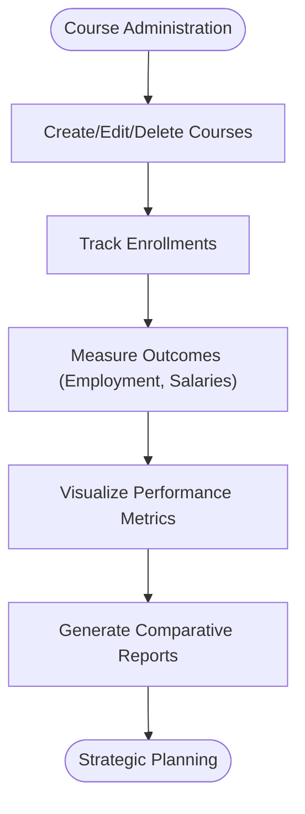

**Diagram sources**
- [InstitutionAdminDashboardController.php:232-253](file://app\Http\Controllers\InstitutionAdminDashboardController.php#L232-L253)
- [task-06-course-management-enhancement-recap.md:205-283](file://docs\task-06-course-management-enhancement-recap.md#L205-L283)

**Section sources**
- [InstitutionAdminDashboardController.php:232-253](file://app\Http\Controllers\InstitutionAdminDashboardController.php#L232-L253)
- [task-06-course-management-enhancement-recap.md:205-283](file://docs\task-06-course-management-enhancement-recap.md#L205-L283)

### Job Management
Job management features enable employer connections, placement tracking, and career outcomes. The platform emphasizes smart matching, application tracking, and analytics for performance insights.

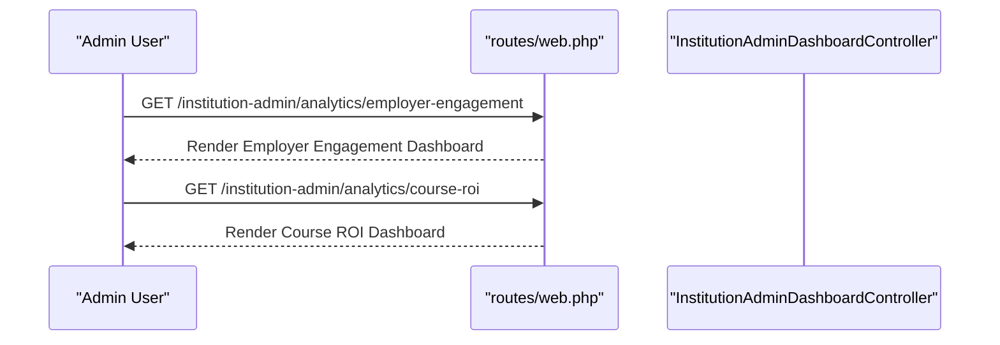

**Diagram sources**
- [web.php:237-238](file://routes\web.php#L237-L238)
- [InstitutionAdminDashboardController.php:629-642](file://app\Http\Controllers\InstitutionAdminDashboardController.php#L629-L642)

**Section sources**
- [web.php:237-238](file://routes\web.php#L237-L238)
- [InstitutionAdminDashboardController.php:629-642](file://app\Http\Controllers\InstitutionAdminDashboardController.php#L629-L642)
- [README.md:79-99](file://README.md#L79-L99)

### Institutional Customization and Integrations
Institutional customization includes branding controls and integration settings. The routes expose endpoints for viewing and updating branding and integrations.

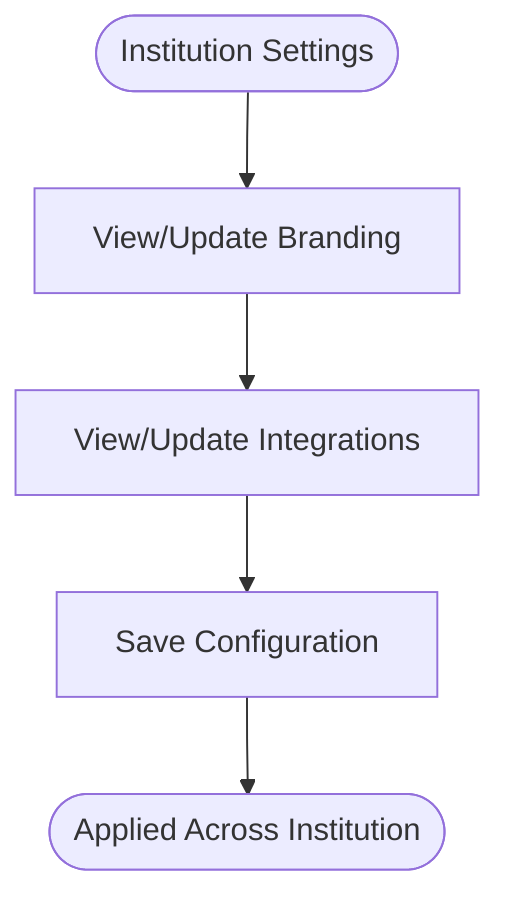

**Diagram sources**
- [web.php:242-245](file://routes\web.php#L242-L245)

**Section sources**
- [web.php:242-245](file://routes\web.php#L242-L245)
- [Institution.php:14-51](file://app\Models\Institution.php#L14-L51)

## Dependency Analysis
The dashboard controller orchestrates multiple model queries and import/export operations. Analytics rely on cached snapshots, while import/export classes depend on validator rules and Eloquent models.

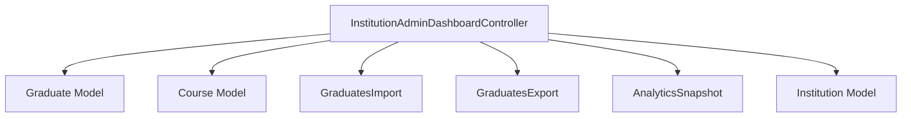

**Diagram sources**
- [InstitutionAdminDashboardController.php:5-16](file://app\Http\Controllers\InstitutionAdminDashboardController.php#L5-L16)
- [Graduate.php:11-243](file://app\Models\Graduate.php#L11-L243)
- [GraduatesImport.php:16-402](file://app\Imports\GraduatesImport.php#L16-L402)
- [GraduatesExport.php:17-358](file://app\Exports\GraduatesExport.php#L17-L358)
- [AnalyticsController.php:6-30](file://app\Http\Controllers\InstitutionAdmin\AnalyticsController.php#L6-L30)
- [Institution.php:10-77](file://app\Models\Institution.php#L10-L77)

**Section sources**
- [InstitutionAdminDashboardController.php:5-16](file://app\Http\Controllers\InstitutionAdminDashboardController.php#L5-L16)
- [AnalyticsController.php:6-30](file://app\Http\Controllers\InstitutionAdmin\AnalyticsController.php#L6-L30)

## Performance Considerations
- Use pagination for staff and import history listings to limit payload sizes.
- Cache analytics snapshots to reduce database load for frequently accessed metrics.
- Apply selective field loading and eager loading for related entities to minimize N+1 queries.
- Leverage database indexing on frequently filtered columns (e.g., tenant_id, course_id, employment_status).
- Stream CSV exports to avoid memory spikes during large exports.

## Troubleshooting Guide
- Analytics data not available: Verify that analytics snapshots exist and are recent; confirm API endpoints return data.
- Import failures: Review invalid rows and conflict resolutions generated by the import class; ensure required fields and course existence.
- Export issues: Confirm filters and selected fields; validate date ranges and sort parameters.
- Employment/salary calculations: Ensure employment_status arrays contain expected keys; verify salary range mappings.

**Section sources**
- [AnalyticsController.php:19-30](file://app\Http\Controllers\InstitutionAdmin\AnalyticsController.php#L19-L30)
- [GraduatesImport.php:191-236](file://app\Imports\GraduatesImport.php#L191-L236)
- [GraduatesImport.php:110-139](file://app\Imports\GraduatesImport.php#L110-L139)
- [GraduatesExport.php:32-99](file://app\Exports\GraduatesExport.php#L32-L99)

## Conclusion
The Institution Admin Panel consolidates graduate, course, staff, and analytics workflows into a cohesive administrative environment. It supports efficient data management through import/export operations, insightful dashboards for monitoring outcomes, and customizable branding and integrations for institutional alignment.

## Appendices

### Practical Examples and Workflows
- Bulk graduate import: Upload a spreadsheet; validate rows, resolve duplicates, and update existing records as configured; track statistics and conflicts.
- Export graduate dataset: Apply filters (course, graduation year, employment status), select fields, and download a CSV for external reporting.
- Generate employment report: Choose a date range and export employment statistics for institutional review.
- Monitor course performance: Use course performance metrics and outcomes to inform curriculum decisions.
- Track job placement: Review placement reports and employer engagement analytics to assess career outcomes.

**Section sources**
- [GraduatesImport.php:52-108](file://app\Imports\GraduatesImport.php#L52-L108)
- [GraduatesExport.php:32-99](file://app\Exports\GraduatesExport.php#L32-L99)
- [InstitutionAdminDashboardController.php:418-512](file://app\Http\Controllers\InstitutionAdminDashboardController.php#L418-L512)
- [task-06-course-management-enhancement-recap.md:237-276](file://docs\task-06-course-management-enhancement-recap.md#L237-L276)

### Data Types and Analytics Interfaces
The frontend defines typed interfaces for industry placement, demographic outcomes, and trend data to support analytics dashboards.

**Section sources**
- [index.ts:387-444](file://resources\js\types\index.ts#L387-L444)
- [index.ts:387-444](file://resources\js\Types\index.ts#L387-L444)