# Super Admin Dashboard

<cite>
**Referenced Files in This Document**
- [SuperAdminDashboardController.php](file://app/Http/Controllers/SuperAdminDashboardController.php)
- [Dashboard.vue](file://resources/js/Pages/SuperAdmin/Dashboard.vue)
- [Analytics.vue](file://resources/js/Pages/SuperAdmin/Analytics.vue)
- [Institutions.vue](file://resources/js/Pages/SuperAdmin/Institutions.vue)
- [Users.vue](file://resources/js/Pages/SuperAdmin/Users.vue)
- [SystemHealth.vue](file://resources/js/Pages/SuperAdmin/SystemHealth.vue)
- [Tenant.php](file://app/Models/Tenant.php)
- [User.php](file://app/Models/User.php)
- [ActivityLog.php](file://app/Models/ActivityLog.php)
- [AnalyticsService.php](file://app/Services/AnalyticsService.php)
- [PerformanceMonitoringService.php](file://app/Services/PerformanceMonitoringService.php)
- [SecurityAuditService.php](file://app/Services/SecurityAuditService.php)
- [ProductionMonitoringService.php](file://app/Services/ProductionMonitoringService.php)
- [tenancy.php](file://config/tenancy.php)
- [task-03-multi-tenant-enhancement-recap.md](file://docs/task-03-multi-tenant-enhancement-recap.md)
- [task-02-user-management-system-recap.md](file://docs/task-02-user-management-system-recap.md)
- [README.md](file://README.md)
- [technical-specification.md](file://technical-specification.md)
</cite>

## Table of Contents
1. [Introduction](#introduction)
2. [Project Structure](#project-structure)
3. [Core Components](#core-components)
4. [Architecture Overview](#architecture-overview)
5. [Detailed Component Analysis](#detailed-component-analysis)
6. [Dependency Analysis](#dependency-analysis)
7. [Performance Considerations](#performance-considerations)
8. [Troubleshooting Guide](#troubleshooting-guide)
9. [Conclusion](#conclusion)
10. [Appendices](#appendices)

## Introduction
The Super Admin Dashboard provides enterprise-level system administration for multi-tenant platforms. It enables centralized oversight across institutions, user administration, system-wide analytics, and performance monitoring. The dashboard offers actionable insights, health indicators, user activity tracking, and institutional analytics, alongside administrative workflows for managing tenants, permissions, system settings, and performance optimization.

## Project Structure
The Super Admin Dashboard is implemented as a Vue-based frontend integrated with Laravel backend controllers and services. Key components include:
- Frontend pages for dashboard, analytics, institutions, users, and system health
- Backend controllers orchestrating data aggregation and rendering
- Services for analytics, performance monitoring, and security auditing
- Models representing tenants, users, and activity logs
- Configuration supporting multi-tenancy and tenant isolation

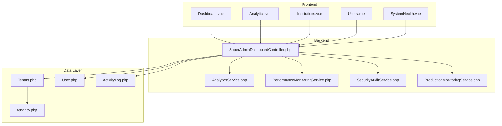

**Diagram sources**
- [Dashboard.vue:1-396](file://resources/js/Pages/SuperAdmin/Dashboard.vue#L1-L396)
- [SuperAdminDashboardController.php:1-800](file://app/Http/Controllers/SuperAdminDashboardController.php#L1-L800)
- [AnalyticsService.php:1-800](file://app/Services/AnalyticsService.php#L1-L800)
- [PerformanceMonitoringService.php:1-433](file://app/Services/PerformanceMonitoringService.php#L1-L433)
- [SecurityAuditService.php:1-347](file://app/Services/SecurityAuditService.php#L1-L347)
- [ProductionMonitoringService.php:40-758](file://app/Services/ProductionMonitoringService.php#L40-L758)
- [Tenant.php:1-86](file://app/Models/Tenant.php#L1-L86)
- [User.php:1-818](file://app/Models/User.php#L1-L818)
- [ActivityLog.php:1-31](file://app/Models/ActivityLog.php#L1-L31)
- [tenancy.php:1-82](file://config/tenancy.php#L1-L82)

**Section sources**
- [Dashboard.vue:1-396](file://resources/js/Pages/SuperAdmin/Dashboard.vue#L1-L396)
- [SuperAdminDashboardController.php:1-800](file://app/Http/Controllers/SuperAdminDashboardController.php#L1-L800)
- [tenancy.php:1-82](file://config/tenancy.php#L1-L82)

## Core Components
- Super Admin Dashboard page: Presents system stats, quick actions, user growth charts, institution performance, system health, recent activity, and job market overview.
- Analytics page: Displays system-wide analytics including user growth, institution performance, employment trends, job market analysis, and system usage.
- Institutions management page: Lists all institutions, their status, user and graduate counts, and provides actions to manage them.
- Users management page: Provides search and filter capabilities across users, with role-based visibility and actions such as suspend.
- System Health page: Shows database, cache, queue, storage, performance, security, and backup statuses, plus active alerts.
- Backend controller: Aggregates system stats, analytics, institution performance, and health metrics for rendering.
- Services: AnalyticsService, PerformanceMonitoringService, SecurityAuditService, and ProductionMonitoringService provide data and monitoring capabilities.
- Models: Tenant, User, and ActivityLog represent core entities and relationships.

**Section sources**
- [Dashboard.vue:1-396](file://resources/js/Pages/SuperAdmin/Dashboard.vue#L1-L396)
- [Analytics.vue:1-22](file://resources/js/Pages/SuperAdmin/Analytics.vue#L1-L22)
- [Institutions.vue:1-249](file://resources/js/Pages/SuperAdmin/Institutions.vue#L1-L249)
- [Users.vue:1-289](file://resources/js/Pages/SuperAdmin/Users.vue#L1-L289)
- [SystemHealth.vue:1-407](file://resources/js/Pages/SuperAdmin/SystemHealth.vue#L1-L407)
- [SuperAdminDashboardController.php:1-800](file://app/Http/Controllers/SuperAdminDashboardController.php#L1-L800)
- [AnalyticsService.php:1-800](file://app/Services/AnalyticsService.php#L1-L800)
- [PerformanceMonitoringService.php:1-433](file://app/Services/PerformanceMonitoringService.php#L1-L433)
- [SecurityAuditService.php:1-347](file://app/Services/SecurityAuditService.php#L1-L347)
- [ProductionMonitoringService.php:40-758](file://app/Services/ProductionMonitoringService.php#L40-L758)
- [Tenant.php:1-86](file://app/Models/Tenant.php#L1-L86)
- [User.php:1-818](file://app/Models/User.php#L1-L818)
- [ActivityLog.php:1-31](file://app/Models/ActivityLog.php#L1-L31)

## Architecture Overview
The Super Admin Dashboard follows a layered architecture:
- Presentation layer: Vue pages render dashboards and analytics.
- Application layer: Laravel controllers coordinate data retrieval and rendering.
- Domain services: Analytics, performance, and security services encapsulate business logic.
- Data layer: Eloquent models and tenancy configuration manage tenant isolation and data access.

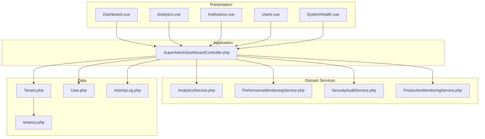

**Diagram sources**
- [Dashboard.vue:1-396](file://resources/js/Pages/SuperAdmin/Dashboard.vue#L1-L396)
- [SuperAdminDashboardController.php:1-800](file://app/Http/Controllers/SuperAdminDashboardController.php#L1-L800)
- [AnalyticsService.php:1-800](file://app/Services/AnalyticsService.php#L1-L800)
- [PerformanceMonitoringService.php:1-433](file://app/Services/PerformanceMonitoringService.php#L1-L433)
- [SecurityAuditService.php:1-347](file://app/Services/SecurityAuditService.php#L1-L347)
- [ProductionMonitoringService.php:40-758](file://app/Services/ProductionMonitoringService.php#L40-L758)
- [Tenant.php:1-86](file://app/Models/Tenant.php#L1-L86)
- [User.php:1-818](file://app/Models/User.php#L1-L818)
- [ActivityLog.php:1-31](file://app/Models/ActivityLog.php#L1-L31)
- [tenancy.php:1-82](file://config/tenancy.php#L1-L82)

## Detailed Component Analysis

### Super Admin Dashboard Page
The dashboard presents:
- System stats cards (new users, new institutions, activity, views)
- Quick actions (manage institutions, user management, employer verification, system reports)
- User growth chart (last 30 days)
- Institution performance (top institutions by graduates and employment rate)
- System health indicators (database, cache, queue, storage usage, response time, uptime)
- Recent activity timeline
- Job market overview (total jobs, active jobs, filled jobs, pending approval, average applications per job, top job types)

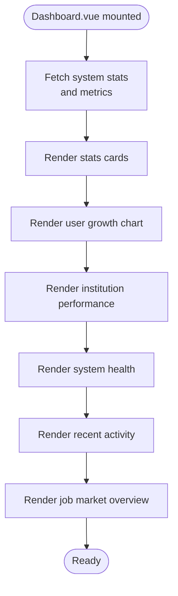

**Diagram sources**
- [Dashboard.vue:1-396](file://resources/js/Pages/SuperAdmin/Dashboard.vue#L1-L396)

**Section sources**
- [Dashboard.vue:1-396](file://resources/js/Pages/SuperAdmin/Dashboard.vue#L1-L396)

### Analytics Page
The analytics page aggregates:
- User growth data over a selected timeframe
- Institution performance metrics
- Employment trends
- Job market analysis (by type and location)
- System usage metrics (daily logins, feature usage)
- Platform benchmarks and market trends snapshots

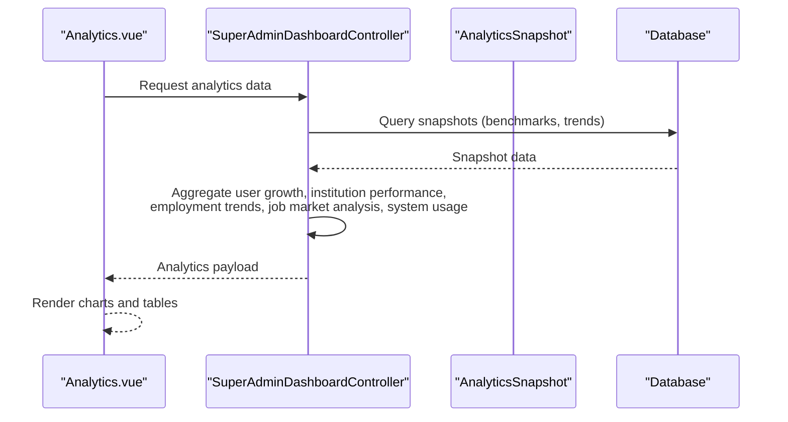

**Diagram sources**
- [Analytics.vue:1-22](file://resources/js/Pages/SuperAdmin/Analytics.vue#L1-L22)
- [SuperAdminDashboardController.php:55-82](file://app/Http/Controllers/SuperAdminDashboardController.php#L55-L82)

**Section sources**
- [Analytics.vue:1-22](file://resources/js/Pages/SuperAdmin/Analytics.vue#L1-L22)
- [SuperAdminDashboardController.php:55-82](file://app/Http/Controllers/SuperAdminDashboardController.php#L55-L82)
- [AnalyticsService.php:1-800](file://app/Services/AnalyticsService.php#L1-L800)

### Institutions Management
The institutions page displays:
- Stats overview (total institutions, active institutions, total users, total graduates)
- Institutions list with status badges, domain lists, and counts
- Actions to view, edit, and delete institutions
- Bulk operations and filtering capabilities

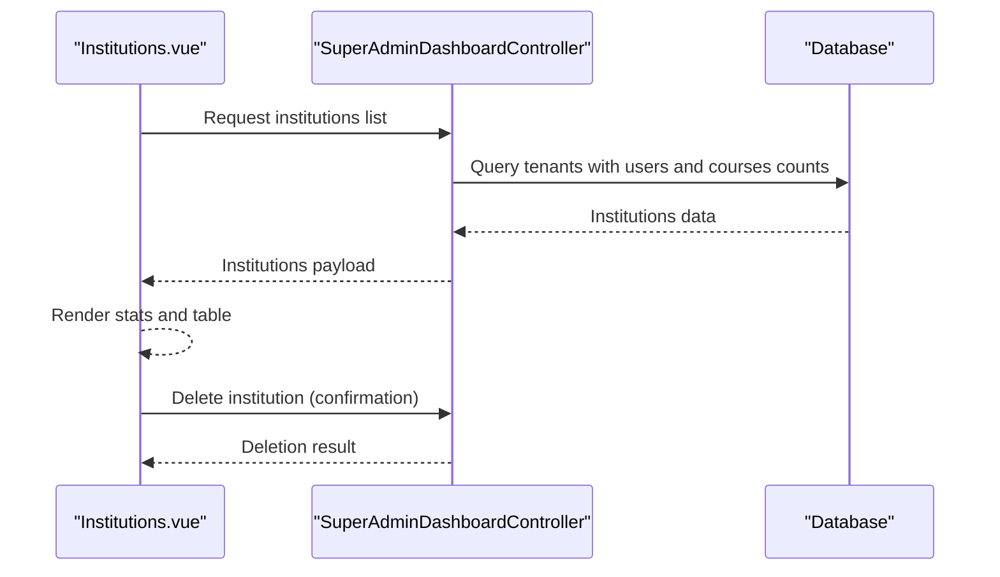

**Diagram sources**
- [Institutions.vue:1-249](file://resources/js/Pages/SuperAdmin/Institutions.vue#L1-L249)
- [SuperAdminDashboardController.php:84-105](file://app/Http/Controllers/SuperAdminDashboardController.php#L84-L105)
- [Tenant.php:1-86](file://app/Models/Tenant.php#L1-L86)

**Section sources**
- [Institutions.vue:1-249](file://resources/js/Pages/SuperAdmin/Institutions.vue#L1-L249)
- [SuperAdminDashboardController.php:84-105](file://app/Http/Controllers/SuperAdminDashboardController.php#L84-L105)
- [Tenant.php:1-86](file://app/Models/Tenant.php#L1-L86)

### Users Management
The users page provides:
- Search by name/email and filter by role
- Paginated user listings with roles, join date, and last login
- Actions to view, edit, and suspend users
- Suspend confirmation modal and bulk operations

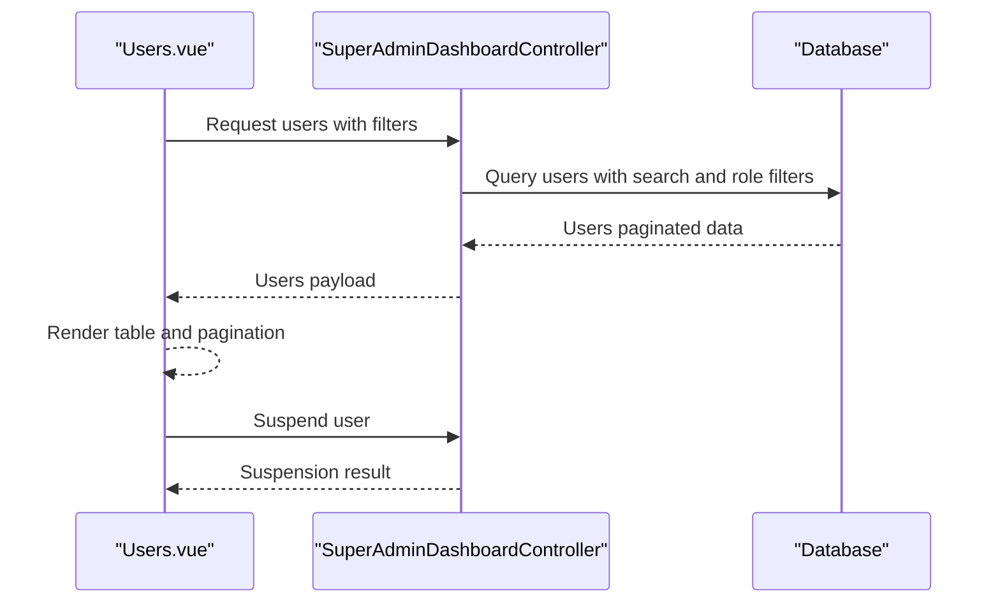

**Diagram sources**
- [Users.vue:1-289](file://resources/js/Pages/SuperAdmin/Users.vue#L1-L289)
- [SuperAdminDashboardController.php:107-126](file://app/Http/Controllers/SuperAdminDashboardController.php#L107-L126)
- [User.php:1-818](file://app/Models/User.php#L1-L818)

**Section sources**
- [Users.vue:1-289](file://resources/js/Pages/SuperAdmin/Users.vue#L1-L289)
- [SuperAdminDashboardController.php:107-126](file://app/Http/Controllers/SuperAdminDashboardController.php#L107-L126)
- [User.php:1-818](file://app/Models/User.php#L1-L818)

### System Health Monitoring
The system health page displays:
- Database, cache, queue, and storage status
- Performance metrics (response time, memory usage, CPU usage, uptime)
- Security status (SSL, firewall, alerts, last scan)
- Backup status (last backup, size, next schedule, retention)
- Active alerts with severity and timestamps

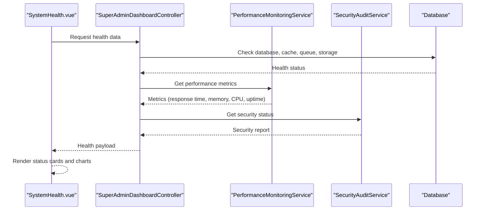

**Diagram sources**
- [SystemHealth.vue:1-407](file://resources/js/Pages/SuperAdmin/SystemHealth.vue#L1-L407)
- [SuperAdminDashboardController.php:168-183](file://app/Http/Controllers/SuperAdminDashboardController.php#L168-L183)
- [PerformanceMonitoringService.php:1-433](file://app/Services/PerformanceMonitoringService.php#L1-L433)
- [SecurityAuditService.php:1-347](file://app/Services/SecurityAuditService.php#L1-L347)

**Section sources**
- [SystemHealth.vue:1-407](file://resources/js/Pages/SuperAdmin/SystemHealth.vue#L1-L407)
- [SuperAdminDashboardController.php:168-183](file://app/Http/Controllers/SuperAdminDashboardController.php#L168-L183)
- [PerformanceMonitoringService.php:1-433](file://app/Services/PerformanceMonitoringService.php#L1-L433)
- [SecurityAuditService.php:1-347](file://app/Services/SecurityAuditService.php#L1-L347)

### Administrative Workflows
- Managing multiple tenants: Create, update, delete, and monitor institutions; view user and graduate counts; track course offerings.
- User permissions: Assign roles, manage suspensions, enforce access controls, and track user activities.
- System settings: Configure performance budgets, monitoring thresholds, and alerting policies.
- Performance optimization: Analyze performance metrics, generate recommendations, and tune component rendering.

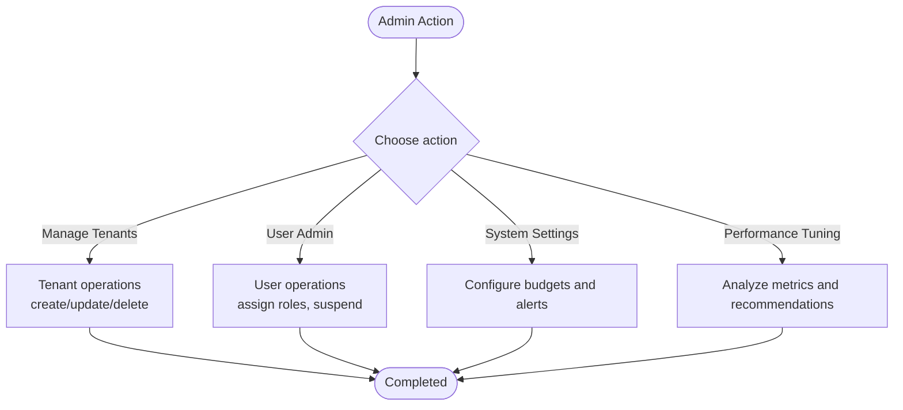

[No sources needed since this diagram shows conceptual workflow, not actual code structure]

**Section sources**
- [SuperAdminDashboardController.php:84-183](file://app/Http/Controllers/SuperAdminDashboardController.php#L84-L183)
- [AnalyticsService.php:1-800](file://app/Services/AnalyticsService.php#L1-L800)
- [PerformanceMonitoringService.php:1-433](file://app/Services/PerformanceMonitoringService.php#L1-L433)
- [SecurityAuditService.php:1-347](file://app/Services/SecurityAuditService.php#L1-L347)

### Practical Examples
- User onboarding: Use the users page to search, filter, and manage user accounts; apply role assignments and handle verification workflows.
- System maintenance: Review system health indicators, address performance warnings, and configure backups and monitoring.
- Performance tuning: Analyze component render times, memory usage, and CPU utilization; implement recommendations generated by the performance monitoring service.
- Troubleshooting: Investigate security alerts, database connectivity, cache hit rates, and queue backlog; take corrective actions based on health metrics.

**Section sources**
- [Users.vue:1-289](file://resources/js/Pages/SuperAdmin/Users.vue#L1-L289)
- [SystemHealth.vue:1-407](file://resources/js/Pages/SuperAdmin/SystemHealth.vue#L1-L407)
- [PerformanceMonitoringService.php:1-433](file://app/Services/PerformanceMonitoringService.php#L1-L433)
- [SecurityAuditService.php:1-347](file://app/Services/SecurityAuditService.php#L1-L347)

### Security Measures, Audit Trails, and Access Control
- Role-based access control: Users are scoped by institution; super admins can access all institutions and manage system-wide settings.
- Audit trails: Activity logs capture user actions, IP addresses, user agents, and tenant context for compliance and investigations.
- Security audits: Comprehensive security audit reports, privacy violation scans, and suspicious activity monitoring.
- Access control mechanisms: Tenant isolation, domain-based resolution, and policy enforcement ensure cross-tenant data protection.

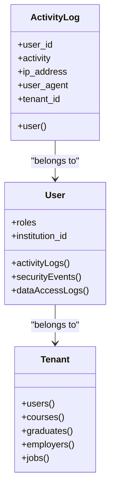

**Diagram sources**
- [User.php:1-818](file://app/Models/User.php#L1-L818)
- [Tenant.php:1-86](file://app/Models/Tenant.php#L1-L86)
- [ActivityLog.php:1-31](file://app/Models/ActivityLog.php#L1-L31)

**Section sources**
- [User.php:1-818](file://app/Models/User.php#L1-L818)
- [ActivityLog.php:1-31](file://app/Models/ActivityLog.php#L1-L31)
- [SecurityAuditService.php:1-347](file://app/Services/SecurityAuditService.php#L1-L347)
- [task-02-user-management-system-recap.md:219-291](file://docs/task-02-user-management-system-recap.md#L219-L291)

### System Monitoring, Alerting, and Proactive Maintenance
- Monitoring cycles: Automated production monitoring cycles collect performance, security, analytics, and system health data.
- Alerting: Performance violations trigger alerts with cooldowns to prevent spam; system-wide alerts are logged and displayed.
- Recommendations: Performance monitoring generates optimization recommendations based on component render times and system budgets.
- Maintenance: Regular cleanup of old performance data, backup scheduling, and compliance reporting support proactive maintenance.

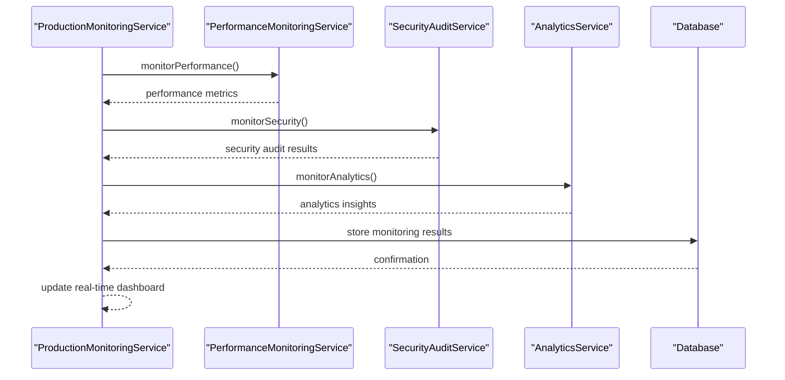

**Diagram sources**
- [ProductionMonitoringService.php:55-119](file://app/Services/ProductionMonitoringService.php#L55-L119)
- [PerformanceMonitoringService.php:1-433](file://app/Services/PerformanceMonitoringService.php#L1-L433)
- [SecurityAuditService.php:1-347](file://app/Services/SecurityAuditService.php#L1-L347)
- [AnalyticsService.php:1-800](file://app/Services/AnalyticsService.php#L1-L800)

**Section sources**
- [ProductionMonitoringService.php:55-119](file://app/Services/ProductionMonitoringService.php#L55-L119)
- [PerformanceMonitoringService.php:1-433](file://app/Services/PerformanceMonitoringService.php#L1-L433)
- [SecurityAuditService.php:1-347](file://app/Services/SecurityAuditService.php#L1-L347)
- [AnalyticsService.php:1-800](file://app/Services/AnalyticsService.php#L1-L800)

## Dependency Analysis
The Super Admin Dashboard relies on:
- Laravel controllers to orchestrate data retrieval and rendering
- Services to encapsulate analytics, performance, and security logic
- Models to represent tenants, users, and activity logs
- Configuration to enable multi-tenancy and tenant isolation

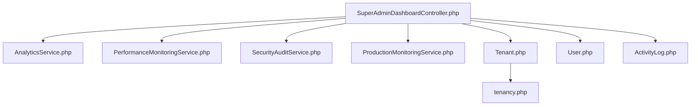

**Diagram sources**
- [SuperAdminDashboardController.php:1-800](file://app/Http/Controllers/SuperAdminDashboardController.php#L1-L800)
- [AnalyticsService.php:1-800](file://app/Services/AnalyticsService.php#L1-L800)
- [PerformanceMonitoringService.php:1-433](file://app/Services/PerformanceMonitoringService.php#L1-L433)
- [SecurityAuditService.php:1-347](file://app/Services/SecurityAuditService.php#L1-L347)
- [ProductionMonitoringService.php:40-758](file://app/Services/ProductionMonitoringService.php#L40-L758)
- [Tenant.php:1-86](file://app/Models/Tenant.php#L1-L86)
- [User.php:1-818](file://app/Models/User.php#L1-L818)
- [ActivityLog.php:1-31](file://app/Models/ActivityLog.php#L1-L31)
- [tenancy.php:1-82](file://config/tenancy.php#L1-L82)

**Section sources**
- [SuperAdminDashboardController.php:1-800](file://app/Http/Controllers/SuperAdminDashboardController.php#L1-L800)
- [AnalyticsService.php:1-800](file://app/Services/AnalyticsService.php#L1-L800)
- [PerformanceMonitoringService.php:1-433](file://app/Services/PerformanceMonitoringService.php#L1-L433)
- [SecurityAuditService.php:1-347](file://app/Services/SecurityAuditService.php#L1-L347)
- [ProductionMonitoringService.php:40-758](file://app/Services/ProductionMonitoringService.php#L40-L758)
- [Tenant.php:1-86](file://app/Models/Tenant.php#L1-L86)
- [User.php:1-818](file://app/Models/User.php#L1-L818)
- [ActivityLog.php:1-31](file://app/Models/ActivityLog.php#L1-L31)
- [tenancy.php:1-82](file://config/tenancy.php#L1-L82)

## Performance Considerations
- Caching: Analytics and health metrics are cached to reduce database load and improve response times.
- Tenant isolation: Queries are executed within tenant contexts to ensure accurate and isolated data retrieval.
- Monitoring budgets: Performance monitoring enforces budgets and triggers alerts to prevent performance degradation.
- Trend analysis: Historical metrics are stored for trend analysis and recommendation generation.

[No sources needed since this section provides general guidance]

## Troubleshooting Guide
- Database connectivity: Verify database connection status and response times; investigate critical or warning states.
- Cache health: Confirm cache availability and hit rates; address cache-related warnings or critical conditions.
- Queue backlog: Monitor pending and failed jobs; resolve failures and optimize queue processing.
- Storage usage: Track storage utilization and set alerts for approaching capacity limits.
- Security incidents: Review security alerts, compliance reports, and privacy violation scans; take corrective actions.
- Performance issues: Analyze component render times, memory usage, and CPU utilization; implement recommendations.

**Section sources**
- [SuperAdminDashboardController.php:639-774](file://app/Http/Controllers/SuperAdminDashboardController.php#L639-L774)
- [PerformanceMonitoringService.php:1-433](file://app/Services/PerformanceMonitoringService.php#L1-L433)
- [SecurityAuditService.php:1-347](file://app/Services/SecurityAuditService.php#L1-L347)
- [SystemHealth.vue:1-407](file://resources/js/Pages/SuperAdmin/SystemHealth.vue#L1-L407)

## Conclusion
The Super Admin Dashboard delivers comprehensive enterprise-level system administration through centralized tenant management, user administration, system-wide analytics, and performance monitoring. Its modular architecture, robust security measures, and proactive maintenance capabilities enable efficient oversight and optimization across multiple institutions.

[No sources needed since this section summarizes without analyzing specific files]

## Appendices
- Multi-tenant architecture: Supports unlimited tenants with domain-based resolution and tenant isolation.
- Monitoring and maintenance: Automated health checks, maintenance tools, and comprehensive analytics.
- Security and compliance: Role-based access control, audit trails, and security monitoring.

**Section sources**
- [task-03-multi-tenant-enhancement-recap.md:218-275](file://docs/task-03-multi-tenant-enhancement-recap.md#L218-L275)
- [README.md:49-183](file://README.md#L49-L183)
- [technical-specification.md:35-73](file://technical-specification.md#L35-L73)