# System Monitoring & Maintenance

<cite>
**Referenced Files in This Document**
- [MonitorSystemHealth.php](file://app/Console/Commands/MonitorSystemHealth.php)
- [HomepageUptimeCheck.php](file://app/Console/Commands/HomepageUptimeCheck.php)
- [CreateSystemBackup.php](file://app/Console/Commands/CreateSystemBackup.php)
- [PerformanceMonitoringService.php](file://app/Services/PerformanceMonitoringService.php)
- [ProductionMonitoringService.php](file://app/Services/ProductionMonitoringService.php)
- [OptimizePerformance.php](file://app/Console/Commands/OptimizePerformance.php)
- [RunPerformanceTests.php](file://app/Console/Commands/RunPerformanceTests.php)
- [CleanupNotificationsCommand.php](file://app/Console/Commands/CleanupNotificationsCommand.php)
- [SecurityAuditService.php](file://app/Services/SecurityAuditService.php)
- [AnalyticsService.php](file://app/Services/AnalyticsService.php)
- [MonitoringCycleCommand.php](file://app/Console/Commands/MonitoringCycleCommand.php)
- [GenerateAnalyticsSnapshots.php](file://app/Console/Commands/GenerateAnalyticsSnapshots.php)
- [DatabaseOptimizationService.php](file://app/Services/DatabaseOptimizationService.php)
- [logging.php](file://config/logging.php)
</cite>

## Table of Contents
1. [Introduction](#introduction)
2. [Project Structure](#project-structure)
3. [Core Components](#core-components)
4. [Architecture Overview](#architecture-overview)
5. [Detailed Component Analysis](#detailed-component-analysis)
6. [Dependency Analysis](#dependency-analysis)
7. [Performance Considerations](#performance-considerations)
8. [Troubleshooting Guide](#troubleshooting-guide)
9. [Conclusion](#conclusion)
10. [Appendices](#appendices)

## Introduction
This document provides comprehensive guidance for system monitoring and maintenance within the platform. It covers operational oversight, system health management, performance monitoring, security auditing, maintenance procedures, backup and recovery, diagnostics, and troubleshooting. It also outlines practical workflows for monitoring dashboards, alert management, and incident response, along with capacity planning and reliability practices.

## Project Structure
The monitoring and maintenance capabilities are implemented primarily through:
- Console commands for health checks, uptime monitoring, performance optimization, testing, and analytics snapshot generation
- Services for production monitoring, performance monitoring/alerting, security audits, analytics, and database optimization
- Logging configuration supporting dedicated channels for performance, security, and component-specific insights

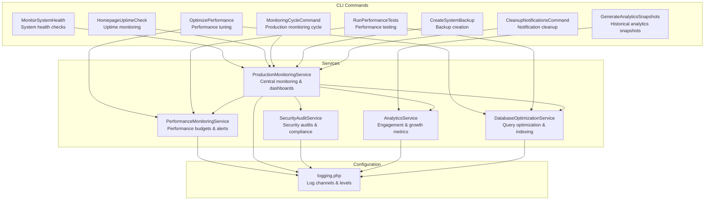

**Diagram sources**
- [MonitorSystemHealth.php:15-92](file://app/Console/Commands/MonitorSystemHealth.php#L15-L92)
- [HomepageUptimeCheck.php:8-73](file://app/Console/Commands/HomepageUptimeCheck.php#L8-L73)
- [OptimizePerformance.php:9-98](file://app/Console/Commands/OptimizePerformance.php#L9-L98)
- [RunPerformanceTests.php:13-102](file://app/Console/Commands/RunPerformanceTests.php#L13-L102)
- [MonitoringCycleCommand.php:12-84](file://app/Console/Commands/MonitoringCycleCommand.php#L12-L84)
- [GenerateAnalyticsSnapshots.php:9-80](file://app/Console/Commands/GenerateAnalyticsSnapshots.php#L9-L80)
- [CreateSystemBackup.php:12-68](file://app/Console/Commands/CreateSystemBackup.php#L12-L68)
- [CleanupNotificationsCommand.php:8-47](file://app/Console/Commands/CleanupNotificationsCommand.php#L8-L47)
- [PerformanceMonitoringService.php:18-82](file://app/Services/PerformanceMonitoringService.php#L18-L82)
- [ProductionMonitoringService.php:23-97](file://app/Services/ProductionMonitoringService.php#L23-L97)
- [SecurityAuditService.php:7-25](file://app/Services/SecurityAuditService.php#L7-L25)
- [AnalyticsService.php:22-44](file://app/Services/AnalyticsService.php#L22-L44)
- [DatabaseOptimizationService.php:9-52](file://app/Services/DatabaseOptimizationService.php#L9-L52)
- [logging.php:54-203](file://config/logging.php#L54-L203)

**Section sources**
- [MonitorSystemHealth.php:15-92](file://app/Console/Commands/MonitorSystemHealth.php#L15-L92)
- [ProductionMonitoringService.php:23-97](file://app/Services/ProductionMonitoringService.php#L23-L97)
- [logging.php:54-203](file://config/logging.php#L54-L203)

## Core Components
- System health monitoring: periodic checks of database, cache, storage, queue, memory, and disk usage with alerting for critical conditions
- Uptime monitoring: endpoint availability and response-time checks for homepage services
- Performance monitoring and alerting: budgets, thresholds, trend analysis, and recommendations
- Security auditing: compliance, vulnerability scanning, privacy controls, and suspicious activity detection
- Analytics and reporting: engagement metrics, growth, benchmarks, and snapshot generation
- Performance optimization and testing: caching strategies, database indexing, query analysis, and performance test suites
- Backup and recovery: database and file backups with compression, retention, and cleanup
- Logging and alert channels: structured channels for performance, security, and component-specific insights

**Section sources**
- [MonitorSystemHealth.php:29-92](file://app/Console/Commands/MonitorSystemHealth.php#L29-L92)
- [HomepageUptimeCheck.php:25-72](file://app/Console/Commands/HomepageUptimeCheck.php#L25-L72)
- [PerformanceMonitoringService.php:18-82](file://app/Services/PerformanceMonitoringService.php#L18-L82)
- [SecurityAuditService.php:12-86](file://app/Services/SecurityAuditService.php#L12-L86)
- [AnalyticsService.php:27-96](file://app/Services/AnalyticsService.php#L27-L96)
- [RunPerformanceTests.php:43-102](file://app/Console/Commands/RunPerformanceTests.php#L43-L102)
- [CreateSystemBackup.php:18-68](file://app/Console/Commands/CreateSystemBackup.php#L18-L68)
- [logging.php:130-203](file://config/logging.php#L130-L203)

## Architecture Overview
The monitoring architecture centers on a production monitoring service orchestrating multiple subsystems. It executes cycles that collect performance metrics, security posture, analytics, and system health, then stores results in cache for real-time dashboards and generates alerts based on thresholds.

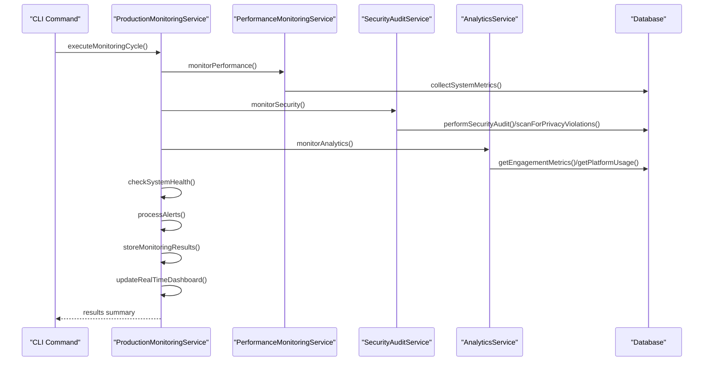

**Diagram sources**
- [ProductionMonitoringService.php:55-97](file://app/Services/ProductionMonitoringService.php#L55-L97)
- [PerformanceMonitoringService.php:62-82](file://app/Services/PerformanceMonitoringService.php#L62-L82)
- [SecurityAuditService.php:12-25](file://app/Services/SecurityAuditService.php#L12-L25)
- [AnalyticsService.php:27-44](file://app/Services/AnalyticsService.php#L27-L44)

**Section sources**
- [ProductionMonitoringService.php:52-97](file://app/Services/ProductionMonitoringService.php#L52-L97)

## Detailed Component Analysis

### System Health Monitoring
- Checks database connectivity and query latency, cache read/write/delete, storage read/write/delete, queue size and failed jobs, memory usage percent, and disk usage percent
- Logs results to system health logs and optionally triggers critical alerts with security event logging and critical log entries
- Provides per-component metrics and status for health dashboards

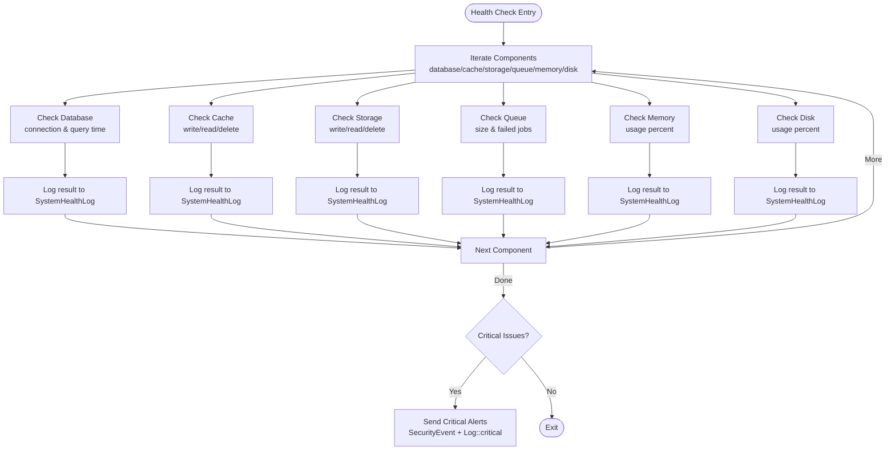

**Diagram sources**
- [MonitorSystemHealth.php:29-92](file://app/Console/Commands/MonitorSystemHealth.php#L29-L92)
- [MonitorSystemHealth.php:94-336](file://app/Console/Commands/MonitorSystemHealth.php#L94-L336)

**Section sources**
- [MonitorSystemHealth.php:29-92](file://app/Console/Commands/MonitorSystemHealth.php#L29-L92)
- [MonitorSystemHealth.php:94-336](file://app/Console/Commands/MonitorSystemHealth.php#L94-L336)

### Uptime Monitoring
- Validates homepage endpoints for availability and response time
- Reports per-endpoint status and optional verbose details
- Supports notifications for issues and exit codes for CI/CD integration

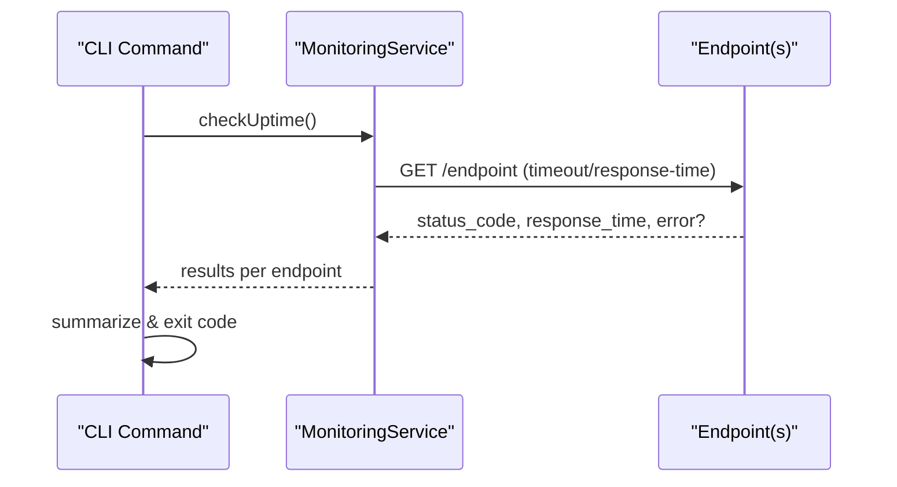

**Diagram sources**
- [HomepageUptimeCheck.php:25-72](file://app/Console/Commands/HomepageUptimeCheck.php#L25-L72)

**Section sources**
- [HomepageUptimeCheck.php:25-72](file://app/Console/Commands/HomepageUptimeCheck.php#L25-L72)

### Performance Monitoring and Alerting
- Enforces budgets for response time, memory usage, component render time, and database query time
- Stores metrics and alerts in cache for dashboard retrieval
- Generates recommendations and performs cleanup of old performance data
- Provides system-wide performance metrics collection

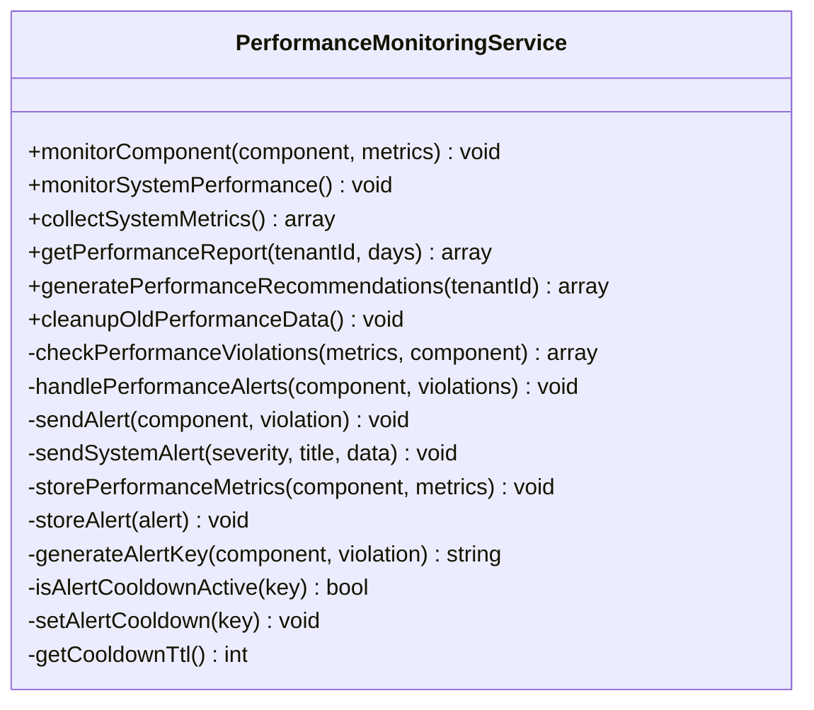

**Diagram sources**
- [PerformanceMonitoringService.php:18-433](file://app/Services/PerformanceMonitoringService.php#L18-L433)

**Section sources**
- [PerformanceMonitoringService.php:18-433](file://app/Services/PerformanceMonitoringService.php#L18-L433)

### Production Monitoring and Dashboards
- Executes a full monitoring cycle including performance, security, analytics, system health, and alert processing
- Updates real-time dashboard cache and logs cycle summaries
- Determines alert priorities and escalations, and supports dry-run modes

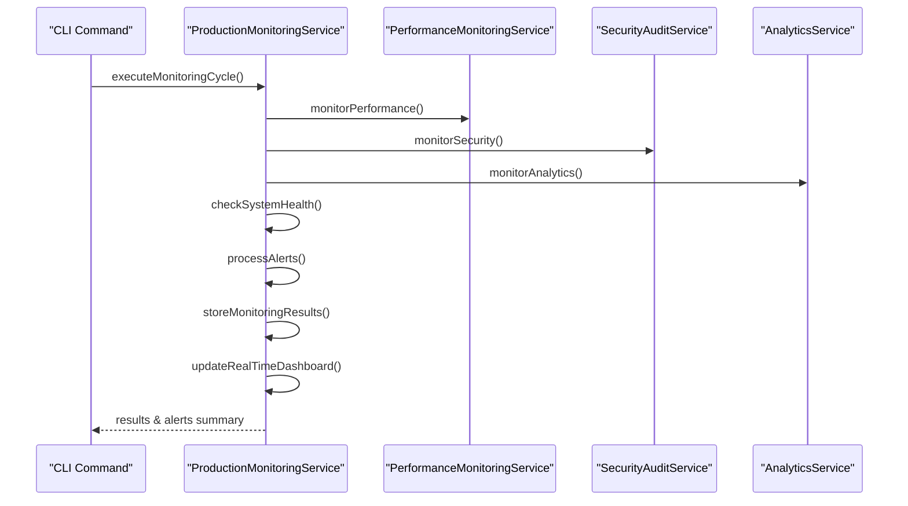

**Diagram sources**
- [ProductionMonitoringService.php:55-97](file://app/Services/ProductionMonitoringService.php#L55-L97)
- [MonitoringCycleCommand.php:38-84](file://app/Console/Commands/MonitoringCycleCommand.php#L38-L84)

**Section sources**
- [ProductionMonitoringService.php:52-97](file://app/Services/ProductionMonitoringService.php#L52-L97)
- [MonitoringCycleCommand.php:38-84](file://app/Console/Commands/MonitoringCycleCommand.php#L38-L84)

### Security Monitoring and Auditing
- Performs comprehensive security audits covering authentication, authorization, data privacy, API security, infrastructure, and compliance
- Scans for privacy violations and monitors suspicious activity
- Calculates data integrity checksums and validates transfers

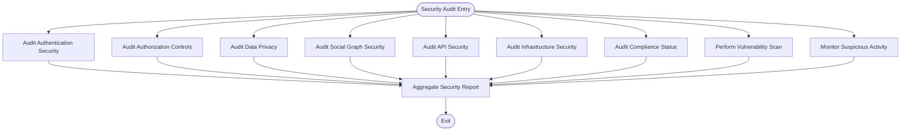

**Diagram sources**
- [SecurityAuditService.php:12-86](file://app/Services/SecurityAuditService.php#L12-L86)

**Section sources**
- [SecurityAuditService.php:12-86](file://app/Services/SecurityAuditService.php#L12-L86)

### Analytics and Reporting
- Provides engagement metrics, platform usage, community health, and graduate outcomes
- Generates custom reports and exports data in multiple formats
- Creates historical snapshots for daily, weekly, monthly, and specialized metrics

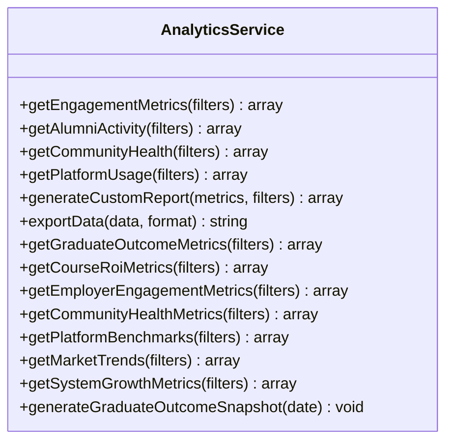

**Diagram sources**
- [AnalyticsService.php:22-800](file://app/Services/AnalyticsService.php#L22-L800)

**Section sources**
- [AnalyticsService.php:27-96](file://app/Services/AnalyticsService.php#L27-L96)
- [GenerateAnalyticsSnapshots.php:26-80](file://app/Console/Commands/GenerateAnalyticsSnapshots.php#L26-L80)

### Performance Optimization and Testing
- Optimizes caching strategies, database queries, and CDN integration
- Runs comprehensive performance test suites including load, database, cache, accessibility, and JavaScript performance
- Generates detailed performance reports and HTML summaries

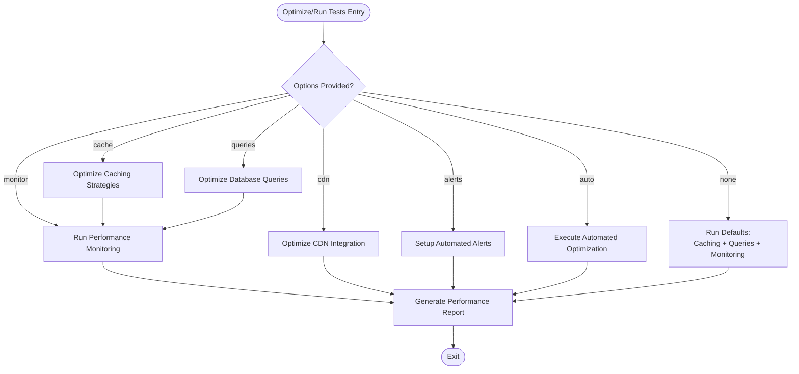

**Diagram sources**
- [OptimizePerformance.php:42-98](file://app/Console/Commands/OptimizePerformance.php#L42-L98)
- [RunPerformanceTests.php:43-102](file://app/Console/Commands/RunPerformanceTests.php#L43-L102)

**Section sources**
- [OptimizePerformance.php:42-98](file://app/Console/Commands/OptimizePerformance.php#L42-L98)
- [RunPerformanceTests.php:43-102](file://app/Console/Commands/RunPerformanceTests.php#L43-L102)

### Backup and Recovery
- Creates database and file backups with support for compression and manifests
- Manages retention and cleanup of old backups
- Records backup metadata and file sizes for audit and recovery planning

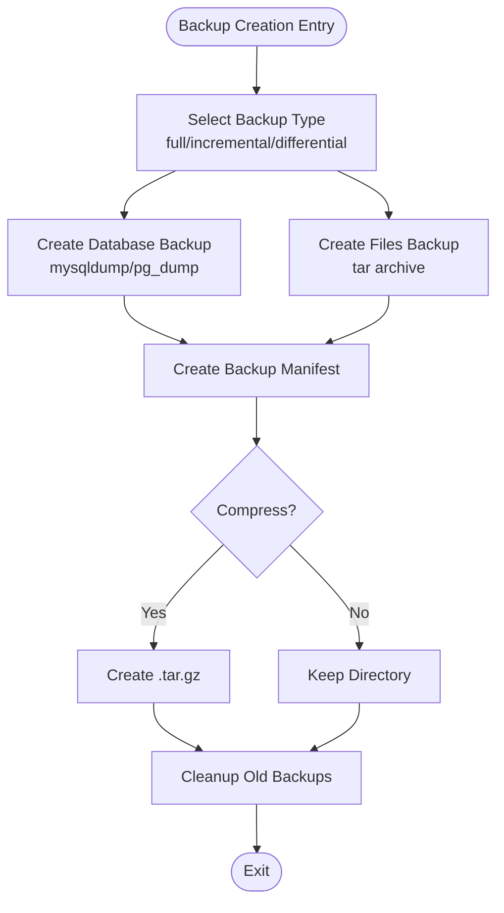

**Diagram sources**
- [CreateSystemBackup.php:18-68](file://app/Console/Commands/CreateSystemBackup.php#L18-L68)
- [CreateSystemBackup.php:70-218](file://app/Console/Commands/CreateSystemBackup.php#L70-L218)

**Section sources**
- [CreateSystemBackup.php:18-68](file://app/Console/Commands/CreateSystemBackup.php#L18-L68)
- [CreateSystemBackup.php:202-218](file://app/Console/Commands/CreateSystemBackup.php#L202-L218)

### Logging and Alert Channels
- Dedicated logging channels for homepage and template components
- Structured channels for errors, alerts, warnings, info, and performance logs
- Configurable retention and levels for operational insights

**Section sources**
- [logging.php:130-203](file://config/logging.php#L130-L203)

## Dependency Analysis
- ProductionMonitoringService depends on PerformanceMonitoringService, SecurityAuditService, and AnalyticsService
- PerformanceMonitoringService uses cache for metrics and alerts and logs to performance_alerts channel
- DatabaseOptimizationService integrates with DB query listener and applies index optimizations
- Console commands orchestrate services and expose CLI interfaces for maintenance tasks

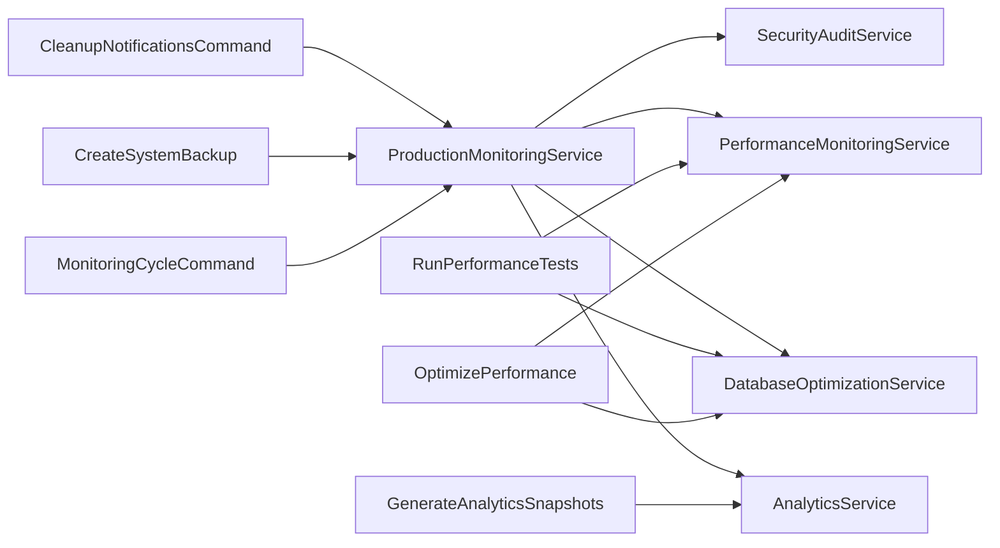

**Diagram sources**
- [MonitoringCycleCommand.php:27-33](file://app/Console/Commands/MonitoringCycleCommand.php#L27-L33)
- [OptimizePerformance.php:33-37](file://app/Console/Commands/OptimizePerformance.php#L33-L37)
- [RunPerformanceTests.php:24-41](file://app/Console/Commands/RunPerformanceTests.php#L24-L41)
- [GenerateAnalyticsSnapshots.php:20-24](file://app/Console/Commands/GenerateAnalyticsSnapshots.php#L20-L24)
- [CreateSystemBackup.php:12-16](file://app/Console/Commands/CreateSystemBackup.php#L12-L16)
- [ProductionMonitoringService.php:40-50](file://app/Services/ProductionMonitoringService.php#L40-L50)

**Section sources**
- [ProductionMonitoringService.php:40-50](file://app/Services/ProductionMonitoringService.php#L40-L50)
- [OptimizePerformance.php:33-37](file://app/Console/Commands/OptimizePerformance.php#L33-L37)
- [RunPerformanceTests.php:24-41](file://app/Console/Commands/RunPerformanceTests.php#L24-L41)
- [GenerateAnalyticsSnapshots.php:20-24](file://app/Console/Commands/GenerateAnalyticsSnapshots.php#L20-L24)
- [CreateSystemBackup.php:12-16](file://app/Console/Commands/CreateSystemBackup.php#L12-L16)

## Performance Considerations
- Use caching strategies to reduce database load and improve response times
- Apply database indexes and optimize queries to minimize slow query counts
- Monitor memory usage and disk space to prevent critical thresholds
- Leverage performance budgets and recommendations to maintain SLAs
- Regularly generate performance reports and analyze trends for proactive tuning

[No sources needed since this section provides general guidance]

## Troubleshooting Guide
- Health checks: Review component statuses and metrics logged during system health checks; address critical issues immediately
- Uptime monitoring: Investigate endpoint failures and response-time spikes; correlate with logs and alerts
- Performance monitoring: Inspect performance alerts and recommendations; adjust budgets and implement optimizations
- Security auditing: Review compliance reports and privacy violation scans; remediate flagged areas
- Analytics: Validate snapshot generation and export formats; confirm data freshness and accuracy
- Backups: Confirm backup completion, file sizes, and retention policies; test restore procedures regularly
- Logging: Use dedicated channels for diagnostics; adjust levels and retention for operational visibility

**Section sources**
- [MonitorSystemHealth.php:29-92](file://app/Console/Commands/MonitorSystemHealth.php#L29-L92)
- [HomepageUptimeCheck.php:25-72](file://app/Console/Commands/HomepageUptimeCheck.php#L25-L72)
- [PerformanceMonitoringService.php:118-166](file://app/Services/PerformanceMonitoringService.php#L118-L166)
- [SecurityAuditService.php:62-86](file://app/Services/SecurityAuditService.php#L62-L86)
- [GenerateAnalyticsSnapshots.php:26-80](file://app/Console/Commands/GenerateAnalyticsSnapshots.php#L26-L80)
- [CreateSystemBackup.php:18-68](file://app/Console/Commands/CreateSystemBackup.php#L18-L68)
- [logging.php:130-203](file://config/logging.php#L130-L203)

## Conclusion
The platform provides a robust, modular monitoring and maintenance framework. By leveraging health checks, uptime monitoring, performance alerting, security audits, analytics, and backup/recovery procedures, operators can maintain system reliability, performance, and security. Integrating these capabilities into scheduled workflows and incident response processes ensures continuous operational oversight and rapid issue resolution.

[No sources needed since this section summarizes without analyzing specific files]

## Appendices

### Practical Monitoring Workflows
- Daily monitoring cycle: Execute the production monitoring cycle with default thresholds and review dashboard summaries
- Performance optimization: Run performance optimization with caching and query optimizations; generate reports and recommendations
- Uptime checks: Schedule homepage uptime checks with verbose output for CI/CD pipelines
- Analytics snapshots: Generate daily, weekly, and monthly snapshots for historical tracking and benchmarking
- Backups: Schedule regular backups with compression and retention policies; verify restoration procedures

**Section sources**
- [MonitoringCycleCommand.php:38-84](file://app/Console/Commands/MonitoringCycleCommand.php#L38-L84)
- [OptimizePerformance.php:42-98](file://app/Console/Commands/OptimizePerformance.php#L42-L98)
- [HomepageUptimeCheck.php:25-72](file://app/Console/Commands/HomepageUptimeCheck.php#L25-L72)
- [GenerateAnalyticsSnapshots.php:26-80](file://app/Console/Commands/GenerateAnalyticsSnapshots.php#L26-L80)
- [CreateSystemBackup.php:18-68](file://app/Console/Commands/CreateSystemBackup.php#L18-L68)

### Alert Management and Incident Response
- Define alert thresholds and escalation levels; use dry-run modes for testing
- Route alerts to appropriate channels (email, Slack, SMS, calls) based on priority
- Maintain alert cooldowns to prevent alert storms; track resolved alerts
- Document incident response procedures and post-mortems for continuous improvement

**Section sources**
- [ProductionMonitoringService.php:470-495](file://app/Services/ProductionMonitoringService.php#L470-L495)
- [ProductionMonitoringService.php:497-525](file://app/Services/ProductionMonitoringService.php#L497-L525)
- [PerformanceMonitoringService.php:223-243](file://app/Services/PerformanceMonitoringService.php#L223-L243)

### Capacity Planning and Reliability Management
- Monitor system performance trends and budget compliance to anticipate scaling needs
- Use analytics to understand user behavior and growth patterns
- Implement database optimization and caching strategies to support increased loads
- Establish backup and recovery procedures with regular testing and rotation policies

**Section sources**
- [PerformanceMonitoringService.php:289-328](file://app/Services/PerformanceMonitoringService.php#L289-L328)
- [AnalyticsService.php:511-525](file://app/Services/AnalyticsService.php#L511-L525)
- [DatabaseOptimizationService.php:200-249](file://app/Services/DatabaseOptimizationService.php#L200-L249)
- [CreateSystemBackup.php:202-218](file://app/Console/Commands/CreateSystemBackup.php#L202-L218)