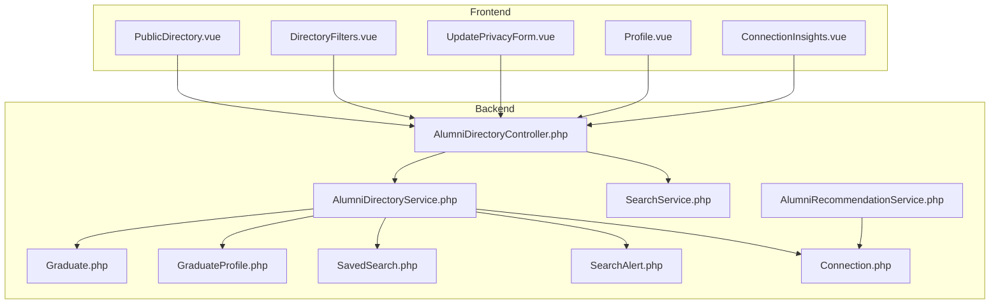
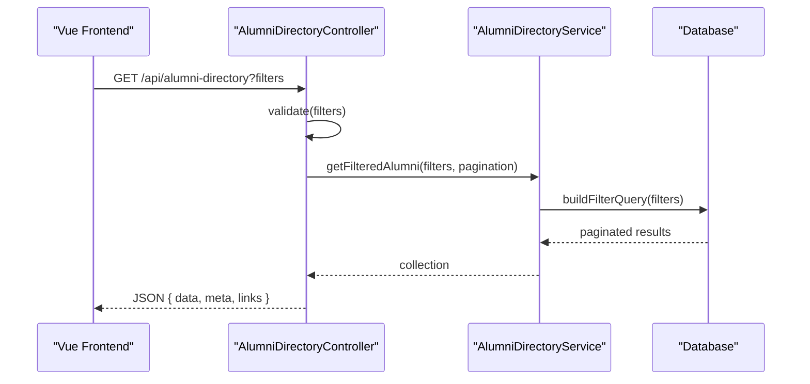
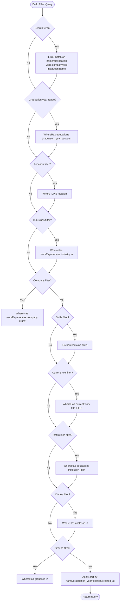
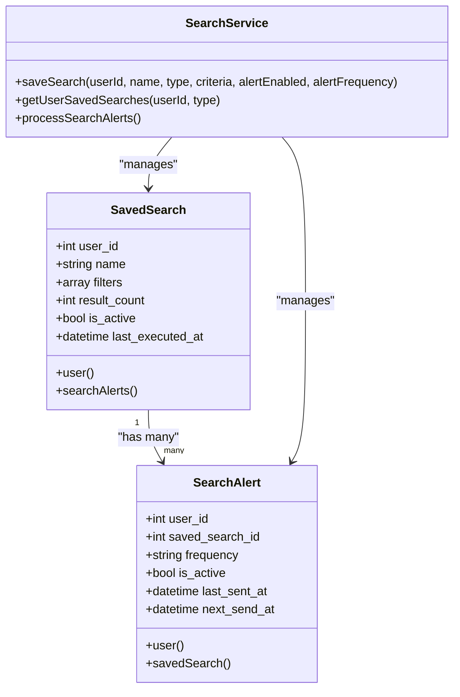
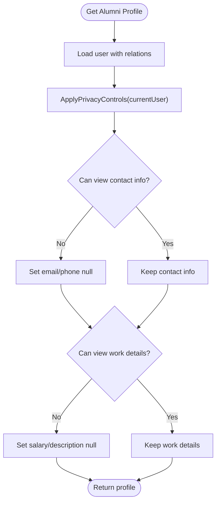
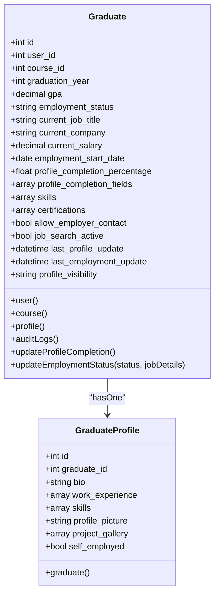
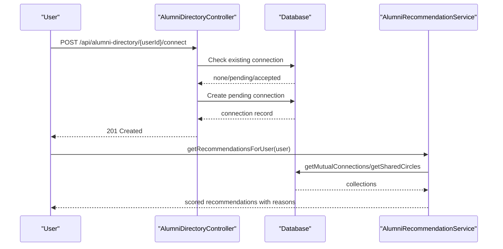
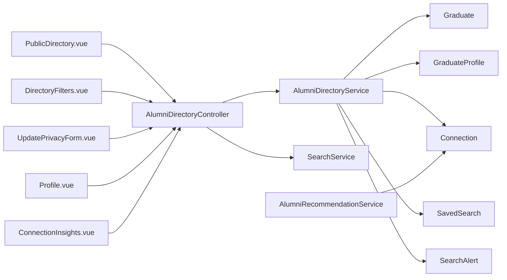

# Alumni Directory System

<cite>
**Referenced Files in This Document**
- [AlumniDirectoryService.php](file://app/Services/AlumniDirectoryService.php)
- [AlumniDirectoryController.php](file://app/Http/Controllers/Api/AlumniDirectoryController.php)
- [SearchService.php](file://app/Services/SearchService.php)
- [Graduate.php](file://app/Models/Graduate.php)
- [GraduateProfile.php](file://app/Models/GraduateProfile.php)
- [SavedSearch.php](file://app/Models/SavedSearch.php)
- [SearchAlert.php](file://app/Models/SearchAlert.php)
- [Connection.php](file://app/Models/Connection.php)
- [AlumniRecommendationService.php](file://app/Services/AlumniRecommendationService.php)
- [PublicDirectory.vue](file://resources/js/Pages/Alumni/PublicDirectory.vue)
- [DirectoryFilters.vue](file://resources/js/components/DirectoryFilters.vue)
- [UpdatePrivacyForm.vue](file://resources/js/Pages/Graduates/Partials/UpdatePrivacyForm.vue)
- [Profile.vue](file://resources/js/Pages/Graduate/Profile.vue)
- [ConnectionInsights.vue](file://resources/js/components/ConnectionInsights.vue)
- [task-11-search-matching-system-recap.md](file://docs/task-11-search-matching-system-recap.md)
</cite>

## Table of Contents
1. [Introduction](#introduction)
2. [Project Structure](#project-structure)
3. [Core Components](#core-components)
4. [Architecture Overview](#architecture-overview)
5. [Detailed Component Analysis](#detailed-component-analysis)
6. [Dependency Analysis](#dependency-analysis)
7. [Performance Considerations](#performance-considerations)
8. [Troubleshooting Guide](#troubleshooting-guide)
9. [Conclusion](#conclusion)
10. [Appendices](#appendices)

## Introduction
This document describes the alumni directory system with emphasis on advanced search, filtering, privacy controls, and graduate profile management. It explains multi-criteria filtering, saved searches, advanced query capabilities, granular privacy settings, connection management, networking insights, and practical usage scenarios.

## Project Structure
The alumni directory spans backend services and controllers, Eloquent models, Vue-based frontend pages and components, and supporting documentation. Key areas:
- Backend API: controllers and services handle search, filtering, privacy enforcement, and recommendations
- Models: represent graduates, profiles, connections, saved searches, and search alerts
- Frontend: Vue pages and components implement search UI, filters, and privacy forms
- Documentation: outlines search algorithms, ranking, and performance characteristics

**Diagram sources**
- [AlumniDirectoryController.php:1-292](file://app/Http/Controllers/Api/AlumniDirectoryController.php#L1-L292)
- [AlumniDirectoryService.php:1-464](file://app/Services/AlumniDirectoryService.php#L1-L464)
- [SearchService.php:1-531](file://app/Services/SearchService.php#L1-L531)
- [Graduate.php:1-243](file://app/Models/Graduate.php#L1-L243)
- [GraduateProfile.php:1-27](file://app/Models/GraduateProfile.php#L1-L27)
- [SavedSearch.php:1-46](file://app/Models/SavedSearch.php#L1-L46)
- [SearchAlert.php:1-44](file://app/Models/SearchAlert.php#L1-L44)
- [Connection.php:1-58](file://app/Models/Connection.php#L1-L58)
- [AlumniRecommendationService.php:1-433](file://app/Services/AlumniRecommendationService.php#L1-L433)
- [PublicDirectory.vue:1-29](file://resources/js/Pages/Alumni/PublicDirectory.vue#L1-L29)
- [DirectoryFilters.vue:204-228](file://resources/js/components/DirectoryFilters.vue#L204-L228)
- [UpdatePrivacyForm.vue:32-86](file://resources/js/Pages/Graduates/Partials/UpdatePrivacyForm.vue#L32-L86)
- [Profile.vue:262-282](file://resources/js/Pages/Graduate/Profile.vue#L262-L282)
- [ConnectionInsights.vue:1-373](file://resources/js/components/ConnectionInsights.vue#L1-L373)

**Section sources**
- [AlumniDirectoryController.php:1-292](file://app/Http/Controllers/Api/AlumniDirectoryController.php#L1-L292)
- [AlumniDirectoryService.php:1-464](file://app/Services/AlumniDirectoryService.php#L1-L464)
- [AlumniRecommendationService.php:1-433](file://app/Services/AlumniRecommendationService.php#L1-L433)
- [PublicDirectory.vue:1-29](file://resources/js/Pages/Alumni/PublicDirectory.vue#L1-L29)
- [DirectoryFilters.vue:204-228](file://resources/js/components/DirectoryFilters.vue#L204-L228)
- [UpdatePrivacyForm.vue:32-86](file://resources/js/Pages/Graduates/Partials/UpdatePrivacyForm.vue#L32-L86)
- [Profile.vue:262-282](file://resources/js/Pages/Graduate/Profile.vue#L262-L282)
- [ConnectionInsights.vue:1-373](file://resources/js/components/ConnectionInsights.vue#L1-L373)

## Core Components
- AlumniDirectoryController: validates and routes directory queries, exposes filters, search suggestions, and connection requests
- AlumniDirectoryService: builds complex Eloquent queries with multi-criteria filters, sorts, and privacy-aware profile retrieval
- SearchService: supports graduate and job search with scoring/ranking and saved searches/alerts
- Models: Graduate, GraduateProfile, Connection, SavedSearch, SearchAlert
- Frontend: PublicDirectory page, DirectoryFilters component, UpdatePrivacyForm, Profile page, ConnectionInsights component

**Section sources**
- [AlumniDirectoryController.php:25-105](file://app/Http/Controllers/Api/AlumniDirectoryController.php#L25-L105)
- [AlumniDirectoryService.php:17-155](file://app/Services/AlumniDirectoryService.php#L17-L155)
- [SearchService.php:44-73](file://app/Services/SearchService.php#L44-L73)
- [Graduate.php:15-58](file://app/Models/Graduate.php#L15-L58)
- [GraduateProfile.php:12-25](file://app/Models/GraduateProfile.php#L12-L25)
- [Connection.php:14-24](file://app/Models/Connection.php#L14-L24)
- [SavedSearch.php:14-28](file://app/Models/SavedSearch.php#L14-L28)
- [SearchAlert.php:13-26](file://app/Models/SearchAlert.php#L13-L26)

## Architecture Overview
The system follows a layered architecture:
- Presentation: Vue pages/components render UI and capture user intent
- API: controllers accept validated requests and delegate to services
- Services: encapsulate business logic for search, filtering, privacy, and recommendations
- Persistence: Eloquent models map to database tables for users, graduates, connections, and metadata

**Diagram sources**
- [AlumniDirectoryController.php:25-74](file://app/Http/Controllers/Api/AlumniDirectoryController.php#L25-L74)
- [AlumniDirectoryService.php:17-25](file://app/Services/AlumniDirectoryService.php#L17-L25)

**Section sources**
- [AlumniDirectoryController.php:25-74](file://app/Http/Controllers/Api/AlumniDirectoryController.php#L25-L74)
- [AlumniDirectoryService.php:30-155](file://app/Services/AlumniDirectoryService.php#L30-L155)

## Detailed Component Analysis

### Advanced Search and Multi-Criteria Filtering
The backend constructs a flexible Eloquent query supporting:
- Text search across name, bio, location, work company/title, and institution name
- Graduation year range via education records
- Location, industry, company, skills (JSON contains), current role, institutions, circles, and groups
- Sorting by name, graduation year, location, or creation date

**Diagram sources**
- [AlumniDirectoryService.php:30-155](file://app/Services/AlumniDirectoryService.php#L30-L155)

**Section sources**
- [AlumniDirectoryService.php:46-154](file://app/Services/AlumniDirectoryService.php#L46-L154)
- [AlumniDirectoryController.php:27-48](file://app/Http/Controllers/Api/AlumniDirectoryController.php#L27-L48)

### Saved Searches and Search Alerts
Saved searches persist user-defined criteria and optionally trigger alerts:
- SavedSearch stores user ID, name, serialized filters, result count, activation, and timestamps
- SearchAlert associates a saved search with user preferences for frequency and scheduling
- SearchService provides saving and retrieving saved searches and processing alerts

**Diagram sources**
- [SavedSearch.php:14-44](file://app/Models/SavedSearch.php#L14-L44)
- [SearchAlert.php:13-42](file://app/Models/SearchAlert.php#L13-L42)
- [SearchService.php:493-529](file://app/Services/SearchService.php#L493-L529)

**Section sources**
- [SavedSearch.php:14-44](file://app/Models/SavedSearch.php#L14-L44)
- [SearchAlert.php:13-42](file://app/Models/SearchAlert.php#L13-L42)
- [SearchService.php:493-529](file://app/Services/SearchService.php#L493-L529)

### Privacy Controls and Granular Visibility
Privacy enforcement occurs when retrieving profiles:
- Contact info visibility controlled per setting (public/connections/private)
- Work details visibility controlled per setting (public/connections/private)
- Connection status determines whether a user can view restricted details
- Additional graduate-level privacy toggles exist in forms and profile pages

**Diagram sources**
- [AlumniDirectoryService.php:177-205](file://app/Services/AlumniDirectoryService.php#L177-L205)
- [AlumniDirectoryService.php:275-333](file://app/Services/AlumniDirectoryService.php#L275-L333)

**Section sources**
- [AlumniDirectoryService.php:275-333](file://app/Services/AlumniDirectoryService.php#L275-L333)
- [UpdatePrivacyForm.vue:32-86](file://resources/js/Pages/Graduates/Partials/UpdatePrivacyForm.vue#L32-L86)
- [Profile.vue:262-282](file://resources/js/Pages/Graduate/Profile.vue#L262-L282)

### Graduate Profile Management
Graduate model manages academic records, employment history, skills, certifications, and profile completion:
- Academic records: graduation year, course, GPA, academic standing
- Employment: current job title, company, salary, start date, status
- Skills and certifications stored as arrays
- Profile completion percentage calculated from required fields
- Profile relationship to GraduateProfile for extended biographical data

**Diagram sources**
- [Graduate.php:15-58](file://app/Models/Graduate.php#L15-L58)
- [Graduate.php:138-218](file://app/Models/Graduate.php#L138-L218)
- [GraduateProfile.php:12-25](file://app/Models/GraduateProfile.php#L12-L25)

**Section sources**
- [Graduate.php:15-58](file://app/Models/Graduate.php#L15-L58)
- [Graduate.php:138-218](file://app/Models/Graduate.php#L138-L218)
- [GraduateProfile.php:12-25](file://app/Models/GraduateProfile.php#L12-L25)

### Connection Management and Networking Insights
- Connection requests are validated and created with status tracking
- Mutual connections and shared circles/groups are computed for contextual insights
- Recommendations leverage shared circles, mutual connections, interest similarity, and geographic proximity
- ConnectionInsights component surfaces actionable connections for introductions

**Diagram sources**
- [AlumniDirectoryController.php:132-184](file://app/Http/Controllers/Api/AlumniDirectoryController.php#L132-L184)
- [AlumniRecommendationService.php:29-57](file://app/Services/AlumniRecommendationService.php#L29-L57)
- [Connection.php:14-24](file://app/Models/Connection.php#L14-L24)

**Section sources**
- [AlumniDirectoryController.php:132-184](file://app/Http/Controllers/Api/AlumniDirectoryController.php#L132-L184)
- [AlumniRecommendationService.php:29-155](file://app/Services/AlumniRecommendationService.php#L29-L155)
- [Connection.php:14-56](file://app/Models/Connection.php#L14-L56)
- [ConnectionInsights.vue:1-373](file://resources/js/components/ConnectionInsights.vue#L1-L373)

### Practical Usage Scenarios
- Advanced filtering: search by name, location, industry, company, skills, institutions, and groups; sort by relevance or date
- Saved searches: create named saved searches with filters; configure alerts for periodic notifications
- Privacy configuration: control profile visibility, contact info visibility, employment visibility, and allow employer contact
- Networking insights: discover mutual connections and shared circles; request introductions through the insights component

**Section sources**
- [AlumniDirectoryController.php:25-105](file://app/Http/Controllers/Api/AlumniDirectoryController.php#L25-L105)
- [DirectoryFilters.vue:204-228](file://resources/js/components/DirectoryFilters.vue#L204-L228)
- [UpdatePrivacyForm.vue:32-86](file://resources/js/Pages/Graduates/Partials/UpdatePrivacyForm.vue#L32-L86)
- [ConnectionInsights.vue:1-373](file://resources/js/components/ConnectionInsights.vue#L1-L373)

## Dependency Analysis
The system exhibits cohesive separation of concerns:
- Controllers depend on services for business logic
- Services depend on models for persistence
- Frontend components depend on controller endpoints for data
- Recommendations service depends on connections and user data

**Diagram sources**
- [AlumniDirectoryController.php:1-292](file://app/Http/Controllers/Api/AlumniDirectoryController.php#L1-L292)
- [AlumniDirectoryService.php:1-464](file://app/Services/AlumniDirectoryService.php#L1-L464)
- [AlumniRecommendationService.php:1-433](file://app/Services/AlumniRecommendationService.php#L1-L433)
- [Graduate.php:1-243](file://app/Models/Graduate.php#L1-L243)
- [GraduateProfile.php:1-27](file://app/Models/GraduateProfile.php#L1-L27)
- [Connection.php:1-58](file://app/Models/Connection.php#L1-L58)
- [SavedSearch.php:1-46](file://app/Models/SavedSearch.php#L1-L46)
- [SearchAlert.php:1-44](file://app/Models/SearchAlert.php#L1-L44)
- [PublicDirectory.vue:1-29](file://resources/js/Pages/Alumni/PublicDirectory.vue#L1-L29)
- [DirectoryFilters.vue:204-228](file://resources/js/components/DirectoryFilters.vue#L204-L228)
- [UpdatePrivacyForm.vue:32-86](file://resources/js/Pages/Graduates/Partials/UpdatePrivacyForm.vue#L32-L86)
- [Profile.vue:262-282](file://resources/js/Pages/Graduate/Profile.vue#L262-L282)
- [ConnectionInsights.vue:1-373](file://resources/js/components/ConnectionInsights.vue#L1-L373)

**Section sources**
- [AlumniDirectoryController.php:1-292](file://app/Http/Controllers/Api/AlumniDirectoryController.php#L1-L292)
- [AlumniDirectoryService.php:1-464](file://app/Services/AlumniDirectoryService.php#L1-L464)
- [AlumniRecommendationService.php:1-433](file://app/Services/AlumniRecommendationService.php#L1-L433)

## Performance Considerations
- Query optimization: use targeted whereHas clauses, joins for sorting, and pagination
- Indexing: ensure ILIKE and JSON contains operations benefit from appropriate indexes
- Caching: recommendation service caches results for TTL windows
- Background processing: saved search alerts processed via scheduled jobs
- Frontend debouncing: search input debouncing reduces excessive requests

[No sources needed since this section provides general guidance]

## Troubleshooting Guide
Common issues and remedies:
- Empty or unexpected results: verify filter ranges and operator combinations; confirm ILIKE patterns and JSON contains usage
- Privacy restrictions: ensure connection status allows viewing restricted fields; check privacy settings toggles
- Connection errors: validate duplicate requests and self-connection attempts; inspect status transitions
- Saved search alerts: confirm alert frequency and scheduling logic; ensure background job execution

**Section sources**
- [AlumniDirectoryController.php:132-184](file://app/Http/Controllers/Api/AlumniDirectoryController.php#L132-L184)
- [AlumniDirectoryService.php:275-333](file://app/Services/AlumniDirectoryService.php#L275-L333)
- [SearchService.php:517-529](file://app/Services/SearchService.php#L517-L529)

## Conclusion
The alumni directory system integrates robust search and filtering, granular privacy controls, saved searches with alerts, and intelligent connection recommendations. The backend services encapsulate complex queries and privacy enforcement, while the frontend delivers responsive UI for discovery and networking.

## Appendices

### API Endpoints Summary
- GET /api/alumni-directory: Paginated filtered alumni
- GET /api/alumni-directory/filters: Available filter options
- GET /api/alumni-directory/search: Autocomplete suggestions
- GET /api/alumni-directory/{userId}: Detailed profile with privacy controls
- POST /api/alumni-directory/{userId}/connect: Send connection request

**Section sources**
- [AlumniDirectoryController.php:25-105](file://app/Http/Controllers/Api/AlumniDirectoryController.php#L25-L105)
- [AlumniDirectoryController.php:109-184](file://app/Http/Controllers/Api/AlumniDirectoryController.php#L109-L184)

### Search Algorithm and Ranking Notes
- Relevance scoring, personalization factors, and machine learning integration are documented in project documentation
- Performance and scalability include caching, indexing, and background processing strategies

**Section sources**
- [task-11-search-matching-system-recap.md:363-475](file://docs/task-11-search-matching-system-recap.md#L363-L475)