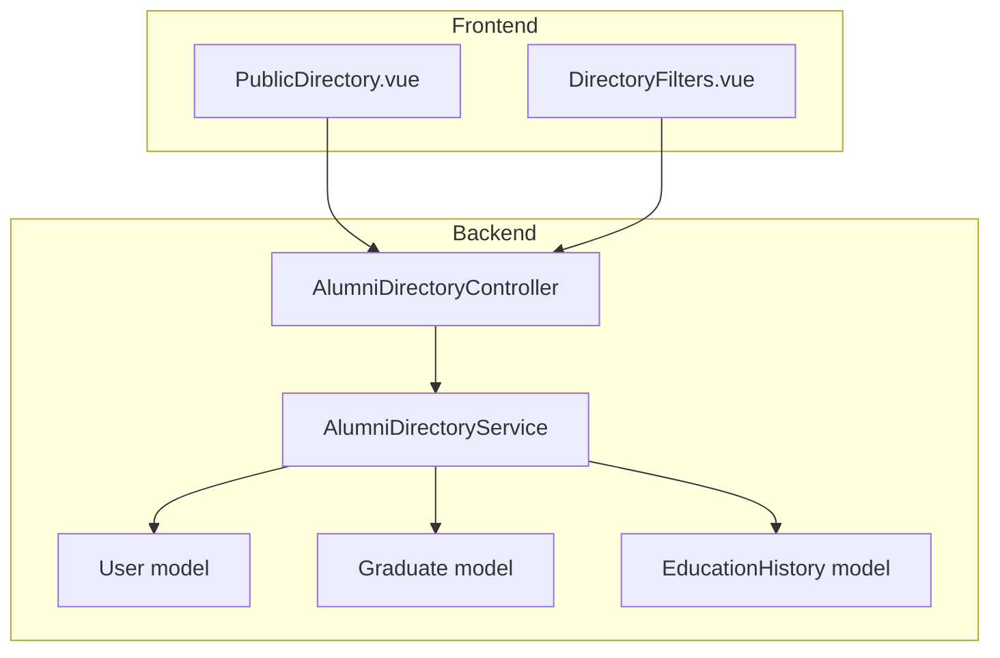
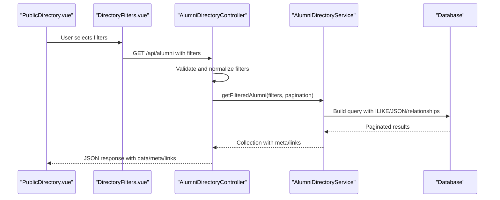
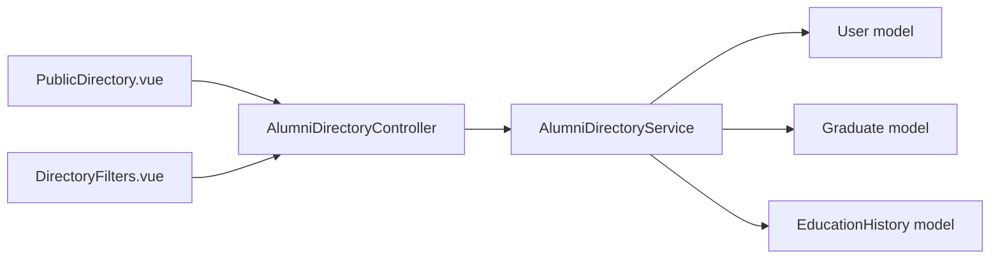

# Directory Search & Filtering

<cite>
**Referenced Files in This Document**
- [AlumniDirectoryService.php](file://app/Services/AlumniDirectoryService.php)
- [AlumniDirectoryController.php](file://app/Http/Controllers/Api/AlumniDirectoryController.php)
- [User.php](file://app/Models/User.php)
- [Graduate.php](file://app/Models/Graduate.php)
- [EducationHistory.php](file://app/Models/EducationHistory.php)
- [DirectoryFilters.vue](file://resources/js/components/DirectoryFilters.vue)
- [PublicDirectory.vue](file://resources/js/Pages/Alumni/PublicDirectory.vue)
- [AlumniDirectoryController.php](file://app/Http/Controllers/AlumniController.php)
- [routes/api.php](file://routes/api.php)
</cite>

## Table of Contents
1. [Introduction](#introduction)
2. [Project Structure](#project-structure)
3. [Core Components](#core-components)
4. [Architecture Overview](#architecture-overview)
5. [Detailed Component Analysis](#detailed-component-analysis)
6. [Dependency Analysis](#dependency-analysis)
7. [Performance Considerations](#performance-considerations)
8. [Troubleshooting Guide](#troubleshooting-guide)
9. [Conclusion](#conclusion)

## Introduction
This document explains the comprehensive directory search and filtering system used to discover and connect with alumni. It covers the multi-criteria search algorithm supporting name, bio, location, company, industry, skills, and institution search; the filter builder implementation using ILIKE operators, JSON contains queries, and relationship-based filtering; the pagination system with configurable page sizes; and the available filter options including graduation year ranges, location dropdowns, industry lists, and skill mappings. It also documents the database query construction patterns and Eloquent relationship usage for efficient filtering.

## Project Structure
The directory search functionality spans backend services/controllers, frontend filter components, and Laravel Eloquent models. The backend constructs optimized database queries, while the frontend provides interactive filters and pagination controls.

**Diagram sources**
- [PublicDirectory.vue:1-272](file://resources/js/Pages/Alumni/PublicDirectory.vue#L1-L272)
- [DirectoryFilters.vue:1-527](file://resources/js/components/DirectoryFilters.vue#L1-L527)
- [AlumniDirectoryController.php:1-292](file://app/Http/Controllers/Api/AlumniDirectoryController.php#L1-L292)
- [AlumniDirectoryService.php:1-464](file://app/Services/AlumniDirectoryService.php#L1-L464)
- [User.php:1-818](file://app/Models/User.php#L1-L818)
- [Graduate.php:1-243](file://app/Models/Graduate.php#L1-L243)
- [EducationHistory.php:1-61](file://app/Models/EducationHistory.php#L1-L61)

**Section sources**
- [PublicDirectory.vue:1-272](file://resources/js/Pages/Alumni/PublicDirectory.vue#L1-L272)
- [DirectoryFilters.vue:1-527](file://resources/js/components/DirectoryFilters.vue#L1-L527)
- [AlumniDirectoryController.php:1-292](file://app/Http/Controllers/Api/AlumniDirectoryController.php#L1-L292)
- [AlumniDirectoryService.php:1-464](file://app/Services/AlumniDirectoryService.php#L1-L464)
- [User.php:1-818](file://app/Models/User.php#L1-L818)
- [Graduate.php:1-243](file://app/Models/Graduate.php#L1-L243)
- [EducationHistory.php:1-61](file://app/Models/EducationHistory.php#L1-L61)

## Core Components
- Backend API controller validates and forwards filters to the service layer.
- Service layer builds Eloquent queries with ILIKE, JSON contains, and relationship filters.
- Frontend components manage filter state, suggestions, and pagination UI.
- Models define relationships and scopes enabling efficient filtering.

Key responsibilities:
- Filter validation and normalization
- Multi-field search across name, bio, location, company, title, institution
- Graduation year range filtering via education records
- Industry/company/skills filtering using relationship and JSON contains
- Pagination with configurable page sizes and metadata
- Autocomplete suggestions for location, company, and skills

**Section sources**
- [AlumniDirectoryController.php:25-74](file://app/Http/Controllers/Api/AlumniDirectoryController.php#L25-L74)
- [AlumniDirectoryService.php:17-25](file://app/Services/AlumniDirectoryService.php#L17-L25)
- [DirectoryFilters.vue:340-352](file://resources/js/components/DirectoryFilters.vue#L340-L352)
- [PublicDirectory.vue:259-271](file://resources/js/Pages/Alumni/PublicDirectory.vue#L259-L271)

## Architecture Overview
The system follows a layered architecture: frontend components submit filters, the controller validates and normalizes them, the service composes Eloquent queries, and the controller returns paginated results with metadata.

**Diagram sources**
- [PublicDirectory.vue:259-271](file://resources/js/Pages/Alumni/PublicDirectory.vue#L259-L271)
- [DirectoryFilters.vue:354-400](file://resources/js/components/DirectoryFilters.vue#L354-L400)
- [AlumniDirectoryController.php:25-74](file://app/Http/Controllers/Api/AlumniDirectoryController.php#L25-L74)
- [AlumniDirectoryService.php:17-25](file://app/Services/AlumniDirectoryService.php#L17-L25)

## Detailed Component Analysis

### Backend Service: AlumniDirectoryService
The service builds a robust filter query supporting:
- Full-text-like search across name, bio, location, company, title, and institution
- Graduation year range filtering via education records
- Industry, company, and skills filtering using relationship and JSON contains
- Institution, circles, and groups filtering via relationship IDs
- Sorting by name, graduation year, location, created_at
- Pagination with configurable per_page and page

Implementation highlights:
- Uses ILIKE for case-insensitive substring matching
- Uses JSON contains for skills stored as arrays
- Uses whereHas for relationship-based filters
- Uses leftJoin for sorting by graduation year
- Returns paginated results with metadata

```mermaid
flowchart TD
Start(["BuildFilterQuery"]) --> Init["Initialize query with eager loads"]
Init --> Search{"Search present?"}
Search --> |Yes| AddSearch["Add ILIKE conditions for name/bio/location<br/>and nested work experiences/institutions"]
Search --> |No| YearRange{"Graduation year range?"}
AddSearch --> YearRange
YearRange --> |Yes| AddYearRange["Add whereHas on educations with >=/<="]
YearRange --> |No| Location{"Location filter?"}
AddYearRange --> Location
Location --> |Yes| AddLocation["Add ILIKE on location"]
Location --> |No| Industry{"Industries array?"}
AddLocation --> Industry
Industry --> |Yes| AddIndustry["Add whereHas on work experiences withwhereIn(industry)"]
Industry --> |No| Company{"Company filter?"}
AddIndustry --> Company
Company --> |Yes| AddCompany["Add whereHas on work experiences ILIKE company"]
Company --> |No| Skills{"Skills array?"}
AddCompany --> Skills
Skills --> |Yes| AddSkills["Add OR JSON contains for each skill"]
Skills --> |No| Role{"Current role filter?"}
AddSkills --> Role
Role --> |Yes| AddRole["Add whereHas on current work experiences ILIKE title"]
Role --> |No| Inst{"Institutions array?"}
AddRole --> Inst
Inst --> |Yes| AddInst["Add whereHas on educations withwhereIn(institution_id)"]
Inst --> |No| Circles{"Circles array?"}
AddInst --> Circles
Circles --> |Yes| AddCircles["Add whereHas on circles withwhereIn(id)"]
Circles --> |No| Groups{"Groups array?"}
AddCircles --> Groups
Groups --> |Yes| AddGroups["Add whereHas on groups withwhereIn(id)"]
Groups --> |No| Sort["Apply sort by name/location/created_at<br/>or join+order by graduation_year"]
AddGroups --> Sort
Sort --> End(["Return Builder"])
```

**Diagram sources**
- [AlumniDirectoryService.php:30-155](file://app/Services/AlumniDirectoryService.php#L30-L155)

**Section sources**
- [AlumniDirectoryService.php:17-155](file://app/Services/AlumniDirectoryService.php#L17-L155)

### Backend Controller: AlumniDirectoryController
The controller validates incoming filters, applies defaults, delegates to the service, and returns standardized JSON with pagination metadata and navigation links.

Key validations include:
- Search string length limits
- Graduation year bounds
- Arrays with allowed types and existence checks
- Sort options and order constraints
- Per-page and page bounds

Response structure includes:
- data: paginated items
- meta: current_page, last_page, per_page, total, from, to
- links: first, last, prev, next URLs

**Section sources**
- [AlumniDirectoryController.php:27-74](file://app/Http/Controllers/Api/AlumniDirectoryController.php#L27-L74)

### Frontend: PublicDirectory.vue
Provides a simplified filter interface for public users:
- Name/company/location/industry search
- Course, institution, and graduation year dropdowns
- Debounced search input
- Pagination controls with preserved state and scroll

**Section sources**
- [PublicDirectory.vue:18-88](file://resources/js/Pages/Alumni/PublicDirectory.vue#L18-L88)
- [PublicDirectory.vue:255-271](file://resources/js/Pages/Alumni/PublicDirectory.vue#L255-L271)

### Frontend: DirectoryFilters.vue
Provides advanced filters for authenticated users:
- Graduation year range with numeric inputs and slider
- Location/company/skill autocomplete with suggestions
- Industry, company, skills, institutions, circles, groups checkboxes
- Debounced search for suggestions
- Active filters detection and clearing

Autocomplete endpoints:
- Name suggestions: ILIKE on user names
- Company suggestions: grouped by company with counts
- Location suggestions: grouped by location with counts
- Skill suggestions: extracted from JSON skills arrays with counts

**Section sources**
- [DirectoryFilters.vue:15-55](file://resources/js/components/DirectoryFilters.vue#L15-L55)
- [DirectoryFilters.vue:57-88](file://resources/js/components/DirectoryFilters.vue#L57-L88)
- [DirectoryFilters.vue:116-147](file://resources/js/components/DirectoryFilters.vue#L116-L147)
- [DirectoryFilters.vue:149-202](file://resources/js/components/DirectoryFilters.vue#L149-L202)
- [DirectoryFilters.vue:354-400](file://resources/js/components/DirectoryFilters.vue#L354-L400)
- [AlumniDirectoryController.php:109-127](file://app/Http/Controllers/Api/AlumniDirectoryController.php#L109-L127)
- [AlumniDirectoryController.php:206-214](file://app/Http/Controllers/Api/AlumniDirectoryController.php#L206-L214)
- [AlumniDirectoryController.php:219-237](file://app/Http/Controllers/Api/AlumniDirectoryController.php#L219-L237)
- [AlumniDirectoryController.php:242-259](file://app/Http/Controllers/Api/AlumniDirectoryController.php#L242-L259)
- [AlumniDirectoryController.php:265-289](file://app/Http/Controllers/Api/AlumniDirectoryController.php#L265-L289)

### Available Filter Options
- Graduation year range: min/max derived from education records
- Locations: top locations by count
- Industries: top industries by distinct user count
- Companies: top companies by distinct user count
- Skills: top skills by frequency across user JSON arrays
- Institutions: list with alumni counts
- Circles: active circles with member counts
- Groups: active groups with member counts

**Section sources**
- [AlumniDirectoryService.php:338-349](file://app/Services/AlumniDirectoryService.php#L338-L349)
- [AlumniDirectoryService.php:354-365](file://app/Services/AlumniDirectoryService.php#L354-L365)
- [AlumniDirectoryService.php:370-381](file://app/Services/AlumniDirectoryService.php#L370-L381)
- [AlumniDirectoryService.php:388-396](file://app/Services/AlumniDirectoryService.php#L388-L396)
- [AlumniDirectoryService.php:402-421](file://app/Services/AlumniDirectoryService.php#L402-L421)
- [AlumniDirectoryService.php:426-435](file://app/Services/AlumniDirectoryService.php#L426-L435)
- [AlumniDirectoryService.php:440-448](file://app/Services/AlumniDirectoryService.php#L440-L448)
- [AlumniDirectoryService.php:453-462](file://app/Services/AlumniDirectoryService.php#L453-L462)

### Database Query Construction Patterns
- ILIKE for case-insensitive substring matching on text fields
- JSON contains for skills stored as arrays
- whereHas for relationship filters (work experiences, educations, circles, groups)
- leftJoin for sorting by graduation year without losing users
- Aggregation queries for building filter option lists

**Section sources**
- [AlumniDirectoryService.php:49-62](file://app/Services/AlumniDirectoryService.php#L49-L62)
- [AlumniDirectoryService.php:67-75](file://app/Services/AlumniDirectoryService.php#L67-L75)
- [AlumniDirectoryService.php:78-80](file://app/Services/AlumniDirectoryService.php#L78-L80)
- [AlumniDirectoryService.php:83-87](file://app/Services/AlumniDirectoryService.php#L83-L87)
- [AlumniDirectoryService.php:90-94](file://app/Services/AlumniDirectoryService.php#L90-L94)
- [AlumniDirectoryService.php:97-103](file://app/Services/AlumniDirectoryService.php#L97-L103)
- [AlumniDirectoryService.php:106-111](file://app/Services/AlumniDirectoryService.php#L106-L111)
- [AlumniDirectoryService.php:114-118](file://app/Services/AlumniDirectoryService.php#L114-L118)
- [AlumniDirectoryService.php:121-132](file://app/Services/AlumniDirectoryService.php#L121-L132)
- [AlumniDirectoryService.php:140-142](file://app/Services/AlumniDirectoryService.php#L140-L142)

### Eloquent Relationship Usage
- User model relationships: educations, work experiences, social profiles, circles, groups
- Graduate model relationships: user, course, institution
- EducationHistory model relationships: graduate, user
- Connection model used for privacy and connection status checks

**Section sources**
- [User.php:249-252](file://app/Models/User.php#L249-L252)
- [User.php:196-219](file://app/Models/User.php#L196-L219)
- [Graduate.php:61-89](file://app/Models/Graduate.php#L61-L89)
- [EducationHistory.php:26-34](file://app/Models/EducationHistory.php#L26-L34)

### Practical Examples
- Multi-criteria search: search by "data scientist" with industry "Technology", location "San Francisco", skills including "Python" and "SQL"
- Graduation year range: from 2010 to 2020
- Institution-based filtering: select multiple institutions to include their alumni
- Sorting: sort by graduation year descending, then by name ascending

Note: These examples illustrate filter combinations and expected outcomes; actual implementation uses the documented query patterns and validations.

**Section sources**
- [AlumniDirectoryService.php:97-103](file://app/Services/AlumniDirectoryService.php#L97-L103)
- [AlumniDirectoryService.php:138-152](file://app/Services/AlumniDirectoryService.php#L138-L152)

## Dependency Analysis
The system exhibits clear separation of concerns:
- Controller depends on Service for business logic
- Service depends on Models for relationships and scopes
- Frontend components depend on API endpoints for data and suggestions
- No circular dependencies observed among core components

**Diagram sources**
- [PublicDirectory.vue:1-272](file://resources/js/Pages/Alumni/PublicDirectory.vue#L1-L272)
- [DirectoryFilters.vue:1-527](file://resources/js/components/DirectoryFilters.vue#L1-L527)
- [AlumniDirectoryController.php:1-292](file://app/Http/Controllers/Api/AlumniDirectoryController.php#L1-L292)
- [AlumniDirectoryService.php:1-464](file://app/Services/AlumniDirectoryService.php#L1-L464)
- [User.php:1-818](file://app/Models/User.php#L1-L818)
- [Graduate.php:1-243](file://app/Models/Graduate.php#L1-L243)
- [EducationHistory.php:1-61](file://app/Models/EducationHistory.php#L1-L61)

**Section sources**
- [AlumniDirectoryController.php:1-292](file://app/Http/Controllers/Api/AlumniDirectoryController.php#L1-L292)
- [AlumniDirectoryService.php:1-464](file://app/Services/AlumniDirectoryService.php#L1-L464)
- [User.php:1-818](file://app/Models/User.php#L1-L818)
- [Graduate.php:1-243](file://app/Models/Graduate.php#L1-L243)
- [EducationHistory.php:1-61](file://app/Models/EducationHistory.php#L1-L61)

## Performance Considerations
- Use ILIKE judiciously; consider indexing text columns for frequent searches
- JSON contains scans can be expensive; consider denormalizing or adding computed columns for high-frequency filters
- Limit suggestion lists (top 50–100) to reduce payload size
- Prefer relationship filters with proper foreign keys to leverage indexes
- Use pagination with reasonable per_page limits (controller enforces up to 100)
- Cache frequently accessed filter options (locations, industries, skills) to reduce repeated aggregation queries

[No sources needed since this section provides general guidance]

## Troubleshooting Guide
Common issues and resolutions:
- Empty results: Verify filters are not mutually exclusive; check graduation year ranges and skill arrays
- Slow searches: Review ILIKE usage on large datasets; consider adding database indexes
- JSON contains performance: Evaluate denormalized fields or materialized views for skills
- Pagination inconsistencies: Ensure per_page and page parameters are within validated bounds
- Privacy-related data hiding: Profile privacy controls may mask contact info or work details

**Section sources**
- [AlumniDirectoryController.php:47-53](file://app/Http/Controllers/Api/AlumniDirectoryController.php#L47-L53)
- [AlumniDirectoryService.php:275-333](file://app/Services/AlumniDirectoryService.php#L275-L333)

## Conclusion
The directory search and filtering system combines flexible frontend filters with a robust backend service that leverages Eloquent relationships, ILIKE operators, and JSON contains to deliver precise, paginated results. By adhering to the documented patterns and validations, developers can extend functionality while maintaining performance and usability.