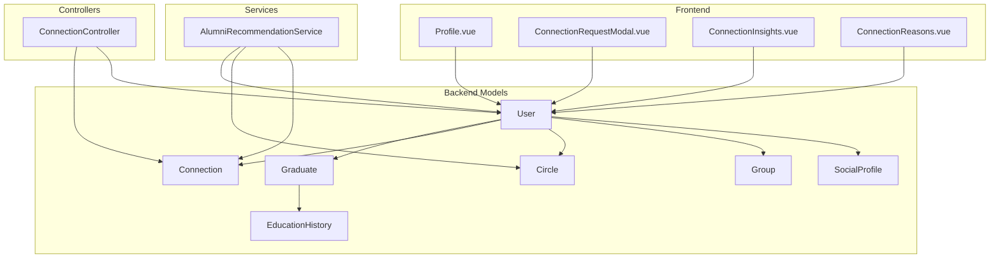
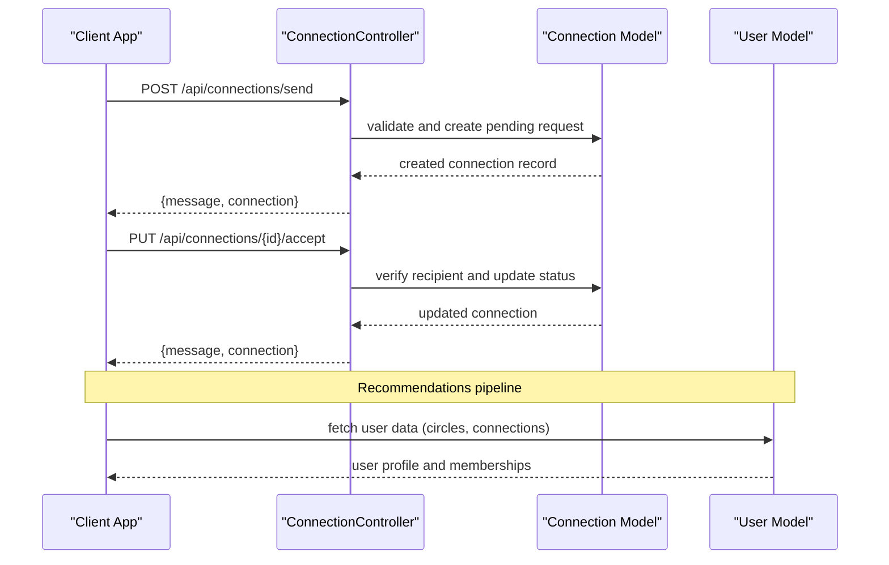
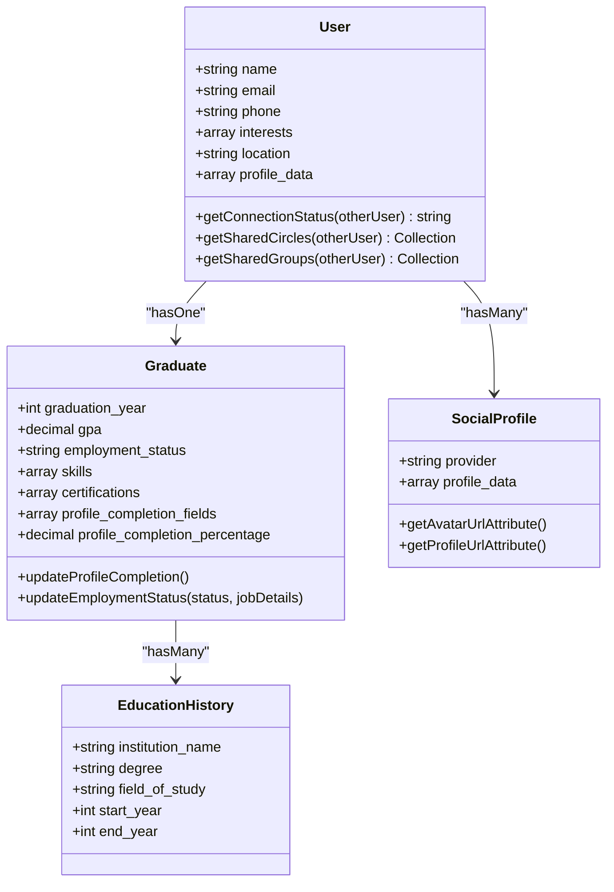
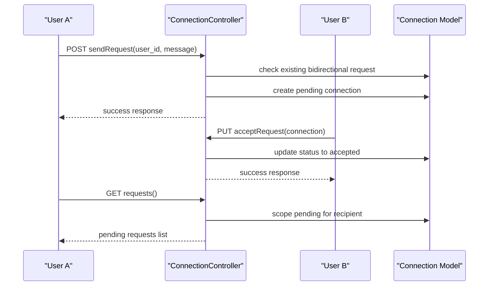
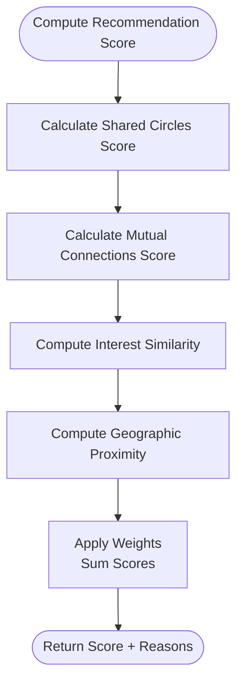
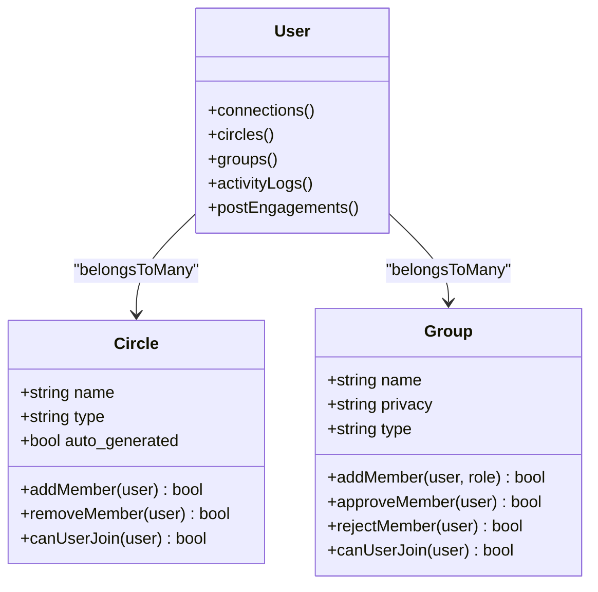
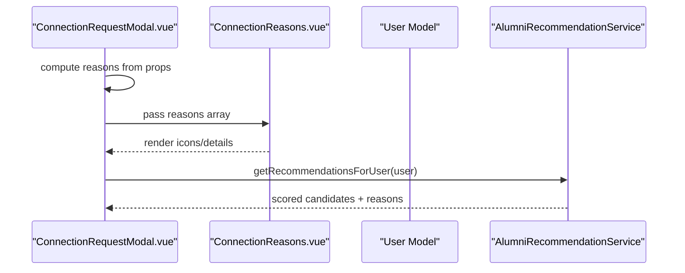
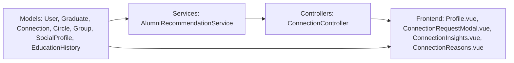

# Graduate Profiles & Connections

<cite>
**Referenced Files in This Document**
- [Graduate.php](file://app/Models/Graduate.php)
- [User.php](file://app/Models/User.php)
- [Connection.php](file://app/Models/Connection.php)
- [Circle.php](file://app/Models/Circle.php)
- [Group.php](file://app/Models/Group.php)
- [SocialProfile.php](file://app/Models/SocialProfile.php)
- [EducationHistory.php](file://app/Models/EducationHistory.php)
- [AlumniRecommendationService.php](file://app/Services/AlumniRecommendationService.php)
- [ConnectionController.php](file://app/Http/Controllers/Api/ConnectionController.php)
- [Profile.vue](file://resources/js/Pages/Graduate/Profile.vue)
- [ConnectionRequestModal.vue](file://resources/js/components/ConnectionRequestModal.vue)
- [ConnectionInsights.vue](file://resources/js/components/ConnectionInsights.vue)
- [ConnectionReasons.vue](file://resources/js/components/ConnectionReasons.vue)
- [AlumniRecommendationServiceTest.php](file://tests/Unit/AlumniRecommendationServiceTest.php)
- [task-04-graduate-profile-management-recap.md](file://docs/task-04-graduate-profile-management-recap.md)
- [task-20-mighty-networks-circle-features-analysis.md](file://docs/task-20-mighty-networks-circle-features-analysis.md)
- [requirements.md](file://.kiro/specs/graduate-tracking-system/requirements.md)
</cite>

## Table of Contents
1. [Introduction](#introduction)
2. [Project Structure](#project-structure)
3. [Core Components](#core-components)
4. [Architecture Overview](#architecture-overview)
5. [Detailed Component Analysis](#detailed-component-analysis)
6. [Dependency Analysis](#dependency-analysis)
7. [Performance Considerations](#performance-considerations)
8. [Troubleshooting Guide](#troubleshooting-guide)
9. [Conclusion](#conclusion)
10. [Appendices](#appendices)

## Introduction
This document describes the graduate profiles and connection management system in Alumate. It covers the comprehensive graduate profile structure (academic records, work experiences, skills assessment, certifications, and social profiles), connection management workflows (requests, acceptance, mutual connections, and networking insights), profile enrichment features (achievements, circles/memberships, group affiliations, activity indicators), computed attributes (mutual connections, shared circles/groups), and recommendation algorithms for networking opportunities. Practical examples illustrate data structures, connection status management, and shared community detection.

## Project Structure
The system spans backend Eloquent models, controllers, services, and frontend Vue components:
- Backend models encapsulate profiles, connections, circles, groups, and social integrations
- Controllers expose API endpoints for connection requests and approvals
- Services implement recommendation scoring and computed attribute calculations
- Frontend components render profile views, connection modals, and networking insights

**Diagram sources**
- [User.php:13](file://app/Models/User.php#L13)
- [Graduate.php:11](file://app/Models/Graduate.php#L11)
- [Connection.php:8](file://app/Models/Connection.php#L8)
- [Circle.php:10](file://app/Models/Circle.php#L10)
- [Group.php:11](file://app/Models/Group.php#L11)
- [SocialProfile.php:9](file://app/Models/SocialProfile.php#L9)
- [EducationHistory.php:8](file://app/Models/EducationHistory.php#L8)
- [AlumniRecommendationService.php:11](file://app/Services/AlumniRecommendationService.php#L11)
- [ConnectionController.php:11](file://app/Http/Controllers/Api/ConnectionController.php#L11)
- [Profile.vue:1](file://resources/js/Pages/Graduate/Profile.vue#L1)
- [ConnectionRequestModal.vue:1](file://resources/js/components/ConnectionRequestModal.vue#L1)
- [ConnectionInsights.vue:1](file://resources/js/components/ConnectionInsights.vue#L1)
- [ConnectionReasons.vue:1](file://resources/js/components/ConnectionReasons.vue#L1)

**Section sources**
- [task-04-graduate-profile-management-recap.md:1-403](file://docs/task-04-graduate-profile-management-recap.md#L1-L403)
- [task-20-mighty-networks-circle-features-analysis.md:103-169](file://docs/task-20-mighty-networks-circle-features-analysis.md#L103-L169)

## Core Components
- Graduate profile model: central entity for academic records, employment status, skills, certifications, privacy settings, and profile completion tracking
- User model: core identity with roles, social profiles, circles, groups, connections, and activity logs
- Connection model/controller: manages connection requests, statuses, and accepted networks
- Circles and Groups: membership-based communities with auto-generated criteria and privacy controls
- Social profiles: integration with external platforms for avatars and profile URLs
- Recommendation service: computes scores based on shared circles, mutual connections, interests, and geography

**Section sources**
- [Graduate.php:15-58](file://app/Models/Graduate.php#L15-L58)
- [User.php:20-77](file://app/Models/User.php#L20-L77)
- [Connection.php:14-24](file://app/Models/Connection.php#L14-L24)
- [Circle.php:14-26](file://app/Models/Circle.php#L14-L26)
- [Group.php:15-29](file://app/Models/Group.php#L15-L29)
- [SocialProfile.php:13-31](file://app/Models/SocialProfile.php#L13-L31)
- [AlumniRecommendationService.php:17-24](file://app/Services/AlumniRecommendationService.php#L17-L24)

## Architecture Overview
The system integrates profile data, social connections, and community memberships to power recommendations and networking insights. The recommendation pipeline computes a weighted score and filters out existing connections and pending requests.

**Diagram sources**
- [ConnectionController.php:16-52](file://app/Http/Controllers/Api/ConnectionController.php#L16-L52)
- [ConnectionController.php:57-74](file://app/Http/Controllers/Api/ConnectionController.php#L57-L74)
- [Connection.php:14-24](file://app/Models/Connection.php#L14-L24)
- [User.php:221-227](file://app/Models/User.php#L221-L227)

## Detailed Component Analysis

### Graduate Profile Structure
The graduate profile aggregates academic history, employment status, skills, certifications, and privacy controls. It includes:
- Academic records: course, graduation year, GPA, honors
- Employment status: current position, company, salary, start date
- Skills and certifications: arrays stored in profile data
- Privacy settings: visibility, employer contact preferences
- Profile completion: automated percentage and field tracking

**Diagram sources**
- [Graduate.php:15-58](file://app/Models/Graduate.php#L15-L58)
- [User.php:20-77](file://app/Models/User.php#L20-L77)
- [EducationHistory.php:12-24](file://app/Models/EducationHistory.php#L12-L24)
- [SocialProfile.php:13-31](file://app/Models/SocialProfile.php#L13-L31)

Practical examples:
- Profile completion calculation considers required fields and optional profile/bio/certifications
- Employment status updates cascade into profile completion recalculation
- Academic records support honors display and field-of-study categorization

**Section sources**
- [Graduate.php:138-189](file://app/Models/Graduate.php#L138-L189)
- [Graduate.php:191-221](file://app/Models/Graduate.php#L191-L221)
- [Profile.vue:32-42](file://resources/js/Pages/Graduate/Profile.vue#L32-L42)

### Connection Management
Connection workflows include sending requests, receiving approvals, and managing statuses. The system supports:
- Connection request creation with validation against duplicates
- Accept/decline operations restricted to the recipient
- Retrieval of accepted connections and pending requests
- Computed connection status for UI decisions

**Diagram sources**
- [ConnectionController.php:16-52](file://app/Http/Controllers/Api/ConnectionController.php#L16-L52)
- [ConnectionController.php:57-92](file://app/Http/Controllers/Api/ConnectionController.php#L57-L92)
- [ConnectionController.php:126-137](file://app/Http/Controllers/Api/ConnectionController.php#L126-L137)
- [Connection.php:29-40](file://app/Models/Connection.php#L29-L40)

Computed connection status logic:
- Self, none, sent_request, received_request, accepted
- Used to present actionable UI states

**Section sources**
- [User.php:560-583](file://app/Models/User.php#L560-L583)
- [ConnectionController.php:97-121](file://app/Http/Controllers/Api/ConnectionController.php#L97-L121)

### Networking Insights and Recommendations
The recommendation service computes a composite score and provides reasons for connection suggestions:
- Shared circles (weighted by type)
- Mutual connections
- Interest similarity derived from bio, work experiences, and education
- Geographic proximity (city/state matching)

**Diagram sources**
- [AlumniRecommendationService.php:62-76](file://app/Services/AlumniRecommendationService.php#L62-L76)
- [AlumniRecommendationService.php:176-193](file://app/Services/AlumniRecommendationService.php#L176-L193)
- [AlumniRecommendationService.php:198-208](file://app/Services/AlumniRecommendationService.php#L198-L208)
- [AlumniRecommendationService.php:213-237](file://app/Services/AlumniRecommendationService.php#L213-L237)

Computed attributes used in UI:
- Mutual connections: intersection of accepted connections
- Shared circles: intersection of user and candidate circles
- Shared groups: intersection of group memberships

**Section sources**
- [AlumniRecommendationService.php:81-104](file://app/Services/AlumniRecommendationService.php#L81-L104)
- [User.php:615-643](file://app/Models/User.php#L615-L643)

### Profile Enrichment and Activity Indicators
- Achievements: profile completion milestones, application activity triggers
- Circles: auto-generated and custom membership with criteria-based joins
- Groups: privacy-aware memberships with role-based moderation
- Activity indicators: last login/activity timestamps, recent engagement metrics

**Diagram sources**
- [Circle.php:14-26](file://app/Models/Circle.php#L14-L26)
- [Group.php:15-29](file://app/Models/Group.php#L15-L29)
- [User.php:207-219](file://app/Models/User.php#L207-L219)
- [User.php:149-157](file://app/Models/User.php#L149-L157)

**Section sources**
- [Circle.php:56-87](file://app/Models/Circle.php#L56-L87)
- [Group.php:99-135](file://app/Models/Group.php#L99-L135)
- [User.php:537-557](file://app/Models/User.php#L537-L557)

### Frontend Components for Connections and Insights
- ConnectionRequestModal: renders reasons (mutual connections, shared circles/groups, location, industry) and suggests messages
- ConnectionInsights: lists mutual connections at a target company with introduction request capability
- ConnectionReasons: displays recommendation reasons with icons and details

**Diagram sources**
- [ConnectionRequestModal.vue:139-186](file://resources/js/components/ConnectionRequestModal.vue#L139-L186)
- [ConnectionReasons.vue:73-97](file://resources/js/components/ConnectionReasons.vue#L73-L97)
- [AlumniRecommendationService.php:29-57](file://app/Services/AlumniRecommendationService.php#L29-L57)

**Section sources**
- [ConnectionRequestModal.vue:139-213](file://resources/js/components/ConnectionRequestModal.vue#L139-L213)
- [ConnectionInsights.vue:122-142](file://resources/js/components/ConnectionInsights.vue#L122-L142)
- [ConnectionReasons.vue:1-98](file://resources/js/components/ConnectionReasons.vue#L1-98)

## Dependency Analysis
The system exhibits clear separation of concerns:
- Models define domain entities and relationships
- Controllers mediate API requests and enforce authorization
- Services encapsulate business logic for recommendations and computed attributes
- Frontend components consume backend data and trigger actions

**Diagram sources**
- [User.php:13](file://app/Models/User.php#L13)
- [Graduate.php:11](file://app/Models/Graduate.php#L11)
- [Connection.php:8](file://app/Models/Connection.php#L8)
- [Circle.php:10](file://app/Models/Circle.php#L10)
- [Group.php:11](file://app/Models/Group.php#L11)
- [SocialProfile.php:9](file://app/Models/SocialProfile.php#L9)
- [EducationHistory.php:8](file://app/Models/EducationHistory.php#L8)
- [AlumniRecommendationService.php:11](file://app/Services/AlumniRecommendationService.php#L11)
- [ConnectionController.php:11](file://app/Http/Controllers/Api/ConnectionController.php#L11)
- [Profile.vue:1](file://resources/js/Pages/Graduate/Profile.vue#L1)
- [ConnectionRequestModal.vue:1](file://resources/js/components/ConnectionRequestModal.vue#L1)
- [ConnectionInsights.vue:1](file://resources/js/components/ConnectionInsights.vue#L1)
- [ConnectionReasons.vue:1](file://resources/js/components/ConnectionReasons.vue#L1)

**Section sources**
- [AlumniRecommendationService.php:160-171](file://app/Services/AlumniRecommendationService.php#L160-L171)
- [User.php:221-227](file://app/Models/User.php#L221-L227)

## Performance Considerations
- Caching: recommendation results cached per user with TTL to reduce recomputation
- Scoping: use of scopes (accepted, pending) and eager loading to minimize N+1 queries
- Indexing: consider indexing connection status and user membership pivots for large datasets
- Pagination: recommendation candidate sets limited to prevent heavy scans

[No sources needed since this section provides general guidance]

## Troubleshooting Guide
Common issues and resolutions:
- Duplicate connection requests: validation prevents bidirectional duplicates; check existing records before creation
- Unauthorized actions: acceptance/decline endpoints restrict operations to the intended recipient
- Privacy filtering: recommendations exclude users who opted out or are already connected/pending
- Empty computed attributes: mutual connections and shared circles return empty collections when no overlap exists

**Section sources**
- [ConnectionController.php:26-39](file://app/Http/Controllers/Api/ConnectionController.php#L26-L39)
- [ConnectionController.php:61-68](file://app/Http/Controllers/Api/ConnectionController.php#L61-L68)
- [AlumniRecommendationService.php:128-155](file://app/Services/AlumniRecommendationService.php#L128-L155)
- [AlumniRecommendationService.php:338-347](file://app/Services/AlumniRecommendationService.php#L338-L347)

## Conclusion
The graduate profiles and connection management system provides a robust foundation for alumni engagement. It combines comprehensive profile data, social connections, and community memberships to deliver meaningful networking insights and recommendations. The modular design enables scalable enhancements such as AI-driven suggestions, advanced analytics, and third-party integrations.

[No sources needed since this section summarizes without analyzing specific files]

## Appendices

### Practical Examples

- Profile data structure highlights:
  - Skills and certifications arrays for dynamic enrichment
  - Privacy settings controlling visibility and employer contact
  - Employment status updates triggering profile completion recalculations

- Connection status management:
  - getConnectionStatus determines whether to show Connect, Pending, or Connected actions
  - getMutualConnections and getSharedCircles provide computed attributes for UI

- Shared community detection:
  - getSharedCircles intersects user and candidate circles
  - getSharedGroups intersects group memberships with role-awareness

**Section sources**
- [Profile.vue:224-260](file://resources/js/Pages/Graduate/Profile.vue#L224-L260)
- [User.php:560-583](file://app/Models/User.php#L560-L583)
- [User.php:615-643](file://app/Models/User.php#L615-L643)

### Requirements Alignment
- Graduate profile management: comprehensive form fields, completion tracking, privacy controls, and audit trail
- Connection workflows: request, accept, decline, and retrieval of connections and requests
- Recommendation algorithms: weighted scoring with shared communities, mutual connections, interests, and proximity

**Section sources**
- [requirements.md:34-45](file://.kiro/specs/graduate-tracking-system/requirements.md#L34-L45)
- [task-04-graduate-profile-management-recap.md:13-81](file://docs/task-04-graduate-profile-management-recap.md#L13-L81)
- [AlumniRecommendationService.php:62-76](file://app/Services/AlumniRecommendationService.php#L62-L76)