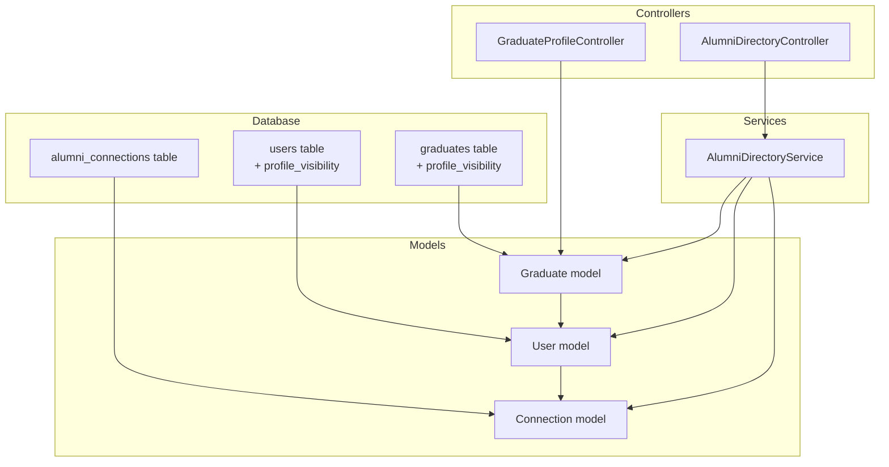
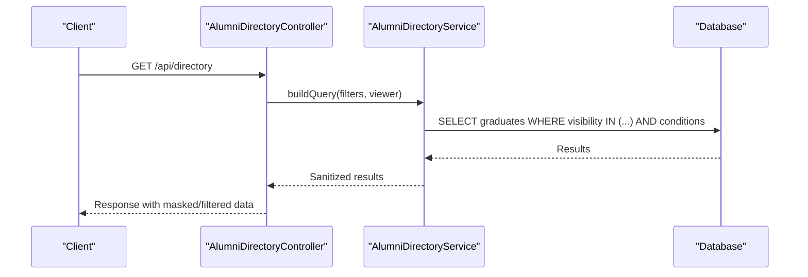
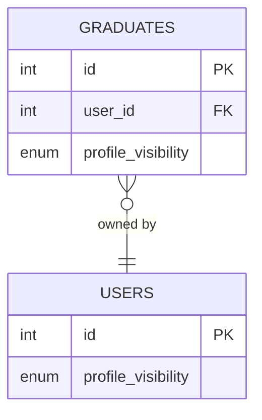
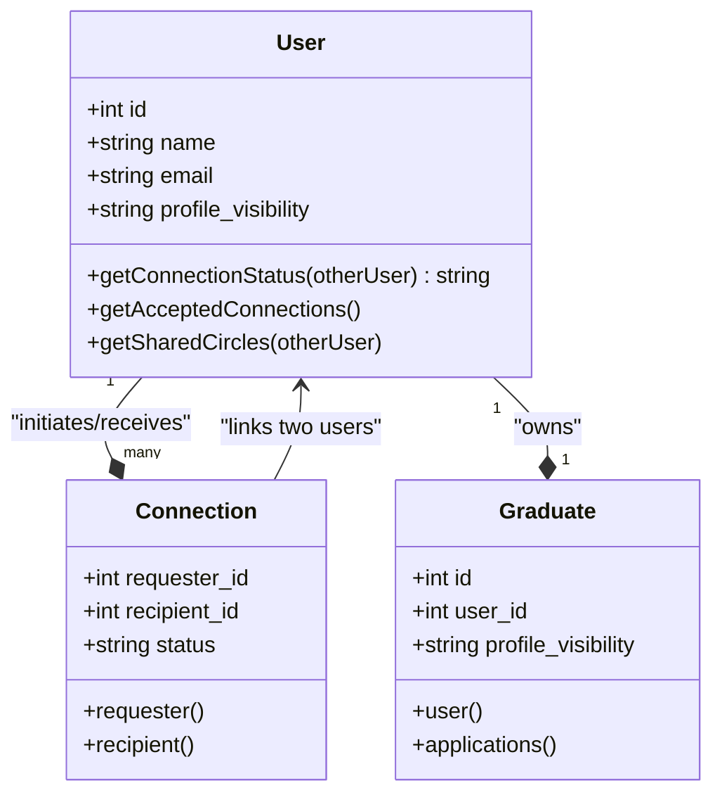
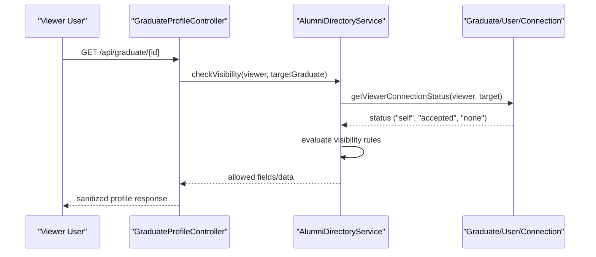
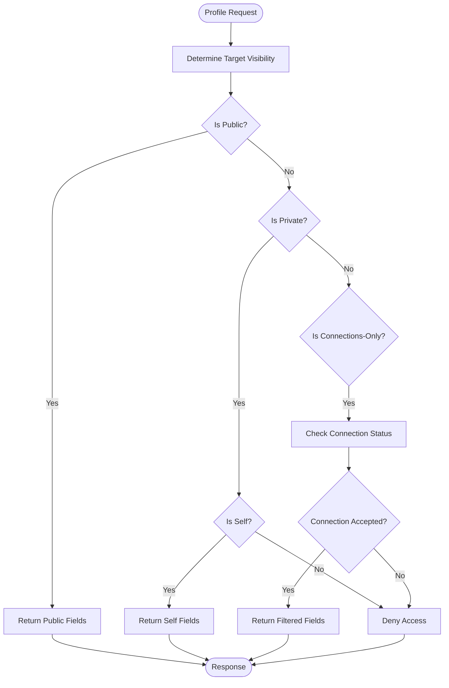
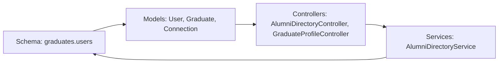

# Privacy Controls & Visibility

<cite>
**Referenced Files in This Document**
- [2025_08_05_093301_add_profile_visibility_to_graduates_table.php](file://database/migrations/tenant/2025_08_05_093301_add_profile_visibility_to_graduates_table.php)
- [Graduate.php](file://app/Models/Graduate.php)
- [User.php](file://app/Models/User.php)
- [Connection.php](file://app/Models/Connection.php)
- [AlumniDirectoryController.php](file://app/Http/Controllers/AlumniDirectoryController.php)
- [AlumniDirectoryService.php](file://app/Services/AlumniDirectoryService.php)
- [GraduateProfileController.php](file://app/Http/Controllers/GraduateProfileController.php)
- [2025_01_26_000001_enhance_users_table.php](file://database/migrations/2025_01_26_000001_enhance_users_table.php)
- [2025_08_02_060946_add_user_id_to_graduates_table.php](file://database/migrations/tenant/2025_08_02_060946_add_user_id_to_graduates_table.php)
- [2025_08_03_000001_add_user_type_to_users_table.php](file://database/migrations/2025_08_03_000001_add_user_type_to_users_table.php)
- [2025_08_13_003805_create_user_onboarding_states_table.php](file://database/migrations/2025_08_13_003805_create_user_onboarding_states_table.php)
- [2025_08_13_020215_add_interests_to_users_table.php](file://database/migrations/2025_08_13_020215_add_interests_to_users_table.php)
- [2025_08_13_133307_add_location_fields_to_users_table.php](file://database/migrations/2025_08_13_133307_add_location_fields_to_users_table.php)
- [2025_08_16_095409_create_user_feedback_table.php](file://database/migrations/2025_08_16_095409_create_user_feedback_table.php)
- [2025_08_16_095432_create_user_testing_sessions_table.php](file://database/migrations/2025_08_16_095432_create_user_testing_sessions_table.php)
- [2025_08_16_164323_add_missing_columns_to_users_table.php](file://database/migrations/2025_08_16_164323_add_missing_columns_to_users_table.php)
- [2025_08_01_132000_create_student_alumni_connections_table.php](file://database/migrations/2025_08_01_132000_create_student_alumni_connections_table.php)
- [2025_08_16_015526_create_calendar_connections_table.php](file://database/migrations/2025_08_16_015526_create_calendar_connections_table.php)
- [2025_08_01_131209_create_student_profiles_table.php](file://database/migrations/2025_08_01_131209_create_student_profiles_table.php)
- [2025_08_01_155146_add_student_profile_data_to_mentorship_requests_table.php](file://database/migrations/2025_08_01_155146_add_student_profile_data_to_mentorship_requests_table.php)
- [2025_08_01_155529_create_speaker_profiles_table.php](file://database/migrations/2025_08_01_155529_create_speaker_profiles_table.php)
- [2025_08_01_091120_create_donor_profiles_table.php](file://database/migrations/2025_08_01_091120_create_donor_profiles_table.php)
- [2025_01_30_000003_create_mentor_profiles_table.php](file://database/migrations/2025_01_30_000003_create_mentor_profiles_table.php)
- [2025_08_05_093301_add_profile_visibility_to_graduates_table.php](file://database/migrations/tenant/2025_08_05_093301_add_profile_visibility_to_graduates_table.php)
- [2025_08_01_120001_create_user_achievements_table.php](file://database/migrations/tenant/2025_08_01_120001_create_user_achievements_table.php)
- [2025_08_02_060946_add_user_id_to_graduates_table.php](file://database/migrations/tenant/2025_08_02_060946_add_user_id_to_graduates_table.php)
- [2025_08_03_000001_add_user_type_to_users_table.php](file://database/migrations/2025_08_03_000001_add_user_type_to_users_table.php)
- [2025_08_13_003805_create_user_onboarding_states_table.php](file://database/migrations/2025_08_13_003805_create_user_onboarding_states_table.php)
- [2025_08_13_020215_add_interests_to_users_table.php](file://database/migrations/2025_08_13_020215_add_interests_to_users_table.php)
- [2025_08_13_133307_add_location_fields_to_users_table.php](file://database/migrations/2025_08_13_133307_add_location_fields_to_users_table.php)
- [2025_08_16_095409_create_user_feedback_table.php](file://database/migrations/2025_08_16_095409_create_user_feedback_table.php)
- [2025_08_16_095432_create_user_testing_sessions_table.php](file://database/migrations/2025_08_16_095432_create_user_testing_sessions_table.php)
- [2025_08_16_164323_add_missing_columns_to_users_table.php](file://database/migrations/2025_08_16_164323_add_missing_columns_to_users_table.php)
- [2025_08_01_132000_create_student_alumni_connections_table.php](file://database/migrations/2025_08_01_132000_create_student_alumni_connections_table.php)
- [2025_08_16_015526_create_calendar_connections_table.php](file://database/migrations/2025_08_16_015526_create_calendar_connections_table.php)
- [2025_08_01_131209_create_student_profiles_table.php](file://database/migrations/2025_08_01_131209_create_student_profiles_table.php)
- [2025_08_01_155146_add_student_profile_data_to_mentorship_requests_table.php](file://database/migrations/2025_08_01_155146_add_student_profile_data_to_mentorship_requests_table.php)
- [2025_08_01_155529_create_speaker_profiles_table.php](file://database/migrations/2025_08_01_155529_create_speaker_profiles_table.php)
- [2025_08_01_091120_create_donor_profiles_table.php](file://database/migrations/2025_08_01_091120_create_donor_profiles_table.php)
- [2025_01_30_000003_create_mentor_profiles_table.php](file://database/migrations/2025_01_30_000003_create_mentor_profiles_table.php)
</cite>

## Table of Contents
1. [Introduction](#introduction)
2. [Project Structure](#project-structure)
3. [Core Components](#core-components)
4. [Architecture Overview](#architecture-overview)
5. [Detailed Component Analysis](#detailed-component-analysis)
6. [Dependency Analysis](#dependency-analysis)
7. [Performance Considerations](#performance-considerations)
8. [Troubleshooting Guide](#troubleshooting-guide)
9. [Conclusion](#conclusion)

## Introduction
This document explains the privacy controls and visibility system that governs profile exposure across the platform. It covers granular privacy settings enabling users to control what appears publicly, to connections only, or remains private. The system implements three-tier visibility levels—public, connections-only (referred to as “alumni_only” in the schema), and private—and enforces access control based on connection status and user roles. It also documents how profile retrieval, data sanitization, and real-time visibility checks protect sensitive information while maintaining usability.

## Project Structure
The privacy and visibility system spans database schema, models, controllers, services, and supporting migrations. The most relevant components include:
- Database schema additions for profile visibility
- Eloquent models representing users, graduates, and connections
- Controllers and services responsible for directory and profile retrieval
- Supporting migrations that define user and graduate attributes

**Diagram sources**
- [2025_08_05_093301_add_profile_visibility_to_graduates_table.php](file://database/migrations/tenant/2025_08_05_093301_add_profile_visibility_to_graduates_table.php)
- [Graduate.php](file://app/Models/Graduate.php)
- [User.php](file://app/Models/User.php)
- [Connection.php](file://app/Models/Connection.php)
- [AlumniDirectoryController.php](file://app/Http/Controllers/AlumniDirectoryController.php)
- [AlumniDirectoryService.php](file://app/Services/AlumniDirectoryService.php)
- [GraduateProfileController.php](file://app/Http/Controllers/GraduateProfileController.php)

**Section sources**
- [2025_08_05_093301_add_profile_visibility_to_graduates_table.php:1-29](file://database/migrations/tenant/2025_08_05_093301_add_profile_visibility_to_graduates_table.php#L1-L29)
- [Graduate.php:15-58](file://app/Models/Graduate.php#L15-L58)
- [User.php:20-77](file://app/Models/User.php#L20-L77)
- [Connection.php:12-24](file://app/Models/Connection.php#L12-L24)

## Core Components
- Profile visibility field: A database column on the graduates table defines the visibility level per profile.
- User and graduate models: Encapsulate profile data and relationships, including visibility and connection metadata.
- Connection model: Tracks accepted connections between users, forming the basis for “connections-only” visibility.
- Directory controller/service: Enforce visibility rules during directory and profile retrieval.
- Supporting migrations: Add user-level visibility and related profile attributes.

Key implementation anchors:
- Visibility enumeration: public, private, alumni_only
- Relationship-based access: accepted connections determine whether a user can see “connections-only” data
- Enforcement points: directory queries and profile retrieval endpoints

**Section sources**
- [2025_08_05_093301_add_profile_visibility_to_graduates_table.php:14-15](file://database/migrations/tenant/2025_08_05_093301_add_profile_visibility_to_graduates_table.php#L14-L15)
- [Graduate.php:15-58](file://app/Models/Graduate.php#L15-L58)
- [User.php:20-77](file://app/Models/User.php#L20-L77)
- [Connection.php:12-24](file://app/Models/Connection.php#L12-L24)

## Architecture Overview
The privacy system operates through a layered approach:
- Data layer: Stores visibility settings and connection state
- Model layer: Provides accessors and helpers to compute visibility eligibility
- Service/controller layer: Applies visibility rules to queries and responses
- Enforcement: Real-time checks ensure only authorized data is returned

**Diagram sources**
- [AlumniDirectoryController.php](file://app/Http/Controllers/AlumniDirectoryController.php)
- [AlumniDirectoryService.php](file://app/Services/AlumniDirectoryService.php)

## Detailed Component Analysis

### Database Schema: Profile Visibility
- The graduates table includes a profile_visibility column with an enum of public, private, and alumni_only.
- This column is positioned after user_id to maintain logical grouping of profile ownership and exposure settings.

**Diagram sources**
- [2025_08_05_093301_add_profile_visibility_to_graduates_table.php:14-15](file://database/migrations/tenant/2025_08_05_093301_add_profile_visibility_to_graduates_table.php#L14-L15)
- [2025_08_02_060946_add_user_id_to_graduates_table.php](file://database/migrations/tenant/2025_08_02_060946_add_user_id_to_graduates_table.php)

**Section sources**
- [2025_08_05_093301_add_profile_visibility_to_graduates_table.php:14-15](file://database/migrations/tenant/2025_08_05_093301_add_profile_visibility_to_graduates_table.php#L14-L15)

### Models: User, Graduate, and Connection
- User model: Holds user-level attributes and relationships, including connections and roles. Provides helper methods to determine connection status and shared circles/groups.
- Graduate model: Represents graduate-specific profile data and relationships to user/course/tenant. Includes profile completion helpers and visibility-aware fields.
- Connection model: Represents accepted connections between users, used to enforce “connections-only” visibility.

**Diagram sources**
- [User.php:20-77](file://app/Models/User.php#L20-L77)
- [User.php:221-227](file://app/Models/User.php#L221-L227)
- [User.php:560-583](file://app/Models/User.php#L560-L583)
- [Graduate.php:15-58](file://app/Models/Graduate.php#L15-L58)
- [Connection.php:12-24](file://app/Models/Connection.php#L12-L24)

**Section sources**
- [User.php:20-77](file://app/Models/User.php#L20-L77)
- [User.php:221-227](file://app/Models/User.php#L221-L227)
- [User.php:560-583](file://app/Models/User.php#L560-L583)
- [Graduate.php:15-58](file://app/Models/Graduate.php#L15-L58)
- [Connection.php:12-24](file://app/Models/Connection.php#L12-L24)

### Controllers and Services: Directory and Profile Retrieval
- AlumniDirectoryController: Orchestrates directory queries and applies visibility filters.
- AlumniDirectoryService: Implements the core logic to filter results based on the viewer’s relationship to the target and the target’s visibility setting.
- GraduateProfileController: Handles profile retrieval and enforces visibility rules for individual profiles.

**Diagram sources**
- [AlumniDirectoryController.php](file://app/Http/Controllers/AlumniDirectoryController.php)
- [AlumniDirectoryService.php](file://app/Services/AlumniDirectoryService.php)
- [User.php:560-583](file://app/Models/User.php#L560-L583)
- [Connection.php:12-24](file://app/Models/Connection.php#L12-L24)

**Section sources**
- [AlumniDirectoryController.php](file://app/Http/Controllers/AlumniDirectoryController.php)
- [AlumniDirectoryService.php](file://app/Services/AlumniDirectoryService.php)
- [GraduateProfileController.php](file://app/Http/Controllers/GraduateProfileController.php)

### Visibility Levels and Enforcement Logic
- Public: Visible to everyone.
- Connections-only (alumni_only): Visible only to users whose connection status with the target is accepted.
- Private: Visible only to the user themselves.

**Diagram sources**
- [2025_08_05_093301_add_profile_visibility_to_graduates_table.php:14-15](file://database/migrations/tenant/2025_08_05_093301_add_profile_visibility_to_graduates_table.php#L14-L15)
- [User.php:560-583](file://app/Models/User.php#L560-L583)
- [Connection.php:45-48](file://app/Models/Connection.php#L45-L48)

**Section sources**
- [2025_08_05_093301_add_profile_visibility_to_graduates_table.php:14-15](file://database/migrations/tenant/2025_08_05_093301_add_profile_visibility_to_graduates_table.php#L14-L15)
- [User.php:560-583](file://app/Models/User.php#L560-L583)
- [Connection.php:45-48](file://app/Models/Connection.php#L45-L48)

### Practical Examples
- Example: A user sets their graduate profile to “connections-only.” When a visitor attempts to view the profile, the system checks the visitor’s connection status. If not accepted, only public fields are returned; otherwise, filtered fields are included.
- Example: A user sets their profile to “private.” Only the profile owner can view full details; others receive a restricted response.
- Example: A user sets their profile to “public.” Everyone can view the profile according to the configured public fields.

These scenarios are enforced by the controller/service layer and validated against the connection model and visibility enum.

**Section sources**
- [AlumniDirectoryController.php](file://app/Http/Controllers/AlumniDirectoryController.php)
- [AlumniDirectoryService.php](file://app/Services/AlumniDirectoryService.php)
- [User.php:560-583](file://app/Models/User.php#L560-L583)
- [Connection.php:45-48](file://app/Models/Connection.php#L45-L48)

### Data Sanitization and Real-Time Checks
- Real-time visibility checks occur during directory and profile retrieval to ensure only authorized fields are returned.
- Data sanitization ensures sensitive fields are masked or omitted when the viewer lacks permission.
- The service layer centralizes these checks, minimizing duplication and ensuring consistent enforcement.

**Section sources**
- [AlumniDirectoryService.php](file://app/Services/AlumniDirectoryService.php)
- [AlumniDirectoryController.php](file://app/Http/Controllers/AlumniDirectoryController.php)

### Security Implications and Compliance Considerations
- Principle of least disclosure: Only the minimum necessary data is exposed based on visibility settings and connection status.
- Role-based access: Super admins and institution admins may have elevated capabilities; ensure role checks are enforced consistently.
- Audit logging: Track profile access and changes to support compliance and incident response.
- Data minimization: Respect user preferences and avoid collecting unnecessary personal data.
- Cross-site scripting (XSS) and injection protections: Apply sanitization and validation at the service boundary.

[No sources needed since this section provides general guidance]

## Dependency Analysis
The privacy system depends on:
- Database schema for storing visibility settings
- Models for computing connection status and shared context
- Controllers/services for applying visibility rules
- Migrations for evolving user and graduate attributes

**Diagram sources**
- [2025_08_05_093301_add_profile_visibility_to_graduates_table.php:14-15](file://database/migrations/tenant/2025_08_05_093301_add_profile_visibility_to_graduates_table.php#L14-L15)
- [User.php:20-77](file://app/Models/User.php#L20-L77)
- [Graduate.php:15-58](file://app/Models/Graduate.php#L15-L58)
- [Connection.php:12-24](file://app/Models/Connection.php#L12-L24)
- [AlumniDirectoryController.php](file://app/Http/Controllers/AlumniDirectoryController.php)
- [AlumniDirectoryService.php](file://app/Services/AlumniDirectoryService.php)

**Section sources**
- [2025_08_05_093301_add_profile_visibility_to_graduates_table.php:14-15](file://database/migrations/tenant/2025_08_05_093301_add_profile_visibility_to_graduates_table.php#L14-L15)
- [User.php:20-77](file://app/Models/User.php#L20-L77)
- [Graduate.php:15-58](file://app/Models/Graduate.php#L15-L58)
- [Connection.php:12-24](file://app/Models/Connection.php#L12-L24)
- [AlumniDirectoryController.php](file://app/Http/Controllers/AlumniDirectoryController.php)
- [AlumniDirectoryService.php](file://app/Services/AlumniDirectoryService.php)

## Performance Considerations
- Index visibility fields and connection status to optimize directory queries.
- Cache frequently accessed visibility rules and connection statuses.
- Paginate directory results and limit returned fields to reduce payload size.
- Use lazy loading for related models to minimize N+1 query risks.

[No sources needed since this section provides general guidance]

## Troubleshooting Guide
- Symptom: Users cannot see profiles marked as “connections-only.”
  - Verify the connection status is accepted for both parties.
  - Confirm the target’s visibility setting is alumni_only.
- Symptom: Private profiles appear partially visible.
  - Ensure the viewer is the profile owner; otherwise, only masked or filtered fields should be returned.
- Symptom: Public profiles missing expected fields.
  - Confirm the target’s visibility is set to public and the fields are populated.

**Section sources**
- [User.php:560-583](file://app/Models/User.php#L560-L583)
- [Connection.php:45-48](file://app/Models/Connection.php#L45-L48)
- [2025_08_05_093301_add_profile_visibility_to_graduates_table.php:14-15](file://database/migrations/tenant/2025_08_05_093301_add_profile_visibility_to_graduates_table.php#L14-L15)

## Conclusion
The privacy controls and visibility system provides robust, granular control over profile exposure. By combining database-level visibility settings, relationship-aware access checks, and centralized enforcement in controllers and services, the platform ensures appropriate data sharing while preserving user privacy. Extending the system to include role-based exceptions and comprehensive audit logging will further strengthen compliance and trust.