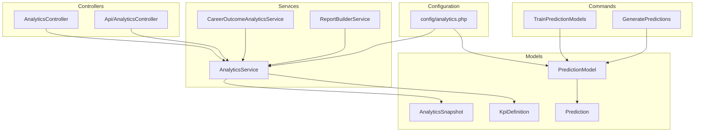
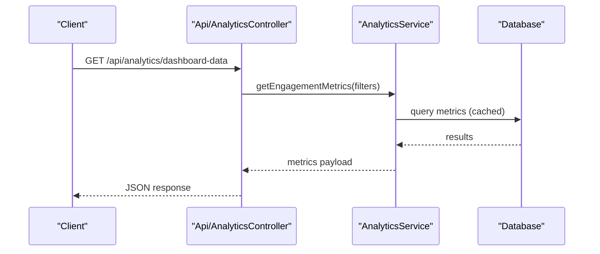
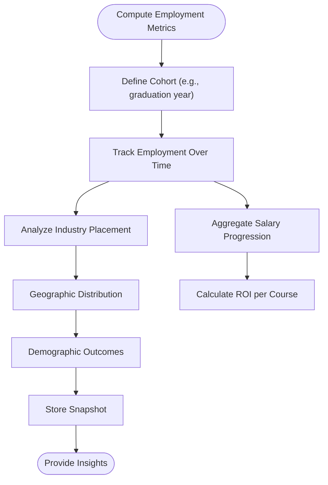
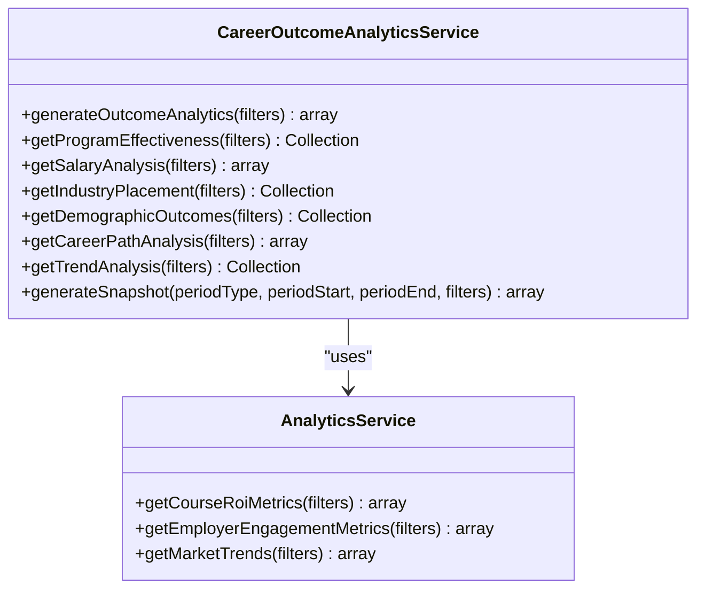
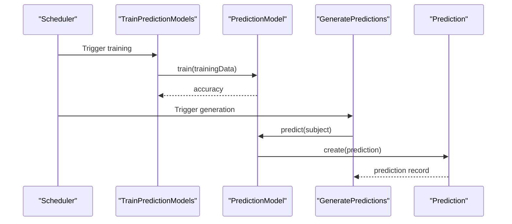
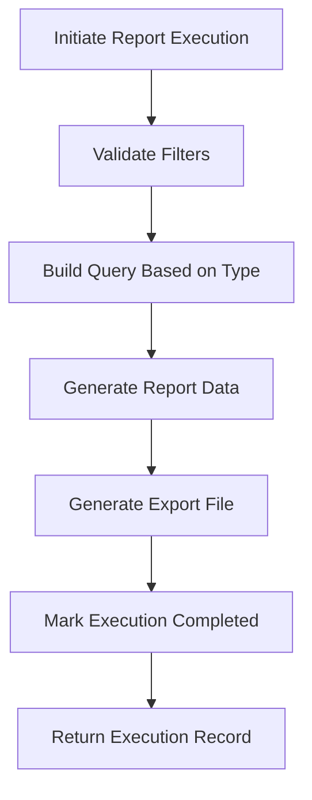
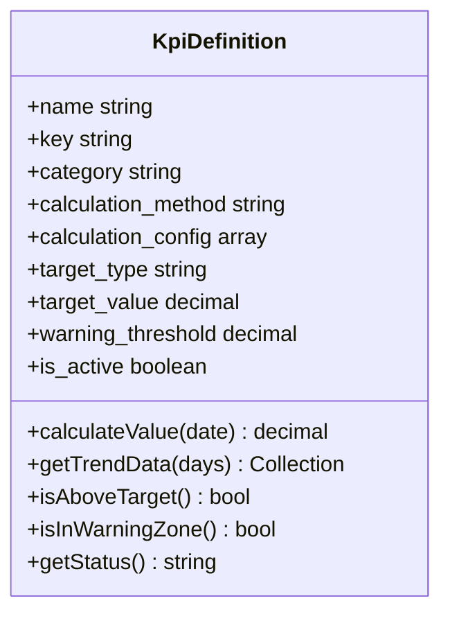
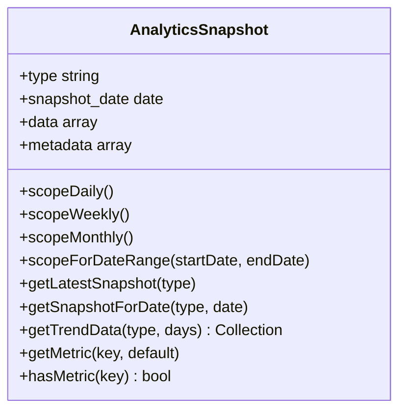
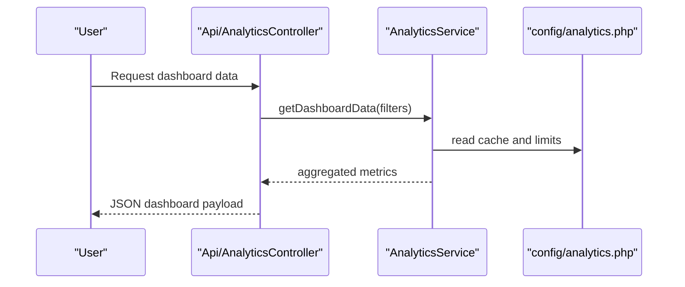
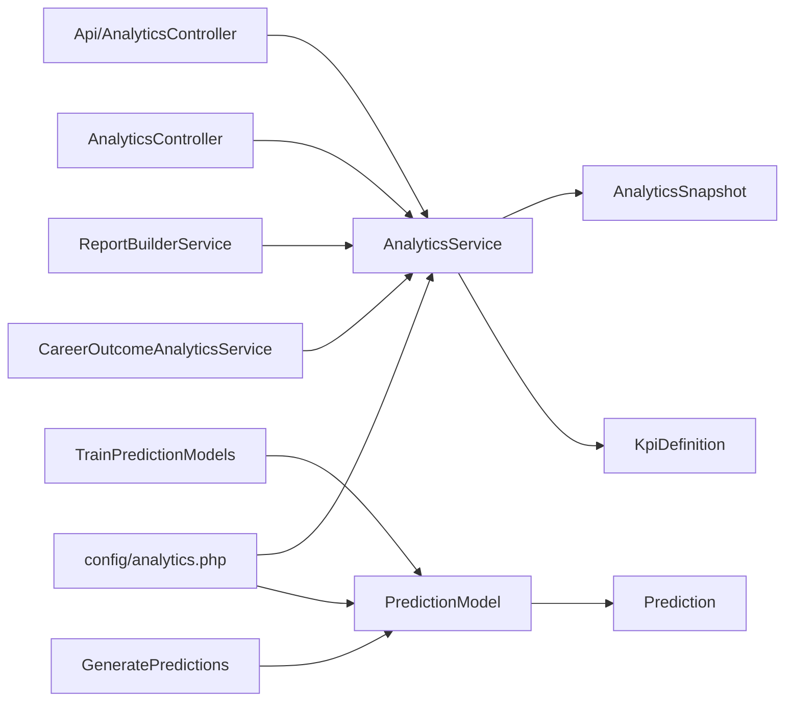

# Analytics & Reporting

<cite>
**Referenced Files in This Document**
- [AnalyticsService.php](file://app/Services/AnalyticsService.php)
- [CareerOutcomeAnalyticsService.php](file://app/Services/CareerOutcomeAnalyticsService.php)
- [ReportBuilderService.php](file://app/Services/ReportBuilderService.php)
- [analytics.php](file://config/analytics.php)
- [GeneratePredictions.php](file://app/Console/Commands/GeneratePredictions.php)
- [TrainPredictionModels.php](file://app/Console/Commands/TrainPredictionModels.php)
- [Prediction.php](file://app/Models/Prediction.php)
- [PredictionModel.php](file://app/Models/PredictionModel.php)
- [KpiDefinition.php](file://app/Models/KpiDefinition.php)
- [AnalyticsController.php](file://app/Http/Controllers/AnalyticsController.php)
- [Api/AnalyticsController.php](file://app/Http/Controllers/Api/AnalyticsController.php)
- [AnalyticsSnapshot.php](file://app/Models/AnalyticsSnapshot.php)
</cite>

## Table of Contents
1. [Introduction](#introduction)
2. [Project Structure](#project-structure)
3. [Core Components](#core-components)
4. [Architecture Overview](#architecture-overview)
5. [Detailed Component Analysis](#detailed-component-analysis)
6. [Dependency Analysis](#dependency-analysis)
7. [Performance Considerations](#performance-considerations)
8. [Troubleshooting Guide](#troubleshooting-guide)
9. [Conclusion](#conclusion)
10. [Appendices](#appendices)

## Introduction
This document describes the analytics and reporting system for employment analytics, course performance, and predictive modeling. It covers:
- Employment analytics: graduation-to-employment tracking, salary progression, industry placement, geographic distribution, ROI measurement, and demographic analysis
- Course performance analysis: program effectiveness and outcome metrics
- Predictive analytics: job placement probability modeling, career path recommendations, and market demand forecasting
- Implementation details for custom report builder, KPI dashboards, and trend analysis
- Practical examples of analytics dashboards and reporting workflows

## Project Structure
The analytics system is organized around:
- Services that compute metrics and drive reporting
- Models that persist snapshots, KPI definitions, and predictions
- Controllers that expose APIs for dashboards and exports
- Configuration that governs caching, predictions, reports, and performance
- Console commands that train and generate predictions

**Diagram sources**
- [AnalyticsController.php:1-800](file://app/Http/Controllers/AnalyticsController.php#L1-L800)
- [Api/AnalyticsController.php:1-669](file://app/Http/Controllers/Api/AnalyticsController.php#L1-L669)
- [AnalyticsService.php:1-1210](file://app/Services/AnalyticsService.php#L1-L1210)
- [CareerOutcomeAnalyticsService.php:1-511](file://app/Services/CareerOutcomeAnalyticsService.php#L1-L511)
- [ReportBuilderService.php:1-736](file://app/Services/ReportBuilderService.php#L1-L736)
- [KpiDefinition.php:1-310](file://app/Models/KpiDefinition.php#L1-L310)
- [AnalyticsSnapshot.php:1-82](file://app/Models/AnalyticsSnapshot.php#L1-L82)
- [PredictionModel.php:1-380](file://app/Models/PredictionModel.php#L1-L380)
- [Prediction.php:1-239](file://app/Models/Prediction.php#L1-L239)
- [TrainPredictionModels.php:1-436](file://app/Console/Commands/TrainPredictionModels.php#L1-L436)
- [GeneratePredictions.php:1-161](file://app/Console/Commands/GeneratePredictions.php#L1-L161)
- [analytics.php:1-242](file://config/analytics.php#L1-L242)

**Section sources**
- [AnalyticsService.php:1-1210](file://app/Services/AnalyticsService.php#L1-L1210)
- [CareerOutcomeAnalyticsService.php:1-511](file://app/Services/CareerOutcomeAnalyticsService.php#L1-L511)
- [ReportBuilderService.php:1-736](file://app/Services/ReportBuilderService.php#L1-L736)
- [analytics.php:1-242](file://config/analytics.php#L1-L242)

## Core Components
- AnalyticsService: central hub for engagement, alumni activity, community health, platform usage, and graduate outcome metrics; supports custom reports and exports
- CareerOutcomeAnalyticsService: comprehensive career outcome analytics including program effectiveness, salary analysis, industry placement, demographics, career paths, and trend analysis
- ReportBuilderService: dynamic report builder supporting multiple report types, filters, preview, and export formats
- PredictionModel and Prediction: ML-ready models and predictions with configurable feature weights, training, and interpretation
- KpiDefinition: standardized KPI definitions with calculation methods, targets, thresholds, and trend retrieval
- AnalyticsSnapshot: historical snapshot persistence for trend analysis and benchmarking
- Configuration: centralized settings for caching, snapshots, KPI thresholds, predictions, reports, charts, exports, performance, security, and dashboard defaults

**Section sources**
- [AnalyticsService.php:22-800](file://app/Services/AnalyticsService.php#L22-L800)
- [CareerOutcomeAnalyticsService.php:15-511](file://app/Services/CareerOutcomeAnalyticsService.php#L15-L511)
- [ReportBuilderService.php:14-736](file://app/Services/ReportBuilderService.php#L14-L736)
- [PredictionModel.php:9-380](file://app/Models/PredictionModel.php#L9-L380)
- [Prediction.php:11-239](file://app/Models/Prediction.php#L11-L239)
- [KpiDefinition.php:9-310](file://app/Models/KpiDefinition.php#L9-L310)
- [AnalyticsSnapshot.php:9-82](file://app/Models/AnalyticsSnapshot.php#L9-L82)
- [analytics.php:1-242](file://config/analytics.php#L1-L242)

## Architecture Overview
The system integrates data ingestion, computation, persistence, and presentation:
- Data ingestion: event tracking via AnalyticsController and AnalyticsController store endpoints
- Computation: services compute metrics and analytics
- Persistence: snapshots, KPI values, and predictions are stored
- Presentation: controllers expose dashboards and reports; configuration controls defaults and limits

**Diagram sources**
- [Api/AnalyticsController.php:120-144](file://app/Http/Controllers/Api/AnalyticsController.php#L120-L144)
- [AnalyticsService.php:27-44](file://app/Services/AnalyticsService.php#L27-L44)

**Section sources**
- [AnalyticsController.php:18-241](file://app/Http/Controllers/AnalyticsController.php#L18-L241)
- [Api/AnalyticsController.php:1-669](file://app/Http/Controllers/Api/AnalyticsController.php#L1-L669)
- [AnalyticsService.php:1-1210](file://app/Services/AnalyticsService.php#L1-L1210)

## Detailed Component Analysis

### Employment Analytics
Focus areas:
- Graduation-to-employment tracking: average time to employment, retention rates, and cohort analysis
- Salary progression: yearly averages and medians across years post-graduation
- Industry placement: top industries and companies, retention rates, and demand signals
- Geographic distribution: location-based placement and activity
- ROI measurement: course-level ROI calculations
- Demographic analysis: employment outcomes segmented by demographic groups

Implementation highlights:
- Metrics computed in AnalyticsService for graduate outcomes and in CareerOutcomeAnalyticsService for deeper insights
- Snapshot generation for historical tracking
- Market trends and benchmarks derived from job market data

**Diagram sources**
- [AnalyticsService.php:511-618](file://app/Services/AnalyticsService.php#L511-L618)
- [CareerOutcomeAnalyticsService.php:19-339](file://app/Services/CareerOutcomeAnalyticsService.php#L19-L339)
- [AnalyticsSnapshot.php:48-81](file://app/Models/AnalyticsSnapshot.php#L48-L81)

**Section sources**
- [AnalyticsService.php:511-618](file://app/Services/AnalyticsService.php#L511-L618)
- [CareerOutcomeAnalyticsService.php:19-339](file://app/Services/CareerOutcomeAnalyticsService.php#L19-L339)
- [AnalyticsSnapshot.php:1-82](file://app/Models/AnalyticsSnapshot.php#L1-L82)

### Course Performance Analysis
Capabilities:
- Program effectiveness: compare programs by employment rates, salary progression, and placement counts
- Outcome metrics: employment rates, average salaries, top employers, and skills taught
- Trend analysis: historical performance and demand signals

**Diagram sources**
- [CareerOutcomeAnalyticsService.php:15-511](file://app/Services/CareerOutcomeAnalyticsService.php#L15-L511)
- [AnalyticsService.php:590-732](file://app/Services/AnalyticsService.php#L590-L732)

**Section sources**
- [CareerOutcomeAnalyticsService.php:87-147](file://app/Services/CareerOutcomeAnalyticsService.php#L87-L147)
- [AnalyticsService.php:590-618](file://app/Services/AnalyticsService.php#L590-L618)

### Predictive Analytics
Capabilities:
- Job placement probability modeling: weighted feature scoring, confidence levels, recommendations, and risk factors
- Employment success modeling: application success likelihood
- Market demand forecasting: course demand predictions based on job postings and skills demand
- Automated training and generation: scheduled model training and prediction generation

**Diagram sources**
- [TrainPredictionModels.php:17-168](file://app/Console/Commands/TrainPredictionModels.php#L17-L168)
- [GeneratePredictions.php:20-116](file://app/Console/Commands/GeneratePredictions.php#L20-L116)
- [PredictionModel.php:110-126](file://app/Models/PredictionModel.php#L110-L126)
- [Prediction.php:35-102](file://app/Models/Prediction.php#L35-L102)

**Section sources**
- [TrainPredictionModels.php:1-436](file://app/Console/Commands/TrainPredictionModels.php#L1-L436)
- [GeneratePredictions.php:1-161](file://app/Console/Commands/GeneratePredictions.php#L1-L161)
- [PredictionModel.php:1-380](file://app/Models/PredictionModel.php#L1-L380)
- [Prediction.php:1-239](file://app/Models/Prediction.php#L1-L239)

### Custom Report Builder
Capabilities:
- Report types: employment, course performance, job market, graduate outcomes, employer analytics, institution overview, custom query
- Filters: date ranges, course, employment status, graduation year, salary ranges, job type, employer verification, department
- Preview and export: CSV, Excel, PDF, JSON with preview limits
- Execution lifecycle: validation, generation, file creation, completion tracking

**Diagram sources**
- [ReportBuilderService.php:16-38](file://app/Services/ReportBuilderService.php#L16-L38)
- [ReportBuilderService.php:40-54](file://app/Services/ReportBuilderService.php#L40-L54)
- [ReportBuilderService.php:56-73](file://app/Services/ReportBuilderService.php#L56-L73)

**Section sources**
- [ReportBuilderService.php:14-736](file://app/Services/ReportBuilderService.php#L14-L736)

### KPI Dashboards and Trend Analysis
Capabilities:
- KPI definitions: configurable calculation methods (percentage, count, average, ratio, sum), targets, thresholds, categories
- Trend retrieval: last value, target status, warning zone, and historical trends
- Dashboard defaults: widget configuration, refresh intervals, and default timeframes

**Diagram sources**
- [KpiDefinition.php:9-310](file://app/Models/KpiDefinition.php#L9-L310)

**Section sources**
- [KpiDefinition.php:1-310](file://app/Models/KpiDefinition.php#L1-L310)
- [analytics.php:54-71](file://config/analytics.php#L54-L71)

### Historical Data Insights and Snapshots
- Snapshot persistence: daily, weekly, monthly snapshots with date-based queries and trend retrieval
- Snapshot generation: graduate outcome snapshots for historical tracking

**Diagram sources**
- [AnalyticsSnapshot.php:9-82](file://app/Models/AnalyticsSnapshot.php#L9-L82)

**Section sources**
- [AnalyticsSnapshot.php:1-82](file://app/Models/AnalyticsSnapshot.php#L1-L82)
- [AnalyticsService.php:577-588](file://app/Services/AnalyticsService.php#L577-L588)

### Practical Examples and Workflows
- Employment analytics dashboard: engagement metrics, alumni activity, community health, platform usage
- Custom report generation: select metrics, apply filters, preview, export
- Predictive insights: interpret prediction scores, confidence levels, recommendations, and risk factors
- KPI monitoring: target status, warning zones, and trend visualization

**Diagram sources**
- [Api/AnalyticsController.php:120-144](file://app/Http/Controllers/Api/AnalyticsController.php#L120-L144)
- [AnalyticsService.php:27-96](file://app/Services/AnalyticsService.php#L27-L96)
- [analytics.php:22-26](file://config/analytics.php#L22-L26)

**Section sources**
- [Api/AnalyticsController.php:1-669](file://app/Http/Controllers/Api/AnalyticsController.php#L1-L669)
- [AnalyticsService.php:1-1210](file://app/Services/AnalyticsService.php#L1-L1210)
- [analytics.php:1-242](file://config/analytics.php#L1-L242)

## Dependency Analysis
- Controllers depend on Services for computations
- Services depend on Models for persistence and configuration
- Commands orchestrate model training and prediction generation
- Configuration centralizes behavior across components

**Diagram sources**
- [Api/AnalyticsController.php:1-669](file://app/Http/Controllers/Api/AnalyticsController.php#L1-L669)
- [AnalyticsController.php:1-800](file://app/Http/Controllers/AnalyticsController.php#L1-L800)
- [AnalyticsService.php:1-1210](file://app/Services/AnalyticsService.php#L1-L1210)
- [ReportBuilderService.php:1-736](file://app/Services/ReportBuilderService.php#L1-L736)
- [CareerOutcomeAnalyticsService.php:1-511](file://app/Services/CareerOutcomeAnalyticsService.php#L1-L511)
- [AnalyticsSnapshot.php:1-82](file://app/Models/AnalyticsSnapshot.php#L1-L82)
- [KpiDefinition.php:1-310](file://app/Models/KpiDefinition.php#L1-L310)
- [PredictionModel.php:1-380](file://app/Models/PredictionModel.php#L1-L380)
- [Prediction.php:1-239](file://app/Models/Prediction.php#L1-L239)
- [TrainPredictionModels.php:1-436](file://app/Console/Commands/TrainPredictionModels.php#L1-L436)
- [GeneratePredictions.php:1-161](file://app/Console/Commands/GeneratePredictions.php#L1-L161)
- [analytics.php:1-242](file://config/analytics.php#L1-L242)

**Section sources**
- [AnalyticsService.php:1-1210](file://app/Services/AnalyticsService.php#L1-L1210)
- [CareerOutcomeAnalyticsService.php:1-511](file://app/Services/CareerOutcomeAnalyticsService.php#L1-L511)
- [ReportBuilderService.php:1-736](file://app/Services/ReportBuilderService.php#L1-L736)
- [PredictionModel.php:1-380](file://app/Models/PredictionModel.php#L1-L380)
- [Prediction.php:1-239](file://app/Models/Prediction.php#L1-L239)
- [KpiDefinition.php:1-310](file://app/Models/KpiDefinition.php#L1-L310)
- [AnalyticsSnapshot.php:1-82](file://app/Models/AnalyticsSnapshot.php#L1-L82)
- [analytics.php:1-242](file://config/analytics.php#L1-L242)

## Performance Considerations
- Caching: metrics are cached with configurable TTL and prefixes
- Batch processing: event ingestion uses chunked inserts
- Export limits: maximum records, timeouts, and file sizes
- Parallel processing: optional parallelism setting
- Query performance: chunk sizes and query timeouts configured centrally

[No sources needed since this section provides general guidance]

## Troubleshooting Guide
Common issues and resolutions:
- Invalid report filters: validation errors surfaced in report builder
- Export failures: check format support and size limits
- Prediction training failures: insufficient training data or model errors
- Dashboard timeouts: adjust performance settings and query timeouts

**Section sources**
- [ReportBuilderService.php:93-130](file://app/Services/ReportBuilderService.php#L93-L130)
- [analytics.php:97-159](file://config/analytics.php#L97-L159)
- [TrainPredictionModels.php:146-153](file://app/Console/Commands/TrainPredictionModels.php#L146-L153)
- [AnalyticsController.php:320-332](file://app/Http/Controllers/AnalyticsController.php#L320-L332)

## Conclusion
The analytics and reporting system provides a robust foundation for employment analytics, course performance insights, and predictive modeling. It combines configurable dashboards, historical snapshots, KPI monitoring, and a flexible report builder to support data-driven decision-making across institutions and stakeholders.

## Appendices
- Configuration reference: caching, snapshots, KPI thresholds, predictions, reports, charts, exports, performance, security, integrations, and dashboard defaults
- API endpoints: dashboard data, custom reports, exports, and email analytics

**Section sources**
- [analytics.php:1-242](file://config/analytics.php#L1-L242)
- [Api/AnalyticsController.php:1-669](file://app/Http/Controllers/Api/AnalyticsController.php#L1-L669)