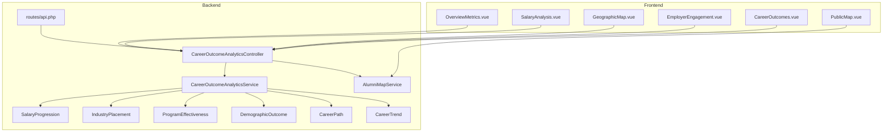
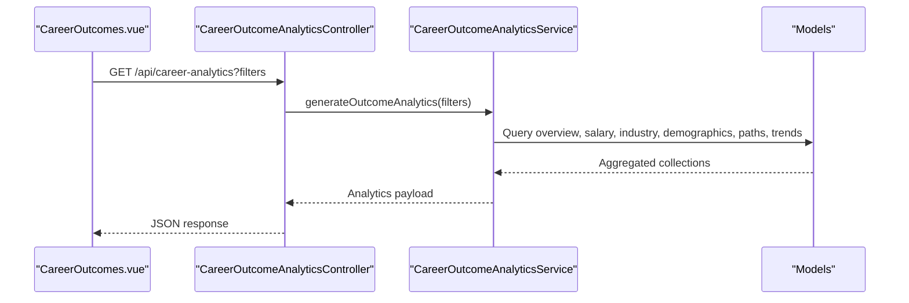
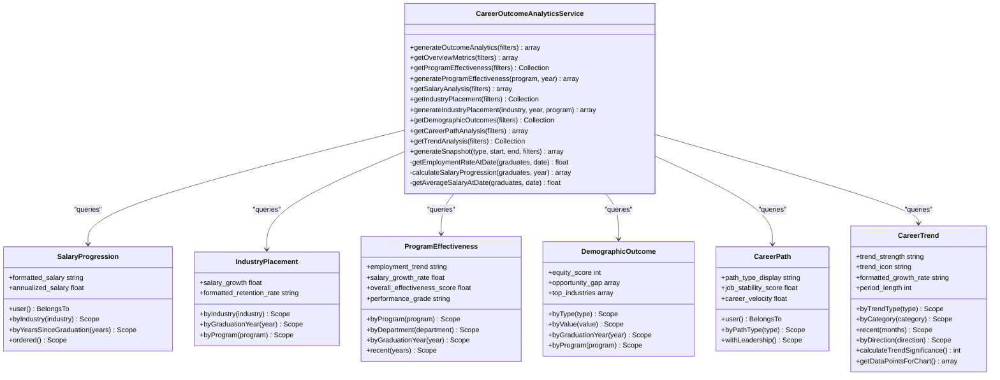
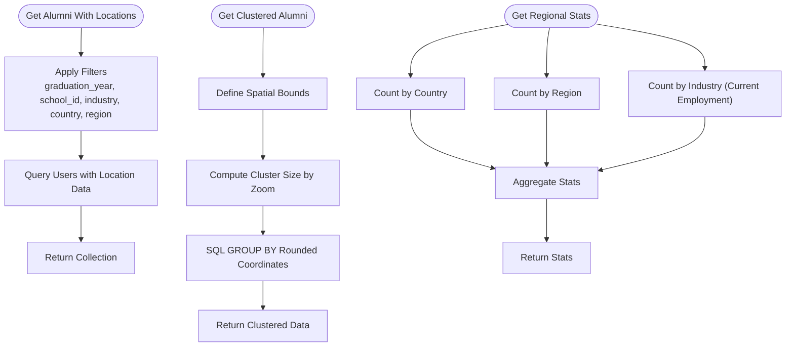
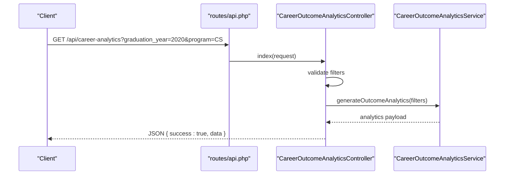
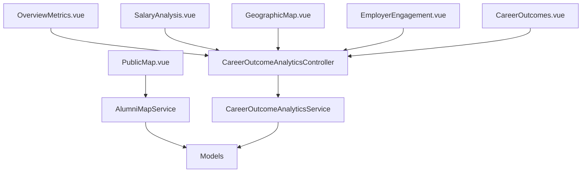
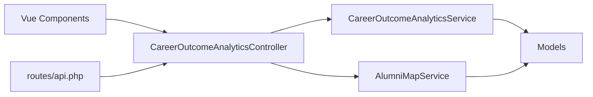

# Employment Analytics & Insights

<cite>
**Referenced Files in This Document**
- [README.md](file://README.md)
- [CareerOutcomeAnalyticsService.php](file://app/Services/CareerOutcomeAnalyticsService.php)
- [AlumniMapService.php](file://app/Services/AlumniMapService.php)
- [CareerOutcomeAnalyticsController.php](file://app/Http/Controllers/Api/CareerOutcomeAnalyticsController.php)
- [api.php](file://routes/api.php)
- [api-reference.md](file://docs/api/api-reference.md)
- [CareerOutcomeAnalyticsTest.php](file://tests/Feature/CareerOutcomeAnalyticsTest.php)
- [AlumniMapServiceTest.php](file://tests/Feature/AlumniMapServiceTest.php)
- [CareerAnalyticsApiTest.php](file://tests/Feature/CareerAnalyticsApiTest.php)
- [SalaryProgression.php](file://app/Models/SalaryProgression.php)
- [IndustryPlacement.php](file://app/Models/IndustryPlacement.php)
- [ProgramEffectiveness.php](file://app/Models/ProgramEffectiveness.php)
- [DemographicOutcome.php](file://app/Models/DemographicOutcome.php)
- [CareerPath.php](file://app/Models/CareerPath.php)
- [CareerTrend.php](file://app/Models/CareerTrend.php)
- [OverviewMetrics.vue](file://resources/js/components/Analytics/OverviewMetrics.vue)
- [SalaryAnalysis.vue](file://resources/js/components/Analytics/SalaryAnalysis.vue)
- [GeographicMap.vue](file://resources/js/components/Analytics/Charts/GeographicMap.vue)
- [PublicMap.vue](file://resources/js/Pages/Alumni/PublicMap.vue)
- [EmployerEngagement.vue](file://resources/js/Pages/InstitutionAdmin/Analytics/EmployerEngagement.vue)
- [CareerOutcomes.vue](file://resources/js/Pages/Analytics/CareerOutcomes.vue)
- [MIGRATION_RESOLUTION_SUMMARY.md](file://docs/MIGRATION_RESOLUTION_SUMMARY.md)
</cite>

## Table of Contents
1. [Introduction](#introduction)
2. [Project Structure](#project-structure)
3. [Core Components](#core-components)
4. [Architecture Overview](#architecture-overview)
5. [Detailed Component Analysis](#detailed-component-analysis)
6. [Dependency Analysis](#dependency-analysis)
7. [Performance Considerations](#performance-considerations)
8. [Troubleshooting Guide](#troubleshooting-guide)
9. [Conclusion](#conclusion)
10. [Appendices](#appendices)

## Introduction
This document describes the employment analytics and insights system designed to track graduate outcomes, analyze salary progression, compute employment rates by course, measure employer engagement, visualize geographic distribution, and support ROI and benchmarking analyses. It consolidates backend services, models, controllers, routes, and frontend dashboards to provide a complete picture of institutional performance and market alignment.

## Project Structure
The analytics system spans backend services and models, API endpoints, and frontend dashboards:
- Backend: Services orchestrate analytics computations; models represent domain entities; controllers expose endpoints; routes define API surface.
- Frontend: Vue components render overview metrics, salary analysis, geographic distribution, and employer engagement dashboards.

**Diagram sources**
- [CareerOutcomeAnalyticsService.php:15-511](file://app/Services/CareerOutcomeAnalyticsService.php#L15-L511)
- [AlumniMapService.php:9-236](file://app/Services/AlumniMapService.php#L9-L236)
- [CareerOutcomeAnalyticsController.php:16-42](file://app/Http/Controllers/Api/CareerOutcomeAnalyticsController.php#L16-L42)
- [api.php:670-686](file://routes/api.php#L670-L686)
- [SalaryProgression.php:9-70](file://app/Models/SalaryProgression.php#L9-L70)
- [IndustryPlacement.php:8-64](file://app/Models/IndustryPlacement.php#L8-L64)
- [ProgramEffectiveness.php:8-145](file://app/Models/ProgramEffectiveness.php#L8-L145)
- [DemographicOutcome.php:8-123](file://app/Models/DemographicOutcome.php#L8-L123)
- [CareerPath.php:9-115](file://app/Models/CareerPath.php#L9-L115)
- [CareerTrend.php:8-175](file://app/Models/CareerTrend.php#L8-L175)
- [OverviewMetrics.vue:1-221](file://resources/js/components/Analytics/OverviewMetrics.vue#L1-L221)
- [SalaryAnalysis.vue:1-145](file://resources/js/components/Analytics/SalaryAnalysis.vue#L1-L145)
- [GeographicMap.vue:1-219](file://resources/js/components/Analytics/Charts/GeographicMap.vue#L1-L219)
- [PublicMap.vue:36-51](file://resources/js/Pages/Alumni/PublicMap.vue#L36-L51)
- [EmployerEngagement.vue:28-116](file://resources/js/Pages/InstitutionAdmin/Analytics/EmployerEngagement.vue#L28-L116)
- [CareerOutcomes.vue:247-303](file://resources/js/Pages/Analytics/CareerOutcomes.vue#L247-L303)

**Section sources**
- [README.md:492-504](file://README.md#L492-L504)
- [MIGRATION_RESOLUTION_SUMMARY.md:44-70](file://docs/MIGRATION_RESOLUTION_SUMMARY.md#L44-L70)

## Core Components
- CareerOutcomeAnalyticsService: Central orchestrator computing overview metrics, program effectiveness, salary analysis, industry placement, demographic outcomes, career paths, and trend analysis. Implements time-to-employment metrics, salary progression analysis, and employment rate calculations by course.
- AlumniMapService: Provides geographic distribution analytics, clustering, and nearby alumni discovery for visualization and regional insights.
- CareerOutcomeAnalyticsController: Exposes REST endpoints for analytics queries, snapshots, and exports.
- Models: SalaryProgression, IndustryPlacement, ProgramEffectiveness, DemographicOutcome, CareerPath, CareerTrend encapsulate data structures and derived metrics.
- Frontend Dashboards: OverviewMetrics, SalaryAnalysis, GeographicMap, PublicMap, EmployerEngagement, and CareerOutcomes pages.

**Section sources**
- [CareerOutcomeAnalyticsService.php:15-511](file://app/Services/CareerOutcomeAnalyticsService.php#L15-L511)
- [AlumniMapService.php:9-236](file://app/Services/AlumniMapService.php#L9-L236)
- [CareerOutcomeAnalyticsController.php:16-42](file://app/Http/Controllers/Api/CareerOutcomeAnalyticsController.php#L16-L42)
- [SalaryProgression.php:9-70](file://app/Models/SalaryProgression.php#L9-L70)
- [IndustryPlacement.php:8-64](file://app/Models/IndustryPlacement.php#L8-L64)
- [ProgramEffectiveness.php:8-145](file://app/Models/ProgramEffectiveness.php#L8-L145)
- [DemographicOutcome.php:8-123](file://app/Models/DemographicOutcome.php#L8-L123)
- [CareerPath.php:9-115](file://app/Models/CareerPath.php#L9-L115)
- [CareerTrend.php:8-175](file://app/Models/CareerTrend.php#L8-L175)
- [OverviewMetrics.vue:1-221](file://resources/js/components/Analytics/OverviewMetrics.vue#L1-L221)
- [SalaryAnalysis.vue:1-145](file://resources/js/components/Analytics/SalaryAnalysis.vue#L1-L145)
- [GeographicMap.vue:1-219](file://resources/js/components/Analytics/Charts/GeographicMap.vue#L1-L219)
- [PublicMap.vue:36-51](file://resources/js/Pages/Alumni/PublicMap.vue#L36-L51)
- [EmployerEngagement.vue:28-116](file://resources/js/Pages/InstitutionAdmin/Analytics/EmployerEngagement.vue#L28-L116)
- [CareerOutcomes.vue:247-303](file://resources/js/Pages/Analytics/CareerOutcomes.vue#L247-L303)

## Architecture Overview
The system follows a layered architecture:
- Presentation: Vue pages and components consume analytics via API endpoints.
- API: Laravel controller validates filters and delegates to analytics service.
- Service: Computes aggregates and derived metrics from models.
- Persistence: Eloquent models and database tables store raw and aggregated data.

**Diagram sources**
- [CareerOutcomes.vue:247-303](file://resources/js/Pages/Analytics/CareerOutcomes.vue#L247-L303)
- [CareerOutcomeAnalyticsController.php:25-42](file://app/Http/Controllers/Api/CareerOutcomeAnalyticsController.php#L25-L42)
- [CareerOutcomeAnalyticsService.php:20-31](file://app/Services/CareerOutcomeAnalyticsService.php#L20-L31)

**Section sources**
- [api.php:670-686](file://routes/api.php#L670-L686)
- [api-reference.md:316-354](file://docs/api/api-reference.md#L316-L354)

## Detailed Component Analysis

### Career Outcome Analytics Service
Responsibilities:
- Compute overview metrics: total alumni, employment rate, average salary, tracking rate, top industries, top employers, geographic distribution.
- Program effectiveness: employment rates at 6 months/1 year/2 years, average salaries, top employers, skills gaps.
- Salary analysis: overall statistics, progression by years, industry comparison, percentiles, growth trends.
- Industry placement: placement counts, starting/current salaries, retention, top companies, skills in demand.
- Demographic outcomes: employment, salary, leadership, entrepreneurship rates, industry distribution.
- Career paths: distribution, success metrics, progression patterns, leadership development.
- Trend analysis: direction, strength, formatted growth rate, significance, chart-ready data points.
- Snapshot generation: period-based metrics with filters.

Implementation highlights:
- Filters applied across education histories, career timelines, and salary progressions.
- Time-to-employment computed by checking employment presence at specific dates after graduation.
- Salary progression computed by latest effective salary per user up to a given date.
- Derived metrics include equity scores, performance grades, and growth rates.

**Diagram sources**
- [CareerOutcomeAnalyticsService.php:15-511](file://app/Services/CareerOutcomeAnalyticsService.php#L15-L511)
- [SalaryProgression.php:9-70](file://app/Models/SalaryProgression.php#L9-L70)
- [IndustryPlacement.php:8-64](file://app/Models/IndustryPlacement.php#L8-L64)
- [ProgramEffectiveness.php:8-145](file://app/Models/ProgramEffectiveness.php#L8-L145)
- [DemographicOutcome.php:8-123](file://app/Models/DemographicOutcome.php#L8-L123)
- [CareerPath.php:9-115](file://app/Models/CareerPath.php#L9-L115)
- [CareerTrend.php:8-175](file://app/Models/CareerTrend.php#L8-L175)

**Section sources**
- [CareerOutcomeAnalyticsService.php:20-339](file://app/Services/CareerOutcomeAnalyticsService.php#L20-L339)

### Alumni Map Service
Responsibilities:
- Retrieve alumni with location data, applying filters by graduation year, school, industry, country, and region.
- Provide clustered alumni data for map rendering using SQL grouping and zoom-aware cluster sizes.
- Compute regional statistics: by country, by region, by industry, and total alumni with location data.
- Support nearby alumni discovery using a distance formula and privacy-aware filtering.
- Update location privacy settings and placeholder geocoding integration.

**Diagram sources**
- [AlumniMapService.php:14-236](file://app/Services/AlumniMapService.php#L14-L236)

**Section sources**
- [AlumniMapService.php:14-236](file://app/Services/AlumniMapService.php#L14-L236)

### API Endpoints and Controllers
Endpoints:
- GET /api/career-analytics
- GET /api/career-analytics/overview
- GET /api/career-analytics/program-effectiveness
- POST /api/career-analytics/program-effectiveness/generate
- GET /api/career-analytics/salary-analysis
- GET /api/career-analytics/industry-placement
- POST /api/career-analytics/industry-placement/generate
- GET /api/career-analytics/demographic-outcomes
- GET /api/career-analytics/career-path-analysis
- GET /api/career-analytics/trend-analysis
- POST /api/career-analytics/generate-snapshot
- GET /api/career-analytics/snapshots
- GET /api/career-analytics/filter-options
- POST /api/career-analytics/export

Controller responsibilities:
- Validate filters from requests.
- Delegate to analytics service to build comprehensive analytics payload.
- Return standardized JSON responses.

**Diagram sources**
- [api.php:670-686](file://routes/api.php#L670-L686)
- [CareerOutcomeAnalyticsController.php:25-42](file://app/Http/Controllers/Api/CareerOutcomeAnalyticsController.php#L25-L42)
- [CareerOutcomeAnalyticsService.php:20-31](file://app/Services/CareerOutcomeAnalyticsService.php#L20-L31)

**Section sources**
- [api.php:670-686](file://routes/api.php#L670-L686)
- [CareerOutcomeAnalyticsController.php:16-42](file://app/Http/Controllers/Api/CareerOutcomeAnalyticsController.php#L16-L42)
- [api-reference.md:316-354](file://docs/api/api-reference.md#L316-L354)

### Frontend Dashboards and Visualizations
- OverviewMetrics.vue: Displays total alumni, employment rate, average salary, tracking rate, plus top industries, top employers, and geographic distribution bars.
- SalaryAnalysis.vue: Shows overall metrics, salary distribution ranges, experience-level breakdowns, progression timeline, and regional comparisons.
- GeographicMap.vue: Offers list and map view modes for location distribution with summary stats.
- PublicMap.vue: Presents global alumni distribution visualization placeholders.
- EmployerEngagement.vue: Shows top engaging employers, jobs posted, hires, and hiring trends by industry for institutional admins.
- CareerOutcomes.vue: Loads analytics via API with filter parameters and supports export.

**Diagram sources**
- [OverviewMetrics.vue:1-221](file://resources/js/components/Analytics/OverviewMetrics.vue#L1-L221)
- [SalaryAnalysis.vue:1-145](file://resources/js/components/Analytics/SalaryAnalysis.vue#L1-L145)
- [GeographicMap.vue:1-219](file://resources/js/components/Analytics/Charts/GeographicMap.vue#L1-L219)
- [PublicMap.vue:36-51](file://resources/js/Pages/Alumni/PublicMap.vue#L36-L51)
- [EmployerEngagement.vue:28-116](file://resources/js/Pages/InstitutionAdmin/Analytics/EmployerEngagement.vue#L28-L116)
- [CareerOutcomes.vue:247-303](file://resources/js/Pages/Analytics/CareerOutcomes.vue#L247-L303)
- [CareerOutcomeAnalyticsController.php:16-42](file://app/Http/Controllers/Api/CareerOutcomeAnalyticsController.php#L16-L42)
- [AlumniMapService.php:9-236](file://app/Services/AlumniMapService.php#L9-L236)

**Section sources**
- [OverviewMetrics.vue:1-221](file://resources/js/components/Analytics/OverviewMetrics.vue#L1-L221)
- [SalaryAnalysis.vue:1-145](file://resources/js/components/Analytics/SalaryAnalysis.vue#L1-L145)
- [GeographicMap.vue:1-219](file://resources/js/components/Analytics/Charts/GeographicMap.vue#L1-L219)
- [PublicMap.vue:36-51](file://resources/js/Pages/Alumni/PublicMap.vue#L36-L51)
- [EmployerEngagement.vue:28-116](file://resources/js/Pages/InstitutionAdmin/Analytics/EmployerEngagement.vue#L28-L116)
- [CareerOutcomes.vue:247-303](file://resources/js/Pages/Analytics/CareerOutcomes.vue#L247-L303)

## Dependency Analysis
- Controllers depend on CareerOutcomeAnalyticsService and AlumniMapService.
- Services depend on Eloquent models for data retrieval and aggregation.
- Frontend components depend on API endpoints for data fetching.
- Routes define the contract for analytics exposure.

**Diagram sources**
- [CareerOutcomeAnalyticsController.php:16-42](file://app/Http/Controllers/Api/CareerOutcomeAnalyticsController.php#L16-L42)
- [CareerOutcomeAnalyticsService.php:15-511](file://app/Services/CareerOutcomeAnalyticsService.php#L15-L511)
- [AlumniMapService.php:9-236](file://app/Services/AlumniMapService.php#L9-L236)
- [api.php:670-686](file://routes/api.php#L670-L686)

**Section sources**
- [CareerOutcomeAnalyticsController.php:16-42](file://app/Http/Controllers/Api/CareerOutcomeAnalyticsController.php#L16-L42)
- [CareerOutcomeAnalyticsService.php:15-511](file://app/Services/CareerOutcomeAnalyticsService.php#L15-L511)
- [AlumniMapService.php:9-236](file://app/Services/AlumniMapService.php#L9-L236)
- [api.php:670-686](file://routes/api.php#L670-L686)

## Performance Considerations
- Use filtered queries and scopes to limit dataset size early.
- Aggregate data at the database layer (GROUP BY, COUNT, AVG) to reduce PHP processing overhead.
- Implement clustering for map rendering to avoid heavy client-side computations.
- Cache frequently accessed snapshots and program effectiveness results.
- Paginate long lists in dashboards to improve responsiveness.
- Index columns used in filters (graduation_year, program, industry, effective_date).

## Troubleshooting Guide
Common issues and resolutions:
- Empty analytics responses: Verify filters and ensure data exists for selected periods/programs.
- Missing salary data: Confirm SalaryProgression records exist and are recent; check effective_date boundaries.
- Geographic map shows no data: Ensure users have non-private location data and coordinates.
- Export failures: Validate export endpoint payload and CSRF token handling in frontend.
- Performance bottlenecks: Review query plans for grouped aggregations and consider adding appropriate indexes.

**Section sources**
- [CareerOutcomeAnalyticsTest.php:1-133](file://tests/Feature/CareerOutcomeAnalyticsTest.php#L1-L133)
- [AlumniMapServiceTest.php:129-212](file://tests/Feature/AlumniMapServiceTest.php#L129-L212)
- [CareerAnalyticsApiTest.php:84-132](file://tests/Feature/CareerAnalyticsApiTest.php#L84-L132)

## Conclusion
The employment analytics and insights system integrates robust backend services, models, and API endpoints with intuitive frontend dashboards. It enables comprehensive tracking of time-to-employment, salary progression, employment rates by course, employer engagement, geographic distribution, and trend analysis. With proper indexing, caching, and modular design, the system scales to support institutional reporting and strategic decision-making.

## Appendices

### Data Sources and Calculation Methodologies
- Time-to-employment metrics: Employment presence at specific dates after graduation using career timelines.
- Salary progression analysis: Latest annualized salary per user up to a given date, grouped by user.
- Employment rate calculations by course: Filters applied to education histories and career timelines to compute percentages.
- Employer engagement metrics: Aggregations of jobs posted and hires by employer; hiring trends by industry.
- Geographic distribution: Counts by location with privacy-aware filtering; clustering for map performance.
- Program effectiveness: Composite scoring combining employment rates, salary growth, job satisfaction, and engagement.
- Trend analysis: Direction, strength, and significance derived from time-series trend data.

**Section sources**
- [CareerOutcomeAnalyticsService.php:459-510](file://app/Services/CareerOutcomeAnalyticsService.php#L459-L510)
- [SalaryProgression.php:55-68](file://app/Models/SalaryProgression.php#L55-L68)
- [ProgramEffectiveness.php:66-125](file://app/Models/ProgramEffectiveness.php#L66-L125)
- [CareerTrend.php:69-152](file://app/Models/CareerTrend.php#L69-L152)
- [AlumniMapService.php:101-170](file://app/Services/AlumniMapService.php#L101-L170)

### Visualization Approaches
- Overview: Cards for key metrics, bar charts for top industries/employers/geographic distribution.
- Salary: Distribution ranges, experience-level breakdowns, progression timelines, regional comparisons.
- Geography: List view for sortable locations; map view placeholder for interactive mapping libraries.
- Employer engagement: Tables for top engaging employers and hiring trends by industry.
- Dashboards: Filtered loading via API with export capability.

**Section sources**
- [OverviewMetrics.vue:1-221](file://resources/js/components/Analytics/OverviewMetrics.vue#L1-L221)
- [SalaryAnalysis.vue:1-145](file://resources/js/components/Analytics/SalaryAnalysis.vue#L1-L145)
- [GeographicMap.vue:1-219](file://resources/js/components/Analytics/Charts/GeographicMap.vue#L1-L219)
- [EmployerEngagement.vue:28-116](file://resources/js/Pages/InstitutionAdmin/Analytics/EmployerEngagement.vue#L28-L116)
- [CareerOutcomes.vue:247-303](file://resources/js/Pages/Analytics/CareerOutcomes.vue#L247-L303)