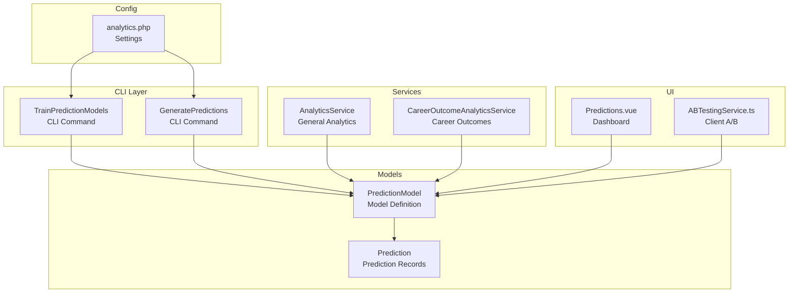
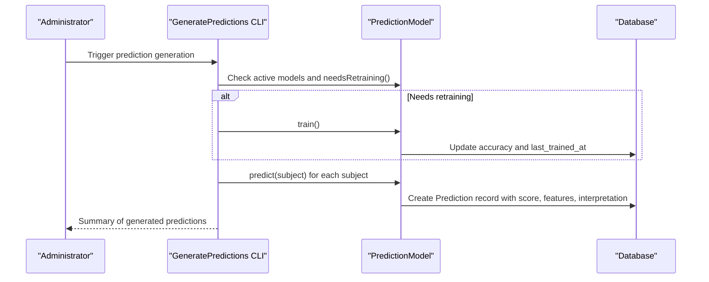
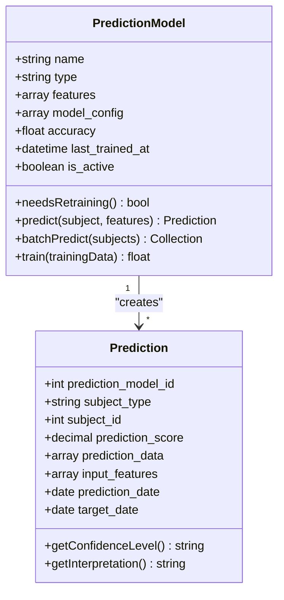
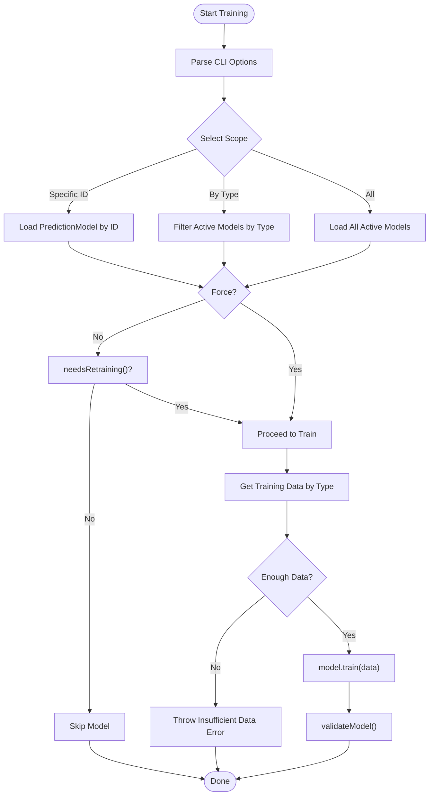
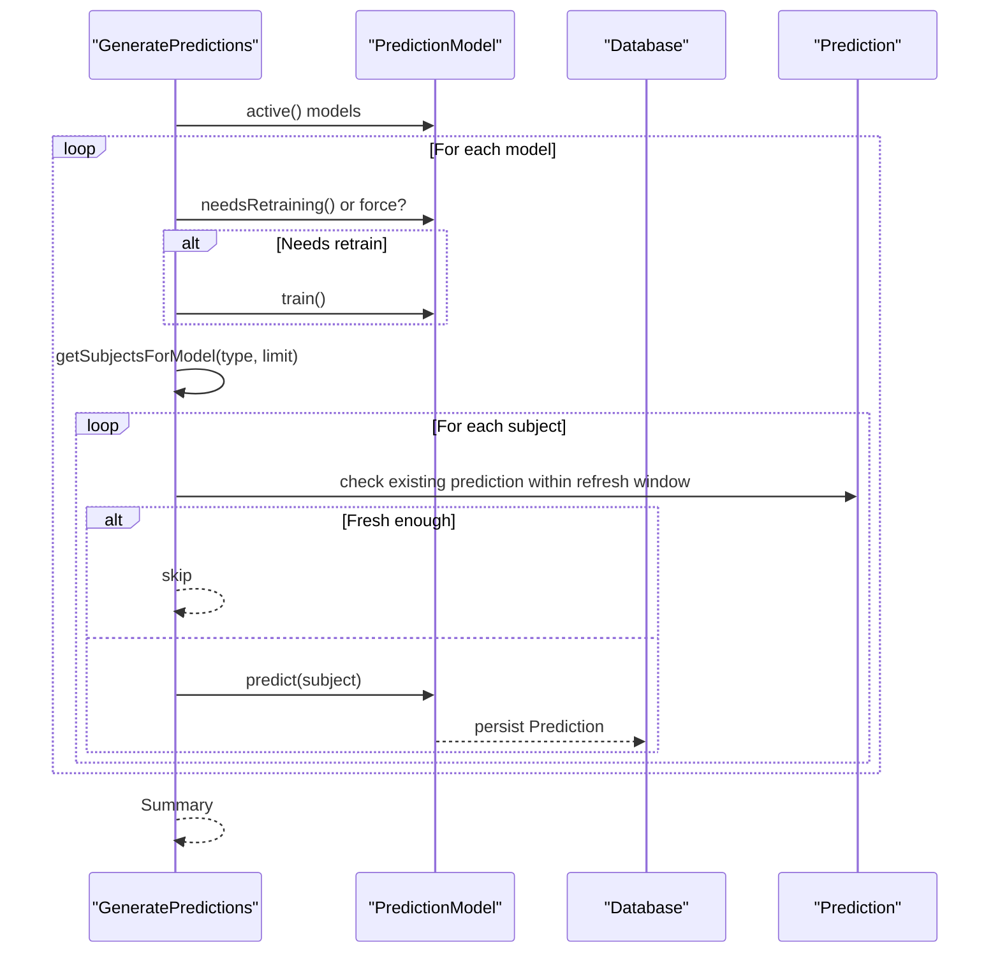
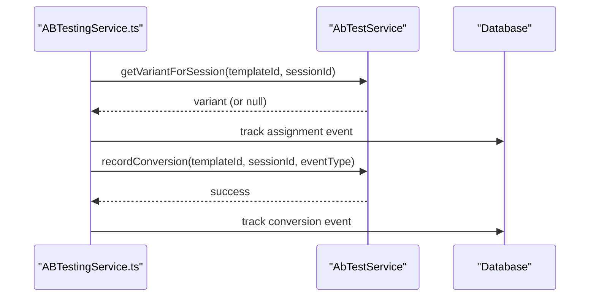
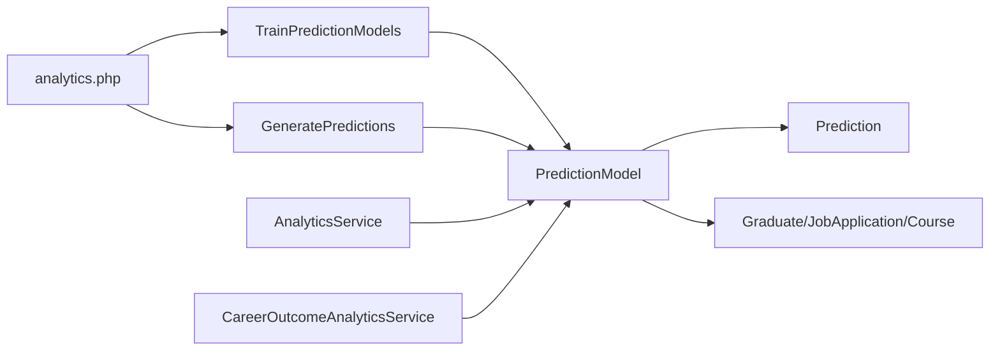

# Predictive Analytics & Modeling

<cite>
**Referenced Files in This Document**
- [TrainPredictionModels.php](file://app/Console/Commands/TrainPredictionModels.php)
- [GeneratePredictions.php](file://app/Console/Commands/GeneratePredictions.php)
- [Prediction.php](file://app/Models/Prediction.php)
- [PredictionModel.php](file://app/Models/PredictionModel.php)
- [analytics.php](file://config/analytics.php)
- [AnalyticsService.php](file://app/Services/AnalyticsService.php)
- [CareerOutcomeAnalyticsService.php](file://app/Services/CareerOutcomeAnalyticsService.php)
- [AbTest.php](file://app/Models/ABTest.php)
- [AbTestService.php](file://app/Services/AbTestService.php)
- [Predictions.vue](file://resources/js/Pages/Analytics/Predictions.vue)
- [ABTestingService.ts](file://resources/js/services/ABTestingService.ts)
</cite>

## Table of Contents
1. [Introduction](#introduction)
2. [Project Structure](#project-structure)
3. [Core Components](#core-components)
4. [Architecture Overview](#architecture-overview)
5. [Detailed Component Analysis](#detailed-component-analysis)
6. [Dependency Analysis](#dependency-analysis)
7. [Performance Considerations](#performance-considerations)
8. [Troubleshooting Guide](#troubleshooting-guide)
9. [Conclusion](#conclusion)
10. [Appendices](#appendices)

## Introduction
This document describes the predictive analytics and modeling system for job placement probability, career path recommendations, and market demand forecasting. It explains how models are trained, validated, and deployed, along with algorithm selection criteria, feature engineering, and performance metrics. It also documents model versioning, A/B testing frameworks, and real-time prediction serving, and provides examples of predictive dashboard visualizations and model interpretation techniques used by stakeholders.

## Project Structure
The predictive analytics system is centered around:
- CLI commands for training and generating predictions
- Eloquent models for storing predictions and model metadata
- Configuration for analytics behavior and thresholds
- Services for career outcome analytics and general analytics
- Frontend dashboards for visualization and A/B testing client-side integration

**Diagram sources**
- [TrainPredictionModels.php:1-436](file://app/Console/Commands/TrainPredictionModels.php#L1-L436)
- [GeneratePredictions.php:1-161](file://app/Console/Commands/GeneratePredictions.php#L1-L161)
- [PredictionModel.php:1-380](file://app/Models/PredictionModel.php#L1-L380)
- [Prediction.php:1-239](file://app/Models/Prediction.php#L1-L239)
- [AnalyticsService.php:1-1210](file://app/Services/AnalyticsService.php#L1-L1210)
- [CareerOutcomeAnalyticsService.php:1-511](file://app/Services/CareerOutcomeAnalyticsService.php#L1-L511)
- [analytics.php:1-242](file://config/analytics.php#L1-L242)
- [Predictions.vue:50-69](file://resources/js/Pages/Analytics/Predictions.vue#L50-L69)
- [ABTestingService.ts:358-420](file://resources/js/services/ABTestingService.ts#L358-L420)

**Section sources**
- [TrainPredictionModels.php:1-436](file://app/Console/Commands/TrainPredictionModels.php#L1-L436)
- [GeneratePredictions.php:1-161](file://app/Console/Commands/GeneratePredictions.php#L1-L161)
- [PredictionModel.php:1-380](file://app/Models/PredictionModel.php#L1-L380)
- [Prediction.php:1-239](file://app/Models/Prediction.php#L1-L239)
- [AnalyticsService.php:1-1210](file://app/Services/AnalyticsService.php#L1-L1210)
- [CareerOutcomeAnalyticsService.php:1-511](file://app/Services/CareerOutcomeAnalyticsService.php#L1-L511)
- [analytics.php:1-242](file://config/analytics.php#L1-L242)
- [Predictions.vue:50-69](file://resources/js/Pages/Analytics/Predictions.vue#L50-L69)
- [ABTestingService.ts:358-420](file://resources/js/services/ABTestingService.ts#L358-L420)

## Core Components
- PredictionModel: Defines model types, features, configuration, training, and prediction generation. Includes scoring, feature extraction, and training data retrieval.
- Prediction: Stores prediction results, input features, confidence, and interpretation metadata.
- CLI Commands: TrainPredictionModels and GeneratePredictions orchestrate training and prediction generation with progress, validation, and error handling.
- Analytics Configuration: Centralized settings for predictions, snapshots, caching, and dashboard defaults.
- Analytics Services: CareerOutcomeAnalyticsService and AnalyticsService provide career outcome metrics and general analytics functions.
- A/B Testing: Backend models and services manage template A/B tests; frontend integrates via ABTestingService.ts.

**Section sources**
- [PredictionModel.php:1-380](file://app/Models/PredictionModel.php#L1-L380)
- [Prediction.php:1-239](file://app/Models/Prediction.php#L1-L239)
- [TrainPredictionModels.php:1-436](file://app/Console/Commands/TrainPredictionModels.php#L1-L436)
- [GeneratePredictions.php:1-161](file://app/Console/Commands/GeneratePredictions.php#L1-L161)
- [analytics.php:1-242](file://config/analytics.php#L1-L242)
- [CareerOutcomeAnalyticsService.php:1-511](file://app/Services/CareerOutcomeAnalyticsService.php#L1-L511)
- [AnalyticsService.php:1-1210](file://app/Services/AnalyticsService.php#L1-L1210)
- [AbTest.php:1-40](file://app/Models/ABTest.php#L1-L40)
- [AbTestService.php:1-311](file://app/Services/AbTestService.php#L1-L311)

## Architecture Overview
The system follows a command-driven training pipeline and a model-driven prediction pipeline:
- Training pipeline: CLI command reads configuration, collects training data by model type, validates minimum data thresholds, trains the model, and performs validation.
- Prediction pipeline: CLI command retrieves subjects, checks freshness, generates predictions, and persists them with confidence and interpretation metadata.
- Visualization: Dashboard displays model summaries, recent predictions, and metadata.

**Diagram sources**
- [GeneratePredictions.php:20-116](file://app/Console/Commands/GeneratePredictions.php#L20-L116)
- [PredictionModel.php:71-126](file://app/Models/PredictionModel.php#L71-L126)
- [Prediction.php:34-92](file://app/Models/Prediction.php#L34-L92)

**Section sources**
- [GeneratePredictions.php:1-161](file://app/Console/Commands/GeneratePredictions.php#L1-L161)
- [PredictionModel.php:1-380](file://app/Models/PredictionModel.php#L1-L380)
- [Prediction.php:1-239](file://app/Models/Prediction.php#L1-L239)

## Detailed Component Analysis

### PredictionModel: Model Definition, Training, and Scoring
- Responsibilities:
  - Define model types (job_placement, employment_success, course_demand).
  - Manage features, weights, horizon, and retraining interval via model_config.
  - Extract features from subjects and compute prediction scores.
  - Generate prediction metadata including key factors, recommendations, and risk factors.
  - Train models and update accuracy and last_trained_at.
- Algorithm selection criteria:
  - Uses weighted linear scoring normalized to [0,1].
  - Configurable feature weights and max score per model.
- Feature engineering:
  - Graduates: graduation year, course employment rate, GPA, skills count, certifications count, profile completion.
  - Applications: application counts, interview counts, skills match score, profile completion, course employment rate, application timing.
  - Courses: historical enrollment, employment rate, job postings trend, industry growth rate, salary trends, skills demand.
- Performance metrics:
  - Accuracy stored in model and surfaced as formatted percentage.
  - Retraining triggered based on configured interval.

**Diagram sources**
- [PredictionModel.php:9-36](file://app/Models/PredictionModel.php#L9-L36)
- [Prediction.php:11-43](file://app/Models/Prediction.php#L11-L43)

**Section sources**
- [PredictionModel.php:1-380](file://app/Models/PredictionModel.php#L1-L380)
- [Prediction.php:1-239](file://app/Models/Prediction.php#L1-L239)

### Training Pipeline: TrainPredictionModels
- Responsibilities:
  - Train specific models, by type, or all active models.
  - Enforce minimum training data thresholds from configuration.
  - Collect training data by model type (job placement, employment success, course demand).
  - Extract features and outcomes, validate model, and log progress.
- Validation:
  - Generates sample predictions against subjects and ensures valid scores.

**Diagram sources**
- [TrainPredictionModels.php:17-168](file://app/Console/Commands/TrainPredictionModels.php#L17-L168)

**Section sources**
- [TrainPredictionModels.php:1-436](file://app/Console/Commands/TrainPredictionModels.php#L1-L436)

### Prediction Generation Pipeline: GeneratePredictions
- Responsibilities:
  - Retrieve active models optionally filtered by type.
  - Retrain models if needed or forced.
  - Fetch subjects for each model type and generate predictions.
  - Avoid regenerating predictions within refresh windows.
- Subjects:
  - Job placement: recent unemployed graduates ordered by graduation date.
  - Employment success: recent job applications with pending statuses.
  - Course demand: active courses ordered by graduate count.

**Diagram sources**
- [GeneratePredictions.php:20-116](file://app/Console/Commands/GeneratePredictions.php#L20-L116)
- [PredictionModel.php:71-108](file://app/Models/PredictionModel.php#L71-L108)
- [Prediction.php:34-92](file://app/Models/Prediction.php#L34-L92)

**Section sources**
- [GeneratePredictions.php:1-161](file://app/Console/Commands/GeneratePredictions.php#L1-L161)

### Model Interpretation and Confidence
- Prediction records include confidence levels mapped to color-coded labels and human-readable interpretations per model type.
- Provides top key factors, recommendations, and risk factors derived from input features and weights.

**Section sources**
- [Prediction.php:79-238](file://app/Models/Prediction.php#L79-L238)
- [PredictionModel.php:174-241](file://app/Models/PredictionModel.php#L174-L241)

### Career Outcome Analytics and Market Insights
- CareerOutcomeAnalyticsService aggregates employment rates, salary progression, industry placement, and demographic outcomes.
- AnalyticsService provides engagement metrics, platform usage, community health, and benchmarks across institutions.

**Section sources**
- [CareerOutcomeAnalyticsService.php:1-511](file://app/Services/CareerOutcomeAnalyticsService.php#L1-L511)
- [AnalyticsService.php:1-1210](file://app/Services/AnalyticsService.php#L1-L1210)

### A/B Testing Framework
- Backend:
  - ABTest model stores variants, distribution, and lifecycle.
  - AbTestService manages creation, activation, recording events, and computing results.
- Frontend:
  - ABTestingService.ts handles assignment hashing, conversion tracking, and session persistence.

**Diagram sources**
- [AbTest.php:8-39](file://app/Models/ABTest.php#L8-L39)
- [AbTestService.php:127-167](file://app/Services/AbTestService.php#L127-L167)
- [ABTestingService.ts:369-410](file://resources/js/services/ABTestingService.ts#L369-L410)

**Section sources**
- [AbTest.php:1-40](file://app/Models/ABTest.php#L1-L40)
- [AbTestService.php:1-311](file://app/Services/AbTestService.php#L1-L311)
- [ABTestingService.ts:358-420](file://resources/js/services/ABTestingService.ts#L358-L420)

### Predictive Dashboard Visualization
- Predictions.vue displays model cards with last trained date, recent predictions count, and links to detailed views.
- Dashboard widgets include recent predictions and overview metrics.

**Section sources**
- [Predictions.vue:50-69](file://resources/js/Pages/Analytics/Predictions.vue#L50-L69)

## Dependency Analysis
- PredictionModel depends on:
  - Configuration for thresholds and horizons.
  - Subject models (Graduate, JobApplication, Course) for training data.
  - Prediction for persistence and interpretation.
- CLI commands orchestrate PredictionModel and enforce configuration-driven policies.
- Services provide complementary analytics and career outcome insights.

**Diagram sources**
- [analytics.php:81-87](file://config/analytics.php#L81-L87)
- [TrainPredictionModels.php:170-178](file://app/Console/Commands/TrainPredictionModels.php#L170-L178)
- [GeneratePredictions.php:118-126](file://app/Console/Commands/GeneratePredictions.php#L118-L126)
- [PredictionModel.php:250-305](file://app/Models/PredictionModel.php#L250-L305)
- [AnalyticsService.php:1-1210](file://app/Services/AnalyticsService.php#L1-L1210)
- [CareerOutcomeAnalyticsService.php:1-511](file://app/Services/CareerOutcomeAnalyticsService.php#L1-L511)

**Section sources**
- [analytics.php:1-242](file://config/analytics.php#L1-L242)
- [TrainPredictionModels.php:1-436](file://app/Console/Commands/TrainPredictionModels.php#L1-L436)
- [GeneratePredictions.php:1-161](file://app/Console/Commands/GeneratePredictions.php#L1-L161)
- [PredictionModel.php:1-380](file://app/Models/PredictionModel.php#L1-L380)
- [Prediction.php:1-239](file://app/Models/Prediction.php#L1-L239)
- [AnalyticsService.php:1-1210](file://app/Services/AnalyticsService.php#L1-L1210)
- [CareerOutcomeAnalyticsService.php:1-511](file://app/Services/CareerOutcomeAnalyticsService.php#L1-L511)

## Performance Considerations
- Caching: General analytics leverage caching for computed metrics and snapshots.
- Batch operations: CLI commands support batch prediction generation with progress bars.
- Thresholds: Minimum training data and retraining intervals prevent unnecessary computations.
- Parallelization: Configuration supports parallel processing flags for analytics workloads.

**Section sources**
- [analytics.php:22-26](file://config/analytics.php#L22-L26)
- [analytics.php:154-159](file://config/analytics.php#L154-L159)
- [TrainPredictionModels.php:150-153](file://app/Console/Commands/TrainPredictionModels.php#L150-L153)
- [GeneratePredictions.php:78-106](file://app/Console/Commands/GeneratePredictions.php#L78-L106)

## Troubleshooting Guide
- Training failures:
  - Insufficient training data triggers exceptions; ensure adequate historical records.
  - Model validation failures indicate invalid prediction generation; review feature extraction and weights.
- Prediction errors:
  - Existing fresh predictions are skipped; adjust refresh windows or force regeneration.
  - Model not active throws exceptions during prediction; activate the model or retrain.
- A/B testing:
  - Missing active tests return null variants; ensure tests are started and cached.
  - Conversion tracking requires active tests and valid sessions.

**Section sources**
- [TrainPredictionModels.php:146-153](file://app/Console/Commands/TrainPredictionModels.php#L146-L153)
- [TrainPredictionModels.php:386-424](file://app/Console/Commands/TrainPredictionModels.php#L386-L424)
- [GeneratePredictions.php:84-103](file://app/Console/Commands/GeneratePredictions.php#L84-L103)
- [PredictionModel.php:73-75](file://app/Models/PredictionModel.php#L73-L75)
- [AbTestService.php:127-143](file://app/Services/AbTestService.php#L127-L143)

## Conclusion
The predictive analytics system provides a robust framework for training, validating, and deploying models that estimate job placement probability, employment success, and course demand. It integrates configuration-driven policies, feature engineering, interpretation metadata, and visualization-ready outputs. A/B testing and analytics services complement the system by enabling experimentation and broader insights into user engagement and outcomes.

## Appendices

### Configuration Reference: Predictive Analytics
- Predictions enabled, auto-retrain, schedule, minimum training data, and prediction horizon are configurable.
- Cache and snapshot settings support performance and historical tracking.

**Section sources**
- [analytics.php:81-87](file://config/analytics.php#L81-L87)
- [analytics.php:22-44](file://config/analytics.php#L22-L44)

### Salary Prediction Models
- Current implementation focuses on weighted scoring and interpretation metadata.
- Historical salary progression is available via dedicated services for outcome analysis.

**Section sources**
- [PredictionModel.php:155-172](file://app/Models/PredictionModel.php#L155-L172)
- [CareerOutcomeAnalyticsService.php:152-171](file://app/Services/CareerOutcomeAnalyticsService.php#L152-L171)

### Course Success Indicators
- Course demand predictions use job postings count and related features.
- Employment success predictors leverage application and profile metrics.

**Section sources**
- [TrainPredictionModels.php:218-234](file://app/Console/Commands/TrainPredictionModels.php#L218-L234)
- [PredictionModel.php:290-305](file://app/Models/PredictionModel.php#L290-L305)

### Model Versioning and Retraining
- Retraining interval controlled by model_config; last_trained_at updated after training.
- Accuracy stored and formatted for display.

**Section sources**
- [PredictionModel.php:50-59](file://app/Models/PredictionModel.php#L50-L59)
- [PredictionModel.php:120-126](file://app/Models/PredictionModel.php#L120-L126)
- [Prediction.php:169-177](file://app/Models/Prediction.php#L169-L177)

### Real-time Prediction Serving
- Predictions are persisted with target dates and confidence metadata for downstream consumption.
- Dashboard components render recent predictions and interpret scores.

**Section sources**
- [Prediction.php:89-157](file://app/Models/Prediction.php#L89-L157)
- [Predictions.vue:50-69](file://resources/js/Pages/Analytics/Predictions.vue#L50-L69)