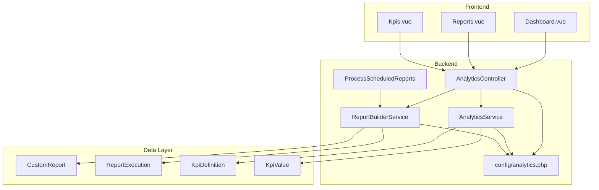
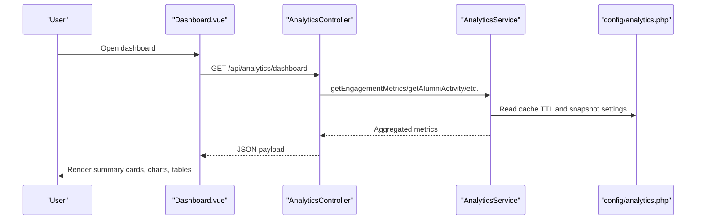
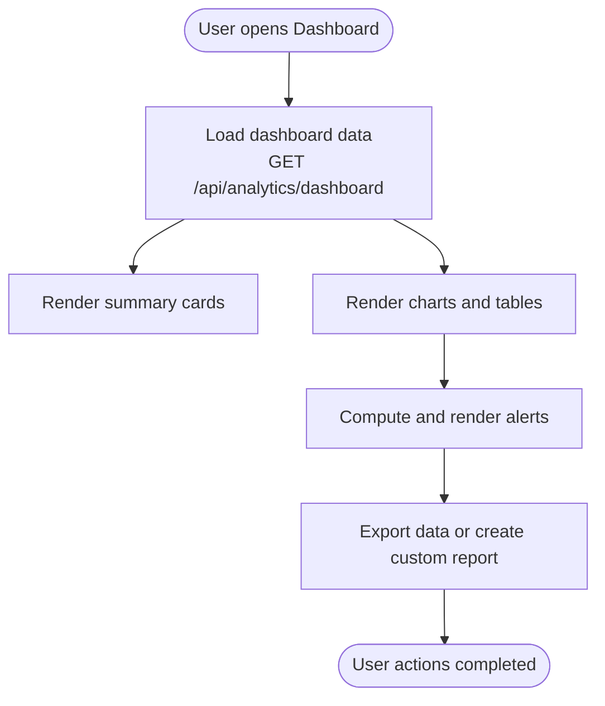
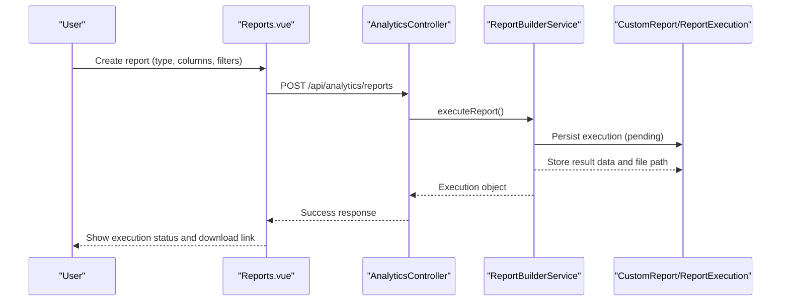
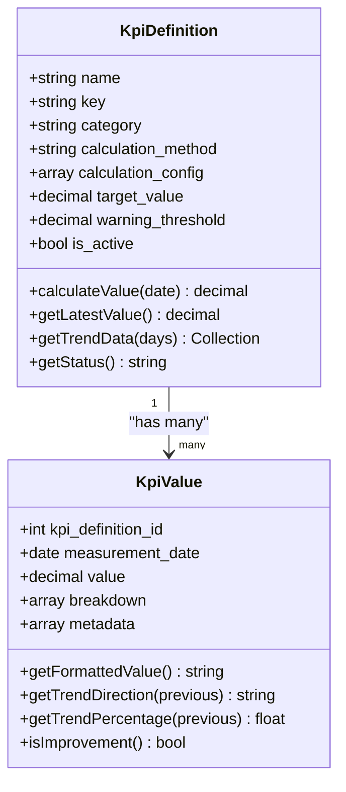
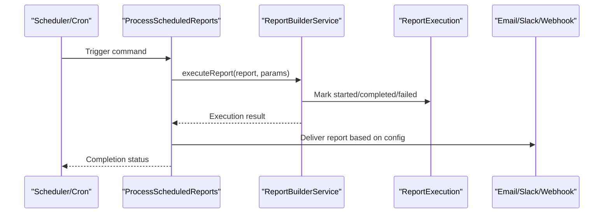
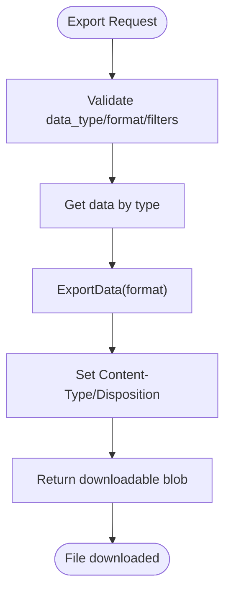
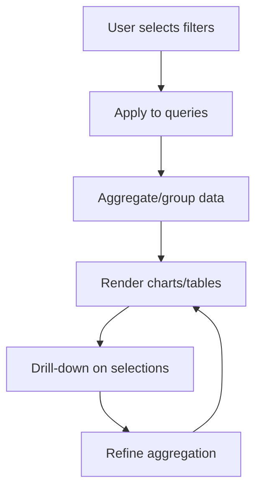
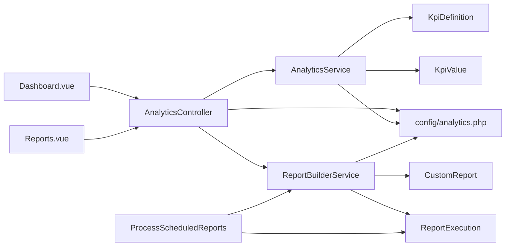

# Reporting & Dashboard Systems

<cite>
**Referenced Files in This Document**
- [AnalyticsService.php](file://app/Services/AnalyticsService.php)
- [ReportBuilderService.php](file://app/Services/ReportBuilderService.php)
- [ProcessScheduledReports.php](file://app/Console/Commands/ProcessScheduledReports.php)
- [AnalyticsController.php](file://app/Http/Controllers/Api/AnalyticsController.php)
- [CustomReport.php](file://app/Models/CustomReport.php)
- [KpiDefinition.php](file://app/Models/KpiDefinition.php)
- [KpiValue.php](file://app/Models/KpiValue.php)
- [ReportExecution.php](file://app/Models/ReportExecution.php)
- [analytics.php](file://config/analytics.php)
- [Dashboard.vue](file://resources/js/Pages/Analytics/Dashboard.vue)
- [Reports.vue](file://resources/js/Pages/Analytics/Reports.vue)
- [Kpis.vue](file://resources/js/Pages/Analytics/Kpis.vue)
- [task-13-analytics-reporting-system-recap.md](file://docs/task-13-analytics-reporting-system-recap.md)
- [AnalyticsSystemTest.php](file://tests/Feature/AnalyticsSystemTest.php)
</cite>

## Table of Contents
1. [Introduction](#introduction)
2. [Project Structure](#project-structure)
3. [Core Components](#core-components)
4. [Architecture Overview](#architecture-overview)
5. [Detailed Component Analysis](#detailed-component-analysis)
6. [Dependency Analysis](#dependency-analysis)
7. [Performance Considerations](#performance-considerations)
8. [Troubleshooting Guide](#troubleshooting-guide)
9. [Conclusion](#conclusion)
10. [Appendices](#appendices)

## Introduction
This document describes the reporting and dashboard systems built for the graduate tracking platform. It covers the analytics dashboard architecture with KPI cards, interactive charts, and real-time data visualization, the custom report builder enabling tailored analytical views, scheduling and export capabilities (CSV, Excel, PDF), automated delivery mechanisms, drill-down analytics, filter systems, and data aggregation patterns. It also documents performance optimization, caching strategies, and user preference management, with examples of institutional dashboards, administrative reporting, and self-service analytics interfaces.

## Project Structure
The reporting and dashboard system spans backend services, controllers, models, configuration, and frontend pages/components:
- Backend services orchestrate analytics computations, report generation, and KPI tracking.
- Controllers expose REST endpoints for dashboards, exports, and email analytics.
- Models represent reports, executions, KPI definitions/values, and configurations.
- Frontend pages render dashboards, KPIs, and report authoring interfaces.
- Configuration defines caching, snapshots, KPI thresholds, predictions, report limits, chart defaults, export sizes, and integrations.

**Diagram sources**
- [Dashboard.vue:1-531](file://resources/js/Pages/Analytics/Dashboard.vue#L1-L531)
- [Reports.vue:1-460](file://resources/js/Pages/Analytics/Reports.vue#L1-L460)
- [Kpis.vue:287-314](file://resources/js/Pages/Analytics/Kpis.vue#L287-L314)
- [AnalyticsController.php:1-669](file://app/Http/Controllers/Api/AnalyticsController.php#L1-L669)
- [AnalyticsService.php:1-800](file://app/Services/AnalyticsService.php#L1-L800)
- [ReportBuilderService.php:1-736](file://app/Services/ReportBuilderService.php#L1-L736)
- [ProcessScheduledReports.php:1-179](file://app/Console/Commands/ProcessScheduledReports.php#L1-L179)
- [CustomReport.php:1-195](file://app/Models/CustomReport.php#L1-L195)
- [ReportExecution.php:1-247](file://app/Models/ReportExecution.php#L1-L247)
- [KpiDefinition.php:1-310](file://app/Models/KpiDefinition.php#L1-L310)
- [KpiValue.php:1-130](file://app/Models/KpiValue.php#L1-L130)
- [analytics.php:1-242](file://config/analytics.php#L1-L242)

**Section sources**
- [task-13-analytics-reporting-system-recap.md:1-582](file://docs/task-13-analytics-reporting-system-recap.md#L1-L582)

## Core Components
- AnalyticsService: Computes engagement metrics, alumni activity, community health, platform usage, and exports data in multiple formats. Implements caching for performance and snapshot generation for historical tracking.
- ReportBuilderService: Builds custom reports from predefined types, validates filters, executes queries, generates preview data, and produces downloadable files (CSV, Excel, PDF, JSON).
- AnalyticsController: Exposes endpoints for dashboard data, custom report generation, exports, and email analytics; enforces role-based access.
- CustomReport and ReportExecution: Persist report definitions, schedules, filters, columns, and execution history with status tracking and file storage metadata.
- KpiDefinition and KpiValue: Define KPIs, calculation methods, target thresholds, and store historical measurements with trend analysis.
- ProcessScheduledReports: Console command orchestrating scheduled report runs and delivery via email/slack/webhook.
- Frontend Pages: Dashboard.vue renders summary cards, charts, alerts, and tables; Reports.vue manages report authoring and execution; Kpis.vue visualizes KPI trends.

**Section sources**
- [AnalyticsService.php:22-133](file://app/Services/AnalyticsService.php#L22-L133)
- [ReportBuilderService.php:14-54](file://app/Services/ReportBuilderService.php#L14-L54)
- [AnalyticsController.php:12-19](file://app/Http/Controllers/Api/AnalyticsController.php#L12-L19)
- [CustomReport.php:10-67](file://app/Models/CustomReport.php#L10-L67)
- [ReportExecution.php:9-41](file://app/Models/ReportExecution.php#L9-L41)
- [KpiDefinition.php:9-42](file://app/Models/KpiDefinition.php#L9-L42)
- [KpiValue.php:9-32](file://app/Models/KpiValue.php#L9-L32)
- [ProcessScheduledReports.php:9-23](file://app/Console/Commands/ProcessScheduledReports.php#L9-L23)
- [Dashboard.vue:1-200](file://resources/js/Pages/Analytics/Dashboard.vue#L1-L200)
- [Reports.vue:1-120](file://resources/js/Pages/Analytics/Reports.vue#L1-L120)
- [Kpis.vue:287-314](file://resources/js/Pages/Analytics/Kpis.vue#L287-L314)

## Architecture Overview
The system follows a layered architecture:
- Presentation: Vue pages and modals for dashboards, reports, and KPIs.
- API: Laravel controller handling requests, validations, and responses.
- Services: Business logic for analytics computation and report building.
- Persistence: Eloquent models for reports, executions, KPIs, and configuration.
- Configuration: Centralized settings for caching, snapshots, KPI thresholds, predictions, report limits, chart defaults, export sizes, and integrations.

**Diagram sources**
- [Dashboard.vue:318-355](file://resources/js/Pages/Analytics/Dashboard.vue#L318-L355)
- [AnalyticsController.php:120-144](file://app/Http/Controllers/Api/AnalyticsController.php#L120-L144)
- [AnalyticsService.php:27-44](file://app/Services/AnalyticsService.php#L27-L44)
- [analytics.php:22-26](file://config/analytics.php#L22-L26)

**Section sources**
- [AnalyticsController.php:120-144](file://app/Http/Controllers/Api/AnalyticsController.php#L120-L144)
- [AnalyticsService.php:27-44](file://app/Services/AnalyticsService.php#L27-L44)
- [analytics.php:22-26](file://config/analytics.php#L22-L26)

## Detailed Component Analysis

### Analytics Dashboard
The dashboard aggregates multiple data streams into a unified view:
- Summary cards: Total users, active users, engagement rate, network density.
- Charts: Engagement trends, user activity, post activity, feature usage, network density gauge, group participation, device breakdown, peak usage times, geographic distribution.
- Tables: Top performing groups, graduation year activity.
- Alerts panel: Generated from engagement and community health metrics.
- Filters: Date range picker and optional institution/year/location/program filters.
- Export and custom report modal: Export raw data and create tailored reports.

**Diagram sources**
- [Dashboard.vue:318-417](file://resources/js/Pages/Analytics/Dashboard.vue#L318-L417)

**Section sources**
- [Dashboard.vue:1-531](file://resources/js/Pages/Analytics/Dashboard.vue#L1-L531)

### Custom Report Builder
The report builder enables users to create tailored analytical views:
- Report types: Employment, course performance, job market, graduate outcomes, employer analytics, institution overview, custom query.
- Columns: Per-type selectable columns mapped to underlying data.
- Filters: Type-specific filters validated by ReportBuilderService.
- Preview: Limited dataset preview with record counts.
- Execution: Generates CSV/Excel/PDF/JSON files and persists execution metadata.
- Scheduling: Optional daily/weekly/monthly frequency with delivery configuration.

**Diagram sources**
- [Reports.vue:343-428](file://resources/js/Pages/Analytics/Reports.vue#L343-L428)
- [AnalyticsController.php:149-177](file://app/Http/Controllers/Api/AnalyticsController.php#L149-L177)
- [ReportBuilderService.php:16-38](file://app/Services/ReportBuilderService.php#L16-L38)
- [CustomReport.php:14-35](file://app/Models/CustomReport.php#L14-L35)
- [ReportExecution.php:65-90](file://app/Models/ReportExecution.php#L65-L90)

**Section sources**
- [Reports.vue:1-460](file://resources/js/Pages/Analytics/Reports.vue#L1-L460)
- [ReportBuilderService.php:40-91](file://app/Services/ReportBuilderService.php#L40-L91)
- [CustomReport.php:70-163](file://app/Models/CustomReport.php#L70-L163)
- [ReportExecution.php:139-225](file://app/Models/ReportExecution.php#L139-L225)

### KPI Management and Visualization
KPIs are defined with calculation methods and target thresholds:
- KpiDefinition: Stores name, key, category, calculation method, configuration, target type/value, warning threshold, and active flag.
- KpiValue: Stores historical measurements, breakdowns, and metadata; computes formatted values, trend direction, and improvement status.
- Dashboard KPIs: Trend visualization and status color coding based on thresholds.

**Diagram sources**
- [KpiDefinition.php:13-42](file://app/Models/KpiDefinition.php#L13-L42)
- [KpiValue.php:13-32](file://app/Models/KpiValue.php#L13-L32)

**Section sources**
- [KpiDefinition.php:134-222](file://app/Models/KpiDefinition.php#L134-L222)
- [KpiValue.php:46-128](file://app/Models/KpiValue.php#L46-L128)
- [Kpis.vue:287-314](file://resources/js/Pages/Analytics/Kpis.vue#L287-L314)

### Scheduled Reports and Automated Delivery
Scheduled reports run via a console command:
- ProcessScheduledReports: Processes either a specific report or all eligible scheduled reports; executes them and delivers via email/slack/webhook based on configuration.
- ReportExecution: Tracks status, timestamps, file path, and error messages; supports retry and expiration logic.

**Diagram sources**
- [ProcessScheduledReports.php:25-175](file://app/Console/Commands/ProcessScheduledReports.php#L25-L175)
- [ReportBuilderService.php:16-38](file://app/Services/ReportBuilderService.php#L16-L38)
- [ReportExecution.php:65-90](file://app/Models/ReportExecution.php#L65-L90)

**Section sources**
- [ProcessScheduledReports.php:1-179](file://app/Console/Commands/ProcessScheduledReports.php#L1-L179)
- [ReportExecution.php:227-245](file://app/Models/ReportExecution.php#L227-L245)

### Data Export and Formats
Export endpoints support CSV, JSON, and Excel formats:
- AnalyticsController.exportData: Validates inputs, retrieves requested data type, exports to chosen format, and returns appropriate headers.
- AnalyticsService.exportData: Dispatches to CSV/JSON/Excel exporters; CSV fallback for Excel in current implementation.

**Diagram sources**
- [AnalyticsController.php:182-223](file://app/Http/Controllers/Api/AnalyticsController.php#L182-L223)
- [AnalyticsService.php:121-133](file://app/Services/AnalyticsService.php#L121-L133)

**Section sources**
- [AnalyticsController.php:182-223](file://app/Http/Controllers/Api/AnalyticsController.php#L182-L223)
- [AnalyticsService.php:446-464](file://app/Services/AnalyticsService.php#L446-L464)

### Filter Systems and Drill-down Analytics
- Dashboard filters: Date range, institution, graduation year, location, program.
- Report filters: Type-specific filters validated by ReportBuilderService; dynamic options for courses, years, salary ranges, job types, employers, departments.
- Drill-down: Frontend components support brushing, tooltips, and click-to-explore interactions; backend supports grouped and filtered aggregations.

**Diagram sources**
- [Dashboard.vue:243-250](file://resources/js/Pages/Analytics/Dashboard.vue#L243-L250)
- [ReportBuilderService.php:93-130](file://app/Services/ReportBuilderService.php#L93-L130)
- [CustomReport.php:129-156](file://app/Models/CustomReport.php#L129-L156)

**Section sources**
- [Dashboard.vue:13-35](file://resources/js/Pages/Analytics/Dashboard.vue#L13-L35)
- [ReportBuilderService.php:132-143](file://app/Services/ReportBuilderService.php#L132-L143)
- [CustomReport.php:129-156](file://app/Models/CustomReport.php#L129-L156)

### Administrative Reporting and Self-Service Analytics
- Administrative reporting: Role-based access enforced in AnalyticsController; dashboards and reports tailored for admin/super-admin roles.
- Self-service analytics: Reports.vue allows users to create, preview, and execute reports; scheduled reports enable automated distribution.

**Section sources**
- [AnalyticsController.php:18-19](file://app/Http/Controllers/Api/AnalyticsController.php#L18-L19)
- [Reports.vue:1-120](file://resources/js/Pages/Analytics/Reports.vue#L1-L120)

## Dependency Analysis
The system exhibits clear separation of concerns:
- Controllers depend on services for business logic.
- Services depend on models for persistence and configuration for runtime tuning.
- Frontend pages depend on API endpoints and shared types/interfaces.
- Scheduled processing depends on console commands and delivery integrations.

**Diagram sources**
- [Dashboard.vue:1-200](file://resources/js/Pages/Analytics/Dashboard.vue#L1-L200)
- [Reports.vue:1-120](file://resources/js/Pages/Analytics/Reports.vue#L1-L120)
- [AnalyticsController.php:12-19](file://app/Http/Controllers/Api/AnalyticsController.php#L12-L19)
- [AnalyticsService.php:1-800](file://app/Services/AnalyticsService.php#L1-L800)
- [ReportBuilderService.php:1-736](file://app/Services/ReportBuilderService.php#L1-L736)
- [ProcessScheduledReports.php:1-179](file://app/Console/Commands/ProcessScheduledReports.php#L1-L179)
- [CustomReport.php:1-195](file://app/Models/CustomReport.php#L1-L195)
- [ReportExecution.php:1-247](file://app/Models/ReportExecution.php#L1-L247)
- [KpiDefinition.php:1-310](file://app/Models/KpiDefinition.php#L1-L310)
- [KpiValue.php:1-130](file://app/Models/KpiValue.php#L1-L130)
- [analytics.php:1-242](file://config/analytics.php#L1-L242)

**Section sources**
- [AnalyticsController.php:12-19](file://app/Http/Controllers/Api/AnalyticsController.php#L12-L19)
- [ReportBuilderService.php:14-54](file://app/Services/ReportBuilderService.php#L14-L54)
- [AnalyticsService.php:22-44](file://app/Services/AnalyticsService.php#L22-L44)

## Performance Considerations
- Caching: AnalyticsService leverages cache keys derived from filters to reduce repeated computations; config controls TTL and prefix.
- Snapshots: Historical snapshots enable trend analysis without recalculating from scratch.
- Query chunking and timeouts: Configuration supports query timeout, memory limits, and chunk sizes to manage large datasets.
- Parallel processing: Optional parallel processing setting for throughput improvements.
- Export batching: Batch size and max export size prevent memory exhaustion during exports.
- Frontend lazy loading: Components are modular to minimize initial load.

**Section sources**
- [AnalyticsService.php:30-43](file://app/Services/AnalyticsService.php#L30-L43)
- [analytics.php:22-26](file://config/analytics.php#L22-L26)
- [analytics.php:154-159](file://config/analytics.php#L154-L159)
- [analytics.php:140-144](file://config/analytics.php#L140-L144)

## Troubleshooting Guide
Common issues and remedies:
- Export failures: Verify format support and file size limits; check cleanup policies and storage disk configuration.
- Report execution errors: Inspect ReportExecution error messages; confirm filters validity and query timeouts.
- Scheduled report delivery: Confirm delivery method configuration (email/slack/webhook) and credentials.
- KPI status anomalies: Review target types and thresholds; ensure calculation method matches intended metric.
- Dashboard performance: Reduce date range, disable heavy visualizations, or increase cache TTL.

**Section sources**
- [AnalyticsController.php:182-223](file://app/Http/Controllers/Api/AnalyticsController.php#L182-L223)
- [ReportExecution.php:83-90](file://app/Models/ReportExecution.php#L83-L90)
- [ProcessScheduledReports.php:152-175](file://app/Console/Commands/ProcessScheduledReports.php#L152-L175)
- [KpiDefinition.php:78-107](file://app/Models/KpiDefinition.php#L78-L107)
- [analytics.php:140-144](file://config/analytics.php#L140-L144)

## Conclusion
The reporting and dashboard systems provide a robust, scalable foundation for analytics and insights. They combine real-time dashboards, customizable reports, KPI tracking, scheduled automation, and export capabilities with strong performance and security configurations. The modular design supports institutional dashboards, administrative reporting, and self-service analytics, enabling data-driven decision-making across the platform.

## Appendices

### API Definitions
- GET /api/analytics/dashboard: Returns aggregated engagement, activity, community health, and platform usage metrics.
- POST /api/analytics/custom-report: Generates a custom report from selected metrics and filters.
- GET /api/analytics/export: Exports analytics data in CSV/JSON/XLSX formats.
- GET /api/analytics/summary: Provides key metrics, trends, and alerts.
- GET /api/analytics/engagement-metrics: Refreshes engagement metrics independently.
- GET /api/analytics/... (email analytics): Retrieves email performance, funnel, A/B test results, and real-time analytics.

**Section sources**
- [AnalyticsController.php:24-144](file://app/Http/Controllers/Api/AnalyticsController.php#L24-L144)
- [AnalyticsController.php:149-177](file://app/Http/Controllers/Api/AnalyticsController.php#L149-L177)
- [AnalyticsController.php:182-223](file://app/Http/Controllers/Api/AnalyticsController.php#L182-L223)
- [AnalyticsController.php:278-314](file://app/Http/Controllers/Api/AnalyticsController.php#L278-L314)

### Configuration Options
- Cache: Enable/disable, TTL, prefix.
- Snapshots: Enable/disable, retention, auto-generate daily/weekly/monthly.
- KPIs: Auto-calculate, schedule, alert thresholds.
- Predictions: Enable/disable, auto-retrain, retrain schedule, horizon.
- Reports: Max records, timeout, expiration, allowed formats, scheduled processing concurrency.
- Charts: Default colors, max data points, animation duration.
- Exports: Max file size, cleanup after days, batch size.
- Performance: Query timeout, memory limit, chunk size, parallel processing.
- Security: Data anonymization, audit access, rate limiting.
- Integrations: Slack/email/webhook toggles and settings.

**Section sources**
- [analytics.php:22-242](file://config/analytics.php#L22-L242)

### Example Use Cases
- Institutional dashboards: Overview metrics, employment trends, course performance, and geographic distribution.
- Administrative reporting: Employment reports, course performance analysis, job market insights, and employer analytics.
- Self-service analytics: Custom report builder with drag-and-drop columns, filters, and scheduling.

**Section sources**
- [task-13-analytics-reporting-system-recap.md:354-479](file://docs/task-13-analytics-reporting-system-recap.md#L354-L479)
- [Reports.vue:113-222](file://resources/js/Pages/Analytics/Reports.vue#L113-L222)