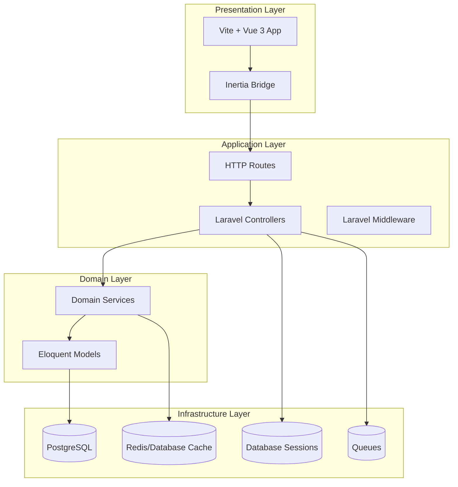
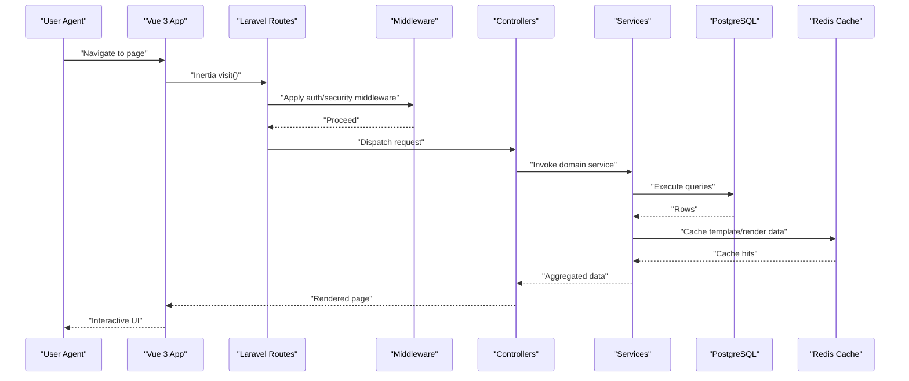
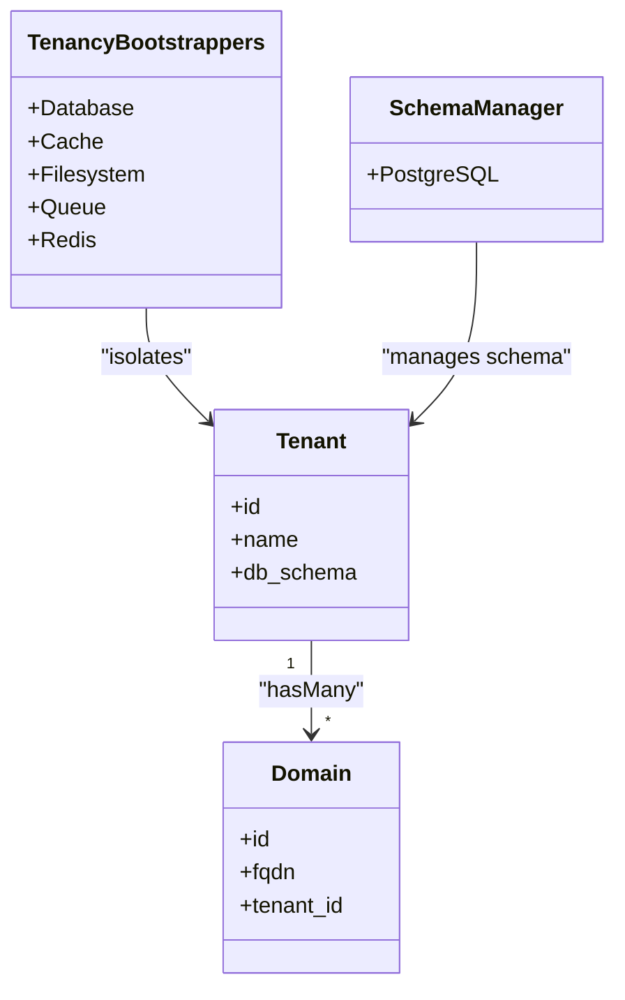
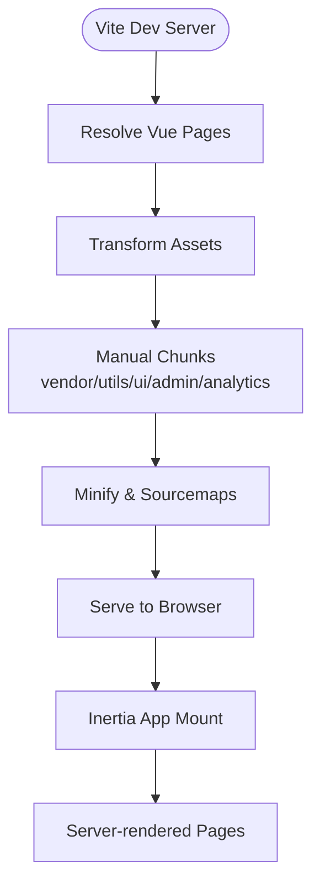
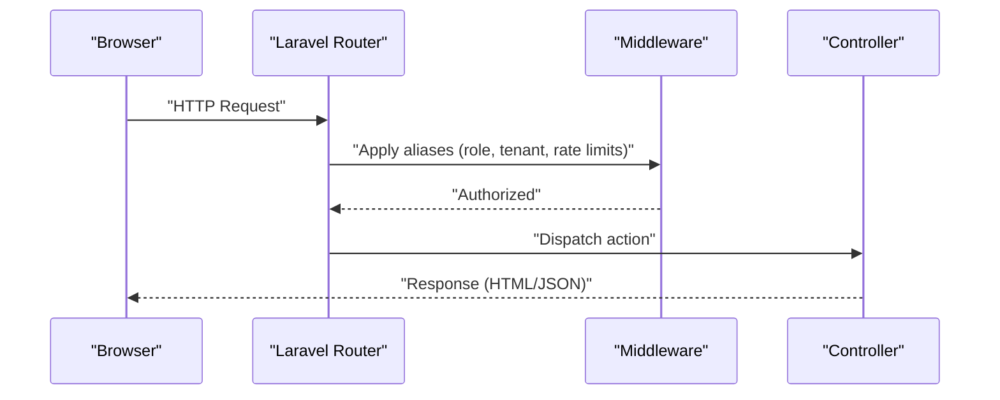
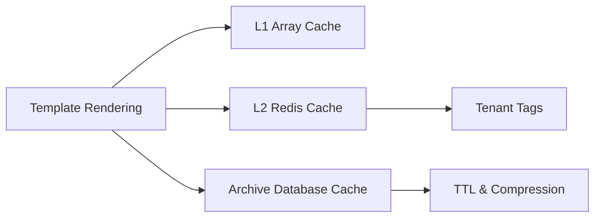
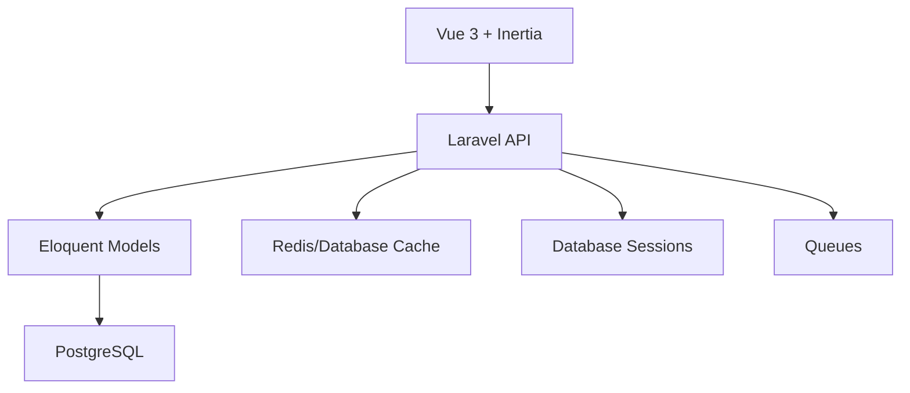

# Architecture Overview

<cite>
**Referenced Files in This Document**
- [app.php](file://bootstrap/app.php)
- [app.php](file://config/app.php)
- [tenancy.php](file://config/tenancy.php)
- [TenancyServiceProvider.php](file://app/Providers/TenancyServiceProvider.php)
- [web.php](file://routes/web.php)
- [api.php](file://routes/api.php)
- [package.json](file://package.json)
- [vite.config.ts](file://vite.config.ts)
- [tailwind.config.js](file://tailwind.config.js)
- [app.ts](file://resources/js/app.ts)
- [database.php](file://config/database.php)
- [cache.php](file://config/cache.php)
- [session.php](file://config/session.php)
</cite>

## Table of Contents
1. [Introduction](#introduction)
2. [Project Structure](#project-structure)
3. [Core Components](#core-components)
4. [Architecture Overview](#architecture-overview)
5. [Detailed Component Analysis](#detailed-component-analysis)
6. [Dependency Analysis](#dependency-analysis)
7. [Performance Considerations](#performance-considerations)
8. [Troubleshooting Guide](#troubleshooting-guide)
9. [Conclusion](#conclusion)
10. [Appendices](#appendices)

## Introduction
This document presents the Alumate system architecture, focusing on the layered design, multi-tenant foundation, and technology stack integration. The platform combines Laravel 12 for the backend with a Vue.js 3 frontend powered by Vite, PostgreSQL for persistence, and modern frontend tooling. Cross-cutting concerns include tenant isolation, caching strategies, session management, and performance monitoring.

## Project Structure
The system follows a layered architecture:
- Presentation layer: Vue 3 + Inertia.js with Vite tooling
- Application layer: Laravel HTTP controllers and middleware
- Domain layer: Eloquent models and service classes
- Infrastructure layer: Database, cache, queues, and external integrations

**Diagram sources**
- [app.ts:43-82](file://resources/js/app.ts#L43-L82)
- [web.php:1-50](file://routes/web.php#L1-L50)
- [api.php:1-50](file://routes/api.php#L1-L50)
- [database.php:92-135](file://config/database.php#L92-L135)
- [cache.php:140-144](file://config/cache.php#L140-L144)
- [session.php:21-21](file://config/session.php#L21-L21)

**Section sources**
- [app.php:10-41](file://bootstrap/app.php#L10-L41)
- [app.php:119-158](file://config/app.php#L119-L158)
- [package.json:1-90](file://package.json#L1-L90)
- [vite.config.ts:1-163](file://vite.config.ts#L1-L163)
- [tailwind.config.js:1-106](file://tailwind.config.js#L1-L106)

## Core Components
- Laravel application bootstrap and middleware pipeline
- Multi-tenant configuration via Stancl Tenancy
- Vue 3 frontend with Inertia.js for server-driven rendering
- PostgreSQL database with dedicated connections for central and tenant contexts
- Redis-backed caching with multi-layer template optimization
- Session management backed by database

**Section sources**
- [app.php:18-41](file://bootstrap/app.php#L18-L41)
- [tenancy.php:12-82](file://config/tenancy.php#L12-L82)
- [app.ts:3-82](file://resources/js/app.ts#L3-L82)
- [database.php:92-135](file://config/database.php#L92-L135)
- [cache.php:34-159](file://config/cache.php#L34-L159)
- [session.php:21-104](file://config/session.php#L21-L104)

## Architecture Overview
The system employs a multi-tenant architecture using domain-based routing and Stancl Tenancy. Requests are routed through Laravel middleware, initialized by the application bootstrap, and processed by controllers that delegate to domain services. The Vue 3 frontend communicates with Laravel APIs and renders pages via Inertia.js.

**Diagram sources**
- [app.ts:43-82](file://resources/js/app.ts#L43-L82)
- [web.php:1-50](file://routes/web.php#L1-L50)
- [api.php:1-50](file://routes/api.php#L1-L50)
- [database.php:92-135](file://config/database.php#L92-L135)
- [cache.php:140-144](file://config/cache.php#L140-L144)

## Detailed Component Analysis

### Multi-Tenant Architecture with Stancl Tenancy
- Tenant model and domain model configured for isolation
- Central domains for administrative routes
- Bootstrappers for database, cache, filesystem, queue, and Redis
- PostgreSQL schema manager for tenant databases
- Tenant-aware cache tagging and key prefixes
- Jobs for tenant lifecycle operations

**Diagram sources**
- [tenancy.php:12-82](file://config/tenancy.php#L12-L82)
- [TenancyServiceProvider.php:24-40](file://app/Providers/TenancyServiceProvider.php#L24-L40)

**Section sources**
- [tenancy.php:12-82](file://config/tenancy.php#L12-L82)
- [TenancyServiceProvider.php:24-40](file://app/Providers/TenancyServiceProvider.php#L24-L40)

### Frontend Architecture with Vue 3 and Inertia.js
- Vite-powered build with code-splitting and asset optimization
- Inertia.js bridge for server-driven page navigation
- TypeScript entrypoint with performance instrumentation
- Tailwind CSS for styling with custom theme tokens
- Aliased imports for components, pages, and services

**Diagram sources**
- [vite.config.ts:25-97](file://vite.config.ts#L25-L97)
- [app.ts:43-82](file://resources/js/app.ts#L43-L82)
- [tailwind.config.js:1-106](file://tailwind.config.js#L1-L106)

**Section sources**
- [package.json:1-90](file://package.json#L1-L90)
- [vite.config.ts:1-163](file://vite.config.ts#L1-L163)
- [app.ts:1-99](file://resources/js/app.ts#L1-L99)
- [tailwind.config.js:1-106](file://tailwind.config.js#L1-L106)

### Routing and Middleware Pipeline
- Web routes organized by functional areas (dashboard, jobs, alumni, events, etc.)
- API routes for authenticated endpoints and rate-limited operations
- Middleware aliases for role-based access, tenant initialization, and rate limiting
- Security headers and monitoring middleware applied to web requests

**Diagram sources**
- [web.php:1-50](file://routes/web.php#L1-L50)
- [api.php:1-50](file://routes/api.php#L1-L50)
- [app.php:18-38](file://bootstrap/app.php#L18-L38)

**Section sources**
- [web.php:1-836](file://routes/web.php#L1-L836)
- [api.php:1-1610](file://routes/api.php#L1-L1610)
- [app.php:18-38](file://bootstrap/app.php#L18-L38)

### Data Persistence and Caching Strategy
- PostgreSQL configured as default with central and tenant connections
- Redis cache for template performance layers and session storage
- Multi-layer cache policy with L1/L2/L3 stores and tenant isolation
- Database-backed cache stores for metadata and metrics

**Diagram sources**
- [database.php:92-135](file://config/database.php#L92-L135)
- [cache.php:59-113](file://config/cache.php#L59-L113)
- [cache.php:195-263](file://config/cache.php#L195-L263)

**Section sources**
- [database.php:92-135](file://config/database.php#L92-L135)
- [cache.php:34-159](file://config/cache.php#L34-L159)
- [cache.php:184-282](file://config/cache.php#L184-L282)

### Session and Security Configuration
- Database-backed sessions with configurable lifetime and cookie attributes
- CSRF protection via SameSite cookies and HTTP-only flags
- Security headers and monitoring middleware applied globally

**Section sources**
- [session.php:21-217](file://config/session.php#L21-L217)
- [app.php:18-38](file://bootstrap/app.php#L18-L38)

## Dependency Analysis
The architecture exhibits clear separation of concerns with low coupling between layers. The frontend depends on Inertia.js and the Laravel API, while the backend leverages Stancl Tenancy for tenant isolation and a robust caching subsystem.

**Diagram sources**
- [app.ts:3-82](file://resources/js/app.ts#L3-L82)
- [database.php:92-135](file://config/database.php#L92-L135)
- [cache.php:140-144](file://config/cache.php#L140-L144)
- [session.php:21-104](file://config/session.php#L21-L104)

**Section sources**
- [app.ts:3-82](file://resources/js/app.ts#L3-L82)
- [database.php:92-135](file://config/database.php#L92-L135)
- [cache.php:140-144](file://config/cache.php#L140-L144)
- [session.php:21-104](file://config/session.php#L21-L104)

## Performance Considerations
- Frontend: Vite code splitting, manual chunking, and asset optimization
- Backend: Multi-layer caching with tenant isolation and compression
- Database: Dedicated connections for central and tenant contexts
- Monitoring: Performance markers and reporting hooks in the frontend entrypoint

[No sources needed since this section provides general guidance]

## Troubleshooting Guide
Common areas to investigate:
- Tenant initialization failures (domain routing and middleware)
- Cache misses and slow template rendering
- Session persistence and cookie configuration
- Database connectivity and migration issues

**Section sources**
- [tenancy.php:12-82](file://config/tenancy.php#L12-L82)
- [cache.php:294-304](file://config/cache.php#L294-L304)
- [session.php:129-217](file://config/session.php#L129-L217)
- [database.php:92-135](file://config/database.php#L92-L135)

## Conclusion
Alumate’s architecture balances scalability and maintainability through a clean separation of layers, robust multi-tenancy, and modern frontend tooling. The combination of Laravel 12, Vue 3 with Inertia.js, PostgreSQL, and Redis delivers a responsive, tenant-isolated platform suitable for institutional deployments.

[No sources needed since this section summarizes without analyzing specific files]

## Appendices

### Technology Stack Integration
- Backend: Laravel 12, PostgreSQL, Redis, Queues
- Frontend: Vue 3, Inertia.js, Vite, TypeScript, Tailwind CSS
- Middleware: Role-based access, rate limiting, security headers
- Tooling: ESLint, Prettier, Vitest, Playwright

**Section sources**
- [package.json:1-90](file://package.json#L1-L90)
- [vite.config.ts:1-163](file://vite.config.ts#L1-L163)
- [tailwind.config.js:1-106](file://tailwind.config.js#L1-L106)
- [app.php:18-38](file://bootstrap/app.php#L18-L38)