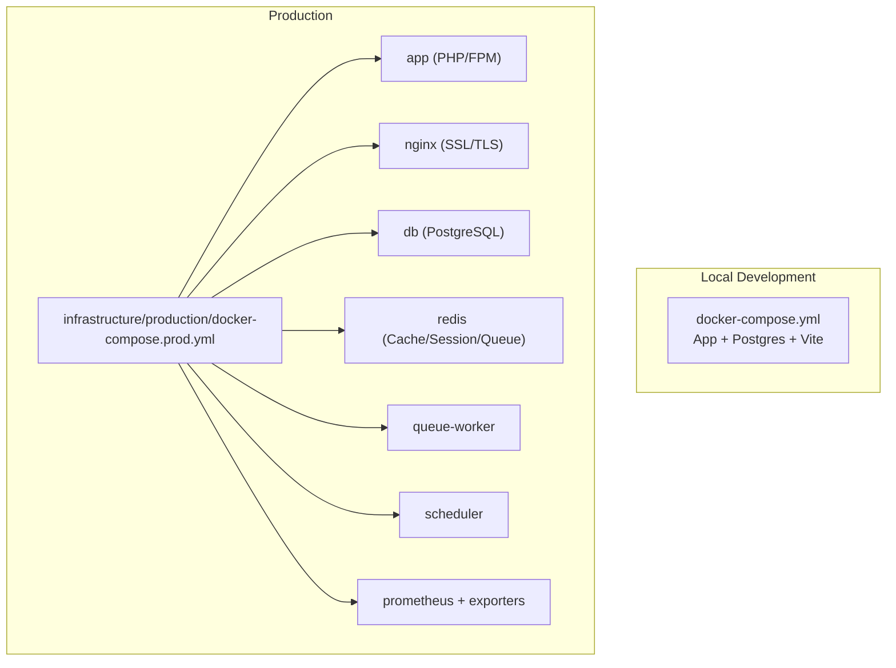
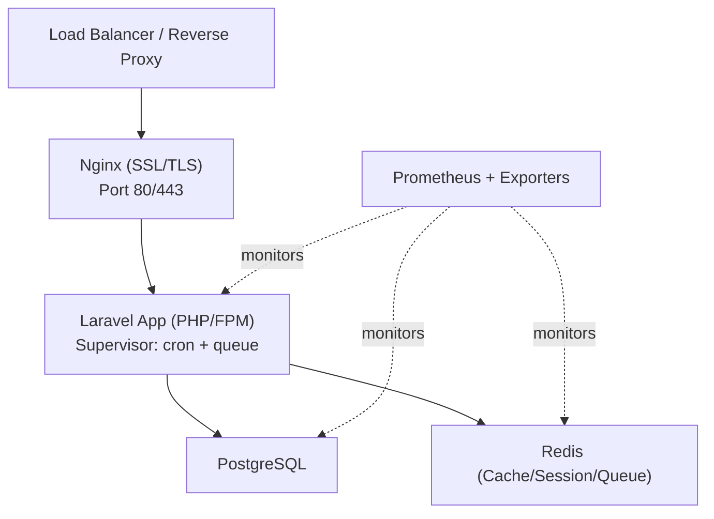
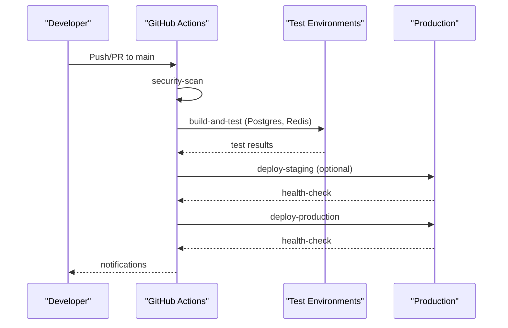
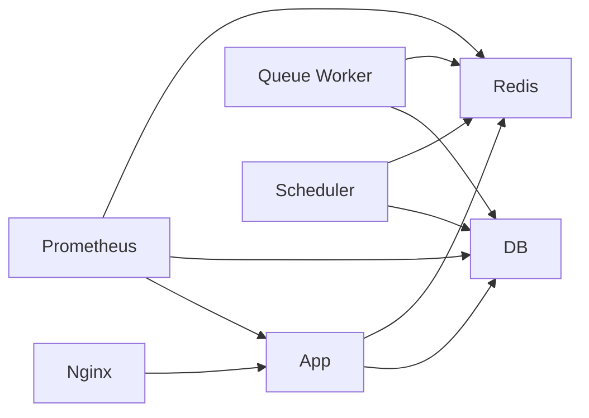

# Infrastructure & Deployment

<cite>
**Referenced Files in This Document**
- [docker-compose.yml](file://docker-compose.yml)
- [deployment-plan.md](file://deployment-plan.md)
- [infrastructure/README.md](file://infrastructure/README.md)
- [infrastructure/production/docker-compose.prod.yml](file://infrastructure/production/docker-compose.prod.yml)
- [infrastructure/production/Dockerfile.php](file://infrastructure/production/Dockerfile.php)
- [infrastructure/production/Dockerfile.nginx](file://infrastructure/production/Dockerfile.nginx)
- [.github/workflows/ci.yml](file://.github/workflows/ci.yml)
- [.github/workflows/production-deployment.yml](file://.github/workflows/production-deployment.yml)
- [scripts/deploy-homepage.sh](file://scripts/deploy-homepage.sh)
- [config/deployment.php](file://config/deployment.php)
- [config/cache.php](file://config/cache.php)
- [config/queue.php](file://config/queue.php)
- [config/database.php](file://config/database.php)
</cite>

## Table of Contents
1. [Introduction](#introduction)
2. [Project Structure](#project-structure)
3. [Core Components](#core-components)
4. [Architecture Overview](#architecture-overview)
5. [Detailed Component Analysis](#detailed-component-analysis)
6. [Dependency Analysis](#dependency-analysis)
7. [Performance Considerations](#performance-considerations)
8. [Troubleshooting Guide](#troubleshooting-guide)
9. [Conclusion](#conclusion)
10. [Appendices](#appendices)

## Introduction
This document describes the infrastructure and deployment architecture for the Alumate platform with a focus on containerization, multi-container orchestration, and production readiness. It covers Docker-based deployment, CI/CD pipelines, zero-downtime deployment strategies, monitoring and observability, security hardening, database and caching strategies, message queuing, and disaster recovery. The content is derived from the repository’s Docker configurations, deployment plans, CI/CD workflows, and configuration files.

## Project Structure
The infrastructure is organized around two primary Docker Compose setups:
- A developer-focused local compose for rapid iteration
- A production-grade compose with dedicated services for app, web server, database, cache, queue workers, scheduler, and monitoring

**Diagram sources**
- [docker-compose.yml:1-52](file://docker-compose.yml#L1-L52)
- [infrastructure/production/docker-compose.prod.yml:1-221](file://infrastructure/production/docker-compose.prod.yml#L1-L221)

**Section sources**
- [docker-compose.yml:1-52](file://docker-compose.yml#L1-L52)
- [infrastructure/README.md:1-244](file://infrastructure/README.md#L1-L244)
- [infrastructure/production/docker-compose.prod.yml:1-221](file://infrastructure/production/docker-compose.prod.yml#L1-L221)

## Core Components
- Application container (PHP/FPM) with production Dockerfile, Composer installation, asset build, and Supervisor-managed cron and queue workers
- Nginx container with SSL/TLS termination, health checks, and Let’s Encrypt directories
- PostgreSQL database with health checks and initialization scripts
- Redis cache/session/queue with password protection and health checks
- Queue worker and scheduler containers for background processing
- Prometheus and exporters for metrics collection

Key configuration highlights:
- Environment variables for production, including multi-tenancy, cache, sessions, queues, Redis, mail, S3, monitoring, and security headers
- Cache stores and policies for template performance optimization
- Queue connections and failed job handling
- Database connections and Redis clusters/options

**Section sources**
- [infrastructure/production/Dockerfile.php:1-113](file://infrastructure/production/Dockerfile.php#L1-L113)
- [infrastructure/production/Dockerfile.nginx:1-41](file://infrastructure/production/Dockerfile.nginx#L1-L41)
- [infrastructure/production/docker-compose.prod.yml:1-221](file://infrastructure/production/docker-compose.prod.yml#L1-L221)
- [infrastructure/production/.env.production:1-288](file://infrastructure/production/.env.production#L1-L288)
- [config/cache.php:1-328](file://config/cache.php#L1-L328)
- [config/queue.php:1-113](file://config/queue.php#L1-L113)
- [config/database.php:1-211](file://config/database.php#L1-L211)

## Architecture Overview
The production architecture centers on a reverse-proxy Nginx terminating TLS and routing requests to the Laravel application container. The app communicates with PostgreSQL and Redis, while queue workers and scheduler run as separate containers. Monitoring is provided by Prometheus and exporters.

**Diagram sources**
- [infrastructure/production/docker-compose.prod.yml:42-210](file://infrastructure/production/docker-compose.prod.yml#L42-L210)
- [infrastructure/production/Dockerfile.nginx:1-41](file://infrastructure/production/Dockerfile.nginx#L1-L41)
- [infrastructure/production/Dockerfile.php:1-113](file://infrastructure/production/Dockerfile.php#L1-L113)

## Detailed Component Analysis

### Docker-Based Deployment Strategy
- Local development stack includes app, Postgres, and Vite for hot-reload frontend development
- Production stack defines explicit containers for app, nginx, db, redis, queue-worker, scheduler, and monitoring
- Health checks are defined for db and redis to enable robust orchestration
- Nginx and app containers expose health endpoints for load balancers and monitoring

Operational commands:
- Start/stop services, scale queue workers, run artisan commands, and inspect logs are documented for production management

**Section sources**
- [docker-compose.yml:1-52](file://docker-compose.yml#L1-L52)
- [infrastructure/production/docker-compose.prod.yml:1-221](file://infrastructure/production/docker-compose.prod.yml#L1-L221)
- [infrastructure/README.md:126-166](file://infrastructure/README.md#L126-L166)

### Multi-Container Orchestration
- Containers communicate over a dedicated bridge network
- Persistent volumes are used for db, redis, and prometheus data
- Environment variables are injected from .env.production for secrets and configuration
- Supervisor manages cron and queue processes inside the app container

**Section sources**
- [infrastructure/production/docker-compose.prod.yml:211-221](file://infrastructure/production/docker-compose.prod.yml#L211-L221)
- [infrastructure/production/Dockerfile.php:98-113](file://infrastructure/production/Dockerfile.php#L98-L113)
- [infrastructure/production/.env.production:1-288](file://infrastructure/production/.env.production#L1-L288)

### Service Mesh and Load Balancing
- Nginx terminates TLS and forwards requests to the Laravel app
- Health endpoints are exposed for load balancer health checks
- Blue-green deployment is described in the deployment plan for zero-downtime transitions

**Section sources**
- [infrastructure/production/Dockerfile.nginx:33-35](file://infrastructure/production/Dockerfile.nginx#L33-L35)
- [deployment-plan.md:301-387](file://deployment-plan.md#L301-L387)

### Auto-Scaling and Queue Workers
- Queue workers are scaled by increasing the container count
- Scheduler container runs the Laravel scheduler
- Queue connection is configured to Redis for reliability

**Section sources**
- [infrastructure/production/docker-compose.prod.yml:106-164](file://infrastructure/production/docker-compose.prod.yml#L106-L164)
- [config/queue.php:66-73](file://config/queue.php#L66-L73)

### Health Monitoring Systems
- Health endpoints include basic status, database connectivity, cache availability, and template/system health
- Performance monitoring middleware records endpoint metrics
- Prometheus and exporters collect host and database metrics

**Section sources**
- [deployment-plan.md:497-572](file://deployment-plan.md#L497-L572)
- [deployment-plan.md:574-607](file://deployment-plan.md#L574-L607)
- [infrastructure/production/docker-compose.prod.yml:165-210](file://infrastructure/production/docker-compose.prod.yml#L165-L210)

### Database Clustering and Multi-Tenancy
- Central and tenant database connections are defined
- Multi-tenancy settings and prefixes are configured in environment variables
- Database initialization scripts are mounted for first-run setup

**Section sources**
- [config/database.php:107-135](file://config/database.php#L107-L135)
- [infrastructure/production/.env.production:19-36](file://infrastructure/production/.env.production#L19-L36)
- [infrastructure/production/docker-compose.prod.yml:75-75](file://infrastructure/production/docker-compose.prod.yml#L75-L75)

### Caching Strategies with Redis
- Multiple cache stores are defined for templates and performance metrics
- Tenant isolation and invalidation policies are configurable
- Compression and TTL settings are tunable per layer

**Section sources**
- [config/cache.php:34-159](file://config/cache.php#L34-L159)
- [config/cache.php:184-282](file://config/cache.php#L184-L282)
- [config/cache.php:294-304](file://config/cache.php#L294-L304)

### Message Queuing with Laravel Queues
- Queue connection configured to Redis
- Queue worker container runs with retry and timeout settings
- Failed jobs handled via database UUIDs

**Section sources**
- [config/queue.php:66-73](file://config/queue.php#L66-L73)
- [infrastructure/production/docker-compose.prod.yml:106-134](file://infrastructure/production/docker-compose.prod.yml#L106-L134)

### Infrastructure as Code Practices
- Docker Compose files define declarative infrastructure
- Environment-specific .env files manage configuration
- Nginx and PHP-FPM tuning via Dockerfiles and config mounts

**Section sources**
- [infrastructure/production/docker-compose.prod.yml:1-221](file://infrastructure/production/docker-compose.prod.yml#L1-L221)
- [infrastructure/production/.env.production:1-288](file://infrastructure/production/.env.production#L1-L288)
- [infrastructure/production/Dockerfile.nginx:12-15](file://infrastructure/production/Dockerfile.nginx#L12-L15)
- [infrastructure/production/Dockerfile.php:54-56](file://infrastructure/production/Dockerfile.php#L54-L56)

### CI/CD Pipeline Architecture
- GitHub Actions workflows for linting, unit/integration/feature tests, and frontend build
- Production deployment workflow builds artifacts, deploys to staging/production, performs health checks, and supports rollback
- Security scan job runs composer and npm audits prior to deployment

**Diagram sources**
- [.github/workflows/ci.yml:1-280](file://.github/workflows/ci.yml#L1-L280)
- [.github/workflows/production-deployment.yml:1-366](file://.github/workflows/production-deployment.yml#L1-L366)

**Section sources**
- [.github/workflows/ci.yml:1-280](file://.github/workflows/ci.yml#L1-L280)
- [.github/workflows/production-deployment.yml:1-366](file://.github/workflows/production-deployment.yml#L1-L366)

### Deployment Automation
- Blue-green deployment strategy with health checks and automatic rollback
- Database backup prior to production deployment
- Deployment scripts for homepage and symlink-based deployments

**Section sources**
- [deployment-plan.md:301-387](file://deployment-plan.md#L301-L387)
- [deployment-plan.md:272-284](file://deployment-plan.md#L272-L284)
- [scripts/deploy-homepage.sh:1-85](file://scripts/deploy-homepage.sh#L1-L85)

### Security Infrastructure, SSL Termination, and Network Segmentation
- SSL termination at Nginx with Let’s Encrypt directories
- Security headers and HSTS/CSP policies configured in environment
- Network segmentation via dedicated bridge network
- Redis requires password and health checks

**Section sources**
- [infrastructure/production/Dockerfile.nginx:17-31](file://infrastructure/production/Dockerfile.nginx#L17-L31)
- [infrastructure/production/.env.production:152-167](file://infrastructure/production/.env.production#L152-L167)
- [infrastructure/production/docker-compose.prod.yml:219-221](file://infrastructure/production/docker-compose.prod.yml#L219-L221)
- [infrastructure/production/docker-compose.prod.yml:92-104](file://infrastructure/production/docker-compose.prod.yml#L92-L104)

### Disaster Recovery, Backup Strategies, and Monitoring Stack Integration
- Automated backup script for database, storage, and config
- Disaster recovery service with damage assessment, restoration, integrity checks, and service restarts
- Prometheus metrics and exporters integrated into the stack

**Section sources**
- [deployment-plan.md:609-633](file://deployment-plan.md#L609-L633)
- [deployment-plan.md:635-717](file://deployment-plan.md#L635-L717)
- [infrastructure/production/docker-compose.prod.yml:165-210](file://infrastructure/production/docker-compose.prod.yml#L165-L210)

### Environment Configuration Management and Secrets Handling
- Environment variables managed via .env.production
- Secrets injected at runtime; sensitive values referenced via environment variables
- Configuration for mail, S3, monitoring, and third-party integrations

**Section sources**
- [infrastructure/production/.env.production:1-288](file://infrastructure/production/.env.production#L1-L288)
- [config/deployment.php:1-231](file://config/deployment.php#L1-L231)

### Infrastructure Testing Approaches
- CI workflows include linting, unit, integration, feature tests, and frontend build
- Health checks and rollback procedures in production workflow
- Homepage-specific deployment script with backup and verification

**Section sources**
- [.github/workflows/ci.yml:1-280](file://.github/workflows/ci.yml#L1-L280)
- [.github/workflows/production-deployment.yml:318-342](file://.github/workflows/production-deployment.yml#L318-L342)
- [scripts/deploy-homepage.sh:60-83](file://scripts/deploy-homepage.sh#L60-L83)

## Dependency Analysis
The production stack exhibits clear separation of concerns:
- App depends on DB and Redis
- Nginx depends on App
- Queue-worker and Scheduler depend on DB and Redis
- Prometheus and exporters depend on App, DB, and Redis

**Diagram sources**
- [infrastructure/production/docker-compose.prod.yml:34-163](file://infrastructure/production/docker-compose.prod.yml#L34-L163)

**Section sources**
- [infrastructure/production/docker-compose.prod.yml:1-221](file://infrastructure/production/docker-compose.prod.yml#L1-L221)

## Performance Considerations
- PHP OPcache and Laravel Octane enabled for performance
- Static asset caching and compression enabled
- Redis database separation for cache, sessions, and queues
- Horizontal scaling of queue workers via Docker Compose scale

**Section sources**
- [infrastructure/production/.env.production:178-185](file://infrastructure/production/.env.production#L178-L185)
- [infrastructure/production/.env.production:171-177](file://infrastructure/production/.env.production#L171-L177)
- [infrastructure/README.md:139-141](file://infrastructure/README.md#L139-L141)

## Troubleshooting Guide
Common operational checks:
- Container logs and status inspection
- Health endpoints for app, db, and redis
- Deployment script permissions and SSH connectivity
- Backup integrity verification

**Section sources**
- [infrastructure/README.md:167-200](file://infrastructure/README.md#L167-L200)
- [deployment-plan.md:389-495](file://deployment-plan.md#L389-L495)

## Conclusion
The Alumate platform employs a robust, container-first deployment model with clear separation of concerns, strong observability, and production-grade security and resilience. The combination of Docker Compose, GitHub Actions, and documented deployment procedures enables repeatable, safe releases with automated rollback and comprehensive monitoring.

## Appendices

### Appendix A: Production Environment Variables Reference
- Application: name, environment, debug, URL, key, timezone, locale
- Multi-tenancy: prefixes, domains, filesystem disks
- Database: central/tenant connections, hosts, ports, credentials
- Cache: store, prefix, Redis DB indices
- Sessions: driver, lifetime, secure flags, domain
- Queue: connection, prefix
- Redis: host, password, port, DB indices
- Mail: SMTP/SES configuration
- Broadcasting: Pusher settings
- Filesystem: S3 bucket and path style
- Logging: handler, retention
- Monitoring: Sentry DSN, traces sample rate
- SSL & Security: HTTPS enforcement, HSTS, CSP, security headers
- Performance: OPcache, static asset caching, minification
- Analytics: Google Analytics, GTM, Facebook Pixel
- Integrations: Zoom, LinkedIn, Stripe
- External APIs: SMS provider, CDN
- Backup: enabled, disk, retention, compression, encryption
- Security & Compliance: 2FA, audit logging
- Scheduled tasks: cache, maintenance mode cleanup
- Service specifics: Horizon memory, Telescope disabled

**Section sources**
- [infrastructure/production/.env.production:1-288](file://infrastructure/production/.env.production#L1-L288)