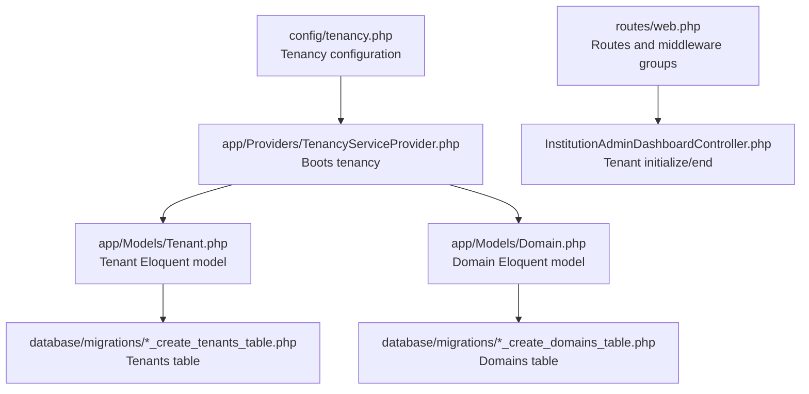
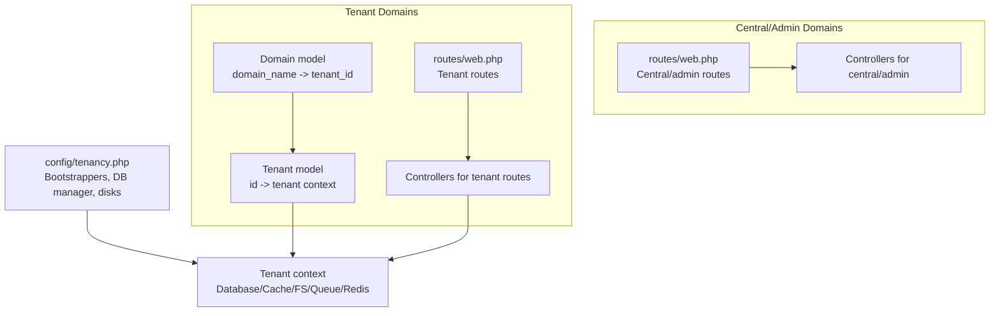
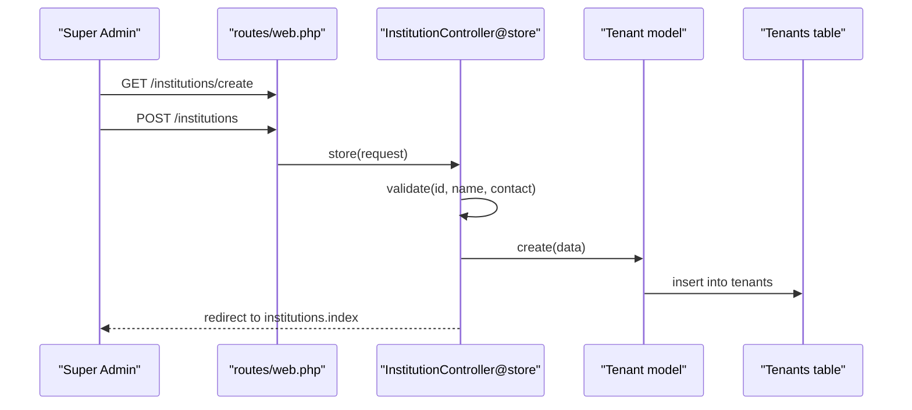
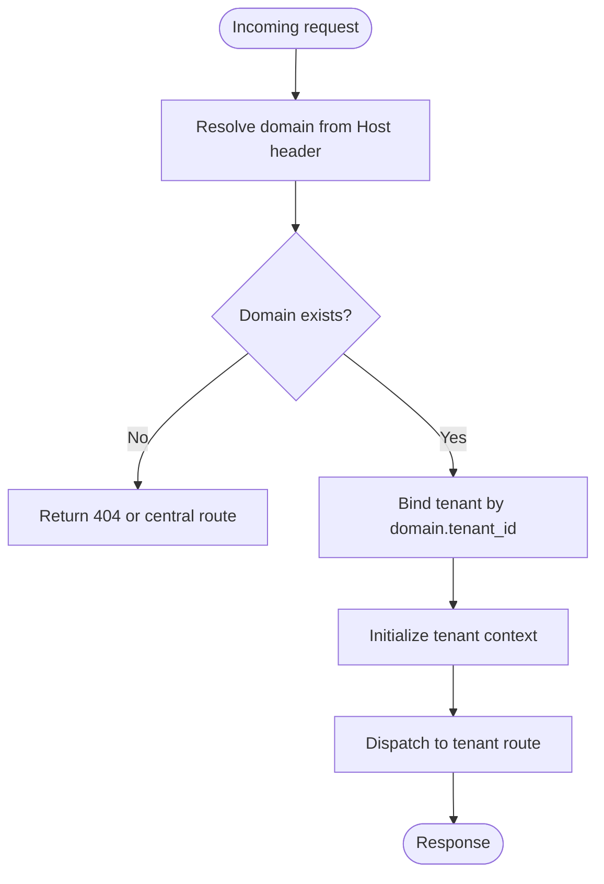
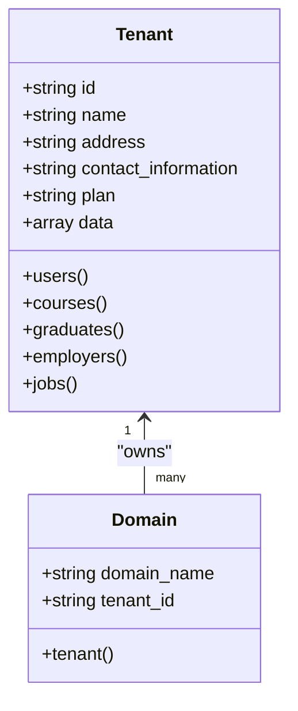
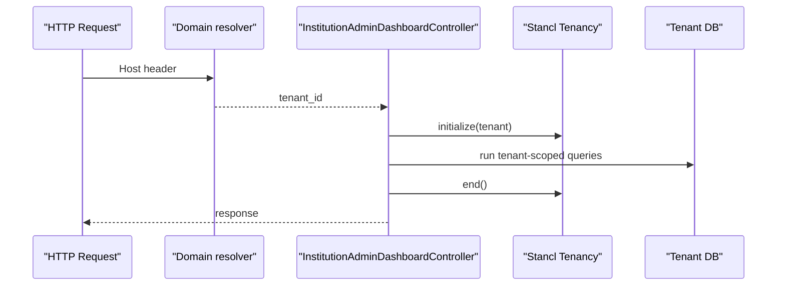
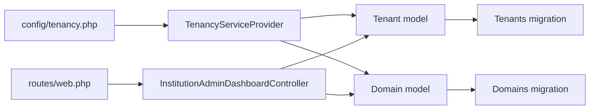

# Multi-Tenant Architecture

<cite>
**Referenced Files in This Document**
- [config/tenancy.php](file://config/tenancy.php)
- [app/Providers/TenancyServiceProvider.php](file://app/Providers/TenancyServiceProvider.php)
- [app/Models/Tenant.php](file://app/Models/Tenant.php)
- [app/Models/Domain.php](file://app/Models/Domain.php)
- [database/migrations/2024_01_01_000000_create_tenants_table.php](file://database/migrations/2024_01_01_000000_create_tenants_table.php)
- [database/migrations/2024_01_01_000001_create_domains_table.php](file://database/migrations/2024_01_01_000001_create_domains_table.php)
- [routes/web.php](file://routes/web.php)
- [app/Http/Controllers/InstitutionController.php](file://app/Http/Controllers/InstitutionController.php)
- [app/Http/Controllers/InstitutionAdminDashboardController.php](file://app/Http/Controllers/InstitutionAdminDashboardController.php)
- [deployment-plan.md](file://deployment-plan.md)
</cite>

## Table of Contents
1. [Introduction](#introduction)
2. [Project Structure](#project-structure)
3. [Core Components](#core-components)
4. [Architecture Overview](#architecture-overview)
5. [Detailed Component Analysis](#detailed-component-analysis)
6. [Dependency Analysis](#dependency-analysis)
7. [Performance Considerations](#performance-considerations)
8. [Troubleshooting Guide](#troubleshooting-guide)
9. [Conclusion](#conclusion)
10. [Appendices](#appendices)

## Introduction
This document explains the multi-tenant architecture implemented in the platform using the Stancl Tenancy package. It focuses on tenant isolation, domain-based routing, and data segregation across tenants. It documents tenant registration and management, domain resolution, tenant-specific database schemas, shared vs isolated resources, cross-tenant security boundaries, tenant switching mechanisms, subdomain routing, and custom domain support. Practical examples illustrate tenant configuration, data isolation enforcement, and multi-tenant service provisioning. Administrative controls, onboarding workflows, billing integration touchpoints, and performance considerations are also covered.

## Project Structure
The multi-tenant implementation centers around configuration, models, migrations, routing, and controller logic that coordinate tenant initialization and domain resolution. The Stancl Tenancy package is configured via a dedicated configuration file and integrated through a provider. Tenant and Domain models define the persistence layer and relationships. Routes are organized to separate central/admin domains from tenant-aware routes. Controllers demonstrate tenant switching for analytics and reporting.

**Diagram sources**
- [config/tenancy.php:12-82](file://config/tenancy.php#L12-L82)
- [app/Providers/TenancyServiceProvider.php:24-40](file://app/Providers/TenancyServiceProvider.php#L24-L40)
- [app/Models/Tenant.php:11-86](file://app/Models/Tenant.php#L11-L86)
- [app/Models/Domain.php:12-59](file://app/Models/Domain.php#L12-L59)
- [database/migrations/2024_01_01_000000_create_tenants_table.php:14-36](file://database/migrations/2024_01_01_000000_create_tenants_table.php#L14-L36)
- [database/migrations/2024_01_01_000001_create_domains_table.php:14-34](file://database/migrations/2024_01_01_000001_create_domains_table.php#L14-L34)
- [routes/web.php:114-133](file://routes/web.php#L114-L133)
- [app/Http/Controllers/InstitutionAdminDashboardController.php:153-173](file://app/Http/Controllers/InstitutionAdminDashboardController.php#L153-L173)

**Section sources**
- [config/tenancy.php:12-82](file://config/tenancy.php#L12-L82)
- [app/Providers/TenancyServiceProvider.php:24-40](file://app/Providers/TenancyServiceProvider.php#L24-L40)
- [app/Models/Tenant.php:11-86](file://app/Models/Tenant.php#L11-L86)
- [app/Models/Domain.php:12-59](file://app/Models/Domain.php#L12-L59)
- [database/migrations/2024_01_01_000000_create_tenants_table.php:14-36](file://database/migrations/2024_01_01_000000_create_tenants_table.php#L14-L36)
- [database/migrations/2024_01_01_000001_create_domains_table.php:14-34](file://database/migrations/2024_01_01_000001_create_domains_table.php#L14-L34)
- [routes/web.php:114-133](file://routes/web.php#L114-L133)

## Core Components
- Tenancy configuration: Defines tenant and domain models, central domains, bootstrappers for database/cache/filesystem/queue/redis, database manager, cache tag base, filesystem suffix base, redis prefix base, migration/seeder parameters, and job classes.
- Tenant model: Extends the Tenancy base tenant and declares fillable attributes, custom columns, JSON casting for metadata, and relationships to users, courses, graduates, employers, and jobs.
- Domain model: Implements the Tenancy domain contract, defines the belongs-to relationship to Tenant, and dispatches domain lifecycle events. Includes traits to ensure domain uniqueness and convert domain names to lowercase.
- Routing: Central/admin routes are defined separately from tenant routes. Middleware groups apply tenancy selectively to tenant routes.
- Controllers: Demonstrate tenant initialization and termination for analytics and reporting, ensuring queries run within the correct tenant context.

**Section sources**
- [config/tenancy.php:12-82](file://config/tenancy.php#L12-L82)
- [app/Models/Tenant.php:15-86](file://app/Models/Tenant.php#L15-L86)
- [app/Models/Domain.php:17-59](file://app/Models/Domain.php#L17-L59)
- [routes/web.php:114-133](file://routes/web.php#L114-L133)
- [app/Http/Controllers/InstitutionAdminDashboardController.php:153-173](file://app/Http/Controllers/InstitutionAdminDashboardController.php#L153-L173)

## Architecture Overview
The system uses Stancl Tenancy to isolate tenants at the database, cache, filesystem, queue, and Redis levels. Domains resolve to tenants, and tenant routes execute within the tenant’s context. Central/admin domains remain outside tenant isolation for administrative tasks.

**Diagram sources**
- [config/tenancy.php:21-27](file://config/tenancy.php#L21-L27)
- [config/tenancy.php:28-35](file://config/tenancy.php#L28-L35)
- [config/tenancy.php:40-52](file://config/tenancy.php#L40-L52)
- [app/Models/Domain.php:19-22](file://app/Models/Domain.php#L19-L22)
- [app/Models/Tenant.php:48-84](file://app/Models/Tenant.php#L48-L84)
- [routes/web.php:114-133](file://routes/web.php#L114-L133)

## Detailed Component Analysis

### Tenant Registration and Management
- Tenant creation and editing are handled by the institution controller, validating identifiers and persisting tenant records. The tenant identifier serves as the primary key and is used for domain-to-tenant resolution.
- The central/admin dashboard lists institutions and supports CRUD operations, enabling administrators to manage tenant lifecycles.

**Diagram sources**
- [routes/web.php:114-133](file://routes/web.php#L114-L133)
- [app/Http/Controllers/InstitutionController.php:23-36](file://app/Http/Controllers/InstitutionController.php#L23-L36)
- [database/migrations/2024_01_01_000000_create_tenants_table.php:16-24](file://database/migrations/2024_01_01_000000_create_tenants_table.php#L16-L24)

**Section sources**
- [app/Http/Controllers/InstitutionController.php:18-36](file://app/Http/Controllers/InstitutionController.php#L18-L36)
- [database/migrations/2024_01_01_000000_create_tenants_table.php:16-24](file://database/migrations/2024_01_01_000000_create_tenants_table.php#L16-L24)

### Domain Resolution Mechanisms
- Domain records map domain names to tenant identifiers. The Domain model enforces uniqueness and lowercases domain names to prevent duplicates and inconsistencies.
- Domain events are dispatched during lifecycle operations, enabling hooks for auditing or side effects.

**Diagram sources**
- [app/Models/Domain.php:38-47](file://app/Models/Domain.php#L38-L47)
- [app/Models/Domain.php:52-57](file://app/Models/Domain.php#L52-L57)

**Section sources**
- [app/Models/Domain.php:19-33](file://app/Models/Domain.php#L19-L33)
- [database/migrations/2024_01_01_000001_create_domains_table.php:16-23](file://database/migrations/2024_01_01_000001_create_domains_table.php#L16-L23)

### Tenant-Specific Database Schemas and Data Segregation
- The configuration specifies a PostgreSQL schema manager, indicating tenant schemas are used for isolation. The database bootstrapper ensures per-tenant connections.
- Tenant-specific tables exist under a dedicated tenant migration namespace, while central/admin routes operate against the central connection.
- Tenant switching is demonstrated in controllers by initializing and ending tenant context around queries.

**Diagram sources**
- [app/Models/Tenant.php:15-86](file://app/Models/Tenant.php#L15-L86)
- [app/Models/Domain.php:19-22](file://app/Models/Domain.php#L19-L22)
- [database/migrations/2024_01_01_000000_create_tenants_table.php:16-24](file://database/migrations/2024_01_01_000000_create_tenants_table.php#L16-L24)
- [database/migrations/2024_01_01_000001_create_domains_table.php:16-23](file://database/migrations/2024_01_01_000001_create_domains_table.php#L16-L23)

**Section sources**
- [config/tenancy.php:28-35](file://config/tenancy.php#L28-L35)
- [config/tenancy.php:21-27](file://config/tenancy.php#L21-L27)
- [app/Http/Controllers/InstitutionAdminDashboardController.php:153-173](file://app/Http/Controllers/InstitutionAdminDashboardController.php#L153-L173)

### Cross-Tenant Security Boundaries and Shared Resources
- Central/admin domains are defined separately and remain outside tenant isolation, ensuring administrative controls operate on shared central resources.
- Bootstrappers isolate database, cache, filesystem, queue, and Redis per tenant, preventing cross-tenant leakage of data or state.
- Domain uniqueness and lowercase normalization reduce misconfiguration risks and maintain consistent routing.

**Section sources**
- [config/tenancy.php:15-20](file://config/tenancy.php#L15-L20)
- [config/tenancy.php:21-27](file://config/tenancy.php#L21-L27)
- [app/Models/Domain.php:38-47](file://app/Models/Domain.php#L38-L47)
- [app/Models/Domain.php:52-57](file://app/Models/Domain.php#L52-L57)

### Tenant Switching Mechanisms and Routing
- Controllers demonstrate explicit tenant initialization and termination around tenant-scoped queries. This pattern ensures analytics and reporting reflect the correct tenant context.
- Routes are grouped so that central/admin routes are not affected by tenant middleware, while tenant routes execute within tenant context.

**Diagram sources**
- [app/Http/Controllers/InstitutionAdminDashboardController.php:153-173](file://app/Http/Controllers/InstitutionAdminDashboardController.php#L153-L173)

**Section sources**
- [routes/web.php:114-133](file://routes/web.php#L114-L133)
- [app/Http/Controllers/InstitutionAdminDashboardController.php:153-173](file://app/Http/Controllers/InstitutionAdminDashboardController.php#L153-L173)

### Subdomain Routing and Custom Domain Support
- Subdomain routing is supported by the Domain model and configuration. Domains are stored in lowercase and enforced unique, enabling predictable routing.
- Custom domains can be mapped to tenants via the Domain model and validated by the uniqueness and lowercase traits.

**Section sources**
- [app/Models/Domain.php:19-33](file://app/Models/Domain.php#L19-L33)
- [app/Models/Domain.php:38-47](file://app/Models/Domain.php#L38-L47)
- [app/Models/Domain.php:52-57](file://app/Models/Domain.php#L52-L57)

### Practical Examples: Tenant Configuration, Data Isolation, and Provisioning
- Tenant configuration: Define tenant and domain models, central domains, bootstrappers, database manager, cache/redis/fs settings, and migration/seeder parameters in the tenancy config.
- Data isolation enforcement: Use tenant initialization in controllers for tenant-scoped queries; rely on bootstrappers to isolate cache/filesystem/queue/redis.
- Multi-tenant service provisioning: Create tenant records and associate domains; ensure migrations target tenant namespaces; leverage central/admin routes for provisioning and management.

**Section sources**
- [config/tenancy.php:12-82](file://config/tenancy.php#L12-L82)
- [app/Http/Controllers/InstitutionAdminDashboardController.php:153-173](file://app/Http/Controllers/InstitutionAdminDashboardController.php#L153-L173)

### Administrative Controls, Onboarding Workflows, and Billing Integration Touchpoints
- Administrative controls: Central/admin routes enable super admin dashboards and security monitoring. These routes remain outside tenant isolation.
- Onboarding workflows: While not explicitly shown here, tenant context switching enables institution admins to manage onboarding within tenant scopes.
- Billing integration: Billing touchpoints can be modeled as tenant-scoped resources and managed via central/admin routes while tenant-specific billing data resides in tenant contexts.

**Section sources**
- [routes/web.php:114-147](file://routes/web.php#L114-L147)
- [app/Http/Controllers/InstitutionAdminDashboardController.php:153-173](file://app/Http/Controllers/InstitutionAdminDashboardController.php#L153-L173)

## Dependency Analysis
The following diagram highlights key dependencies among configuration, provider, models, migrations, routes, and controllers involved in multi-tenant routing and tenant switching.

**Diagram sources**
- [config/tenancy.php:12-82](file://config/tenancy.php#L12-L82)
- [app/Providers/TenancyServiceProvider.php:24-40](file://app/Providers/TenancyServiceProvider.php#L24-L40)
- [app/Models/Tenant.php:11-86](file://app/Models/Tenant.php#L11-L86)
- [app/Models/Domain.php:12-59](file://app/Models/Domain.php#L12-L59)
- [database/migrations/2024_01_01_000000_create_tenants_table.php:14-36](file://database/migrations/2024_01_01_000000_create_tenants_table.php#L14-L36)
- [database/migrations/2024_01_01_000001_create_domains_table.php:14-34](file://database/migrations/2024_01_01_000001_create_domains_table.php#L14-L34)
- [routes/web.php:114-133](file://routes/web.php#L114-L133)
- [app/Http/Controllers/InstitutionAdminDashboardController.php:153-173](file://app/Http/Controllers/InstitutionAdminDashboardController.php#L153-L173)

**Section sources**
- [config/tenancy.php:12-82](file://config/tenancy.php#L12-L82)
- [app/Providers/TenancyServiceProvider.php:24-40](file://app/Providers/TenancyServiceProvider.php#L24-L40)
- [app/Models/Tenant.php:11-86](file://app/Models/Tenant.php#L11-L86)
- [app/Models/Domain.php:12-59](file://app/Models/Domain.php#L12-L59)
- [database/migrations/2024_01_01_000000_create_tenants_table.php:14-36](file://database/migrations/2024_01_01_000000_create_tenants_table.php#L14-L36)
- [database/migrations/2024_01_01_000001_create_domains_table.php:14-34](file://database/migrations/2024_01_01_000001_create_domains_table.php#L14-L34)
- [routes/web.php:114-133](file://routes/web.php#L114-L133)
- [app/Http/Controllers/InstitutionAdminDashboardController.php:153-173](file://app/Http/Controllers/InstitutionAdminDashboardController.php#L153-L173)

## Performance Considerations
- Per-tenant isolation at database, cache, filesystem, queue, and Redis reduces contention and improves predictability.
- Tenant switching should be scoped tightly to minimize overhead; avoid long-lived tenant contexts.
- Use centralized/admin routes for heavy administrative tasks to keep tenant contexts lean.
- Consider caching strategies with tag bases and prefix bases to avoid cross-tenant cache collisions.

[No sources needed since this section provides general guidance]

## Troubleshooting Guide
- Domain conflicts: The Domain model prevents duplicate domains by throwing an exception when attempting to save a domain already associated with another tenant. Ensure domain names are unique and consistently lowercased.
- Tenant initialization errors: When switching tenants for analytics or reporting, ensure initialization and termination are paired correctly to avoid leaking tenant context.
- Central/admin access: Verify that central/admin routes are not inadvertently affected by tenant middleware; keep them outside tenant scope.

**Section sources**
- [app/Models/Domain.php:38-47](file://app/Models/Domain.php#L38-L47)
- [app/Http/Controllers/InstitutionAdminDashboardController.php:153-173](file://app/Http/Controllers/InstitutionAdminDashboardController.php#L153-L173)

## Conclusion
The platform implements a robust multi-tenant architecture using Stancl Tenancy, with domain-based routing, tenant isolation across databases and shared resources, and clear administrative boundaries. Tenant registration and management are straightforward, with explicit tenant switching patterns for analytics and reporting. The configuration and models provide a solid foundation for subdomain and custom domain support, while central/admin routes ensure administrative controls remain unaffected by tenant isolation.

## Appendices

### Deployment and Resource Allocation Patterns
- The deployment plan illustrates a shared database with tenant isolation, aligning with the multi-tenant configuration that uses schema managers and per-tenant bootstrappers.

**Section sources**
- [deployment-plan.md:19-39](file://deployment-plan.md#L19-L39)