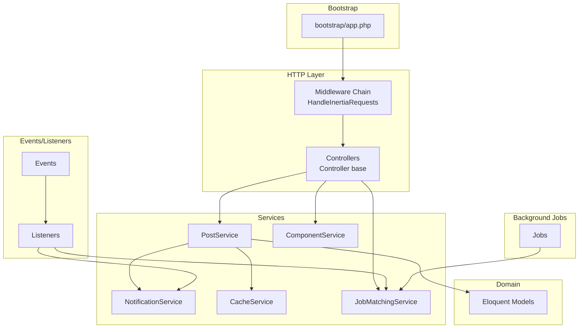
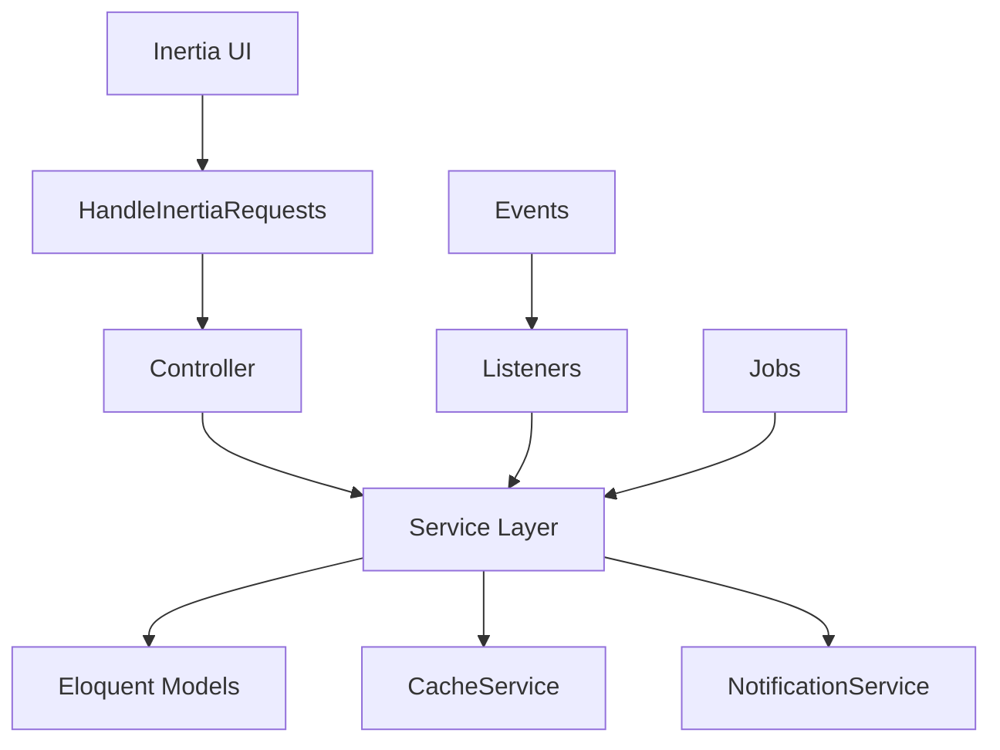
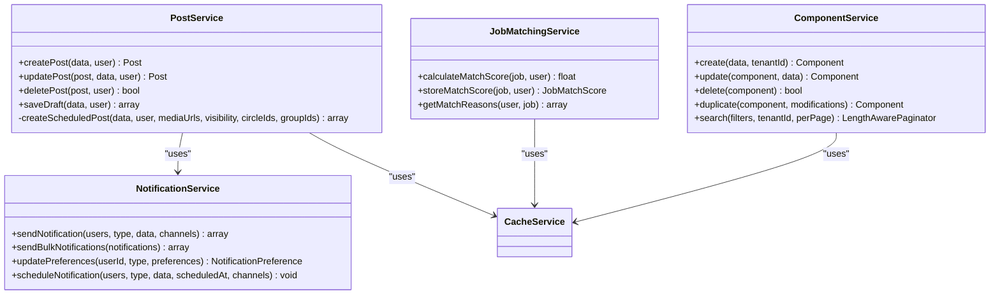
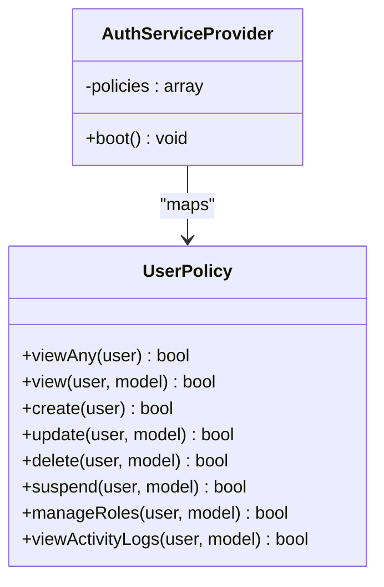
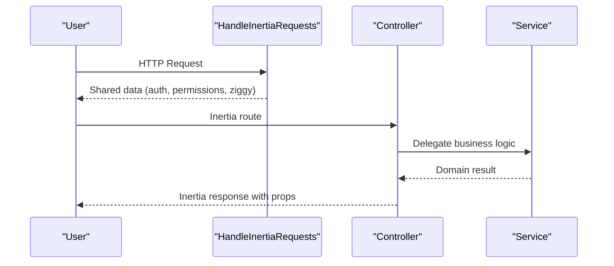
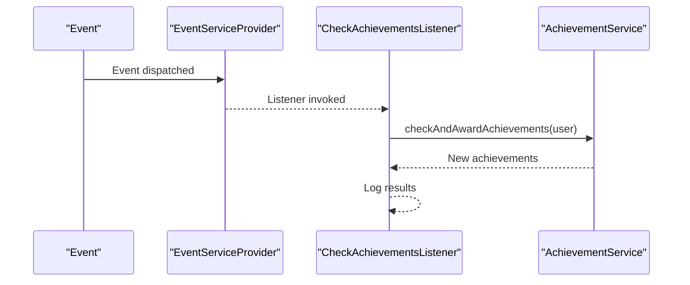
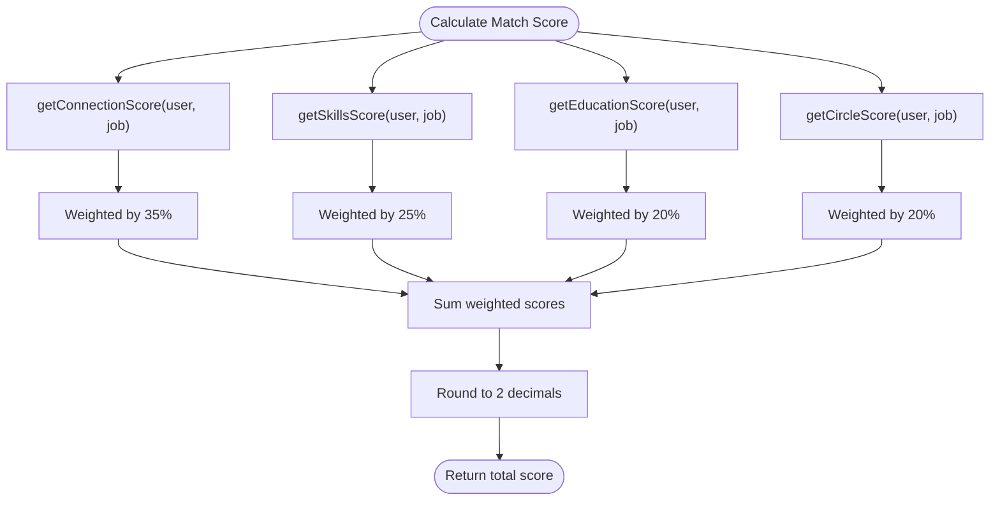
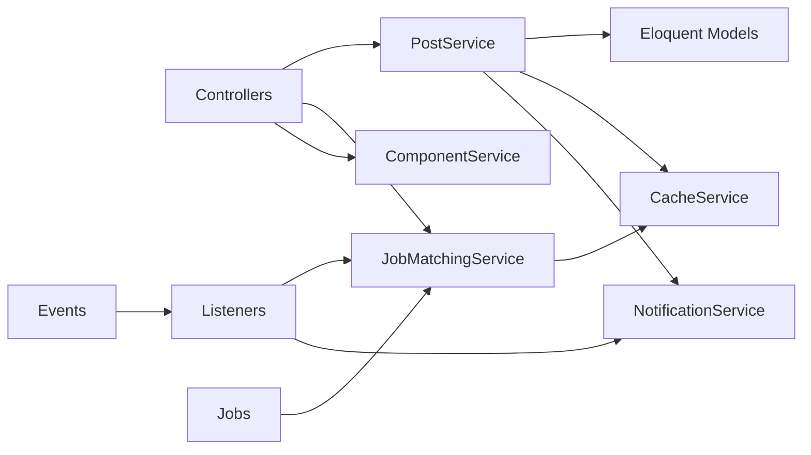

# System Design Patterns

<cite>
**Referenced Files in This Document**
- [AppServiceProvider.php](file://app/Providers/AppServiceProvider.php)
- [AuthServiceProvider.php](file://app/Providers/AuthServiceProvider.php)
- [EventServiceProvider.php](file://app/Providers/EventServiceProvider.php)
- [app.php](file://bootstrap/app.php)
- [Controller.php](file://app/Http/Controllers/Controller.php)
- [PostService.php](file://app/Services/PostService.php)
- [UserPolicy.php](file://app/Policies/UserPolicy.php)
- [CacheService.php](file://app/Services/CacheService.php)
- [NotificationService.php](file://app/Services/NotificationService.php)
- [JobMatchingService.php](file://app/Services/JobMatchingService.php)
- [HandleInertiaRequests.php](file://app/Http/Middleware/HandleInertiaRequests.php)
- [CheckAchievementsListener.php](file://app/Listeners/CheckAchievementsListener.php)
- [CareerMilestoneCreated.php](file://app/Events/CareerMilestoneCreated.php)
- [CalculateJobMatchesJob.php](file://app/Jobs/CalculateJobMatchesJob.php)
- [ComponentService.php](file://app/Services/ComponentService.php)
</cite>

## Table of Contents
1. [Introduction](#introduction)
2. [Project Structure](#project-structure)
3. [Core Components](#core-components)
4. [Architecture Overview](#architecture-overview)
5. [Detailed Component Analysis](#detailed-component-analysis)
6. [Dependency Analysis](#dependency-analysis)
7. [Performance Considerations](#performance-considerations)
8. [Troubleshooting Guide](#troubleshooting-guide)
9. [Conclusion](#conclusion)

## Introduction
This document analyzes the system design patterns and architectural principles implemented in Alumate. It focuses on the service layer pattern, dependency injection, repository pattern usage, MVC architecture with Inertia.js integration, controller-service-model separation, and event-driven architecture. It also covers design patterns such as Observer for notifications, Factory for model instantiation, Strategy for algorithmic components, and SOLID principles, clean architecture boundaries, separation of concerns, performance patterns, caching strategies, and background job processing architecture.

## Project Structure
Alumate follows a layered architecture with clear separation of concerns:
- Providers: Registration and bootstrapping of services, policies, and event mappings
- Http: Controllers, middleware, requests, and resources
- Services: Business logic services implementing domain-specific algorithms and workflows
- Models: Eloquent models representing domain entities
- Events/Listeners: Event-driven decoupling of cross-cutting concerns
- Jobs: Background processing for long-running tasks
- Policies: Authorization logic per model
- Observers: Model lifecycle hooks (temporarily disabled in provider)

**Diagram sources**
- [app.php:10-42](file://bootstrap/app.php#L10-L42)
- [HandleInertiaRequests.php:10-74](file://app/Http/Middleware/HandleInertiaRequests.php#L10-L74)
- [Controller.php:7-14](file://app/Http/Controllers/Controller.php#L7-L14)
- [PostService.php:13-264](file://app/Services/PostService.php#L13-L264)
- [NotificationService.php:21-386](file://app/Services/NotificationService.php#L21-L386)
- [CacheService.php:9-173](file://app/Services/CacheService.php#L9-L173)
- [JobMatchingService.php:12-362](file://app/Services/JobMatchingService.php#L12-L362)
- [ComponentService.php:14-800](file://app/Services/ComponentService.php#L14-L800)

**Section sources**
- [app.php:10-42](file://bootstrap/app.php#L10-L42)

## Core Components
- Service Layer Pattern: Implemented via dedicated service classes encapsulating business logic (e.g., PostService, NotificationService, JobMatchingService, ComponentService).
- Dependency Injection: Services receive collaborators via constructor injection, enabling testability and modularity.
- Repository Pattern Usage: While not explicitly named, services orchestrate Eloquent models and database operations, acting as repositories for domain logic.
- MVC with Inertia.js: Controllers coordinate requests, delegate to services, and render pages via Inertia middleware sharing authenticated user and permissions.
- Policy Classes: Authorization logic mapped per model-class pairs via AuthServiceProvider.
- Event-Driven Architecture: Events and listeners decouple achievement checks and other workflows from controllers/services.
- Observer Pattern: Implemented via model observers (registered in provider) for lifecycle hooks.
- Strategy Pattern: Algorithmic scoring in JobMatchingService demonstrates strategy-like composition of weighted scoring functions.
- Middleware Chains: Centralized in bootstrap/app.php with aliases for role/permission and tenant isolation.

**Section sources**
- [PostService.php:13-264](file://app/Services/PostService.php#L13-L264)
- [NotificationService.php:21-386](file://app/Services/NotificationService.php#L21-L386)
- [JobMatchingService.php:12-362](file://app/Services/JobMatchingService.php#L12-L362)
- [ComponentService.php:14-800](file://app/Services/ComponentService.php#L14-L800)
- [HandleInertiaRequests.php:38-72](file://app/Http/Middleware/HandleInertiaRequests.php#L38-L72)
- [AuthServiceProvider.php:14-24](file://app/Providers/AuthServiceProvider.php#L14-L24)
- [EventServiceProvider.php:25-54](file://app/Providers/EventServiceProvider.php#L25-L54)
- [AppServiceProvider.php:22-31](file://app/Providers/AppServiceProvider.php#L22-L31)
- [app.php:18-38](file://bootstrap/app.php#L18-L38)

## Architecture Overview
The system adheres to layered architecture with explicit boundaries:
- Presentation: Inertia middleware shares authenticated context and exposes Ziggy routing helpers.
- Application: Controllers act as orchestrators, delegating to services.
- Domain: Services encapsulate business rules and coordinate models.
- Infrastructure: Jobs process background tasks; caching and notifications leverage framework facilities.

**Diagram sources**
- [HandleInertiaRequests.php:38-72](file://app/Http/Middleware/HandleInertiaRequests.php#L38-L72)
- [Controller.php:7-14](file://app/Http/Controllers/Controller.php#L7-L14)
- [PostService.php:13-264](file://app/Services/PostService.php#L13-L264)
- [NotificationService.php:21-386](file://app/Services/NotificationService.php#L21-L386)
- [CacheService.php:9-173](file://app/Services/CacheService.php#L9-L173)
- [EventServiceProvider.php:25-54](file://app/Providers/EventServiceProvider.php#L25-L54)
- [CalculateJobMatchesJob.php:35-58](file://app/Jobs/CalculateJobMatchesJob.php#L35-L58)

## Detailed Component Analysis

### Service Layer Pattern and Dependency Injection
- PostService: Orchestrates post creation, updates, deletion, media handling, and scheduled publishing. Uses constructor injection for MediaUploadService and performs DB transactions for atomicity.
- NotificationService: Centralizes multi-channel notifications, preferences, templates, and logging with caching for preferences and templates.
- JobMatchingService: Implements a composite scoring strategy combining connections, skills, education, and circles with configurable weights.
- ComponentService: Manages component lifecycle, validation, duplication, versioning, and preview generation with tenant scoping.

**Diagram sources**
- [PostService.php:13-264](file://app/Services/PostService.php#L13-L264)
- [NotificationService.php:21-386](file://app/Services/NotificationService.php#L21-L386)
- [JobMatchingService.php:12-362](file://app/Services/JobMatchingService.php#L12-L362)
- [ComponentService.php:14-800](file://app/Services/ComponentService.php#L14-L800)
- [CacheService.php:9-173](file://app/Services/CacheService.php#L9-L173)

**Section sources**
- [PostService.php:13-264](file://app/Services/PostService.php#L13-L264)
- [NotificationService.php:21-386](file://app/Services/NotificationService.php#L21-L386)
- [JobMatchingService.php:12-362](file://app/Services/JobMatchingService.php#L12-L362)
- [ComponentService.php:14-800](file://app/Services/ComponentService.php#L14-L800)

### Authorization and Policies
- Model-policy mapping is centralized in AuthServiceProvider, associating policies with models.
- UserPolicy defines granular abilities (viewAny, view, create, update, delete, suspend, manageRoles, viewActivityLogs) leveraging roles and permissions.

**Diagram sources**
- [AuthServiceProvider.php:14-24](file://app/Providers/AuthServiceProvider.php#L14-L24)
- [UserPolicy.php:7-185](file://app/Policies/UserPolicy.php#L7-L185)

**Section sources**
- [AuthServiceProvider.php:14-24](file://app/Providers/AuthServiceProvider.php#L14-L24)
- [UserPolicy.php:7-185](file://app/Policies/UserPolicy.php#L7-L185)

### MVC Architecture with Inertia.js Integration
- HandleInertiaRequests shares application-wide data (auth, flash messages, Ziggy) and sets the root view for Inertia.
- Controllers act as thin orchestrators, invoking services and returning inertia responses.

**Diagram sources**
- [HandleInertiaRequests.php:38-72](file://app/Http/Middleware/HandleInertiaRequests.php#L38-L72)
- [Controller.php:7-14](file://app/Http/Controllers/Controller.php#L7-L14)

**Section sources**
- [HandleInertiaRequests.php:38-72](file://app/Http/Middleware/HandleInertiaRequests.php#L38-L72)
- [Controller.php:7-14](file://app/Http/Controllers/Controller.php#L7-L14)

### Event-Driven Architecture and Observer Pattern
- EventServiceProvider registers event-listener mappings and subscribers.
- CheckAchievementsListener implements ShouldQueue and receives an injected AchievementService to award achievements asynchronously.
- CareerMilestoneCreated is a simple event carrying a domain entity.
- AppServiceProvider conditionally registers observers (commented) for model lifecycle hooks.

**Diagram sources**
- [EventServiceProvider.php:25-54](file://app/Providers/EventServiceProvider.php#L25-L54)
- [CheckAchievementsListener.php:10-79](file://app/Listeners/CheckAchievementsListener.php#L10-L79)
- [CareerMilestoneCreated.php:10-18](file://app/Events/CareerMilestoneCreated.php#L10-L18)
- [AppServiceProvider.php:22-24](file://app/Providers/AppServiceProvider.php#L22-L24)

**Section sources**
- [EventServiceProvider.php:25-54](file://app/Providers/EventServiceProvider.php#L25-L54)
- [CheckAchievementsListener.php:10-79](file://app/Listeners/CheckAchievementsListener.php#L10-L79)
- [CareerMilestoneCreated.php:10-18](file://app/Events/CareerMilestoneCreated.php#L10-L18)
- [AppServiceProvider.php:22-24](file://app/Providers/AppServiceProvider.php#L22-L24)

### Strategy Pattern for Algorithmic Components
- JobMatchingService applies a weighted scoring strategy across multiple factors (connections, skills, education, circles). Each factor computes a normalized score, combined according to predefined weights.

**Diagram sources**
- [JobMatchingService.php:26-41](file://app/Services/JobMatchingService.php#L26-L41)
- [JobMatchingService.php:46-64](file://app/Services/JobMatchingService.php#L46-L64)
- [JobMatchingService.php:69-88](file://app/Services/JobMatchingService.php#L69-L88)
- [JobMatchingService.php:93-127](file://app/Services/JobMatchingService.php#L93-L127)
- [JobMatchingService.php:132-170](file://app/Services/JobMatchingService.php#L132-L170)

**Section sources**
- [JobMatchingService.php:12-362](file://app/Services/JobMatchingService.php#L12-L362)

### Factory Pattern for Model Instantiation
- Services often centralize creation/validation logic and tenant scoping, effectively acting as factories for domain entities. For example, ComponentService’s create/update methods encapsulate validation and persistence, ensuring consistent instantiation.

**Section sources**
- [ComponentService.php:19-54](file://app/Services/ComponentService.php#L19-L54)
- [ComponentService.php:59-85](file://app/Services/ComponentService.php#L59-L85)

### Middleware Chains for Request Processing
- bootstrap/app.php configures middleware stack, encryption, and aliasing for role/permission and tenant middleware. This ensures consistent request processing across web and API layers.

**Section sources**
- [app.php:18-38](file://bootstrap/app.php#L18-L38)

## Dependency Analysis
- Controllers depend on services for business logic.
- Services depend on models, cache, and other services.
- Events and listeners are registered centrally; listeners consume services.
- Jobs encapsulate background work and rely on services.

**Diagram sources**
- [PostService.php:13-264](file://app/Services/PostService.php#L13-L264)
- [NotificationService.php:21-386](file://app/Services/NotificationService.php#L21-L386)
- [JobMatchingService.php:12-362](file://app/Services/JobMatchingService.php#L12-L362)
- [EventServiceProvider.php:25-54](file://app/Providers/EventServiceProvider.php#L25-L54)
- [CalculateJobMatchesJob.php:35-58](file://app/Jobs/CalculateJobMatchesJob.php#L35-L58)

**Section sources**
- [EventServiceProvider.php:25-54](file://app/Providers/EventServiceProvider.php#L25-L54)
- [CalculateJobMatchesJob.php:35-58](file://app/Jobs/CalculateJobMatchesJob.php#L35-L58)

## Performance Considerations
- Caching Strategy: CacheService wraps framework cache with fallbacks and error logging. NotificationService caches user preferences and templates to reduce repeated queries.
- Batch Processing: CalculateJobMatchesJob processes users/jobs in chunks to avoid memory pressure.
- Transactional Integrity: Services wrap sensitive operations in database transactions to maintain consistency.
- Middleware Efficiency: Inertia middleware shares computed data once per request lifecycle.

**Section sources**
- [CacheService.php:9-173](file://app/Services/CacheService.php#L9-L173)
- [NotificationService.php:200-218](file://app/Services/NotificationService.php#L200-L218)
- [CalculateJobMatchesJob.php:109-132](file://app/Jobs/CalculateJobMatchesJob.php#L109-L132)
- [PostService.php:26-61](file://app/Services/PostService.php#L26-L61)
- [HandleInertiaRequests.php:38-72](file://app/Http/Middleware/HandleInertiaRequests.php#L38-L72)

## Troubleshooting Guide
- Cache Failures: CacheService catches exceptions and logs errors, falling back to direct computation.
- Notification Delivery: NotificationService logs failures per channel and persists logs for auditing.
- Job Failures: CalculateJobMatchesJob logs detailed errors and rethrows for monitoring systems.
- Middleware Aliases: Ensure role/permission/tenant aliases are configured correctly in bootstrap/app.php.

**Section sources**
- [CacheService.php:20-27](file://app/Services/CacheService.php#L20-L27)
- [NotificationService.php:113-123](file://app/Services/NotificationService.php#L113-L123)
- [CalculateJobMatchesJob.php:215-224](file://app/Jobs/CalculateJobMatchesJob.php#L215-L224)
- [app.php:30-37](file://bootstrap/app.php#L30-L37)

## Conclusion
Alumate employs robust design patterns and architectural principles:
- Service Layer Pattern with Dependency Injection ensures clean separation of business logic.
- MVC with Inertia.js integrates presentation seamlessly with server-side orchestration.
- Event-driven architecture decouples cross-cutting concerns via listeners.
- Strategy Pattern enables extensible scoring algorithms.
- Policies enforce authorization per model-class.
- Caching and batch processing improve performance.
- Jobs handle background work reliably.

These patterns collectively support scalability, maintainability, and clear separation of concerns across the system.