# Bidirectional Synchronization

<cite>
**Referenced Files in This Document**
- [CrmIntegrationService.php](file://app/Services/CrmIntegrationService.php)
- [CrmIntegration.php](file://app/Models/CrmIntegration.php)
- [CrmSyncLog.php](file://app/Models/CrmSyncLog.php)
- [Lead.php](file://app/Models/Lead.php)
- [ProcessCrmWebhook.php](file://app/Jobs/ProcessCrmWebhook.php)
- [SyncLeadToCrm.php](file://app/Jobs/SyncLeadToCrm.php)
- [SalesforceClient.php](file://app/Services/CRM/SalesforceClient.php)
- [CrmClientInterface.php](file://app/Services/CRM/CrmClientInterface.php)
- [task-16-system-integration-recap.md](file://docs/task-16-system-integration-recap.md)
- [task-12-security-audit-system-recap.md](file://docs/task-12-security-audit-system-recap.md)
- [sw.js](file://public/sw.js)
- [IntegrationExamples.vue](file://resources/js/components/Developer/IntegrationExamples.vue)
</cite>

## Table of Contents
1. [Introduction](#introduction)
2. [Project Structure](#project-structure)
3. [Core Components](#core-components)
4. [Architecture Overview](#architecture-overview)
5. [Detailed Component Analysis](#detailed-component-analysis)
6. [Dependency Analysis](#dependency-analysis)
7. [Performance Considerations](#performance-considerations)
8. [Troubleshooting Guide](#troubleshooting-guide)
9. [Conclusion](#conclusion)
10. [Appendices](#appendices)

## Introduction
This document explains the bidirectional synchronization system between Alumate and CRM platforms. It covers how contacts, leads, opportunities, and custom objects are synchronized, how conflicts are resolved, how updates are detected, and how incremental synchronization is performed. It also documents webhook processing for real-time updates, batch synchronization jobs, error recovery, logging, audit trails, and monitoring. Guidance is included for configuring sync frequency, handling large datasets, and maintaining data integrity.

## Project Structure
The synchronization system spans several layers:
- Service layer orchestrates synchronization and conflict resolution
- Model layer persists integration metadata, sync logs, and entity records
- Job layer processes asynchronous operations (webhooks, batch sync)
- Client layer abstracts CRM APIs (Salesforce, HubSpot, Zoho, Twenty, Frappe, Custom)
- Frontend and worker assets support background sync and notifications

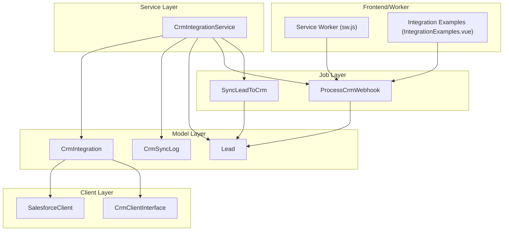

**Diagram sources**
- [CrmIntegrationService.php:24-547](file://app/Services/CrmIntegrationService.php#L24-L547)
- [CrmIntegration.php:8-211](file://app/Models/CrmIntegration.php#L8-L211)
- [CrmSyncLog.php:9-217](file://app/Models/CrmSyncLog.php#L9-L217)
- [Lead.php:11-226](file://app/Models/Lead.php#L11-L226)
- [ProcessCrmWebhook.php:13-328](file://app/Jobs/ProcessCrmWebhook.php#L13-L328)
- [SyncLeadToCrm.php:13-210](file://app/Jobs/SyncLeadToCrm.php#L13-L210)
- [SalesforceClient.php:7-215](file://app/Services/CRM/SalesforceClient.php#L7-L215)
- [CrmClientInterface.php:5-42](file://app/Services/CRM/CrmClientInterface.php#L5-L42)
- [sw.js:289-339](file://public/sw.js#L289-L339)
- [IntegrationExamples.vue:301-1037](file://resources/js/components/Developer/IntegrationExamples.vue#L301-L1037)

**Section sources**
- [CrmIntegrationService.php:1-547](file://app/Services/CrmIntegrationService.php#L1-L547)
- [CrmIntegration.php:1-211](file://app/Models/CrmIntegration.php#L1-L211)
- [CrmSyncLog.php:1-217](file://app/Models/CrmSyncLog.php#L1-L217)
- [Lead.php:1-226](file://app/Models/Lead.php#L1-L226)
- [ProcessCrmWebhook.php:1-328](file://app/Jobs/ProcessCrmWebhook.php#L1-L328)
- [SyncLeadToCrm.php:1-210](file://app/Jobs/SyncLeadToCrm.php#L1-L210)
- [SalesforceClient.php:1-215](file://app/Services/CRM/SalesforceClient.php#L1-L215)
- [CrmClientInterface.php:1-42](file://app/Services/CRM/CrmClientInterface.php#L1-L42)
- [sw.js:289-339](file://public/sw.js#L289-L339)
- [IntegrationExamples.vue:301-1037](file://resources/js/components/Developer/IntegrationExamples.vue#L301-L1037)

## Core Components
- CrmIntegrationService: Orchestrates bidirectional synchronization for leads, including create/update, pull updates, webhook processing, conflict resolution, retry logic, and status reporting.
- CrmIntegration: Stores integration configuration, provider selection, field mappings, and scheduling helpers.
- CrmSyncLog: Tracks each sync operation with status, retries, durations, and error messages.
- Lead: Core entity for contacts/leads with CRM identifiers and timestamps.
- ProcessCrmWebhook: Asynchronous job to handle CRM webhook events (created/updated/deleted, deal won/lost).
- SyncLeadToCrm: Batch job to synchronize a single lead to CRM with retries and logging.
- SalesforceClient and CrmClientInterface: Abstraction for CRM operations and provider-specific implementations.

**Section sources**
- [CrmIntegrationService.php:24-547](file://app/Services/CrmIntegrationService.php#L24-L547)
- [CrmIntegration.php:8-211](file://app/Models/CrmIntegration.php#L8-L211)
- [CrmSyncLog.php:9-217](file://app/Models/CrmSyncLog.php#L9-L217)
- [Lead.php:11-226](file://app/Models/Lead.php#L11-L226)
- [ProcessCrmWebhook.php:13-328](file://app/Jobs/ProcessCrmWebhook.php#L13-L328)
- [SyncLeadToCrm.php:13-210](file://app/Jobs/SyncLeadToCrm.php#L13-L210)
- [SalesforceClient.php:7-215](file://app/Services/CRM/SalesforceClient.php#L7-L215)
- [CrmClientInterface.php:5-42](file://app/Services/CRM/CrmClientInterface.php#L5-L42)

## Architecture Overview
The system supports bidirectional synchronization across multiple CRM providers. It uses:
- Field mapping configurations per integration
- Queued jobs for reliability and scalability
- Webhooks for near real-time updates
- Logs and metrics for monitoring and recovery

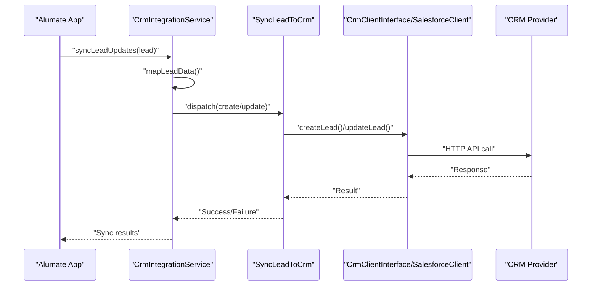

**Diagram sources**
- [CrmIntegrationService.php:92-164](file://app/Services/CrmIntegrationService.php#L92-L164)
- [SyncLeadToCrm.php:34-120](file://app/Jobs/SyncLeadToCrm.php#L34-L120)
- [SalesforceClient.php:42-78](file://app/Services/CRM/SalesforceClient.php#L42-L78)
- [CrmClientInterface.php:14-20](file://app/Services/CRM/CrmClientInterface.php#L14-L20)

**Section sources**
- [CrmIntegrationService.php:92-164](file://app/Services/CrmIntegrationService.php#L92-L164)
- [SyncLeadToCrm.php:34-120](file://app/Jobs/SyncLeadToCrm.php#L34-L120)
- [SalesforceClient.php:42-78](file://app/Services/CRM/SalesforceClient.php#L42-L78)
- [CrmClientInterface.php:14-20](file://app/Services/CRM/CrmClientInterface.php#L14-L20)

## Detailed Component Analysis

### Lead Synchronization Orchestration
- Create or update leads in CRM based on presence of crm_id
- Map fields using integration field_mappings
- Record outcomes in CrmSyncLog
- Prefer local data in conflict resolution

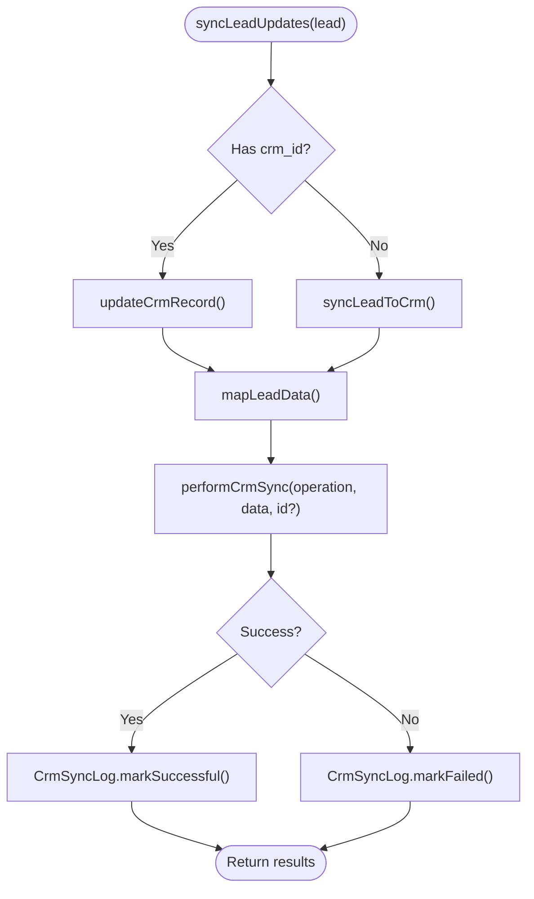

**Diagram sources**
- [CrmIntegrationService.php:92-164](file://app/Services/CrmIntegrationService.php#L92-L164)
- [CrmIntegrationService.php:425-457](file://app/Services/CrmIntegrationService.php#L425-L457)

**Section sources**
- [CrmIntegrationService.php:92-164](file://app/Services/CrmIntegrationService.php#L92-L164)
- [CrmIntegrationService.php:373-420](file://app/Services/CrmIntegrationService.php#L373-L420)
- [CrmIntegrationService.php:425-457](file://app/Services/CrmIntegrationService.php#L425-L457)

### Webhook Processing for Real-Time Updates
- Validates webhook signature against integration settings
- Queues ProcessCrmWebhook for asynchronous handling
- Supports events: lead/contact created/updated/deleted, deal won/lost
- Maps CRM fields to Lead attributes and maintains audit trail

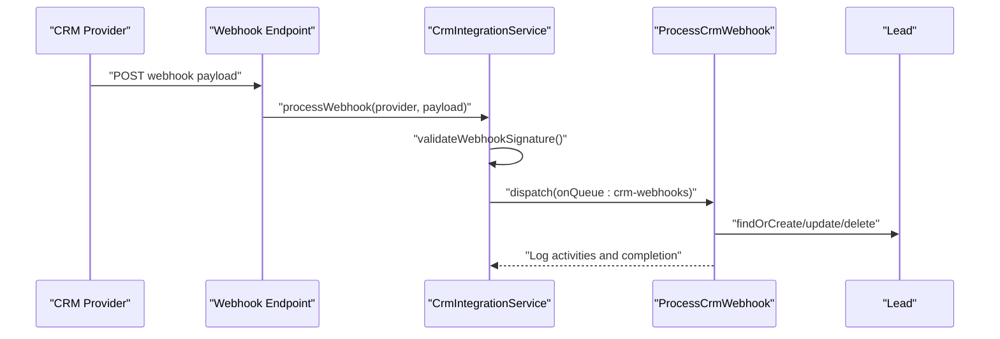

**Diagram sources**
- [CrmIntegrationService.php:218-252](file://app/Services/CrmIntegrationService.php#L218-L252)
- [ProcessCrmWebhook.php:33-98](file://app/Jobs/ProcessCrmWebhook.php#L33-L98)
- [ProcessCrmWebhook.php:103-281](file://app/Jobs/ProcessCrmWebhook.php#L103-L281)

**Section sources**
- [CrmIntegrationService.php:218-252](file://app/Services/CrmIntegrationService.php#L218-L252)
- [ProcessCrmWebhook.php:33-98](file://app/Jobs/ProcessCrmWebhook.php#L33-L98)
- [ProcessCrmWebhook.php:103-281](file://app/Jobs/ProcessCrmWebhook.php#L103-L281)

### Batch Synchronization Jobs
- SyncLeadToCrm: Handles create/update with exponential backoff and retry counts
- Records integration sync results and lead activities
- Supports default field mappings and custom field_mappings

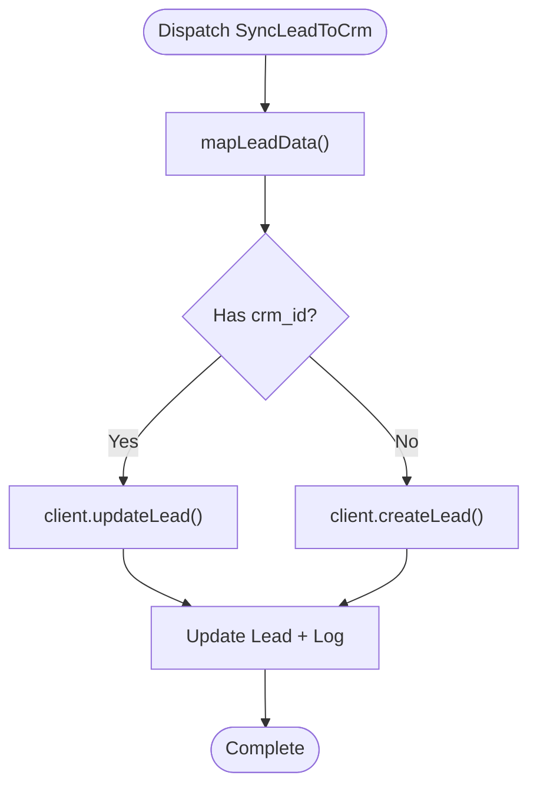

**Diagram sources**
- [SyncLeadToCrm.php:34-120](file://app/Jobs/SyncLeadToCrm.php#L34-L120)
- [SyncLeadToCrm.php:125-180](file://app/Jobs/SyncLeadToCrm.php#L125-L180)

**Section sources**
- [SyncLeadToCrm.php:34-120](file://app/Jobs/SyncLeadToCrm.php#L34-L120)
- [SyncLeadToCrm.php:125-180](file://app/Jobs/SyncLeadToCrm.php#L125-L180)

### Conflict Resolution Mechanisms
- Detects conflicts by comparing local vs external timestamps
- Resolves by preferring local data and logs resolution decisions
- Provides structured conflict logs for auditing

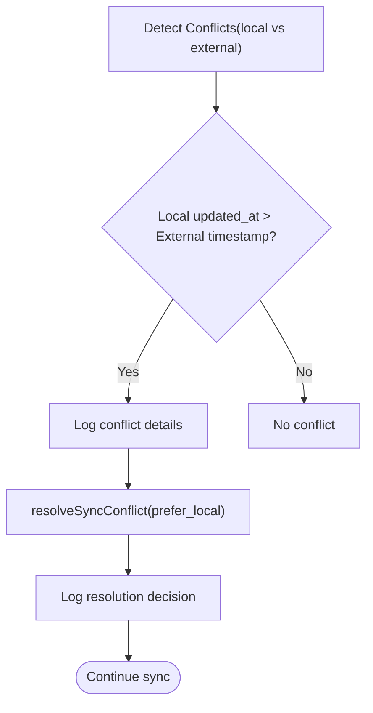

**Diagram sources**
- [CrmIntegrationService.php:257-289](file://app/Services/CrmIntegrationService.php#L257-L289)

**Section sources**
- [CrmIntegrationService.php:257-289](file://app/Services/CrmIntegrationService.php#L257-L289)

### Update Detection and Incremental Sync
- Pull recent updates from CRM and apply to Lead records
- Uses integration scopes to determine when sync is due
- Maintains last_sync_at and sync_interval for incremental cadence

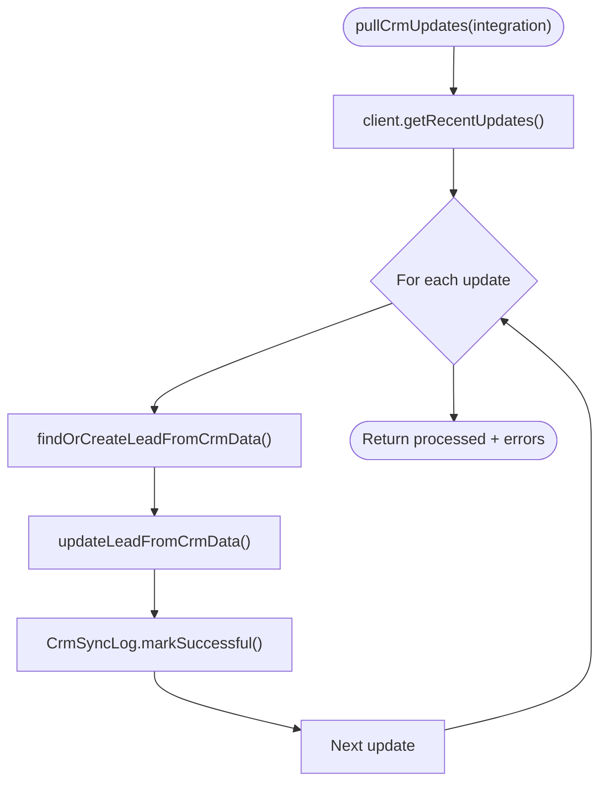

**Diagram sources**
- [CrmIntegrationService.php:169-213](file://app/Services/CrmIntegrationService.php#L169-L213)
- [CrmIntegration.php:170-181](file://app/Models/CrmIntegration.php#L170-L181)

**Section sources**
- [CrmIntegrationService.php:169-213](file://app/Services/CrmIntegrationService.php#L169-L213)
- [CrmIntegration.php:170-181](file://app/Models/CrmIntegration.php#L170-L181)

### Data Mapping Rules
- Field mappings are configured per integration
- Default mappings cover common CRM fields (firstname, lastname, email, phone, company, jobtitle)
- CRM-specific field mapping transforms are applied during create/update

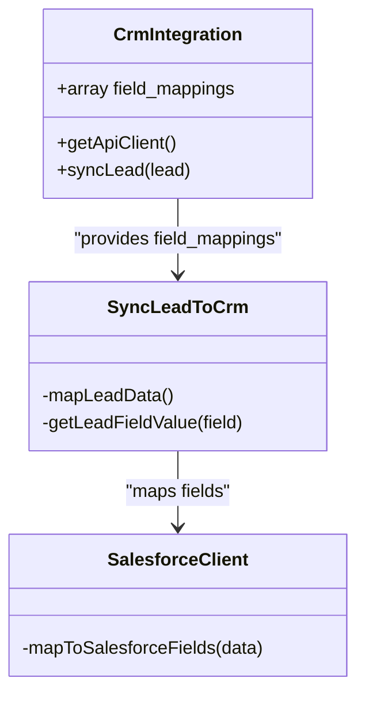

**Diagram sources**
- [CrmIntegration.php:123-154](file://app/Models/CrmIntegration.php#L123-L154)
- [SyncLeadToCrm.php:125-180](file://app/Jobs/SyncLeadToCrm.php#L125-L180)
- [SalesforceClient.php:192-213](file://app/Services/CRM/SalesforceClient.php#L192-L213)

**Section sources**
- [CrmIntegration.php:123-154](file://app/Models/CrmIntegration.php#L123-L154)
- [SyncLeadToCrm.php:125-180](file://app/Jobs/SyncLeadToCrm.php#L125-L180)
- [SalesforceClient.php:192-213](file://app/Services/CRM/SalesforceClient.php#L192-L213)

### Error Recovery Procedures
- Jobs use tries and backoff strategies
- CrmSyncLog tracks retry_count and canRetry scope
- Permanent failures are logged and surfaced via lead activities

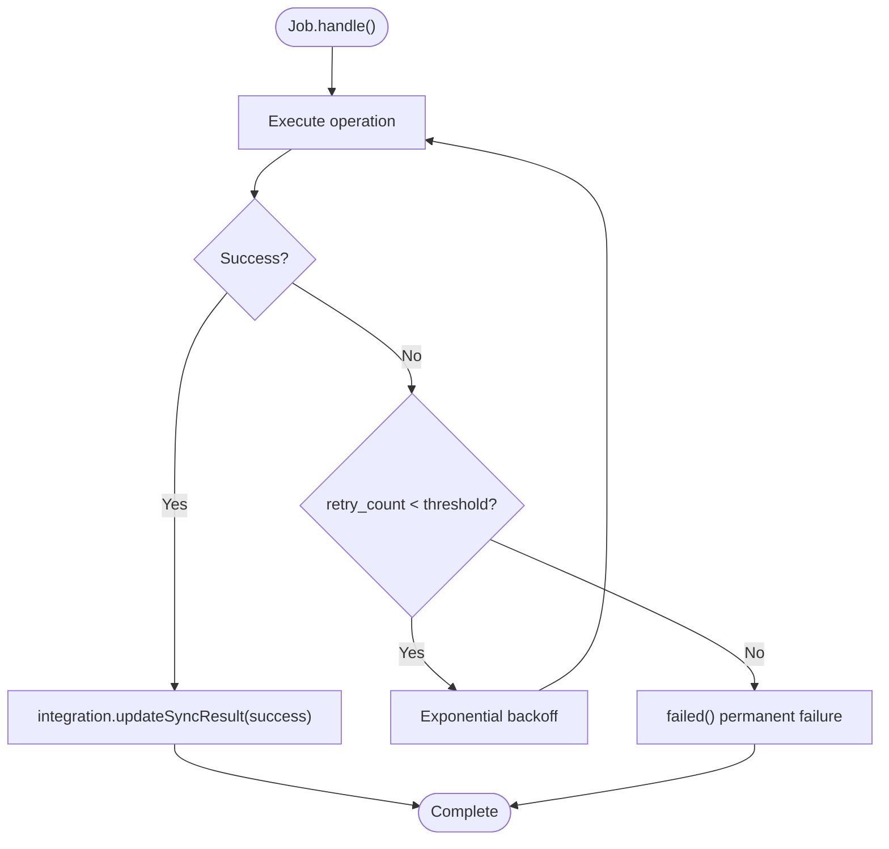

**Diagram sources**
- [SyncLeadToCrm.php:17-19](file://app/Jobs/SyncLeadToCrm.php#L17-L19)
- [CrmSyncLog.php:152-163](file://app/Models/CrmSyncLog.php#L152-L163)
- [SyncLeadToCrm.php:185-210](file://app/Jobs/SyncLeadToCrm.php#L185-L210)

**Section sources**
- [SyncLeadToCrm.php:17-19](file://app/Jobs/SyncLeadToCrm.php#L17-L19)
- [CrmSyncLog.php:152-163](file://app/Models/CrmSyncLog.php#L152-L163)
- [SyncLeadToCrm.php:185-210](file://app/Jobs/SyncLeadToCrm.php#L185-L210)

### Sync Logging, Audit Trails, and Monitoring
- CrmSyncLog captures sync_type, status, error_message, retry_count, and durations
- Lead activities record CRM operations and failures
- Integration model stores last_sync_at and last_sync_result
- Status aggregation provides total, successful, failed, pending, retryable counts

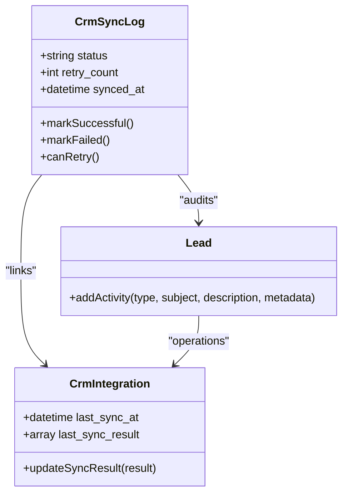

**Diagram sources**
- [CrmSyncLog.php:168-188](file://app/Models/CrmSyncLog.php#L168-L188)
- [CrmSyncLog.php:152-163](file://app/Models/CrmSyncLog.php#L152-L163)
- [Lead.php:148-157](file://app/Models/Lead.php#L148-L157)
- [CrmIntegration.php:159-165](file://app/Models/CrmIntegration.php#L159-L165)
- [CrmIntegrationService.php:294-313](file://app/Services/CrmIntegrationService.php#L294-L313)

**Section sources**
- [CrmSyncLog.php:168-188](file://app/Models/CrmSyncLog.php#L168-L188)
- [CrmSyncLog.php:152-163](file://app/Models/CrmSyncLog.php#L152-L163)
- [Lead.php:148-157](file://app/Models/Lead.php#L148-L157)
- [CrmIntegration.php:159-165](file://app/Models/CrmIntegration.php#L159-L165)
- [CrmIntegrationService.php:294-313](file://app/Services/CrmIntegrationService.php#L294-L313)

### Background Sync and Offline Handling (Service Worker)
- Service worker performs periodic background sync
- Processes queued offline actions and notifies clients
- Supports robustness for intermittent connectivity

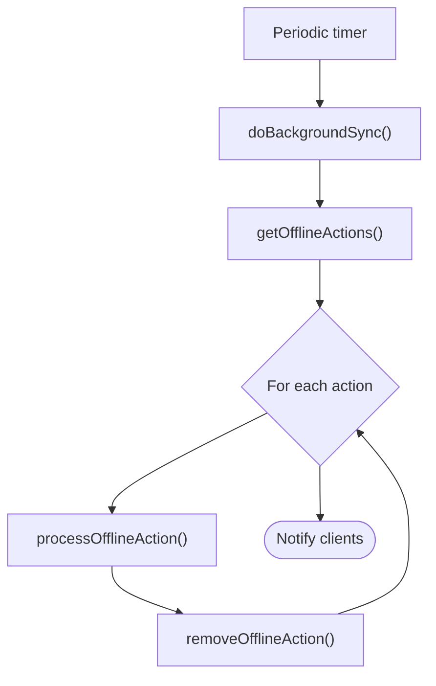

**Diagram sources**
- [sw.js:289-339](file://public/sw.js#L289-L339)

**Section sources**
- [sw.js:289-339](file://public/sw.js#L289-L339)

### Webhook Security and Delivery
- Signature verification for incoming webhooks
- Delivery reliability with retry and failure handling
- Monitoring and debugging support

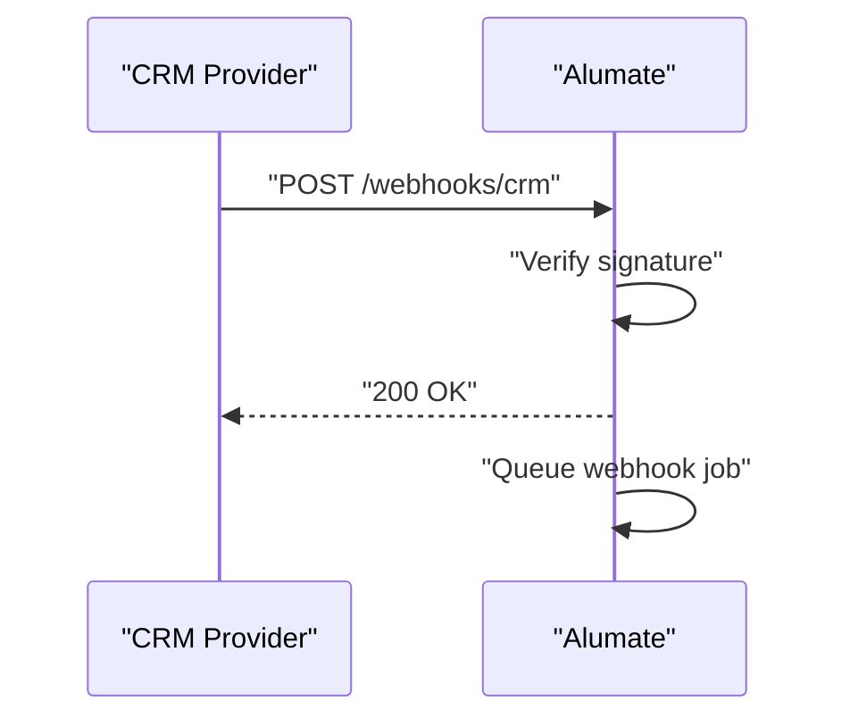

**Diagram sources**
- [IntegrationExamples.vue:301-343](file://resources/js/components/Developer/IntegrationExamples.vue#L301-L343)
- [CrmIntegrationService.php:218-252](file://app/Services/CrmIntegrationService.php#L218-L252)

**Section sources**
- [IntegrationExamples.vue:301-343](file://resources/js/components/Developer/IntegrationExamples.vue#L301-L343)
- [CrmIntegrationService.php:218-252](file://app/Services/CrmIntegrationService.php#L218-L252)

## Dependency Analysis
- CrmIntegrationService depends on CrmIntegration, CrmSyncLog, Lead, and job dispatching
- CrmIntegration selects provider-specific clients implementing CrmClientInterface
- ProcessCrmWebhook and SyncLeadToCrm depend on Lead and CrmIntegration
- Clients encapsulate provider-specific HTTP operations

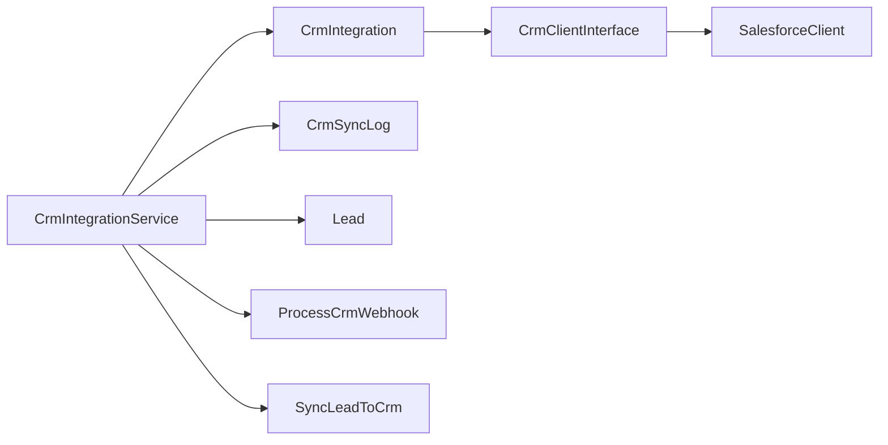

**Diagram sources**
- [CrmIntegrationService.php:5-16](file://app/Services/CrmIntegrationService.php#L5-L16)
- [CrmIntegration.php:34-54](file://app/Models/CrmIntegration.php#L34-L54)
- [CrmClientInterface.php:5-42](file://app/Services/CRM/CrmClientInterface.php#L5-L42)
- [SalesforceClient.php:7-215](file://app/Services/CRM/SalesforceClient.php#L7-L215)

**Section sources**
- [CrmIntegrationService.php:5-16](file://app/Services/CrmIntegrationService.php#L5-L16)
- [CrmIntegration.php:34-54](file://app/Models/CrmIntegration.php#L34-L54)
- [CrmClientInterface.php:5-42](file://app/Services/CRM/CrmClientInterface.php#L5-L42)
- [SalesforceClient.php:7-215](file://app/Services/CRM/SalesforceClient.php#L7-L215)

## Performance Considerations
- Use field_mappings to minimize unnecessary transformations
- Employ queues with backoff to avoid provider rate limits
- Batch operations where supported by CRM APIs
- Monitor CrmSyncLog average duration and retryable counts for capacity planning
- Consider partitioning large datasets and incremental sync windows

[No sources needed since this section provides general guidance]

## Troubleshooting Guide
- Check CrmSyncLog for failed entries, error_message, and retry_count
- Review Lead activities for CRM sync events and failures
- Validate integration configuration and field_mappings
- Inspect webhook delivery logs and signatures
- Use retryFailedSyncs to reattempt failed operations

**Section sources**
- [CrmSyncLog.php:95-123](file://app/Models/CrmSyncLog.php#L95-L123)
- [CrmIntegrationService.php:318-353](file://app/Services/CrmIntegrationService.php#L318-L353)
- [ProcessCrmWebhook.php:319-327](file://app/Jobs/ProcessCrmWebhook.php#L319-L327)

## Conclusion
The bidirectional synchronization system integrates seamlessly with multiple CRM providers through a flexible field-mapping strategy, robust job processing, and comprehensive logging. It supports real-time webhook updates, incremental pulls, conflict resolution, and resilient error recovery. With clear audit trails and monitoring capabilities, it ensures data integrity and operational visibility across Alumate and CRM platforms.

[No sources needed since this section summarizes without analyzing specific files]

## Appendices

### Configuration and Best Practices
- Configure sync direction and interval per integration
- Define field_mappings aligned with target CRM schema
- Set appropriate queue priorities for webhook and CRM jobs
- Monitor sync status and set alerts for retryable failures

**Section sources**
- [CrmIntegration.php:170-181](file://app/Models/CrmIntegration.php#L170-L181)
- [CrmIntegrationService.php:294-313](file://app/Services/CrmIntegrationService.php#L294-L313)

### Data Consistency Strategies
- Prefer local data in conflicts for authoritative source control
- Use timestamps and last_sync_at to guide incremental updates
- Maintain soft deletes and audit logs for traceability

**Section sources**
- [CrmIntegrationService.php:257-289](file://app/Services/CrmIntegrationService.php#L257-L289)
- [CrmIntegration.php:170-181](file://app/Models/CrmIntegration.php#L170-L181)
- [Lead.php:148-157](file://app/Models/Lead.php#L148-L157)

### Security and Audit
- Implement webhook signature verification
- Maintain audit logs and compliance-ready trails
- Monitor security events and performance metrics

**Section sources**
- [IntegrationExamples.vue:333-343](file://resources/js/components/Developer/IntegrationExamples.vue#L333-L343)
- [task-12-security-audit-system-recap.md:395-427](file://docs/task-12-security-audit-system-recap.md#L395-L427)