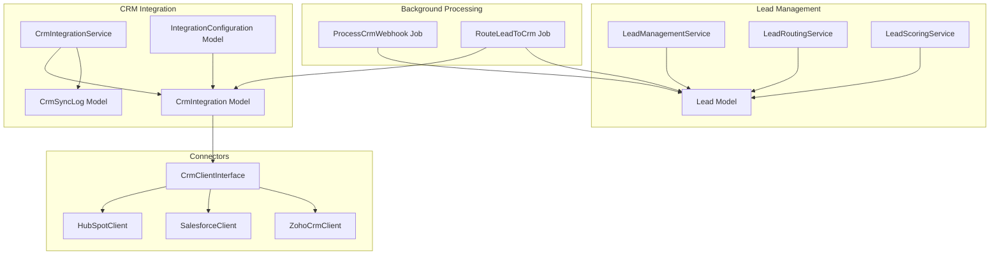
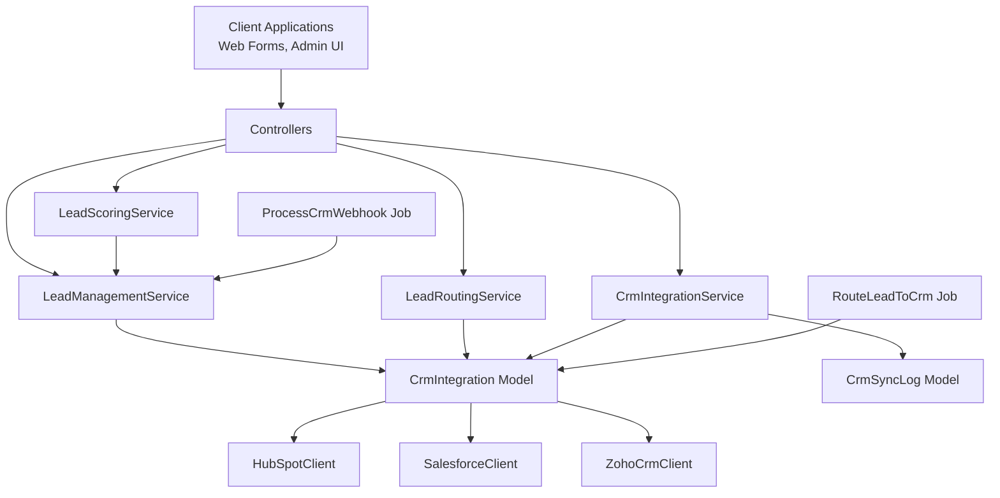
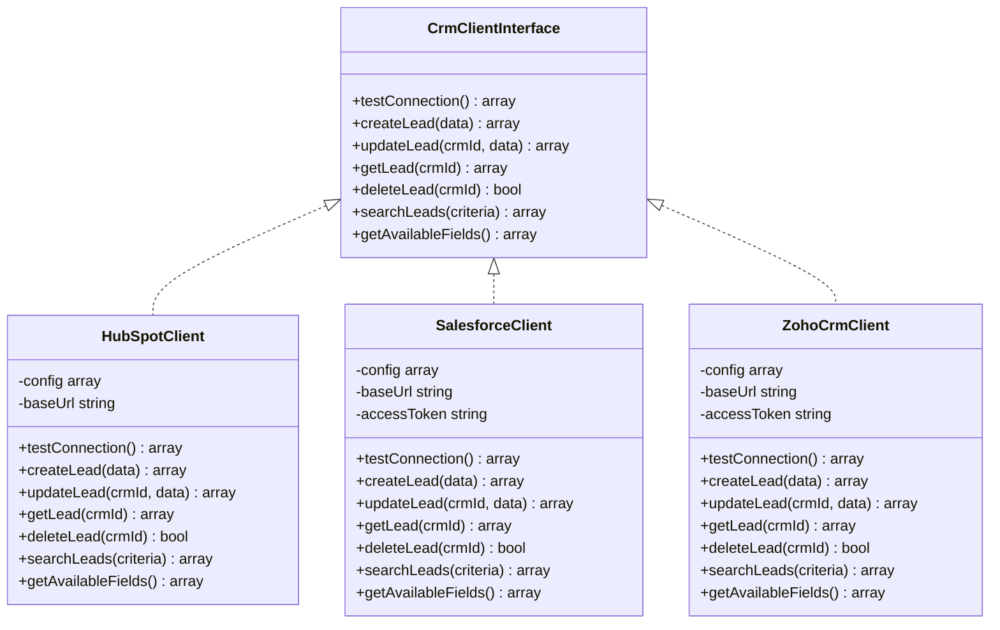
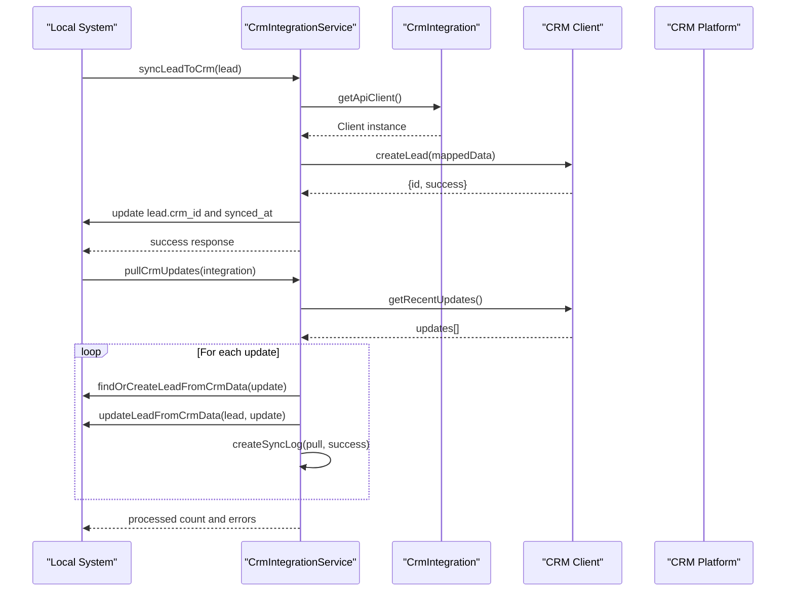
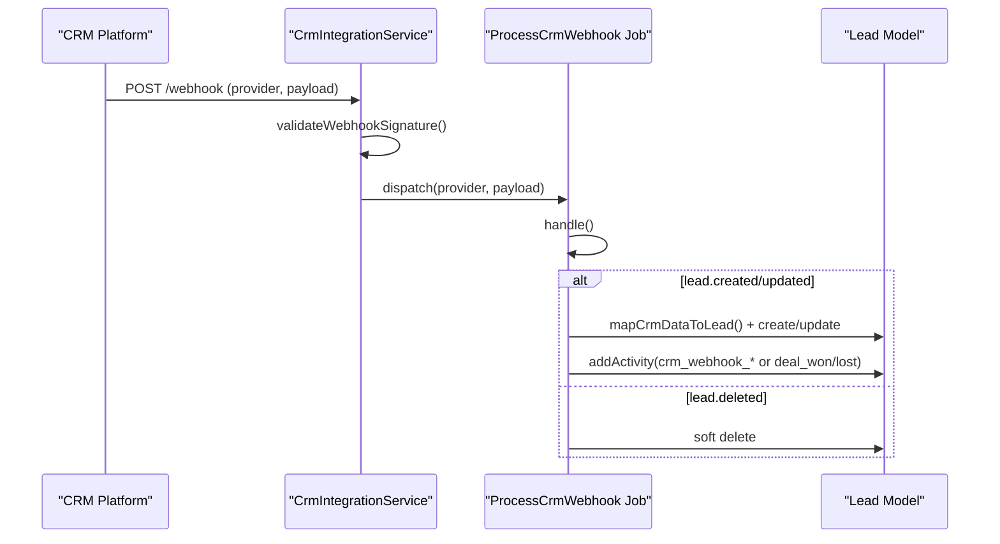
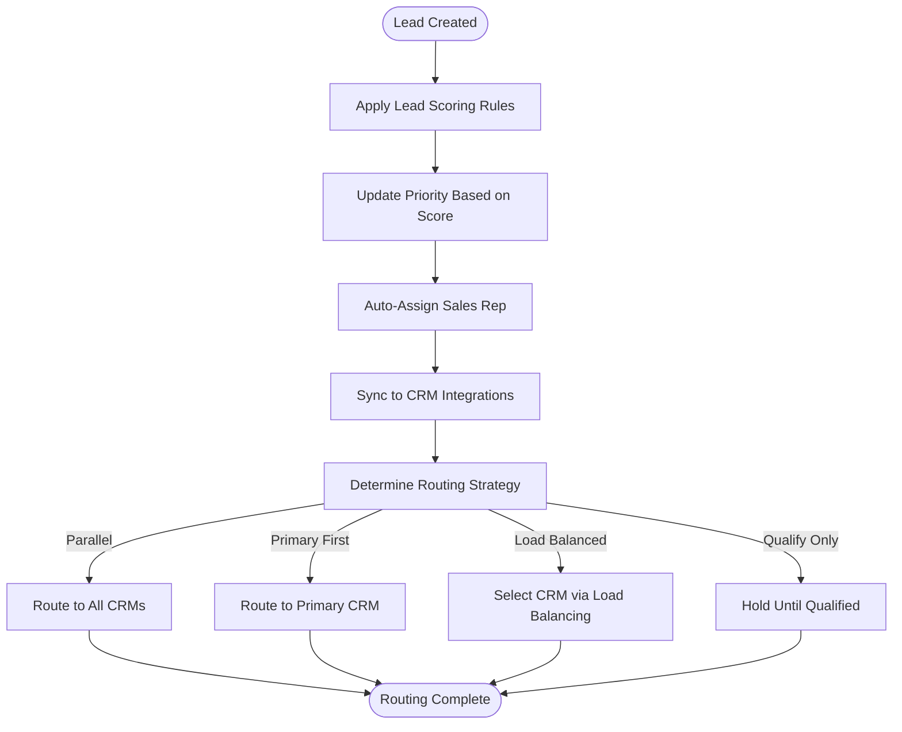
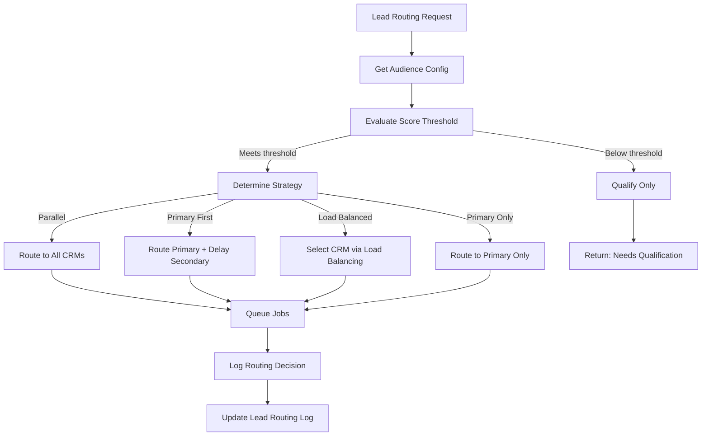
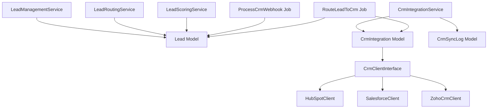

# CRM Integration System

<cite>
**Referenced Files in This Document**
- [CrmIntegrationService.php](file://app/Services/CrmIntegrationService.php)
- [CrmIntegration.php](file://app/Models/CrmIntegration.php)
- [CrmSyncLog.php](file://app/Models/CrmSyncLog.php)
- [ProcessCrmWebhook.php](file://app/Jobs/ProcessCrmWebhook.php)
- [LeadManagementService.php](file://app/Services/LeadManagementService.php)
- [LeadRoutingService.php](file://app/Services/LeadRoutingService.php)
- [LeadScoringService.php](file://app/Services/LeadScoringService.php)
- [Lead.php](file://app/Models/Lead.php)
- [LeadScoringRule.php](file://app/Models/LeadScoringRule.php)
- [RouteLeadToCrm.php](file://app/Jobs/RouteLeadToCrm.php)
- [CrmClientInterface.php](file://app/Services/CRM/CrmClientInterface.php)
- [HubSpotClient.php](file://app/Services/CRM/HubSpotClient.php)
- [SalesforceClient.php](file://app/Services/CRM/SalesforceClient.php)
- [ZohoCrmClient.php](file://app/Services/CRM/ZohoCrmClient.php)
- [IntegrationConfiguration.php](file://app/Models/IntegrationConfiguration.php)
</cite>

## Table of Contents
1. [Introduction](#introduction)
2. [Project Structure](#project-structure)
3. [Core Components](#core-components)
4. [Architecture Overview](#architecture-overview)
5. [Detailed Component Analysis](#detailed-component-analysis)
6. [Dependency Analysis](#dependency-analysis)
7. [Performance Considerations](#performance-considerations)
8. [Troubleshooting Guide](#troubleshooting-guide)
9. [Conclusion](#conclusion)
10. [Appendices](#appendices)

## Introduction
This document describes the CRM integration system designed to support multi-platform connectivity, lead management, and bidirectional synchronization across CRM platforms including HubSpot, Salesforce, Zoho, and others. It explains the connector architecture, lead capture and scoring, routing and qualification workflows, bidirectional synchronization, webhook processing, automation rules, and integration monitoring. Practical setup workflows and integration scenarios are included to guide administrators and developers through configuration and operational tasks.

## Project Structure
The CRM integration system is organized around several core services and models:
- CRM connectors: Provider-specific clients implementing a common interface
- Integration orchestration: Services coordinating synchronization, routing, and scoring
- Data models: Eloquent models representing leads, integrations, and sync logs
- Background jobs: Queue-based processing for webhooks and CRM routing
- Configuration: Integration configuration and field mapping definitions

**Diagram sources**
- [CrmIntegrationService.php:24-547](file://app/Services/CrmIntegrationService.php#L24-L547)
- [CrmIntegration.php:8-211](file://app/Models/CrmIntegration.php#L8-L211)
- [CrmSyncLog.php:9-217](file://app/Models/CrmSyncLog.php#L9-L217)
- [ProcessCrmWebhook.php:13-328](file://app/Jobs/ProcessCrmWebhook.php#L13-L328)
- [LeadManagementService.php:12-453](file://app/Services/LeadManagementService.php#L12-L453)
- [LeadRoutingService.php:21-512](file://app/Services/LeadRoutingService.php#L21-L512)
- [LeadScoringService.php:17-497](file://app/Services/LeadScoringService.php#L17-L497)
- [Lead.php:11-226](file://app/Models/Lead.php#L11-L226)
- [CrmClientInterface.php:5-42](file://app/Services/CRM/CrmClientInterface.php#L5-L42)
- [HubSpotClient.php:7-174](file://app/Services/CRM/HubSpotClient.php#L7-L174)
- [SalesforceClient.php:7-215](file://app/Services/CRM/SalesforceClient.php#L7-L215)
- [ZohoCrmClient.php:7-242](file://app/Services/CRM/ZohoCrmClient.php#L7-L242)
- [IntegrationConfiguration.php:10-312](file://app/Models/IntegrationConfiguration.php#L10-L312)

**Section sources**
- [CrmIntegrationService.php:24-547](file://app/Services/CrmIntegrationService.php#L24-L547)
- [CrmIntegration.php:8-211](file://app/Models/CrmIntegration.php#L8-L211)
- [CrmSyncLog.php:9-217](file://app/Models/CrmSyncLog.php#L9-L217)
- [ProcessCrmWebhook.php:13-328](file://app/Jobs/ProcessCrmWebhook.php#L13-L328)
- [LeadManagementService.php:12-453](file://app/Services/LeadManagementService.php#L12-L453)
- [LeadRoutingService.php:21-512](file://app/Services/LeadRoutingService.php#L21-L512)
- [LeadScoringService.php:17-497](file://app/Services/LeadScoringService.php#L17-L497)
- [Lead.php:11-226](file://app/Models/Lead.php#L11-L226)
- [CrmClientInterface.php:5-42](file://app/Services/CRM/CrmClientInterface.php#L5-L42)
- [HubSpotClient.php:7-174](file://app/Services/CRM/HubSpotClient.php#L7-L174)
- [SalesforceClient.php:7-215](file://app/Services/CRM/SalesforceClient.php#L7-L215)
- [ZohoCrmClient.php:7-242](file://app/Services/CRM/ZohoCrmClient.php#L7-L242)
- [IntegrationConfiguration.php:10-312](file://app/Models/IntegrationConfiguration.php#L10-L312)

## Core Components
- CRM Integration Service: Orchestrates bidirectional synchronization, webhook processing, conflict resolution, and sync status reporting.
- CRM Integration Model: Manages provider selection, field mapping, connection testing, and sync scheduling.
- CRM Sync Log Model: Tracks sync outcomes, retries, durations, and tenant scoping for multi-tenancy.
- CRM Client Interface and Implementations: Standardized API for HubSpot, Salesforce, Zoho, and extensible to others.
- Lead Management Service: Creates leads, applies scoring rules, auto-assigns, qualifies, and syncs to CRM.
- Lead Routing Service: Routes leads to multiple CRMs based on audience type, score thresholds, and custom rules.
- Lead Scoring Service: Computes scores from engagement events, enforces daily caps, applies decay, and maintains analytics.
- Webhook Processing Job: Processes inbound CRM events asynchronously with retry/backoff and activity logging.
- Integration Configuration Model: Stores provider credentials, field mappings, webhook settings, and sync configurations.

**Section sources**
- [CrmIntegrationService.php:24-547](file://app/Services/CrmIntegrationService.php#L24-L547)
- [CrmIntegration.php:8-211](file://app/Models/CrmIntegration.php#L8-L211)
- [CrmSyncLog.php:9-217](file://app/Models/CrmSyncLog.php#L9-L217)
- [CrmClientInterface.php:5-42](file://app/Services/CRM/CrmClientInterface.php#L5-L42)
- [HubSpotClient.php:7-174](file://app/Services/CRM/HubSpotClient.php#L7-L174)
- [SalesforceClient.php:7-215](file://app/Services/CRM/SalesforceClient.php#L7-L215)
- [ZohoCrmClient.php:7-242](file://app/Services/CRM/ZohoCrmClient.php#L7-L242)
- [LeadManagementService.php:12-453](file://app/Services/LeadManagementService.php#L12-L453)
- [LeadRoutingService.php:21-512](file://app/Services/LeadRoutingService.php#L21-L512)
- [LeadScoringService.php:17-497](file://app/Services/LeadScoringService.php#L17-L497)
- [ProcessCrmWebhook.php:13-328](file://app/Jobs/ProcessCrmWebhook.php#L13-L328)
- [IntegrationConfiguration.php:10-312](file://app/Models/IntegrationConfiguration.php#L10-L312)

## Architecture Overview
The system follows a layered architecture:
- Presentation/Orchestration Layer: Controllers and services coordinate workflows
- Business Logic Layer: Lead management, routing, scoring, and CRM integration services
- Data Access Layer: Eloquent models and repositories for CRM integrations and logs
- External Systems Layer: CRM APIs accessed via provider-specific clients
- Background Processing Layer: Queues handle asynchronous operations (webhooks, routing, retries)

**Diagram sources**
- [LeadManagementService.php:12-453](file://app/Services/LeadManagementService.php#L12-L453)
- [LeadRoutingService.php:21-512](file://app/Services/LeadRoutingService.php#L21-L512)
- [LeadScoringService.php:17-497](file://app/Services/LeadScoringService.php#L17-L497)
- [CrmIntegrationService.php:24-547](file://app/Services/CrmIntegrationService.php#L24-L547)
- [CrmIntegration.php:8-211](file://app/Models/CrmIntegration.php#L8-L211)
- [CrmSyncLog.php:9-217](file://app/Models/CrmSyncLog.php#L9-L217)
- [HubSpotClient.php:7-174](file://app/Services/CRM/HubSpotClient.php#L7-L174)
- [SalesforceClient.php:7-215](file://app/Services/CRM/SalesforceClient.php#L7-L215)
- [ZohoCrmClient.php:7-242](file://app/Services/CRM/ZohoCrmClient.php#L7-L242)
- [ProcessCrmWebhook.php:13-328](file://app/Jobs/ProcessCrmWebhook.php#L13-L328)
- [RouteLeadToCrm.php:20-245](file://app/Jobs/RouteLeadToCrm.php#L20-L245)

## Detailed Component Analysis

### CRM Connector Architecture
The connector architecture supports multiple CRM providers through a common interface and provider-specific implementations. The integration model dynamically selects the appropriate client based on provider configuration.

**Diagram sources**
- [CrmClientInterface.php:5-42](file://app/Services/CRM/CrmClientInterface.php#L5-L42)
- [HubSpotClient.php:7-174](file://app/Services/CRM/HubSpotClient.php#L7-L174)
- [SalesforceClient.php:7-215](file://app/Services/CRM/SalesforceClient.php#L7-L215)
- [ZohoCrmClient.php:7-242](file://app/Services/CRM/ZohoCrmClient.php#L7-L242)

**Section sources**
- [CrmClientInterface.php:5-42](file://app/Services/CRM/CrmClientInterface.php#L5-L42)
- [HubSpotClient.php:7-174](file://app/Services/CRM/HubSpotClient.php#L7-L174)
- [SalesforceClient.php:7-215](file://app/Services/CRM/SalesforceClient.php#L7-L215)
- [ZohoCrmClient.php:7-242](file://app/Services/CRM/ZohoCrmClient.php#L7-L242)

### Bidirectional Synchronization
Bidirectional synchronization ensures data consistency across platforms by:
- Creating/updating leads in CRM on local changes
- Pulling updates from CRM and updating local leads
- Maintaining sync logs with status, errors, and retry counts
- Resolving conflicts by preferring local data when discrepancies occur

**Diagram sources**
- [CrmIntegrationService.php:29-213](file://app/Services/CrmIntegrationService.php#L29-L213)
- [CrmIntegration.php:34-118](file://app/Models/CrmIntegration.php#L34-L118)

**Section sources**
- [CrmIntegrationService.php:29-213](file://app/Services/CrmIntegrationService.php#L29-L213)
- [CrmIntegration.php:34-118](file://app/Models/CrmIntegration.php#L34-L118)

### Webhook Processing
Webhook processing enables real-time updates from CRM platforms:
- Validates webhook signatures
- Queues processing jobs with retry/backoff
- Handles create/update/delete events
- Logs activities and updates lead status accordingly

**Diagram sources**
- [CrmIntegrationService.php:218-252](file://app/Services/CrmIntegrationService.php#L218-L252)
- [ProcessCrmWebhook.php:33-98](file://app/Jobs/ProcessCrmWebhook.php#L33-L98)
- [ProcessCrmWebhook.php:103-281](file://app/Jobs/ProcessCrmWebhook.php#L103-L281)

**Section sources**
- [CrmIntegrationService.php:218-252](file://app/Services/CrmIntegrationService.php#L218-L252)
- [ProcessCrmWebhook.php:33-98](file://app/Jobs/ProcessCrmWebhook.php#L33-L98)
- [ProcessCrmWebhook.php:103-281](file://app/Jobs/ProcessCrmWebhook.php#L103-L281)

### Lead Management Automation
Lead management automation covers capture, scoring, routing, and qualification:
- Capture: Lead creation from forms with UTM and behavioral data
- Scoring: Rule-based scoring with daily caps and decay
- Routing: Multi-CRM routing based on audience type and score thresholds
- Qualification: Status updates and CRM sync upon qualification

**Diagram sources**
- [LeadManagementService.php:17-53](file://app/Services/LeadManagementService.php#L17-L53)
- [LeadManagementService.php:58-84](file://app/Services/LeadManagementService.php#L58-L84)
- [LeadRoutingService.php:169-199](file://app/Services/LeadRoutingService.php#L169-L199)
- [LeadRoutingService.php:204-256](file://app/Services/LeadRoutingService.php#L204-L256)

**Section sources**
- [LeadManagementService.php:17-53](file://app/Services/LeadManagementService.php#L17-L53)
- [LeadManagementService.php:58-84](file://app/Services/LeadManagementService.php#L58-L84)
- [LeadRoutingService.php:169-199](file://app/Services/LeadRoutingService.php#L169-L199)
- [LeadRoutingService.php:204-256](file://app/Services/LeadRoutingService.php#L204-L256)

### Lead Routing Algorithms
Routing algorithms consider:
- Audience type with predefined preferred/secondary CRMs
- Score thresholds to qualify leads before routing
- Strategies: parallel, primary-first, load-balanced, qualify-only
- Custom rules evaluation for exceptions
- Delayed routing for secondary CRM follow-ups

**Diagram sources**
- [LeadRoutingService.php:26-72](file://app/Services/LeadRoutingService.php#L26-L72)
- [LeadRoutingService.php:128-164](file://app/Services/LeadRoutingService.php#L128-L164)
- [LeadRoutingService.php:169-199](file://app/Services/LeadRoutingService.php#L169-L199)
- [LeadRoutingService.php:204-256](file://app/Services/LeadRoutingService.php#L204-L256)

**Section sources**
- [LeadRoutingService.php:26-72](file://app/Services/LeadRoutingService.php#L26-L72)
- [LeadRoutingService.php:128-164](file://app/Services/LeadRoutingService.php#L128-L164)
- [LeadRoutingService.php:169-199](file://app/Services/LeadRoutingService.php#L169-L199)
- [LeadRoutingService.php:204-256](file://app/Services/LeadRoutingService.php#L204-L256)

### CRM Data Mapping and Field Mappings
Field mappings define how local lead attributes correspond to CRM fields:
- Local-to-CRM mapping stored per integration
- Provider-specific field name transformations
- Reverse mapping for incoming CRM data to local attributes
- Common CRM field variations handled during webhook processing

**Section sources**
- [CrmIntegration.php:123-154](file://app/Models/CrmIntegration.php#L123-L154)
- [CrmIntegrationService.php:373-420](file://app/Services/CrmIntegrationService.php#L373-L420)
- [ProcessCrmWebhook.php:286-314](file://app/Jobs/ProcessCrmWebhook.php#L286-L314)

### Integration Monitoring and Retry Strategy
Monitoring and reliability features include:
- Sync logs with status, error messages, retry counts, and durations
- Retryable sync scope with up to three attempts
- Tenant scoping for multi-tenancy isolation
- Integration health checks and connection testing
- Job-level retries with exponential backoff

**Section sources**
- [CrmSyncLog.php:63-123](file://app/Models/CrmSyncLog.php#L63-L123)
- [CrmIntegrationService.php:318-353](file://app/Services/CrmIntegrationService.php#L318-L353)
- [CrmIntegration.php:59-77](file://app/Models/CrmIntegration.php#L59-L77)
- [RouteLeadToCrm.php:24-25](file://app/Jobs/RouteLeadToCrm.php#L24-L25)

## Dependency Analysis
The system exhibits clear separation of concerns with low coupling between components:
- Services depend on models and jobs but not on each other directly
- CRM clients implement a shared interface, enabling easy extension
- Queue jobs encapsulate side effects and retries
- Models provide tenant scoping and relationship definitions

**Diagram sources**
- [LeadManagementService.php:12-453](file://app/Services/LeadManagementService.php#L12-L453)
- [LeadRoutingService.php:21-512](file://app/Services/LeadRoutingService.php#L21-L512)
- [LeadScoringService.php:17-497](file://app/Services/LeadScoringService.php#L17-L497)
- [CrmIntegrationService.php:24-547](file://app/Services/CrmIntegrationService.php#L24-L547)
- [CrmIntegration.php:8-211](file://app/Models/CrmIntegration.php#L8-L211)
- [CrmSyncLog.php:9-217](file://app/Models/CrmSyncLog.php#L9-L217)
- [CrmClientInterface.php:5-42](file://app/Services/CRM/CrmClientInterface.php#L5-L42)
- [HubSpotClient.php:7-174](file://app/Services/CRM/HubSpotClient.php#L7-L174)
- [SalesforceClient.php:7-215](file://app/Services/CRM/SalesforceClient.php#L7-L215)
- [ZohoCrmClient.php:7-242](file://app/Services/CRM/ZohoCrmClient.php#L7-L242)
- [ProcessCrmWebhook.php:13-328](file://app/Jobs/ProcessCrmWebhook.php#L13-L328)
- [RouteLeadToCrm.php:20-245](file://app/Jobs/RouteLeadToCrm.php#L20-L245)

**Section sources**
- [LeadManagementService.php:12-453](file://app/Services/LeadManagementService.php#L12-L453)
- [LeadRoutingService.php:21-512](file://app/Services/LeadRoutingService.php#L21-L512)
- [LeadScoringService.php:17-497](file://app/Services/LeadScoringService.php#L17-L497)
- [CrmIntegrationService.php:24-547](file://app/Services/CrmIntegrationService.php#L24-L547)
- [CrmIntegration.php:8-211](file://app/Models/CrmIntegration.php#L8-L211)
- [CrmSyncLog.php:9-217](file://app/Models/CrmSyncLog.php#L9-L217)
- [CrmClientInterface.php:5-42](file://app/Services/CRM/CrmClientInterface.php#L5-L42)
- [HubSpotClient.php:7-174](file://app/Services/CRM/HubSpotClient.php#L7-L174)
- [SalesforceClient.php:7-215](file://app/Services/CRM/SalesforceClient.php#L7-L215)
- [ZohoCrmClient.php:7-242](file://app/Services/CRM/ZohoCrmClient.php#L7-L242)
- [ProcessCrmWebhook.php:13-328](file://app/Jobs/ProcessCrmWebhook.php#L13-L328)
- [RouteLeadToCrm.php:20-245](file://app/Jobs/RouteLeadToCrm.php#L20-L245)

## Performance Considerations
- Queue-based processing prevents blocking operations and enables horizontal scaling
- Retry/backoff strategies reduce transient failure impact
- Tenant scoping minimizes cross-tenant data leakage and improves isolation
- Field mapping caching and batch operations can optimize repeated syncs
- Daily scoring caps prevent excessive computation and maintain responsiveness

## Troubleshooting Guide
Common issues and resolutions:
- Authentication failures: Verify provider credentials and tokens; use connection testing
- Sync failures: Review sync logs for error messages; check retryable entries
- Webhook validation errors: Confirm webhook signatures and tokens; validate payload structure
- Routing failures: Inspect routing logs and job failure records; ensure integrations remain active
- Conflict resolution: Prefer local data when discrepancies arise; audit sync logs for resolution timestamps

**Section sources**
- [CrmIntegration.php:59-77](file://app/Models/CrmIntegration.php#L59-L77)
- [CrmSyncLog.php:168-188](file://app/Models/CrmSyncLog.php#L168-L188)
- [ProcessCrmWebhook.php:319-327](file://app/Jobs/ProcessCrmWebhook.php#L319-L327)
- [RouteLeadToCrm.php:216-244](file://app/Jobs/RouteLeadToCrm.php#L216-L244)

## Conclusion
The CRM integration system provides a robust, extensible foundation for multi-platform CRM connectivity with strong lead management capabilities. Its modular design, standardized connectors, and comprehensive monitoring enable reliable bidirectional synchronization, automated lead workflows, and scalable operations across diverse CRM ecosystems.

## Appendices

### Practical Setup Workflows
- Configure CRM integrations: Define provider, credentials, field mappings, and webhook settings
- Enable bidirectional sync: Set sync direction and intervals; test connections
- Configure lead scoring rules: Define triggers, conditions, and point allocations
- Set up routing rules: Establish audience-specific routing preferences and thresholds
- Monitor and maintain: Review sync logs, handle retries, and validate webhook delivery

**Section sources**
- [IntegrationConfiguration.php:195-284](file://app/Models/IntegrationConfiguration.php#L195-L284)
- [CrmIntegration.php:59-77](file://app/Models/CrmIntegration.php#L59-L77)
- [LeadScoringRule.php:27-40](file://app/Models/LeadScoringRule.php#L27-L40)
- [LeadRoutingService.php:128-164](file://app/Services/LeadRoutingService.php#L128-L164)