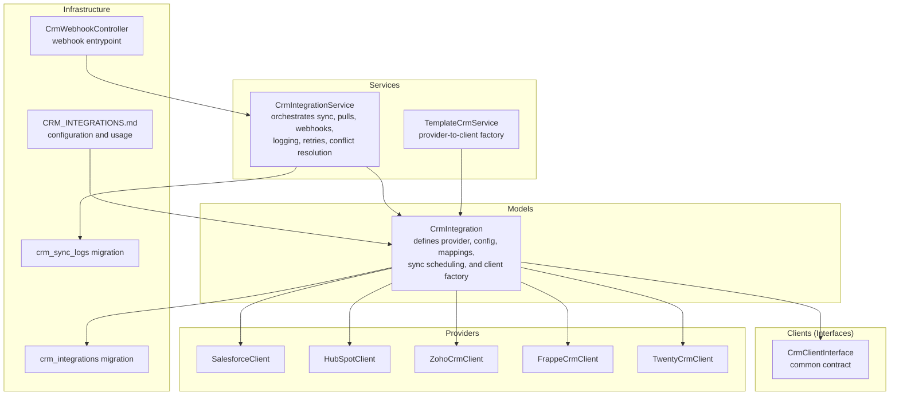
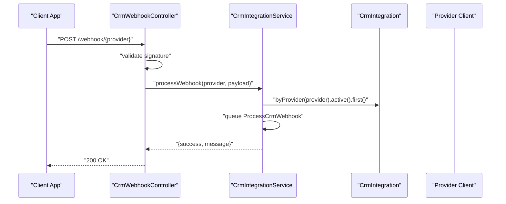
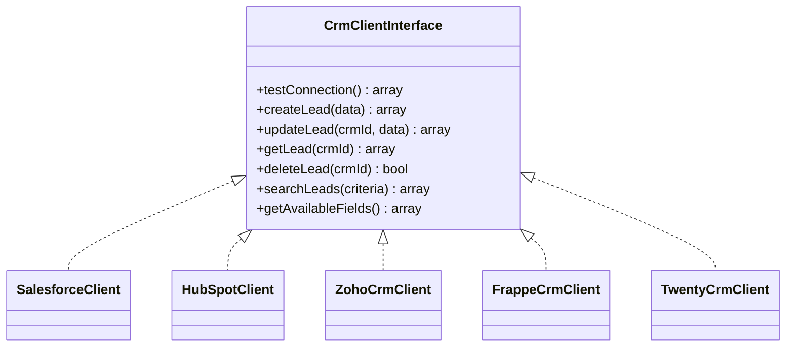
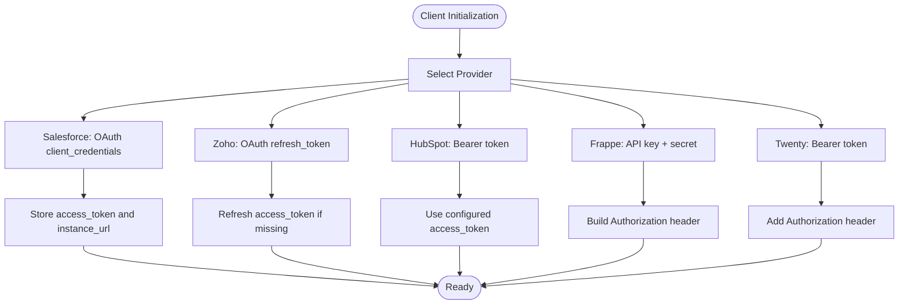
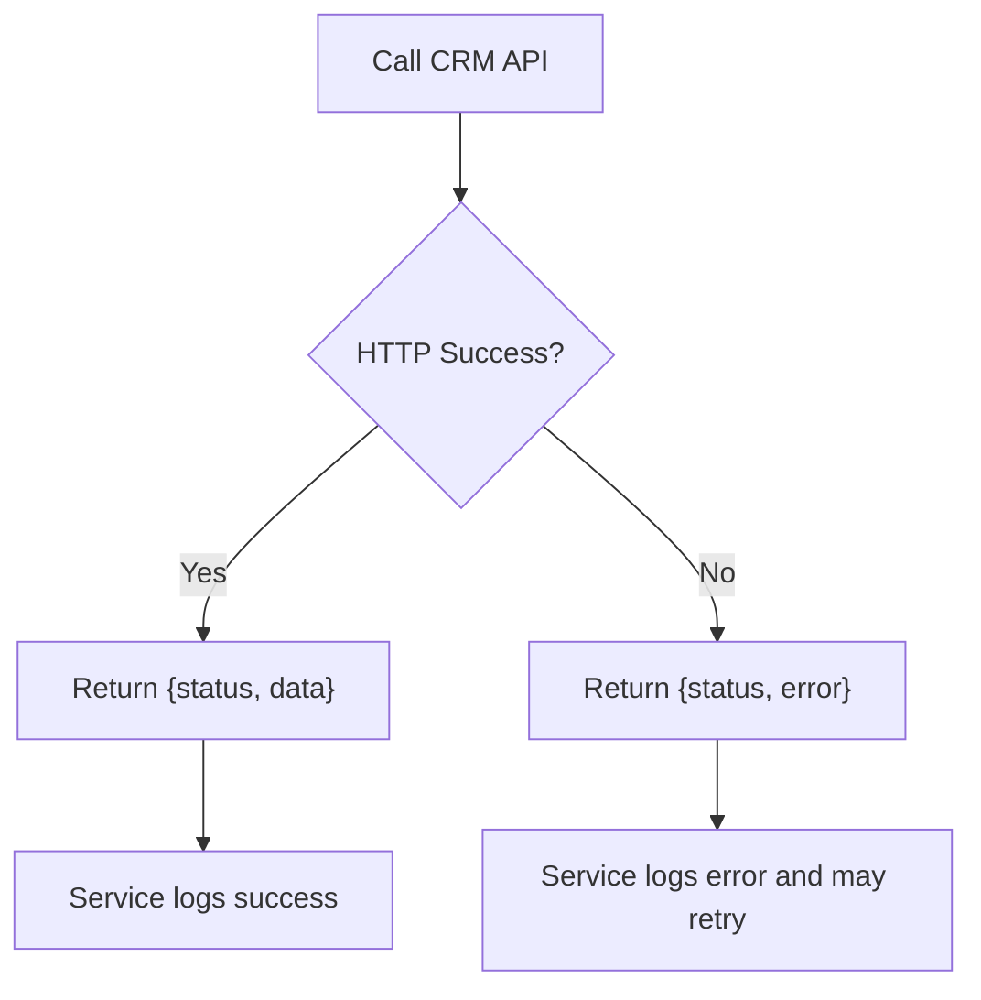
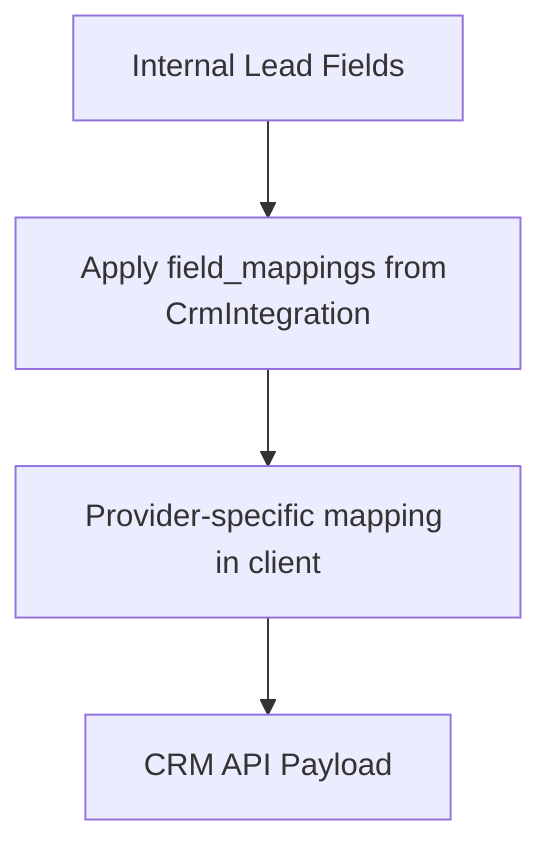
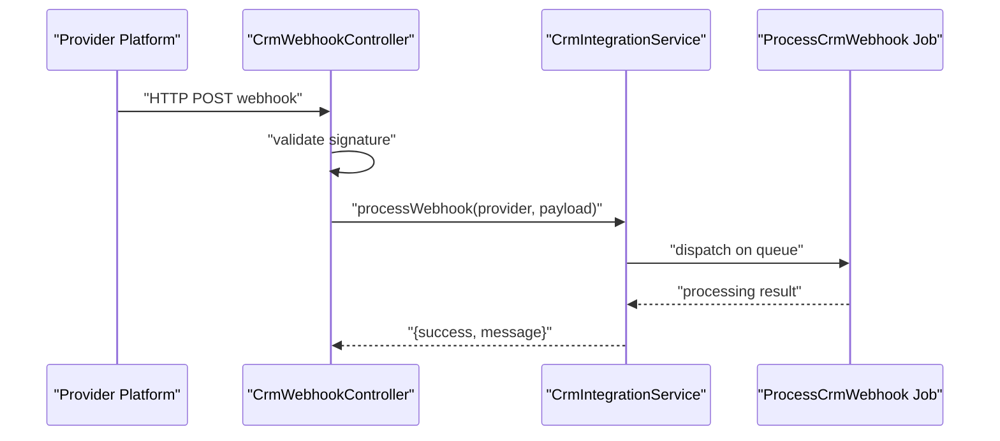
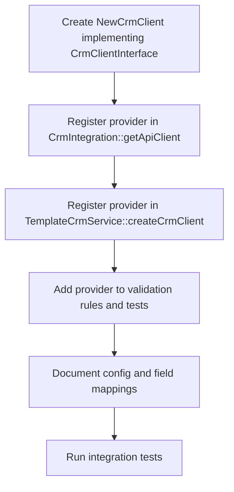
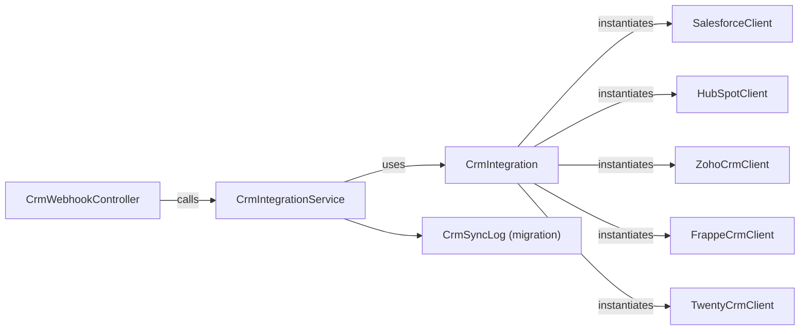

# CRM Platform Connectors

<cite>
**Referenced Files in This Document**
- [CrmClientInterface.php](file://app/Services/CRM/CrmClientInterface.php)
- [SalesforceClient.php](file://app/Services/CRM/SalesforceClient.php)
- [HubSpotClient.php](file://app/Services/CRM/HubSpotClient.php)
- [ZohoCrmClient.php](file://app/Services/CRM/ZohoCrmClient.php)
- [FrappeCrmClient.php](file://app/Services/CRM/FrappeCrmClient.php)
- [TwentyCrmClient.php](file://app/Services/CRM/TwentyCrmClient.php)
- [CrmIntegration.php](file://app/Models/CrmIntegration.php)
- [CrmIntegrationService.php](file://app/Services/CrmIntegrationService.php)
- [CrmWebhookController.php](file://app/Http/Controllers/Api/CrmWebhookController.php)
- [create_crm_integrations_table.php](file://database/migrations/2025_08_10_050341_create_crm_integrations_table.php)
- [create_crm_sync_logs_table.php](file://database/migrations/2025_09_05_0005_create_crm_sync_logs_table.php)
- [CRM_INTEGRATIONS.md](file://docs/CRM_INTEGRATIONS.md)
- [CrmIntegrationTest.php](file://tests/Unit/CrmIntegrationTest.php)
- [TemplateCrmService.php](file://app/Services/TemplateCrmService.php)
</cite>

## Table of Contents
1. [Introduction](#introduction)
2. [Project Structure](#project-structure)
3. [Core Components](#core-components)
4. [Architecture Overview](#architecture-overview)
5. [Detailed Component Analysis](#detailed-component-analysis)
6. [Dependency Analysis](#dependency-analysis)
7. [Performance Considerations](#performance-considerations)
8. [Troubleshooting Guide](#troubleshooting-guide)
9. [Conclusion](#conclusion)
10. [Appendices](#appendices)

## Introduction
This document explains the multi-platform CRM integration architecture used by the platform. It covers the CRM client interface design pattern, individual platform implementations for HubSpot, Salesforce, Zoho, Frappe, and Twenty CRM, authentication mechanisms, API rate limiting considerations, error handling strategies, data mapping between platform-specific fields and internal models, and operational procedures such as webhook subscription management, OAuth flows, and API version compatibility. It also provides implementation examples for adding new CRM connectors and managing connection failures.

## Project Structure
The CRM integration system is organized around a shared interface and provider-specific clients, with supporting models, services, migrations, and documentation.

**Diagram sources**
- [CrmIntegration.php:31-54](file://app/Models/CrmIntegration.php#L31-L54)
- [CrmIntegrationService.php:24-87](file://app/Services/CrmIntegrationService.php#L24-L87)
- [TemplateCrmService.php:457-475](file://app/Services/TemplateCrmService.php#L457-L475)
- [CrmClientInterface.php:5-41](file://app/Services/CRM/CrmClientInterface.php#L5-L41)
- [SalesforceClient.php:7-215](file://app/Services/CRM/SalesforceClient.php#L7-L215)
- [HubSpotClient.php:7-174](file://app/Services/CRM/HubSpotClient.php#L7-L174)
- [ZohoCrmClient.php:7-242](file://app/Services/CRM/ZohoCrmClient.php#L7-L242)
- [FrappeCrmClient.php:7-333](file://app/Services/CRM/FrappeCrmClient.php#L7-L333)
- [TwentyCrmClient.php:7-604](file://app/Services/CRM/TwentyCrmClient.php#L7-L604)
- [CrmWebhookController.php:11-45](file://app/Http/Controllers/Api/CrmWebhookController.php#L11-L45)
- [create_crm_integrations_table.php:12-29](file://database/migrations/2025_08_10_050341_create_crm_integrations_table.php#L12-L29)
- [create_crm_sync_logs_table.php:12-44](file://database/migrations/2025_09_05_0005_create_crm_sync_logs_table.php#L12-L44)
- [CRM_INTEGRATIONS.md:1-428](file://docs/CRM_INTEGRATIONS.md#L1-L428)

**Section sources**
- [CrmIntegration.php:8-29](file://app/Models/CrmIntegration.php#L8-L29)
- [create_crm_integrations_table.php:12-29](file://database/migrations/2025_08_10_050341_create_crm_integrations_table.php#L12-L29)
- [create_crm_sync_logs_table.php:12-44](file://database/migrations/2025_09_05_0005_create_crm_sync_logs_table.php#L12-L44)
- [CRM_INTEGRATIONS.md:1-428](file://docs/CRM_INTEGRATIONS.md#L1-L428)

## Core Components
- CRM client interface: Defines the contract for all CRM providers, including connection testing, lead lifecycle operations, search, and field discovery.
- Provider clients: Implementations for HubSpot, Salesforce, Zoho, Frappe, and Twenty CRM with provider-specific authentication, endpoints, and data mapping.
- Integration model: Stores provider configuration, field mappings, sync direction/intervals, and exposes a client factory and sync helpers.
- Integration service: Orchestrates bidirectional synchronization, webhook processing, logging, retries, and conflict resolution.
- Webhook controller: Validates and queues incoming webhook payloads for processing.
- Migrations: Define schema for integrations and sync logs.
- Documentation: Provides configuration examples, field mappings, and usage patterns.

**Section sources**
- [CrmClientInterface.php:5-41](file://app/Services/CRM/CrmClientInterface.php#L5-L41)
- [CrmIntegration.php:31-118](file://app/Models/CrmIntegration.php#L31-L118)
- [CrmIntegrationService.php:24-87](file://app/Services/CrmIntegrationService.php#L24-L87)
- [CrmWebhookController.php:11-45](file://app/Http/Controllers/Api/CrmWebhookController.php#L11-L45)
- [create_crm_integrations_table.php:12-29](file://database/migrations/2025_08_10_050341_create_crm_integrations_table.php#L12-L29)
- [create_crm_sync_logs_table.php:12-44](file://database/migrations/2025_09_05_0005_create_crm_sync_logs_table.php#L12-L44)
- [CRM_INTEGRATIONS.md:1-428](file://docs/CRM_INTEGRATIONS.md#L1-L428)

## Architecture Overview
The system follows a layered architecture:
- Presentation: Webhook controller receives provider webhooks.
- Service Layer: Integration service coordinates sync, pull, and webhook processing.
- Domain Model: Integration model encapsulates configuration and client instantiation.
- Provider Clients: Implementations of the common interface per CRM.
- Persistence: Migrations define tables for integrations and sync logs.

**Diagram sources**
- [CrmWebhookController.php:17-45](file://app/Http/Controllers/Api/CrmWebhookController.php#L17-L45)
- [CrmIntegrationService.php:218-252](file://app/Services/CrmIntegrationService.php#L218-L252)
- [CrmIntegration.php:192-197](file://app/Models/CrmIntegration.php#L192-L197)

**Section sources**
- [CrmIntegrationService.php:218-252](file://app/Services/CrmIntegrationService.php#L218-L252)
- [CrmWebhookController.php:17-45](file://app/Http/Controllers/Api/CrmWebhookController.php#L17-L45)

## Detailed Component Analysis

### CRM Client Interface Design Pattern
The interface defines a common contract for all CRM clients, enabling polymorphic behavior and consistent error handling across providers.

**Diagram sources**
- [CrmClientInterface.php:5-41](file://app/Services/CRM/CrmClientInterface.php#L5-L41)
- [SalesforceClient.php:7-215](file://app/Services/CRM/SalesforceClient.php#L7-L215)
- [HubSpotClient.php:7-174](file://app/Services/CRM/HubSpotClient.php#L7-L174)
- [ZohoCrmClient.php:7-242](file://app/Services/CRM/ZohoCrmClient.php#L7-L242)
- [FrappeCrmClient.php:7-333](file://app/Services/CRM/FrappeCrmClient.php#L7-L333)
- [TwentyCrmClient.php:7-604](file://app/Services/CRM/TwentyCrmClient.php#L7-L604)

**Section sources**
- [CrmClientInterface.php:5-41](file://app/Services/CRM/CrmClientInterface.php#L5-L41)

### Authentication Mechanisms
- Salesforce: OAuth 2.0 client credentials flow; token stored and base URL updated after first use.
- HubSpot: Bearer token authentication via access token.
- Zoho CRM: OAuth 2.0 with refresh token; access token refreshed when needed.
- Frappe CRM: API key + secret header-based authentication.
- Twenty CRM: GraphQL endpoint with Bearer token (API key) authentication.

**Diagram sources**
- [SalesforceClient.php:143-162](file://app/Services/CRM/SalesforceClient.php#L143-L162)
- [HubSpotClient.php:130-150](file://app/Services/CRM/HubSpotClient.php#L130-L150)
- [ZohoCrmClient.php:156-185](file://app/Services/CRM/ZohoCrmClient.php#L156-L185)
- [FrappeCrmClient.php:133-165](file://app/Services/CRM/FrappeCrmClient.php#L133-L165)
- [TwentyCrmClient.php:281-309](file://app/Services/CRM/TwentyCrmClient.php#L281-L309)

**Section sources**
- [CRM_INTEGRATIONS.md:7-63](file://docs/CRM_INTEGRATIONS.md#L7-L63)
- [SalesforceClient.php:143-162](file://app/Services/CRM/SalesforceClient.php#L143-L162)
- [HubSpotClient.php:130-150](file://app/Services/CRM/HubSpotClient.php#L130-L150)
- [ZohoCrmClient.php:156-185](file://app/Services/CRM/ZohoCrmClient.php#L156-L185)
- [FrappeCrmClient.php:133-165](file://app/Services/CRM/FrappeCrmClient.php#L133-L165)
- [TwentyCrmClient.php:281-309](file://app/Services/CRM/TwentyCrmClient.php#L281-L309)

### API Rate Limiting and Error Handling Strategies
- Consistent error handling: Each client wraps HTTP responses and exceptions into structured arrays with status, data, and error fields.
- Logging: Clients and service layer log errors and debug information; documentation outlines enabling debug logging channels.
- Retry and recovery: Service layer maintains sync logs and supports retrying failed operations.
- Signature validation: Webhook controller validates signatures before processing; service layer includes a placeholder for provider-specific validation.

**Diagram sources**
- [SalesforceClient.php:164-190](file://app/Services/CRM/SalesforceClient.php#L164-L190)
- [HubSpotClient.php:130-150](file://app/Services/CRM/HubSpotClient.php#L130-L150)
- [ZohoCrmClient.php:187-213](file://app/Services/CRM/ZohoCrmClient.php#L187-L213)
- [FrappeCrmClient.php:133-165](file://app/Services/CRM/FrappeCrmClient.php#L133-L165)
- [TwentyCrmClient.php:281-309](file://app/Services/CRM/TwentyCrmClient.php#L281-L309)
- [CrmIntegrationService.php:425-457](file://app/Services/CrmIntegrationService.php#L425-L457)

**Section sources**
- [CRM_INTEGRATIONS.md:303-401](file://docs/CRM_INTEGRATIONS.md#L303-L401)
- [CrmIntegrationService.php:358-368](file://app/Services/CrmIntegrationService.php#L358-L368)
- [CrmIntegrationService.php:318-353](file://app/Services/CrmIntegrationService.php#L318-L353)

### Data Mapping Between Platform-Specific Fields and Internal Models
- Field mappings are configured per integration and applied during sync operations.
- Each provider client includes a mapping method to translate internal field names to provider-specific field names.
- The integration model applies mappings when preparing data for CRM APIs.

**Diagram sources**
- [CrmIntegration.php:123-154](file://app/Models/CrmIntegration.php#L123-L154)
- [SalesforceClient.php:192-213](file://app/Services/CRM/SalesforceClient.php#L192-L213)
- [HubSpotClient.php:152-172](file://app/Services/CRM/HubSpotClient.php#L152-L172)
- [ZohoCrmClient.php:215-240](file://app/Services/CRM/ZohoCrmClient.php#L215-L240)
- [FrappeCrmClient.php:167-201](file://app/Services/CRM/FrappeCrmClient.php#L167-L201)
- [TwentyCrmClient.php:311-358](file://app/Services/CRM/TwentyCrmClient.php#L311-L358)

**Section sources**
- [CRM_INTEGRATIONS.md:65-147](file://docs/CRM_INTEGRATIONS.md#L65-L147)
- [CrmIntegration.php:123-154](file://app/Models/CrmIntegration.php#L123-L154)

### Individual Platform Implementations

#### Salesforce
- Authentication: OAuth 2.0 client credentials; stores access token and updates base URL.
- API Version: v58.0 endpoints.
- Capabilities: Describe Lead object, SOQL queries, CRUD operations, and field discovery.

**Section sources**
- [CRM_INTEGRATIONS.md:7-17](file://docs/CRM_INTEGRATIONS.md#L7-L17)
- [SalesforceClient.php:21-141](file://app/Services/CRM/SalesforceClient.php#L21-L141)

#### HubSpot
- Authentication: Bearer token.
- API Version: v3 endpoints.
- Capabilities: Contact CRUD, search, and property discovery.

**Section sources**
- [CRM_INTEGRATIONS.md:19-27](file://docs/CRM_INTEGRATIONS.md#L19-L27)
- [HubSpotClient.php:18-128](file://app/Services/CRM/HubSpotClient.php#L18-L128)

#### Zoho CRM
- Authentication: OAuth 2.0 with refresh token; refreshes access token when needed.
- API Version: v2 endpoints.
- Capabilities: Lead CRUD, search, and field metadata retrieval.

**Section sources**
- [CRM_INTEGRATIONS.md:29-40](file://docs/CRM_INTEGRATIONS.md#L29-L40)
- [ZohoCrmClient.php:21-154](file://app/Services/CRM/ZohoCrmClient.php#L21-L154)

#### Frappe CRM
- Authentication: API key + secret header.
- API Type: REST resource endpoints.
- Capabilities: Lead CRUD, search, DocType metadata, plus provider-specific extensions (convert to customer, create opportunity, add note, quotations, and activities).

**Section sources**
- [CRM_INTEGRATIONS.md:42-52](file://docs/CRM_INTEGRATIONS.md#L42-L52)
- [FrappeCrmClient.php:19-131](file://app/Services/CRM/FrappeCrmClient.php#L19-L131)
- [FrappeCrmClient.php:203-331](file://app/Services/CRM/FrappeCrmClient.php#L203-L331)

#### Twenty CRM
- Authentication: Bearer token (API key).
- API Type: GraphQL.
- Capabilities: Person CRUD, search, GraphQL introspection, company and opportunity creation, activity notes, and related data retrieval.

**Section sources**
- [CRM_INTEGRATIONS.md:54-63](file://docs/CRM_INTEGRATIONS.md#L54-L63)
- [TwentyCrmClient.php:19-279](file://app/Services/CRM/TwentyCrmClient.php#L19-L279)
- [TwentyCrmClient.php:360-602](file://app/Services/CRM/TwentyCrmClient.php#L360-L602)

### Webhook Subscription Management, OAuth Flows, and API Version Compatibility
- Webhooks: The webhook controller validates signatures and delegates processing to the integration service, which queues jobs for asynchronous handling.
- OAuth flows: Implemented per provider in their respective clients (Salesforce client credentials, Zoho refresh token).
- API versions: Documented per provider; clients use provider-specific endpoints and versions.

**Diagram sources**
- [CrmWebhookController.php:17-45](file://app/Http/Controllers/Api/CrmWebhookController.php#L17-L45)
- [CrmIntegrationService.php:218-252](file://app/Services/CrmIntegrationService.php#L218-L252)

**Section sources**
- [CRM_INTEGRATIONS.md:206-250](file://docs/CRM_INTEGRATIONS.md#L206-L250)
- [CrmWebhookController.php:17-45](file://app/Http/Controllers/Api/CrmWebhookController.php#L17-L45)
- [CRM_INTEGRATIONS.md:7-63](file://docs/CRM_INTEGRATIONS.md#L7-L63)

### Implementation Examples: Adding a New CRM Connector
Steps to add a new provider:
1. Implement the interface in a new client class.
2. Add provider to the integration model’s client factory and the template service factory.
3. Extend validation rules and tests.
4. Document configuration and field mappings.
5. Test thoroughly.

**Diagram sources**
- [CrmClientInterface.php:5-41](file://app/Services/CRM/CrmClientInterface.php#L5-L41)
- [CrmIntegration.php:31-54](file://app/Models/CrmIntegration.php#L31-L54)
- [TemplateCrmService.php:457-475](file://app/Services/TemplateCrmService.php#L457-L475)
- [CRM_INTEGRATIONS.md:402-428](file://docs/CRM_INTEGRATIONS.md#L402-L428)

**Section sources**
- [CRM_INTEGRATIONS.md:402-428](file://docs/CRM_INTEGRATIONS.md#L402-L428)
- [CrmIntegration.php:31-54](file://app/Models/CrmIntegration.php#L31-L54)
- [TemplateCrmService.php:457-475](file://app/Services/TemplateCrmService.php#L457-L475)

### Handling Platform-Specific Features
- Frappe CRM: Convert lead to customer, create opportunity, add notes, quotations, and fetch activities.
- Twenty CRM: Create company, create opportunity, add notes/activities, and retrieve opportunities and activities.

**Section sources**
- [FrappeCrmClient.php:203-331](file://app/Services/CRM/FrappeCrmClient.php#L203-L331)
- [TwentyCrmClient.php:360-602](file://app/Services/CRM/TwentyCrmClient.php#L360-L602)

### Managing Connection Failures
- Connection testing: Each client exposes a testConnection method returning structured results.
- Integration model wraps client results for admin UI consumption.
- Service layer logs failures and supports retry logic via sync logs.

**Section sources**
- [CrmIntegration.php:59-77](file://app/Models/CrmIntegration.php#L59-L77)
- [CrmIntegrationService.php:318-353](file://app/Services/CrmIntegrationService.php#L318-L353)

## Dependency Analysis
The integration model acts as a factory for provider clients, while the integration service orchestrates operations and logging. The webhook controller integrates with the service layer.

**Diagram sources**
- [CrmIntegration.php:31-54](file://app/Models/CrmIntegration.php#L31-L54)
- [CrmIntegrationService.php:24-87](file://app/Services/CrmIntegrationService.php#L24-L87)
- [CrmWebhookController.php:11-15](file://app/Http/Controllers/Api/CrmWebhookController.php#L11-L15)
- [create_crm_sync_logs_table.php:12-44](file://database/migrations/2025_09_05_0005_create_crm_sync_logs_table.php#L12-L44)

**Section sources**
- [CrmIntegration.php:31-54](file://app/Models/CrmIntegration.php#L31-L54)
- [CrmIntegrationService.php:24-87](file://app/Services/CrmIntegrationService.php#L24-L87)

## Performance Considerations
- Batch operations: Use provider-native batch endpoints where available (e.g., Frappe filters, Zoho search criteria).
- Field selection: Limit returned fields to reduce payload sizes (e.g., Twenty GraphQL fragments).
- Caching: Cache access tokens and frequently accessed metadata (e.g., field lists) to minimize repeated requests.
- Backoff and throttling: Implement exponential backoff on rate-limit responses and stagger syncs based on sync_interval.
- Queues: Offload heavy operations (webhooks, syncs) to queues to avoid blocking requests.

[No sources needed since this section provides general guidance]

## Troubleshooting Guide
Common issues and resolutions:
- Authentication failures: Verify credentials, token expiration, and permissions.
- Field mapping errors: Confirm field names match CRM schema and required fields are present.
- Rate limiting: Implement backoff, reduce sync frequency, and use batch operations.
- Network issues: Check connectivity, firewall settings, and provider status pages.

Debugging tips:
- Enable debug logging channels and inspect logs for request/response details.
- Use the testConnection method to validate provider connectivity.
- Inspect sync logs for detailed error messages and retry counts.

**Section sources**
- [CRM_INTEGRATIONS.md:354-401](file://docs/CRM_INTEGRATIONS.md#L354-L401)
- [CrmIntegration.php:59-77](file://app/Models/CrmIntegration.php#L59-L77)
- [CrmIntegrationService.php:358-368](file://app/Services/CrmIntegrationService.php#L358-L368)

## Conclusion
The CRM integration system provides a robust, extensible foundation for multi-platform CRM connectivity. By adhering to the common interface, implementing provider-specific clients, and leveraging the integration service for orchestration, logging, and retries, teams can reliably synchronize leads across diverse CRM ecosystems while maintaining consistent error handling and operational visibility.

[No sources needed since this section summarizes without analyzing specific files]

## Appendices

### API Usage and Configuration References
- Admin endpoints for CRM integrations and bulk sync are documented in the integration guide.
- Example configurations and field mappings are provided per provider.

**Section sources**
- [CRM_INTEGRATIONS.md:206-250](file://docs/CRM_INTEGRATIONS.md#L206-L250)
- [CRM_INTEGRATIONS.md:149-203](file://docs/CRM_INTEGRATIONS.md#L149-L203)

### Database Schema References
- Integration table: provider, config, field_mappings, sync settings, and timestamps.
- Sync logs table: tenant-scoped records of sync operations, statuses, errors, and retry counts.

**Section sources**
- [create_crm_integrations_table.php:12-29](file://database/migrations/2025_08_10_050341_create_crm_integrations_table.php#L12-L29)
- [create_crm_sync_logs_table.php:12-44](file://database/migrations/2025_09_05_0005_create_crm_sync_logs_table.php#L12-L44)