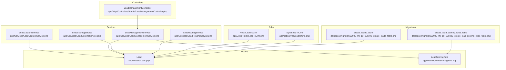
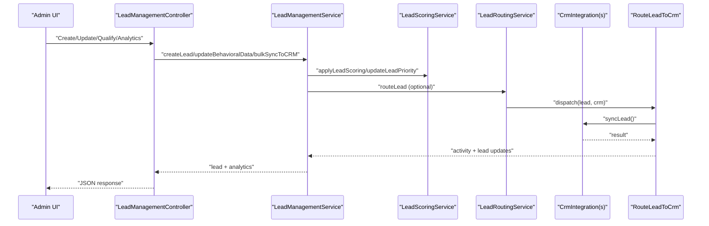
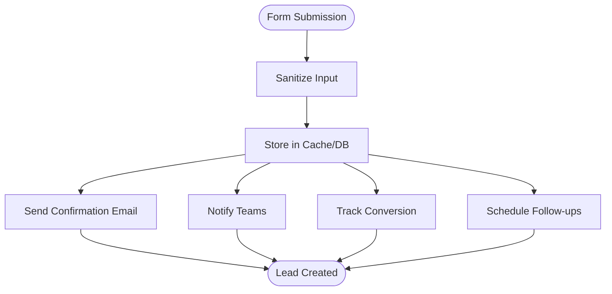
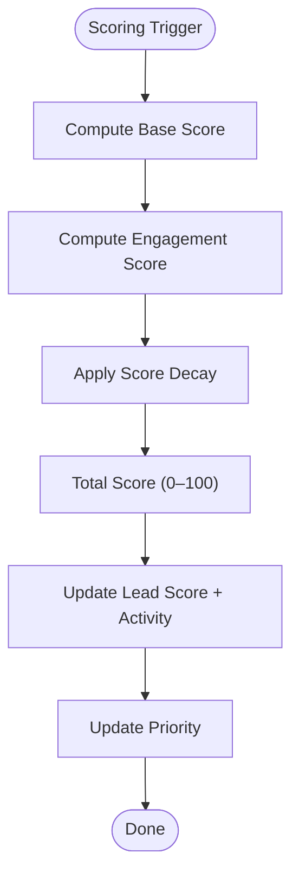
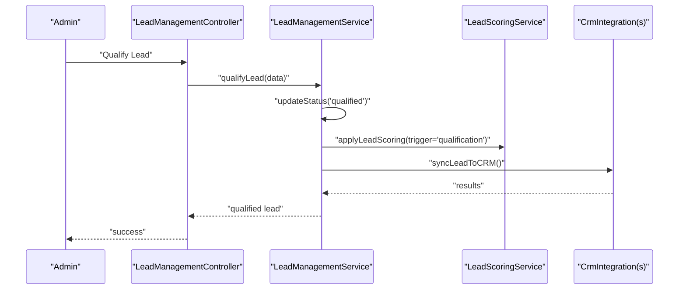
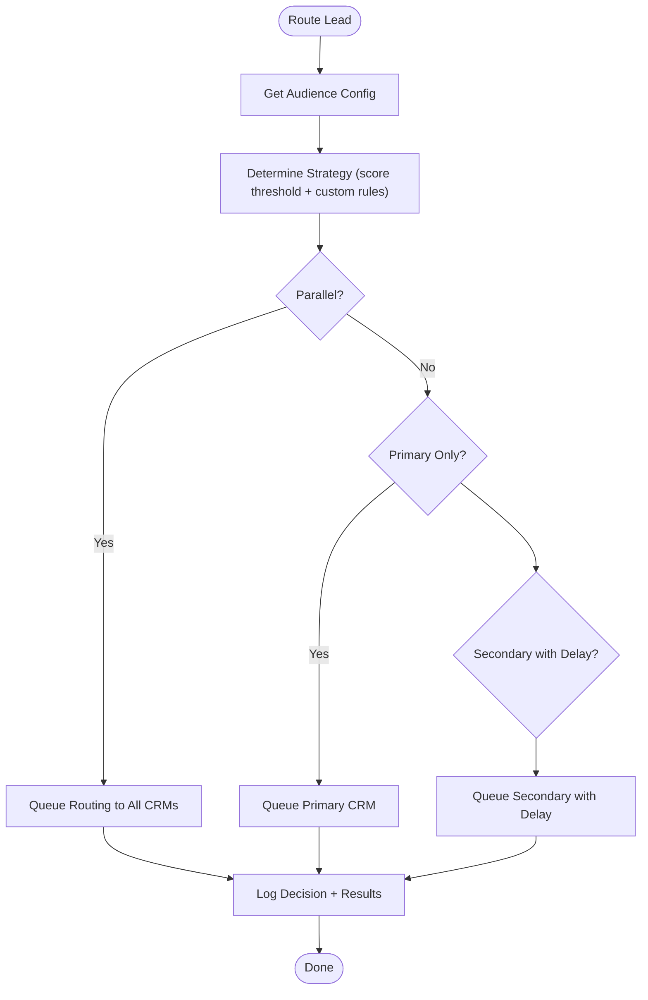
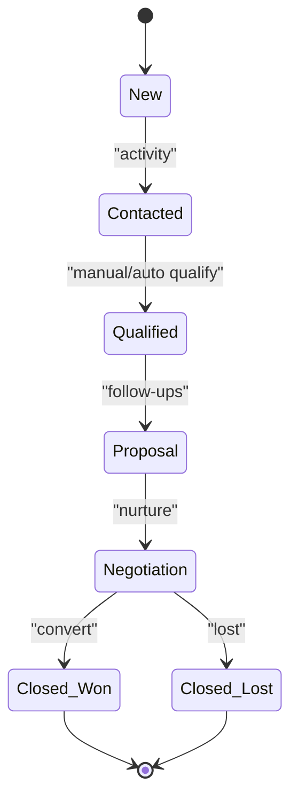
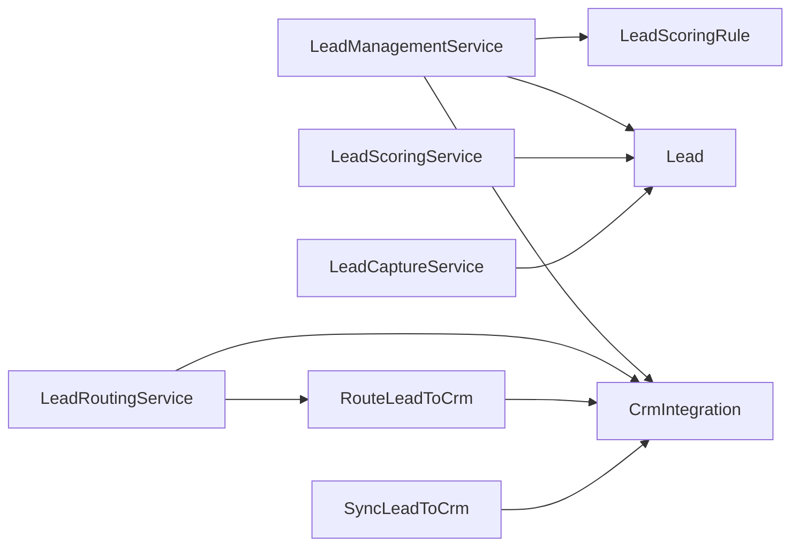

# Lead Management & Automation

<cite>
**Referenced Files in This Document**
- [Lead.php](file://app/Models/Lead.php)
- [LeadScoringRule.php](file://app/Models/LeadScoringRule.php)
- [LeadManagementService.php](file://app/Services/LeadManagementService.php)
- [LeadScoringService.php](file://app/Services/LeadScoringService.php)
- [LeadRoutingService.php](file://app/Services/LeadRoutingService.php)
- [LeadCaptureService.php](file://app/Services/LeadCaptureService.php)
- [LeadManagementController.php](file://app/Http/Controllers/Admin/LeadManagementController.php)
- [RouteLeadToCrm.php](file://app/Jobs/RouteLeadToCrm.php)
- [SyncLeadToCrm.php](file://app/Jobs/SyncLeadToCrm.php)
- [create_leads_table.php](file://database/migrations/2025_08_10_050242_create_leads_table.php)
- [create_lead_scoring_rules_table.php](file://database/migrations/2025_08_10_050329_create_lead_scoring_rules_table.php)
</cite>

## Table of Contents
1. [Introduction](#introduction)
2. [Project Structure](#project-structure)
3. [Core Components](#core-components)
4. [Architecture Overview](#architecture-overview)
5. [Detailed Component Analysis](#detailed-component-analysis)
6. [Dependency Analysis](#dependency-analysis)
7. [Performance Considerations](#performance-considerations)
8. [Troubleshooting Guide](#troubleshooting-guide)
9. [Conclusion](#conclusion)
10. [Appendices](#appendices)

## Introduction
This document explains the lead management and automation system, focusing on lead capture, scoring, routing, and qualification. It covers how leads are captured from web forms, email campaigns, and CRM imports; how scoring and qualification rules are applied; and how leads move through the lifecycle from capture to handoff to sales. It also documents activity tracking, conversion analytics, and performance monitoring, with practical guidance for configuring rules, managing queues, and optimizing conversion rates.

## Project Structure
The lead management system is implemented across models, services, controllers, jobs, and migrations. The key areas are:
- Data model: Lead, LeadScoringRule
- Services: LeadCaptureService, LeadManagementService, LeadScoringService, LeadRoutingService
- Controllers: LeadManagementController (admin UI/API)
- Jobs: RouteLeadToCrm, SyncLeadToCrm
- Migrations: create_leads_table, create_lead_scoring_rules_table

**Diagram sources**
- [Lead.php:11-226](file://app/Models/Lead.php#L11-L226)
- [LeadScoringRule.php:7-143](file://app/Models/LeadScoringRule.php#L7-L143)
- [LeadCaptureService.php:13-468](file://app/Services/LeadCaptureService.php#L13-L468)
- [LeadManagementService.php:12-453](file://app/Services/LeadManagementService.php#L12-L453)
- [LeadScoringService.php:17-497](file://app/Services/LeadScoringService.php#L17-L497)
- [LeadRoutingService.php:21-512](file://app/Services/LeadRoutingService.php#L21-L512)
- [LeadManagementController.php:15-475](file://app/Http/Controllers/Admin/LeadManagementController.php#L15-L475)
- [RouteLeadToCrm.php:20-245](file://app/Jobs/RouteLeadToCrm.php#L20-L245)
- [SyncLeadToCrm.php:13-210](file://app/Jobs/SyncLeadToCrm.php#L13-L210)
- [create_leads_table.php:14-44](file://database/migrations/2025_08_10_050242_create_leads_table.php#L14-L44)
- [create_lead_scoring_rules_table.php:14-27](file://database/migrations/2025_08_10_050329_create_lead_scoring_rules_table.php#L14-L27)

**Section sources**
- [Lead.php:11-226](file://app/Models/Lead.php#L11-L226)
- [LeadScoringRule.php:7-143](file://app/Models/LeadScoringRule.php#L7-L143)
- [LeadManagementService.php:12-453](file://app/Services/LeadManagementService.php#L12-L453)
- [LeadScoringService.php:17-497](file://app/Services/LeadScoringService.php#L17-L497)
- [LeadRoutingService.php:21-512](file://app/Services/LeadRoutingService.php#L21-L512)
- [LeadCaptureService.php:13-468](file://app/Services/LeadCaptureService.php#L13-L468)
- [LeadManagementController.php:15-475](file://app/Http/Controllers/Admin/LeadManagementController.php#L15-L475)
- [RouteLeadToCrm.php:20-245](file://app/Jobs/RouteLeadToCrm.php#L20-L245)
- [SyncLeadToCrm.php:13-210](file://app/Jobs/SyncLeadToCrm.php#L13-L210)
- [create_leads_table.php:14-44](file://database/migrations/2025_08_10_050242_create_leads_table.php#L14-L44)
- [create_lead_scoring_rules_table.php:14-27](file://database/migrations/2025_08_10_050329_create_lead_scoring_rules_table.php#L14-L27)

## Core Components
- Lead model: central entity storing personal info, lead type/source/status/score/priority, behavioral/UTM/form data, assignment, timestamps, and CRM sync fields.
- LeadScoringRule model: defines scoring rules with triggers, conditions, points, activation, and priority.
- LeadCaptureService: processes trial/demo requests, sanitizes data, stores in cache/db, sends confirmations, notifies teams, tracks conversions, schedules follow-ups.
- LeadManagementService: orchestrates lead creation, scoring, auto-assignment, qualification, follow-up sequences, CRM sync, analytics, and pipeline reporting.
- LeadScoringService: calculates real-time scores from engagement events, applies decay, enforces daily caps, updates priorities, and provides analytics.
- LeadRoutingService: routes leads to multiple CRM systems based on audience type, score thresholds, and custom rules; supports parallel, primary-first, load-balanced strategies; logs routing decisions.
- Jobs: RouteLeadToCrm and SyncLeadToCrm encapsulate CRM integration with retries, logging, and failure handling.
- Controller: Admin interface for viewing leads, updating statuses, qualifying, adding activities, generating analytics, bulk CRM sync, exporting, and managing rules/integrations.

**Section sources**
- [Lead.php:15-51](file://app/Models/Lead.php#L15-L51)
- [LeadScoringRule.php:9-22](file://app/Models/LeadScoringRule.php#L9-L22)
- [LeadCaptureService.php:18-95](file://app/Services/LeadCaptureService.php#L18-L95)
- [LeadManagementService.php:17-53](file://app/Services/LeadManagementService.php#L17-L53)
- [LeadScoringService.php:73-139](file://app/Services/LeadScoringService.php#L73-L139)
- [LeadRoutingService.php:26-72](file://app/Services/LeadRoutingService.php#L26-L72)
- [RouteLeadToCrm.php:41-106](file://app/Jobs/RouteLeadToCrm.php#L41-L106)
- [SyncLeadToCrm.php:34-92](file://app/Jobs/SyncLeadToCrm.php#L34-L92)
- [LeadManagementController.php:24-44](file://app/Http/Controllers/Admin/LeadManagementController.php#L24-L44)

## Architecture Overview
The system follows a layered architecture:
- Presentation: Admin controller renders dashboards and exposes APIs for lead CRUD, qualification, analytics, and CRM operations.
- Application: Services encapsulate business logic for capture, scoring, routing, and management.
- Persistence: Eloquent models and migrations define the schema for leads and scoring rules.
- Integration: Jobs coordinate asynchronous CRM sync and routing with retry/backoff and audit logging.

**Diagram sources**
- [LeadManagementController.php:62-92](file://app/Http/Controllers/Admin/LeadManagementController.php#L62-L92)
- [LeadManagementService.php:17-53](file://app/Services/LeadManagementService.php#L17-L53)
- [LeadScoringService.php:73-139](file://app/Services/LeadScoringService.php#L73-L139)
- [LeadRoutingService.php:26-72](file://app/Services/LeadRoutingService.php#L26-L72)
- [RouteLeadToCrm.php:41-106](file://app/Jobs/RouteLeadToCrm.php#L41-L106)

## Detailed Component Analysis

### Lead Capture Mechanisms
Lead capture occurs via:
- Web forms: validated and sanitized, stored in cache/db, followed by confirmation emails, admin notifications, conversion tracking, and scheduled follow-ups.
- Email campaigns: handled by email marketing services integrated via the capture service’s hooks for list addition and analytics.
- CRM imports: managed by CRM integrations; leads are created/updated via SyncLeadToCrm job with field mapping and tagging.

**Diagram sources**
- [LeadCaptureService.php:18-95](file://app/Services/LeadCaptureService.php#L18-L95)
- [LeadCaptureService.php:100-146](file://app/Services/LeadCaptureService.php#L100-L146)
- [LeadCaptureService.php:151-180](file://app/Services/LeadCaptureService.php#L151-L180)
- [LeadCaptureService.php:251-281](file://app/Services/LeadCaptureService.php#L251-L281)
- [LeadCaptureService.php:286-307](file://app/Services/LeadCaptureService.php#L286-L307)

**Section sources**
- [LeadCaptureService.php:18-95](file://app/Services/LeadCaptureService.php#L18-L95)
- [SyncLeadToCrm.php:34-92](file://app/Jobs/SyncLeadToCrm.php#L34-L92)

### Lead Scoring Algorithms
Scoring combines:
- Base score from lead source and profile completeness.
- Engagement-based points from events (opens, clicks, page views, downloads, form submissions, social interactions, job applications) with per-event point values and daily caps.
- Score decay for inactivity after 30/60/90+ days.
- Priority updates based on thresholds.

**Diagram sources**
- [LeadScoringService.php:73-82](file://app/Services/LeadScoringService.php#L73-L82)
- [LeadScoringService.php:257-290](file://app/Services/LeadScoringService.php#L257-L290)
- [LeadScoringService.php:295-316](file://app/Services/LeadScoringService.php#L295-L316)
- [LeadScoringService.php:144-165](file://app/Services/LeadScoringService.php#L144-L165)
- [LeadScoringService.php:403-418](file://app/Services/LeadScoringService.php#L403-L418)

**Section sources**
- [LeadScoringService.php:73-139](file://app/Services/LeadScoringService.php#L73-L139)
- [LeadScoringService.php:257-290](file://app/Services/LeadScoringService.php#L257-L290)
- [LeadScoringService.php:295-316](file://app/Services/LeadScoringService.php#L295-L316)
- [LeadScoringService.php:144-165](file://app/Services/LeadScoringService.php#L144-L165)
- [LeadScoringService.php:403-418](file://app/Services/LeadScoringService.php#L403-L418)

### Lead Qualification Criteria and Processes
Qualification:
- Manual qualification via controller endpoint with notes and additional qualification data appended to form_data.
- Automatic scoring applied upon qualification trigger.
- CRM sync performed after qualification.

**Diagram sources**
- [LeadManagementController.php:145-174](file://app/Http/Controllers/Admin/LeadManagementController.php#L145-L174)
- [LeadManagementService.php:140-158](file://app/Services/LeadManagementService.php#L140-L158)
- [LeadManagementService.php:277-304](file://app/Services/LeadManagementService.php#L277-L304)

**Section sources**
- [LeadManagementController.php:145-174](file://app/Http/Controllers/Admin/LeadManagementController.php#L145-L174)
- [LeadManagementService.php:140-158](file://app/Services/LeadManagementService.php#L140-L158)

### Lead Routing Rules and Multi-CRM Strategy
Routing:
- Audience-specific configurations define preferred/secondary CRM, routing priority, and score threshold.
- Strategies: parallel, primary-first, primary-only, load-balanced.
- High-score leads (≥90) routed in parallel.
- Delayed routing supported for secondary CRM after initial primary attempt.
- Routing decisions logged with strategy and CRM distribution.

**Diagram sources**
- [LeadRoutingService.php:26-72](file://app/Services/LeadRoutingService.php#L26-L72)
- [LeadRoutingService.php:169-199](file://app/Services/LeadRoutingService.php#L169-L199)
- [LeadRoutingService.php:204-256](file://app/Services/LeadRoutingService.php#L204-L256)
- [LeadRoutingService.php:261-286](file://app/Services/LeadRoutingService.php#L261-L286)
- [LeadRoutingService.php:291-306](file://app/Services/LeadRoutingService.php#L291-L306)
- [LeadRoutingService.php:407-432](file://app/Services/LeadRoutingService.php#L407-L432)

**Section sources**
- [LeadRoutingService.php:26-72](file://app/Services/LeadRoutingService.php#L26-L72)
- [LeadRoutingService.php:169-199](file://app/Services/LeadRoutingService.php#L169-L199)
- [LeadRoutingService.php:204-256](file://app/Services/LeadRoutingService.php#L204-L256)
- [LeadRoutingService.php:261-286](file://app/Services/LeadRoutingService.php#L261-L286)
- [LeadRoutingService.php:291-306](file://app/Services/LeadRoutingService.php#L291-L306)
- [LeadRoutingService.php:407-432](file://app/Services/LeadRoutingService.php#L407-L432)

### Lead Lifecycle Management
Lifecycle stages:
- Capture: form/email/crm import → create lead → apply scoring → auto-assign → CRM sync.
- Engagement: behavioral data updates → real-time scoring → priority updates.
- Qualification: manual or automatic → status update → scoring → CRM sync.
- Handoff: routing to CRM(s) → activity logging → follow-up sequences.

**Diagram sources**
- [Lead.php:120-143](file://app/Models/Lead.php#L120-L143)
- [LeadManagementService.php:140-158](file://app/Services/LeadManagementService.php#L140-L158)
- [LeadManagementService.php:163-212](file://app/Services/LeadManagementService.php#L163-L212)

**Section sources**
- [Lead.php:120-143](file://app/Models/Lead.php#L120-L143)
- [LeadManagementService.php:140-158](file://app/Services/LeadManagementService.php#L140-L158)
- [LeadManagementService.php:163-212](file://app/Services/LeadManagementService.php#L163-L212)

### Implementation Examples
- Lead scoring model: see scoring rules configuration and thresholds in the scoring service.
- Routing logic: audience configs and strategy evaluation in the routing service.
- Automation workflows: follow-up sequences created by the management service; CRM sync jobs handle push/pull updates.

**Section sources**
- [LeadScoringService.php:22-68](file://app/Services/LeadScoringService.php#L22-L68)
- [LeadRoutingService.php:128-164](file://app/Services/LeadRoutingService.php#L128-L164)
- [LeadManagementService.php:163-212](file://app/Services/LeadManagementService.php#L163-L212)
- [SyncLeadToCrm.php:34-92](file://app/Jobs/SyncLeadToCrm.php#L34-L92)

## Dependency Analysis
- LeadManagementService depends on Lead, LeadScoringRule, and CrmIntegration for scoring, assignment, and CRM sync.
- LeadScoringService depends on Lead and LeadActivity for scoring calculations and activity logging.
- LeadRoutingService depends on CrmIntegration and uses RouteLeadToCrm job for async routing.
- LeadCaptureService coordinates with email/mail services and caches for short-term lead data.
- Jobs depend on CrmIntegration for API calls and persist routing/sync outcomes as lead activities.

**Diagram sources**
- [LeadManagementService.php:6-10](file://app/Services/LeadManagementService.php#L6-L10)
- [LeadScoringService.php:5-9](file://app/Services/LeadScoringService.php#L5-L9)
- [LeadRoutingService.php:5-13](file://app/Services/LeadRoutingService.php#L5-L13)
- [RouteLeadToCrm.php:5-12](file://app/Jobs/RouteLeadToCrm.php#L5-L12)
- [SyncLeadToCrm.php:5-11](file://app/Jobs/SyncLeadToCrm.php#L5-L11)

**Section sources**
- [LeadManagementService.php:6-10](file://app/Services/LeadManagementService.php#L6-L10)
- [LeadScoringService.php:5-9](file://app/Services/LeadScoringService.php#L5-L9)
- [LeadRoutingService.php:5-13](file://app/Services/LeadRoutingService.php#L5-L13)
- [RouteLeadToCrm.php:5-12](file://app/Jobs/RouteLeadToCrm.php#L5-L12)
- [SyncLeadToCrm.php:5-11](file://app/Jobs/SyncLeadToCrm.php#L5-L11)

## Performance Considerations
- Asynchronous processing: RouteLeadToCrm and SyncLeadToCrm use queues with retry/backoff to avoid blocking requests.
- Batch operations: LeadRoutingService supports batch routing with chunking; LeadManagementService supports bulk CRM sync.
- Indexing: Leads table includes strategic indexes on status/priority, type/source, assigned_to/status, score, and created_at to optimize queries.
- Caching: LeadScoringService uses cache keys for daily engagement totals to reduce repeated computation.
- Scoring decay: Periodic recalculation avoids stale scores for inactive leads.

[No sources needed since this section provides general guidance]

## Troubleshooting Guide
Common issues and remedies:
- CRM sync failures: inspect job logs and lead activities for “crm_sync_failed” entries; verify integration credentials and field mappings; re-run bulk sync.
- Routing failures: check “crm_routing_failed” activities; confirm CRM integrations are active and strategy thresholds; review routing logs.
- Scoring anomalies: validate scoring rules and conditions; confirm daily caps and decay logic; use scoring analytics to identify trends.
- Lead not appearing in queues: ensure queue workers are running and configured for “lead-routing” and “crm-integration” queues.

**Section sources**
- [RouteLeadToCrm.php:94-105](file://app/Jobs/RouteLeadToCrm.php#L94-L105)
- [RouteLeadToCrm.php:148-174](file://app/Jobs/RouteLeadToCrm.php#L148-L174)
- [RouteLeadToCrm.php:216-244](file://app/Jobs/RouteLeadToCrm.php#L216-L244)
- [SyncLeadToCrm.php:94-120](file://app/Jobs/SyncLeadToCrm.php#L94-L120)
- [SyncLeadToCrm.php:185-210](file://app/Jobs/SyncLeadToCrm.php#L185-L210)

## Conclusion
The lead management and automation system integrates robust capture, scoring, routing, and qualification workflows with strong observability and scalability. By leveraging services, jobs, and configurable rules, organizations can automate lead lifecycle management, improve conversion rates, and maintain high-quality CRM data.

[No sources needed since this section summarizes without analyzing specific files]

## Appendices

### Lead Data Model and Scoring Rules
- Lead fields include personal info, lead_type, source, status, score, priority, utm_data, form_data, behavioral_data, notes, assignment, timestamps, and CRM sync fields.
- Scoring rules support flexible conditions and priorities, enabling targeted scoring for different triggers.

**Section sources**
- [create_leads_table.php:14-44](file://database/migrations/2025_08_10_050242_create_leads_table.php#L14-L44)
- [create_lead_scoring_rules_table.php:14-27](file://database/migrations/2025_08_10_050329_create_lead_scoring_rules_table.php#L14-L27)
- [Lead.php:15-51](file://app/Models/Lead.php#L15-L51)
- [LeadScoringRule.php:9-22](file://app/Models/LeadScoringRule.php#L9-L22)

### Practical Configuration Guidance
- Configure scoring rules via admin endpoints to match business goals; use conditions to target specific attributes or contexts.
- Set routing strategies per audience type; adjust score thresholds to gate routing until qualification.
- Manage CRM integrations and field mappings; test connections before enabling active routing.
- Monitor analytics and routing logs to optimize conversion rates and reduce churn.

**Section sources**
- [LeadManagementController.php:333-359](file://app/Http/Controllers/Admin/LeadManagementController.php#L333-L359)
- [LeadManagementController.php:377-407](file://app/Http/Controllers/Admin/LeadManagementController.php#L377-L407)
- [LeadRoutingService.php:128-164](file://app/Services/LeadRoutingService.php#L128-L164)
- [LeadManagementService.php:217-252](file://app/Services/LeadManagementService.php#L217-L252)