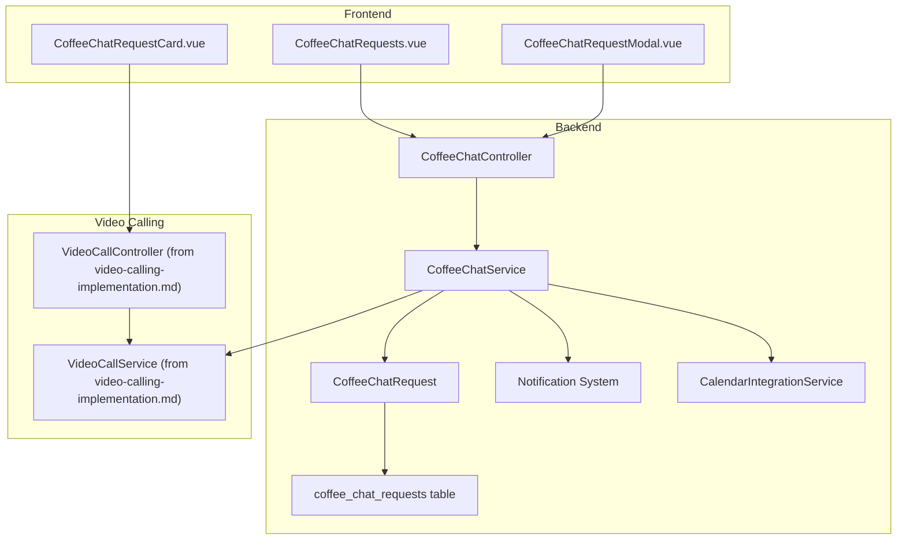
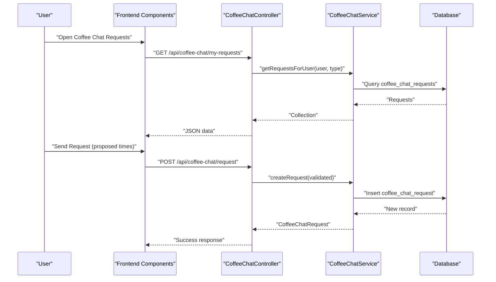
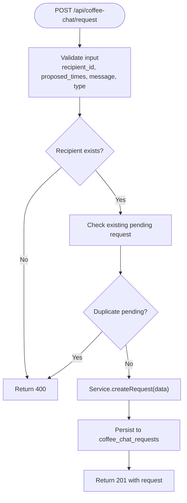
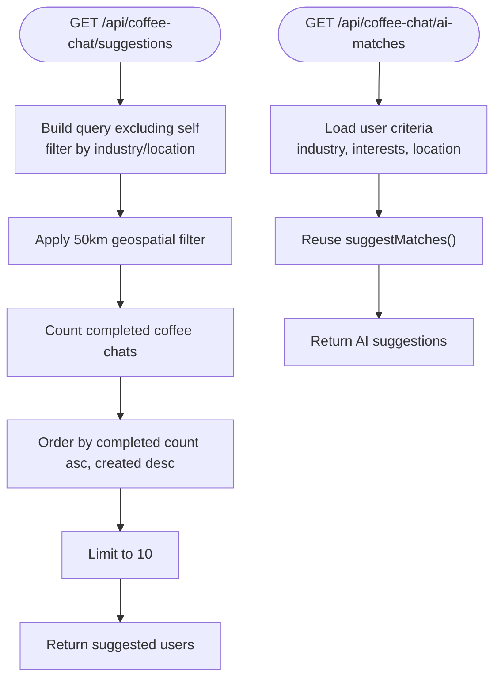
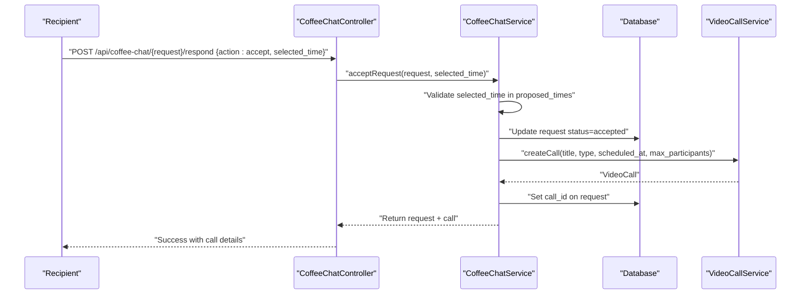
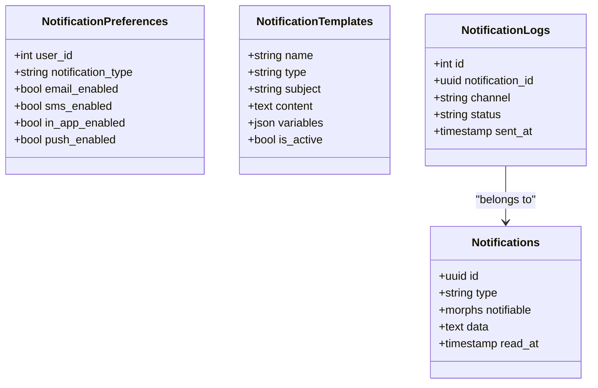
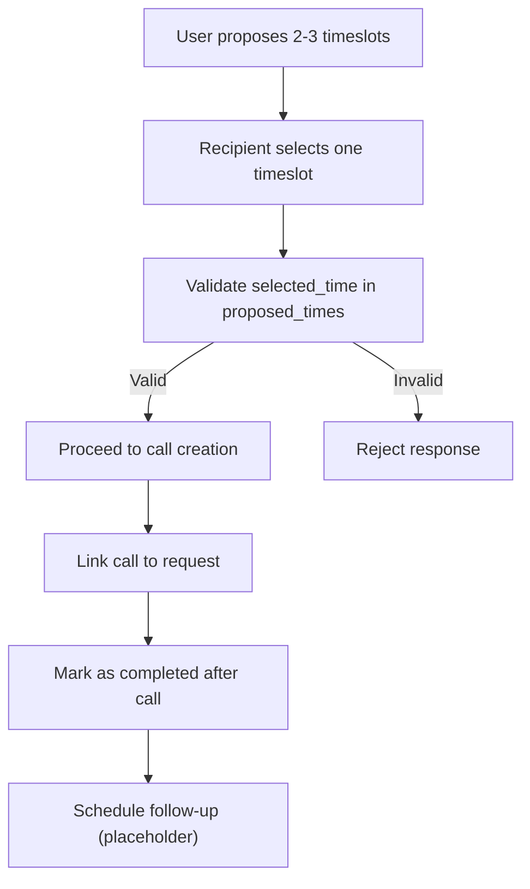
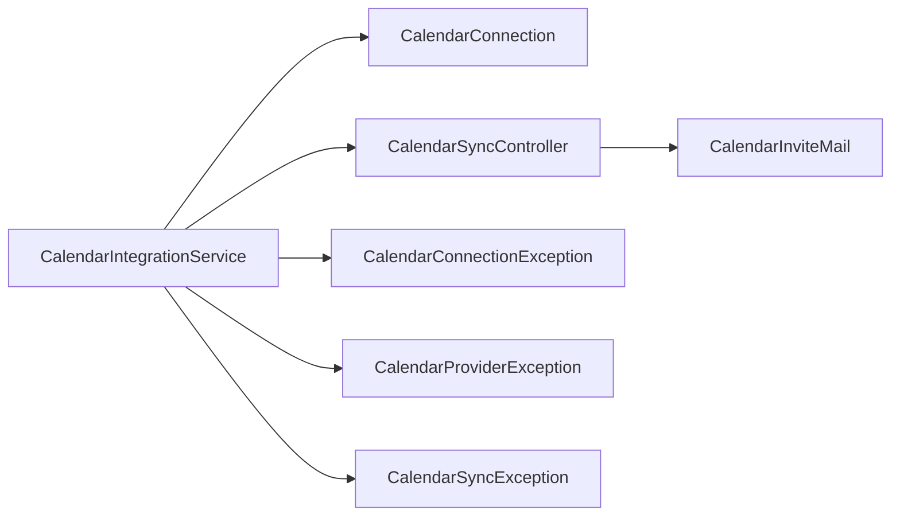
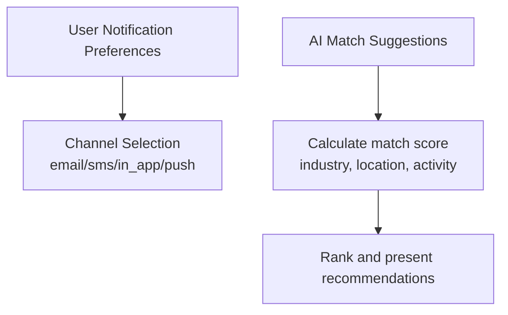
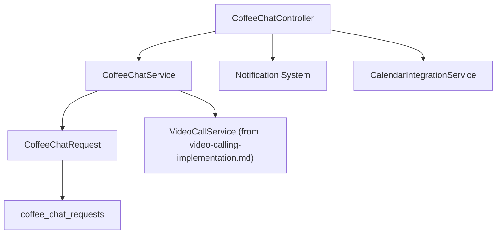

# Coffee Chat Scheduling

<cite>
**Referenced Files in This Document**
- [CoffeeChatController.php](file://app/Http/Controllers/Api/CoffeeChatController.php)
- [CoffeeChatService.php](file://app/Services/CoffeeChatService.php)
- [CoffeeChatRequest.php](file://app/Models/CoffeeChatRequest.php)
- [create_coffee_chat_requests_table.php](file://database/migrations/2025_08_14_213604_create_coffee_chat_requests_table.php)
- [CoffeeChatRequests.vue](file://resources/js/components/CoffeeChat/CoffeeChatRequests.vue)
- [CoffeeChatRequestModal.vue](file://resources/js/components/CoffeeChat/CoffeeChatRequestModal.vue)
- [CoffeeChatRequestCard.vue](file://resources/js/components/VideoCall/CoffeeChatRequestCard.vue)
- [2025_07_15_000007_create_notifications_table.php](file://database/migrations/2025_07_15_000007_create_notifications_table.php)
- [ConnectionRequestNotification.php](file://app/Notifications/ConnectionRequestNotification.php)
- [SessionScheduledNotification.php](file://app/Notifications/SessionScheduledNotification.php)
- [CalendarIntegrationService.php](file://app/Services/CalendarIntegrationService.php)
- [CalendarConnection.php](file://app/Models/CalendarConnection.php)
- [CalendarSyncController.php](file://app/Http/Controllers/Api/CalendarSyncController.php)
- [CalendarInviteMail.php](file://app/Mail/CalendarInviteMail.php)
- [CalendarConnectionException.php](file://app/Exceptions/CalendarConnectionException.php)
- [CalendarProviderException.php](file://app/Exceptions/CalendarProviderException.php)
- [CalendarSyncException.php](file://app/Exceptions/CalendarSyncException.php)
- [MentorshipService.php](file://app/Services/MentorshipService.php)
- [MentorCard.vue](file://resources/js/components/MentorCard.vue)
</cite>

## Table of Contents
1. [Introduction](#introduction)
2. [Project Structure](#project-structure)
3. [Core Components](#core-components)
4. [Architecture Overview](#architecture-overview)
5. [Detailed Component Analysis](#detailed-component-analysis)
6. [Dependency Analysis](#dependency-analysis)
7. [Performance Considerations](#performance-considerations)
8. [Troubleshooting Guide](#troubleshooting-guide)
9. [Conclusion](#conclusion)
10. [Appendices](#appendices)

## Introduction
This document describes the coffee chat scheduling system that enables informal networking among alumni, supports mentorship opportunities, and coordinates virtual meetings. It covers request creation, matching algorithms, scheduling coordination, notifications, availability management, conflict resolution, reminders, calendar integrations, privacy controls, and connection recommendations. The system integrates with video calling infrastructure and provides user experience enhancements for seamless chat scheduling.

## Project Structure
The coffee chat system spans backend controllers and services, database models and migrations, frontend components, and notification and calendar integration layers. The following diagram shows the primary components and their relationships.

**Diagram sources**
- [CoffeeChatController.php:1-204](file://app/Http/Controllers/Api/CoffeeChatController.php#L1-L204)
- [CoffeeChatService.php:1-142](file://app/Services/CoffeeChatService.php#L1-L142)
- [CoffeeChatRequest.php:1-99](file://app/Models/CoffeeChatRequest.php#L1-L99)
- [create_coffee_chat_requests_table.php:1-41](file://database/migrations/2025_08_14_213604_create_coffee_chat_requests_table.php#L1-L41)
- [CoffeeChatRequests.vue:1-411](file://resources/js/components/CoffeeChat/CoffeeChatRequests.vue#L1-L411)
- [CoffeeChatRequestModal.vue:1-237](file://resources/js/components/CoffeeChat/CoffeeChatRequestModal.vue#L1-L237)
- [CoffeeChatRequestCard.vue:1-161](file://resources/js/components/VideoCall/CoffeeChatRequestCard.vue#L1-L161)

**Section sources**
- [CoffeeChatController.php:1-204](file://app/Http/Controllers/Api/CoffeeChatController.php#L1-L204)
- [CoffeeChatService.php:1-142](file://app/Services/CoffeeChatService.php#L1-L142)
- [CoffeeChatRequest.php:1-99](file://app/Models/CoffeeChatRequest.php#L1-L99)
- [create_coffee_chat_requests_table.php:1-41](file://database/migrations/2025_08_14_213604_create_coffee_chat_requests_table.php#L1-L41)
- [CoffeeChatRequests.vue:1-411](file://resources/js/components/CoffeeChat/CoffeeChatRequests.vue#L1-L411)
- [CoffeeChatRequestModal.vue:1-237](file://resources/js/components/CoffeeChat/CoffeeChatRequestModal.vue#L1-L237)
- [CoffeeChatRequestCard.vue:1-161](file://resources/js/components/VideoCall/CoffeeChatRequestCard.vue#L1-L161)

## Core Components
- CoffeeChatController: Handles API endpoints for suggestions, creating requests, responding to requests, and retrieving user requests.
- CoffeeChatService: Implements matching logic, request lifecycle, and integration with video calling and notifications.
- CoffeeChatRequest model: Represents chat requests with proposed times, selection, status, and relations to users and video calls.
- Database migration: Defines the coffee_chat_requests table with indexes and JSON fields for proposed times and matching criteria.
- Frontend components: Provide request listing, response modals, and request cards for scheduling and joining calls.
- Notification system: Supports in-app and email notifications for connection and session scheduling.
- Calendar integration: Provides calendar sync capabilities and exceptions for robust error handling.

**Section sources**
- [CoffeeChatController.php:18-202](file://app/Http/Controllers/Api/CoffeeChatController.php#L18-L202)
- [CoffeeChatService.php:16-140](file://app/Services/CoffeeChatService.php#L16-L140)
- [CoffeeChatRequest.php:10-98](file://app/Models/CoffeeChatRequest.php#L10-L98)
- [create_coffee_chat_requests_table.php:14-30](file://database/migrations/2025_08_14_213604_create_coffee_chat_requests_table.php#L14-L30)
- [2025_07_15_000007_create_notifications_table.php:12-55](file://database/migrations/2025_07_15_000007_create_notifications_table.php#L12-L55)
- [CalendarIntegrationService.php](file://app/Services/CalendarIntegrationService.php)

## Architecture Overview
The system follows a layered architecture:
- Presentation: Vue components manage user interactions for sending requests, viewing requests, and scheduling calls.
- API: Laravel controller validates inputs, enforces access control, and delegates to the service layer.
- Service: Encapsulates business logic for matching, request lifecycle, and integrations.
- Persistence: Eloquent model and migration define request records and relationships.
- Integrations: Notifications and calendar services support cross-channel communication and scheduling.

**Diagram sources**
- [CoffeeChatController.php:53-88](file://app/Http/Controllers/Api/CoffeeChatController.php#L53-L88)
- [CoffeeChatService.php:43-53](file://app/Services/CoffeeChatService.php#L43-L53)
- [CoffeeChatRequest.php:43-59](file://app/Models/CoffeeChatRequest.php#L43-L59)

## Detailed Component Analysis

### Request Creation and Validation
- Endpoint: POST /api/coffee-chat/request
- Validation ensures recipient exists, proposed times are arrays of future dates, optional message length limits, and request type enumeration.
- Duplicate pending requests between the same pair are prevented.
- Service creates the request and returns the created record with eager-loaded requester and recipient.

**Diagram sources**
- [CoffeeChatController.php:53-88](file://app/Http/Controllers/Api/CoffeeChatController.php#L53-L88)
- [CoffeeChatService.php:43-53](file://app/Services/CoffeeChatService.php#L43-L53)
- [CoffeeChatRequest.php:10-26](file://app/Models/CoffeeChatRequest.php#L10-L26)

**Section sources**
- [CoffeeChatController.php:53-88](file://app/Http/Controllers/Api/CoffeeChatController.php#L53-L88)
- [CoffeeChatService.php:43-53](file://app/Services/CoffeeChatService.php#L43-L53)
- [CoffeeChatRequest.php:10-26](file://app/Models/CoffeeChatRequest.php#L10-L26)

### Matching Algorithms
- Suggestion endpoint: GET /api/coffee-chat/suggestions supports filtering by industry, location, and interests.
- Matching prioritizes users with fewer completed coffee chats and geographic proximity within a 50km radius.
- AI matches endpoint: GET /api/coffee-chat/ai-matches generates suggestions using user profile data and interests.
- Matching score calculation considers industry alignment, location proximity, mutual connections (placeholder), and activity level.

**Diagram sources**
- [CoffeeChatController.php:21-48](file://app/Http/Controllers/Api/CoffeeChatController.php#L21-L48)
- [CoffeeChatService.php:16-41](file://app/Services/CoffeeChatService.php#L16-L41)
- [CoffeeChatService.php:89-99](file://app/Services/CoffeeChatService.php#L89-L99)
- [CoffeeChatService.php:110-140](file://app/Services/CoffeeChatService.php#L110-L140)

**Section sources**
- [CoffeeChatController.php:21-48](file://app/Http/Controllers/Api/CoffeeChatController.php#L21-L48)
- [CoffeeChatService.php:16-41](file://app/Services/CoffeeChatService.php#L16-L41)
- [CoffeeChatService.php:89-99](file://app/Services/CoffeeChatService.php#L89-L99)
- [CoffeeChatService.php:110-140](file://app/Services/CoffeeChatService.php#L110-L140)

### Scheduling Coordination and Call Creation
- Respond endpoint: POST /api/coffee-chat/{request}/respond accepts or declines a request.
- Acceptance requires the selected time to be one of the proposed times; upon acceptance, a video call is created and linked to the request.
- The service updates the request status and associates the call ID.

**Diagram sources**
- [CoffeeChatController.php:93-145](file://app/Http/Controllers/Api/CoffeeChatController.php#L93-L145)
- [CoffeeChatService.php:55-75](file://app/Services/CoffeeChatService.php#L55-L75)

**Section sources**
- [CoffeeChatController.php:93-145](file://app/Http/Controllers/Api/CoffeeChatController.php#L93-L145)
- [CoffeeChatService.php:55-75](file://app/Services/CoffeeChatService.php#L55-L75)

### Notification System for Chat Requests and Confirmations
- Notification infrastructure includes tables for notifications, templates, preferences, and logs.
- Example notifications:
  - ConnectionRequestNotification: database and broadcast channels with mail representation.
  - SessionScheduledNotification: mail and database channels for mentorship sessions.
- These patterns can be extended to notify users of coffee chat request status changes and scheduled calls.

**Diagram sources**
- [2025_07_15_000007_create_notifications_table.php:12-55](file://database/migrations/2025_07_15_000007_create_notifications_table.php#L12-L55)

**Section sources**
- [2025_07_15_000007_create_notifications_table.php:12-55](file://database/migrations/2025_07_15_000007_create_notifications_table.php#L12-L55)
- [ConnectionRequestNotification.php:13-102](file://app/Notifications/ConnectionRequestNotification.php#L13-L102)
- [SessionScheduledNotification.php:11-53](file://app/Notifications/SessionScheduledNotification.php#L11-L53)

### Availability Management, Conflict Resolution, and Reminders
- Availability management:
  - Users propose multiple time slots; recipients select one from the list during acceptance.
  - The system validates that the chosen time exists in the proposed list.
- Conflict resolution:
  - Prevent duplicate pending requests between the same pair.
  - Future enhancements can include checking against existing scheduled calls or calendar events.
- Reminders:
  - The service includes a placeholder for scheduling follow-up reminders or surveys after a call completes.

**Diagram sources**
- [CoffeeChatController.php:111-124](file://app/Http/Controllers/Api/CoffeeChatController.php#L111-L124)
- [CoffeeChatService.php:55-75](file://app/Services/CoffeeChatService.php#L55-L75)
- [CoffeeChatService.php:101-108](file://app/Services/CoffeeChatService.php#L101-L108)

**Section sources**
- [CoffeeChatController.php:66-79](file://app/Http/Controllers/Api/CoffeeChatController.php#L66-L79)
- [CoffeeChatController.php:111-124](file://app/Http/Controllers/Api/CoffeeChatController.php#L111-L124)
- [CoffeeChatService.php:101-108](file://app/Services/CoffeeChatService.php#L101-L108)

### Integration with Calendar Systems and Meeting Platforms
- Calendar integration service and models support connecting calendars and syncing events.
- Exception classes encapsulate calendar-related errors for robust handling.
- Calendar invite emails can be generated and sent to participants.
- Integration with video calling services allows seamless scheduling and joining of calls.

**Diagram sources**
- [CalendarIntegrationService.php](file://app/Services/CalendarIntegrationService.php)
- [CalendarConnection.php](file://app/Models/CalendarConnection.php)
- [CalendarSyncController.php](file://app/Http/Controllers/Api/CalendarSyncController.php)
- [CalendarInviteMail.php](file://app/Mail/CalendarInviteMail.php)
- [CalendarConnectionException.php](file://app/Exceptions/CalendarConnectionException.php)
- [CalendarProviderException.php](file://app/Exceptions/CalendarProviderException.php)
- [CalendarSyncException.php](file://app/Exceptions/CalendarSyncException.php)

**Section sources**
- [CalendarIntegrationService.php](file://app/Services/CalendarIntegrationService.php)
- [CalendarConnection.php](file://app/Models/CalendarConnection.php)
- [CalendarSyncController.php](file://app/Http/Controllers/Api/CalendarSyncController.php)
- [CalendarInviteMail.php](file://app/Mail/CalendarInviteMail.php)
- [CalendarConnectionException.php](file://app/Exceptions/CalendarConnectionException.php)
- [CalendarProviderException.php](file://app/Exceptions/CalendarProviderException.php)
- [CalendarSyncException.php](file://app/Exceptions/CalendarSyncException.php)

### Privacy Controls and Connection Recommendations
- Privacy controls are supported by the notification preferences table allowing users to opt-in/out per notification type.
- Connection recommendations can leverage matching scores and AI suggestions similar to mentorship scoring.
- The mentorship service demonstrates weighted scoring for industry alignment, career stage compatibility, location proximity, and availability.

**Diagram sources**
- [2025_07_15_000007_create_notifications_table.php:21-32](file://database/migrations/2025_07_15_000007_create_notifications_table.php#L21-L32)
- [MentorshipService.php:52-72](file://app/Services/MentorshipService.php#L52-L72)
- [MentorCard.vue:75-90](file://resources/js/components/MentorCard.vue#L75-L90)

**Section sources**
- [2025_07_15_000007_create_notifications_table.php:21-32](file://database/migrations/2025_07_15_000007_create_notifications_table.php#L21-L32)
- [MentorshipService.php:52-72](file://app/Services/MentorshipService.php#L52-L72)
- [MentorCard.vue:75-90](file://resources/js/components/MentorCard.vue#L75-L90)

### Examples of Coffee Chat Workflows and Success Metrics
- Workflow example:
  - User A sends a coffee chat request to User B with 3 proposed times.
  - User B receives the request, reviews proposed times, and selects one.
  - The system creates a 1:1 video call and links it to the request.
  - Both users receive notifications; User A can join the call.
- Success metrics (examples):
  - Request acceptance rate (accepted/total sent).
  - Average time to first response.
  - Completion rate (marked completed after call).
  - User satisfaction from follow-up surveys (placeholder in service).

**Section sources**
- [CoffeeChatController.php:126-135](file://app/Http/Controllers/Api/CoffeeChatController.php#L126-L135)
- [CoffeeChatService.php:101-108](file://app/Services/CoffeeChatService.php#L101-L108)

### Matching Algorithm Optimization and User Experience Improvements
- Optimization opportunities:
  - Indexes on status, requester_id, and recipient_id improve query performance.
  - Geospatial indexing and queries can refine proximity matching.
  - Machine learning features can enhance AI matching using richer embeddings and collaborative filtering.
- UX improvements:
  - Auto-fill default time slots with intelligent defaults.
  - Visual indicators for accepted vs. proposed times.
  - In-app and email notifications for timely reminders.
  - Integration with calendar invites for seamless scheduling.

**Section sources**
- [create_coffee_chat_requests_table.php:27-30](file://database/migrations/2025_08_14_213604_create_coffee_chat_requests_table.php#L27-L30)
- [CoffeeChatRequestModal.vue:228-236](file://resources/js/components/CoffeeChat/CoffeeChatRequestModal.vue#L228-L236)
- [CoffeeChatRequests.vue:386-399](file://resources/js/components/CoffeeChat/CoffeeChatRequests.vue#L386-L399)

## Dependency Analysis
The following diagram highlights key dependencies among components.

**Diagram sources**
- [CoffeeChatController.php:14-16](file://app/Http/Controllers/Api/CoffeeChatController.php#L14-L16)
- [CoffeeChatService.php:12-14](file://app/Services/CoffeeChatService.php#L12-L14)
- [CoffeeChatRequest.php:38-41](file://app/Models/CoffeeChatRequest.php#L38-L41)

**Section sources**
- [CoffeeChatController.php:14-16](file://app/Http/Controllers/Api/CoffeeChatController.php#L14-L16)
- [CoffeeChatService.php:12-14](file://app/Services/CoffeeChatService.php#L12-L14)
- [CoffeeChatRequest.php:38-41](file://app/Models/CoffeeChatRequest.php#L38-L41)

## Performance Considerations
- Database indexes on frequently queried columns (status, requester_id, recipient_id) reduce query times.
- Limit suggestion lists to a reasonable size (e.g., top 10) to minimize rendering overhead.
- Use pagination for request listings to avoid large payloads.
- Offload heavy computations (e.g., AI matching) to queued jobs to keep API responses fast.
- Cache frequently accessed user profiles and preferences to reduce database load.

## Troubleshooting Guide
Common issues and resolutions:
- Duplicate pending requests: The system prevents duplicate pending requests between the same pair; ensure users wait for resolution before resending.
- Invalid selected time: The acceptance endpoint validates that the chosen time is among the proposed times; verify client-side filtering and server-side checks.
- Calendar sync failures: Use exception classes to capture provider-specific errors and surface actionable messages to users.
- Notification delivery: Review notification logs to identify failed deliveries and retry mechanisms.

**Section sources**
- [CoffeeChatController.php:66-79](file://app/Http/Controllers/Api/CoffeeChatController.php#L66-L79)
- [CoffeeChatController.php:117-124](file://app/Http/Controllers/Api/CoffeeChatController.php#L117-L124)
- [CalendarConnectionException.php](file://app/Exceptions/CalendarConnectionException.php)
- [CalendarProviderException.php](file://app/Exceptions/CalendarProviderException.php)
- [CalendarSyncException.php](file://app/Exceptions/CalendarSyncException.php)

## Conclusion
The coffee chat scheduling system provides a robust foundation for alumni networking and mentorship by enabling structured request creation, intelligent matching, and seamless scheduling. With integrated notifications, calendar support, and extensible architecture, the system can evolve to include advanced matching, richer UX, and scalable integrations.

## Appendices
- API endpoints summary:
  - GET /api/coffee-chat/suggestions
  - POST /api/coffee-chat/request
  - POST /api/coffee-chat/{request}/respond
  - GET /api/coffee-chat/my-requests
  - GET /api/coffee-chat/received-requests
  - GET /api/coffee-chat/ai-matches

**Section sources**
- [CoffeeChatController.php:21-202](file://app/Http/Controllers/Api/CoffeeChatController.php#L21-L202)