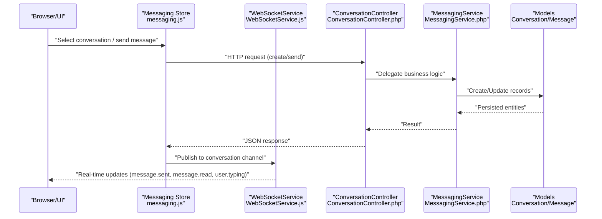
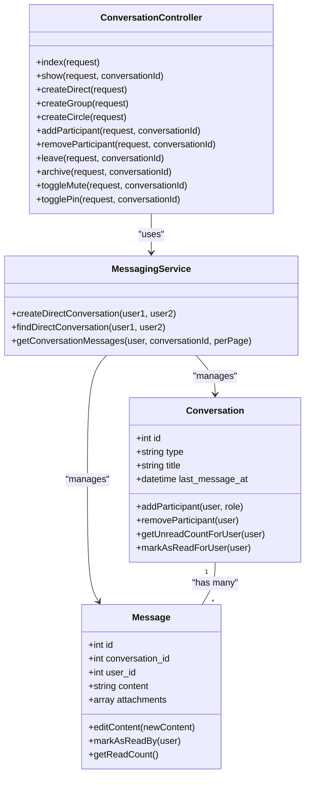
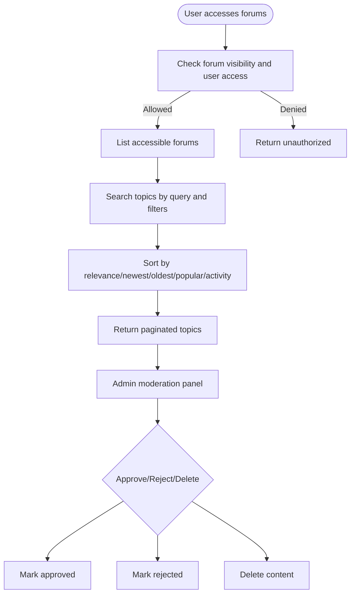
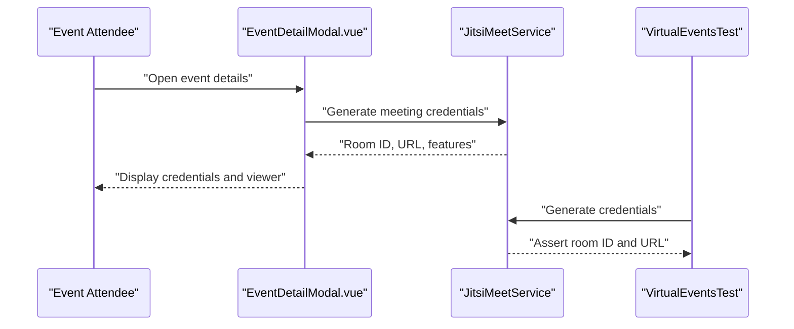
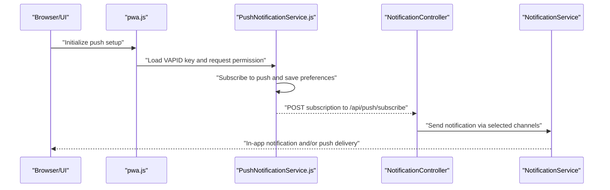
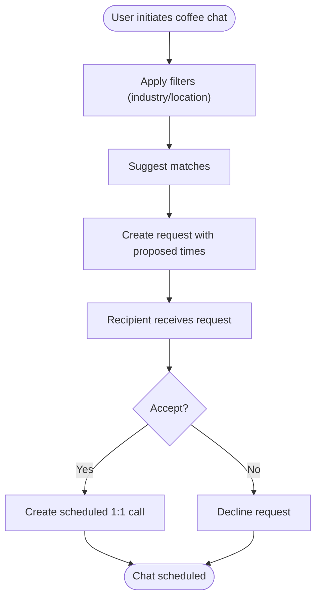
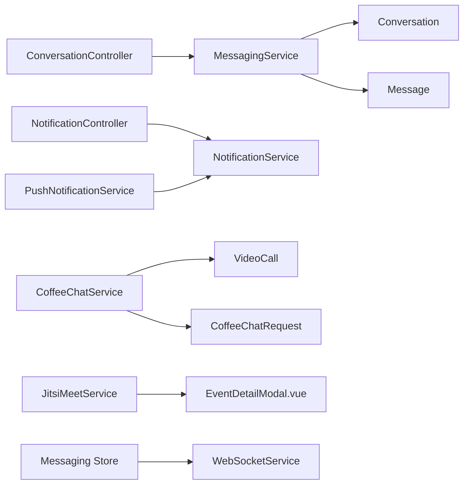

# Communication & Collaboration

<cite>
**Referenced Files in This Document**
- [api.php](file://routes/api.php)
- [ConversationController.php](file://app/Http/Controllers/Api/ConversationController.php)
- [MessagingService.php](file://app/Services/MessagingService.php)
- [Conversation.php](file://app/Models/Conversation.php)
- [Message.php](file://app/Models/Message.php)
- [messaging.js](file://resources/js/Stores/messaging.js)
- [WebSocketService.js](file://resources/js/services/WebSocketService.js)
- [ConversationList.vue](file://resources/js/components/Messaging/ConversationList.vue)
- [NotificationController.php](file://app/Http/Controllers/Api/NotificationController.php)
- [NotificationService.php](file://app/Services/NotificationService.php)
- [PushNotificationService.js](file://resources/js/services/PushNotificationService.js)
- [pwa.js](file://resources/js/pwa.js)
- [ForumService.php](file://app/Services/ForumService.php)
- [Forum.php](file://app/Models/Forum.php)
- [JitsiMeetService.php](file://app/Services/JitsiMeetService.php)
- [EventDetailModal.vue](file://resources/js/components/EventDetailModal.vue)
- [CoffeeChatService.php](file://app/Services/CoffeeChatService.php)
- [CoffeeChatRequest.php](file://app/Models/CoffeeChatRequest.php)
- [VideoCall.php](file://app/Models/VideoCall.php)
- [CoffeeChatRequests.vue](file://resources/js/components/CoffeeChat/CoffeeChatRequests.vue)
- [CoffeeChatModal.vue](file://resources/js/components/VideoCall/CoffeeChatModal.vue)
- [CoffeeChatSuggestions.vue](file://resources/js/components/CoffeeChat/CoffeeChatSuggestions.vue)
- [VirtualEventsTest.php](file://tests/Feature/VirtualEventsTest.php)
- [graduate-user-manual.md](file://docs/user-guides/graduate/graduate-user-manual.md)
- [frequently-asked-questions.md](file://docs/user-guides/faq/frequently-asked-questions.md)
</cite>

## Table of Contents
1. [Introduction](#introduction)
2. [Project Structure](#project-structure)
3. [Core Components](#core-components)
4. [Architecture Overview](#architecture-overview)
5. [Detailed Component Analysis](#detailed-component-analysis)
6. [Dependency Analysis](#dependency-analysis)
7. [Performance Considerations](#performance-considerations)
8. [Troubleshooting Guide](#troubleshooting-guide)
9. [Conclusion](#conclusion)
10. [Appendices](#appendices)

## Introduction
This document describes the integrated communication and collaboration system for messaging, forums, real-time interactions, and virtual events. It covers:
- Integrated messaging system: direct messages, group and circle conversations, and conversation management
- Discussion forums for networking, peer support, and knowledge sharing
- Video calling integration for scheduling, meeting management, and virtual events
- Notification system, real-time updates, and push notifications
- Coffee chat scheduling for informal networking and mentorship
- Practical workflows and collaboration features

## Project Structure
The communication and collaboration features span backend services, API routes, frontend stores and components, and real-time WebSocket integrations.

```mermaid
graph TB
subgraph "Backend"
Routes["Routes<br/>routes/api.php"]
ConvCtrl["ConversationController<br/>app/Http/Controllers/Api/ConversationController.php"]
MsgSvc["MessagingService<br/>app/Services/MessagingService.php"]
NotifCtrl["NotificationController<br/>app/Http/Controllers/Api/NotificationController.php"]
NotifSvc["NotificationService<br/>app/Services/NotificationService.php"]
ForumSvc["ForumService<br/>app/Services/ForumService.php"]
JitsiSvc["JitsiMeetService<br/>app/Services/JitsiMeetService.php"]
CoffeeSvc["CoffeeChatService<br/>app/Services/CoffeeChatService.php"]
end
subgraph "Models"
Conv["Conversation<br/>app/Models/Conversation.php"]
Msg["Message<br/>app/Models/Message.php"]
Forum["Forum<br/>app/Models/Forum.php"]
VC["VideoCall<br/>app/Models/VideoCall.php"]
CCR["CoffeeChatRequest<br/>app/Models/CoffeeChatRequest.php"]
end
subgraph "Frontend"
Store["Messaging Store<br/>resources/js/Stores/messaging.js"]
WS["WebSocketService<br/>resources/js/services/WebSocketService.js"]
ConvList["ConversationList.vue<br/>resources/js/components/Messaging/ConversationList.vue"]
PWA["PWA Push Setup<br/>resources/js/pwa.js"]
PushSvc["PushNotificationService.js<br/>resources/js/services/PushNotificationService.js"]
EventModal["EventDetailModal.vue<br/>resources/js/components/EventDetailModal.vue"]
CoffeeReq["CoffeeChatRequests.vue<br/>resources/js/components/CoffeeChat/CoffeeChatRequests.vue"]
CoffeeModal["CoffeeChatModal.vue<br/>resources/js/components/VideoCall/CoffeeChatModal.vue"]
CoffeeSuggest["CoffeeChatSuggestions.vue<br/>resources/js/components/CoffeeChat/CoffeeChatSuggestions.vue"]
end
Routes --> ConvCtrl
ConvCtrl --> MsgSvc
MsgSvc --> Conv
MsgSvc --> Msg
NotifCtrl --> NotifSvc
ForumSvc --> Forum
CoffeeSvc --> VC
CoffeeSvc --> CCR
JitsiSvc --> EventModal
Store --> WS
Store --> ConvList
PWA --> PushSvc
PushSvc --> NotifSvc
EventModal --> JitsiSvc
CoffeeReq --> CoffeeSvc
CoffeeModal --> CoffeeSvc
CoffeeSuggest --> CoffeeSvc
```

**Diagram sources**
- [api.php:757-772](file://routes/api.php#L757-L772)
- [ConversationController.php:54-97](file://app/Http/Controllers/Api/ConversationController.php#L54-L97)
- [MessagingService.php:15-40](file://app/Services/MessagingService.php#L15-L40)
- [Conversation.php:11-223](file://app/Models/Conversation.php#L11-L223)
- [Message.php:11-294](file://app/Models/Message.php#L11-L294)
- [NotificationController.php:14-48](file://app/Http/Controllers/Api/NotificationController.php#L14-L48)
- [NotificationService.php:21-386](file://app/Services/NotificationService.php#L21-L386)
- [ForumService.php:12-274](file://app/Services/ForumService.php#L12-L274)
- [Forum.php:10-101](file://app/Models/Forum.php#L10-L101)
- [JitsiMeetService.php:319-344](file://app/Services/JitsiMeetService.php#L319-L344)
- [CoffeeChatService.php:10-142](file://app/Services/CoffeeChatService.php#L10-L142)
- [CoffeeChatRequest.php:8-99](file://app/Models/CoffeeChatRequest.php#L8-L99)
- [VideoCall.php:10-126](file://app/Models/VideoCall.php#L10-L126)
- [messaging.js:1-540](file://resources/js/Stores/messaging.js#L1-L540)
- [WebSocketService.js:348-394](file://resources/js/services/WebSocketService.js#L348-L394)
- [ConversationList.vue:242-299](file://resources/js/components/Messaging/ConversationList.vue#L242-L299)
- [pwa.js:119-160](file://resources/js/pwa.js#L119-L160)
- [PushNotificationService.js:1-415](file://resources/js/services/PushNotificationService.js#L1-L415)
- [EventDetailModal.vue:170-204](file://resources/js/components/EventDetailModal.vue#L170-L204)
- [CoffeeChatRequests.vue:146-192](file://resources/js/components/CoffeeChat/CoffeeChatRequests.vue#L146-L192)
- [CoffeeChatModal.vue:1-26](file://resources/js/components/VideoCall/CoffeeChatModal.vue#L1-L26)
- [CoffeeChatSuggestions.vue:1-40](file://resources/js/components/CoffeeChat/CoffeeChatSuggestions.vue#L1-L40)

**Section sources**
- [api.php:757-772](file://routes/api.php#L757-L772)
- [messaging.js:1-540](file://resources/js/Stores/messaging.js#L1-L540)
- [WebSocketService.js:348-394](file://resources/js/services/WebSocketService.js#L348-L394)
- [ConversationController.php:54-97](file://app/Http/Controllers/Api/ConversationController.php#L54-L97)
- [MessagingService.php:15-40](file://app/Services/MessagingService.php#L15-L40)
- [Conversation.php:11-223](file://app/Models/Conversation.php#L11-L223)
- [Message.php:11-294](file://app/Models/Message.php#L11-L294)
- [NotificationController.php:14-48](file://app/Http/Controllers/Api/NotificationController.php#L14-L48)
- [NotificationService.php:21-386](file://app/Services/NotificationService.php#L21-L386)
- [ForumService.php:12-274](file://app/Services/ForumService.php#L12-L274)
- [Forum.php:10-101](file://app/Models/Forum.php#L10-L101)
- [JitsiMeetService.php:319-344](file://app/Services/JitsiMeetService.php#L319-L344)
- [EventDetailModal.vue:170-204](file://resources/js/components/EventDetailModal.vue#L170-L204)
- [CoffeeChatService.php:10-142](file://app/Services/CoffeeChatService.php#L10-L142)
- [CoffeeChatRequest.php:8-99](file://app/Models/CoffeeChatRequest.php#L8-L99)
- [VideoCall.php:10-126](file://app/Models/VideoCall.php#L10-L126)
- [CoffeeChatRequests.vue:146-192](file://resources/js/components/CoffeeChat/CoffeeChatRequests.vue#L146-L192)
- [CoffeeChatModal.vue:1-26](file://resources/js/components/VideoCall/CoffeeChatModal.vue#L1-L26)
- [CoffeeChatSuggestions.vue:1-40](file://resources/js/components/CoffeeChat/CoffeeChatSuggestions.vue#L1-L40)

## Core Components
- Messaging system: backend controllers and services manage conversations and messages; frontend Pinia store and WebSocket service power real-time UI.
- Forums: service and model orchestrate accessible forums, topic search, tags, and moderation.
- Video calling and virtual events: Jitsi integration and event modal handle meeting credentials and viewer.
- Notifications: backend controller and service coordinate multi-channel delivery; frontend push service manages subscriptions and preferences.
- Coffee chat: service coordinates matching, requests, acceptance, and creates scheduled calls.

**Section sources**
- [ConversationController.php:54-97](file://app/Http/Controllers/Api/ConversationController.php#L54-L97)
- [MessagingService.php:15-40](file://app/Services/MessagingService.php#L15-L40)
- [ForumService.php:12-274](file://app/Services/ForumService.php#L12-L274)
- [JitsiMeetService.php:319-344](file://app/Services/JitsiMeetService.php#L319-L344)
- [NotificationController.php:14-48](file://app/Http/Controllers/Api/NotificationController.php#L14-L48)
- [NotificationService.php:21-386](file://app/Services/NotificationService.php#L21-L386)
- [CoffeeChatService.php:10-142](file://app/Services/CoffeeChatService.php#L10-L142)

## Architecture Overview
The system integrates REST APIs, domain services, Eloquent models, and a reactive frontend with real-time WebSocket channels.

**Diagram sources**
- [messaging.js:1-540](file://resources/js/Stores/messaging.js#L1-L540)
- [WebSocketService.js:348-394](file://resources/js/services/WebSocketService.js#L348-L394)
- [ConversationController.php:54-97](file://app/Http/Controllers/Api/ConversationController.php#L54-L97)
- [MessagingService.php:15-40](file://app/Services/MessagingService.php#L15-L40)
- [Conversation.php:11-223](file://app/Models/Conversation.php#L11-L223)
- [Message.php:11-294](file://app/Models/Message.php#L11-L294)

## Detailed Component Analysis

### Integrated Messaging System
- Conversation lifecycle: create direct, group, and circle conversations; manage participants, mute/pin/archive; track unread counts and last read timestamps.
- Message lifecycle: send, edit, delete, reply, read receipts; pagination and search.
- Real-time updates: WebSocket channels for message events and typing indicators.

**Diagram sources**
- [ConversationController.php:54-97](file://app/Http/Controllers/Api/ConversationController.php#L54-L97)
- [MessagingService.php:15-40](file://app/Services/MessagingService.php#L15-L40)
- [Conversation.php:11-223](file://app/Models/Conversation.php#L11-L223)
- [Message.php:11-294](file://app/Models/Message.php#L11-L294)

Practical workflow: Create a direct conversation
- Client calls the create-direct route with target user ID.
- Backend validates and delegates to MessagingService.
- MessagingService checks for existing conversation or creates a new one with both users as participants.
- Frontend receives the new conversation and subscribes to its WebSocket channel.

**Section sources**
- [api.php:757-772](file://routes/api.php#L757-L772)
- [ConversationController.php:54-97](file://app/Http/Controllers/Api/ConversationController.php#L54-L97)
- [MessagingService.php:15-40](file://app/Services/MessagingService.php#L15-L40)
- [Conversation.php:11-223](file://app/Models/Conversation.php#L11-L223)
- [Message.php:11-294](file://app/Models/Message.php#L11-L294)
- [messaging.js:1-540](file://resources/js/Stores/messaging.js#L1-L540)
- [WebSocketService.js:348-394](file://resources/js/services/WebSocketService.js#L348-L394)

### Discussion Forums
- Access control: public, group-only, and private forums with membership checks.
- Topic search: relevance-based sorting across title/content and tag filtering.
- Moderation: approve/reject/delete topics/posts with access-scoped visibility.
- Statistics: active users, popular forums, recent activity.

**Diagram sources**
- [ForumService.php:12-274](file://app/Services/ForumService.php#L12-L274)
- [Forum.php:10-101](file://app/Models/Forum.php#L10-L101)

**Section sources**
- [ForumService.php:12-274](file://app/Services/ForumService.php#L12-L274)
- [Forum.php:10-101](file://app/Models/Forum.php#L10-L101)
- [graduate-user-manual.md:132-142](file://docs/user-guides/graduate/graduate-user-manual.md#L132-L142)
- [frequently-asked-questions.md:150-157](file://docs/user-guides/faq/frequently-asked-questions.md#L150-L157)

### Video Calling and Virtual Events
- Meeting credentials generation and platform-specific instructions.
- Event modal displays meeting credentials and virtual viewer for Jitsi or embeddable meetings.
- Tests verify meeting credentials and settings updates.

**Diagram sources**
- [EventDetailModal.vue:170-204](file://resources/js/components/EventDetailModal.vue#L170-L204)
- [JitsiMeetService.php:319-344](file://app/Services/JitsiMeetService.php#L319-L344)
- [VirtualEventsTest.php:183-216](file://tests/Feature/VirtualEventsTest.php#L183-L216)

**Section sources**
- [EventDetailModal.vue:170-204](file://resources/js/components/EventDetailModal.vue#L170-L204)
- [JitsiMeetService.php:319-344](file://app/Services/JitsiMeetService.php#L319-L344)
- [VirtualEventsTest.php:183-216](file://tests/Feature/VirtualEventsTest.php#L183-L216)

### Notifications, Real-Time Updates, and Push Notifications
- Backend: NotificationController handles sending and preferences; NotificationService orchestrates multi-channel delivery (email, SMS, in-app, push) with caching and logging.
- Frontend: PushNotificationService manages browser push subscriptions, preferences, and test notifications; PWA integration sets up VAPID keys and permission prompts.

**Diagram sources**
- [pwa.js:119-160](file://resources/js/pwa.js#L119-L160)
- [PushNotificationService.js:1-415](file://resources/js/services/PushNotificationService.js#L1-L415)
- [NotificationController.php:14-48](file://app/Http/Controllers/Api/NotificationController.php#L14-L48)
- [NotificationService.php:21-386](file://app/Services/NotificationService.php#L21-L386)

**Section sources**
- [NotificationController.php:14-48](file://app/Http/Controllers/Api/NotificationController.php#L14-L48)
- [NotificationService.php:21-386](file://app/Services/NotificationService.php#L21-L386)
- [PushNotificationService.js:1-415](file://resources/js/services/PushNotificationService.js#L1-L415)
- [pwa.js:119-160](file://resources/js/pwa.js#L119-L160)

### Coffee Chat Scheduling
- Matching: suggest matches by industry and geographic proximity; AI-powered suggestions by profile criteria.
- Requests: create, accept, decline, and track status; acceptance triggers a scheduled 1:1 video call.
- UI: request list, details modal, and suggestions with filters.

**Diagram sources**
- [CoffeeChatService.php:16-108](file://app/Services/CoffeeChatService.php#L16-L108)
- [CoffeeChatRequest.php:8-99](file://app/Models/CoffeeChatRequest.php#L8-L99)
- [VideoCall.php:10-126](file://app/Models/VideoCall.php#L10-L126)
- [CoffeeChatRequests.vue:146-192](file://resources/js/components/CoffeeChat/CoffeeChatRequests.vue#L146-L192)
- [CoffeeChatModal.vue:1-26](file://resources/js/components/VideoCall/CoffeeChatModal.vue#L1-L26)
- [CoffeeChatSuggestions.vue:1-40](file://resources/js/components/CoffeeChat/CoffeeChatSuggestions.vue#L1-L40)

**Section sources**
- [CoffeeChatService.php:16-108](file://app/Services/CoffeeChatService.php#L16-L108)
- [CoffeeChatRequest.php:8-99](file://app/Models/CoffeeChatRequest.php#L8-L99)
- [VideoCall.php:10-126](file://app/Models/VideoCall.php#L10-L126)
- [CoffeeChatRequests.vue:146-192](file://resources/js/components/CoffeeChat/CoffeeChatRequests.vue#L146-L192)
- [CoffeeChatModal.vue:1-26](file://resources/js/components/VideoCall/CoffeeChatModal.vue#L1-L26)
- [CoffeeChatSuggestions.vue:1-40](file://resources/js/components/CoffeeChat/CoffeeChatSuggestions.vue#L1-L40)

## Dependency Analysis
- Controllers depend on services for business logic; services depend on models for persistence.
- Frontend depends on WebSocketService for real-time channels and Pinia store for state.
- Push notifications rely on browser APIs and backend endpoints for subscription management.

**Diagram sources**
- [ConversationController.php:54-97](file://app/Http/Controllers/Api/ConversationController.php#L54-L97)
- [MessagingService.php:15-40](file://app/Services/MessagingService.php#L15-L40)
- [Conversation.php:11-223](file://app/Models/Conversation.php#L11-L223)
- [Message.php:11-294](file://app/Models/Message.php#L11-L294)
- [NotificationController.php:14-48](file://app/Http/Controllers/Api/NotificationController.php#L14-L48)
- [NotificationService.php:21-386](file://app/Services/NotificationService.php#L21-L386)
- [CoffeeChatService.php:10-142](file://app/Services/CoffeeChatService.php#L10-L142)
- [VideoCall.php:10-126](file://app/Models/VideoCall.php#L10-L126)
- [CoffeeChatRequest.php:8-99](file://app/Models/CoffeeChatRequest.php#L8-L99)
- [JitsiMeetService.php:319-344](file://app/Services/JitsiMeetService.php#L319-L344)
- [EventDetailModal.vue:170-204](file://resources/js/components/EventDetailModal.vue#L170-L204)
- [messaging.js:1-540](file://resources/js/Stores/messaging.js#L1-L540)
- [WebSocketService.js:348-394](file://resources/js/services/WebSocketService.js#L348-L394)
- [PushNotificationService.js:1-415](file://resources/js/services/PushNotificationService.js#L1-L415)

**Section sources**
- [ConversationController.php:54-97](file://app/Http/Controllers/Api/ConversationController.php#L54-L97)
- [MessagingService.php:15-40](file://app/Services/MessagingService.php#L15-L40)
- [NotificationController.php:14-48](file://app/Http/Controllers/Api/NotificationController.php#L14-L48)
- [NotificationService.php:21-386](file://app/Services/NotificationService.php#L21-L386)
- [CoffeeChatService.php:10-142](file://app/Services/CoffeeChatService.php#L10-L142)
- [JitsiMeetService.php:319-344](file://app/Services/JitsiMeetService.php#L319-L344)
- [EventDetailModal.vue:170-204](file://resources/js/components/EventDetailModal.vue#L170-L204)
- [messaging.js:1-540](file://resources/js/Stores/messaging.js#L1-L540)
- [WebSocketService.js:348-394](file://resources/js/services/WebSocketService.js#L348-L394)
- [PushNotificationService.js:1-415](file://resources/js/services/PushNotificationService.js#L1-L415)

## Performance Considerations
- Pagination and limits: messaging lists and forum searches apply limits and sorting to reduce payload sizes.
- Caching: notification preferences and templates are cached to minimize repeated lookups.
- Efficient queries: scopes and eager loading reduce N+1 issues in conversations and messages.
- Real-time scaling: WebSocket channels should be monitored for connection limits and message throughput.

[No sources needed since this section provides general guidance]

## Troubleshooting Guide
- Messaging not updating in real-time:
  - Verify WebSocketService channel subscriptions and event listeners for message.sent, message.read, and user.typing.
  - Confirm frontend store joins the correct conversation channel and leaves on navigation.
- Push notifications not received:
  - Ensure browser supports push APIs and user granted permission.
  - Confirm VAPID key loaded and subscription saved to server.
  - Use test notification endpoint to validate delivery pipeline.
- Forum search returns unexpected results:
  - Check visibility scoping and access checks for group-only forums.
  - Validate relevance sorting and tag filters applied.
- Coffee chat request issues:
  - Confirm request status transitions and associated call creation.
  - Verify acceptance flow updates selected time and schedules the call.

**Section sources**
- [WebSocketService.js:348-394](file://resources/js/services/WebSocketService.js#L348-L394)
- [messaging.js:1-540](file://resources/js/Stores/messaging.js#L1-L540)
- [pwa.js:119-160](file://resources/js/pwa.js#L119-L160)
- [PushNotificationService.js:1-415](file://resources/js/services/PushNotificationService.js#L1-L415)
- [ForumService.php:12-274](file://app/Services/ForumService.php#L12-L274)
- [CoffeeChatService.php:55-75](file://app/Services/CoffeeChatService.php#L55-L75)

## Conclusion
The communication and collaboration system integrates robust messaging, forums, real-time updates, and virtual events with a scalable notification backbone. The modular backend services, reactive frontend store, and WebSocket channels provide a responsive user experience, while push notifications and moderation tools support engagement and governance.

[No sources needed since this section summarizes without analyzing specific files]

## Appendices
- Practical examples:
  - Messaging: create a direct conversation, send a message, mark as read, and observe real-time updates.
  - Forums: search topics by keyword and tag, filter by forum, and review moderation queue.
  - Virtual events: generate meeting credentials, open the event viewer, and update meeting settings.
  - Coffee chat: browse suggestions, submit a request, and accept to schedule a 1:1 call.

[No sources needed since this section provides general guidance]